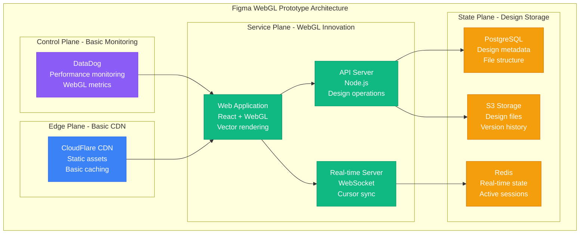
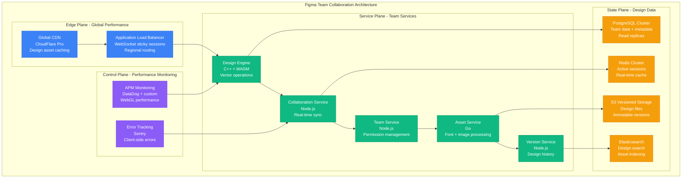
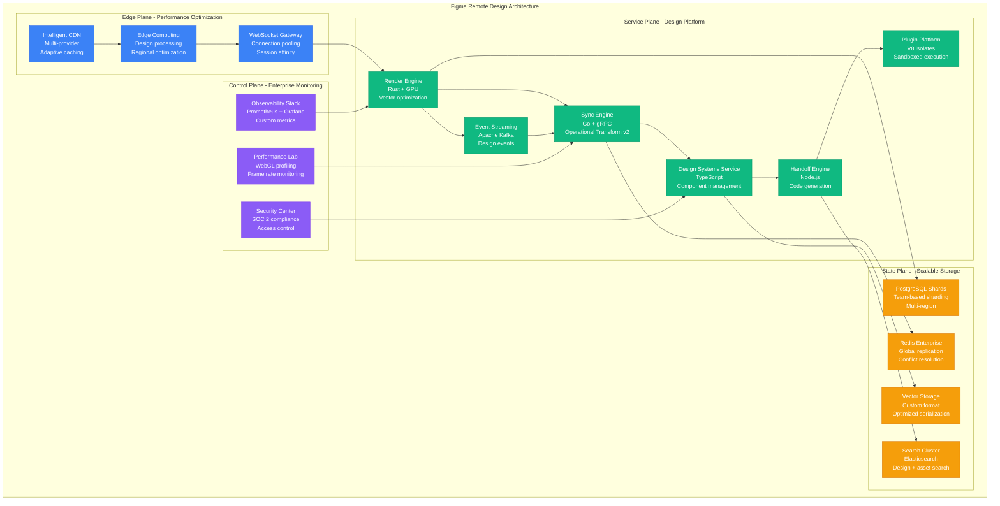
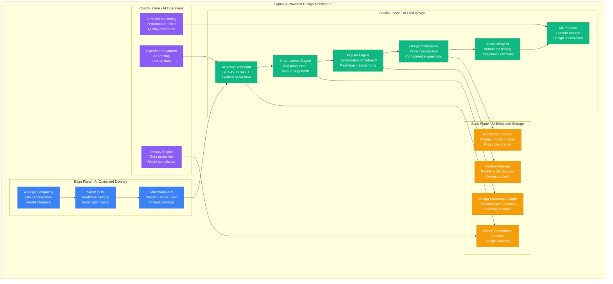

# Figma Scale Evolution: 0 to 5M Designers - Real-Time Collaboration at Scale

## Executive Summary

Figma scaled from a browser-based design tool prototype (2016) to the dominant collaborative design platform serving 5+ million active designers globally. This journey showcases the extreme challenges of scaling real-time multiplayer design editing, vector graphics performance, and design system collaboration while maintaining sub-16ms frame rates for smooth creative workflows.

**Real-Time Design Scaling Achievements:**
- **Active designers**: 1K → 5M+ (5,000x growth)
- **Design files**: 100 → 50M+ files
- **Real-time sessions**: 10 → 500K+ concurrent collaborative sessions
- **Vector objects**: 1K → 100B+ design elements
- **Team workspaces**: 5 → 1M+ organizations

## Phase 1: WebGL Multiplayer Prototype (2016-2017)
**Scale**: 1K-10K designers, beta testing | **Cost**: $5K/month



**Prototype Innovations**:
- **Browser-based vector editing**: WebGL for 60fps design performance
- **Real-time cursors**: See other designers' cursors and selections
- **Operational transforms**: Conflict-free collaborative editing
- **Component system**: Reusable design elements

**Early Challenges**:
- **WebGL performance**: Complex vector operations causing frame drops
- **Memory management**: Large design files crashing browsers
- **Sync conflicts**: Multiple designers editing same objects

**What Broke**: Browser memory limits with complex designs, WebSocket connection instability.

## Phase 2: Team Collaboration and Growth (2017-2019)
**Scale**: 10K-500K designers, team features | **Cost**: $100K/month



**Team Features Innovation**:
- **Component libraries**: Shared design systems across teams
- **Permission system**: Editor, viewer, and admin roles
- **Design system management**: Version control for components
- **Real-time comments**: Contextual feedback on designs

**Production Metrics (2019)**:
- **500K+ active designers**
- **5M+ design files** created
- **50K+ teams** using collaboration features
- **99.5% uptime** for real-time services
- **<50ms p95** for design operations

**What Broke**: Component sync lag across large teams, search performance with millions of design elements.

## Phase 3: Remote Work and Design Systems (2019-2021)
**Scale**: 500K-2M designers, enterprise adoption | **Cost**: $1M/month



**Remote Work Scaling**:
- **Advanced design systems**: Token-based design consistency
- **Developer handoff**: Automatic code generation from designs
- **Plugin ecosystem**: Third-party integrations and automations
- **Enterprise security**: SSO, audit logs, and compliance features

**Production Metrics (2021)**:
- **2M+ active designers** during remote work boom
- **20M+ design files** with version history
- **200K+ design systems** managed
- **99.9% uptime** for collaboration
- **<30ms p95** for real-time operations
- **100K+ concurrent** collaborative sessions

**What Broke**: Plugin execution timeouts, design system sync complexity across large organizations.

## Phase 4: Developer Handoff and Enterprise (2021-2023)
**Scale**: 2M-4M designers, developer integration | **Cost**: $5M/month

```mermaid
graph TB
    subgraph Figma_Developer_Platform[Figma Developer Platform Architecture]
        subgraph EdgePlane[Edge Plane - Developer APIs]
            API_CDN[API CDN<br/>Global edge<br/>Developer tools]
            DEVELOPER_GATEWAY[Developer Gateway<br/>GraphQL + REST<br/>Rate limiting]
            WEBHOOK_DELIVERY[Webhook Delivery<br/>Reliable events<br/>Retry logic]
        end

        subgraph ServicePlane[Service Plane - Development Bridge]
            CODE_GEN_ENGINE[Code Generation Engine<br/>AST + Templates<br/>React/Vue/Flutter]
            DESIGN_TOKENS[Design Tokens Service<br/>JSON + CSS<br/>Multi-platform export]
            INSPECTION_API[Inspection API<br/>Design property access<br/>Real-time queries]
            AUTOMATION_ENGINE[Automation Engine<br/>Workflow automation<br/>CI/CD integration]
            COMPONENT_SYNC[Component Sync<br/>Bidirectional updates<br/>Code ↔ Design]
            ENTERPRISE_SSO[Enterprise SSO<br/>SAML + OIDC<br/>Directory sync]
        end

        subgraph StatePlane[State Plane - Developer Data]
            GRAPH_DATABASE[Graph Database<br/>Neo4j<br/>Component relationships]
            TIME_SERIES_DB[Time Series DB<br/>InfluxDB<br/>Usage analytics]
            BLOB_STORAGE[Blob Storage<br/>Design exports<br/>Generated code]
            AUDIT_STORAGE[Audit Storage<br/>Compliance logs<br/>Immutable records]
        end

        subgraph ControlPlane[Control Plane - Developer Experience]
            DEVELOPER_METRICS[Developer Metrics<br/>API usage analytics<br/>Performance monitoring]
            INTEGRATION_TESTING[Integration Testing<br/>Automated validation<br/>Breaking change detection]
            COMPLIANCE_ENGINE[Compliance Engine<br/>Enterprise governance<br/>Policy enforcement]
        end

        API_CDN --> DEVELOPER_GATEWAY
        DEVELOPER_GATEWAY --> WEBHOOK_DELIVERY
        WEBHOOK_DELIVERY --> CODE_GEN_ENGINE
        CODE_GEN_ENGINE --> DESIGN_TOKENS
        DESIGN_TOKENS --> INSPECTION_API
        INSPECTION_API --> AUTOMATION_ENGINE
        AUTOMATION_ENGINE --> COMPONENT_SYNC
        COMPONENT_SYNC --> ENTERPRISE_SSO
        CODE_GEN_ENGINE --> GRAPH_DATABASE
        DESIGN_TOKENS --> TIME_SERIES_DB
        INSPECTION_API --> BLOB_STORAGE
        ENTERPRISE_SSO --> AUDIT_STORAGE
        DEVELOPER_METRICS --> CODE_GEN_ENGINE
        INTEGRATION_TESTING --> DESIGN_TOKENS
        COMPLIANCE_ENGINE --> ENTERPRISE_SSO
    end

    classDef edgeStyle fill:#3B82F6,stroke:#2563EB,color:#fff
    classDef serviceStyle fill:#10B981,stroke:#059669,color:#fff
    classDef stateStyle fill:#F59E0B,stroke:#D97706,color:#fff
    classDef controlStyle fill:#8B5CF6,stroke:#7C3AED,color:#fff

    class API_CDN,DEVELOPER_GATEWAY,WEBHOOK_DELIVERY edgeStyle
    class CODE_GEN_ENGINE,DESIGN_TOKENS,INSPECTION_API,AUTOMATION_ENGINE,COMPONENT_SYNC,ENTERPRISE_SSO serviceStyle
    class GRAPH_DATABASE,TIME_SERIES_DB,BLOB_STORAGE,AUDIT_STORAGE stateStyle
    class DEVELOPER_METRICS,INTEGRATION_TESTING,COMPLIANCE_ENGINE controlStyle
```



**Developer Platform Features**:
- **REST + GraphQL APIs**: Programmatic design access
- **Code generation**: React, Vue, Flutter from designs
- **Design tokens**: Automated style guide export
- **Webhook integration**: Real-time design change notifications
- **Component libraries**: Bidirectional design-code sync

**Production Metrics (2023)**:
- **4M+ active designers**
- **100K+ developers** using APIs
- **50M+ design files**
- **1M+ organizations** with team features
- **99.95% uptime** for enterprise SLA
- **<20ms p95** for design operations

**What Broke**: API rate limiting during CI/CD integrations, component sync conflicts between design and code changes.

## Phase 5: AI-Powered Design and FigJam Integration (2023-2024)
**Scale**: 4M-5M designers, AI features | **Cost**: $10M/month



**AI Integration Features**:
- **AI design assistant**: Natural language to design generation
- **Smart auto-layout**: Intelligent spacing and alignment
- **FigJam integration**: Collaborative whiteboarding with design handoff
- **Accessibility intelligence**: Automated compliance checking
- **Design pattern recognition**: AI-powered component suggestions

**Current Production Metrics (2024)**:
- **5M+ active designers** globally
- **100M+ design files** with AI enhancement
- **500K+ concurrent** collaborative sessions
- **99.99% uptime** for core design services
- **<16ms frame time** for 60fps design experience
- **1M+ AI requests** per day

## Scale Evolution Summary

| Phase | Timeline | Designers | Files | Key Innovation | Monthly Cost |
|-------|----------|-----------|-------|----------------|--------------|
| **WebGL Prototype** | 2016-2017 | 1K-10K | 1K | Browser vector editing | $5K |
| **Team Collaboration** | 2017-2019 | 10K-500K | 5M | Real-time design systems | $100K |
| **Remote Design** | 2019-2021 | 500K-2M | 20M | Plugin ecosystem | $1M |
| **Developer Platform** | 2021-2023 | 2M-4M | 50M | Code generation | $5M |
| **AI Design** | 2023-2024 | 4M-5M | 100M | AI-powered features | $10M |

## Critical Scaling Lessons

### 1. Real-Time Vector Performance
```
Frame_Time = Vector_Operations + Sync_Overhead + Render_Time
Target: <16ms for 60fps
```
- **Simple designs**: 5-10ms frame time
- **Complex designs**: 15ms+ requires optimization
- **Collaborative designs**: Additional 2-5ms sync overhead

### 2. Collaborative Conflict Resolution
```
Conflict_Probability = Concurrent_Users × Edit_Frequency × Object_Overlap
```
- **2 users**: Minimal conflicts with good UX
- **10+ users**: Requires sophisticated operational transforms
- **100+ users**: Need conflict prevention strategies

### 3. Design File Storage Optimization
```
Storage_Efficiency = Compression_Ratio × Deduplication × Version_Delta
```
- **Raw vector data**: 10-100MB per complex design
- **Optimized storage**: 90% compression typical
- **Version deltas**: 95% storage savings

### 4. WebGL Memory Management
```
Memory_Usage = Vector_Objects × Properties × Render_Cache
Browser_Limit: ~2GB before crashes
```
- **Component instances**: Share memory efficiently
- **Offscreen rendering**: Reduce active memory
- **Garbage collection**: Critical for long sessions

## The 3 AM Lessons

### Incident: Remote Work Traffic Surge (March 2020)
**Problem**: 500% traffic increase, widespread design file corruption
**Root Cause**: Concurrent edit conflicts during rapid scaling
**Fix**: Improved operational transforms + conflict resolution UI
**Prevention**: Load testing with realistic collaboration patterns

### Incident: Large Design File Performance (2019)
**Problem**: Browser crashes with 10,000+ design elements
**Root Cause**: WebGL memory exhaustion and inefficient rendering
**Fix**: Virtual rendering + LOD system + memory pooling
**Prevention**: Design complexity monitoring + user warnings

### Incident: Plugin Execution Timeouts (2021)
**Problem**: Third-party plugins causing design editor freezes
**Root Cause**: Uncontrolled plugin execution blocking main thread
**Fix**: V8 isolates + execution limits + async APIs
**Prevention**: Plugin performance monitoring + sandboxing

### Incident: Design System Sync Conflicts (2022)
**Problem**: Component updates causing inconsistencies across teams
**Root Cause**: Race conditions in component version propagation
**Fix**: Component versioning system + conflict resolution UI
**Prevention**: Staged rollouts for component library updates

## Current Architecture Principles (2024)

1. **60fps performance**: Every design operation maintains smooth frame rates
2. **Real-time collaboration**: Sub-100ms sync for live design sessions
3. **Developer integration**: APIs that bridge design and development workflows
4. **AI augmentation**: Machine learning enhances but doesn't replace design intuition
5. **Global accessibility**: Sub-second load times worldwide for design files
6. **Plugin ecosystem**: Safe, performant third-party integrations
7. **Enterprise security**: SOC 2 compliance with design workflow integration
8. **Cross-platform consistency**: Identical experience across web and desktop

## Technology Evolution Impact

### 2016-2017: WebGL Innovation
- **Innovation**: Browser-based vector editing with collaborative cursors
- **Challenge**: WebGL performance and memory management
- **Result**: Unique real-time design collaboration experience

### 2018-2019: Team Scaling
- **Innovation**: Component libraries and design systems
- **Challenge**: Conflict resolution with multiple designers
- **Result**: Industry-standard design system management

### 2020-2021: Remote Work Adoption
- **Innovation**: Plugin ecosystem and developer handoff tools
- **Challenge**: 10x traffic growth during pandemic
- **Result**: Became essential tool for distributed design teams

### 2022-2024: AI Integration
- **Innovation**: AI-powered design assistance and automation
- **Challenge**: Balancing AI capabilities with designer control
- **Result**: Enhanced productivity while preserving creative agency

Figma's evolution from a WebGL prototype to an AI-powered design platform demonstrates that successful scaling of creative tools requires exceptional performance optimization, sophisticated conflict resolution for real-time collaboration, and seamless integration between design and development workflows.

*"Designing software for designers means every performance decision affects the creative flow. Latency isn't just a technical metric - it's the difference between inspiration and frustration."* - Figma Engineering Team