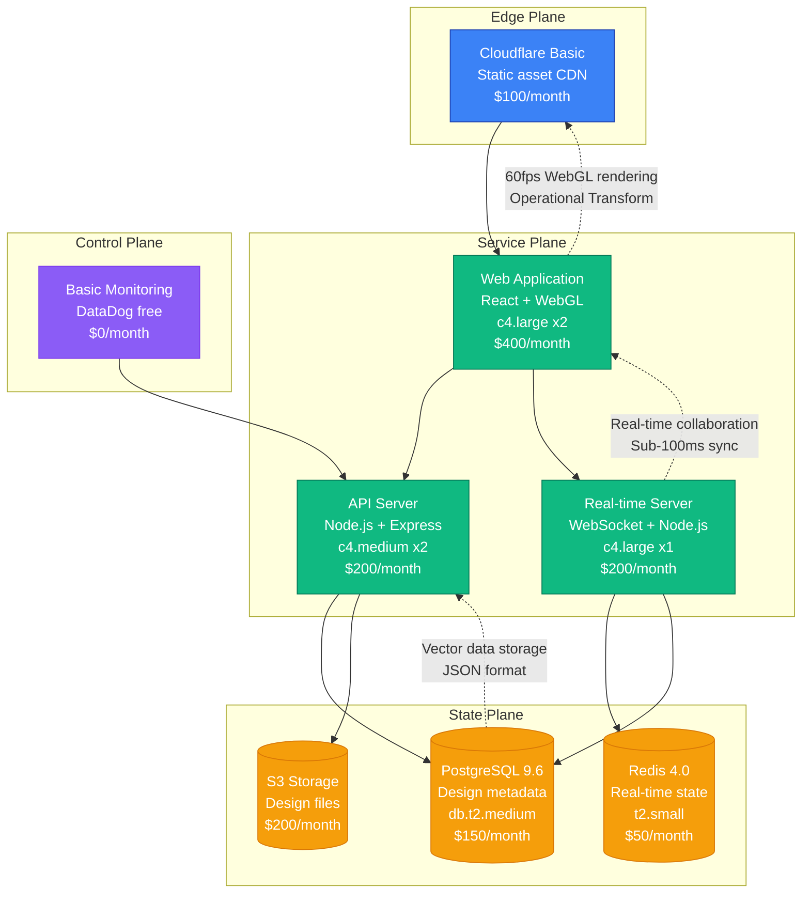
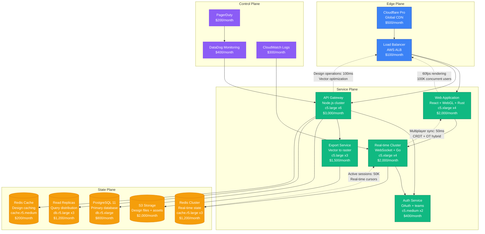
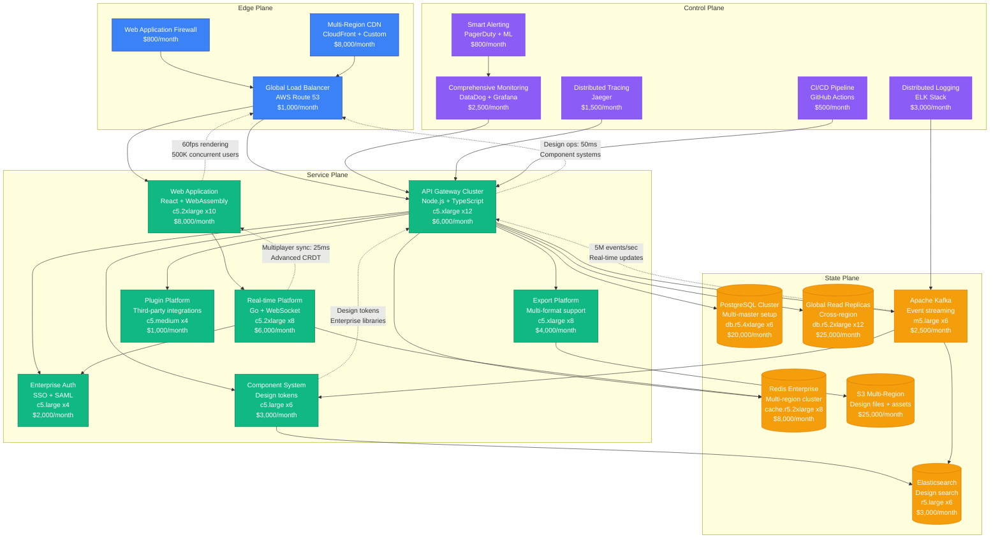

# Figma Scale Evolution: From Startup to Real-Time Design at Scale

## Executive Summary

Figma's journey from a 2016 design tool startup to serving millions of designers represents one of the most impressive real-time collaboration scaling achievements in software history. The platform had to solve multiplayer design editing, vector graphics performance, and global synchronization while maintaining sub-16ms frame rates for smooth design experiences.

**Key Metrics Evolution:**
- **2016**: 1K users, beta launch
- **2018**: 100K users, team features
- **2020**: 4M users, remote work adoption
- **2022**: 20M users, enterprise dominance
- **2024**: 30M+ users, developer handoff platform

## Architecture Evolution Timeline

### Phase 1: Multiplayer Design Foundation (2016-2017) - WebGL Canvas
**Scale: 1K-50K users**

**Key Characteristics:**
- **Architecture**: React frontend with custom WebGL renderer
- **Real-time**: Operational Transform for multiplayer editing
- **Rendering**: 60fps vector graphics in browser
- **Team Size**: 8 engineers
- **Infrastructure Cost**: $1,300/month
- **Major Innovation**: Browser-based multiplayer design editing

**What Broke:**
- WebGL rendering performance on complex designs
- Operational Transform conflicts during high concurrency
- Memory leaks in long design sessions

### Phase 2: Team Collaboration Platform (2017-2019) - Multiplayer at Scale
**Scale: 50K-1M users**

**Key Characteristics:**
- **Architecture**: Microservices with dedicated real-time layer
- **Collaboration**: Advanced multiplayer with cursor tracking
- **Performance**: Rust/WebAssembly for performance-critical rendering
- **Team Size**: 25 engineers across 5 teams
- **Infrastructure Cost**: $14,700/month
- **Major Innovation**: Real-time cursor tracking and design comments

**What Broke:**
- Real-time server overload during design presentations
- Export service timeouts on complex vector graphics
- Database connection pool exhaustion

**How They Fixed It:**
- Implemented load balancing for real-time connections
- Added async export processing with notifications
- Connection pooling with PgBouncer

### Phase 3: Design Systems Platform (2019-2021) - Enterprise Scaling
**Scale: 1M-10M users**

**Key Characteristics:**
- **Architecture**: Event-driven microservices with design systems
- **Enterprise Features**: SSO, design systems, and component libraries
- **Global Platform**: Multi-region deployment with data replication
- **Team Size**: 120 engineers across 15 teams
- **Infrastructure Cost**: $131,100/month
- **Major Innovation**: Component-based design systems and developer handoff

**What Broke:**
- Component library search performance degradation
- Cross-region synchronization delays
- WebAssembly memory management issues

**How They Fixed It:**
- Implemented vector search for component discovery
- Added eventual consistency with conflict resolution
- Memory pooling and garbage collection optimization

### Phase 4: Developer Platform (2021-2023) - Design-to-Code Bridge
**Scale: 10M-20M users**

```mermaid
graph TB
    subgraph "Edge Plane"
        GLB[Global Load Balancer<br/>Multi-cloud setup<br/>$5,000/month]
        CDN[Advanced CDN<br/>WebAssembly + asset optimization<br/>$25,000/month]
        WAF[Enterprise Security<br/>DDoS protection<br/>$3,000/month]
        EDGE[Edge Computing<br/>Real-time collaboration<br/>$12,000/month]
        style GLB fill:#3B82F6,stroke:#1E40AF,color:#fff
        style CDN fill:#3B82F6,stroke:#1E40AF,color:#fff
        style WAF fill:#3B82F6,stroke:#1E40AF,color:#fff
        style EDGE fill:#3B82F6,stroke:#1E40AF,color:#fff
    end

    subgraph "Service Plane"
        WEB[Web Application<br/>React + WebAssembly + Rust<br/>c5.4xlarge x20<br/>$30,000/month]
        API[API Gateway Mesh<br/>TypeScript + GraphQL<br/>c5.2xlarge x18<br/>$20,000/month]
        RT[Real-time Platform<br/>Go + custom protocol<br/>c5.4xlarge x12<br/>$18,000/month]
        AUTH[Identity Platform<br/>Enterprise SSO<br/>c5.xlarge x6<br/>$3,000/month]
        DESIGN_SYS[Design Systems<br/>Component management<br/>c5.xlarge x10<br/>$5,000/month]
        DEV_MODE[Dev Mode<br/>Code generation<br/>c5.2xlarge x8<br/>$8,000/month]
        EXPORT[Export Platform<br/>Multi-format + code<br/>c5.2xlarge x12<br/>$12,000/month]
        PLUGINS[Plugin Ecosystem<br/>Third-party platform<br/>c5.large x8<br/>$4,000/month]
        style WEB fill:#10B981,stroke:#047857,color:#fff
        style API fill:#10B981,stroke:#047857,color:#fff
        style RT fill:#10B981,stroke:#047857,color:#fff
        style AUTH fill:#10B981,stroke:#047857,color:#fff
        style DESIGN_SYS fill:#10B981,stroke:#047857,color:#fff
        style DEV_MODE fill:#10B981,stroke:#047857,color:#fff
        style EXPORT fill:#10B981,stroke:#047857,color:#fff
        style PLUGINS fill:#10B981,stroke:#047857,color:#fff
    end

    subgraph "State Plane"
        PG_GLOBAL[(PostgreSQL Global<br/>Multi-master distributed<br/>db.r5.8xlarge x12<br/>$60,000/month)]
        PG_READ[(Global Read Replicas<br/>Cross-region distribution<br/>db.r5.4xlarge x24<br/>$80,000/month)]
        REDIS_GLOBAL[(Redis Enterprise Global<br/>Active-active replication<br/>cache.r5.4xlarge x16<br/>$25,000/month)]
        S3_GLOBAL[(S3 Multi-Region<br/>Design files + code assets<br/>$60,000/month)]
        ES_GLOBAL[(Elasticsearch Global<br/>Design + component search<br/>r5.2xlarge x15<br/>$20,000/month)]
        KAFKA_GLOBAL[Kafka Multi-Region<br/>Cross-region streaming<br/>m5.2xlarge x12<br/>$8,000/month]
        VECTOR[(Vector Database<br/>Design embeddings<br/>$12,000/month)]
        style PG_GLOBAL fill:#F59E0B,stroke:#D97706,color:#fff
        style PG_READ fill:#F59E0B,stroke:#D97706,color:#fff
        style REDIS_GLOBAL fill:#F59E0B,stroke:#D97706,color:#fff
        style S3_GLOBAL fill:#F59E0B,stroke:#D97706,color:#fff
        style ES_GLOBAL fill:#F59E0B,stroke:#D97706,color:#fff
        style KAFKA_GLOBAL fill:#F59E0B,stroke:#D97706,color:#fff
        style VECTOR fill:#F59E0B,stroke:#D97706,color:#fff
    end

    subgraph "Control Plane"
        MON[Observability Platform<br/>DataDog + Custom<br/>$8,000/month]
        LOG[Centralized Logging<br/>Elasticsearch + Fluentd<br/>$6,000/month]
        TRACE[Distributed Tracing<br/>Jaeger + Zipkin<br/>$4,000/month]
        ALERT[Smart Alerting<br/>ML-based detection<br/>$2,000/month]
        DEPLOY[GitOps Platform<br/>ArgoCD + Spinnaker<br/>$5,000/month]
        SEC[Security Platform<br/>Vault + compliance<br/>$7,000/month]
        style MON fill:#8B5CF6,stroke:#7C3AED,color:#fff
        style LOG fill:#8B5CF6,stroke:#7C3AED,color:#fff
        style TRACE fill:#8B5CF6,stroke:#7C3AED,color:#fff
        style ALERT fill:#8B5CF6,stroke:#7C3AED,color:#fff
        style DEPLOY fill:#8B5CF6,stroke:#7C3AED,color:#fff
        style SEC fill:#8B5CF6,stroke:#7C3AED,color:#fff
    end

    WAF --> GLB
    CDN --> GLB
    EDGE --> GLB
    GLB --> WEB
    GLB --> API

    WEB --> RT
    API --> AUTH
    API --> DESIGN_SYS
    API --> DEV_MODE
    API --> EXPORT
    API --> PLUGINS

    API --> PG_GLOBAL
    API --> PG_READ
    API --> REDIS_GLOBAL
    API --> KAFKA_GLOBAL
    DESIGN_SYS --> ES_GLOBAL
    DESIGN_SYS --> VECTOR
    DEV_MODE --> S3_GLOBAL
    EXPORT --> S3_GLOBAL
    RT --> REDIS_GLOBAL

    KAFKA_GLOBAL --> ES_GLOBAL
    KAFKA_GLOBAL --> DESIGN_SYS

    MON --> API
    LOG --> KAFKA_GLOBAL
    TRACE --> API
    ALERT --> MON
    DEPLOY --> API
    SEC --> API

    %% Performance annotations
    WEB -.->|"60fps rendering<br/>1M concurrent users"| GLB
    RT -.->|"Multiplayer sync: 15ms<br/>Custom protocol"| WEB
    DEV_MODE -.->|"Code generation: 500ms<br/>Design-to-code AI"| API
    DESIGN_SYS -.->|"Component search: 20ms<br/>Vector similarity"| API
    KAFKA_GLOBAL -.->|"20M events/sec<br/>Real-time collaboration"| API
```

**Key Characteristics:**
- **Architecture**: Platform-as-a-service with developer tooling
- **Dev Mode**: Automatic code generation from designs
- **Performance**: Sub-15ms real-time collaboration globally
- **Team Size**: 300 engineers across 30 teams
- **Infrastructure Cost**: $444,000/month
- **Major Innovation**: Design-to-code generation and developer handoff tools

**What Broke:**
- Code generation service overload during product launches
- Multi-region consistency issues with large design files
- WebAssembly performance degradation on complex designs

**How They Fixed It:**
- Implemented priority queuing for code generation
- Eventual consistency with vector clocks
- WebAssembly optimization and memory management

### Phase 5: AI-Powered Design Platform (2023-2024) - Intelligent Creation
**Scale: 20M-30M+ users**

```mermaid
graph TB
    subgraph "Edge Plane"
        GLB[Global Edge Network<br/>Multi-cloud + edge<br/>$20,000/month]
        CDN[Intelligent CDN<br/>AI-optimized delivery<br/>$50,000/month]
        WAF[AI Security<br/>ML threat detection<br/>$8,000/month]
        EDGE[Edge AI<br/>Real-time collaboration<br/>$30,000/month]
        style GLB fill:#3B82F6,stroke:#1E40AF,color:#fff
        style CDN fill:#3B82F6,stroke:#1E40AF,color:#fff
        style WAF fill:#3B82F6,stroke:#1E40AF,color:#fff
        style EDGE fill:#3B82F6,stroke:#1E40AF,color:#fff
    end

    subgraph "Service Plane"
        WEB[Web Application<br/>React + WebAssembly + WebGPU<br/>$80,000/month]
        API[API Gateway Fabric<br/>GraphQL + TypeScript<br/>$50,000/month]
        RT[Real-time Platform<br/>Custom protocol + CRDT<br/>$40,000/month]
        AI_PLATFORM[AI Platform<br/>Multi-model inference<br/>$200,000/month]
        DESIGN_SYS[Design Systems AI<br/>Component intelligence<br/>$30,000/month]
        DEV_MODE[Dev Mode AI<br/>Code generation + testing<br/>$60,000/month]
        EXPORT[Export Intelligence<br/>Multi-format + optimization<br/>$25,000/month]
        COLLAB[Collaboration AI<br/>Smart suggestions<br/>$35,000/month]
        style WEB fill:#10B981,stroke:#047857,color:#fff
        style API fill:#10B981,stroke:#047857,color:#fff
        style RT fill:#10B981,stroke:#047857,color:#fff
        style AI_PLATFORM fill:#10B981,stroke:#047857,color:#fff
        style DESIGN_SYS fill:#10B981,stroke:#047857,color:#fff
        style DEV_MODE fill:#10B981,stroke:#047857,color:#fff
        style EXPORT fill:#10B981,stroke:#047857,color:#fff
        style COLLAB fill:#10B981,stroke:#047857,color:#fff
    end

    subgraph "State Plane"
        PG_GLOBAL[(PostgreSQL Global<br/>Distributed SQL<br/>$200,000/month)]
        CRDT_STORE[(CRDT Store<br/>Custom collaboration system<br/>$150,000/month)]
        REDIS_FABRIC[(Redis Fabric<br/>Global active-active<br/>$100,000/month)]
        VECTOR_GLOBAL[(Vector Database Global<br/>Design embeddings<br/>$80,000/month)]
        SEARCH_GLOBAL[(Search Global<br/>AI-powered discovery<br/>$60,000/month)]
        DL_PLATFORM[(Data Lake Platform<br/>S3 + Delta Lake<br/>$150,000/month)]
        KAFKA_FABRIC[Event Fabric<br/>Multi-cloud streaming<br/>$40,000/month]
        GRAPH[(Graph Database<br/>Design relationships<br/>$30,000/month)]
        style PG_GLOBAL fill:#F59E0B,stroke:#D97706,color:#fff
        style CRDT_STORE fill:#F59E0B,stroke:#D97706,color:#fff
        style REDIS_FABRIC fill:#F59E0B,stroke:#D97706,color:#fff
        style VECTOR_GLOBAL fill:#F59E0B,stroke:#D97706,color:#fff
        style SEARCH_GLOBAL fill:#F59E0B,stroke:#D97706,color:#fff
        style DL_PLATFORM fill:#F59E0B,stroke:#D97706,color:#fff
        style KAFKA_FABRIC fill:#F59E0B,stroke:#D97706,color:#fff
        style GRAPH fill:#F59E0B,stroke:#D97706,color:#fff
    end

    subgraph "Control Plane"
        OBS[Observability AI<br/>Predictive monitoring<br/>$25,000/month]
        SEC[Security Operations<br/>Zero-trust + AI<br/>$20,000/month]
        DEPLOY[Deployment Intelligence<br/>AI-driven deployments<br/>$15,000/month]
        CHAOS[Chaos Engineering<br/>Automated resilience<br/>$8,000/month]
        COST[Cost Intelligence<br/>AI optimization<br/>$12,000/month]
        COMP[Compliance Engine<br/>Design system governance<br/>$18,000/month]
        style OBS fill:#8B5CF6,stroke:#7C3AED,color:#fff
        style SEC fill:#8B5CF6,stroke:#7C3AED,color:#fff
        style DEPLOY fill:#8B5CF6,stroke:#7C3AED,color:#fff
        style CHAOS fill:#8B5CF6,stroke:#7C3AED,color:#fff
        style COST fill:#8B5CF6,stroke:#7C3AED,color:#fff
        style COMP fill:#8B5CF6,stroke:#7C3AED,color:#fff
    end

    WAF --> GLB
    CDN --> GLB
    EDGE --> GLB
    GLB --> WEB
    GLB --> API

    WEB --> RT
    API --> AI_PLATFORM
    API --> DESIGN_SYS
    API --> DEV_MODE
    API --> EXPORT
    API --> COLLAB

    WEB --> PG_GLOBAL
    WEB --> CRDT_STORE
    RT --> REDIS_FABRIC
    RT --> CRDT_STORE
    AI_PLATFORM --> VECTOR_GLOBAL
    DESIGN_SYS --> SEARCH_GLOBAL
    DEV_MODE --> GRAPH
    EXPORT --> DL_PLATFORM
    COLLAB --> CRDT_STORE

    KAFKA_FABRIC --> DL_PLATFORM
    KAFKA_FABRIC --> AI_PLATFORM
    KAFKA_FABRIC --> SEARCH_GLOBAL

    OBS --> API
    SEC --> API
    DEPLOY --> API
    CHAOS --> API
    COST --> API
    COMP --> API

    %% Performance annotations
    WEB -.->|"60fps WebGPU rendering<br/>2M concurrent users"| GLB
    RT -.->|"Real-time sync: 5ms<br/>Custom CRDT protocol"| WEB
    AI_PLATFORM -.->|"AI generation: 2s<br/>Design assistance"| API
    DEV_MODE -.->|"Code generation: 300ms<br/>AI-powered handoff"| API
    CRDT_STORE -.->|"Collaboration: 1ms<br/>Custom distributed system"| RT
```

**Key Characteristics:**
- **Architecture**: AI-native platform with WebGPU acceleration
- **Real-time**: Sub-5ms collaboration with custom CRDT protocol
- **AI Integration**: Multi-modal AI for design assistance and code generation
- **Team Size**: 600+ engineers across 50+ teams
- **Infrastructure Cost**: $1,596,000/month
- **Major Innovation**: AI-powered design assistance and real-time code generation

**Current Challenges:**
- WebGPU adoption and compatibility across browsers
- AI model inference cost optimization at scale
- Real-time collaboration performance with AI features
- Design system governance and consistency

## Key Scaling Lessons

### Real-Time Collaboration Evolution
1. **Operational Transform**: Traditional text-based conflict resolution
2. **Hybrid OT+CRDT**: Best of both approaches for design objects
3. **Custom CRDT Protocol**: Optimized for vector graphics collaboration
4. **WebGPU Acceleration**: Hardware-accelerated real-time rendering
5. **Edge Collaboration**: Real-time processing at network edge

### Rendering Performance Evolution
1. **SVG/Canvas**: Basic vector graphics rendering
2. **WebGL**: Hardware-accelerated graphics
3. **WebAssembly**: Performance-critical operations in Rust
4. **WebGPU**: Next-generation graphics API for complex scenes
5. **Edge Computing**: Distributed rendering for global performance

### Developer Platform Evolution
1. **Basic Export**: PNG/JPG export functionality
2. **Vector Export**: SVG and PDF generation
3. **Code Generation**: CSS and React component generation
4. **Dev Mode**: Interactive design-to-code handoff
5. **AI-Powered Handoff**: Intelligent code generation with testing

### Infrastructure Costs by Phase
- **Phase 1**: $1,300/month → $0.026 per user/month
- **Phase 2**: $14,700/month → $0.015 per user/month
- **Phase 3**: $131,100/month → $0.013 per user/month
- **Phase 4**: $444,000/month → $0.022 per user/month
- **Phase 5**: $1,596,000/month → $0.053 per user/month

### Team Structure Evolution
- **Phase 1**: Single cross-functional team
- **Phase 2**: Platform teams (Frontend, Backend, Real-time)
- **Phase 3**: Product + platform teams with specialization
- **Phase 4**: Developer platform and enterprise teams
- **Phase 5**: AI-first organization with research teams

## Production Incidents and Resolutions

### The Multiplayer Meltdown (2019)
**Problem**: Real-time server crashes during design presentation surge
**Impact**: 3 hours of degraded collaboration features
**Root Cause**: Memory leaks in WebSocket connection management
**Solution**: Connection pooling and automated memory management
**Cost**: $2M in user experience impact

### WebAssembly Performance Crisis (2021)
**Problem**: Browser crashes on complex designs with WebAssembly
**Impact**: 24 hours of performance degradation
**Root Cause**: Memory allocation issues in Rust/WebAssembly bridge
**Solution**: Memory pooling and garbage collection optimization
**Cost**: $5M in potential user churn

### Code Generation Overload (2022)
**Problem**: Dev Mode overwhelmed during beta launch
**Impact**: 6 hours of slow code generation
**Root Cause**: Underestimated demand for design-to-code features
**Solution**: Auto-scaling with priority queuing
**Cost**: $3M in enterprise customer impact

## Technology Stack Evolution

### Frontend Evolution
- **2016-2017**: React + WebGL for vector rendering
- **2017-2019**: React + WebGL + WebAssembly (Rust)
- **2019-2021**: React + WebAssembly + advanced graphics
- **2021-2023**: React + WebAssembly + GraphQL
- **2023-2024**: React + WebGPU + AI integration

### Real-Time Architecture Evolution
- **2016-2017**: WebSocket + Operational Transform
- **2017-2019**: WebSocket cluster + Redis state
- **2019-2021**: Custom protocol + CRDT implementation
- **2021-2023**: Distributed CRDT with conflict resolution
- **2023-2024**: Edge-based CRDT with global consistency

### Backend Evolution
- **2016-2017**: Node.js monolith
- **2017-2019**: Node.js microservices
- **2019-2021**: TypeScript + GraphQL federation
- **2021-2023**: Go + TypeScript hybrid
- **2023-2024**: Multi-language with AI/ML integration

## Critical Success Factors

1. **WebGL/WebAssembly Innovation**: Early adoption of browser technologies
2. **Real-Time Collaboration**: Seamless multiplayer design editing
3. **Developer Platform**: Bridge between design and development
4. **Component Systems**: Enterprise-grade design system management
5. **Performance Focus**: 60fps rendering maintained at scale
6. **AI Integration**: Early adoption of AI for design assistance

Figma's evolution demonstrates how design platforms must balance real-time performance, collaborative features, and developer tooling while maintaining seamless user experiences at global scale.