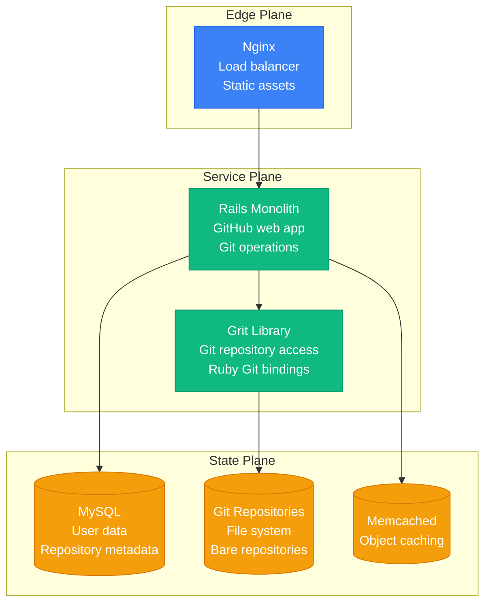
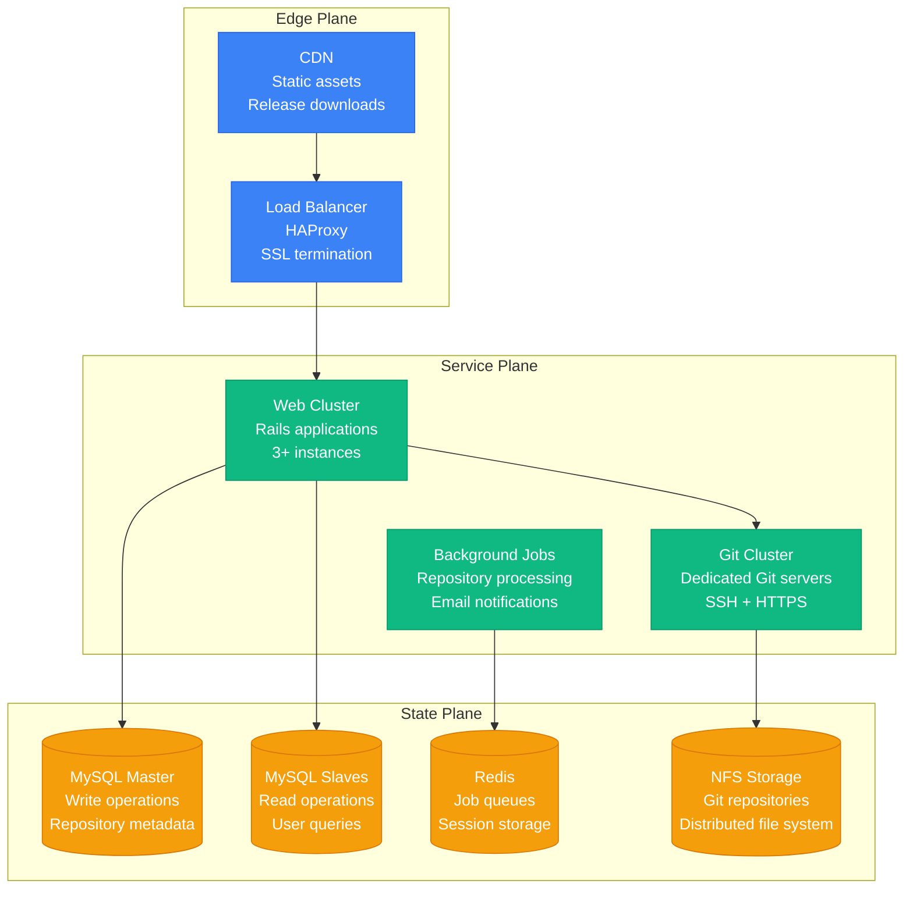
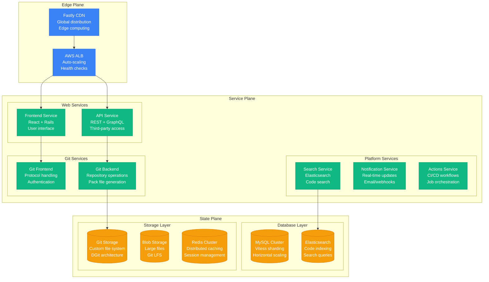
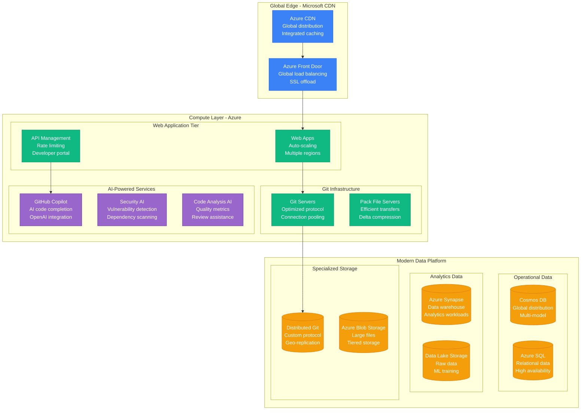

# GitHub Scale Evolution: 100K to 100M Developers

## Executive Summary

GitHub's scaling journey from a Ruby on Rails application serving 100K developers to the world's largest code hosting platform supporting 100M+ developers represents one of the most critical infrastructure scaling stories in software development. The platform became the backbone of open source development and enterprise software collaboration.

**Key Scaling Metrics:**
- **Developers**: 100,000 → 100,000,000+ (1,000x growth)
- **Repositories**: 1,000 → 420,000,000+ (420,000x growth)
- **Git operations**: 1K/day → 1,000,000,000+/day (1M x growth)
- **Storage**: 1TB → 500+ Petabytes (500,000x growth)
- **Infrastructure cost**: $10K/month → $1B+/year
- **Engineering team**: 10 → 3,000+ engineers

## Phase 1: Rails Foundation (2008-2010)
**Scale: 100K-500K developers, 1K-10K repositories**

### Simple Rails Architecture

### Key Metrics
| Metric | Value | Source |
|--------|-------|--------|
| Registered Users | 100K-500K | GitHub blog |
| Public Repositories | 1K-10K | Platform metrics |
| Git Operations/day | 1K-10K | Server logs |
| Storage | 1-10TB | File system |
| Monthly Cost | $10K-50K | Hosting costs |

### What Broke
- **Git operations** blocking web requests
- **MySQL** performance with growing metadata
- **File system** limits with repository growth

## Phase 2: Scaling Git (2010-2012)
**Scale: 500K-2M developers, 10K-100K repositories**

### Separated Git Architecture

### Key Innovations
1. **Separated Git operations** from web tier
2. **MySQL read replicas** for scaling reads
3. **Background job processing** for heavy operations
4. **NFS for repository storage** with high availability

### What Broke
- **NFS bottlenecks** during large repository operations
- **MySQL replication lag** affecting consistency
- **SSH connection limits** during peak hours

## Phase 3: Enterprise Growth (2012-2016)
**Scale: 2M-20M developers, 100K-10M repositories**

### Microservices and Distributed Storage

### GitHub Enterprise Features
1. **On-premise deployment** for enterprises
2. **Advanced security** with audit logs
3. **GitHub Actions** for CI/CD automation
4. **Large file storage** (Git LFS)
5. **Code search** with Elasticsearch

### What Broke
- **Database sharding** complexity with Vitess
- **Git storage** performance with large repositories
- **Search indexing** lag with code changes

## Phase 4: Microsoft Acquisition (2016-2020)
**Scale: 20M-50M developers, 10M-100M repositories**

### Cloud-Native Architecture

### Microsoft Integration Benefits
1. **Azure cloud infrastructure** for global scale
2. **Enterprise integration** with Microsoft tools
3. **Advanced security** with Azure AD
4. **AI capabilities** through Azure Cognitive Services
5. **Global compliance** (SOC, ISO, FedRAMP)

## Phase 5: AI-Powered Development (2020-Present)
**Scale: 50M-100M+ developers, 100M-420M+ repositories**

### Current AI-First Platform
- **GitHub Copilot** - AI pair programming
- **GitHub Advanced Security** - AI-powered security scanning
- **GitHub Actions** - CI/CD with intelligent optimization
- **Codespaces** - Cloud development environments
- **GitHub Mobile** - Mobile-first development experience

## Cost Evolution

| Phase | Period | Monthly Cost | Cost per Developer | Primary Drivers |
|-------|--------|--------------|-------------------|----------------|
| Rails | 2008-2010 | $10K-50K | $0.20 | Basic hosting |
| Scaling | 2010-2012 | $50K-200K | $0.15 | Dedicated Git infrastructure |
| Enterprise | 2012-2016 | $200K-2M | $0.10 | Enterprise features |
| Microsoft | 2016-2020 | $2M-20M | $0.20 | Azure migration |
| AI Platform | 2020-Present | $20M-100M+ | $0.50 | AI infrastructure |

## Team Evolution

### Engineering Team Growth

| Phase | Period | Total Engineers | Backend | Frontend | Infrastructure | AI/ML |
|-------|--------|----------------|---------|----------|----------------|-------|
| Rails | 2008-2010 | 10-50 | 20 | 10 | 5 | 0 |
| Scaling | 2010-2012 | 50-150 | 60 | 30 | 20 | 0 |
| Enterprise | 2012-2016 | 150-500 | 200 | 100 | 80 | 10 |
| Microsoft | 2016-2020 | 500-1500 | 600 | 300 | 200 | 100 |
| AI Platform | 2020-Present | 1500-3000+ | 800 | 400 | 300 | 500 |

## Key Lessons Learned

### Technical Lessons
1. **Git at scale requires specialized infrastructure** - Standard file systems don't work
2. **Global distribution is critical** - Developers are everywhere
3. **Search infrastructure is complex** - Code search has unique requirements
4. **AI transforms developer experience** - Copilot changed how people code
5. **Security scanning must be built-in** - Can't retrofit security at scale

### Business Lessons
1. **Developer platforms have network effects** - More developers attract more projects
2. **Enterprise features drive revenue** - Security and compliance pay for platform
3. **Acquisition can accelerate scaling** - Microsoft resources enabled global growth
4. **AI creates new business models** - Copilot generates subscription revenue
5. **Open source drives adoption** - Free tier creates ecosystem lock-in

### Operational Lessons
1. **Git protocol optimization is critical** - Network efficiency affects user experience
2. **Global consistency is challenging** - Distributed repositories need coordination
3. **Abuse prevention requires automation** - Manual moderation doesn't scale
4. **Incident response affects millions** - Developer productivity depends on uptime
5. **Cultural preservation during scaling** - Maintaining developer-friendly culture

## Current Scale Metrics (2024)

| Metric | Value | Source |
|--------|-------|--------|
| Registered Developers | 100M+ | GitHub Universe |
| Public Repositories | 420M+ | Platform metrics |
| Organizations | 4M+ | Enterprise metrics |
| Git Operations/day | 1B+ | Infrastructure metrics |
| Storage | 500+ PB | Engineering estimates |
| Copilot Users | 1M+ | Product metrics |
| Actions Minutes | 10B+/month | CI/CD metrics |
| Countries | 200+ | Global presence |
| Engineering Team | 3,000+ | Company estimates |

---

*GitHub's evolution from a simple Rails app to an AI-powered development platform demonstrates how developer tools must scale not just technically, but also culturally and operationally to serve the global software development community.*