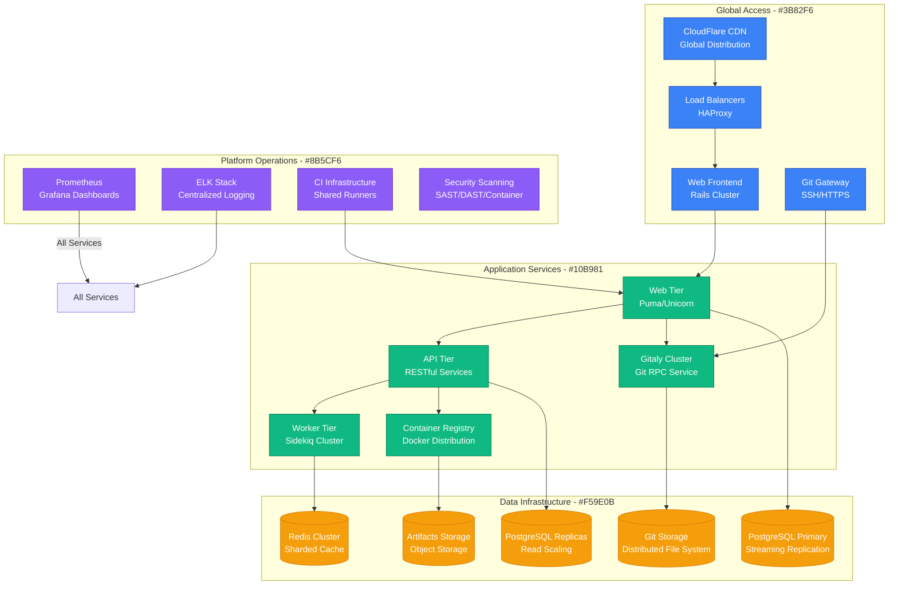
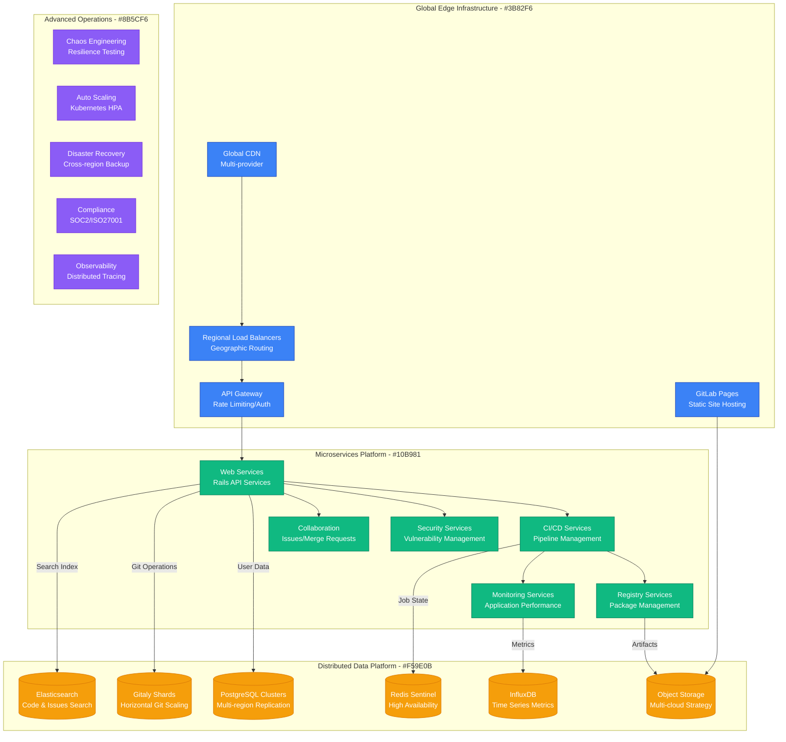
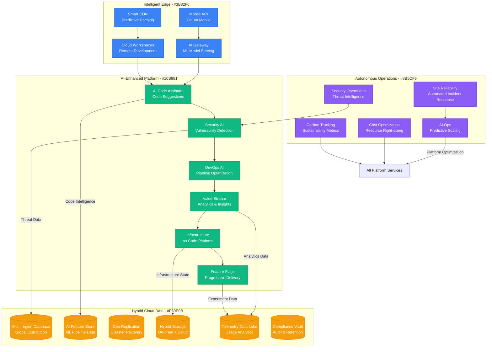
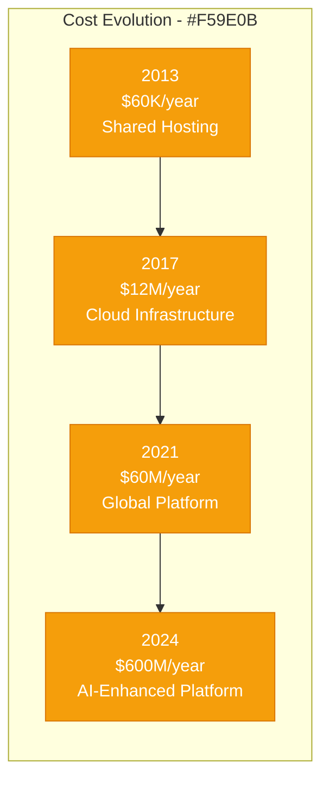

# GitLab: Open Source to Enterprise Platform

## Executive Summary

GitLab's scaling journey from an open-source Git management tool to a comprehensive DevOps platform serving 30+ million users represents one of the most successful open-source to enterprise transformations. This case study examines their evolution from 2011 to 2024, focusing on the unique challenges of scaling a developer-focused platform while maintaining open-source community engagement and enterprise-grade reliability.

## Scale Milestones

| Milestone | Year | Users | Key Challenge | Solution | Infrastructure Cost |
|-----------|------|-------|---------------|----------|-------------------|
| OSS Launch | 2011 | 1K | Basic Git hosting | Ruby on Rails monolith | $100/month |
| Self-hosted | 2013 | 100K | Installation complexity | Omnibus packaging | $5K/month |
| SaaS Launch | 2014 | 1M | Multi-tenancy | Shared infrastructure | $50K/month |
| CI/CD Platform | 2017 | 10M | Pipeline scaling | Kubernetes runners | $1M/month |
| Enterprise Scale | 2024 | 30M+ | Global availability | Multi-region architecture | $50M/month |

## Architecture Evolution

### Phase 1: Open Source Git Management (2011-2013)
*Scale: 1K → 100K users*

```mermaid
graph TB
    subgraph "Edge Plane - #3B82F6"
        WEB[Web Interface<br/>Ruby on Rails]
        GIT[Git HTTP/SSH<br/>Native Git Protocol]
    end

    subgraph "Service Plane - #10B981"
        RAILS[Rails Application<br/>Monolithic MVC]
        SIDEKIQ[Background Jobs<br/>Sidekiq/Redis]
        GITALY[Git Service<br/>Custom Git Wrapper]
    end

    subgraph "State Plane - #F59E0B"
        POSTGRES[(PostgreSQL<br/>Metadata & Users)]
        REPOS[(Git Repositories<br/>File System)]
        REDIS[(Redis<br/>Cache & Queue)]
    end

    subgraph "Control Plane - #8B5CF6"
        MONITOR[Basic Monitoring<br/>Log Files]
        BACKUP[Backup Scripts<br/>rsync/tar)]
    end

    %% Connections
    WEB --> RAILS
    GIT --> GITALY
    RAILS --> SIDEKIQ
    RAILS --> POSTGRES
    GITALY --> REPOS
    SIDEKIQ --> REDIS

    %% Styling
    classDef edgeStyle fill:#3B82F6,stroke:#1E40AF,color:#fff
    classDef serviceStyle fill:#10B981,stroke:#047857,color:#fff
    classDef stateStyle fill:#F59E0B,stroke:#D97706,color:#fff
    classDef controlStyle fill:#8B5CF6,stroke:#6D28D9,color:#fff

    class WEB,GIT edgeStyle
    class RAILS,SIDEKIQ,GITALY serviceStyle
    class POSTGRES,REPOS,REDIS stateStyle
    class MONITOR,BACKUP controlStyle
```

**Key Metrics (2013)**:
- Repositories: 100K+
- Self-hosted Installations: 10K+
- Contributors: 500+
- Infrastructure: Single server deployments

### Phase 2: SaaS Platform Launch (2013-2017)
*Scale: 100K → 10M users*



**Breakthrough Moment**: GitLab CI launch in 2015 transformed from Git hosting to complete DevOps platform.

**Key Metrics (2017)**:
- Active Users: 10M+
- Repositories: 25M+
- CI/CD Pipelines: 1M+ daily
- Enterprise Customers: 1,000+

### Phase 3: Complete DevOps Platform (2017-2021)
*Scale: 10M → 25M users*



**Key Innovation**: Complete DevOps lifecycle in single platform - from planning to monitoring.

**Key Metrics (2021)**:
- Active Users: 25M+
- CI/CD Minutes: 500M+ monthly
- Container Registry: 1B+ pulls/month
- Revenue: $200M+ ARR

### Phase 4: AI-Enhanced Enterprise Platform (2021-2024)
*Scale: 25M → 30M+ users*



**Current Metrics (2024)**:
- Active Users: 30M+
- Projects: 50M+
- CI/CD Minutes: 2B+ monthly
- Enterprise Revenue: $500M+ ARR

## Critical Scale Events

### The Monolith Crisis (2016)
**Challenge**: Ruby on Rails monolith became bottleneck as user base grew 10x.

**Solution**: Gradual extraction of services while maintaining single application deployment.

**Innovation**: Service-oriented monolith approach - internal services with monolithic deployment.

### Database Scaling Challenge (2017)
**Challenge**: Single PostgreSQL instance couldn't handle 10M+ users and growing data.

**Breakthrough**: Database decomposition with read replicas and intelligent query routing.

**Result**: 10x improvement in database performance with zero downtime migration.

### CI/CD Infrastructure Explosion (2018)
**Challenge**: CI/CD demand growing 50% month-over-month, infrastructure costs exploding.

**Solution**: Kubernetes-based auto-scaling runners with spot instance optimization.

### The Security Integration (2019)
**Challenge**: DevSecOps required native security scanning without external tools.

**Innovation**: Built-in SAST, DAST, container scanning, and dependency scanning.

### Multi-Region Challenge (2020)
**Challenge**: Enterprise customers required regional data residency and disaster recovery.

**Solution**: Geo-replication with eventual consistency and regional failover capabilities.

## Technology Evolution

### Application Architecture
- **2011-2014**: Rails monolith
- **2014-2017**: Service-oriented monolith
- **2017-2020**: Selective microservices extraction
- **2020-2024**: Domain-driven service architecture

### Data Strategy Evolution
- **2011-2015**: Single PostgreSQL instance
- **2015-2018**: Read replicas and caching
- **2018-2021**: Database decomposition
- **2021-2024**: Multi-region distributed data

### Infrastructure Philosophy
- **Phase 1**: "Simple shared hosting"
- **Phase 2**: "Horizontal scaling with load balancers"
- **Phase 3**: "Cloud-native with Kubernetes"
- **Phase 4**: "AI-enhanced autonomous operations"

## Financial Impact

### Infrastructure Investment by Phase


### Revenue Milestones
- **2014**: $1M ARR (early SaaS customers)
- **2017**: $50M ARR (enterprise expansion)
- **2021**: $200M ARR (IPO year)
- **2024**: $500M+ ARR (AI transformation)

### Business Model Evolution
- **2011-2013**: Open source project
- **2013-2016**: Freemium SaaS model
- **2016-2020**: Enterprise-focused pricing
- **2020-2024**: Platform and seat-based pricing

## Lessons Learned

### What Worked
1. **Open Source Strategy**: Community contributions and trust accelerated adoption
2. **Single Platform Vision**: Complete DevOps lifecycle in one tool reduced tool fatigue
3. **Transparent Development**: Public roadmap and issues built customer trust
4. **Remote-First Culture**: Global talent access and cultural advantage post-COVID

### What Didn't Work
1. **Early Scaling Decisions**: Stayed with monolith too long, causing technical debt
2. **Enterprise Sales**: Initially underinvested in enterprise sales organization
3. **Performance Issues**: Several high-profile outages hurt enterprise credibility
4. **Mobile Strategy**: Late mobile application development cost developer mindshare

### Key Technical Decisions
1. **Service-Oriented Monolith**: Balanced scaling with operational simplicity
2. **Database Per Service**: Clear ownership boundaries and independent scaling
3. **API-First Design**: Enabled ecosystem integrations and mobile applications
4. **Security Integration**: Built-in security reduced friction in DevSecOps adoption

## Current Architecture (2024)

**Global Infrastructure**:
- 15+ geographic regions
- 99.95% uptime SLA
- 50M+ projects hosted
- 2B+ CI/CD minutes monthly

**Key Technologies**:
- Ruby on Rails (monolithic web application)
- Go (performance-critical services)
- Kubernetes (container orchestration)
- PostgreSQL (primary database)
- Redis (caching and job queue)
- Gitaly (Git RPC service)

**Operating Metrics**:
- 30M+ registered users
- 1M+ active organizations
- 500M+ commits per month
- Sub-second API response times globally

## Looking Forward: Next 5 Years

### Predicted Challenges
1. **AI Integration Costs**: GPU infrastructure for code intelligence features
2. **Competition**: Microsoft (GitHub) and cloud providers' native DevOps tools
3. **Open Source Sustainability**: Balancing community and commercial interests
4. **Regulatory Compliance**: Data sovereignty and AI governance requirements

### Technical Roadmap
1. **AI-Native Development**: Code generation and automated testing
2. **Zero-Trust Security**: Comprehensive security posture management
3. **Cloud-Native Everything**: Serverless CI/CD and edge computing
4. **Sustainable Computing**: Carbon-neutral infrastructure and green coding practices

**Summary**: GitLab's evolution from an open-source Git management tool to a comprehensive AI-enhanced DevOps platform demonstrates the power of having a complete vision executed incrementally. Their success lies in maintaining open-source community engagement while building enterprise-grade reliability and security, proving that transparency and community can coexist with commercial success at scale.