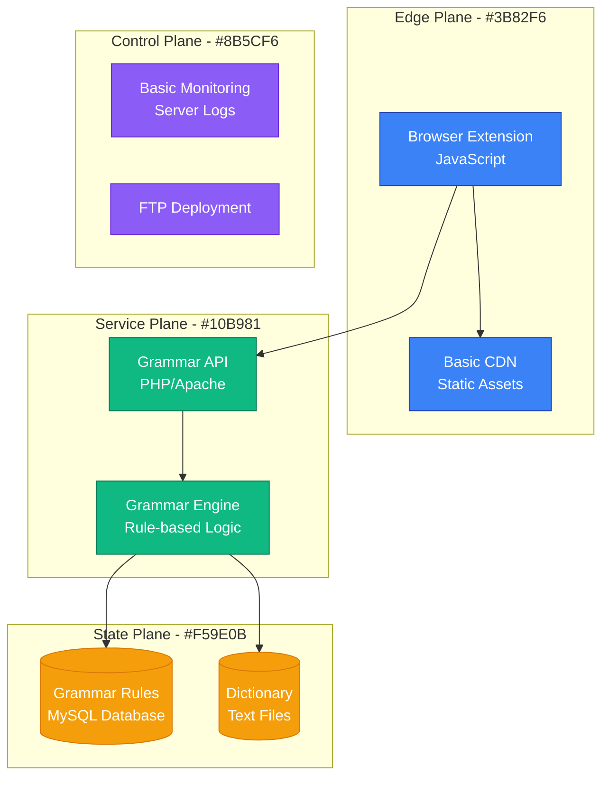
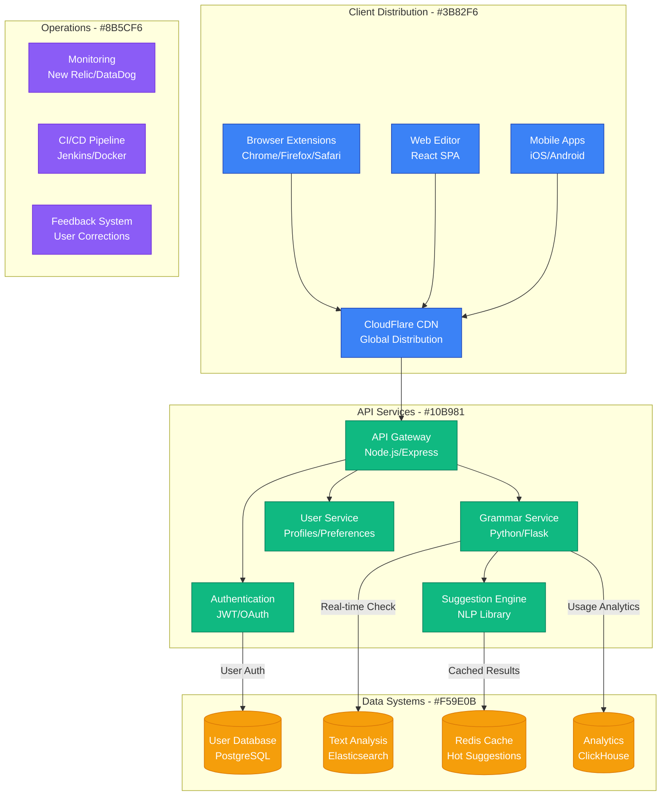
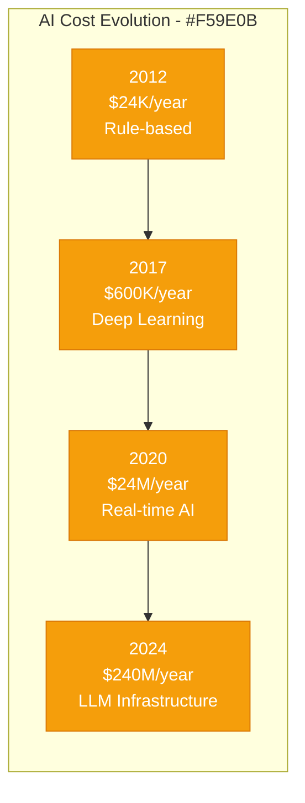

# Grammarly: Browser Extension to 30M Daily Users

## Executive Summary

Grammarly's scaling journey from a simple grammar checker browser extension to an AI-powered writing assistant serving 30+ million daily active users represents one of the most successful B2C AI platform transformations. This case study examines their evolution from 2009 to 2024, focusing on the unique challenges of scaling real-time AI inference across billions of text inputs daily.

## Scale Milestones

| Milestone | Year | DAU | Key Challenge | Solution | AI Infrastructure Cost |
|-----------|------|-----|---------------|----------|----------------------|
| Launch | 2009 | 100 | Basic grammar | Rule-based engine | $100/month |
| Web Platform | 2012 | 10K | Real-time checking | JavaScript optimization | $2K/month |
| AI Revolution | 2017 | 1M | ML accuracy | Deep learning models | $50K/month |
| Enterprise | 2020 | 20M | Business features | Multi-tenant AI | $2M/month |
| Advanced AI | 2024 | 30M+ | Real-time LLM | Edge inference | $20M/month |

## Architecture Evolution

### Phase 1: Simple Grammar Checker (2009-2012)
*Scale: 100 → 10K users*

**Key Metrics (2012)**:
- Text Checked: 10M words/day
- Response Time: 2-5 seconds
- Accuracy: 65% (basic grammar)
- Infrastructure: Single server

### Phase 2: Real-Time Web Platform (2012-2017)
*Scale: 10K → 1M users*

**Key Metrics (2017)**:
- Text Checked: 1B words/day
- Response Time: 200-500ms
- Accuracy: 85% (advanced grammar + style)
- Active Extensions: 10M+

### Phase 3: AI-Powered Platform (2017-2020)
*Scale: 1M → 20M users*

```mermaid
graph TB
    subgraph "Global Edge - #3B82F6"
        EDGE_POP[Edge PoPs<br/>50+ Locations]
        EXT_V2[Extension v2<br/>Real-time AI]
        WEB_APP[Web Application<br/>Advanced Editor]
        DESKTOP[Desktop Apps<br/>Native Integration]
    end

    subgraph "AI Services Platform - #10B981"
        AI_GATEWAY[AI Gateway<br/>Go/gRPC]
        AUTH_SVC[Auth Service<br/>Multi-tenant]
        GRAMMAR_AI[Grammar AI<br/>Transformer Models]
        STYLE_AI[Style AI<br/>Deep Learning]
        TONE_AI[Tone Detection<br/>Sentiment Analysis]
        PLAGIARISM[Plagiarism Check<br/>Document Similarity]
        VOCAB[Vocabulary<br/>Enhancement AI]
    end

    subgraph "ML Infrastructure - #F59E0B"
        MODEL_STORE[(Model Store<br/>TensorFlow Serving)]
        FEATURE_STORE[(Feature Store<br/>Real-time Features)]
        VECTOR_DB[(Vector Database<br/>Embedding Search)]
        ML_CACHE[(ML Cache<br/>Inference Results)]
        DATA_LAKE[(Data Lake<br/>Training Data)]
        USER_DATA[(User Data<br/>Sharded PostgreSQL)]
    end

    subgraph "ML Ops - #8B5CF6"
        TRAINING[Model Training<br/>Kubernetes/GPUs]
        EXPERIMENT[A/B Testing<br/>Model Comparison]
        MONITOR_AI[AI Monitoring<br/>Model Performance]
        DEPLOY_AI[Model Deployment<br/>Canary Releases]
        FEEDBACK_AI[AI Feedback<br/>Human Annotation]
    end

    %% Client to edge
    EDGE_POP --> EXT_V2
    EDGE_POP --> WEB_APP
    EDGE_POP --> DESKTOP
    EDGE_POP --> AI_GATEWAY

    %% AI service mesh
    AI_GATEWAY --> AUTH_SVC
    AI_GATEWAY --> GRAMMAR_AI
    AI_GATEWAY --> STYLE_AI
    AI_GATEWAY --> TONE_AI
    AI_GATEWAY --> PLAGIARISM
    AI_GATEWAY --> VOCAB

    %% ML data flow
    GRAMMAR_AI --> |"Model Inference"| MODEL_STORE
    STYLE_AI --> |"Feature Lookup"| FEATURE_STORE
    TONE_AI --> |"Embedding Search"| VECTOR_DB
    PLAGIARISM --> |"Cached Results"| ML_CACHE

    %% Training pipeline
    USER_DATA --> |"Training Data"| DATA_LAKE
    DATA_LAKE --> TRAINING
    TRAINING --> MODEL_STORE

    %% Styling
    classDef edgeStyle fill:#3B82F6,stroke:#1E40AF,color:#fff
    classDef serviceStyle fill:#10B981,stroke:#047857,color:#fff
    classDef stateStyle fill:#F59E0B,stroke:#D97706,color:#fff
    classDef controlStyle fill:#8B5CF6,stroke:#6D28D9,color:#fff

    class EDGE_POP,EXT_V2,WEB_APP,DESKTOP edgeStyle
    class AI_GATEWAY,AUTH_SVC,GRAMMAR_AI,STYLE_AI,TONE_AI,PLAGIARISM,VOCAB serviceStyle
    class MODEL_STORE,FEATURE_STORE,VECTOR_DB,ML_CACHE,DATA_LAKE,USER_DATA stateStyle
    class TRAINING,EXPERIMENT,MONITOR_AI,DEPLOY_AI,FEEDBACK_AI controlStyle
```

**Breakthrough Moment**: Launch of AI-powered suggestions in 2017 increased user engagement by 300% and conversion rates by 150%.

**Key Metrics (2020)**:
- Text Processed: 10B words/day
- AI Inference: 100M requests/hour
- Model Accuracy: 94% (human-level performance)
- Enterprise Customers: 50,000+

### Phase 4: Advanced AI Writing Assistant (2020-2024)
*Scale: 20M → 30M+ users*

```mermaid
graph TB
    subgraph "Global Edge Intelligence - #3B82F6"
        EDGE_AI[Edge AI Nodes<br/>100+ Locations]
        CLIENT_AI[Client-side AI<br/>On-device Models]
        REALTIME_API[Real-time API<br/>WebSocket/gRPC]
        INTEGRATION[Integrations<br/>Office/Google/Slack]
    end

    subgraph "AI Platform Services - #10B981"
        LLM_GATEWAY[LLM Gateway<br/>Model Router]
        GRAMMAR_LLM[Grammar LLM<br/>Custom Transformer]
        GENERATIVE_AI[Generative AI<br/>GPT-based Writing]
        BUSINESS_AI[Business AI<br/>Professional Tone]
        PERSONAL_AI[Personal AI<br/>Individual Style]
        SECURITY_AI[Security AI<br/>Data Protection]
        CITATION_AI[Citation AI<br/>Academic Writing]
    end

    subgraph "Advanced ML Infrastructure - #F59E0B"
        LLM_CLUSTER[(LLM Cluster<br/>Multi-GPU Inference)]
        VECTOR_SEARCH[(Vector Search<br/>Semantic Similarity)]
        KNOWLEDGE_BASE[(Knowledge Base<br/>Writing Guidelines)]
        PERSONAL_MODEL[(Personal Models<br/>User-specific AI)]
        STREAMING_DATA[(Streaming Data<br/>Real-time Learning)]
        COMPLIANCE_DB[(Compliance DB<br/>Enterprise Security)]
    end

    subgraph "Advanced AI Ops - #8B5CF6"
        LLM_TRAINING[LLM Training<br/>Distributed GPUs]
        RLHF[RLHF Pipeline<br/>Human Feedback]
        AI_SAFETY[AI Safety<br/>Content Filtering]
        COST_OPT[Cost Optimization<br/>Inference Efficiency]
        PRIVACY_AI[Privacy AI<br/>Federated Learning]
    end

    %% Real-time edge intelligence
    EDGE_AI --> |"Sub-50ms"| CLIENT_AI
    CLIENT_AI --> REALTIME_API
    INTEGRATION --> REALTIME_API
    REALTIME_API --> LLM_GATEWAY

    %% Advanced AI routing
    LLM_GATEWAY --> GRAMMAR_LLM
    LLM_GATEWAY --> GENERATIVE_AI
    LLM_GATEWAY --> BUSINESS_AI
    LLM_GATEWAY --> PERSONAL_AI
    LLM_GATEWAY --> SECURITY_AI
    LLM_GATEWAY --> CITATION_AI

    %% Advanced ML pipeline
    GRAMMAR_LLM --> |"Billion-param Model"| LLM_CLUSTER
    GENERATIVE_AI --> |"Semantic Search"| VECTOR_SEARCH
    BUSINESS_AI --> |"Domain Knowledge"| KNOWLEDGE_BASE
    PERSONAL_AI --> |"User Adaptation"| PERSONAL_MODEL

    %% Continuous learning
    STREAMING_DATA --> LLM_TRAINING
    LLM_TRAINING --> |"RLHF Updates"| RLHF
    RLHF --> LLM_CLUSTER

    %% Styling
    classDef edgeStyle fill:#3B82F6,stroke:#1E40AF,color:#fff
    classDef serviceStyle fill:#10B981,stroke:#047857,color:#fff
    classDef stateStyle fill:#F59E0B,stroke:#D97706,color:#fff
    classDef controlStyle fill:#8B5CF6,stroke:#6D28D9,color:#fff

    class EDGE_AI,CLIENT_AI,REALTIME_API,INTEGRATION edgeStyle
    class LLM_GATEWAY,GRAMMAR_LLM,GENERATIVE_AI,BUSINESS_AI,PERSONAL_AI,SECURITY_AI,CITATION_AI serviceStyle
    class LLM_CLUSTER,VECTOR_SEARCH,KNOWLEDGE_BASE,PERSONAL_MODEL,STREAMING_DATA,COMPLIANCE_DB stateStyle
    class LLM_TRAINING,RLHF,AI_SAFETY,COST_OPT,PRIVACY_AI controlStyle
```

**Current Metrics (2024)**:
- Text Processed: 50B+ words/day
- Real-time Inference: 1M+ requests/second
- Model Parameters: 100B+ (custom LLM)
- Enterprise ARR: $500M+

## Critical Scale Events

### The AI Accuracy Breakthrough (2017)
**Challenge**: Rule-based systems plateaued at 85% accuracy, far below human-level performance.

**Solution**: Complete rewrite using transformer-based deep learning models.

**Impact**:
- Accuracy jumped from 85% to 94%
- User engagement increased 300%
- Premium conversion rate increased 150%

### Real-Time Inference Challenge (2019)
**Challenge**: AI models too slow for real-time typing experience (2-3 second delays).

**Innovation**:
- Edge inference deployment
- Model quantization and pruning
- Predictive pre-computation
- Client-side lightweight models

**Result**: Response time reduced from 2000ms to sub-100ms.

### Enterprise Security Requirements (2020)
**Challenge**: Fortune 500 companies required on-premises deployment and compliance.

**Solution**:
- Air-gapped enterprise deployments
- SOC2 Type II compliance
- GDPR and HIPAA compliance
- Zero-trust security architecture

### LLM Integration Challenge (2023)
**Challenge**: Integrating large language models while maintaining speed and cost efficiency.

**Breakthrough**: Hybrid architecture combining specialized smaller models with selective LLM routing.

## Technology Evolution

### AI Model Evolution
- **2009-2012**: Rule-based grammar (hand-crafted rules)
- **2012-2017**: Statistical NLP (n-gram models, SVM)
- **2017-2020**: Deep learning (LSTM, transformer-based)
- **2020-2024**: Large language models (custom GPT variants)

### Infrastructure Philosophy
- **Phase 1**: "Simple and fast"
- **Phase 2**: "Scale horizontally"
- **Phase 3**: "AI-first architecture"
- **Phase 4**: "Edge intelligence everywhere"

### Data Strategy Evolution
- **2009-2014**: Basic text storage
- **2014-2018**: User behavior analytics
- **2018-2022**: ML feature engineering
- **2022-2024**: Real-time personalization

## Financial Impact

### AI Infrastructure Costs by Phase

### Revenue Growth
- **2012**: $1M ARR (premium subscriptions)
- **2017**: $110M ARR (AI accuracy boost)
- **2020**: $400M ARR (enterprise expansion)
- **2024**: $1B+ ARR (comprehensive AI platform)

## Lessons Learned

### What Worked
1. **AI-First Strategy**: Early investment in ML capabilities paid massive dividends
2. **Real-Time Focus**: Sub-100ms response time became competitive moat
3. **Enterprise Privacy**: Security-first approach enabled B2B expansion
4. **User Feedback Loop**: Continuous learning from corrections improved accuracy

### What Didn't Work
1. **Complex Feature Creep**: Too many features confused core value proposition
2. **Over-Engineering**: Some AI models were overkill for simple grammar checks
3. **Mobile Strategy**: Late mobile optimization cost market share
4. **Pricing Strategy**: Initial pricing too low, left money on table

### Key Technical Decisions
1. **Edge Inference**: Moving AI to edge reduced latency by 10x
2. **Model Specialization**: Multiple small models outperformed single large model
3. **Real-Time Learning**: Continuous model updates without retraining
4. **Privacy by Design**: Zero-knowledge architecture enabled enterprise sales

## Current Architecture (2024)

**Global AI Infrastructure**:
- 100+ edge AI nodes worldwide
- 50,000+ GPU cores for inference
- 10PB+ of training data
- Sub-50ms global AI response time

**Key Technologies**:
- Custom transformer models (100B+ parameters)
- TensorFlow/PyTorch for training
- TensorRT for inference optimization
- Kubernetes for orchestration
- gRPC for service communication

**Operating Metrics**:
- 99.99% AI service uptime
- 1M+ AI inferences per second
- 50B+ words processed daily
- 94%+ accuracy across 500+ writing checks

## Looking Forward: Next 5 Years

### Predicted Challenges
1. **AI Regulation**: Compliance with emerging AI governance laws
2. **Cost Management**: LLM inference costs scaling linearly with usage
3. **Competition**: Tech giants entering writing assistance space
4. **Privacy Evolution**: Balancing personalization with data protection

### Technical Roadmap
1. **Multimodal AI**: Supporting voice, video, and document analysis
2. **Industry Specialization**: Domain-specific writing models
3. **Collaborative AI**: Multi-user real-time writing assistance
4. **Autonomous Writing**: AI that writes complete documents from outlines

**Summary**: Grammarly's evolution from a simple grammar checker to an advanced AI writing platform demonstrates the transformative power of AI-first architecture. Their success lies in maintaining real-time performance while continuously improving AI accuracy through user feedback and advanced ML techniques.