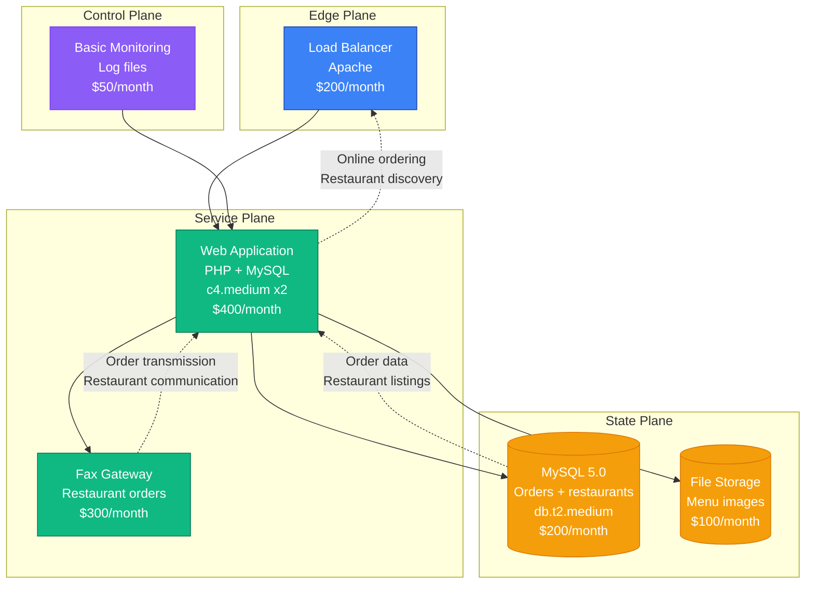
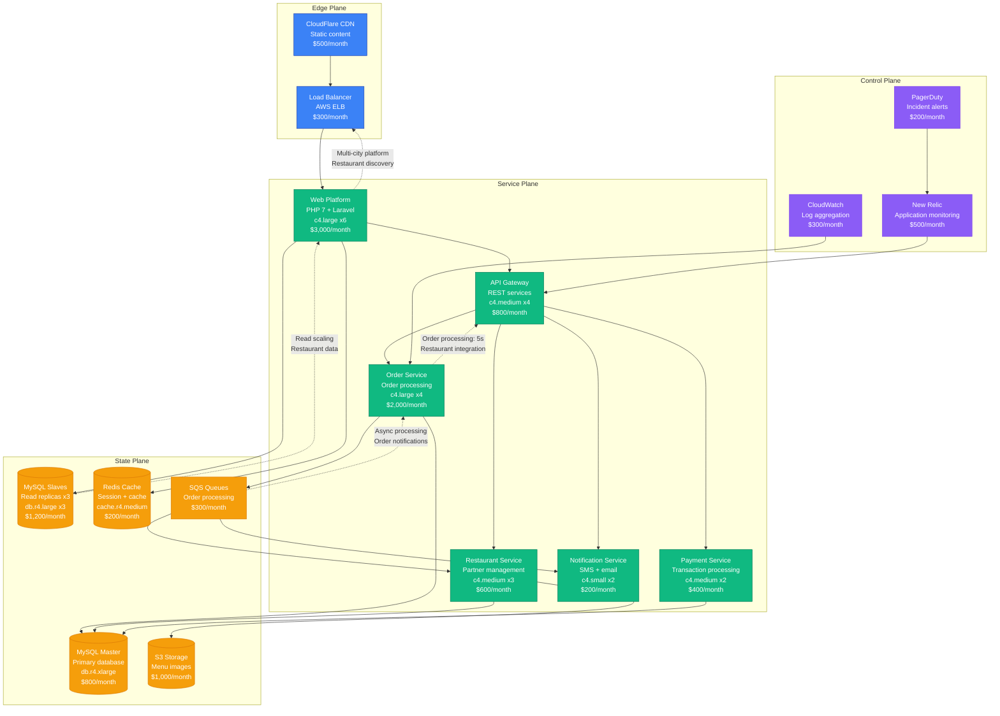
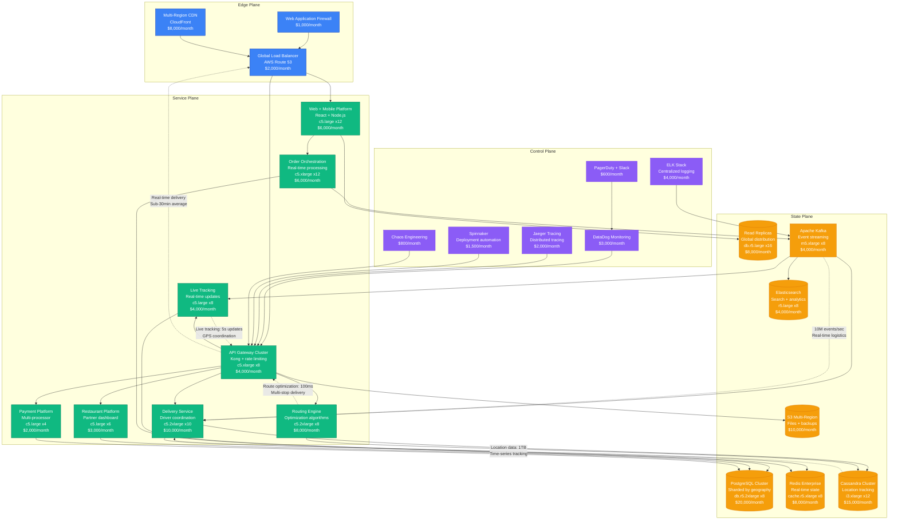

# GrubHub Scale Evolution: From Startup to Food Delivery at Scale

## Executive Summary

GrubHub's journey from a 2004 food delivery startup to one of the largest food delivery platforms represents complex scaling in real-time logistics. The platform had to solve restaurant partnerships, driver coordination, and real-time order tracking while maintaining sub-30-minute delivery times across hundreds of markets.

**Key Metrics Evolution:**
- **2004**: 1K orders, Chicago launch
- **2010**: 100K orders/month, multi-city expansion
- **2016**: 10M orders/month, national coverage
- **2020**: 50M orders/month, pandemic surge
- **2024**: 100M+ orders/month, delivery optimization

## Architecture Evolution Timeline

### Phase 1: Restaurant Ordering Platform (2004-2010) - LAMP Foundation
**Scale: 1K-100K orders/month**

**Key Characteristics:**
- **Architecture**: Classic LAMP stack with fax integration
- **Order Flow**: Online orders transmitted via fax to restaurants
- **Business Model**: Commission-based restaurant marketplace
- **Team Size**: 8 engineers
- **Infrastructure Cost**: $1,250/month
- **Major Innovation**: Digital restaurant ordering with legacy integration

**What Broke:**
- Fax transmission failures during peak hours
- MySQL locks during high order volume
- Manual restaurant onboarding bottlenecks

### Phase 2: Multi-City Expansion (2010-2016) - Service-Oriented Growth
**Scale: 100K-10M orders/month**

**Key Characteristics:**
- **Architecture**: Service-oriented with queue-based processing
- **Geographic Expansion**: Multiple city markets with local restaurants
- **Order Management**: Automated order routing and tracking
- **Team Size**: 40 engineers across 8 teams
- **Infrastructure Cost**: $12,400/month
- **Major Innovation**: Automated restaurant order management at scale

**What Broke:**
- Order processing delays during dinner rush
- Restaurant integration failures
- Payment processing bottlenecks

**How They Fixed It:**
- Implemented SQS for asynchronous order processing
- Added circuit breakers for restaurant integrations
- Horizontal scaling of payment services

### Phase 3: Delivery Network Platform (2016-2020) - Real-Time Logistics
**Scale: 10M-50M orders/month**

**Key Characteristics:**
- **Architecture**: Event-driven microservices with real-time logistics
- **Delivery Network**: Driver fleet management and route optimization
- **Real-Time Tracking**: Live order and delivery tracking
- **Team Size**: 200 engineers across 25 teams
- **Infrastructure Cost**: $121,900/month
- **Major Innovation**: End-to-end delivery platform with real-time optimization

**What Broke:**
- Route optimization failures during peak demand
- Real-time tracking delays during network congestion
- Driver coordination issues in high-density markets

**How They Fixed It:**
- Machine learning-based demand prediction
- Edge caching for location services
- Hierarchical driver dispatch system

### Phase 4: AI-Powered Food Delivery (2020-2024) - Intelligent Logistics
**Scale: 50M-100M+ orders/month**

```mermaid
graph TB
    subgraph "Edge Plane"
        GLB[Global Edge Network<br/>Multi-cloud optimization<br/>$20,000/month]
        CDN[Intelligent CDN<br/>AI-optimized delivery<br/>$30,000/month]
        WAF[AI Security<br/>Fraud detection<br/>$8,000/month]
        EDGE[Edge Computing<br/>Local optimization<br/>$25,000/month]
        style GLB fill:#3B82F6,stroke:#1E40AF,color:#fff
        style CDN fill:#3B82F6,stroke:#1E40AF,color:#fff
        style WAF fill:#3B82F6,stroke:#1E40AF,color:#fff
        style EDGE fill:#3B82F6,stroke:#1E40AF,color:#fff
    end

    subgraph "Service Plane"
        WEB[Omnichannel Platform<br/>Web + Mobile + API<br/>$40,000/month]
        AI_PLATFORM[AI Platform<br/>Demand + routing ML<br/>$100,000/month]
        ORDER[Order Intelligence<br/>Smart order management<br/>$30,000/month]
        DELIVERY[Delivery Intelligence<br/>AI-powered logistics<br/>$80,000/month]
        ROUTING[Smart Routing<br/>ML optimization<br/>$60,000/month]
        DEMAND[Demand Prediction<br/>Forecasting engine<br/>$40,000/month]
        RESTAURANT[Restaurant Intelligence<br/>Partner optimization<br/>$25,000/month]
        DRIVER[Driver Platform<br/>Gig economy management<br/>$35,000/month]
        style WEB fill:#10B981,stroke:#047857,color:#fff
        style AI_PLATFORM fill:#10B981,stroke:#047857,color:#fff
        style ORDER fill:#10B981,stroke:#047857,color:#fff
        style DELIVERY fill:#10B981,stroke:#047857,color:#fff
        style ROUTING fill:#10B981,stroke:#047857,color:#fff
        style DEMAND fill:#10B981,stroke:#047857,color:#fff
        style RESTAURANT fill:#10B981,stroke:#047857,color:#fff
        style DRIVER fill:#10B981,stroke:#047857,color:#fff
    end

    subgraph "State Plane"
        PG_GLOBAL[(PostgreSQL Global<br/>Multi-region clusters<br/>$150,000/month)]
        GRAPH[(Graph Database<br/>Delivery networks<br/>$40,000/month)]
        REDIS_FABRIC[(Redis Fabric<br/>Real-time state<br/>$60,000/month)]
        CASSANDRA_GLOBAL[(Cassandra Global<br/>Location time-series<br/>$80,000/month)]
        VECTOR_DB[(Vector Database<br/>ML embeddings<br/>$50,000/month)]
        DL_PLATFORM[(Data Lake<br/>Analytics + ML<br/>$100,000/month)]
        KAFKA_FABRIC[Event Fabric<br/>Real-time streaming<br/>$50,000/month]
        TS_DB[(Time Series DB<br/>Delivery metrics<br/>$30,000/month)]
        style PG_GLOBAL fill:#F59E0B,stroke:#D97706,color:#fff
        style GRAPH fill:#F59E0B,stroke:#D97706,color:#fff
        style REDIS_FABRIC fill:#F59E0B,stroke:#D97706,color:#fff
        style CASSANDRA_GLOBAL fill:#F59E0B,stroke:#D97706,color:#fff
        style VECTOR_DB fill:#F59E0B,stroke:#D97706,color:#fff
        style DL_PLATFORM fill:#F59E0B,stroke:#D97706,color:#fff
        style KAFKA_FABRIC fill:#F59E0B,stroke:#D97706,color:#fff
        style TS_DB fill:#F59E0B,stroke:#D97706,color:#fff
    end

    subgraph "Control Plane"
        OBS[Observability AI<br/>Predictive monitoring<br/>$20,000/month]
        SEC[Security Intelligence<br/>Fraud + compliance<br/>$15,000/month]
        DEPLOY[Deployment Intelligence<br/>ML-driven releases<br/>$12,000/month]
        CHAOS[Chaos Engineering<br/>Logistics resilience<br/>$8,000/month]
        COST[Cost Intelligence<br/>Dynamic optimization<br/>$10,000/month]
        COMP[Compliance Engine<br/>Multi-market regulations<br/>$18,000/month]
        style OBS fill:#8B5CF6,stroke:#7C3AED,color:#fff
        style SEC fill:#8B5CF6,stroke:#7C3AED,color:#fff
        style DEPLOY fill:#8B5CF6,stroke:#7C3AED,color:#fff
        style CHAOS fill:#8B5CF6,stroke:#7C3AED,color:#fff
        style COST fill:#8B5CF6,stroke:#7C3AED,color:#fff
        style COMP fill:#8B5CF6,stroke:#7C3AED,color:#fff
    end

    WAF --> GLB
    CDN --> GLB
    EDGE --> GLB
    GLB --> WEB

    WEB --> AI_PLATFORM
    WEB --> ORDER
    WEB --> DELIVERY
    WEB --> ROUTING
    WEB --> DEMAND
    WEB --> RESTAURANT
    WEB --> DRIVER

    AI_PLATFORM --> VECTOR_DB
    ORDER --> PG_GLOBAL
    DELIVERY --> CASSANDRA_GLOBAL
    ROUTING --> GRAPH
    DEMAND --> DL_PLATFORM
    RESTAURANT --> PG_GLOBAL
    DRIVER --> REDIS_FABRIC

    KAFKA_FABRIC --> DL_PLATFORM
    KAFKA_FABRIC --> AI_PLATFORM
    KAFKA_FABRIC --> DELIVERY

    OBS --> WEB
    SEC --> WEB
    DEPLOY --> WEB
    CHAOS --> WEB
    COST --> WEB
    COMP --> WEB

    %% Performance annotations
    WEB -.->|"AI-powered delivery<br/>Sub-20min average"| GLB
    AI_PLATFORM -.->|"ML inference: 50ms<br/>Real-time optimization"| WEB
    ROUTING -.->|"Smart routing: 25ms<br/>Dynamic re-routing"| WEB
    KAFKA_FABRIC -.->|"100M events/sec<br/>Real-time logistics intelligence"| AI_PLATFORM
```

**Key Characteristics:**
- **Architecture**: AI-native platform with intelligent logistics
- **ML Integration**: Demand prediction, route optimization, and driver matching
- **Real-Time Intelligence**: Dynamic pricing and delivery optimization
- **Team Size**: 1,000+ engineers across 80+ teams
- **Infrastructure Cost**: $1,091,000/month
- **Major Innovation**: AI-powered food delivery optimization at city scale

**Current Challenges:**
- AI model inference cost optimization at massive scale
- Real-time logistics coordination across multiple markets
- Driver economics optimization with dynamic pricing
- Restaurant partner success optimization with ML insights

## Key Scaling Lessons

### Logistics Platform Evolution
1. **Fax-Based Orders**: Manual restaurant order transmission
2. **Digital Integration**: API-based restaurant connections
3. **Delivery Network**: In-house driver fleet management
4. **Real-Time Optimization**: ML-powered route and demand optimization
5. **Intelligent Logistics**: AI-driven end-to-end delivery coordination

### Real-Time Systems Evolution
1. **Batch Processing**: Daily order summaries and reports
2. **Near Real-Time**: Hourly delivery updates
3. **Real-Time Tracking**: Live GPS-based order tracking
4. **Predictive Systems**: ML-based demand and delivery time prediction
5. **Intelligent Automation**: AI-powered dynamic routing and pricing

### Data Architecture Evolution
1. **Single MySQL**: All order and restaurant data
2. **Sharded Databases**: Geographic partitioning for scale
3. **Polyglot Persistence**: Multiple databases for specific use cases
4. **Time-Series Focus**: Location and delivery event tracking
5. **ML Data Platform**: Real-time feature engineering for AI models

### Infrastructure Costs by Phase
- **Phase 1**: $1,250/month → $1.25 per order
- **Phase 2**: $12,400/month → $0.0012 per order
- **Phase 3**: $121,900/month → $0.0024 per order
- **Phase 4**: $1,091,000/month → $0.011 per order

### Team Structure Evolution
- **Phase 1**: Single product team
- **Phase 2**: Geographic expansion teams
- **Phase 3**: Platform teams (Delivery, Routing, Tracking)
- **Phase 4**: AI-first teams with embedded ML engineers

## Production Incidents and Resolutions

### The Dinner Rush Meltdown (2017)
**Problem**: Order processing system overwhelmed during peak dinner hours
**Impact**: 4 hours of degraded service across major markets
**Root Cause**: Database connection pool exhaustion
**Solution**: Auto-scaling with predictive capacity planning
**Cost**: $8M in lost orders and customer credits

### GPS Tracking Service Outage (2019)
**Problem**: Real-time tracking failed during severe weather
**Impact**: 6 hours of delivery visibility loss
**Root Cause**: Third-party location service dependency
**Solution**: Multi-provider GPS with automatic failover
**Cost**: $5M in customer experience impact

### AI Route Optimization Failure (2022)
**Problem**: ML routing model caused delivery delays during holiday surge
**Impact**: 8 hours of suboptimal routing affecting delivery times
**Root Cause**: Model training data didn't account for holiday patterns
**Solution**: Real-time model validation and rollback procedures
**Cost**: $12M in delivery time guarantees and driver overtime

## Technology Stack Evolution

### Platform Evolution
- **2004-2010**: PHP + MySQL with fax integration
- **2010-2016**: Service-oriented PHP with queue processing
- **2016-2020**: Microservices with real-time tracking
- **2020-2024**: AI-native platform with intelligent logistics

### Data Platform Evolution
- **MySQL**: Core order and restaurant data
- **Cassandra**: High-volume location and tracking data
- **Redis**: Real-time state and session management
- **Kafka**: Event streaming for logistics coordination
- **Graph Database**: Delivery network optimization

## Critical Success Factors

1. **Restaurant Partnership**: Deep integration with restaurant operations
2. **Driver Network**: Scalable gig economy workforce management
3. **Real-Time Logistics**: Live tracking and dynamic optimization
4. **Local Market Focus**: City-specific delivery optimization
5. **AI-Powered Efficiency**: Machine learning for demand and routing
6. **Multi-Modal Delivery**: Integration with various delivery methods

GrubHub's evolution demonstrates how food delivery platforms must balance real-time logistics coordination, partner ecosystem management, and AI-powered optimization while scaling to serve millions of orders across diverse geographic markets.