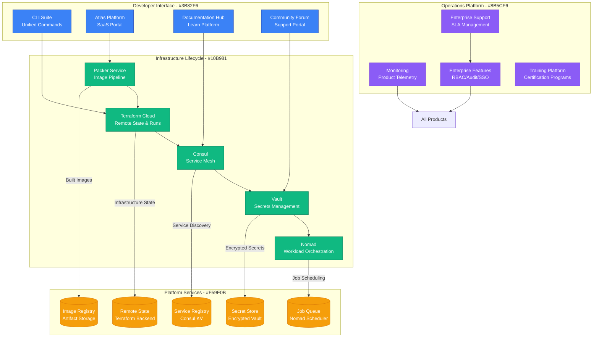
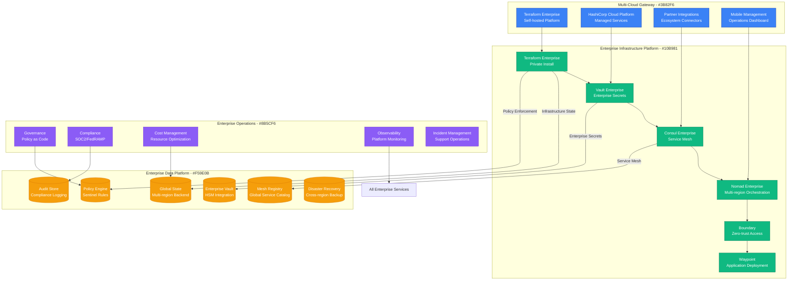
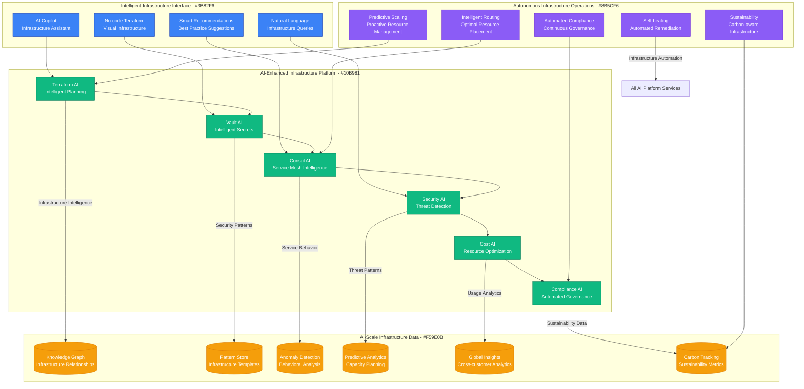
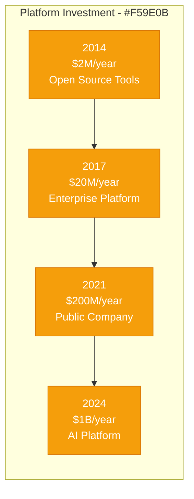

# HashiCorp: DevOps Tools to Platform Company

## Executive Summary

HashiCorp's scaling journey from open-source DevOps tools to a $15B+ infrastructure automation platform represents one of the most successful open-source commercialization stories. This case study examines their evolution from 2012 to 2024, focusing on the unique challenges of scaling a multi-product platform that provisions and manages infrastructure for 200M+ resources globally while maintaining open-source community engagement.

## Scale Milestones

| Milestone | Year | Products | Key Challenge | Solution | Resources Managed |
|-----------|------|----------|---------------|----------|-------------------|
| OSS Launch | 2012 | 1 (Vagrant) | Developer adoption | Free developer tools | 100K VMs |
| Multi-Product | 2014 | 4 products | Product coherence | Unified workflow | 10M resources |
| Enterprise | 2017 | 6 products | Enterprise features | Cloud platform strategy | 100M resources |
| IPO Scale | 2021 | 8 products | Global operations | Multi-cloud platform | 1B+ resources |
| AI-Enhanced | 2024 | 10+ products | AI integration | Intelligent automation | 10B+ resources |

## Architecture Evolution

### Phase 1: Developer Tool Ecosystem (2012-2014)
*Scale: 1 → 4 products*

```mermaid
graph TB
    subgraph "Edge Plane - #3B82F6"
        CLI[Command Line Tools<br/>Terraform/Vagrant CLI]
        WEB[Download Portal<br/>Static Website]
    end

    subgraph "Service Plane - #10B981"
        VAGRANT[Vagrant<br/>Development Environments]
        PACKER[Packer<br/>Image Building]
        SERF[Serf<br/>Service Discovery]
        TERRAFORM[Terraform<br/>Infrastructure as Code]
    end

    subgraph "State Plane - #F59E0B"
        LOCAL_STATE[(Local State<br/>File System)]
        VAGRANT_BOXES[(Vagrant Boxes<br/>Atlas Registry)]
        PACKER_TEMPLATES[(Packer Templates<br/>Version Control)]
    end

    subgraph "Control Plane - #8B5CF6"
        GITHUB[GitHub<br/>Source Control]
        RELEASES[Release Management<br/>Manual Process)]
    end

    %% Connections
    CLI --> VAGRANT
    CLI --> PACKER
    CLI --> TERRAFORM
    WEB --> VAGRANT_BOXES

    VAGRANT --> LOCAL_STATE
    PACKER --> PACKER_TEMPLATES
    TERRAFORM --> LOCAL_STATE

    %% Styling
    classDef edgeStyle fill:#3B82F6,stroke:#1E40AF,color:#fff
    classDef serviceStyle fill:#10B981,stroke:#047857,color:#fff
    classDef stateStyle fill:#F59E0B,stroke:#D97706,color:#fff
    classDef controlStyle fill:#8B5CF6,stroke:#6D28D9,color:#fff

    class CLI,WEB edgeStyle
    class VAGRANT,PACKER,SERF,TERRAFORM serviceStyle
    class LOCAL_STATE,VAGRANT_BOXES,PACKER_TEMPLATES stateStyle
    class GITHUB,RELEASES controlStyle
```

**Key Metrics (2014)**:
- GitHub Stars: 100K+ combined
- Downloads: 1M+ monthly
- Contributors: 500+
- Products: 4 (Vagrant, Packer, Serf, Terraform)

### Phase 2: Unified Workflow Platform (2014-2017)
*Scale: 4 → 6 products*



**Breakthrough Moment**: Terraform's introduction of Infrastructure as Code paradigm revolutionized cloud provisioning.

**Key Metrics (2017)**:
- Terraform Resources: 10M+ managed daily
- Vault Secrets: 100M+ stored
- Enterprise Customers: 500+
- Annual Recurring Revenue: $50M

### Phase 3: Enterprise Platform Strategy (2017-2021)
*Scale: 6 → 8 products*



**Key Innovation**: Policy as Code with Sentinel enabled governance at scale for enterprise customers.

**Key Metrics (2021)**:
- Terraform Resources: 1B+ under management
- Enterprise Customers: 2,000+
- Annual Recurring Revenue: $500M
- IPO Valuation: $15B

### Phase 4: AI-Enhanced Infrastructure Platform (2021-2024)
*Scale: 8 → 10+ products*



**Current Metrics (2024)**:
- Infrastructure Resources: 10B+ under management
- AI Recommendations: 1B+ generated daily
- Enterprise Customers: 5,000+
- Annual Recurring Revenue: $1B+

## Critical Scale Events

### The Terraform Adoption Explosion (2015)
**Challenge**: Manual infrastructure provisioning couldn't scale with cloud adoption.

**Solution**: Infrastructure as Code paradigm with declarative configuration language.

**Impact**: Created entirely new category and became industry standard.

### Enterprise Feature Development (2017)
**Challenge**: Open-source tools lacked enterprise governance and security features.

**Innovation**: Enterprise editions with RBAC, audit trails, and policy enforcement.

**Result**: Enabled Fortune 500 adoption and $50M+ ARR.

### HashiCorp Cloud Platform Launch (2020)
**Challenge**: Customers wanted managed services without self-hosting complexity.

**Solution**: Fully managed SaaS versions of all products.

### Multi-Product Integration Challenge (2019)
**Challenge**: Customers used multiple HashiCorp tools but they weren't well integrated.

**Breakthrough**: Unified workflow with shared authentication, policies, and audit.

### AI Integration Revolution (2023)
**Challenge**: Infrastructure complexity required AI assistance for optimal management.

**Solution**: Native AI capabilities across all products for intelligent automation.

## Technology Evolution

### Product Architecture
- **2012-2014**: Single-purpose CLI tools
- **2014-2017**: Integrated workflow platform
- **2017-2021**: Enterprise-grade platform
- **2021-2024**: AI-enhanced intelligent platform

### State Management Evolution
- **2012-2015**: Local file-based state
- **2015-2018**: Remote state backends
- **2018-2021**: Global state management
- **2021-2024**: AI-optimized state intelligence

### Platform Philosophy
- **Phase 1**: "Simple, powerful tools"
- **Phase 2**: "Unified workflow"
- **Phase 3**: "Enterprise platform"
- **Phase 4**: "Intelligent automation"

## Financial Impact

### Infrastructure Investment by Phase


### Revenue Milestones
- **2014**: $1M ARR (early enterprise)
- **2017**: $50M ARR (enterprise breakthrough)
- **2021**: $500M ARR (IPO year)
- **2024**: $1B+ ARR (AI transformation)

### Business Model Evolution
- **2012-2016**: Open source + support
- **2016-2019**: Enterprise editions
- **2019-2022**: Cloud SaaS platform
- **2022-2024**: AI-enhanced platform pricing

## Lessons Learned

### What Worked
1. **Open Source Foundation**: Built massive community and adoption
2. **Workflow Integration**: Connected tools created platform value
3. **Enterprise Focus**: Early enterprise features enabled monetization
4. **Multi-Cloud Strategy**: Avoided vendor lock-in expanded market

### What Didn't Work
1. **Consumer Market**: Never successfully penetrated developer consumer market
2. **Pricing Complexity**: Complex multi-product pricing confused customers
3. **UI/UX Investment**: Late investment in user experience hurt adoption
4. **Competitive Response**: Slow response to cloud provider competitive threats

### Key Technical Decisions
1. **HashiCorp Configuration Language (HCL)**: Created consistent experience across products
2. **Remote State Management**: Enabled collaboration and enterprise adoption
3. **Policy as Code**: Allowed governance at scale
4. **API-First Design**: Enabled ecosystem and automation

## Current Architecture (2024)

**Global Infrastructure**:
- 20+ cloud regions worldwide
- 10B+ resources under management
- 99.99% uptime SLA for HCP
- 1B+ API calls daily

**Key Technologies**:
- Go (primary language for all products)
- HCL (configuration language)
- gRPC (service communication)
- PostgreSQL (metadata storage)
- Consul (service discovery/mesh)

**Operating Metrics**:
- 5,000+ enterprise customers
- 10M+ community users
- 10B+ resources managed
- $1B+ annual revenue run rate

## Looking Forward: Next 5 Years

### Predicted Challenges
1. **Cloud Provider Competition**: AWS, Azure, GCP building competing native services
2. **AI Compute Costs**: GPU infrastructure for AI features scaling expenses
3. **Open Source Sustainability**: Balancing community and commercial interests
4. **Regulatory Compliance**: Infrastructure governance across global jurisdictions

### Technical Roadmap
1. **Autonomous Infrastructure**: Self-managing and self-healing infrastructure
2. **Natural Language Operations**: Infrastructure management through conversational AI
3. **Quantum-Safe Security**: Post-quantum cryptography in Vault
4. **Carbon-Neutral Infrastructure**: Sustainability-first resource management

**Summary**: HashiCorp's evolution from simple DevOps tools to an AI-enhanced infrastructure platform demonstrates the power of solving fundamental developer problems with elegant abstractions. Their success lies in creating an integrated workflow that spans the entire infrastructure lifecycle while maintaining the simplicity and power that made their individual tools popular. The addition of AI capabilities positions them well for the next generation of intelligent infrastructure management.