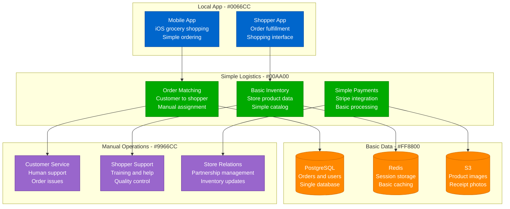
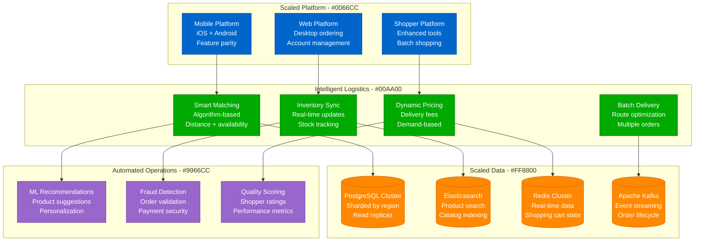
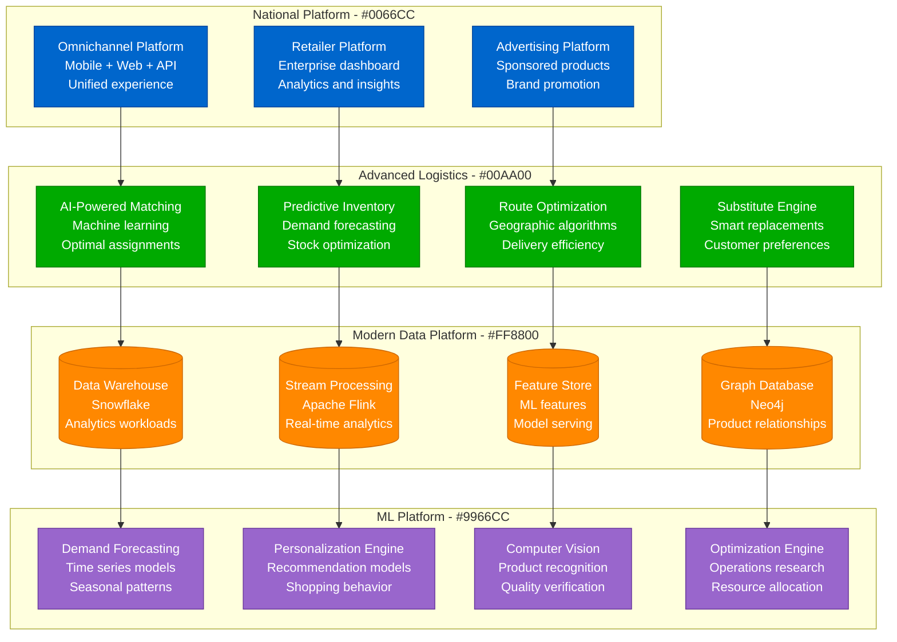

# Instacart Scale Evolution: 100 to 10M Users

## Executive Summary

Instacart's scaling journey from 100 beta users to 10M+ customers represents the transformation of grocery shopping through on-demand delivery. The platform evolved from a simple shopping app to a comprehensive grocery technology platform serving millions of customers and hundreds of thousands of shoppers.

**Key Scaling Metrics:**
- **Customers**: 100 → 10,000,000+ (100,000x growth)
- **Shoppers**: 10 → 600,000+ personal shoppers
- **Retailers**: 5 → 1,400+ grocery chains
- **Orders/week**: 10 → 5,000,000+ (500,000x growth)
- **Items cataloged**: 1K → 1,000,000,000+ SKUs
- **Infrastructure cost**: $5K/month → $1B+/year

## Phase 1: Local Grocery Delivery (2012-2014)
**Scale: 100-10K customers, San Francisco only**

### Technology Stack
- **Mobile**: Native iOS app, later Android
- **Backend**: Ruby on Rails, PostgreSQL
- **Payments**: Stripe for transaction processing
- **Infrastructure**: Heroku, basic AWS services

### Key Features
- **Personal shopping** service concept
- **Real-time communication** between customer and shopper
- **Replacement approval** for out-of-stock items
- **Same-day delivery** in local market

## Phase 2: Multi-City Expansion (2014-2017)
**Scale: 10K-1M customers, 25+ cities**

### Multi-City Challenges
1. **Inventory management** across different store chains
2. **Shopper recruitment** and training at scale
3. **Quality control** with distributed workforce
4. **Local market adaptation** for different regions

### Technology Evolution
- **Microservices architecture** for independent scaling
- **Machine learning** for matching and recommendations
- **Real-time inventory** synchronization
- **Advanced mobile features** for enhanced shopping

## Phase 3: National Platform (2017-2020)
**Scale: 1M-5M customers, nationwide coverage**

### National Expansion Features
1. **Retailer partnerships** with major chains
2. **Advertising business** for CPG brands
3. **Enterprise solutions** for B2B customers
4. **Advanced analytics** for retailers

### COVID-19 Response (2020)
- **10x order volume** during lockdowns
- **Emergency scaling** of infrastructure
- **Priority customer** systems for essential workers
- **Safety protocols** for shoppers

## Phase 4: Grocery Technology Platform (2020-Present)
**Scale: 5M-10M+ customers, comprehensive ecosystem**

### Current Platform Features
- **Instacart Health** - Prescription delivery
- **Smart Carts** - In-store technology
- **Caper AI** - Autonomous checkout
- **Instacart Business** - Corporate solutions
- **Connected Stores** - Retailer technology

## Order Volume Evolution

### Growth Trajectory

| Year | Weekly Orders | Active Customers | Avg Order Value | Shopper Earnings |
|------|---------------|------------------|-----------------|------------------|
| 2014 | 1K | 10K | $35 | $50/week |
| 2016 | 100K | 100K | $45 | $200/week |
| 2018 | 500K | 1M | $55 | $300/week |
| 2020 | 3M | 5M | $85 | $500/week |
| 2024 | 5M+ | 10M+ | $95 | $600/week |

## Cost Evolution

| Phase | Period | Monthly Cost | Cost per Order | Primary Drivers |
|-------|--------|--------------|----------------|----------------|
| Local | 2012-2014 | $5K-100K | $10 | Basic infrastructure |
| Multi-City | 2014-2017 | $100K-5M | $5 | Geographic expansion |
| National | 2017-2020 | $5M-50M | $3 | ML infrastructure |
| Platform | 2020-Present | $50M-100M+ | $2 | Technology innovation |

## Key Lessons Learned

### Technical Lessons
1. **Three-sided marketplace complexity** - Customers, shoppers, and retailers
2. **Real-time inventory is critical** - Out-of-stock items destroy experience
3. **Mobile-first design essential** - Grocery shopping is mobile behavior
4. **Machine learning enables optimization** - Human-scale matching doesn't work
5. **Data quality affects ML accuracy** - Clean inventory data is foundation

### Business Lessons
1. **Unit economics must work early** - Delivery costs need to be sustainable
2. **Shopper experience drives quality** - Happy shoppers create happy customers
3. **Retailer partnerships are strategic** - Technology integration creates moats
4. **Advertising business scales** - Brand advertising has better economics
5. **Platform approach wins** - Technology solutions beat pure delivery

### Operational Lessons
1. **Customer service scales differently** - Grocery issues require food expertise
2. **Quality control requires innovation** - Computer vision helps verify orders
3. **Seasonal demand is extreme** - Holiday planning affects entire year
4. **Local market knowledge matters** - Regional preferences affect algorithms
5. **Safety protocols are essential** - Food safety and delivery safety critical

## Current Scale Metrics (2024)

| Metric | Value | Source |
|--------|-------|--------|
| Active Customers | 10M+ | Company reports |
| Personal Shoppers | 600K+ | Platform metrics |
| Retail Partners | 1,400+ | Partnership data |
| Weekly Orders | 5M+ | Order volume |
| Items Catalogued | 1B+ | Product database |
| Cities Served | 5,500+ | Geographic coverage |
| Revenue | $30B+ GMV | Financial reports |
| Employees | 3,000+ | Company reports |

---

*Instacart's evolution from local grocery delivery to comprehensive grocery technology platform demonstrates how three-sided marketplace dynamics, combined with machine learning optimization and retailer partnerships, can transform an entire industry while creating sustainable unit economics at scale.*