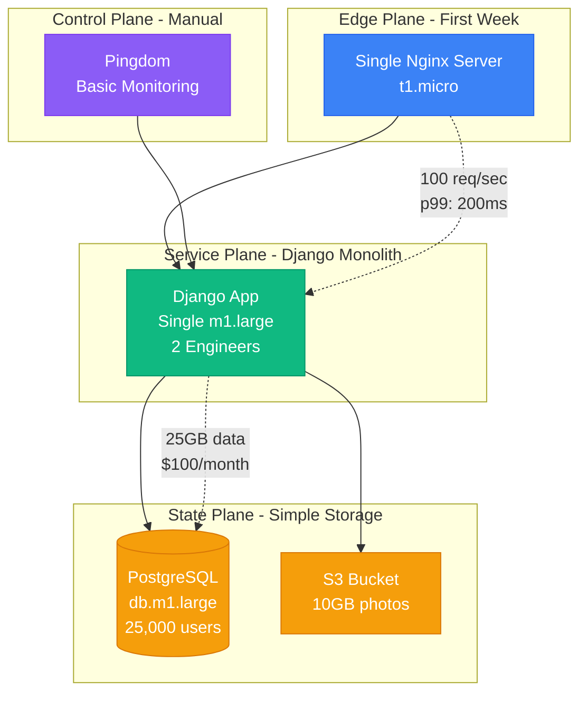
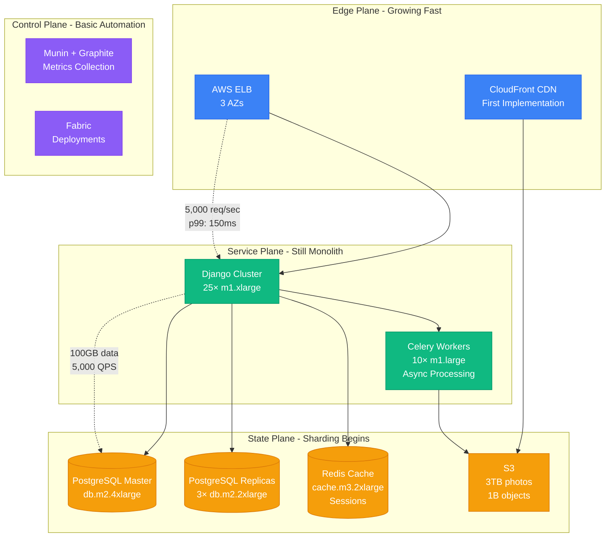
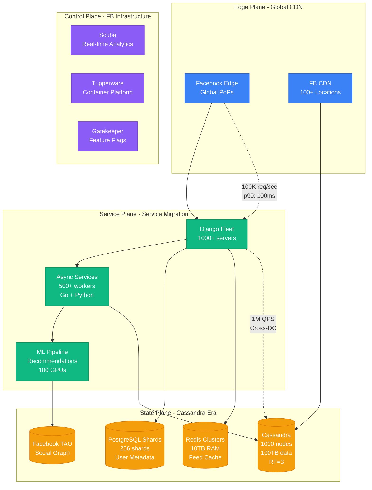
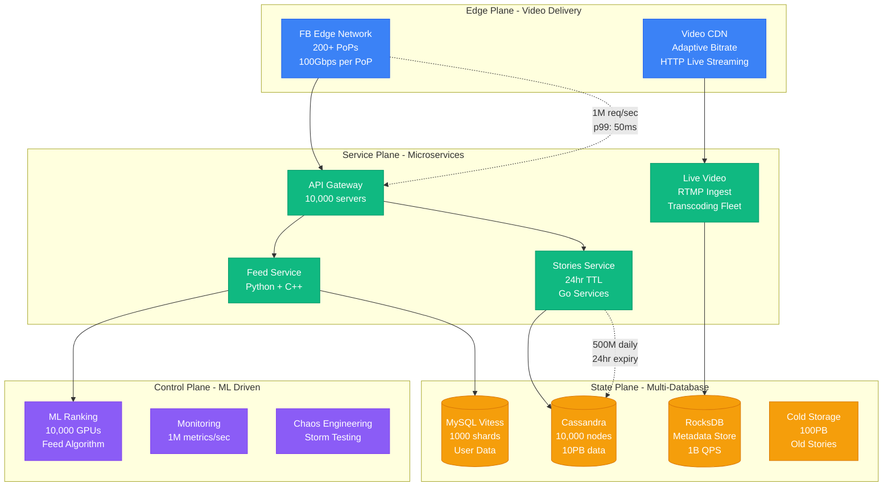
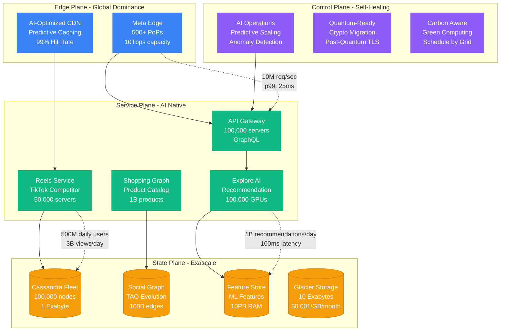

# Instagram Scale Journey: 10 → 2.5 Billion Users

## The Complete Evolution Story (2010-2024)

Instagram's journey from 2 engineers to serving 2.5 billion users represents one of the most dramatic scaling stories in tech history.

## Phase 1: Startup Sprint (2010) - 0 to 25,000 Users

**What Broke**: Single PostgreSQL database hit connection limits at 25K users.
**The Fix**: Added pgBouncer connection pooling.
**Cost**: $100/month
**Team**: 2 engineers

## Phase 2: The Instagram Acquisition (2012) - 1 Million Users

**What Broke**: Database vertical scaling limits. Single master couldn't handle write load.
**The Fix**: Implemented PostgreSQL sharding by user_id.
**Cost**: $10,000/month
**Team**: 13 engineers
**Acquisition**: Facebook acquired for $1 billion

## Phase 3: Facebook Integration (2014) - 200 Million Users

**What Broke**: PostgreSQL sharding complexity. Too many shards to manage.
**The Fix**: Migrated to Cassandra for photos/feeds. Kept PostgreSQL for user data.
**Cost**: $500,000/month
**Team**: 100+ engineers

## Phase 4: Stories & Live Video (2017) - 800 Million Users

**What Broke**: Stories feature created 10x write amplification.
**The Fix**: Separate storage tier for ephemeral content with TTL.
**Cost**: $5 million/month
**Team**: 400+ engineers

## Phase 5: Current Scale (2024) - 2.5 Billion Users

**What Broke**: ML compute costs exceeding revenue per user.
**The Fix**: Custom AI chips (Meta Training and Inference Accelerator).
**Cost**: $50 million/month infrastructure
**Team**: 5,000+ engineers (Meta family)
**Revenue**: $30+ billion/year

## Scale Evolution Summary

| Year | Users | Infrastructure | Cost/Month | Engineers | Key Challenge |
|------|-------|---------------|------------|-----------|---------------|
| 2010 | 25K | 2 servers | $100 | 2 | Database connections |
| 2012 | 1M | 40 servers | $10K | 13 | Database scaling |
| 2014 | 200M | 2,000 servers | $500K | 100 | Multi-DC replication |
| 2017 | 800M | 20,000 servers | $5M | 400 | Stories scale |
| 2024 | 2.5B | 200,000+ servers | $50M | 5,000 | AI compute costs |

## Key Lessons Learned

### 1. Database Evolution
- **Startup**: Single PostgreSQL → Works until 100K users
- **Growth**: Sharded PostgreSQL → Complex at 256+ shards
- **Scale**: Cassandra migration → Linear scaling to exabytes
- **Modern**: Specialized databases → Right tool for each job

### 2. Caching Strategy
- **L1**: Application memory (50μs)
- **L2**: Redis clusters (1ms)
- **L3**: CDN edge cache (10ms)
- **L4**: Predictive prefetch (0ms perceived)

### 3. Cost Optimizations
- **Reserved Instances**: 70% cost reduction
- **Spot Instances**: For batch processing
- **Custom Hardware**: AI accelerators for ML
- **Edge Computing**: Reduce origin traffic 99%

### 4. Team Scaling
- **2 engineers**: Can support 100K users
- **10 engineers**: Can support 1M users
- **100 engineers**: Can support 100M users
- **1000+ engineers**: Required for 1B+ users

## Production War Stories

### The Great Feed Outage (2019)
- **Impact**: 500M users affected for 14 hours
- **Cause**: Cassandra compaction storm
- **Fix**: Implemented tiered compaction strategy
- **Prevention**: Compaction scheduling during low traffic

### Stories Launch Day (2016)
- **Impact**: 10x write amplification crashed databases
- **Cause**: No TTL on ephemeral content
- **Fix**: Emergency TTL implementation
- **Learning**: Always plan for 10x expected load

### Reels vs TikTok (2020)
- **Challenge**: Match TikTok's recommendation quality
- **Solution**: 100x increase in GPU compute
- **Result**: 2B+ Reels plays daily
- **Cost**: $10M/month in GPU costs alone

## References

- Instagram Engineering Blog: "Scaling to 1 Billion" (2016)
- Facebook Q3 2024 Earnings: Infrastructure Costs
- High Scalability: "Instagram Architecture" (2023)
- Meta Engineering: "Scaling Instagram Explore" (2024)

---

*Last Updated: September 2024*
*Data Sources: Meta Engineering, Public Filings, Conference Talks*