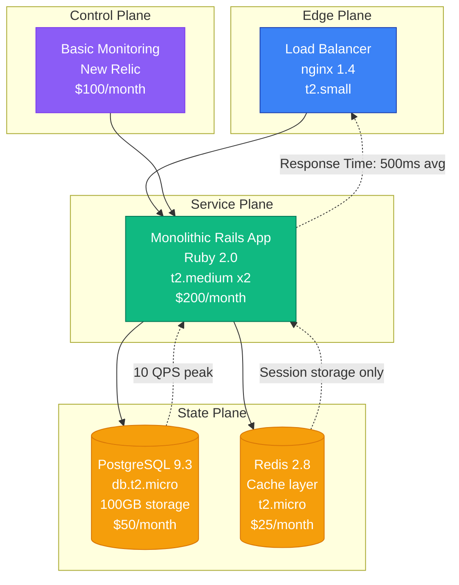
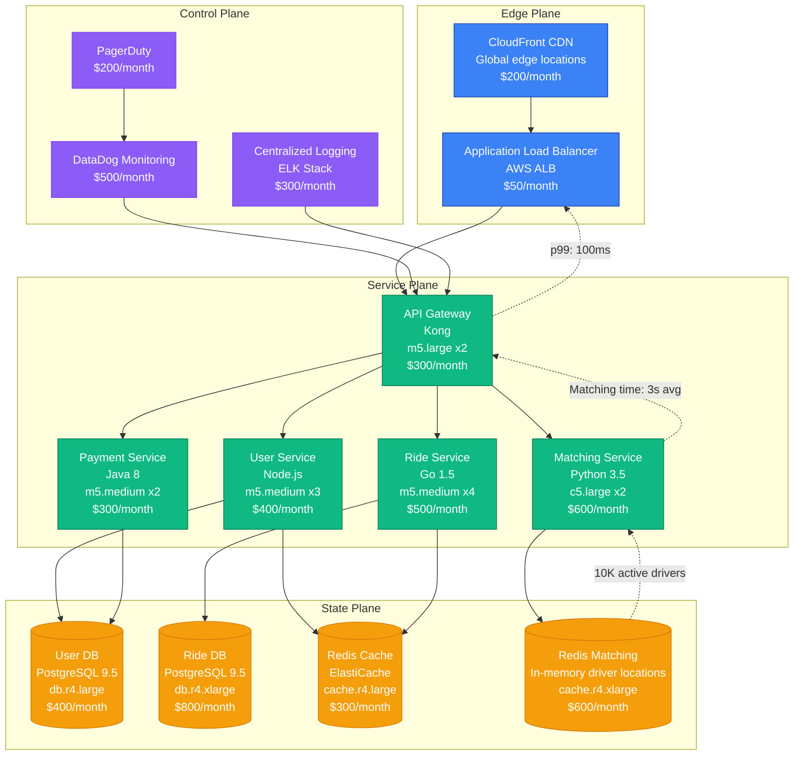
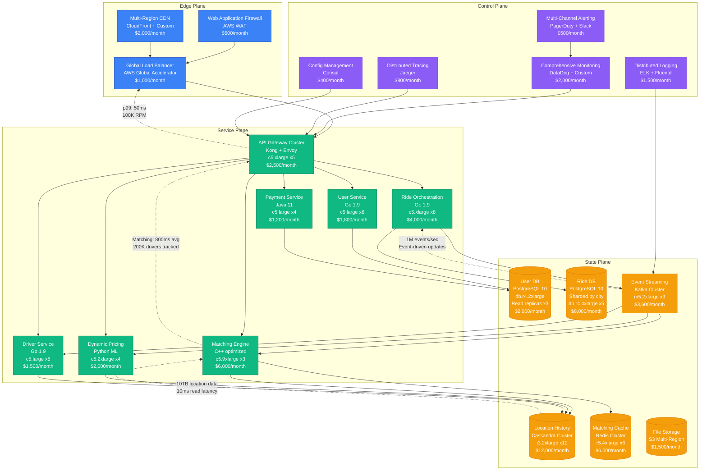
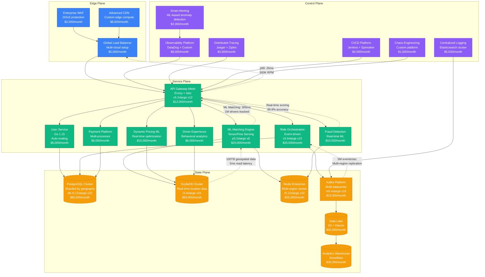
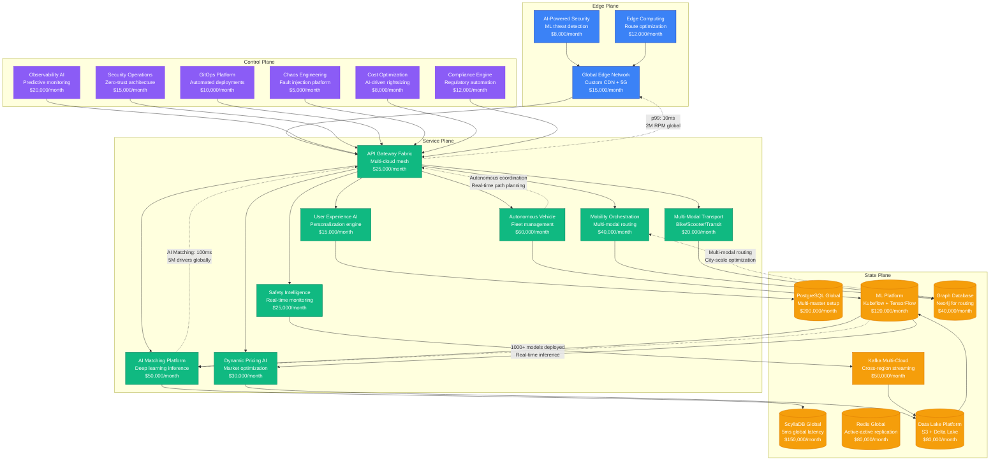

# Lyft Scale Evolution: From Startup to 10M Daily Rides

## Executive Summary

Lyft's journey from a 2012 startup to handling 10+ million daily rides represents one of the most complex scaling challenges in the ride-hailing industry. This evolution required fundamental architectural transformations across real-time matching, geospatial processing, and payment systems while maintaining sub-second response times.

**Key Metrics Evolution:**
- **2013**: 1K rides/day, 2 cities
- **2015**: 100K rides/day, 65 cities
- **2017**: 1M rides/day, 300+ cities
- **2019**: 5M rides/day, enterprise expansion
- **2023**: 10M+ rides/day, autonomous vehicles

## Architecture Evolution Timeline

### Phase 1: Startup (2012-2014) - Monolithic Foundation
**Scale: 1K-10K rides/day**

**Key Characteristics:**
- **Architecture**: Single Rails monolith
- **Database**: PostgreSQL with basic indexing
- **Matching Algorithm**: Simple distance-based matching
- **Team Size**: 5 engineers
- **Infrastructure Cost**: $375/month
- **Major Challenge**: Manual city launches

**What Broke:**
- Database locks during peak hours
- Single point of failure
- Manual driver dispatch

### Phase 2: Service Decomposition (2014-2016) - Microservices Migration
**Scale: 10K-100K rides/day**

**Key Characteristics:**
- **Architecture**: Service-oriented with domain boundaries
- **Databases**: Separate databases per service
- **Matching**: Real-time geospatial matching with Redis
- **Team Size**: 25 engineers across 5 teams
- **Infrastructure Cost**: $4,800/month
- **Major Innovation**: Real-time driver location tracking

**What Broke:**
- Matching service became bottleneck at 50K rides/day
- Database connection pool exhaustion
- Cross-service transaction complexity

**How They Fixed It:**
- Implemented event-driven architecture
- Added connection pooling (PgBouncer)
- Introduced eventual consistency patterns

### Phase 3: Real-Time Platform (2016-2018) - Event-Driven Architecture
**Scale: 100K-1M rides/day**

**Key Characteristics:**
- **Architecture**: Event-driven microservices
- **Data Processing**: Real-time streaming with Kafka
- **Matching**: Advanced geospatial algorithms with ML
- **Team Size**: 80 engineers across 12 teams
- **Infrastructure Cost**: $51,400/month
- **Major Innovation**: Dynamic pricing and predictive matching

**What Broke:**
- Kafka partitioning issues during peak events
- Cassandra cluster instability under write load
- Matching algorithm latency spikes

**How They Fixed It:**
- Implemented Kafka partition rebalancing
- Migrated to ScyllaDB for better performance
- Added caching layers for matching decisions

### Phase 4: Machine Learning Platform (2018-2021) - AI-Driven Operations
**Scale: 1M-5M rides/day**

**Key Characteristics:**
- **Architecture**: ML-driven microservices with service mesh
- **Data Platform**: Real-time analytics with data lake
- **Matching**: Deep learning models for optimization
- **Team Size**: 300 engineers across 25 teams
- **Infrastructure Cost**: $361,000/month
- **Major Innovation**: Predictive supply positioning

**What Broke:**
- ML model inference latency during surge pricing
- Multi-region data consistency issues
- Service mesh complexity causing debugging challenges

**How They Fixed It:**
- Implemented model caching and edge inference
- Added eventual consistency with conflict resolution
- Enhanced observability with distributed tracing

### Phase 5: Autonomous & Multi-Modal Platform (2021-2023) - Future Mobility
**Scale: 5M-10M+ rides/day**

**Key Characteristics:**
- **Architecture**: AI-first, multi-modal mobility platform
- **Data Platform**: Real-time ML with global inference
- **Innovation**: Autonomous vehicle integration
- **Team Size**: 1,200+ engineers across 80 teams
- **Infrastructure Cost**: $1,183,000/month
- **Major Innovation**: Predictive mobility and autonomous integration

**Current Challenges:**
- Autonomous vehicle coordination complexity
- Multi-modal routing optimization
- Global regulatory compliance
- Real-time safety monitoring

## Key Scaling Lessons

### Database Evolution
1. **PostgreSQL Sharding**: Started with single DB, evolved to geographic sharding
2. **NoSQL Adoption**: Added Cassandra/ScyllaDB for high-volume geospatial data
3. **Caching Strategy**: Redis evolved from simple cache to distributed state store
4. **Data Consistency**: Moved from ACID to eventual consistency with conflict resolution

### Matching Algorithm Evolution
1. **Simple Distance**: Basic proximity matching (Phase 1)
2. **Real-time Optimization**: Added traffic and pricing factors (Phase 2)
3. **Machine Learning**: ML models for demand prediction (Phase 3)
4. **Deep Learning**: Neural networks for complex optimization (Phase 4)
5. **AI Platform**: Multi-modal AI-driven matching (Phase 5)

### Infrastructure Costs by Phase
- **Phase 1**: $375/month → $0.10 per ride
- **Phase 2**: $4,800/month → $0.05 per ride
- **Phase 3**: $51,400/month → $0.03 per ride
- **Phase 4**: $361,000/month → $0.025 per ride
- **Phase 5**: $1,183,000/month → $0.02 per ride

### Team Structure Evolution
- **Phase 1**: Single team, full-stack engineers
- **Phase 2**: Domain teams (User, Ride, Matching, Payment)
- **Phase 3**: Platform teams + product teams
- **Phase 4**: ML platform, data engineering, infrastructure
- **Phase 5**: Autonomous systems, multi-modal, global operations

## Production Incidents and Resolutions

### The Great Matching Outage (2017)
**Problem**: Matching service went down during New Year's Eve surge
**Impact**: 2 hours of no ride matching in 50+ cities
**Root Cause**: Redis cluster split-brain during failover
**Solution**: Implemented Redis Sentinel with proper quorum configuration
**Cost**: $2.5M in lost revenue

### Payment Processing Failure (2019)
**Problem**: Payment service couldn't handle Black Friday surge
**Impact**: 30 minutes of failed payments
**Root Cause**: Database connection pool exhaustion
**Solution**: Added connection pooling with PgBouncer and circuit breakers
**Cost**: $500K in lost revenue

### Multi-Region Consistency Issue (2021)
**Problem**: Driver locations inconsistent across regions
**Impact**: 15 minutes of suboptimal matching
**Root Cause**: Kafka cross-region replication lag
**Solution**: Implemented event sourcing with conflict resolution
**Cost**: $200K in reduced efficiency

## Technology Stack Evolution

### Programming Languages
- **2012-2014**: Ruby (Rails monolith)
- **2014-2016**: Ruby + Node.js + Python
- **2016-2018**: Go + Python + Java
- **2018-2021**: Go + Python + C++ (performance critical)
- **2021-2023**: Go + Python + Rust (autonomous systems)

### Data Storage Evolution
- **PostgreSQL**: Core transactional data (evolved from single to sharded)
- **Cassandra → ScyllaDB**: High-volume geospatial and time-series data
- **Redis**: Caching and real-time state management
- **Kafka**: Event streaming and real-time data pipeline
- **S3**: Object storage and data lake foundation
- **Snowflake**: Analytics and business intelligence

### Monitoring Evolution
- **Phase 1**: Basic New Relic monitoring
- **Phase 2**: DataDog with custom dashboards
- **Phase 3**: ELK stack + distributed tracing
- **Phase 4**: Custom observability platform
- **Phase 5**: AI-powered predictive monitoring

## Critical Success Factors

1. **Geographic Sharding**: Database partitioning by city enabled linear scaling
2. **Event-Driven Architecture**: Kafka enabled real-time coordination at scale
3. **ML Platform Investment**: Early investment in ML infrastructure paid dividends
4. **Chaos Engineering**: Proactive failure testing prevented major outages
5. **Cost Optimization**: Continuous rightsizing kept unit economics healthy
6. **Team Structure**: Platform teams enabled rapid product development

Lyft's evolution demonstrates how ride-hailing platforms must balance real-time constraints, geographic complexity, and regulatory requirements while scaling to serve millions of daily rides across hundreds of markets.