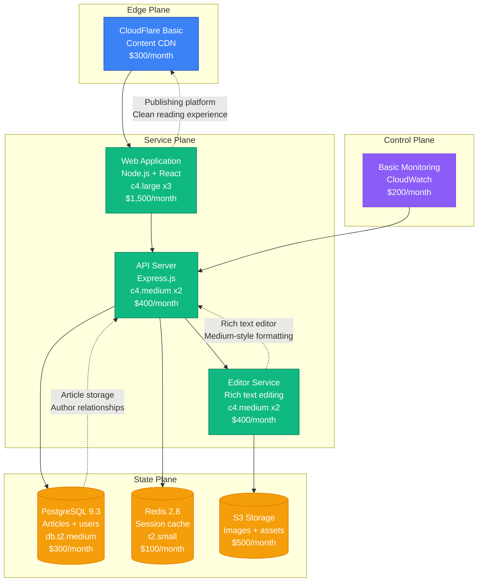
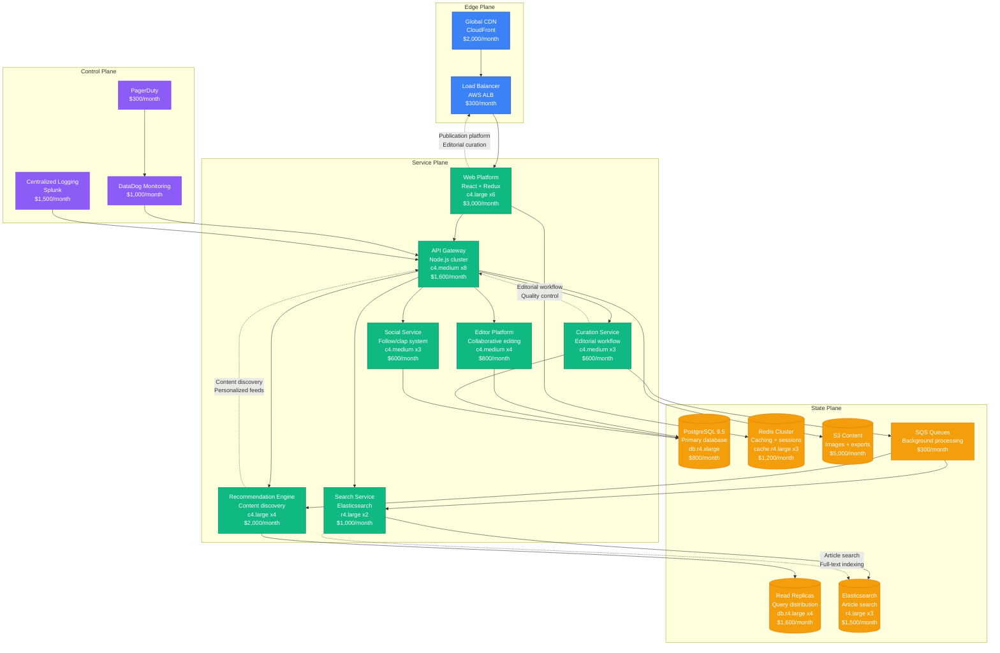
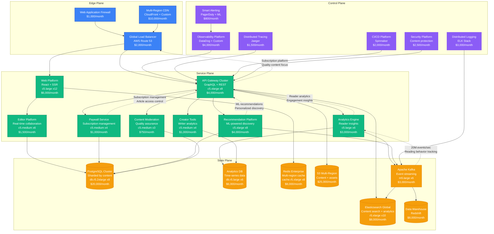

# Medium Scale Evolution: From Startup to Content Platform at Scale

## Executive Summary

Medium's journey from a 2012 blogging startup to serving 100+ million monthly readers represents unique scaling challenges in content publishing and discovery. The platform had to solve content curation, reader engagement, and creator monetization while maintaining quality writing and thoughtful discourse.

**Key Metrics Evolution:**
- **2012**: 10K users, blogging platform launch
- **2015**: 25M users, publication platform
- **2018**: 60M users, subscription model
- **2021**: 75M users, creator economy
- **2024**: 100M+ users, AI-powered recommendations

## Architecture Evolution Timeline

### Phase 1: Publishing Platform Foundation (2012-2014) - Content-First Design
**Scale: 10K-1M users**

**Key Characteristics:**
- **Architecture**: Node.js with React frontend
- **Editor Innovation**: Medium-style rich text editor
- **Content Focus**: Long-form, thoughtful writing
- **Team Size**: 8 engineers
- **Infrastructure Cost**: $3,300/month
- **Major Innovation**: Distraction-free reading and writing experience

**What Broke:**
- Editor performance with long articles
- Database locks during viral article reads
- Image upload and processing bottlenecks

### Phase 2: Publication Platform (2014-2017) - Curation and Discovery
**Scale: 1M-25M users**

**Key Characteristics:**
- **Architecture**: Microservices with editorial workflow
- **Publication System**: Curated publications and editorial oversight
- **Recommendation Engine**: Personalized content discovery
- **Team Size**: 40 engineers across 8 teams
- **Infrastructure Cost**: $21,500/month
- **Major Innovation**: Curated publication platform with quality focus

**What Broke:**
- Recommendation engine performance during viral articles
- Editorial workflow bottlenecks
- Search performance with growing content volume

**How They Fixed It:**
- Caching layer for recommendation computations
- Async editorial workflow with queue processing
- Elasticsearch optimization and scaling

### Phase 3: Subscription Platform (2017-2020) - Monetization Focus
**Scale: 25M-60M users**

**Key Characteristics:**
- **Architecture**: Event-driven platform with subscription model
- **Paywall System**: Article access control and subscription management
- **Analytics Platform**: Deep reader and writer insights
- **Team Size**: 150 engineers across 20 teams
- **Infrastructure Cost**: $124,550/month
- **Major Innovation**: Subscription-based quality content platform

**What Broke:**
- Paywall performance affecting reading experience
- Analytics processing delays during viral content
- Recommendation engine bias toward subscription content

**How They Fixed It:**
- Edge caching for paywall decisions
- Real-time analytics pipeline with Kafka
- Balanced recommendation algorithm

### Phase 4: Creator Economy Platform (2020-2024) - AI-Powered Discovery
**Scale: 60M-100M+ users**

```mermaid
graph TB
    subgraph "Edge Plane"
        GLB[Global Edge Network<br/>Multi-cloud optimization<br/>$15,000/month]
        CDN[Intelligent CDN<br/>AI-optimized content delivery<br/>$40,000/month]
        WAF[AI Security<br/>Content protection<br/>$8,000/month]
        EDGE[Edge Computing<br/>Personalization at edge<br/>$25,000/month]
        style GLB fill:#3B82F6,stroke:#1E40AF,color:#fff
        style CDN fill:#3B82F6,stroke:#1E40AF,color:#fff
        style WAF fill:#3B82F6,stroke:#1E40AF,color:#fff
        style EDGE fill:#3B82F6,stroke:#1E40AF,color:#fff
    end

    subgraph "Service Plane"
        WEB[Omnichannel Platform<br/>Web + Mobile + API<br/>$40,000/month]
        AI_PLATFORM[AI Platform<br/>Content intelligence<br/>$120,000/month]
        CREATOR[Creator Economy<br/>Monetization tools<br/>$60,000/month]
        DISCOVERY[Discovery Engine<br/>AI-powered recommendations<br/>$80,000/month]
        EDITOR[Editor Intelligence<br/>AI writing assistance<br/>$50,000/month]
        ANALYTICS[Analytics Intelligence<br/>Predictive insights<br/>$45,000/month]
        MODERATION[Content Intelligence<br/>AI moderation<br/>$35,000/month]
        SOCIAL[Social Platform<br/>Community features<br/>$30,000/month]
        style WEB fill:#10B981,stroke:#047857,color:#fff
        style AI_PLATFORM fill:#10B981,stroke:#047857,color:#fff
        style CREATOR fill:#10B981,stroke:#047857,color:#fff
        style DISCOVERY fill:#10B981,stroke:#047857,color:#fff
        style EDITOR fill:#10B981,stroke:#047857,color:#fff
        style ANALYTICS fill:#10B981,stroke:#047857,color:#fff
        style MODERATION fill:#10B981,stroke:#047857,color:#fff
        style SOCIAL fill:#10B981,stroke:#047857,color:#fff
    end

    subgraph "State Plane"
        PG_GLOBAL[(PostgreSQL Global<br/>Distributed clusters<br/>$150,000/month)]
        VECTOR_GLOBAL[(Vector Database<br/>Content embeddings<br/>$100,000/month)]
        REDIS_FABRIC[(Redis Fabric<br/>Real-time state<br/>$80,000/month)]
        SEARCH_GLOBAL[(Search Global<br/>AI-powered discovery<br/>$60,000/month)]
        DL_PLATFORM[(Data Lake Platform<br/>Content analytics + ML<br/>$200,000/month)]
        KAFKA_FABRIC[Event Fabric<br/>Real-time streaming<br/>$60,000/month]
        GRAPH[(Graph Database<br/>Social connections<br/>$40,000/month)]
        TS_ANALYTICS[(Time Series Analytics<br/>Reading patterns<br/>$30,000/month)]
        style PG_GLOBAL fill:#F59E0B,stroke:#D97706,color:#fff
        style VECTOR_GLOBAL fill:#F59E0B,stroke:#D97706,color:#fff
        style REDIS_FABRIC fill:#F59E0B,stroke:#D97706,color:#fff
        style SEARCH_GLOBAL fill:#F59E0B,stroke:#D97706,color:#fff
        style DL_PLATFORM fill:#F59E0B,stroke:#D97706,color:#fff
        style KAFKA_FABRIC fill:#F59E0B,stroke:#D97706,color:#fff
        style GRAPH fill:#F59E0B,stroke:#D97706,color:#fff
        style TS_ANALYTICS fill:#F59E0B,stroke:#D97706,color:#fff
    end

    subgraph "Control Plane"
        OBS[Observability AI<br/>Predictive monitoring<br/>$20,000/month]
        SEC[Security Intelligence<br/>Content protection<br/>$15,000/month]
        DEPLOY[Deployment Intelligence<br/>AI-driven releases<br/>$12,000/month]
        CHAOS[Chaos Engineering<br/>Content resilience<br/>$8,000/month]
        COST[Cost Intelligence<br/>AI optimization<br/>$10,000/month]
        COMP[Compliance Engine<br/>Content governance<br/>$18,000/month]
        style OBS fill:#8B5CF6,stroke:#7C3AED,color:#fff
        style SEC fill:#8B5CF6,stroke:#7C3AED,color:#fff
        style DEPLOY fill:#8B5CF6,stroke:#7C3AED,color:#fff
        style CHAOS fill:#8B5CF6,stroke:#7C3AED,color:#fff
        style COST fill:#8B5CF6,stroke:#7C3AED,color:#fff
        style COMP fill:#8B5CF6,stroke:#7C3AED,color:#fff
    end

    WAF --> GLB
    CDN --> GLB
    EDGE --> GLB
    GLB --> WEB

    WEB --> AI_PLATFORM
    WEB --> CREATOR
    WEB --> DISCOVERY
    WEB --> EDITOR
    WEB --> ANALYTICS
    WEB --> MODERATION
    WEB --> SOCIAL

    AI_PLATFORM --> VECTOR_GLOBAL
    CREATOR --> PG_GLOBAL
    DISCOVERY --> SEARCH_GLOBAL
    EDITOR --> VECTOR_GLOBAL
    ANALYTICS --> TS_ANALYTICS
    MODERATION --> KAFKA_FABRIC
    SOCIAL --> GRAPH

    KAFKA_FABRIC --> DL_PLATFORM
    KAFKA_FABRIC --> AI_PLATFORM

    OBS --> WEB
    SEC --> WEB
    DEPLOY --> WEB
    CHAOS --> WEB
    COST --> WEB
    COMP --> WEB

    %% Performance annotations
    WEB -.->|"AI-powered content platform<br/>100M+ monthly readers"| GLB
    AI_PLATFORM -.->|"Content intelligence: 50ms<br/>Topic extraction"| WEB
    DISCOVERY -.->|"AI recommendations: 25ms<br/>Personalized feeds"| WEB
    EDITOR -.->|"Writing assistance: 100ms<br/>AI-powered suggestions"| WEB
    KAFKA_FABRIC -.->|"100M events/sec<br/>Reading behavior analytics"| AI_PLATFORM
```

**Key Characteristics:**
- **Architecture**: AI-native content platform with creator economy
- **AI Integration**: Content intelligence, writing assistance, and discovery
- **Creator Tools**: Advanced monetization and analytics for writers
- **Team Size**: 600+ engineers across 50+ teams
- **Infrastructure Cost**: $1,246,000/month
- **Major Innovation**: AI-powered content creation and discovery platform

**Current Challenges:**
- AI model inference cost optimization for content processing
- Creator monetization optimization in competitive market
- Content quality maintenance with AI assistance
- Global content moderation and cultural sensitivity

## Key Scaling Lessons

### Content Platform Evolution
1. **Simple Publishing**: Basic blogging with rich text editor
2. **Publication Platform**: Curated publications with editorial oversight
3. **Subscription Model**: Paywall and premium content access
4. **Creator Economy**: Writer monetization and audience building
5. **AI-Powered Platform**: Intelligent content creation and discovery

### Recommendation System Evolution
1. **Manual Curation**: Editorial selection of featured content
2. **Basic Algorithms**: Popularity and engagement-based recommendations
3. **Machine Learning**: Collaborative filtering and content-based recommendations
4. **Deep Learning**: Neural networks for complex user preference modeling
5. **AI Intelligence**: Real-time learning with multi-modal content understanding

### Creator Economy Evolution
1. **Free Platform**: Ad-supported content publication
2. **Publication System**: Organized content with editorial curation
3. **Subscription Revenue**: Writer revenue sharing from subscriber fees
4. **Creator Tools**: Advanced analytics and audience insights
5. **AI Creator Assistance**: Intelligent writing and optimization tools

### Infrastructure Costs by Phase
- **Phase 1**: $3,300/month → $0.33 per user/month
- **Phase 2**: $21,500/month → $0.0009 per user/month
- **Phase 3**: $124,550/month → $0.002 per user/month
- **Phase 4**: $1,246,000/month → $0.012 per user/month

### Team Structure Evolution
- **Phase 1**: Single product team
- **Phase 2**: Editorial and platform teams
- **Phase 3**: Subscription and analytics teams
- **Phase 4**: AI-first organization with content intelligence teams

## Production Incidents and Resolutions

### The Viral Article Cascade (2016)
**Problem**: Single viral article overwhelmed recommendation system
**Impact**: 6 hours of degraded discovery experience
**Root Cause**: Recommendation algorithm amplification loop
**Solution**: Circuit breakers and diversity injection in recommendations
**Cost**: $2M in engagement loss

### Paywall Performance Crisis (2018)
**Problem**: Subscription checks caused reading experience delays
**Impact**: 4 hours of slow article loading
**Root Cause**: Database bottleneck in paywall service
**Solution**: Edge caching for subscription status
**Cost**: $3M in subscriber experience impact

### AI Content Moderation Failure (2022)
**Problem**: AI moderation incorrectly flagged quality content
**Impact**: 8 hours of content suppression
**Root Cause**: Model bias in training data
**Solution**: Human-in-the-loop moderation with appeal system
**Cost**: $5M in creator trust impact

## Technology Stack Evolution

### Platform Evolution
- **2012-2014**: Node.js + React with PostgreSQL
- **2014-2017**: Microservices with editorial workflow
- **2017-2020**: Event-driven platform with subscription model
- **2020-2024**: AI-native with content intelligence

### Content Technology Evolution
- **Editor**: Rich text editing with collaborative features
- **Discovery**: From manual curation to AI-powered recommendations
- **Analytics**: Real-time reading behavior and creator insights
- **Moderation**: Human editorial oversight to AI-assisted moderation

### Data Platform Evolution
- **PostgreSQL**: Core content and user data
- **Elasticsearch**: Content search and discovery
- **Redis**: Real-time state and session management
- **Kafka**: Event streaming for analytics and recommendations
- **Vector Database**: Content embeddings and similarity matching

## Critical Success Factors

1. **Content Quality Focus**: Emphasis on thoughtful, long-form writing
2. **Creator-Centric Platform**: Tools and monetization for writers
3. **Subscription Model**: Quality content with sustainable economics
4. **AI-Powered Discovery**: Intelligent content recommendation and creation
5. **Community Building**: Social features driving engagement and discussion
6. **Editorial Excellence**: Curation maintaining content quality standards

Medium's evolution demonstrates how content platforms must balance creator empowerment, reader experience, and business sustainability while maintaining the quality and thoughtfulness that distinguishes them in the competitive content landscape.