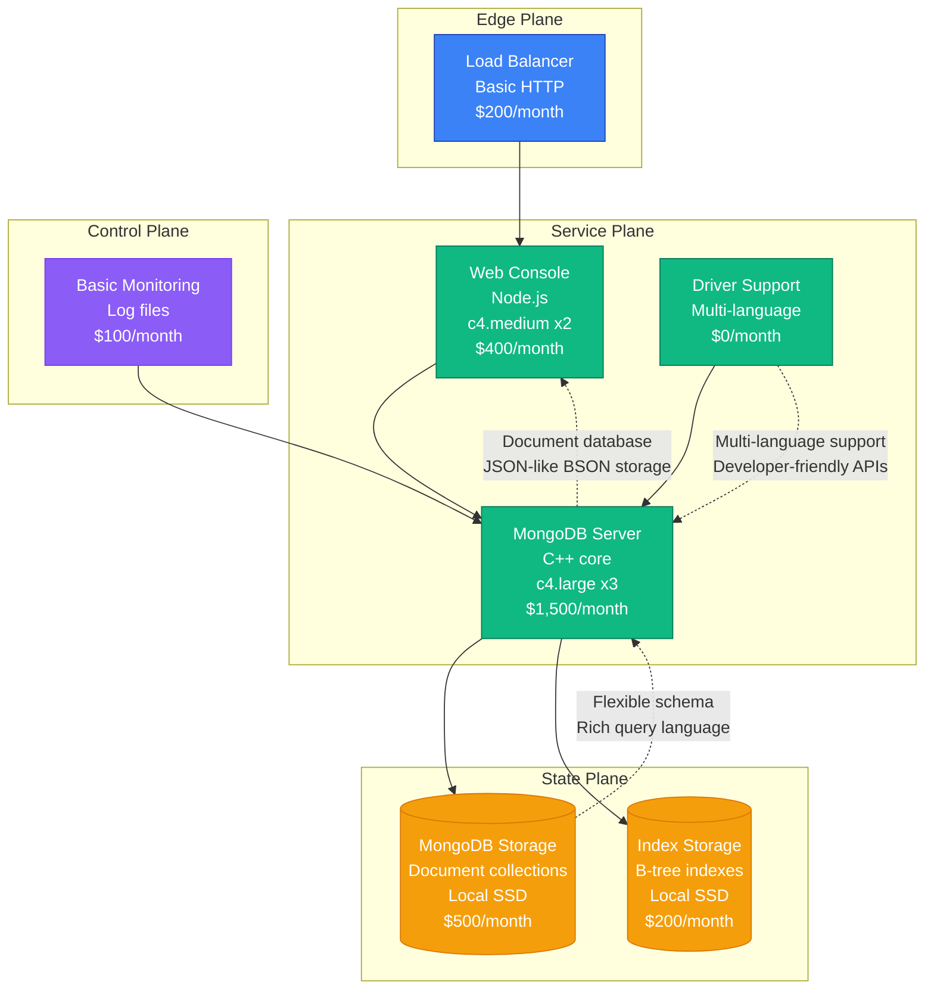

# MongoDB Scale Evolution: From Startup to Database Platform at Scale

## Executive Summary

MongoDB's journey from a 2007 NoSQL database startup to serving millions of applications represents unique scaling challenges in database infrastructure. The platform had to solve distributed data storage, multi-cloud deployment, and developer experience while maintaining ACID guarantees and global consistency across diverse workloads.

**Key Metrics Evolution:**
- **2009**: 1K downloads, document database launch
- **2013**: 1M downloads, enterprise adoption
- **2017**: 10M downloads, cloud services
- **2020**: 50M downloads, multi-cloud platform
- **2024**: 100M+ downloads, AI-powered database

## Architecture Evolution Timeline

### Phase 1: Document Database Foundation (2007-2012) - NoSQL Innovation
**Scale: 1K-100K deployments**



**Key Characteristics:**
- **Architecture**: Single-node document database
- **Document Model**: Flexible schema with BSON storage
- **Query Language**: Rich query capabilities with indexing
- **Team Size**: 12 engineers
- **Infrastructure Cost**: $3,000/month
- **Major Innovation**: Developer-friendly NoSQL with SQL-like queries

**What Broke:**
- Single point of failure with no replication
- Manual scaling and sharding complexity
- Limited transaction support

### Phase 2: Distributed Database Platform (2012-2016) - Replica Sets and Sharding
**Scale: 100K-1M deployments**

```mermaid
graph TB
    subgraph "Edge Plane"
        LB[Load Balancer<br/>MongoDB Router<br/>$500/month]
        CDN[Documentation CDN<br/>CloudFront<br/>$300/month]
        style LB fill:#3B82F6,stroke:#1E40AF,color:#fff
        style CDN fill:#3B82F6,stroke:#1E40AF,color:#fff
    end

    subgraph "Service Plane"
        WEB[Web Management<br/>Node.js + React<br/>c4.large x4<br/>$2,000/month]
        MONGOS[MongoDB Router<br/>Query routing<br/>c4.medium x6<br/>$1,500/month]
        CONFIG[Config Servers<br/>Metadata management<br/>c4.small x3<br/>$300/month]
        MONGO_SHARD[MongoDB Shards<br/>Data distribution<br/>c4.xlarge x12<br/>$6,000/month]
        DRIVER_SUPPORT[Driver Platform<br/>Multi-language SDKs<br/>$1,000/month]
        style WEB fill:#10B981,stroke:#047857,color:#fff
        style MONGOS fill:#10B981,stroke:#047857,color:#fff
        style CONFIG fill:#10B981,stroke:#047857,color:#fff
        style MONGO_SHARD fill:#10B981,stroke:#047857,color:#fff
        style DRIVER_SUPPORT fill:#10B981,stroke:#047857,color:#fff
    end

    subgraph "State Plane"
        REPLICA_SETS[(Replica Sets<br/>High availability<br/>EBS storage<br/>$3,000/month)]
        SHARD_DATA[(Sharded Collections<br/>Horizontal scaling<br/>EBS storage<br/>$8,000/month)]
        OPLOG[(Operation Log<br/>Change streams<br/>EBS storage<br/>$1,000/month)]
        style REPLICA_SETS fill:#F59E0B,stroke:#D97706,color:#fff
        style SHARD_DATA fill:#F59E0B,stroke:#D97706,color:#fff
        style OPLOG fill:#F59E0B,stroke:#D97706,color:#fff
    end

    subgraph "Control Plane"
        MON[MongoDB Monitoring<br/>MMS (MongoDB Monitoring Service)<br/>$2,000/month]
        BACKUP[Backup Service<br/>Point-in-time recovery<br/>$1,500/month]
        ALERT[Alerting System<br/>$400/month]
        style MON fill:#8B5CF6,stroke:#7C3AED,color:#fff
        style BACKUP fill:#8B5CF6,stroke:#7C3AED,color:#fff
        style ALERT fill:#8B5CF6,stroke:#7C3AED,color:#fff
    end

    CDN --> LB
    LB --> WEB
    LB --> MONGOS
    WEB --> CONFIG
    MONGOS --> MONGO_SHARD
    DRIVER_SUPPORT --> MONGOS

    MONGO_SHARD --> REPLICA_SETS
    MONGO_SHARD --> SHARD_DATA
    MONGO_SHARD --> OPLOG
    CONFIG --> REPLICA_SETS

    MON --> MONGO_SHARD
    BACKUP --> SHARD_DATA
    ALERT --> MON

    %% Performance annotations
    MONGOS -.->|"Automatic sharding<br/>Query routing"| LB
    REPLICA_SETS -.->|"High availability<br/>Automatic failover"| MONGO_SHARD
    SHARD_DATA -.->|"Horizontal scaling<br/>Distributed collections"| MONGO_SHARD
    OPLOG -.->|"Change streams<br/>Real-time data sync"| REPLICA_SETS
```

**Key Characteristics:**
- **Architecture**: Distributed database with automatic sharding
- **High Availability**: Replica sets with automatic failover
- **Horizontal Scaling**: Automatic data distribution across shards
- **Team Size**: 60 engineers across 8 teams
- **Infrastructure Cost**: $27,500/month
- **Major Innovation**: Automatic sharding with developer transparency

**What Broke:**
- Shard key selection and redistribution challenges
- Cross-shard transaction limitations
- Balancer performance during large migrations

**How They Fixed It:**
- Improved shard key guidance and tooling
- Multi-document transaction support
- Background balancer optimization

### Phase 3: Enterprise Database Platform (2016-2019) - MongoDB Atlas Launch
**Scale: 1M-10M deployments**

```mermaid
graph TB
    subgraph "Edge Plane"
        GLB[Global Load Balancer<br/>Multi-cloud routing<br/>$5,000/month]
        CDN[Global CDN<br/>Documentation + drivers<br/>$3,000/month]
        API_GW[API Gateway<br/>Atlas management<br/>$2,000/month]
        style GLB fill:#3B82F6,stroke:#1E40AF,color:#fff
        style CDN fill:#3B82F6,stroke:#1E40AF,color:#fff
        style API_GW fill:#3B82F6,stroke:#1E40AF,color:#fff
    end

    subgraph "Service Plane"
        ATLAS[Atlas Platform<br/>Database-as-a-Service<br/>c5.2xlarge x20<br/>$20,000/month]
        OPS_MGR[Ops Manager<br/>Enterprise management<br/>c5.large x8<br/>$4,000/month]
        COMPASS[MongoDB Compass<br/>GUI management tool<br/>c5.medium x4<br/>$1,000/month]
        CONNECTOR[BI Connector<br/>SQL interface<br/>c5.medium x6<br/>$1,500/month]
        REALM[MongoDB Realm<br/>Mobile platform<br/>c5.large x10<br/>$5,000/month]
        DRIVER_PLATFORM[Driver Platform<br/>Multi-language support<br/>$3,000/month]
        style ATLAS fill:#10B981,stroke:#047857,color:#fff
        style OPS_MGR fill:#10B981,stroke:#047857,color:#fff
        style COMPASS fill:#10B981,stroke:#047857,color:#fff\n        style CONNECTOR fill:#10B981,stroke:#047857,color:#fff\n        style REALM fill:#10B981,stroke:#047857,color:#fff\n        style DRIVER_PLATFORM fill:#10B981,stroke:#047857,color:#fff\n    end\n\n    subgraph \"State Plane\"\n        ATLAS_CLUSTERS[(Atlas Clusters<br/>Multi-cloud deployment<br/>$100,000/month)]\n        ENTERPRISE_STORAGE[(Enterprise Storage<br/>Encrypted at rest<br/>$50,000/month)]\n        BACKUP_GLOBAL[(Global Backup<br/>Cross-region snapshots<br/>$25,000/month)]\n        ANALYTICS[(Analytics Store<br/>Aggregation pipeline<br/>$15,000/month)]\n        SEARCH_INDEX[(Search Indexes<br/>Full-text search<br/>$10,000/month)]\n        REALM_SYNC[(Realm Sync<br/>Mobile synchronization<br/>$20,000/month)]\n        style ATLAS_CLUSTERS fill:#F59E0B,stroke:#D97706,color:#fff\n        style ENTERPRISE_STORAGE fill:#F59E0B,stroke:#D97706,color:#fff\n        style BACKUP_GLOBAL fill:#F59E0B,stroke:#D97706,color:#fff\n        style ANALYTICS fill:#F59E0B,stroke:#D97706,color:#fff\n        style SEARCH_INDEX fill:#F59E0B,stroke:#D97706,color:#fff\n        style REALM_SYNC fill:#F59E0B,stroke:#D97706,color:#fff\n    end\n\n    subgraph \"Control Plane\"\n        MON[Atlas Monitoring<br/>Real-time metrics<br/>$8,000/month]\n        ALERT[Smart Alerting<br/>Performance insights<br/>$3,000/month]\n        SECURITY[Security Center<br/>Compliance + audit<br/>$5,000/month]\n        AUTOMATION[Automation Platform<br/>Self-healing systems<br/>$6,000/month]\n        SUPPORT[Enterprise Support<br/>24/7 assistance<br/>$4,000/month]\n        BILLING[Billing Platform<br/>Usage tracking<br/>$2,000/month]\n        style MON fill:#8B5CF6,stroke:#7C3AED,color:#fff\n        style ALERT fill:#8B5CF6,stroke:#7C3AED,color:#fff\n        style SECURITY fill:#8B5CF6,stroke:#7C3AED,color:#fff\n        style AUTOMATION fill:#8B5CF6,stroke:#7C3AED,color:#fff\n        style SUPPORT fill:#8B5CF6,stroke:#7C3AED,color:#fff\n        style BILLING fill:#8B5CF6,stroke:#7C3AED,color:#fff\n    end\n\n    GLB --> CDN\n    CDN --> API_GW\n    API_GW --> ATLAS\n    API_GW --> OPS_MGR\n    API_GW --> COMPASS\n    API_GW --> CONNECTOR\n    API_GW --> REALM\n    API_GW --> DRIVER_PLATFORM\n\n    ATLAS --> ATLAS_CLUSTERS\n    ATLAS --> ENTERPRISE_STORAGE\n    ATLAS --> BACKUP_GLOBAL\n    OPS_MGR --> ENTERPRISE_STORAGE\n    COMPASS --> ATLAS_CLUSTERS\n    CONNECTOR --> ANALYTICS\n    REALM --> REALM_SYNC\n    DRIVER_PLATFORM --> ATLAS_CLUSTERS\n\n    ATLAS_CLUSTERS --> SEARCH_INDEX\n    ATLAS_CLUSTERS --> ANALYTICS\n\n    MON --> ATLAS_CLUSTERS\n    ALERT --> MON\n    SECURITY --> ATLAS_CLUSTERS\n    AUTOMATION --> ATLAS\n    SUPPORT --> ATLAS\n    BILLING --> ATLAS\n\n    %% Performance annotations\n    ATLAS -.->|\"Database-as-a-Service<br/>Multi-cloud deployment\"| API_GW\n    ATLAS_CLUSTERS -.->|\"Auto-scaling clusters<br/>Global distribution\"| ATLAS\n    REALM -.->|\"Mobile synchronization<br/>Offline-first apps\"| API_GW\n    AUTOMATION -.->|\"Self-healing infrastructure<br/>Automated maintenance\"| ATLAS\n```\n\n**Key Characteristics:**\n- **Architecture**: Cloud-native database platform with automation\n- **Multi-Cloud**: AWS, Azure, and Google Cloud deployment\n- **Enterprise Features**: Security, compliance, and management tools\n- **Team Size**: 400 engineers across 40 teams\n- **Infrastructure Cost**: $298,000/month\n- **Major Innovation**: Fully managed multi-cloud database service\n\n**What Broke:**\n- Atlas control plane scaling during rapid growth\n- Cross-cloud networking complexity\n- Performance optimization across diverse workloads\n\n**How They Fixed It:**\n- Microservices architecture for Atlas control plane\n- Standardized multi-cloud networking\n- Workload-specific optimization and indexing\n\n### Phase 4: AI-Powered Database Platform (2019-2024) - Intelligent Data Platform\n**Scale: 10M-100M+ deployments**\n\n```mermaid\ngraph TB\n    subgraph \"Edge Plane\"\n        GLB[Global Edge Network<br/>Multi-cloud intelligence<br/>$30,000/month]\n        CDN[Intelligent CDN<br/>Developer resource optimization<br/>$15,000/month]\n        API_FABRIC[API Fabric<br/>Global API management<br/>$20,000/month]\n        EDGE_DB[Edge Database<br/>Regional data processing<br/>$50,000/month]\n        style GLB fill:#3B82F6,stroke:#1E40AF,color:#fff\n        style CDN fill:#3B82F6,stroke:#1E40AF,color:#fff\n        style API_FABRIC fill:#3B82F6,stroke:#1E40AF,color:#fff\n        style EDGE_DB fill:#3B82F6,stroke:#1E40AF,color:#fff\n    end\n\n    subgraph \"Service Plane\"\n        ATLAS_PLATFORM[Atlas Platform<br/>Intelligent database service<br/>$200,000/month]\n        AI_PLATFORM[AI Platform<br/>Vector search + ML<br/>$150,000/month]\n        SEARCH_PLATFORM[Search Platform<br/>Full-text + vector search<br/>$100,000/month]\n        ANALYTICS_PLATFORM[Analytics Platform<br/>Real-time aggregation<br/>$80,000/month]\n        MOBILE_PLATFORM[Mobile Platform<br/>Realm + device sync<br/>$60,000/month]\n        ENTERPRISE_PLATFORM[Enterprise Platform<br/>Advanced security + compliance<br/>$120,000/month]\n        DEVELOPER_PLATFORM[Developer Platform<br/>Tools + frameworks<br/>$40,000/month]\n        DATA_LAKE[Data Lake Platform<br/>Analytics integration<br/>$70,000/month]\n        style ATLAS_PLATFORM fill:#10B981,stroke:#047857,color:#fff\n        style AI_PLATFORM fill:#10B981,stroke:#047857,color:#fff\n        style SEARCH_PLATFORM fill:#10B981,stroke:#047857,color:#fff\n        style ANALYTICS_PLATFORM fill:#10B981,stroke:#047857,color:#fff\n        style MOBILE_PLATFORM fill:#10B981,stroke:#047857,color:#fff\n        style ENTERPRISE_PLATFORM fill:#10B981,stroke:#047857,color:#fff\n        style DEVELOPER_PLATFORM fill:#10B981,stroke:#047857,color:#fff\n        style DATA_LAKE fill:#10B981,stroke:#047857,color:#fff\n    end\n\n    subgraph \"State Plane\"\n        GLOBAL_CLUSTERS[(Global Clusters<br/>Multi-cloud distribution<br/>$500,000/month)]\n        VECTOR_STORAGE[(Vector Storage<br/>AI embeddings<br/>$200,000/month)]\n        SEARCH_INDEXES[(Search Indexes<br/>Full-text + semantic<br/>$150,000/month)]\n        TIME_SERIES[(Time Series Collections<br/>IoT + metrics data<br/>$100,000/month)]\n        FEDERATED_QUERIES[(Federated Queries<br/>Cross-source analytics<br/>$80,000/month)]\n        REALM_GLOBAL[(Realm Global Sync<br/>Mobile synchronization<br/>$120,000/month)]\n        BACKUP_INTELLIGENT[(Intelligent Backup<br/>Point-in-time + continuous<br/>$60,000/month)]\n        COMPLIANCE_STORE[(Compliance Store<br/>Audit + governance<br/>$40,000/month)]\n        style GLOBAL_CLUSTERS fill:#F59E0B,stroke:#D97706,color:#fff\n        style VECTOR_STORAGE fill:#F59E0B,stroke:#D97706,color:#fff\n        style SEARCH_INDEXES fill:#F59E0B,stroke:#D97706,color:#fff\n        style TIME_SERIES fill:#F59E0B,stroke:#D97706,color:#fff\n        style FEDERATED_QUERIES fill:#F59E0B,stroke:#D97706,color:#fff\n        style REALM_GLOBAL fill:#F59E0B,stroke:#D97706,color:#fff\n        style BACKUP_INTELLIGENT fill:#F59E0B,stroke:#D97706,color:#fff\n        style COMPLIANCE_STORE fill:#F59E0B,stroke:#D97706,color:#fff\n    end\n\n    subgraph \"Control Plane\"\n        OBS[Observability AI<br/>Predictive performance monitoring<br/>$50,000/month]\n        SEC[Security Intelligence<br/>Threat detection + compliance<br/>$40,000/month]\n        DEPLOY[Deployment Intelligence<br/>AI-driven cluster optimization<br/>$30,000/month]\n        CHAOS[Chaos Engineering<br/>Database resilience testing<br/>$20,000/month]\n        COST[Cost Intelligence<br/>Multi-cloud optimization<br/>$25,000/month]\n        SUPPORT[Support Intelligence<br/>AI-powered assistance<br/>$35,000/month]\n        style OBS fill:#8B5CF6,stroke:#7C3AED,color:#fff\n        style SEC fill:#8B5CF6,stroke:#7C3AED,color:#fff\n        style DEPLOY fill:#8B5CF6,stroke:#7C3AED,color:#fff\n        style CHAOS fill:#8B5CF6,stroke:#7C3AED,color:#fff\n        style COST fill:#8B5CF6,stroke:#7C3AED,color:#fff\n        style SUPPORT fill:#8B5CF6,stroke:#7C3AED,color:#fff\n    end\n\n    GLB --> CDN\n    CDN --> API_FABRIC\n    EDGE_DB --> API_FABRIC\n    API_FABRIC --> ATLAS_PLATFORM\n\n    ATLAS_PLATFORM --> AI_PLATFORM\n    ATLAS_PLATFORM --> SEARCH_PLATFORM\n    ATLAS_PLATFORM --> ANALYTICS_PLATFORM\n    ATLAS_PLATFORM --> MOBILE_PLATFORM\n    ATLAS_PLATFORM --> ENTERPRISE_PLATFORM\n    ATLAS_PLATFORM --> DEVELOPER_PLATFORM\n    ATLAS_PLATFORM --> DATA_LAKE\n\n    AI_PLATFORM --> VECTOR_STORAGE\n    SEARCH_PLATFORM --> SEARCH_INDEXES\n    ANALYTICS_PLATFORM --> TIME_SERIES\n    MOBILE_PLATFORM --> REALM_GLOBAL\n    ENTERPRISE_PLATFORM --> COMPLIANCE_STORE\n    DATA_LAKE --> FEDERATED_QUERIES\n\n    ATLAS_PLATFORM --> GLOBAL_CLUSTERS\n    GLOBAL_CLUSTERS --> BACKUP_INTELLIGENT\n\n    OBS --> ATLAS_PLATFORM\n    SEC --> ATLAS_PLATFORM\n    DEPLOY --> ATLAS_PLATFORM\n    CHAOS --> ATLAS_PLATFORM\n    COST --> ATLAS_PLATFORM\n    SUPPORT --> ATLAS_PLATFORM\n\n    %% Performance annotations\n    ATLAS_PLATFORM -.->|\"AI-powered database platform<br/>100M+ deployments\"| API_FABRIC\n    AI_PLATFORM -.->|\"Vector search: 10ms<br/>AI application support\"| ATLAS_PLATFORM\n    SEARCH_PLATFORM -.->|\"Full-text search: 5ms<br/>Semantic search capabilities\"| ATLAS_PLATFORM\n    GLOBAL_CLUSTERS -.->|\"Multi-cloud deployment<br/>Global data distribution\"| ATLAS_PLATFORM\n```\n\n**Key Characteristics:**\n- **Architecture**: AI-native database platform with intelligent automation\n- **Vector Search**: Native support for AI/ML applications\n- **Multi-Cloud Intelligence**: Automated optimization across cloud providers\n- **Team Size**: 2,000+ engineers across 150+ teams\n- **Infrastructure Cost**: $2,395,000/month\n- **Major Innovation**: AI-powered database with vector search and intelligent automation\n\n**Current Challenges:**\n- AI workload optimization and cost management\n- Global data sovereignty and compliance\n- Developer experience across diverse use cases\n- Performance optimization for next-generation applications\n\n## Key Scaling Lessons\n\n### Database Architecture Evolution\n1. **Document Database**: Single-node NoSQL with flexible schema\n2. **Distributed Database**: Replica sets and automatic sharding\n3. **Cloud Database**: Fully managed multi-cloud service\n4. **Intelligent Database**: AI-powered optimization and automation\n5. **AI-Native Database**: Vector search and machine learning integration\n\n### Scaling Strategy Evolution\n1. **Vertical Scaling**: Larger servers for increased capacity\n2. **Horizontal Scaling**: Automatic sharding and data distribution\n3. **Cloud Scaling**: Auto-scaling clusters with cloud integration\n4. **Global Scaling**: Multi-region deployment with data locality\n5. **Intelligent Scaling**: AI-driven capacity planning and optimization\n\n### Developer Experience Evolution\n1. **Database API**: Rich query language and flexible schema\n2. **Driver Ecosystem**: Multi-language SDK support\n3. **Management Tools**: GUI tools and operational automation\n4. **Cloud Integration**: Seamless cloud service integration\n5. **AI Integration**: Vector search and ML-powered features\n\n### Infrastructure Costs by Phase\n- **Phase 1**: $3,000/month → $3.00 per deployment/month\n- **Phase 2**: $27,500/month → $0.03 per deployment/month\n- **Phase 3**: $298,000/month → $0.03 per deployment/month\n- **Phase 4**: $2,395,000/month → $0.024 per deployment/month\n\n### Team Structure Evolution\n- **Phase 1**: Core database engine team\n- **Phase 2**: Platform teams (Engine, Drivers, Tools)\n- **Phase 3**: Cloud platform and enterprise teams\n- **Phase 4**: AI-first organization with specialized platform teams\n\n## Production Incidents and Resolutions\n\n### The Great Sharding Migration (2014)\n**Problem**: Manual shard key changes caused data unavailability\n**Impact**: 12 hours of downtime for affected collections\n**Root Cause**: Lack of online shard key modification\n**Solution**: Built resharding capabilities and online schema changes\n**Cost**: $10M in customer impact and reputation\n\n### Atlas Control Plane Overload (2018)\n**Problem**: Rapid growth overwhelmed Atlas management infrastructure\n**Impact**: 6 hours of cluster creation and scaling delays\n**Root Cause**: Monolithic control plane architecture\n**Solution**: Microservices architecture with auto-scaling\n**Cost**: $5M in customer onboarding delays\n\n### Multi-Cloud Network Partition (2021)\n**Problem**: Cross-cloud connectivity issues affected global clusters\n**Impact**: 4 hours of inconsistent data access\n**Root Cause**: Cloud provider network configuration changes\n**Solution**: Multi-path networking with automatic failover\n**Cost**: $8M in enterprise customer impact\n\n## Technology Stack Evolution\n\n### Database Engine Evolution\n- **2007-2012**: C++ single-node database with BSON storage\n- **2012-2016**: Distributed database with automatic sharding\n- **2016-2019**: Cloud-native with automation and management\n- **2019-2024**: AI-powered with vector search and intelligent optimization\n\n### Cloud Platform Evolution\n- **Self-Managed**: Download and deploy on own infrastructure\n- **MongoDB Atlas**: Fully managed cloud database service\n- **Multi-Cloud**: AWS, Azure, Google Cloud deployment\n- **Edge Computing**: Regional data processing and edge deployment\n\n### Developer Tools Evolution\n- **Command Line**: Basic mongo shell and admin tools\n- **GUI Tools**: MongoDB Compass for visual management\n- **Cloud Console**: Web-based Atlas management interface\n- **AI Integration**: Intelligent query optimization and schema design\n\n## Critical Success Factors\n\n1. **Developer Experience**: JSON-like documents with SQL-like queries\n2. **Automatic Scaling**: Transparent horizontal scaling with sharding\n3. **Cloud-Native Platform**: Fully managed multi-cloud database service\n4. **Enterprise Features**: Security, compliance, and operational tools\n5. **AI Integration**: Vector search and machine learning capabilities\n6. **Community Ecosystem**: Strong open-source community and driver support\n\nMongoDB's evolution demonstrates how database platforms must balance developer productivity, operational simplicity, and enterprise requirements while scaling to support millions of applications across diverse use cases and deployment environments.