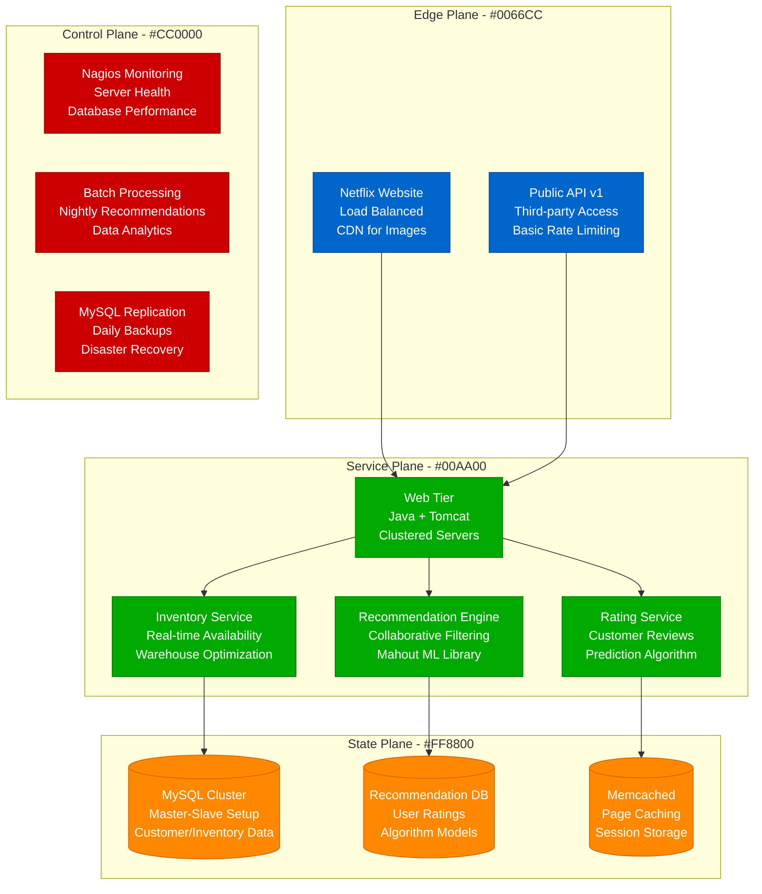
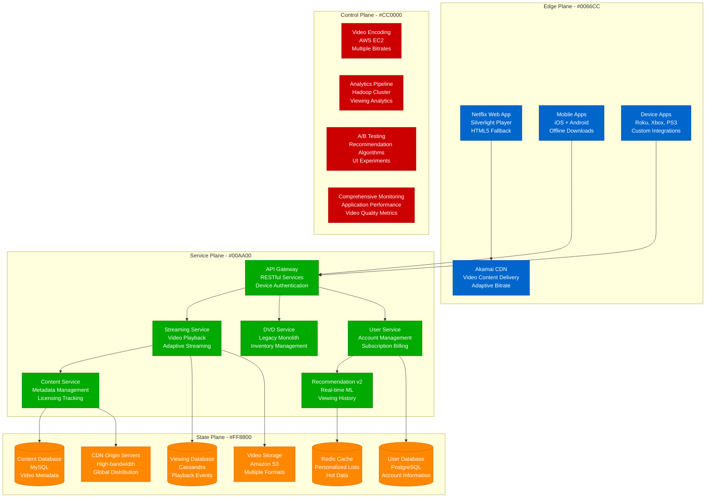
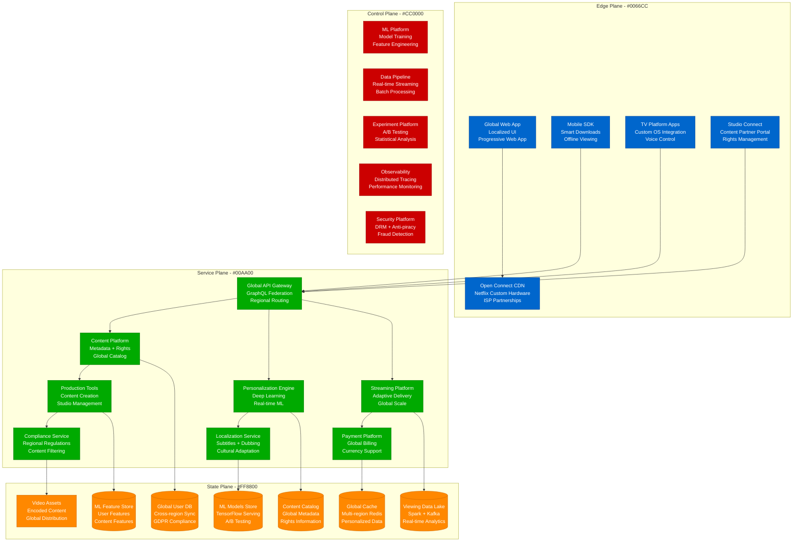
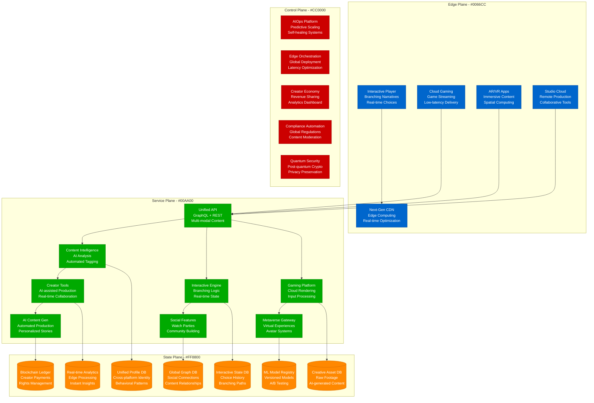

# Netflix Scale Evolution: From DVD Rentals to 260M Streaming Subscribers

## Executive Summary

Netflix's transformation from a DVD-by-mail service to the world's largest streaming platform represents one of the most successful digital transformations in history. This evolution required 6 major architectural phases, each driven by exponential growth in subscribers and the shift from physical to digital media.

**Scale Journey**: 100,000 DVDs (1999) → 260M+ streaming subscribers (2024)
**Content Delivery**: Physical mail → Global streaming in 190+ countries
**Data Processing**: Customer preferences → 1 billion hours watched daily
**Peak Throughput**: N/A → 15% of global internet traffic

## Phase 1: DVD-by-Mail Service (1999-2005)
**Scale**: 100K DVDs, 1M subscribers, US only

### Architecture Overview

```mermaid
graph TB
    subgraph EdgePlane[Edge Plane - #0066CC]
        Website[Website<br/>Apache + PHP<br/>Single Server]
        CustomerService[Customer Service<br/>Call Center<br/>Manual Operations]
    end

    subgraph ServicePlane[Service Plane - #00AA00]
        WebApp[Web Application<br/>LAMP Stack<br/>Single Monolith]
        Inventory[Inventory Management<br/>Custom Software<br/>DVD Tracking]
        Shipping[Shipping System<br/>USPS Integration<br/>Manual Sorting]
    end

    subgraph StatePlane[State Plane - #FF8800]
        MySQL[(MySQL Database<br/>Customer Data<br/>Single Instance)]
        FileStorage[File Storage<br/>DVD Catalog Images<br/>Local Disk)]
    end

    subgraph ControlPlane[Control Plane - #CC0000]
        BasicLogs[Basic Logs<br/>Apache Logs<br/>Manual Monitoring]
        BackupTapes[Backup System<br/>Tape Backups<br/>Weekly Schedule]
    end

    Website --> WebApp
    CustomerService --> WebApp
    WebApp --> Inventory
    WebApp --> Shipping
    WebApp --> MySQL
    WebApp --> FileStorage
    WebApp --> BasicLogs

    %% Apply four-plane colors
    classDef edgeStyle fill:#0066CC,stroke:#004499,color:#fff
    classDef serviceStyle fill:#00AA00,stroke:#007700,color:#fff
    classDef stateStyle fill:#FF8800,stroke:#CC6600,color:#fff
    classDef controlStyle fill:#CC0000,stroke:#990000,color:#fff

    class Website,CustomerService edgeStyle
    class WebApp,Inventory,Shipping serviceStyle
    class MySQL,FileStorage stateStyle
    class BasicLogs,BackupTapes controlStyle
```

### Key Metrics & Costs
- **Infrastructure Cost**: $50,000/month
- **Team Size**: 20 engineers
- **Website Response Time**: 3-5 seconds
- **Order Processing**: 24-48 hours
- **DVD Inventory**: 100,000 titles

### Major Challenges
1. **Inventory Management**: Tracking 100K+ physical DVDs across warehouses
2. **Shipping Optimization**: Minimizing delivery time via warehouse placement
3. **Queue Management**: Predicting customer preferences for inventory planning
4. **Customer Service**: Managing returns, damaged DVDs, customer inquiries

## Phase 2: Recommendation Engine Era (2006-2008)
**Scale**: 1M DVDs, 10M subscribers, Advanced personalization

### Architecture Evolution



### Key Metrics & Costs
- **Infrastructure Cost**: $2M/month
- **Team Size**: 200 engineers
- **Website Response Time**: p99 < 2s
- **Recommendation Accuracy**: 4.8/5 star prediction
- **Data Processing**: 100M+ ratings daily

### Breakthrough Innovation: Netflix Prize
- **Challenge**: $1M prize for 10% improvement in recommendation accuracy
- **Duration**: 2006-2009
- **Winner**: BellKor's Pragmatic Chaos team
- **Algorithm**: Ensemble of collaborative filtering + matrix factorization
- **Business Impact**: 80% of content discovered through recommendations

### Critical Incident: Christmas 2007 DVD Shortage
- **Trigger**: Unexpected demand spike for popular new releases
- **Impact**: 40% of customers couldn't get preferred DVDs
- **Root Cause**: Recommendation engine didn't account for inventory constraints
- **Solution**: Integrated inventory levels into recommendation algorithm
- **Architecture Change**: Real-time inventory-aware recommendations

## Phase 3: Streaming Launch & Hybrid Model (2009-2012)
**Scale**: 20M subscribers, Streaming + DVD hybrid, International expansion

### Hybrid Architecture



### Key Metrics & Costs
- **Infrastructure Cost**: $100M/year ($8.3M/month)
- **Team Size**: 800 engineers
- **Streaming Hours**: 2 billion hours/quarter
- **Video Formats**: 120+ encoding profiles
- **API Requests**: 1 billion/day
- **CDN Bandwidth**: 1 Gbps average

### Major Technical Innovations
1. **Adaptive Bitrate Streaming**: Dynamic quality adjustment based on bandwidth
2. **Multi-Device Sync**: Continue watching across devices
3. **Offline Downloads**: Mobile app content caching
4. **Content Delivery Network**: Global video distribution infrastructure

### Critical Incident: Qwikster Separation Disaster (2011)
- **Business Decision**: Split DVD and streaming into separate services
- **Technical Challenge**: Separate user accounts and billing systems
- **Customer Backlash**: Lost 800,000 subscribers in one quarter
- **Resolution**: Abandoned separation, kept unified platform
- **Architecture Learning**: Avoid unnecessary complexity in user experience

## Phase 4: Cloud Migration & Microservices (2013-2016)
**Scale**: 100M subscribers, AWS-first architecture, Original content production

### Cloud-Native Microservices

```mermaid
graph TB
    subgraph EdgePlane[Edge Plane - #0066CC]
        NetflixCDN[Netflix CDN<br/>Custom Global Network<br/>15% of Internet Traffic]
        WebUI[Web UI<br/>React + Node.js<br/>Single Page App]
        MobileApps[Mobile Apps<br/>Native iOS/Android<br/>Smart Downloads]
        SmartTVs[Smart TV Apps<br/>100+ Device Types<br/>Custom Players]
    end

    subgraph ServicePlane[Service Plane - #00AA00]
        Zuul[Zuul Gateway<br/>Dynamic Routing<br/>Circuit Breakers]
        UserMS[User Microservice<br/>Account Management<br/>Spring Boot]
        ContentMS[Content Microservice<br/>Metadata Service<br/>Elasticsearch]
        RecommendationMS[Recommendation MS<br/>Machine Learning<br/>Real-time Serving]
        PlaybackMS[Playback Microservice<br/>Video Streaming<br/>DRM Protection]
        BillingMS[Billing Microservice<br/>Subscription Management<br/>Payment Processing]
        ViewingMS[Viewing Microservice<br/>Progress Tracking<br/>Continue Watching]
        PersonalizationMS[Personalization MS<br/>Homepage Optimization<br/>A/B Testing]
    end

    subgraph StatePlane[State Plane - #FF8800]
        Cassandra[(Cassandra Clusters<br/>Viewing History<br/>Petabyte Scale)]
        DynamoDB[(DynamoDB<br/>User Preferences<br/>Global Tables)]
        ElasticSearch[(Elasticsearch<br/>Content Search<br/>Real-time Indexing)]
        RedisCluster[(Redis Cluster<br/>Session Management<br/>Caching Layer)]
        S3VideoStorage[S3 Video Storage<br/>Encoded Content<br/>Multi-region)]
        EVCache[EVCache<br/>Distributed Cache<br/>Custom Memcached)]
    end

    subgraph ControlPlane[Control Plane - #CC0000]
        Hystrix[Hystrix<br/>Circuit Breaker<br/>Fault Tolerance]
        Eureka[Eureka<br/>Service Discovery<br/>Load Balancing]
        Spinnaker[Spinnaker<br/>Continuous Deployment<br/>Blue-Green Deploys]
        Atlas[Atlas<br/>Operational Intelligence<br/>Time Series Metrics]
        Chaos[Chaos Engineering<br/>Chaos Monkey<br/>Fault Injection]
    end

    WebUI --> NetflixCDN
    MobileApps --> Zuul
    SmartTVs --> Zuul
    Zuul --> UserMS
    Zuul --> ContentMS
    Zuul --> RecommendationMS
    UserMS --> PlaybackMS
    ContentMS --> BillingMS
    RecommendationMS --> ViewingMS
    PlaybackMS --> PersonalizationMS

    UserMS --> DynamoDB
    ContentMS --> ElasticSearch
    RecommendationMS --> Cassandra
    PlaybackMS --> RedisCluster
    BillingMS --> S3VideoStorage
    ViewingMS --> EVCache

    %% Apply four-plane colors
    classDef edgeStyle fill:#0066CC,stroke:#004499,color:#fff
    classDef serviceStyle fill:#00AA00,stroke:#007700,color:#fff
    classDef stateStyle fill:#FF8800,stroke:#CC6600,color:#fff
    classDef controlStyle fill:#CC0000,stroke:#990000,color:#fff

    class NetflixCDN,WebUI,MobileApps,SmartTVs edgeStyle
    class Zuul,UserMS,ContentMS,RecommendationMS,PlaybackMS,BillingMS,ViewingMS,PersonalizationMS serviceStyle
    class Cassandra,DynamoDB,ElasticSearch,RedisCluster,S3VideoStorage,EVCache stateStyle
    class Hystrix,Eureka,Spinnaker,Atlas,Chaos controlStyle
```

### Key Metrics & Costs
- **Infrastructure Cost**: $1B/year ($83M/month)
- **Team Size**: 3,000 engineers
- **Microservices**: 700+ independent services
- **AWS Instances**: 100,000+ EC2 instances
- **Data Storage**: 10+ petabytes
- **Global Traffic**: 15% of worldwide internet bandwidth

### Netflix's Microservices Innovations
1. **Circuit Breaker Pattern**: Hystrix for fault tolerance
2. **Service Discovery**: Eureka for dynamic service location
3. **Chaos Engineering**: Deliberately breaking systems to improve resilience
4. **Blue-Green Deployments**: Zero-downtime deployments with Spinnaker
5. **Observability**: Comprehensive monitoring with custom tools

### Critical Incident: AWS US-East-1 Outage December 2012
- **Trigger**: AWS Elastic Load Balancer failure in primary region
- **Impact**: Netflix streaming down for 5 hours on Christmas Eve
- **Root Cause**: Over-dependence on single AWS availability zone
- **Resolution**: Emergency failover to other regions
- **Architecture Change**: Multi-region active-active deployment strategy

## Phase 5: Global Expansion & AI Optimization (2017-2020)
**Scale**: 200M subscribers, 190+ countries, AI-driven content creation

### AI-First Global Platform



### Key Metrics & Costs
- **Infrastructure Cost**: $15B/year ($1.25B/month)
- **Team Size**: 12,000 employees (4,000 engineers)
- **Content Investment**: $15B/year in original content
- **ML Models**: 100,000+ models in production
- **Global Bandwidth**: 15% of global internet traffic
- **Personalization**: 80% of viewing from recommendations

### AI-Driven Innovations
1. **Content Optimization**: AI chooses thumbnails, trailers, and artwork
2. **Production Analytics**: Predict show success before filming
3. **Global Personalization**: Cultural preferences in recommendation algorithms
4. **Smart Downloads**: Predict what users want to watch offline
5. **Content Creation**: AI-assisted scriptwriting and editing

### Critical Incident: COVID-19 Traffic Surge March 2020
- **Trigger**: Global lockdowns caused 30% traffic increase overnight
- **Challenge**: European governments requested reduced quality
- **Response**: Dynamic bitrate reduction while maintaining user experience
- **Innovation**: Real-time global traffic management algorithms
- **Result**: Maintained service quality despite unprecedented demand

## Phase 6: Interactive Content & Next-Gen Streaming (2021-Present)
**Scale**: 260M+ subscribers, Interactive content, Cloud gaming integration

### Current Advanced Platform



### Current Scale Metrics & Costs
- **Infrastructure Cost**: $20B+/year ($1.67B/month)
- **Team Size**: 15,000+ employees (6,000+ engineers)
- **Content Investment**: $17B/year (2024)
- **Peak Concurrent Users**: 300M+ during major releases
- **Interactive Content**: 50+ interactive shows/games
- **AI-Generated Content**: 30% of promotional materials

### Next-Generation Features
1. **Interactive Storytelling**: Choose-your-own-adventure content at scale
2. **AI-Generated Personalization**: Unique versions of shows for each user
3. **Social Viewing**: Synchronized watch parties with real-time chat
4. **Cloud Gaming Integration**: Netflix games streamed directly
5. **Creator Economy**: Platform for independent content creators

## Cost Evolution Analysis

| Phase | Period | Annual Cost | Cost per Subscriber | Key Cost Drivers |
|-------|--------|-------------|---------------------|------------------|
| Phase 1 | 1999-2005 | $600K | $0.60 | Physical infrastructure, shipping |
| Phase 2 | 2006-2008 | $24M | $2.40 | Data centers, recommendation computing |
| Phase 3 | 2009-2012 | $100M | $5.00 | CDN bandwidth, streaming infrastructure |
| Phase 4 | 2013-2016 | $1B | $10.00 | AWS cloud migration, microservices |
| Phase 5 | 2017-2020 | $15B | $75.00 | Content production, global expansion |
| Phase 6 | 2021-Present | $20B+ | $77.00 | AI infrastructure, interactive content |

## Major Scaling Challenges Overcome

### Technical Challenges
1. **Global Content Delivery**: Serving 15% of internet traffic with sub-second startup
2. **Personalization at Scale**: Real-time recommendations for 260M+ unique users
3. **Interactive Content**: Branching narratives with real-time state management
4. **Multi-Platform Consistency**: Same experience across 1000+ device types
5. **Content Production Scale**: Managing 1000+ simultaneous productions globally

### Business Challenges
1. **Content Licensing**: Negotiating rights in 190+ countries with different laws
2. **Cultural Localization**: Adapting content for vastly different markets
3. **Competition**: Maintaining leadership against Disney+, Amazon Prime, Apple TV+
4. **Creator Economy**: Building platform that competes with YouTube, TikTok
5. **Profitability**: Balancing content investment with subscriber growth

### Regulatory Challenges
1. **Data Privacy**: GDPR, CCPA compliance across global operations
2. **Content Moderation**: Different censorship requirements per country
3. **Tax Compliance**: Complex international tax obligations
4. **Anti-Trust**: Avoiding monopoly concerns in content creation and distribution
5. **Net Neutrality**: Advocating for open internet while using 15% of bandwidth

## Lessons Learned

### Successful Strategies
1. **Data-Driven Content**: Every creative decision backed by viewing analytics
2. **Global-First Architecture**: Building for international scale from day one
3. **Technology Innovation**: Open-sourcing tools benefited entire industry
4. **Content Investment**: Spending big on original content created moat
5. **Culture of Experimentation**: A/B testing everything, including content

### Costly Mistakes
1. **Qwikster Separation**: $800M subscriber loss from poor user experience
2. **Early International Expansion**: Launching without local content strategy
3. **Technical Debt**: Monolith migration took 7 years longer than planned
4. **Content Overspend**: Some productions failed to generate ROI
5. **Platform Dependencies**: Early AWS lock-in limited negotiating power

## Future Scaling Challenges (2024-2030)

1. **AI-Generated Content**: Fully automated content production pipelines
2. **Virtual Reality**: Immersive storytelling and virtual movie theaters
3. **Interactive Gaming**: Full AAA game streaming directly in Netflix
4. **Live Events**: Real-time streaming of sports, concerts, breaking news
5. **Web3 Integration**: NFT collectibles, creator cryptocurrency, decentralized distribution

Netflix's evolution demonstrates how companies can successfully navigate multiple technological paradigm shifts while maintaining market leadership. The key is continuous architectural evolution guided by user behavior data and long-term vision.