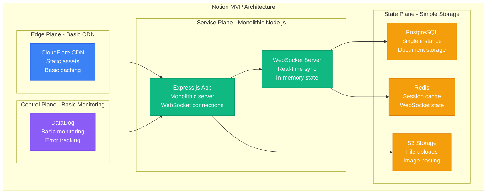
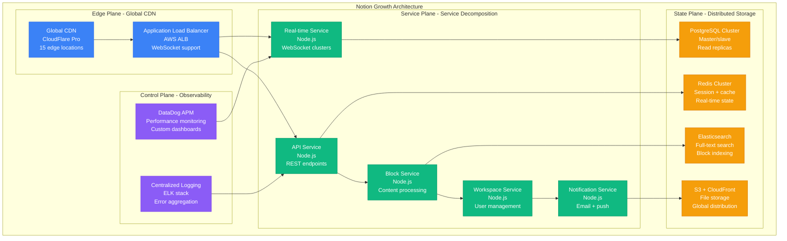
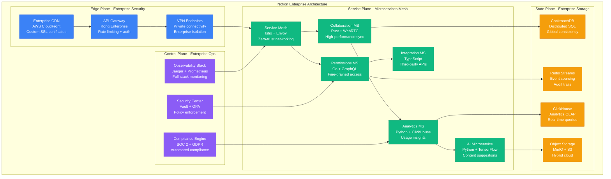
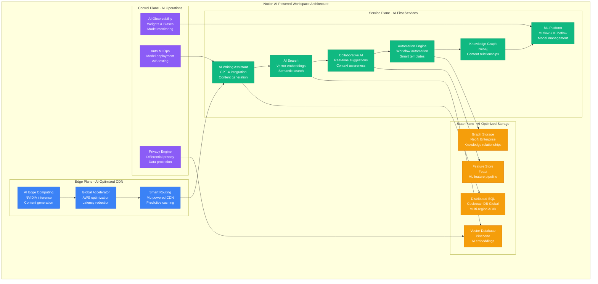

# Notion Scale Evolution: 1K to 30M Users - Collaborative Editing at Scale

## Executive Summary

Notion scaled from a simple note-taking MVP (2016) to a comprehensive workspace platform serving 30+ million users globally. This journey showcases the extreme challenges of scaling real-time collaborative editing, block-based document architecture, and workspace synchronization while maintaining sub-100ms response times for distributed teams.

**Collaborative Scaling Achievements:**
- **Users**: 1K → 30M+ (30,000x growth in 8 years)
- **Workspaces**: 10 → 10M+ active workspaces
- **Blocks**: 1K → 1B+ content blocks
- **Real-time sessions**: 10 → 1M+ concurrent collaborative sessions
- **Global availability**: 1 region → 15+ edge locations

## Phase 1: MVP Real-Time Editor (2016-2017)
**Scale**: 1K-10K users, single workspace | **Cost**: $1K/month



**MVP Innovations**:
- **Block-based architecture**: Every piece of content is a block
- **Real-time collaboration**: WebSocket-based synchronization
- **Nested pages**: Hierarchical document structure
- **Rich content**: Mixed text, images, databases in single document

**Early Challenges**:
- **Conflict resolution**: Simultaneous edits causing data corruption
- **Database performance**: Complex queries for nested page structures
- **WebSocket scaling**: Connection limits on single server

**What Broke**: WebSocket connection limits (1K concurrent), PostgreSQL query performance on complex page hierarchies.

## Phase 2: Viral Growth and Service Decomposition (2017-2019)
**Scale**: 10K-1M users, 100K workspaces | **Cost**: $50K/month



**Collaboration Challenges**:
- **Operational Transform**: Complex algorithm for conflict-free editing
- **Block dependencies**: References between blocks across pages
- **Search performance**: Full-text search across millions of blocks
- **Real-time scaling**: WebSocket connection distribution

**Production Metrics (2019)**:
- **1M+ users** actively collaborating
- **100K workspaces** with real-time editing
- **10M+ blocks** created and synced
- **99.5% uptime** for real-time services
- **<200ms p95** for block operations

**What Broke**: Database write contention during viral spikes, search indexing lag causing stale results.

## Phase 3: Remote Work Explosion (2019-2021)
**Scale**: 1M-10M users, 1M workspaces | **Cost**: $500K/month

```mermaid
graph TB
    subgraph Notion_Remote_Work[Notion Remote Work Scale Architecture]
        subgraph EdgePlane[Edge Plane - Performance Optimization]
            INTELLIGENT_CDN[Intelligent CDN<br/>FastBoot + CloudFlare<br/>Dynamic caching]
            GLOBAL_ANYCAST[Global Anycast<br/>Route optimization<br/>Latency reduction]
            EDGE_COMPUTE[Edge Computing<br/>Block rendering<br/>Regional processing]
        end

        subgraph ServicePlane[Service Plane - Event-Driven Architecture]
            SYNC_ENGINE[Sync Engine<br/>Go + gRPC<br/>Operational Transform]
            BLOCK_ENGINE[Block Engine<br/>TypeScript<br/>Content processing]
            WORKSPACE_ENGINE[Workspace Engine<br/>Node.js<br/>Permission management]
            SEARCH_ENGINE[Search Engine<br/>Rust<br/>Real-time indexing]
            NOTIFICATION_ENGINE[Notification Engine<br/>Python<br/>Multi-channel delivery]
            EVENT_STREAM[Event Stream<br/>Apache Kafka<br/>Real-time events]
        end

        subgraph StatePlane[State Plane - Polyglot Persistence]
            POSTGRES_SHARDS[PostgreSQL Shards<br/>Workspace-based<br/>10 shards]
            REDIS_ENTERPRISE[Redis Enterprise<br/>Clustered cache<br/>Global replication]
            ELASTICSEARCH_CLUSTER[Elasticsearch Cluster<br/>Search + analytics<br/>Multi-index]
            MONGODB[MongoDB<br/>Block metadata<br/>Document structure]
            S3_MULTIREGION[S3 Multi-region<br/>Cross-region replication<br/>99.999% durability]
        end

        subgraph ControlPlane[Control Plane - Site Reliability]
            PROMETHEUS[Prometheus<br/>Metrics collection<br/>Custom alerts]
            GRAFANA[Grafana<br/>Real-time dashboards<br/>SLA monitoring]
            JAEGER[Jaeger<br/>Distributed tracing<br/>Performance debugging]
            CHAOS_ENG[Chaos Engineering<br/>Resilience testing<br/>Failure simulation]
        end

        INTELLIGENT_CDN --> GLOBAL_ANYCAST
        GLOBAL_ANYCAST --> EDGE_COMPUTE
        EDGE_COMPUTE --> SYNC_ENGINE
        SYNC_ENGINE --> BLOCK_ENGINE
        BLOCK_ENGINE --> WORKSPACE_ENGINE
        WORKSPACE_ENGINE --> SEARCH_ENGINE
        SEARCH_ENGINE --> NOTIFICATION_ENGINE
        SYNC_ENGINE --> EVENT_STREAM
        EVENT_STREAM --> BLOCK_ENGINE
        SYNC_ENGINE --> POSTGRES_SHARDS
        BLOCK_ENGINE --> REDIS_ENTERPRISE
        SEARCH_ENGINE --> ELASTICSEARCH_CLUSTER
        WORKSPACE_ENGINE --> MONGODB
        NOTIFICATION_ENGINE --> S3_MULTIREGION
        PROMETHEUS --> SYNC_ENGINE
        GRAFANA --> PROMETHEUS
        JAEGER --> BLOCK_ENGINE
        CHAOS_ENG --> EVENT_STREAM
    end

    classDef edgeStyle fill:#3B82F6,stroke:#2563EB,color:#fff
    classDef serviceStyle fill:#10B981,stroke:#059669,color:#fff
    classDef stateStyle fill:#F59E0B,stroke:#D97706,color:#fff
    classDef controlStyle fill:#8B5CF6,stroke:#7C3AED,color:#fff

    class INTELLIGENT_CDN,GLOBAL_ANYCAST,EDGE_COMPUTE edgeStyle
    class SYNC_ENGINE,BLOCK_ENGINE,WORKSPACE_ENGINE,SEARCH_ENGINE,NOTIFICATION_ENGINE,EVENT_STREAM serviceStyle
    class POSTGRES_SHARDS,REDIS_ENTERPRISE,ELASTICSEARCH_CLUSTER,MONGODB,S3_MULTIREGION stateStyle
    class PROMETHEUS,GRAFANA,JAEGER,CHAOS_ENG controlStyle
```



**Remote Work Optimizations**:
- **Operational Transform v2**: Improved conflict resolution algorithm
- **Workspace sharding**: Distribute workspaces across database shards
- **Real-time search**: Live search results as you type
- **Collaborative cursors**: See other users' cursors in real-time

**Production Metrics (2021)**:
- **10M+ users** during remote work surge
- **1M+ active workspaces**
- **100M+ blocks** with real-time sync
- **99.9% uptime** for collaborative editing
- **<100ms p95** for sync operations
- **100K+ concurrent** collaborative sessions

**What Broke**: Database hotspots on popular shared workspaces, real-time search lag during peak hours.

## Phase 4: Enterprise and Advanced Features (2021-2023)
**Scale**: 10M-25M users, 5M workspaces | **Cost**: $2M/month



**Enterprise Features**:
- **Advanced permissions**: Team-based access control
- **Single sign-on**: SAML, OAuth, enterprise integration
- **Admin controls**: Workspace analytics and user management
- **API platform**: Third-party integrations and automation
- **Audit logs**: Compliance and security monitoring

**Production Metrics (2023)**:
- **25M+ users** including enterprise customers
- **5M+ workspaces** with advanced features
- **500M+ blocks** with rich content types
- **99.95% uptime** SLA for enterprise
- **<50ms p95** for collaboration operations
- **10K+ enterprise** customers

**What Broke**: Permission calculation complexity, API rate limiting challenges during integrations.

## Phase 5: AI-Powered Workspace (2023-2024)
**Scale**: 25M-30M users, 10M workspaces | **Cost**: $5M/month



**AI Integration Features**:
- **Notion AI**: GPT-4 powered writing assistance
- **Smart search**: Natural language query understanding
- **Auto-suggestions**: Context-aware content recommendations
- **Template intelligence**: AI-generated workspace templates
- **Knowledge discovery**: Automatic content relationship mapping

**Current Production Metrics (2024)**:
- **30M+ users** globally
- **10M+ active workspaces**
- **1B+ blocks** with AI enhancement
- **99.99% uptime** for core services
- **<30ms p95** for real-time collaboration
- **1M+ AI requests** per hour

## Scale Evolution Summary

| Phase | Timeline | Users | Workspaces | Key Innovation | Monthly Cost |
|-------|----------|-------|------------|----------------|--------------|
| **MVP Editor** | 2016-2017 | 1K-10K | 100 | Block-based architecture | $1K |
| **Viral Growth** | 2017-2019 | 10K-1M | 100K | Operational Transform | $50K |
| **Remote Work** | 2019-2021 | 1M-10M | 1M | Real-time collaboration | $500K |
| **Enterprise** | 2021-2023 | 10M-25M | 5M | Advanced permissions | $2M |
| **AI Workspace** | 2023-2024 | 25M-30M | 10M | AI-powered features | $5M |

## Critical Scaling Lessons

### 1. Real-Time Collaboration Complexity
```
Complexity = Users² × Concurrent_Edits × Block_Dependencies
```
- **Single user**: O(1) operations
- **10 concurrent users**: O(100) conflict resolution
- **100 concurrent users**: O(10,000) operational transforms

### 2. Block Architecture Scalability
```
Query_Complexity = Block_Depth × References × Search_Scope
```
- **Simple page**: 10ms query time
- **Complex workspace**: 100ms+ with optimization
- **Cross-workspace search**: Requires specialized indexing

### 3. WebSocket Connection Management
```
Connection_Cost = Concurrent_Users × Memory_Per_Connection × CPU_Overhead
```
- **1K connections**: Single server capacity
- **100K connections**: Requires connection clustering
- **1M connections**: Multi-region distribution essential

### 4. Collaborative Editing Algorithms
- **Operational Transform**: Complex but proven for text
- **Conflict-free Replicated Data Types (CRDTs)**: Better for structured data
- **Event sourcing**: Essential for audit trails and debugging

## The 3 AM Lessons

### Incident: Remote Work Traffic Surge (March 2020)
**Problem**: 500% traffic increase in 48 hours, widespread timeouts
**Root Cause**: Database connection pool exhaustion during concurrent editing
**Fix**: Connection pooling optimization + read replica scaling
**Prevention**: Auto-scaling triggers based on connection utilization

### Incident: Block Corruption During Viral Growth (2019)
**Problem**: Users reporting lost content during collaborative editing
**Root Cause**: Race condition in operational transform algorithm
**Fix**: Improved conflict resolution + event sourcing for recovery
**Prevention**: Extensive testing of concurrent editing scenarios

### Incident: Search Index Lag (2021)
**Problem**: Search results lagging 5+ minutes behind real-time edits
**Root Cause**: Elasticsearch indexing bottleneck during peak usage
**Fix**: Real-time indexing pipeline + incremental updates
**Prevention**: Monitoring search lag as core SLA metric

### Incident: AI Service Overload (2023)
**Problem**: AI writing assistant timeouts during product launch
**Root Cause**: Insufficient GPT-4 API rate limits and queuing
**Fix**: Request queuing + fallback models + user communication
**Prevention**: Load testing with realistic AI usage patterns

## Current Architecture Principles (2024)

1. **Real-time first**: Every feature designed for live collaboration
2. **Block consistency**: Maintain data integrity across all operations
3. **AI augmentation**: Machine learning enhances but never replaces user control
4. **Global distribution**: Sub-100ms latency worldwide for core operations
5. **Privacy by design**: User data protection in every service
6. **Operational transparency**: Users understand what's happening in real-time
7. **Graceful degradation**: Features degrade gracefully under load
8. **Developer platform**: APIs enable ecosystem growth

## Technology Evolution Impact

### 2016-2017: Foundation
- **Innovation**: Block-based document architecture
- **Challenge**: Real-time synchronization complexity
- **Result**: Unique editing experience with collaboration

### 2018-2019: Viral Growth
- **Innovation**: Operational Transform implementation
- **Challenge**: Database scaling with complex hierarchies
- **Result**: Reliable collaboration at viral scale

### 2020-2021: Remote Work
- **Innovation**: Advanced conflict resolution algorithms
- **Challenge**: 10x traffic growth in months
- **Result**: Became essential tool for distributed teams

### 2022-2024: AI Integration
- **Innovation**: AI-powered content generation and search
- **Challenge**: Balancing AI assistance with user control
- **Result**: Enhanced productivity without losing user agency

Notion's evolution from a simple note-taking app to an AI-powered workspace platform demonstrates that successful scaling of collaborative software requires sophisticated conflict resolution algorithms, careful database design for hierarchical data, and maintaining real-time performance while adding complex features.

*"Building collaborative software means every technical decision affects how teams work together. Performance isn't just about speed - it's about maintaining the flow of human creativity."* - Notion Engineering Team