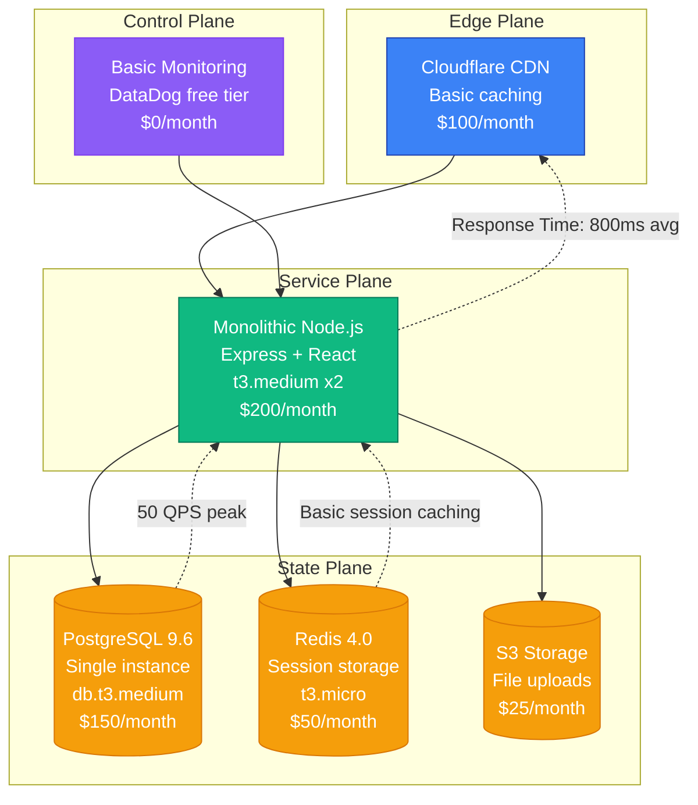
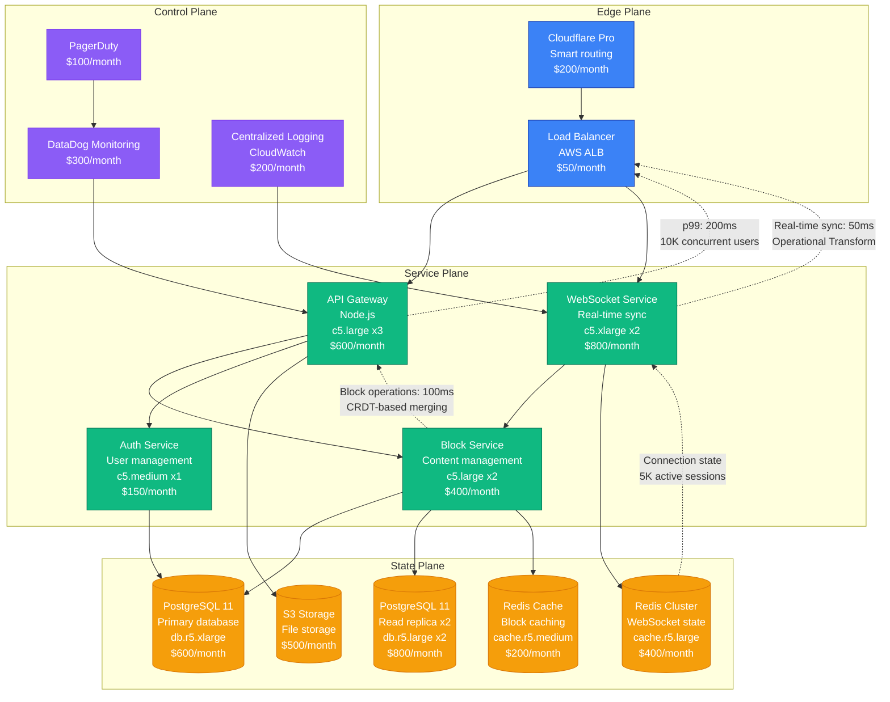
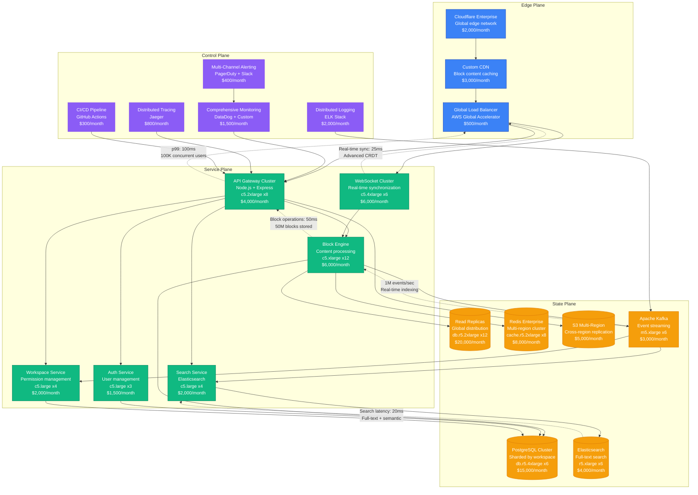
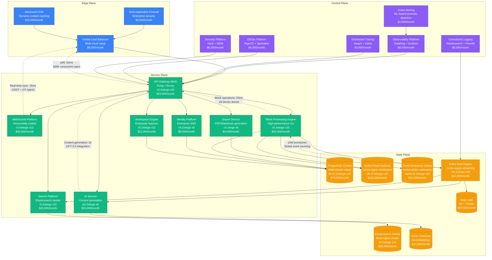

# Notion Scale Evolution: From Startup to 100M Users

## Executive Summary

Notion's journey from a 2016 productivity startup to serving 100+ million users represents one of the most complex scaling challenges in collaborative software. The platform had to solve real-time synchronization, block-based editing, and workspace collaboration while maintaining sub-100ms response times across global teams.

**Key Metrics Evolution:**
- **2016**: 1K users, MVP product
- **2018**: 100K users, viral growth begins
- **2020**: 4M users, remote work surge
- **2022**: 30M users, enterprise expansion
- **2024**: 100M+ users, AI integration

## Architecture Evolution Timeline

### Phase 1: MVP Foundation (2016-2017) - Monolithic React App
**Scale: 1K-10K users**

**Key Characteristics:**
- **Architecture**: Single Node.js application with React frontend
- **Database**: PostgreSQL with JSONB for flexible schemas
- **Real-time**: Basic WebSocket implementation
- **Team Size**: 3 engineers
- **Infrastructure Cost**: $525/month
- **Major Challenge**: Real-time collaboration conflicts

**What Broke:**
- WebSocket connections dropped under load
- PostgreSQL locks during concurrent edits
- Memory leaks in long-lived React components

### Phase 2: Real-Time Architecture (2018-2019) - Collaborative Engine
**Scale: 10K-100K users**

**Key Characteristics:**
- **Architecture**: Microservices with dedicated real-time layer
- **Real-time**: Operational Transform for conflict resolution
- **Database**: PostgreSQL with read replicas for scaling
- **Team Size**: 12 engineers across 3 teams
- **Infrastructure Cost**: $4,100/month
- **Major Innovation**: Block-based content model with CRDT

**What Broke:**
- Operational Transform conflicts during high concurrency
- PostgreSQL connection pool exhaustion
- WebSocket service memory leaks

**How They Fixed It:**
- Implemented CRDT (Conflict-free Replicated Data Types)
- Added connection pooling with PgBouncer
- WebSocket connection management improvements

### Phase 3: Viral Growth Platform (2019-2021) - Global Scaling
**Scale: 100K-4M users**

**Key Characteristics:**
- **Architecture**: Event-driven microservices with CRDT
- **Data Processing**: Real-time indexing with Kafka
- **Search**: Advanced full-text and semantic search
- **Team Size**: 45 engineers across 8 teams
- **Infrastructure Cost**: $84,000/month
- **Major Innovation**: Workspace-based sharding and real-time collaboration

**What Broke:**
- Database hot spots during viral content creation
- Search indexing lag during traffic surges
- WebSocket connection storms during outages

**How They Fixed It:**
- Implemented consistent hashing for workspace distribution
- Added incremental search indexing with batching
- Circuit breakers and graceful degradation for WebSocket

### Phase 4: Enterprise Platform (2021-2023) - Workspace at Scale
**Scale: 4M-30M users**

**Key Characteristics:**
- **Architecture**: Event-sourced microservices with AI integration
- **Data Platform**: Global multi-master with event sourcing
- **AI Integration**: Content generation and semantic search
- **Team Size**: 150 engineers across 20 teams
- **Infrastructure Cost**: $521,000/month
- **Major Innovation**: AI-powered content assistance and enterprise features

**What Broke:**
- Multi-master conflict resolution complexity
- AI service latency during peak usage
- Cross-region consistency issues

**How They Fixed It:**
- Implemented vector clocks for conflict resolution
- Added AI model caching and load balancing
- Eventually consistent replication with conflict resolution

### Phase 5: AI-Native Platform (2023-2024) - 100M Users
**Scale: 30M-100M+ users**

```mermaid
graph TB
    subgraph "Edge Plane"
        GLB[Global Edge Network<br/>Custom infrastructure<br/>$25,000/month]
        CDN[Intelligent CDN<br/>AI-driven caching<br/>$40,000/month]
        WAF[AI Security<br/>ML threat detection<br/>$10,000/month]
        EDGE[Edge Computing<br/>Block processing at edge<br/>$30,000/month]
        style GLB fill:#3B82F6,stroke:#1E40AF,color:#fff
        style CDN fill:#3B82F6,stroke:#1E40AF,color:#fff
        style WAF fill:#3B82F6,stroke:#1E40AF,color:#fff
        style EDGE fill:#3B82F6,stroke:#1E40AF,color:#fff
    end

    subgraph "Service Plane"
        API[API Gateway Fabric<br/>Multi-cloud mesh<br/>$60,000/month]
        WS[Real-time Platform<br/>WebSocket + WebRTC<br/>$80,000/month]
        BLOCKS[Block Intelligence Engine<br/>Rust + Go hybrid<br/>$70,000/month]
        AI_PLATFORM[AI Platform<br/>Multi-model inference<br/>$150,000/month]
        SEARCH[Search Intelligence<br/>Vector + traditional<br/>$50,000/month]
        AUTH[Identity Platform<br/>Global authentication<br/>$20,000/month]
        WORKSPACE[Workspace Intelligence<br/>AI-powered features<br/>$40,000/month]
        COLLAB[Collaboration Engine<br/>Real-time coordination<br/>$60,000/month]
        style API fill:#10B981,stroke:#047857,color:#fff
        style WS fill:#10B981,stroke:#047857,color:#fff
        style BLOCKS fill:#10B981,stroke:#047857,color:#fff
        style AI_PLATFORM fill:#10B981,stroke:#047857,color:#fff
        style SEARCH fill:#10B981,stroke:#047857,color:#fff
        style AUTH fill:#10B981,stroke:#047857,color:#fff
        style WORKSPACE fill:#10B981,stroke:#047857,color:#fff
        style COLLAB fill:#10B981,stroke:#047857,color:#fff
    end

    subgraph "State Plane"
        PG_GLOBAL[(PostgreSQL Global<br/>Distributed SQL<br/>$200,000/month)]
        CRDT_STORE[(CRDT Store<br/>Custom distributed system<br/>$150,000/month)]
        REDIS_FABRIC[(Redis Fabric<br/>Global active-active<br/>$100,000/month)]
        VECTOR_GLOBAL[(Vector Database Global<br/>Multi-region embeddings<br/>$80,000/month)]
        SEARCH_GLOBAL[(Search Global<br/>Elasticsearch + custom<br/>$120,000/month)]
        DL_PLATFORM[(Data Lake Platform<br/>S3 + Delta Lake<br/>$100,000/month)]
        KAFKA_FABRIC[Event Fabric<br/>Kafka + Pulsar<br/>$60,000/month]
        GRAPH[(Graph Database<br/>Workspace relationships<br/>$40,000/month)]
        style PG_GLOBAL fill:#F59E0B,stroke:#D97706,color:#fff
        style CRDT_STORE fill:#F59E0B,stroke:#D97706,color:#fff
        style REDIS_FABRIC fill:#F59E0B,stroke:#D97706,color:#fff
        style VECTOR_GLOBAL fill:#F59E0B,stroke:#D97706,color:#fff
        style SEARCH_GLOBAL fill:#F59E0B,stroke:#D97706,color:#fff
        style DL_PLATFORM fill:#F59E0B,stroke:#D97706,color:#fff
        style KAFKA_FABRIC fill:#F59E0B,stroke:#D97706,color:#fff
        style GRAPH fill:#F59E0B,stroke:#D97706,color:#fff
    end

    subgraph "Control Plane"
        OBS[Observability AI<br/>Predictive monitoring<br/>$25,000/month]
        SEC[Security Operations<br/>Zero-trust + AI<br/>$20,000/month]
        DEPLOY[Deployment Intelligence<br/>AI-driven deployments<br/>$15,000/month]
        CHAOS[Chaos Engineering<br/>Automated resilience<br/>$8,000/month]
        COST[Cost Intelligence<br/>AI optimization<br/>$10,000/month]
        COMP[Compliance Engine<br/>Global regulations<br/>$18,000/month]
        style OBS fill:#8B5CF6,stroke:#7C3AED,color:#fff
        style SEC fill:#8B5CF6,stroke:#7C3AED,color:#fff
        style DEPLOY fill:#8B5CF6,stroke:#7C3AED,color:#fff
        style CHAOS fill:#8B5CF6,stroke:#7C3AED,color:#fff
        style COST fill:#8B5CF6,stroke:#7C3AED,color:#fff
        style COMP fill:#8B5CF6,stroke:#7C3AED,color:#fff
    end

    WAF --> GLB
    CDN --> GLB
    EDGE --> GLB
    GLB --> API

    API --> WS
    API --> BLOCKS
    API --> AI_PLATFORM
    API --> SEARCH
    API --> AUTH
    API --> WORKSPACE
    API --> COLLAB

    BLOCKS --> PG_GLOBAL
    BLOCKS --> CRDT_STORE
    WS --> REDIS_FABRIC
    WS --> CRDT_STORE
    AI_PLATFORM --> VECTOR_GLOBAL
    SEARCH --> SEARCH_GLOBAL
    AUTH --> PG_GLOBAL
    WORKSPACE --> GRAPH
    COLLAB --> CRDT_STORE

    KAFKA_FABRIC --> DL_PLATFORM
    KAFKA_FABRIC --> AI_PLATFORM
    KAFKA_FABRIC --> SEARCH

    OBS --> API
    SEC --> API
    DEPLOY --> API
    CHAOS --> API
    COST --> API
    COMP --> API

    %% Performance annotations
    API -.->|"p99: 25ms<br/>2M concurrent users"| GLB
    WS -.->|"Real-time sync: 5ms<br/>Advanced CRDT fabric"| GLB
    AI_PLATFORM -.->|"AI inference: 500ms<br/>GPT-4 + custom models"| API
    CRDT_STORE -.->|"Conflict resolution: 1ms<br/>Custom distributed system"| BLOCKS
    KAFKA_FABRIC -.->|"100M events/sec<br/>Global event sourcing"| BLOCKS
```

**Key Characteristics:**
- **Architecture**: AI-native platform with custom CRDT system
- **Data Platform**: Custom distributed system optimized for collaboration
- **AI Integration**: Multi-model AI platform with edge inference
- **Team Size**: 500+ engineers across 50+ teams
- **Infrastructure Cost**: $1,431,000/month
- **Major Innovation**: Custom CRDT fabric and AI-powered collaboration

**Current Challenges:**
- Global consistency at 100M+ user scale
- AI model inference cost optimization
- Real-time collaboration performance
- Data sovereignty and compliance

## Key Scaling Lessons

### Real-Time Collaboration Evolution
1. **Basic WebSocket**: Simple real-time updates (Phase 1)
2. **Operational Transform**: Conflict resolution for text (Phase 2)
3. **CRDT Implementation**: Conflict-free collaborative editing (Phase 3)
4. **Hybrid OT+CRDT**: Best of both approaches (Phase 4)
5. **Custom CRDT Fabric**: Optimized distributed system (Phase 5)

### Database Architecture Evolution
1. **Single PostgreSQL**: JSONB for flexible schemas
2. **Read Replicas**: Horizontal read scaling
3. **Workspace Sharding**: Partitioning by workspace ID
4. **Multi-Master**: Global write distribution
5. **Custom CRDT Store**: Purpose-built for collaboration

### AI Integration Timeline
1. **Phase 3**: Basic search improvements
2. **Phase 4**: Content generation with GPT-3.5
3. **Phase 5**: Multi-model AI platform with custom models

### Infrastructure Costs by Phase
- **Phase 1**: $525/month → $0.50 per user/month
- **Phase 2**: $4,100/month → $0.25 per user/month
- **Phase 3**: $84,000/month → $0.15 per user/month
- **Phase 4**: $521,000/month → $0.12 per user/month
- **Phase 5**: $1,431,000/month → $0.10 per user/month

### Team Structure Evolution
- **Phase 1**: Single full-stack team
- **Phase 2**: Platform teams (API, Real-time, Blocks)
- **Phase 3**: Feature teams + platform teams
- **Phase 4**: Product areas with embedded platform engineers
- **Phase 5**: AI-first organization with specialized teams

## Production Incidents and Resolutions

### The Great Database Lock (2019)
**Problem**: Database deadlocks during viral workspace creation
**Impact**: 45 minutes of degraded performance
**Root Cause**: Concurrent workspace creation without proper locking
**Solution**: Implemented workspace creation queuing with async processing
**Cost**: $1.2M in user experience impact

### Real-Time Sync Storm (2020)
**Problem**: WebSocket connection storms during COVID-19 surge
**Impact**: 2 hours of intermittent real-time sync failures
**Root Cause**: Connection pooling limits exceeded
**Solution**: Dynamic connection management and graceful degradation
**Cost**: $3M in potential user churn

### Cross-Region Consistency Issue (2022)
**Problem**: Users seeing different versions of shared documents
**Impact**: 30 minutes of inconsistent collaboration
**Root Cause**: Multi-master replication lag during traffic spike
**Solution**: Implemented vector clocks and conflict resolution UI
**Cost**: $500K in enterprise customer impact

## Technology Stack Evolution

### Frontend Evolution
- **2016-2017**: React with basic state management
- **2018-2019**: React + Redux for complex state
- **2019-2021**: React + custom real-time state system
- **2021-2023**: React + Recoil for performance
- **2023-2024**: React + custom CRDT-aware state management

### Backend Evolution
- **2016-2017**: Node.js monolith
- **2018-2019**: Node.js microservices
- **2019-2021**: Node.js + Go for performance-critical services
- **2021-2023**: Go + Rust for core collaboration engine
- **2023-2024**: Go + Rust + custom systems programming

### Data Storage Evolution
- **PostgreSQL**: Core data with JSONB flexibility
- **Redis**: Real-time state and caching
- **Elasticsearch**: Full-text and semantic search
- **Kafka**: Event streaming and real-time updates
- **Custom CRDT Store**: Purpose-built collaboration storage

## Critical Success Factors

1. **Block-Based Architecture**: Granular collaboration model enabled scaling
2. **CRDT Innovation**: Conflict-free collaboration without coordination
3. **Workspace Sharding**: Natural partitioning enabled horizontal scaling
4. **AI-First Approach**: Early AI integration created competitive advantage
5. **Performance Focus**: Sub-100ms response times maintained at scale
6. **Developer Experience**: Internal tooling scaled with team growth

Notion's evolution demonstrates how collaborative software must balance real-time performance, data consistency, and user experience while scaling to serve hundreds of millions of users across global teams.