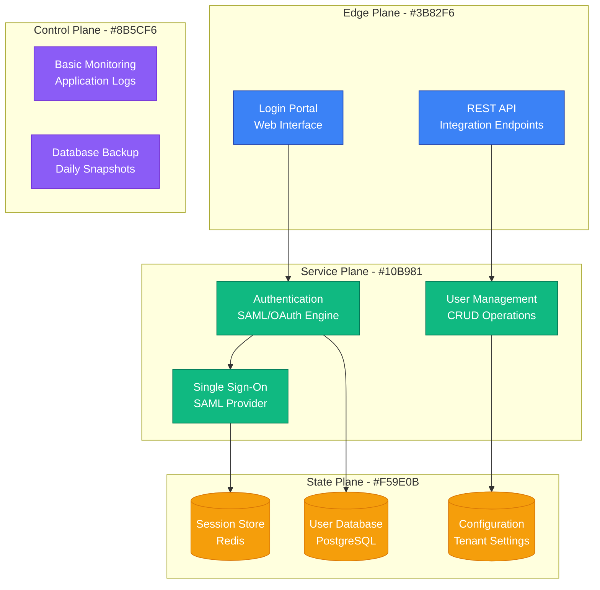
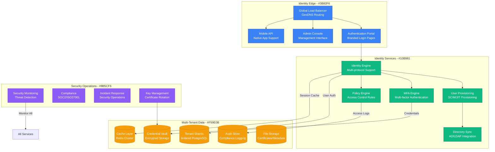
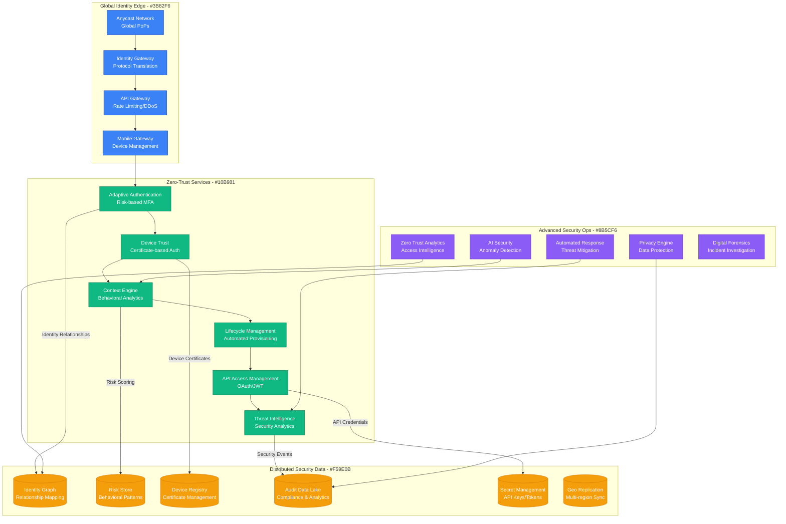
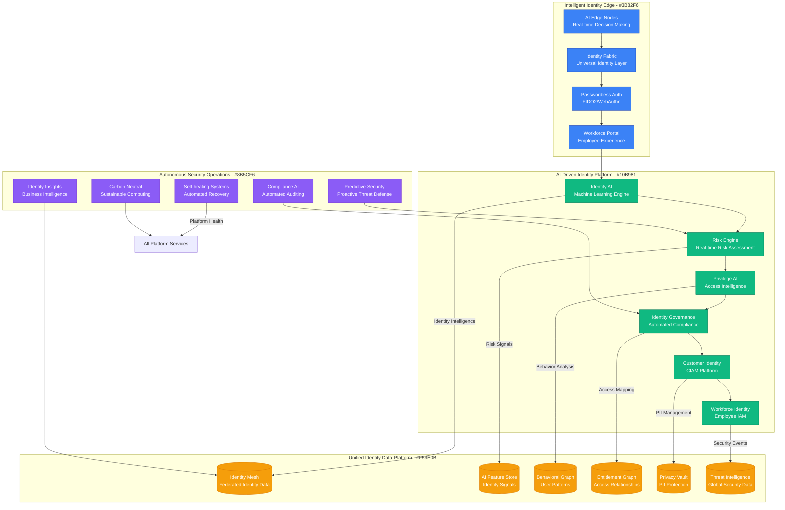
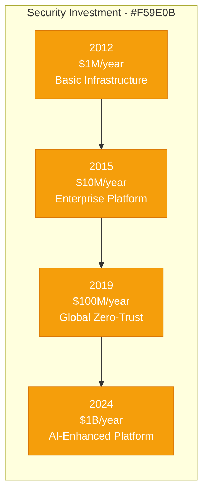

# Okta: Identity Provider to Enterprise Scale

## Executive Summary

Okta's scaling journey from a simple identity provider startup to the leading enterprise identity platform serving 18,000+ organizations represents one of the most successful identity-as-a-service transformations. This case study examines their evolution from 2009 to 2024, focusing on the unique challenges of scaling a security-critical platform that handles billions of authentication requests daily while maintaining zero-trust security and sub-second response times globally.

## Scale Milestones

| Milestone | Year | Organizations | Key Challenge | Solution | Auth Requests/Day |
|-----------|------|---------------|---------------|----------|-------------------|
| Startup | 2009 | 0 | Identity concept | Cloud-first architecture | 0 |
| Product-Market Fit | 2012 | 100 | Multi-tenancy | Shared security model | 1M |
| Enterprise | 2015 | 1,000 | Enterprise features | Zero-trust platform | 100M |
| Global Scale | 2019 | 10,000 | Global availability | Multi-region active-active | 10B |
| AI-Enhanced | 2024 | 18,000+ | Intelligent security | AI-driven threat detection | 100B+ |

## Architecture Evolution

### Phase 1: Cloud Identity Foundation (2009-2012)
*Scale: 0 → 100 organizations*

**Key Metrics (2012)**:
- Daily Auth Requests: 1M
- Organizations: 100
- Users: 10K
- Response Time: <500ms
- Uptime: 99.5%

### Phase 2: Enterprise Identity Platform (2012-2015)
*Scale: 100 → 1,000 organizations*

**Key Metrics (2015)**:
- Daily Auth Requests: 100M
- Organizations: 1,000
- Users: 1M+
- Response Time: <200ms
- Uptime: 99.9%

### Phase 3: Zero-Trust Security Platform (2015-2019)
*Scale: 1,000 → 10,000 organizations*

**Breakthrough Moment**: Adaptive MFA launch in 2017 reduced friction by 80% while improving security posture.

**Key Metrics (2019)**:
- Daily Auth Requests: 10B
- Organizations: 10,000
- Users: 100M+
- Global PoPs: 20+
- Uptime: 99.99%

### Phase 4: AI-Enhanced Identity Platform (2019-2024)
*Scale: 10,000 → 18,000+ organizations*

**Current Metrics (2024)**:
- Daily Auth Requests: 100B+
- Organizations: 18,000+
- Users: 1B+
- AI Decisions: 10B+ daily
- Response Time: <50ms globally

## Critical Scale Events

### The Multi-Tenancy Challenge (2013)
**Challenge**: Scaling from single-tenant to multi-tenant architecture without compromising security isolation.

**Solution**: Tenant-aware data sharding with cryptographic isolation boundaries.

**Impact**: Enabled 100x customer growth while maintaining security guarantees.

### The Enterprise Security Requirements (2016)
**Challenge**: Fortune 500 customers required advanced security features and compliance certifications.

**Innovation**: Zero-trust architecture with adaptive authentication and comprehensive audit trails.

**Result**: Accelerated enterprise adoption and $100M+ ARR.

### Global Availability Challenge (2018)
**Challenge**: Enterprise customers required 99.99% uptime with global presence.

**Solution**: Active-active multi-region architecture with automatic failover.

### AI-Driven Security Revolution (2020)
**Challenge**: Traditional rule-based security couldn't keep up with sophisticated threats.

**Breakthrough**: Machine learning-powered risk engine analyzing billions of signals real-time.

### Privacy Regulation Compliance (2021)
**Challenge**: GDPR, CCPA, and emerging privacy laws required fundamental data architecture changes.

**Solution**: Privacy-by-design architecture with differential privacy and data minimization.

## Technology Evolution

### Authentication Protocols
- **2009-2012**: SAML 2.0 and basic OAuth
- **2012-2015**: OpenID Connect and modern OAuth 2.0
- **2015-2019**: FIDO/WebAuthn passwordless authentication
- **2019-2024**: Continuous authentication and risk-based MFA

### Security Architecture
- **Phase 1**: Perimeter-based security
- **Phase 2**: Defense in depth
- **Phase 3**: Zero-trust architecture
- **Phase 4**: AI-driven adaptive security

### Data Strategy Evolution
- **2009-2014**: Relational databases
- **2014-2018**: NoSQL and caching layers
- **2018-2021**: Graph databases for identity relationships
- **2021-2024**: AI/ML feature stores and real-time analytics

## Financial Impact

### Infrastructure Investment by Phase

### Revenue Growth
- **2012**: $1M ARR (early customers)
- **2015**: $100M ARR (enterprise breakthrough)
- **2019**: $500M ARR (global expansion)
- **2024**: $2B+ ARR (AI-enhanced platform)

### Business Model Evolution
- **2009-2013**: Per-user pricing
- **2013-2017**: Tiered feature pricing
- **2017-2021**: Consumption-based pricing
- **2021-2024**: Platform and outcomes-based pricing

## Lessons Learned

### What Worked
1. **Security-First Culture**: Never compromised security for growth
2. **API-First Design**: Enabled ecosystem and integration-driven growth
3. **Zero-Trust Vision**: Early adoption of zero-trust principles created competitive moat
4. **Customer Success**: High-touch support for enterprise customers built loyalty

### What Didn't Work
1. **Consumer Market**: Failed to penetrate consumer identity market effectively
2. **Acquisitions**: Some acquisitions didn't integrate well culturally or technically
3. **International Expansion**: Slower international growth due to regulatory complexities
4. **Developer Experience**: Initially complex APIs hindered developer adoption

### Key Technical Decisions
1. **Cloud-Native Architecture**: Built for cloud from day one enabled scaling
2. **Multi-Protocol Support**: Supporting all identity protocols expanded addressable market
3. **Real-Time Risk Engine**: AI-driven security created differentiation
4. **Privacy-by-Design**: Proactive privacy compliance avoided regulatory issues

## Current Architecture (2024)

**Global Infrastructure**:
- 50+ global points of presence
- 99.99% uptime SLA
- Sub-50ms authentication globally
- 100B+ daily security decisions

**Key Technologies**:
- Kubernetes for container orchestration
- PostgreSQL for transactional data
- Neo4j for identity graphs
- Apache Kafka for event streaming
- TensorFlow for ML/AI workloads

**Operating Metrics**:
- 18,000+ enterprise customers
- 1B+ identities under management
- 100B+ authentication requests daily
- $2B+ annual revenue run rate

## Looking Forward: Next 5 Years

### Predicted Challenges
1. **Quantum Computing Threats**: Post-quantum cryptography migration
2. **Decentralized Identity**: Blockchain-based identity standards adoption
3. **AI Regulation**: Compliance with emerging AI governance frameworks
4. **Privacy Evolution**: Balancing personalization with data minimization

### Technical Roadmap
1. **Decentralized Identity**: Self-sovereign identity and verifiable credentials
2. **Quantum-Safe Security**: Post-quantum cryptographic algorithms
3. **Ambient Intelligence**: Invisible authentication using behavioral biometrics
4. **Identity Interoperability**: Universal identity standards and protocols

**Summary**: Okta's evolution from a simple identity provider to an AI-enhanced zero-trust platform demonstrates the critical importance of security-first architecture in building enterprise trust. Their success lies in never compromising security for scale, consistently innovating in identity technology, and building a platform that becomes more valuable as it grows through network effects and data intelligence.