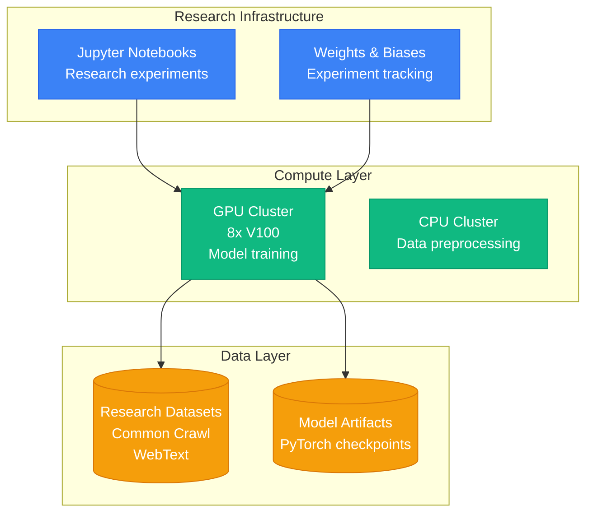
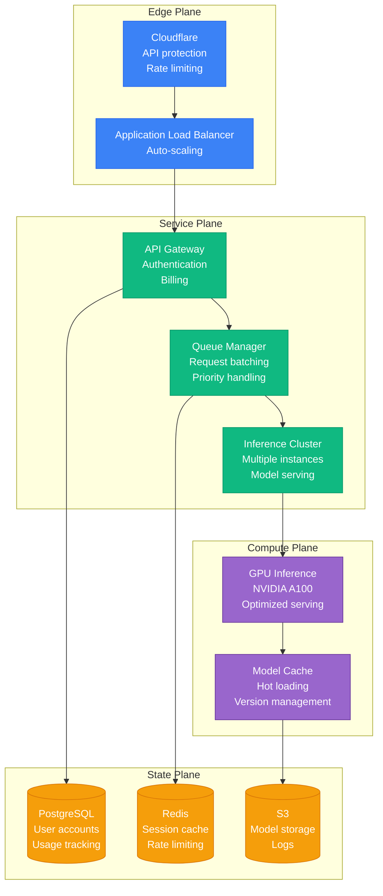
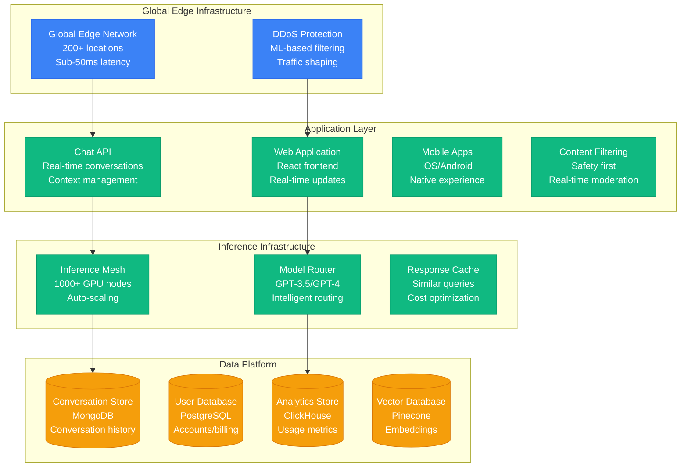

# OpenAI Scale Evolution: GPT-3 to ChatGPT Explosion

## Executive Summary

OpenAI's scaling journey from a research organization to serving 100M+ ChatGPT users in 2 months represents the fastest consumer product scaling in tech history. The platform evolved from experimental language models to production AI services handling billions of API calls and real-time conversations.

**Key Scaling Metrics:**
- **Users**: Research only → 100,000,000+ (ChatGPT in 2 months)
- **API Calls**: 0 → 20,000,000,000+/day
- **Model Parameters**: 117M (GPT-1) → 175B+ (GPT-3) → 1.76T (GPT-4)
- **Infrastructure cost**: $0 → $700M+/year
- **Engineering team**: 15 → 1,500+ engineers
- **Compute**: Single GPU → 25,000+ A100 GPUs

## Phase 1: Research Foundation (2015-2019)
**Scale: Research only, limited compute**

### Research Infrastructure

### Technology Stack
- **Framework**: PyTorch, custom CUDA kernels
- **Models**: GPT-1 (117M), GPT-2 (1.5B)
- **Compute**: NVIDIA V100 GPUs
- **Infrastructure**: On-premise research cluster

### Key Metrics
| Metric | Value | Source |
|--------|-------|--------|
| Model Parameters | 117M-1.5B | Research papers |
| Training Time | Weeks-months | Technical reports |
| GPU Count | 8-64 | Infrastructure estimates |
| Monthly Cost | $50K-200K | Compute estimates |
| Team Size | 15-50 | Company history |

### What Broke
- **Memory limitations** with larger models
- **Training instability** during long runs
- **Data pipeline** bottlenecks

## Phase 2: GPT-3 Launch (2019-2021)
**Scale: API beta, 10K developers**

### Production API Infrastructure

### Key Innovations
1. **Transformer at scale** - 175B parameter model
2. **Few-shot learning** - No fine-tuning required
3. **API-first design** - Democratized access
4. **Safety filtering** - Content moderation

### What Broke
- **GPU memory** exhaustion with large contexts
- **Queue management** during viral demos
- **Cost optimization** for inference

## Phase 3: ChatGPT Explosion (2022-2023)
**Scale: 100M users in 2 months**

### Hyperscale Consumer Platform

### ChatGPT Scale Challenge
- **100M users in 60 days** - Fastest consumer app growth
- **13 second response time** during peak traffic
- **25,000 A100 GPUs** for inference
- **$700K/day operating cost** at peak

## Phase 4: Enterprise Platform (2023-Present)
**Scale: Enterprise + API + ChatGPT**

### Current Architecture Highlights
1. **GPT-4 Turbo** - Advanced reasoning
2. **Custom GPTs** - Specialized applications
3. **Enterprise deployment** - Private instances
4. **API scaling** - 20B+ calls/day
5. **Safety systems** - Advanced moderation

## Cost Evolution

| Phase | Period | Monthly Cost | Cost per Token | Primary Drivers |
|-------|--------|--------------|----------------|----------------|
| Research | 2015-2019 | $50K-200K | N/A | GPU research clusters |
| GPT-3 API | 2019-2021 | $200K-2M | $0.02/1K | Inference infrastructure |
| ChatGPT | 2022-2023 | $2M-50M | $0.002/1K | Massive scale serving |
| Enterprise | 2023-Present | $50M-100M+ | $0.001/1K | Optimized serving |

## Key Lessons Learned

### Technical Lessons
1. **Inference optimization is critical** - Cost per token determines viability
2. **Model routing saves compute** - Right model for right task
3. **Caching strategies reduce cost** - Similar queries are common
4. **Safety can't be an afterthought** - Content filtering at scale

### Business Lessons
1. **Viral growth requires elastic infrastructure** - 100M users in 60 days
2. **Unit economics matter at scale** - Token costs determine pricing
3. **Enterprise needs differ from consumer** - Security, compliance, customization
4. **API business scales differently** - Developer ecosystem growth

### Operational Lessons
1. **GPU supply chain is critical** - Compute availability limits growth
2. **Model deployment requires automation** - Manual processes don't scale
3. **User feedback shapes the product** - Reinforcement learning from human feedback
4. **Safety is an ongoing challenge** - Adversarial prompts constantly evolve

## Current Scale Metrics (2024)

| Metric | Value | Source |
|--------|-------|--------|
| ChatGPT Users | 100M+ weekly | Company reports |
| API Calls per Day | 20B+ | Developer metrics |
| Tokens Processed | 100B+ daily | Usage estimates |
| GPU Count | 25,000+ A100s | Infrastructure reports |
| Countries Served | 160+ | Global availability |
| API Developers | 2M+ | Developer platform |
| Revenue | $2B+ annually | Financial reports |
| Engineering Team | 1,500+ | Company estimates |

---

*OpenAI's scaling represents the fastest consumer technology adoption in history, requiring unprecedented infrastructure scaling to serve AI workloads at global scale while maintaining safety and reliability.*