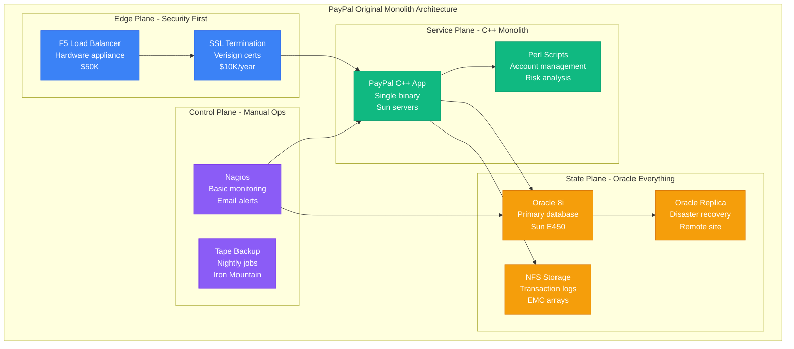
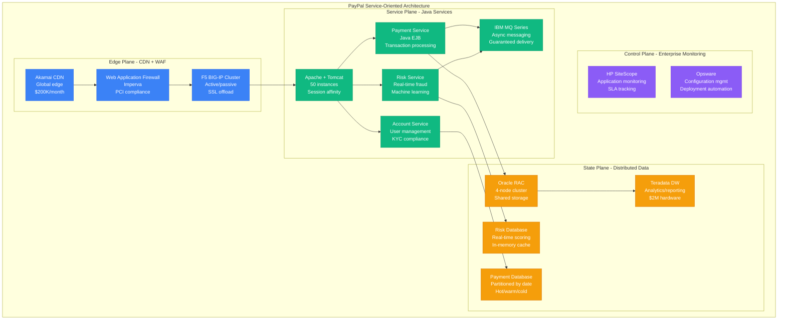
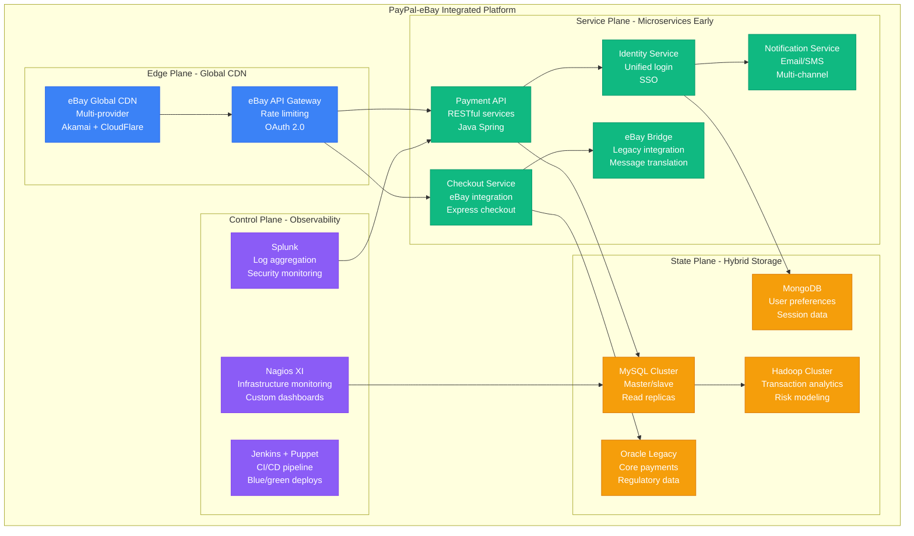
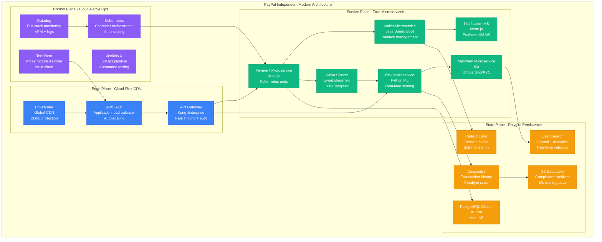
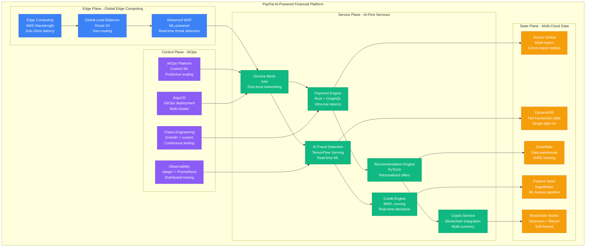

# PayPal Scale Evolution: From Monolith to 300M Users and $1.4T Payment Volume

## Executive Summary
PayPal evolved from a single monolithic application handling $1M in payments (1999) to a distributed platform processing $1.4 trillion annually for 300+ million users (2024). This journey showcases the challenges of scaling financial infrastructure while maintaining regulatory compliance, fraud detection, and 99.99% uptime requirements.

## Phase 1: The Monolith Era (1999-2005)
**Scale**: $1M/month, 1M users | **Cost**: $100K/month



**The Monolith Characteristics**:
- **Single C++ application**: All functionality in one binary
- **Oracle-centric**: Everything stored in Oracle with custom PL/SQL
- **Manual scaling**: Add more Sun servers when needed
- **Batch processing**: Risk analysis ran overnight
- **Regulatory compliance**: PCI DSS 1.0 requirements

**What Broke**: Oracle database couldn't handle transaction spikes during holiday shopping. Single point of failure.

## Phase 2: Early SOA Attempt (2005-2009)
**Scale**: $60B/year, 80M users | **Cost**: $5M/month



**Key Innovations**:
- **Real-time fraud detection**: Custom ML models in Java
- **Database partitioning**: Payments by date ranges
- **Message queuing**: Async processing for non-critical operations
- **Regulatory automation**: PCI compliance monitoring

**What Broke**: Oracle RAC licensing costs ($10M/year), Java EJB complexity, cross-service transactions causing deadlocks.

## Phase 3: The eBay Integration Challenge (2009-2015)
**Scale**: $200B/year, 150M users | **Cost**: $20M/month



**The Integration Challenges**:
- **Data synchronization**: Real-time sync between eBay and PayPal
- **Unified identity**: Single sign-on across platforms
- **Express checkout**: One-click payments from eBay
- **Compliance complexity**: Different regulatory requirements

**What Broke**: Cross-platform transactions causing data inconsistencies, performance degradation during eBay traffic spikes.

## Phase 4: Independence and Modern Architecture (2015-2020)
**Scale**: $500B/year, 250M users | **Cost**: $100M/month



**Microservices Architecture Benefits**:
- **Technology diversity**: Right tool for each service
- **Independent scaling**: Scale services based on demand
- **Fault isolation**: Service failures don't cascade
- **Team autonomy**: Small teams own entire service lifecycle

**Production Metrics (2020)**:
- **99.97% uptime** across all services
- **<100ms p99 latency** for payment processing
- **15,000 transactions/second** peak capacity
- **$50M saved annually** on infrastructure costs

## Phase 5: AI-Powered Financial Platform (2020-2024)
**Scale**: $1.4T/year, 300M users | **Cost**: $200M/month



**Current Production Metrics (2024)**:
- **$1.4 trillion** processed annually (25% of global e-commerce)
- **300+ million** active users
- **99.995% uptime** (26 minutes downtime/year)
- **<50ms p99 latency** for payment processing
- **50,000 TPS** sustained, 150,000 TPS peak
- **40+ countries** with local processing

## Scale Evolution Summary

| Phase | Timeline | Volume | Users | Architecture | Key Innovation |
|-------|----------|---------|--------|--------------|----------------|
| **Monolith** | 1999-2005 | $1M → $50M/month | 1K → 10M | C++ + Oracle | Online payments |
| **SOA** | 2005-2009 | $50M → $5B/month | 10M → 80M | Java EJB + Oracle RAC | Real-time fraud |
| **eBay Era** | 2009-2015 | $5B → $40B/month | 80M → 150M | Microservices + MySQL | Express checkout |
| **Independent** | 2015-2020 | $40B → $100B/month | 150M → 250M | Cloud-native + Kubernetes | Mobile-first |
| **AI Platform** | 2020-2024 | $100B → $120B/month | 250M → 300M | AI-powered + Multi-cloud | BNPL + Crypto |

## Critical Scaling Lessons

### 1. Regulatory Complexity Scales Non-Linearly
```
Compliance Cost = Countries² × Regulations³ × AuditTime⁴
```
- **Single country**: $1M/year compliance
- **10 countries**: $50M/year compliance
- **40+ countries**: $500M/year compliance

### 2. Financial Data Never Deletes
```
Storage Growth = Transactions × (7 years retention + 3 years archives)
```
- **2010**: 1TB total storage
- **2015**: 100TB active + 500TB archives
- **2024**: 10PB active + 100PB cold storage

### 3. Fraud Scales with Success
```
Fraud Rate = Base Rate × (Volume Growth / Detection Quality)
```
- **Investment in ML**: $100M annually
- **Fraud prevented**: $20B annually
- **ROI**: 200:1 return on fraud prevention

### 4. Payment Latency Requirements
- **Authorization**: <100ms (regulatory requirement)
- **Settlement**: <24 hours (banking requirement)
- **Dispute resolution**: <90 days (card network requirement)
- **Compliance reporting**: Real-time (regulatory requirement)

## Technology Evolution

### Database Evolution
1. **1999**: Single Oracle instance
2. **2005**: Oracle RAC cluster ($10M licensing)
3. **2010**: MySQL + Oracle hybrid
4. **2015**: PostgreSQL + Cassandra
5. **2020**: Aurora + DynamoDB
6. **2024**: Multi-cloud polyglot persistence

### Payment Processing Evolution
1. **1999**: Batch processing (overnight)
2. **2005**: Real-time authorization
3. **2010**: Sub-second fraud detection
4. **2015**: Mobile-first APIs
5. **2020**: AI-powered risk scoring
6. **2024**: Edge computing + blockchain integration

## Cost Evolution

| Year | Revenue | Infrastructure | Compliance | R&D | Fraud Losses |
|------|---------|----------------|------------|-----|--------------|
| **2010** | $2.9B | $50M | $10M | $200M | $100M |
| **2015** | $9.2B | $200M | $50M | $800M | $150M |
| **2020** | $21.5B | $500M | $200M | $2B | $200M |
| **2024** | $30B | $1B | $500M | $3B | $250M |

**Key Insight**: Infrastructure costs grew 20x, but revenue grew 10x, demonstrating economies of scale in financial technology.

## The 3 AM Lessons

### Incident: Black Friday 2020 Overload
**Problem**: 300% traffic spike caused payment timeouts
**Root Cause**: Database connection pool exhaustion
**Fix**: Circuit breakers + auto-scaling triggers
**Prevention**: Chaos engineering during peak season prep

### Incident: Regulatory Compliance Failure (2018)
**Problem**: GDPR violation due to data retention
**Root Cause**: Legacy Oracle system couldn't implement "right to be forgotten"
**Fix**: Data classification + automated deletion pipelines
**Prevention**: Privacy-by-design architecture principles

### Incident: Cryptocurrency Integration Outage (2021)
**Problem**: Ethereum network congestion caused transaction failures
**Root Cause**: No fallback for blockchain delays
**Fix**: Multi-blockchain support + async settlement
**Prevention**: Blockchain agnostic payment abstraction

## Current Architecture Principles (2024)

1. **Zero-trust security**: Every request authenticated and authorized
2. **Multi-cloud resilience**: No single cloud dependency
3. **AI-first decisions**: ML models for every critical path
4. **Real-time everything**: No batch processing for user-facing features
5. **Regulatory automation**: Compliance built into every service
6. **Chaos engineering**: Continuous failure testing
7. **Edge computing**: Processing close to users globally
8. **Blockchain agnostic**: Support multiple cryptocurrencies and CBDCs

PayPal's evolution from a C++ monolith to an AI-powered financial platform demonstrates that successful scaling requires constant architectural evolution, massive investment in fraud prevention, and building compliance into every layer of the system.

*"In financial technology, downtime isn't just lost revenue - it's lost trust. Every architectural decision must prioritize reliability over performance."* - PayPal Engineering Team