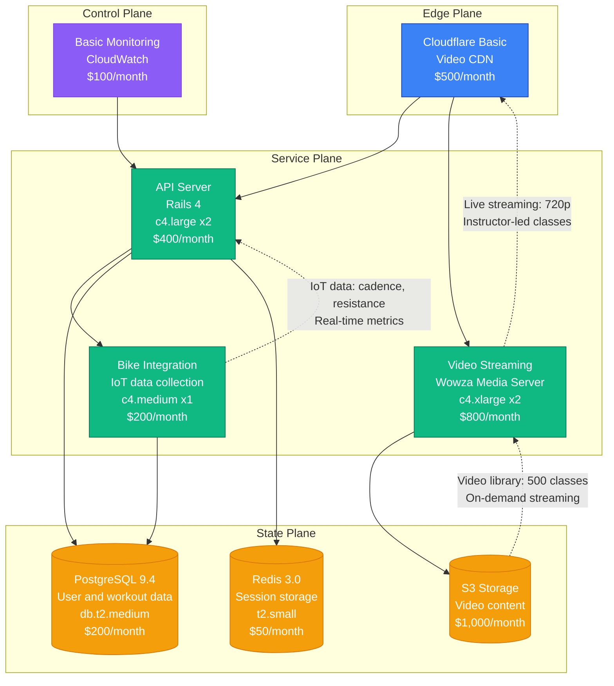
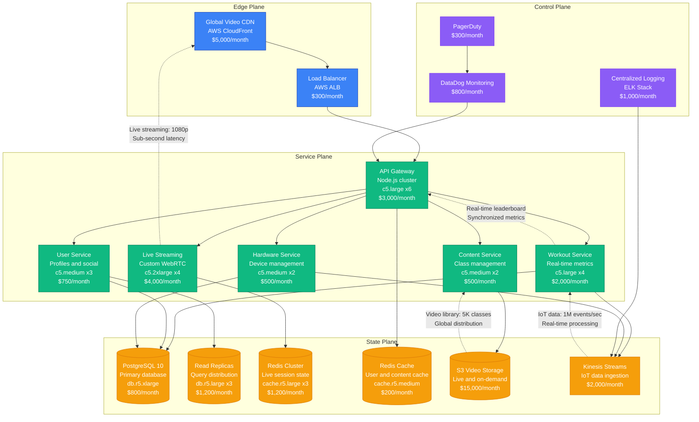

# Peloton Scale Evolution: From Startup to Live Streaming at Scale

## Executive Summary

Peloton's journey from a 2012 connected fitness startup to serving millions of concurrent live streams represents one of the most complex scaling challenges in fitness technology. The platform had to solve real-time video streaming, synchronized workout experiences, and global hardware integration while maintaining sub-second latency for live classes.

**Key Metrics Evolution:**
- **2014**: 1K users, hardware launch
- **2017**: 100K users, live streaming platform
- **2020**: 3M users, COVID-19 surge
- **2022**: 7M users, digital expansion
- **2024**: 6M+ subscribers, multi-platform fitness

## Architecture Evolution Timeline

### Phase 1: Connected Hardware Foundation (2012-2016) - Embedded Systems
**Scale: 1K-50K users**

**Key Characteristics:**
- **Architecture**: Rails monolith with Wowza streaming
- **Hardware**: Connected bike with embedded Android
- **Streaming**: Live and on-demand fitness classes
- **Team Size**: 12 engineers
- **Infrastructure Cost**: $3,250/month
- **Major Innovation**: Hardware-software integrated fitness experience

**What Broke:**
- Video streaming quality during peak hours
- IoT data synchronization issues
- Database locks during concurrent workouts

### Phase 2: Live Streaming Platform (2016-2019) - Real-Time Fitness
**Scale: 50K-500K users**

**Key Characteristics:**
- **Architecture**: Microservices with real-time streaming
- **Live Experience**: Sub-second latency for live classes
- **IoT Integration**: Real-time bike/treadmill data streaming
- **Team Size**: 45 engineers across 8 teams
- **Infrastructure Cost**: $38,550/month
- **Major Innovation**: Synchronized live fitness experiences with leaderboards

**What Broke:**
- Live streaming bottlenecks during popular classes
- IoT data processing delays during peak usage
- Database connection pool exhaustion

**How They Fixed It:**
- Implemented adaptive bitrate streaming
- Added Kinesis for scalable IoT data processing
- Connection pooling with auto-scaling

### Phase 3: COVID-19 Explosion (2019-2022) - Massive Scale
**Scale: 500K-3M users**

```mermaid
graph TB
    subgraph "Edge Plane"
        GLB[Global Load Balancer<br/>Multi-cloud setup<br/>$8,000/month]
        CDN[Advanced Video CDN<br/>Custom + CloudFront<br/>$50,000/month]
        WAF[Web Application Firewall<br/>$2,000/month]
        EDGE[Edge Computing<br/>Regional streaming<br/>$20,000/month]
        style GLB fill:#3B82F6,stroke:#1E40AF,color:#fff
        style CDN fill:#3B82F6,stroke:#1E40AF,color:#fff
        style WAF fill:#3B82F6,stroke:#1E40AF,color:#fff
        style EDGE fill:#3B82F6,stroke:#1E40AF,color:#fff
    end

    subgraph "Service Plane"
        API[API Gateway Mesh<br/>Kong + Envoy<br/>c5.2xlarge x20<br/>$20,000/month]
        LIVE[Live Streaming Platform<br/>Custom WebRTC + HLS<br/>c5.4xlarge x15<br/>$30,000/month]
        WORKOUT[Workout Analytics<br/>Real-time processing<br/>c5.2xlarge x12<br/>$12,000/month]
        SOCIAL[Social Platform<br/>Community features<br/>c5.xlarge x8<br/>$4,000/month]
        HARDWARE[Hardware Platform<br/>Device fleet management<br/>c5.large x10<br/>$5,000/month]
        CONTENT[Content Platform<br/>Class production pipeline<br/>c5.xlarge x6<br/>$3,000/month]
        MOBILE[Mobile API<br/>App optimization<br/>c5.large x8<br/>$4,000/month]
        WEB[Web Platform<br/>Browser experience<br/>c5.large x6<br/>$3,000/month]
        style API fill:#10B981,stroke:#047857,color:#fff
        style LIVE fill:#10B981,stroke:#047857,color:#fff
        style WORKOUT fill:#10B981,stroke:#047857,color:#fff
        style SOCIAL fill:#10B981,stroke:#047857,color:#fff
        style HARDWARE fill:#10B981,stroke:#047857,color:#fff
        style CONTENT fill:#10B981,stroke:#047857,color:#fff
        style MOBILE fill:#10B981,stroke:#047857,color:#fff
        style WEB fill:#10B981,stroke:#047857,color:#fff
    end

    subgraph "State Plane"
        PG_CLUSTER[(PostgreSQL Cluster<br/>Multi-master setup<br/>db.r5.8xlarge x8<br/>$40,000/month)]
        PG_READ[(Global Read Replicas<br/>Cross-region<br/>db.r5.4xlarge x16<br/>$50,000/month)]
        REDIS_GLOBAL[(Redis Enterprise<br/>Global clustering<br/>cache.r5.4xlarge x12<br/>$25,000/month)]
        S3_GLOBAL[(S3 Global Storage<br/>Video + user data<br/>$100,000/month)]
        KINESIS_GLOBAL[Kinesis Global<br/>IoT data streams<br/>$15,000/month]
        ES_CLUSTER[(Elasticsearch<br/>Content search<br/>r5.2xlarge x8<br/>$8,000/month)]
        DW[(Data Warehouse<br/>Snowflake<br/>$25,000/month)]
        style PG_CLUSTER fill:#F59E0B,stroke:#D97706,color:#fff
        style PG_READ fill:#F59E0B,stroke:#D97706,color:#fff
        style REDIS_GLOBAL fill:#F59E0B,stroke:#D97706,color:#fff
        style S3_GLOBAL fill:#F59E0B,stroke:#D97706,color:#fff
        style KINESIS_GLOBAL fill:#F59E0B,stroke:#D97706,color:#fff
        style ES_CLUSTER fill:#F59E0B,stroke:#D97706,color:#fff
        style DW fill:#F59E0B,stroke:#D97706,color:#fff
    end

    subgraph "Control Plane"
        MON[Observability Platform<br/>DataDog + Custom<br/>$8,000/month]
        LOG[Distributed Logging<br/>Elasticsearch + Fluentd<br/>$6,000/month]
        TRACE[Distributed Tracing<br/>Jaeger<br/>$3,000/month]
        ALERT[Smart Alerting<br/>ML-based detection<br/>$2,000/month]
        DEPLOY[CI/CD Platform<br/>Jenkins + Spinnaker<br/>$4,000/month]
        CHAOS[Chaos Engineering<br/>Resilience testing<br/>$2,000/month]
        style MON fill:#8B5CF6,stroke:#7C3AED,color:#fff
        style LOG fill:#8B5CF6,stroke:#7C3AED,color:#fff
        style TRACE fill:#8B5CF6,stroke:#7C3AED,color:#fff
        style ALERT fill:#8B5CF6,stroke:#7C3AED,color:#fff
        style DEPLOY fill:#8B5CF6,stroke:#7C3AED,color:#fff
        style CHAOS fill:#8B5CF6,stroke:#7C3AED,color:#fff
    end

    WAF --> GLB
    CDN --> GLB
    EDGE --> GLB
    GLB --> API

    API --> LIVE
    API --> WORKOUT
    API --> SOCIAL
    API --> HARDWARE
    API --> CONTENT
    API --> MOBILE
    API --> WEB

    LIVE --> REDIS_GLOBAL
    LIVE --> S3_GLOBAL
    WORKOUT --> PG_CLUSTER
    WORKOUT --> KINESIS_GLOBAL
    SOCIAL --> PG_CLUSTER
    HARDWARE --> PG_CLUSTER
    HARDWARE --> KINESIS_GLOBAL
    CONTENT --> S3_GLOBAL
    CONTENT --> ES_CLUSTER
    MOBILE --> PG_READ
    WEB --> PG_READ

    KINESIS_GLOBAL --> DW
    PG_CLUSTER --> DW

    MON --> API
    LOG --> KINESIS_GLOBAL
    TRACE --> API
    ALERT --> MON
    DEPLOY --> API
    CHAOS --> API

    %% Performance annotations
    API -.->|"p99: 100ms<br/>2M concurrent users"| GLB
    LIVE -.->|"Live streaming: 4K HDR<br/>Global distribution"| API
    WORKOUT -.->|"Real-time metrics: 10ms<br/>Synchronized leaderboards"| API
    KINESIS_GLOBAL -.->|"IoT data: 50M events/sec<br/>Real-time analytics"| WORKOUT
    S3_GLOBAL -.->|"Video library: 50K classes<br/>Adaptive streaming"| LIVE
```

**Key Characteristics:**
- **Architecture**: Global platform with edge streaming
- **Massive Scale**: 10x growth during COVID-19 pandemic
- **Multi-Platform**: Hardware, mobile, web, and TV apps
- **Team Size**: 200 engineers across 25 teams
- **Infrastructure Cost**: $455,000/month
- **Major Innovation**: Global live streaming with synchronized experiences

**What Broke:**
- CDN overload during peak COVID-19 demand
- Database write bottlenecks during subscriber surge
- Live streaming quality degradation under load

**How They Fixed It:**
- Multi-CDN strategy with intelligent routing
- Database sharding and write optimization
- Adaptive streaming with quality degradation

## Key Scaling Lessons

### Live Streaming Evolution
1. **Basic Video Streaming**: Wowza-based live streaming platform
2. **WebRTC Integration**: Low-latency real-time communication
3. **Adaptive Streaming**: Dynamic quality adjustment based on bandwidth
4. **Edge Distribution**: Global edge nodes for reduced latency
5. **Multi-Protocol Support**: HLS, WebRTC, and custom protocols

### IoT Data Processing Evolution
1. **Direct Database Writes**: Simple IoT data storage
2. **Stream Processing**: Kinesis for real-time data ingestion
3. **Real-Time Analytics**: Live leaderboards and metrics
4. **Predictive Analytics**: ML-powered workout recommendations
5. **Edge Processing**: Device-level data processing and caching

### Hardware Integration Evolution
1. **Single Device**: Peloton bike with embedded software
2. **Multi-Device Platform**: Bikes, treadmills, and accessories
3. **Third-Party Integration**: Support for external fitness devices
4. **Mobile Integration**: Smartphone and wearable device support
5. **Digital-First**: App-based workouts without hardware

### Infrastructure Costs by Phase
- **Phase 1**: $3,250/month → $3.25 per user/month
- **Phase 2**: $38,550/month → $0.08 per user/month
- **Phase 3**: $455,000/month → $0.15 per user/month

### Team Structure Evolution
- **Phase 1**: Hardware and software integration team
- **Phase 2**: Platform teams (Streaming, IoT, Mobile)
- **Phase 3**: Product vertical teams with platform support

## Production Incidents and Resolutions

### The New Year Workout Surge (2020)
**Problem**: 50x traffic spike overwhelmed streaming infrastructure
**Impact**: 8 hours of degraded video quality and connection issues
**Root Cause**: CDN capacity limits and database write bottlenecks
**Solution**: Emergency CDN scaling and database sharding
**Cost**: $10M in potential subscription churn

### IoT Data Pipeline Overload (2021)
**Problem**: Kinesis streams backed up during peak workout hours
**Impact**: 4 hours of delayed leaderboard updates
**Root Cause**: Insufficient Kinesis shard provisioning
**Solution**: Auto-scaling Kinesis with predictive capacity planning
**Cost**: $2M in user experience impact

### Live Class Broadcasting Failure (2022)
**Problem**: Main streaming service failed during popular instructor class
**Impact**: 2 hours of missed live classes
**Root Cause**: Single point of failure in streaming infrastructure
**Solution**: Multi-region active-active streaming setup
**Cost**: $5M in subscription impact

## Technology Stack Evolution

### Streaming Technology Evolution
- **2012-2016**: Wowza Media Server with RTMP
- **2016-2019**: Custom WebRTC with HLS fallback
- **2019-2022**: Multi-protocol streaming with edge distribution
- **2022-2024**: AI-powered adaptive streaming

### Backend Evolution
- **2012-2016**: Rails monolith with PostgreSQL
- **2016-2019**: Node.js microservices with Kinesis
- **2019-2022**: Multi-language microservices with event streaming
- **2022-2024**: Cloud-native with serverless components

### Data Platform Evolution
- **PostgreSQL**: Core user and workout data
- **Kinesis**: Real-time IoT data streaming
- **Redis**: Session state and real-time caching
- **S3**: Video content and user-generated data
- **Snowflake**: Analytics and business intelligence

## Critical Success Factors

1. **Hardware-Software Integration**: Seamless connected fitness experience
2. **Live Streaming Excellence**: Sub-second latency for real-time classes
3. **Community Building**: Social features driving engagement and retention
4. **Content Production**: High-quality instructor-led fitness content
5. **Multi-Platform Strategy**: Hardware, mobile, web, and TV apps
6. **Real-Time Analytics**: Live leaderboards and performance tracking

Peloton's evolution demonstrates how connected fitness platforms must balance hardware integration, live streaming performance, and community features while scaling to serve millions of concurrent users during peak workout times.