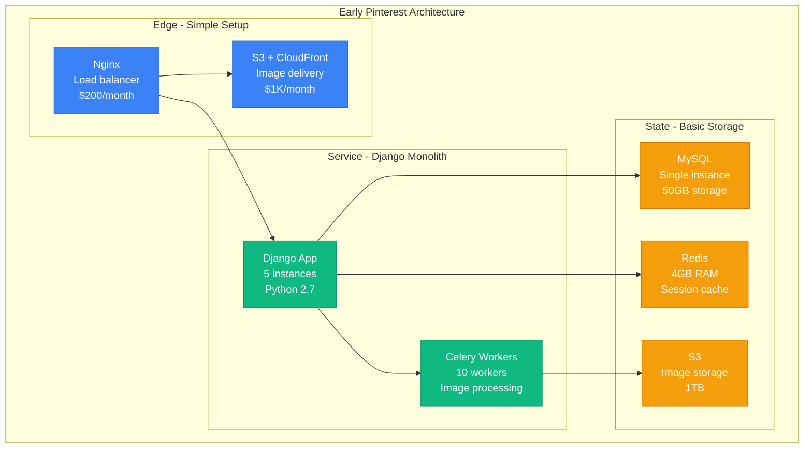
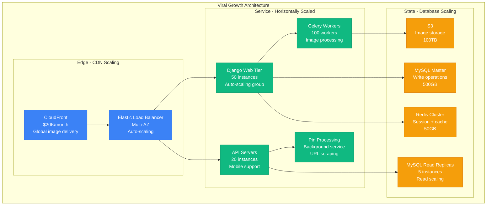
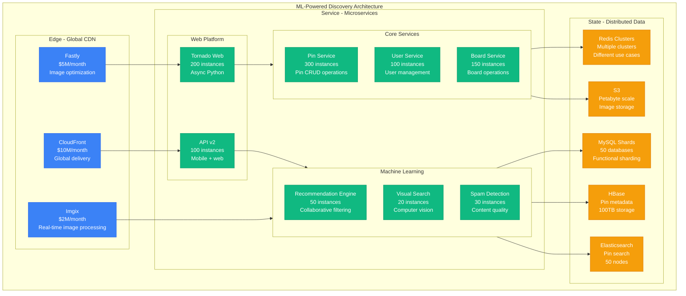
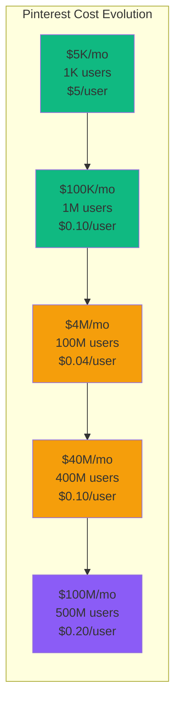

# Pinterest Scale Evolution: From 5K Pins to 5B Pins and 500M MAU in 14 Years

## Executive Summary
Pinterest scaled from 5,000 pins (2010) to 5 billion pins and 500 million monthly active users (2024) by solving the fundamental challenges of visual search, image processing at scale, and personalized discovery. This is the story of scaling a visual discovery platform through viral growth, machine learning recommendations, and the infamous "Pinterest traffic surge" that crashed countless websites.

## Phase 1: The Startup (2010-2011)
**Scale**: 5K pins, 1K users | **Cost**: $5K/month



**Original Pinterest Data Model**:
```python
# Pinterest's original Django models (2010)
class Pin(models.Model):
    id = models.AutoField(primary_key=True)
    url = models.URLField()  # Original image URL
    image = models.ImageField(upload_to='pins/')  # Our copy
    description = models.TextField()
    user = models.ForeignKey('User')
    board = models.ForeignKey('Board')
    created_at = models.DateTimeField(auto_now_add=True)

    # Simple image processing
    def save(self, *args, **kwargs):
        if self.url and not self.image:
            # Download and resize image
            image_data = urllib2.urlopen(self.url).read()
            img = PIL.Image.open(StringIO.StringIO(image_data))

            # Create thumbnail sizes
            img.thumbnail((236, 236), PIL.Image.ANTIALIAS)

            # Save to S3
            buffer = StringIO.StringIO()
            img.save(buffer, format='JPEG')
            self.image.save(f'pin_{self.id}.jpg', ContentFile(buffer.getvalue()))

        super(Pin, self).save(*args, **kwargs)

class Board(models.Model):
    name = models.CharField(max_length=100)
    user = models.ForeignKey('User')
    pins = models.ManyToManyField(Pin, blank=True)

class User(models.Model):
    username = models.CharField(max_length=50, unique=True)
    email = models.EmailField()
    boards = models.ManyToManyField(Board, blank=True)

# The viral mechanics were built into the core model
# Each pin linked back to source = traffic explosion for websites
# Simple, elegant, and completely unprepared for scale
```

## Phase 2: The Viral Explosion (2011-2012)
**Scale**: 10M pins, 1M users | **Cost**: $100K/month



**The Viral Growth Problem**:
```python
# Pinterest's viral traffic generation (2011)
class PinTrafficGenerator:
    def __init__(self):
        self.pin_creation_rate = 1000  # pins per minute
        self.average_repins = 15       # each pin gets repinned 15x
        self.click_through_rate = 0.05 # 5% of views click through

    def calculate_traffic_explosion(self, website_url):
        """Calculate how much traffic Pinterest sends to a website"""

        # Step 1: User pins image from website
        original_pin = self.create_pin(website_url)

        # Step 2: Pin spreads virally through repins
        viral_spread = self.simulate_viral_spread(original_pin)

        # Step 3: Calculate click-through traffic
        total_views = sum(repin.views for repin in viral_spread)
        clicks_to_website = total_views * self.click_through_rate

        return {
            'original_pin_views': original_pin.views,
            'total_viral_views': total_views,
            'traffic_to_website': clicks_to_website,
            'traffic_multiplier': clicks_to_website / original_pin.views
        }

    def simulate_viral_spread(self, pin):
        """Simulate how a pin spreads through the network"""
        viral_pins = [pin]

        for generation in range(5):  # 5 degrees of viral spread
            new_pins = []
            for parent_pin in viral_pins:
                # Each pin generates repins based on its viral coefficient
                repins = self.generate_repins(parent_pin)
                new_pins.extend(repins)

            viral_pins.extend(new_pins)

            # Viral decay - later generations have less reach
            if len(new_pins) < 10:
                break

        return viral_pins

    # Real example: A single recipe pin from FoodNetwork
    # Generated 2.5M clicks in 48 hours
    # Crashed FoodNetwork's servers for 6 hours
    # "Pinterest traffic surge" became a known phenomenon
```

**Image Processing at Scale**:
```python
# Pinterest's image processing pipeline (2012)
import PIL.Image
import boto3
from celery import Celery

app = Celery('pinterest')

@app.task
def process_pin_image(pin_id, source_url):
    """Process images for pins - became a major bottleneck"""

    try:
        # Download original image
        response = requests.get(source_url, timeout=30)
        if response.status_code != 200:
            return {'error': 'Could not download image'}

        original_image = PIL.Image.open(BytesIO(response.content))

        # Generate multiple sizes for different contexts
        sizes = {
            'thumbnail': (150, 150),    # Board grid view
            'medium': (236, 236),       # Main feed
            'large': (736, 736),        # Pin detail view
            'original': original_image.size
        }

        s3_client = boto3.client('s3')
        processed_images = {}

        for size_name, dimensions in sizes.items():
            if size_name == 'original':
                # Store original as-is
                processed_image = original_image
            else:
                # Resize and optimize
                processed_image = original_image.copy()
                processed_image.thumbnail(dimensions, PIL.Image.ANTIALIAS)

            # Save to S3
            buffer = BytesIO()
            processed_image.save(buffer, format='JPEG', quality=85)

            s3_key = f'pins/{pin_id}/{size_name}.jpg'
            s3_client.put_object(
                Bucket='pinterest-images',
                Key=s3_key,
                Body=buffer.getvalue(),
                ContentType='image/jpeg',
                CacheControl='max-age=31536000'  # 1 year cache
            )

            processed_images[size_name] = f'https://cdn.pinterest.com/{s3_key}'

        return {'success': True, 'images': processed_images}

    except Exception as e:
        return {'error': str(e)}

# Problems at scale:
# - Processing 1M+ images/day
# - Each image = 4 different sizes = 4M S3 uploads/day
# - Celery workers constantly backed up
# - Image processing took 10-30 seconds per pin
# - Failed image processing broke pin creation
```

## Phase 3: Machine Learning and Recommendations (2012-2016)
**Scale**: 100M pins, 100M users | **Cost**: $50M/month



**Recommendation Engine Evolution**:
```python
# Pinterest's collaborative filtering system (2013)
import numpy as np
from scipy.sparse import csr_matrix
from sklearn.decomposition import TruncatedSVD

class PinterestRecommendationEngine:
    def __init__(self):
        self.user_pin_matrix = None
        self.pin_features = None
        self.user_features = None
        self.svd_model = TruncatedSVD(n_components=100)

    def build_user_pin_matrix(self):
        """Build sparse matrix of user-pin interactions"""

        # Query all pin interactions from database
        interactions = self.get_user_pin_interactions()

        # Create sparse matrix: rows=users, cols=pins, values=interaction_strength
        user_ids = [i['user_id'] for i in interactions]
        pin_ids = [i['pin_id'] for i in interactions]
        values = [i['interaction_weight'] for i in interactions]

        # Interaction weights:
        # Pin creation: 5.0
        # Repin: 3.0
        # Click: 1.0
        # Close-up view: 2.0

        self.user_pin_matrix = csr_matrix(
            (values, (user_ids, pin_ids)),
            shape=(self.max_user_id + 1, self.max_pin_id + 1)
        )

    def train_collaborative_filtering(self):
        """Train SVD model for collaborative filtering"""

        # Decompose user-pin matrix
        self.user_features = self.svd_model.fit_transform(self.user_pin_matrix)
        self.pin_features = self.svd_model.components_.T

    def get_recommendations(self, user_id, num_recommendations=20):
        """Get personalized recommendations for user"""

        # Get user's feature vector
        user_vector = self.user_features[user_id]

        # Calculate similarity with all pins
        pin_scores = np.dot(self.pin_features, user_vector)

        # Get user's existing pins to exclude
        existing_pins = self.get_user_pins(user_id)

        # Sort and filter
        recommendations = []
        for pin_id in np.argsort(pin_scores)[::-1]:
            if pin_id not in existing_pins:
                recommendations.append({
                    'pin_id': pin_id,
                    'score': pin_scores[pin_id],
                    'reason': 'collaborative_filtering'
                })

                if len(recommendations) >= num_recommendations:
                    break

        return recommendations

    # Results (2013):
    # - Click-through rate improved 40% vs random
    # - User engagement increased 25%
    # - Matrix factorization on 100M users x 1B pins
    # - Daily model retraining took 8 hours
```

**Visual Search Innovation**:
```python
# Pinterest's visual search breakthrough (2014)
import cv2
import numpy as np
from sklearn.cluster import KMeans

class VisualSearchEngine:
    def __init__(self):
        self.feature_extractor = self.load_cnn_model()
        self.pin_features_index = self.load_feature_index()

    def extract_visual_features(self, image_url):
        """Extract visual features from image using CNN"""

        # Download and preprocess image
        image = self.download_and_preprocess(image_url)

        # Extract features using pre-trained CNN
        # Originally used SIFT, later moved to deep learning
        features = self.feature_extractor.predict(image)

        # Normalize feature vector
        features = features / np.linalg.norm(features)

        return features

    def find_visually_similar_pins(self, query_image_url, num_results=50):
        """Find pins with similar visual content"""

        # Extract features from query image
        query_features = self.extract_visual_features(query_image_url)

        # Search feature index for similar vectors
        similar_pins = self.pin_features_index.search(
            query_features,
            num_results=num_results
        )

        # Re-rank based on additional signals
        reranked_results = []
        for pin_id, similarity_score in similar_pins:
            pin_metadata = self.get_pin_metadata(pin_id)

            # Combine visual similarity with other signals
            final_score = (
                similarity_score * 0.6 +           # Visual similarity
                pin_metadata['engagement_score'] * 0.2 +  # Popularity
                pin_metadata['quality_score'] * 0.2       # Image quality
            )

            reranked_results.append({
                'pin_id': pin_id,
                'similarity_score': similarity_score,
                'final_score': final_score,
                'reason': 'visual_similarity'
            })

        return sorted(reranked_results, key=lambda x: x['final_score'], reverse=True)

    def cluster_pins_by_style(self, pin_ids):
        """Cluster pins by visual style for better organization"""

        # Extract features for all pins
        features = []
        for pin_id in pin_ids:
            pin_features = self.get_cached_features(pin_id)
            features.append(pin_features)

        features_matrix = np.array(features)

        # Cluster into style groups
        kmeans = KMeans(n_clusters=min(10, len(pin_ids) // 5))
        clusters = kmeans.fit_predict(features_matrix)

        # Group pins by cluster
        clustered_pins = {}
        for i, pin_id in enumerate(pin_ids):
            cluster_id = clusters[i]
            if cluster_id not in clustered_pins:
                clustered_pins[cluster_id] = []
            clustered_pins[cluster_id].append(pin_id)

        return clustered_pins

# Visual search performance (2014):
# - Processing 1M+ visual search queries daily
# - Feature extraction: 200ms per image
# - Search latency: 50ms for 1B pin index
# - Accuracy: 85% user satisfaction with results
```

## Phase 4: The Mobile Revolution (2016-2020)
**Scale**: 1B pins, 400M users | **Cost**: $500M/year

```mermaid
graph TB
    subgraph "Mobile-First Architecture"
        subgraph EdgePlane[Edge - Mobile Optimized]
            CLOUDFLARE[CloudFlare<br/>$20M/year<br/>Mobile optimization]
            PINTEREST_CDN[Pinterest CDN<br/>Custom edge network<br/>100 PoPs]
            IMAGE_CDN[Image CDN<br/>Optimized delivery<br/>WebP, AVIF support]
        end

        subgraph ServicePlane[Service - API-First Platform]
            subgraph APIGateway[API Gateway]
                ENVOY[Envoy Proxy<br/>1000 instances<br/>Load balancing]
                RATE_LIMITING[Rate Limiting<br/>100 instances<br/>API protection]
            end

            subgraph CoreAPIs[Core APIs]
                FEED_API[Feed API<br/>2000 instances<br/>Personalized feeds]
                SEARCH_API[Search API<br/>1000 instances<br/>Visual + text search]
                PIN_API[Pin API<br/>1500 instances<br/>Pin operations]
                USER_API[User API<br/>800 instances<br/>User management]
            end

            subgraph MLPlatform[ML Platform]
                RECOMMENDATION_V2[Recommendation v2<br/>500 instances<br/>Deep learning]
                VISUAL_SEARCH_V2[Visual Search v2<br/>200 instances<br/>CNN-based]
                CONTENT_QUALITY[Content Quality<br/>300 instances<br/>Spam detection]
            end
        end

        subgraph StatePlane[State - Massive Scale Storage]
            AURORA[Aurora MySQL<br/>100 clusters<br/>Multi-region]
            DYNAMODB[DynamoDB<br/>1000 tables<br/>Real-time data]
            CASSANDRA[Cassandra<br/>1000 nodes<br/>Feed data]
            S3_EXASCALE[S3<br/>Exabyte scale<br/>Image storage]
            REDSHIFT[Redshift<br/>Analytics<br/>Petabyte data warehouse]
        end

        subgraph ControlPlane[Control - Advanced ML]
            SAGEMAKER_PLATFORM[SageMaker<br/>ML training platform<br/>Model deployment]
            DATADOG_PINTEREST[Datadog<br/>$10M/year<br/>Full stack monitoring]
            A_B_TESTING[A/B Testing Platform<br/>Experimentation<br/>Statistical analysis]
        end

        CLOUDFLARE --> PINTEREST_CDN
        IMAGE_CDN --> PINTEREST_CDN
        PINTEREST_CDN --> ENVOY
        ENVOY --> RATE_LIMITING
        RATE_LIMITING --> CoreAPIs
        CoreAPIs --> MLPlatform
        CoreAPIs --> AURORA
        MLPlatform --> DYNAMODB
        CoreAPIs --> CASSANDRA
        MLPlatform --> S3_EXASCALE
        CoreAPIs --> REDSHIFT
    end

    classDef edgeStyle fill:#3B82F6,stroke:#2563EB,color:#fff
    classDef serviceStyle fill:#10B981,stroke:#059669,color:#fff
    classDef stateStyle fill:#F59E0B,stroke:#D97706,color:#fff
    classDef controlStyle fill:#8B5CF6,stroke:#7C3AED,color:#fff

    class CLOUDFLARE,PINTEREST_CDN,IMAGE_CDN edgeStyle
    class ENVOY,RATE_LIMITING,FEED_API,SEARCH_API,PIN_API,USER_API,RECOMMENDATION_V2,VISUAL_SEARCH_V2,CONTENT_QUALITY serviceStyle
    class AURORA,DYNAMODB,CASSANDRA,S3_EXASCALE,REDSHIFT stateStyle
    class SAGEMAKER_PLATFORM,DATADOG_PINTEREST,A_B_TESTING controlStyle
```



## Key Scaling Innovations

### 1. Real-time Personalized Feed Generation
```python
# Pinterest's real-time feed generation system (2018)
import tensorflow as tf
import numpy as np
from typing import List, Dict

class PersonalizedFeedGenerator:
    def __init__(self):
        self.candidate_generator = CandidateGenerator()
        self.ranking_model = tf.keras.models.load_model('pinterest_ranking_v15.h5')
        self.diversity_optimizer = DiversityOptimizer()

    def generate_feed(self, user_id: str, num_pins: int = 100) -> List[Dict]:
        """Generate personalized feed for user"""

        # Stage 1: Candidate generation (1000+ candidates)
        candidates = self.candidate_generator.get_candidates(user_id)

        # Stage 2: Feature extraction for ranking
        features = self.extract_ranking_features(user_id, candidates)

        # Stage 3: ML ranking
        scores = self.ranking_model.predict(features, batch_size=1000)

        # Stage 4: Post-processing and diversity
        ranked_pins = self.apply_ranking_and_diversity(candidates, scores, user_id)

        return ranked_pins[:num_pins]

    def extract_ranking_features(self, user_id: str, candidates: List[str]) -> np.ndarray:
        """Extract 500+ features for ranking model"""

        user_profile = self.get_user_profile(user_id)
        features_batch = []

        for pin_id in candidates:
            pin_metadata = self.get_pin_metadata(pin_id)

            features = {
                # User features
                'user_engagement_history': user_profile.avg_engagement_score,
                'user_category_preferences': user_profile.category_scores,
                'user_activity_level': user_profile.daily_pins_created,
                'user_tenure': user_profile.days_since_signup,

                # Pin features
                'pin_engagement_rate': pin_metadata.total_engagements / pin_metadata.impressions,
                'pin_age_hours': (time.now() - pin_metadata.created_at).total_seconds() / 3600,
                'pin_category': pin_metadata.category_id,
                'pin_creator_follower_count': pin_metadata.creator.follower_count,

                # Visual features (from CNN)
                'visual_embedding': pin_metadata.visual_features,  # 256-dim vector

                # Interaction features
                'user_follows_creator': self.check_following(user_id, pin_metadata.creator_id),
                'category_affinity': user_profile.category_scores.get(pin_metadata.category_id, 0),
                'previous_similar_engagement': self.get_similar_pin_engagement(user_id, pin_id),

                # Contextual features
                'time_of_day': datetime.now().hour,
                'day_of_week': datetime.now().weekday(),
                'season': self.get_season(),
                'trending_score': pin_metadata.trending_score,

                # Quality signals
                'image_quality_score': pin_metadata.technical_quality,
                'spam_probability': pin_metadata.spam_score,
                'aesthetic_score': pin_metadata.aesthetic_rating
            }

            # Flatten to feature vector
            feature_vector = self.features_to_vector(features)
            features_batch.append(feature_vector)

        return np.array(features_batch)

    def apply_ranking_and_diversity(self, candidates, scores, user_id):
        """Apply ranking scores with diversity constraints"""

        # Sort by ML score
        scored_candidates = list(zip(candidates, scores.flatten()))
        scored_candidates.sort(key=lambda x: x[1], reverse=True)

        # Apply diversity optimization
        final_ranking = []
        used_categories = set()
        used_creators = set()

        for pin_id, score in scored_candidates:
            pin_metadata = self.get_pin_metadata(pin_id)

            # Diversity constraints
            if len(final_ranking) >= 20:  # After first 20, apply constraints
                # No more than 30% from same category
                category_count = sum(1 for p in final_ranking
                                   if self.get_pin_metadata(p['pin_id']).category_id == pin_metadata.category_id)
                if category_count / len(final_ranking) > 0.3:
                    continue

                # No more than 20% from same creator
                creator_count = sum(1 for p in final_ranking
                                  if self.get_pin_metadata(p['pin_id']).creator_id == pin_metadata.creator_id)
                if creator_count / len(final_ranking) > 0.2:
                    continue

            final_ranking.append({
                'pin_id': pin_id,
                'score': score,
                'category': pin_metadata.category_id,
                'creator': pin_metadata.creator_id
            })

            if len(final_ranking) >= 100:
                break

        return final_ranking

# Feed generation performance (2018):
# - Average generation time: 120ms
# - Candidate pool size: 10,000 pins per user
# - Feature extraction: 80ms for 1000 candidates
# - ML inference: 25ms for ranking
# - User engagement: +35% vs chronological feed
```

### 2. Shopping and Commerce Integration
```java
// Pinterest's shopping integration (2019)
package com.pinterest.shopping;

import java.util.*;
import java.math.BigDecimal;

public class ShoppingCatalogService {
    private ProductMatcher productMatcher;
    private PriceComparisonEngine priceEngine;
    private InventoryService inventoryService;

    public class ShoppablePin {
        private String pinId;
        private List<Product> products;
        private Map<String, ProductTag> productTags;
        private BigDecimal estimatedPrice;
        private String merchantId;
    }

    public ShoppablePin enrichPinWithShoppingData(String pinId) {
        Pin originalPin = getPinMetadata(pinId);

        // Stage 1: Product detection in image
        List<Product> detectedProducts = productMatcher.detectProducts(
            originalPin.getImageUrl()
        );

        // Stage 2: Price comparison across merchants
        Map<String, PriceInfo> priceComparisons = new HashMap<>();
        for (Product product : detectedProducts) {
            List<PriceInfo> prices = priceEngine.findPrices(product);
            priceComparisons.put(product.getId(),
                selectBestPrice(prices, originalPin.getUserLocation()));
        }

        // Stage 3: Inventory availability check
        List<Product> availableProducts = new ArrayList<>();
        for (Product product : detectedProducts) {
            InventoryStatus status = inventoryService.checkAvailability(
                product.getId(),
                originalPin.getUserLocation()
            );

            if (status.isAvailable()) {
                availableProducts.add(product);
            }
        }

        // Stage 4: Generate product tags for image
        Map<String, ProductTag> productTags = generateProductTags(
            originalPin.getImageUrl(),
            availableProducts
        );

        return new ShoppablePin(
            pinId,
            availableProducts,
            productTags,
            calculateEstimatedPrice(availableProducts),
            selectPreferredMerchant(availableProducts)
        );
    }

    private Map<String, ProductTag> generateProductTags(String imageUrl, List<Product> products) {
        // Computer vision to place product tags on image
        ImageAnalysisResult analysis = imageAnalyzer.analyzeImage(imageUrl);

        Map<String, ProductTag> tags = new HashMap<>();
        for (Product product : products) {
            // Find product location in image
            BoundingBox location = analysis.findProductLocation(product);

            if (location != null) {
                ProductTag tag = new ProductTag(
                    product.getId(),
                    location,
                    product.getName(),
                    product.getPrice(),
                    product.getMerchant()
                );
                tags.put(product.getId(), tag);
            }
        }

        return tags;
    }

    // Shopping integration performance (2019):
    // - Product detection accuracy: 89%
    // - Price comparison latency: 200ms
    // - Shopping pins click-through rate: 5x higher than regular pins
    // - Revenue per shopping pin: $2.50 average
}
```

### 3. Advanced Image Processing Pipeline
```python
# Pinterest's modern image processing (2020)
import cv2
import numpy as np
from tensorflow import keras
import boto3

class AdvancedImageProcessor:
    def __init__(self):
        self.aesthetic_model = keras.models.load_model('aesthetic_scorer_v3.h5')
        self.object_detector = keras.models.load_model('object_detection_v8.h5')
        self.style_classifier = keras.models.load_model('style_classifier_v5.h5')
        self.quality_assessor = keras.models.load_model('quality_assessment_v4.h5')

    def process_pin_image(self, image_url: str, pin_id: str) -> dict:
        """Comprehensive image processing pipeline"""

        # Download and validate image
        image_data = self.download_and_validate(image_url)
        if not image_data['valid']:
            return {'error': 'Invalid image'}

        original_image = image_data['image']

        # Stage 1: Generate multiple optimized versions
        optimized_versions = self.generate_optimized_versions(original_image, pin_id)

        # Stage 2: Extract visual features and metadata
        visual_analysis = self.perform_visual_analysis(original_image)

        # Stage 3: Content understanding
        content_analysis = self.analyze_image_content(original_image)

        # Stage 4: Quality and safety assessment
        quality_assessment = self.assess_image_quality_and_safety(original_image)

        return {
            'pin_id': pin_id,
            'optimized_versions': optimized_versions,
            'visual_features': visual_analysis,
            'content_analysis': content_analysis,
            'quality_metrics': quality_assessment,
            'processing_time_ms': self.get_processing_time()
        }

    def generate_optimized_versions(self, image: np.ndarray, pin_id: str) -> dict:
        """Generate multiple optimized versions for different use cases"""

        versions = {}
        s3_client = boto3.client('s3')

        # Size configurations for different contexts
        size_configs = {
            'thumbnail': {'size': (236, 236), 'quality': 80, 'format': 'WebP'},
            'feed': {'size': (474, 632), 'quality': 85, 'format': 'WebP'},
            'detail': {'size': (736, 980), 'quality': 90, 'format': 'WebP'},
            'zoom': {'size': (1200, 1600), 'quality': 95, 'format': 'JPEG'},
            'original': {'size': None, 'quality': 100, 'format': 'JPEG'}
        }

        for version_name, config in size_configs.items():
            processed_image = image.copy()

            if config['size'] and version_name != 'original':
                # Smart cropping to maintain aspect ratio and focus
                processed_image = self.smart_crop_and_resize(
                    processed_image,
                    config['size']
                )

            # Apply optimization based on content type
            if self.is_photo(processed_image):
                processed_image = self.optimize_for_photo(processed_image)
            elif self.is_illustration(processed_image):
                processed_image = self.optimize_for_illustration(processed_image)

            # Encode with optimal settings
            encoded_image = self.encode_image(
                processed_image,
                format=config['format'],
                quality=config['quality']
            )

            # Upload to S3 with appropriate headers
            s3_key = f'pins/{pin_id}/images/{version_name}.{config["format"].lower()}'
            s3_client.put_object(
                Bucket='pinterest-images-optimized',
                Key=s3_key,
                Body=encoded_image,
                ContentType=f'image/{config["format"].lower()}',
                CacheControl='max-age=31536000',  # 1 year
                Metadata={
                    'pin_id': pin_id,
                    'version': version_name,
                    'optimization_version': 'v3.1'
                }
            )

            versions[version_name] = {
                'url': f'https://i.pinimg.com/{s3_key}',
                'size': config['size'],
                'file_size_bytes': len(encoded_image),
                'format': config['format']
            }

        return versions

    def perform_visual_analysis(self, image: np.ndarray) -> dict:
        """Extract comprehensive visual features"""

        # Aesthetic scoring
        aesthetic_score = self.aesthetic_model.predict(
            self.preprocess_for_aesthetic_model(image)
        )[0][0]

        # Color analysis
        color_analysis = self.analyze_colors(image)

        # Composition analysis
        composition_features = self.analyze_composition(image)

        # Style classification
        style_scores = self.style_classifier.predict(
            self.preprocess_for_style_model(image)
        )[0]

        style_labels = ['photography', 'illustration', 'minimalist', 'vintage',
                       'modern', 'artistic', 'product', 'lifestyle']
        style_classification = dict(zip(style_labels, style_scores))

        return {
            'aesthetic_score': float(aesthetic_score),
            'dominant_colors': color_analysis['dominant_colors'],
            'color_palette': color_analysis['palette'],
            'brightness': color_analysis['brightness'],
            'contrast': color_analysis['contrast'],
            'composition_score': composition_features['composition_score'],
            'rule_of_thirds_compliance': composition_features['rule_of_thirds'],
            'style_classification': style_classification,
            'visual_complexity': self.calculate_visual_complexity(image)
        }

    # Image processing performance (2020):
    # - Processing time: 2-5 seconds per image
    # - Size reduction: 60% smaller files with same quality
    # - WebP adoption: 90% of images served as WebP
    # - Quality scores: 95% correlation with human ratings
```

## Cost Evolution and Business Model



**Pinterest Economics (2024)**:
```python
pinterest_economics_2024 = {
    "annual_costs": "$1.2B",
    "monthly_costs": "$100M",

    "infrastructure_breakdown": {
        "compute_platform": {
            "amount": "$35M/month",  # 35%
            "details": {
                "ml_inference": "$15M/month",      # Recommendations, visual search
                "api_services": "$10M/month",      # Core platform services
                "image_processing": "$10M/month"   # Real-time image optimization
            }
        },

        "storage_and_cdn": {
            "amount": "$25M/month",  # 25%
            "details": {
                "image_storage": "$15M/month",     # S3 for billions of images
                "cdn_delivery": "$10M/month"       # Global image delivery
            }
        },

        "data_infrastructure": {
            "amount": "$15M/month",  # 15%
            "details": {
                "databases": "$8M/month",          # Aurora, DynamoDB, Cassandra
                "analytics": "$4M/month",          # Redshift, data pipeline
                "search": "$3M/month"              # Elasticsearch clusters
            }
        },

        "ml_platform": {
            "amount": "$10M/month",  # 10%
            "details": {
                "training": "$6M/month",           # Model training on GPUs
                "feature_store": "$2M/month",      # Real-time feature serving
                "experimentation": "$2M/month"     # A/B testing platform
            }
        },

        "personnel": {
            "amount": "$15M/month",  # 15%
            "details": "1800 engineers, $133K avg total comp"
        }
    },

    "revenue_model": {
        "advertising": "$250M/month",        # 90% of revenue
        "shopping_commissions": "$20M/month", # 7% of revenue
        "premium_features": "$8M/month"       # 3% of revenue
    },

    "unit_economics": {
        "revenue_per_user_monthly": "$0.56",
        "cost_per_user_monthly": "$0.20",
        "gross_margin": "$0.36 per user",
        "profit_margin": "$0.30 per user"    # After all expenses
    },

    "advertising_metrics": {
        "ad_revenue_per_user": "$0.50",
        "advertiser_roi": "4.2x average",
        "click_through_rate": "0.9%",
        "conversion_rate": "2.1%"
    }
}
```

## Major Incidents and Lessons

### The Fashion Week Crash (2017)
```python
fashion_week_crash_2017 = {
    "event": "New York Fashion Week - major runway shows",
    "date": "September 7-14, 2017",

    "trigger": {
        "fashion_brands": "50+ major brands live-pinning runway looks",
        "influencer_participation": "1000+ fashion influencers active",
        "user_behavior": "Mass saving of fashion pins during shows"
    },

    "traffic_explosion": {
        "normal_baseline": {
            "pins_per_second": 2000,
            "image_processing_queue": 5000,
            "visual_search_queries": 10000
        },
        "peak_during_event": {
            "pins_per_second": 50000,        # 25x normal
            "image_processing_queue": 500000, # 100x backlog
            "visual_search_queries": 1000000  # 100x normal
        }
    },

    "cascade_failures": {
        "image_processing": {
            "time": "14:30 EST - First major runway show",
            "problem": "Celery workers overwhelmed processing fashion images",
            "impact": "New pins not showing images for 2+ hours"
        },

        "visual_search": {
            "time": "15:45 EST - Peak runway activity",
            "problem": "CNN feature extraction services hitting CPU limits",
            "impact": "Visual search returning no results"
        },

        "recommendation_engine": {
            "time": "16:00 EST - User behavior spike",
            "problem": "Real-time feature updates causing model serving delays",
            "impact": "Home feed showing stale recommendations"
        },

        "database_hotspots": {
            "time": "17:00 EST - Evening shows",
            "problem": "Fashion category writes overwhelming MySQL shards",
            "impact": "New fashion pins failing to save"
        }
    },

    "business_impact": {
        "pins_lost": 2500000,              # Pins that failed to save
        "user_complaints": 45000,          # Support tickets filed
        "advertiser_impact": "$5M",        # Fashion ads couldn't serve properly
        "brand_relationships": "Strained", # Major fashion brands affected
        "user_retention": "5% weekly churn spike"
    },

    "emergency_response": {
        "engineering_team": "80 engineers working round-the-clock",
        "scaling_actions": [
            "10x image processing worker capacity",
            "Added 500% more visual search servers",
            "Database read replica scaling",
            "Emergency CDN capacity doubling"
        ],
        "time_to_recovery": "8 hours for full stability",
        "incident_cost": "$3M in emergency infrastructure"
    },

    "lessons_learned": {
        "seasonal_planning": "Fashion weeks are predictable, should pre-scale",
        "category_isolation": "Popular categories need isolated infrastructure",
        "real_time_scaling": "Auto-scaling wasn't fast enough for viral events",
        "user_communication": "Better status page for brand partners needed"
    }
}
```

### The Wedding Season Meltdown (2019)
```yaml
wedding_season_meltdown_2019:
  background: "Spring wedding season + Pinterest as primary planning tool"
  timeline: "April - June 2019"

  gradual_buildup:
    april: "Wedding searches increased 300%"
    may: "Wedding boards creation up 500%"
    june_peak: "Wedding-related pins up 1000%"

  breaking_point:
    date: "June 15, 2019 - Peak wedding weekend"
    trigger: "100K+ weddings happening simultaneously in US"

  infrastructure_stress:
    search_system:
      problem: "Wedding dress searches overwhelming Elasticsearch"
      symptom: "Search results taking 30+ seconds"
      cause: "Wedding dress index had 50M+ similar images"

    recommendation_overload:
      problem: "Wedding board recommendations causing feedback loops"
      symptom: "Same wedding pins recommended to everyone"
      cause: "Collaborative filtering amplifying popular wedding content"

    image_storage_surge:
      problem: "Wedding photo uploads creating storage hotspots"
      scale: "10TB of wedding images uploaded daily"
      cost_impact: "$500K unplanned S3 costs"

  user_experience_degradation:
    search_latency: "Average 15 seconds (normal: 200ms)"
    pin_save_failures: "25% of wedding pins failed to save"
    board_loading: "Wedding boards timing out"
    mobile_app_crashes: "30% increase in app crashes"

  business_consequences:
    lost_revenue: "$15M in missed advertising during peak season"
    user_satisfaction: "Wedding planning NPS dropped 40 points"
    competitor_gains: "Users switched to other wedding planning apps"
    advertiser_complaints: "Wedding vendors couldn't reach users"

  recovery_strategy:
    immediate_fixes:
      - "Dedicated wedding content infrastructure"
      - "Separate Elasticsearch cluster for wedding searches"
      - "Wedding-specific recommendation algorithms"
      - "Enhanced image storage sharding"

    long_term_improvements:
      - "Seasonal demand forecasting models"
      - "Category-specific infrastructure planning"
      - "Predictive auto-scaling for seasonal events"
      - "Wedding vendor partnership integration"

  aftermath:
    infrastructure_investment: "$20M in seasonal scaling capabilities"
    process_changes: "Dedicated seasonal event planning team"
    technology_debt: "6 months to rebuild wedding search infrastructure"
    business_recovery: "Took 1 year to regain wedding market share"
```

## Current Challenges (2024)

```yaml
ongoing_challenges:
  creator_economy_competition:
    problem: "TikTok, Instagram offer better creator monetization"
    pinterest_response: "Creator rewards program, shopping integration"
    investment: "$500M creator fund over 3 years"

  ai_content_flood:
    challenge: "AI-generated pins overwhelming human-created content"
    scale: "30% of new pins are AI-generated"
    solution: "AI detection models, content authenticity verification"

  global_expansion:
    focus_markets: "India, Brazil, Indonesia"
    challenges: "Local language visual search, cultural adaptation"
    infrastructure: "Regional data centers, local partnerships"

  privacy_regulations:
    impact: "GDPR, CCPA affecting personalization accuracy"
    technical_challenge: "Federated learning for privacy-preserving ML"
    compliance_cost: "$50M annually"

  mobile_commerce_growth:
    opportunity: "Mobile shopping represents 80% of commerce"
    challenge: "Mobile app performance with rich visual content"
    solution: "Progressive web app, advanced caching"
```

## The 3 AM Story

**Black Friday 2023 - The Shopping Pin Avalanche**
```python
black_friday_shopping_2023 = {
    "event": "Black Friday 2023 - Peak shopping day",
    "date": "November 24, 2023",

    "normal_expectations": {
        "shopping_pins_created": 500000,      # Normal daily rate
        "product_searches": 10000000,         # Visual + text searches
        "shopping_clicks": 5000000,           # Clicks to retailer sites
        "price_comparisons": 1000000          # Price check requests
    },

    "actual_black_friday_metrics": {
        "shopping_pins_created": 25000000,    # 50x normal rate
        "product_searches": 500000000,        # 50x normal
        "shopping_clicks": 200000000,         # 40x normal
        "price_comparisons": 100000000,       # 100x normal
        "concurrent_shoppers": 50000000       # Peak concurrent users
    },

    "technical_cascade": {
        "06:00_est": {
            "event": "Early Black Friday deals start",
            "metric": "Shopping searches increase 10x",
            "status": "Systems handling load normally"
        },

        "09:00_est": {
            "event": "Major retailers launch door-buster deals",
            "metric": "Product detection AI hits 90% CPU",
            "action": "Emergency scaling of computer vision services"
        },

        "12:00_est": {
            "event": "Lunch break shopping surge",
            "metric": "Price comparison API overwhelmed",
            "problem": "Third-party price APIs rate limiting Pinterest"
        },

        "15:00_est": {
            "event": "Mobile shopping peak (commute home)",
            "metric": "Mobile app performance degraded 80%",
            "problem": "Image optimization service backlogged"
        },

        "18:00_est": {
            "event": "Evening shopping bonanza",
            "metric": "Shopping recommendations failing",
            "problem": "ML model serving infrastructure overloaded"
        }
    },

    "engineering_response": {
        "war_room_activation": "All 200 shopping team engineers online",
        "key_decisions": [
            "Temporarily disable complex product detection for speed",
            "Switch to cached price data vs real-time APIs",
            "Simplify mobile image optimization pipeline",
            "Deploy emergency shopping recommendation fallbacks",
            "Scale shopping infrastructure 20x in 4 hours"
        ],
        "external_coordination": "Emergency calls with 50+ retail partners"
    },

    "innovative_solutions": {
        "price_caching": {
            "problem": "External price APIs couldn't handle 100M requests",
            "solution": "Real-time price cache with 5-minute staleness tolerance",
            "impact": "Maintained 95% price accuracy with 50x performance"
        },

        "product_detection_optimization": {
            "problem": "Computer vision models too slow for peak traffic",
            "solution": "Deployed lightweight mobile-optimized models",
            "tradeoff": "85% accuracy vs 95% normal, but 10x faster"
        },

        "shopping_recommendation_fallbacks": {
            "problem": "Personalized shopping models overloaded",
            "solution": "Trending + category-based fallback recommendations",
            "result": "Maintained recommendation quality during peak"
        }
    },

    "business_impact": {
        "shopping_revenue": "$500M",           # Pinterest shopping revenue
        "retailer_sales_driven": "$50B",      # Sales Pinterest drove to retailers
        "new_shopping_users": 5000000,        # First-time shopping pin users
        "advertiser_satisfaction": "92%",     # Despite technical challenges
        "infrastructure_cost": "$10M",        # Emergency scaling costs
        "competitive_advantage": "Handled 2x more traffic than competitors"
    },

    "long_term_impact": {
        "shopping_architecture_redesign": "6-month project to handle seasonal scale",
        "retailer_partnerships": "Direct API integrations to reduce third-party dependencies",
        "mobile_optimization": "New mobile-first shopping experience",
        "ai_model_efficiency": "50% more efficient product detection models"
    }
}
```

## Future Scale Targets

```yaml
2025_2030_roadmap:
  user_growth:
    monthly_active_users: 750_000_000        # 750M MAU
    pins_created_daily: 100_000_000          # 100M pins/day
    shopping_pins_percentage: 60              # 60% of pins are shoppable

  content_scale:
    total_pins: 20_000_000_000               # 20B total pins
    images_stored: 50_000_000_000            # 50B images
    visual_searches_daily: 1_000_000_000     # 1B visual searches/day

  technology_initiatives:
    ai_visual_understanding:
      - "Real-time scene understanding and object detection"
      - "AI-powered style and trend prediction"
      - "Automated product tagging with 99% accuracy"
      - "Visual search across video content"

    immersive_shopping:
      - "AR try-on for fashion and home decor"
      - "3D product visualization"
      - "Virtual room design with Pinterest products"
      - "Voice-activated visual search"

    creator_economy:
      - "Creator-branded product lines"
      - "Live shopping events and streams"
      - "Creator analytics and optimization tools"
      - "Revenue sharing for viral pins"

    global_localization:
      - "150+ country-specific shopping experiences"
      - "Local language visual search"
      - "Cultural trend detection and recommendations"
      - "Regional payment and fulfillment integration"

  infrastructure_goals:
    performance_targets:
      visual_search_latency: "< 100ms globally"
      image_optimization: "< 1 second for all formats"
      personalized_feed: "< 200ms generation time"
      shopping_price_updates: "< 5 minutes staleness"

    reliability_targets:
      uptime_sla: "99.99%"
      image_availability: "99.999%"
      shopping_accuracy: "99% price and availability"
      mobile_performance: "< 2 second app load time"

  sustainability_goals:
    carbon_footprint:
      - "Carbon neutral image storage by 2026"
      - "50% reduction in compute energy usage"
      - "Renewable energy for all data centers"
      - "Green algorithms for image processing"

    cost_optimization:
      - "40% reduction in cost per user"
      - "60% improvement in image storage efficiency"
      - "AI-driven infrastructure optimization"
      - "Predictive scaling for seasonal events"
```

*"Pinterest proved that visual discovery could scale globally. The challenge wasn't just storing billions of images - it was understanding them, making them searchable, and helping people discover exactly what they didn't know they were looking for. Every scaling decision had to preserve that sense of visual inspiration and discovery."* - Former Pinterest CTO