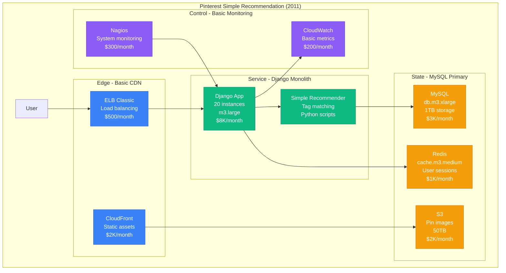
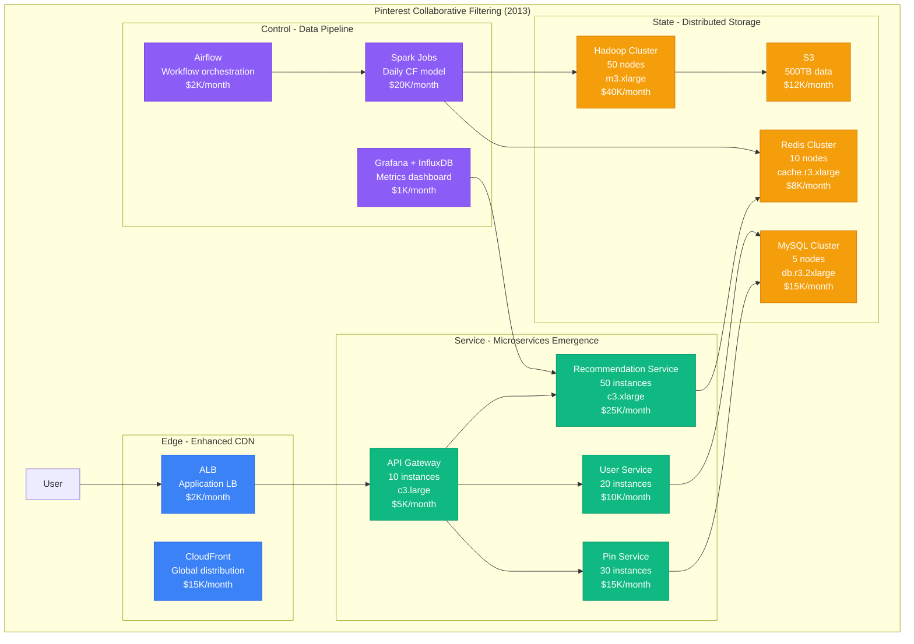
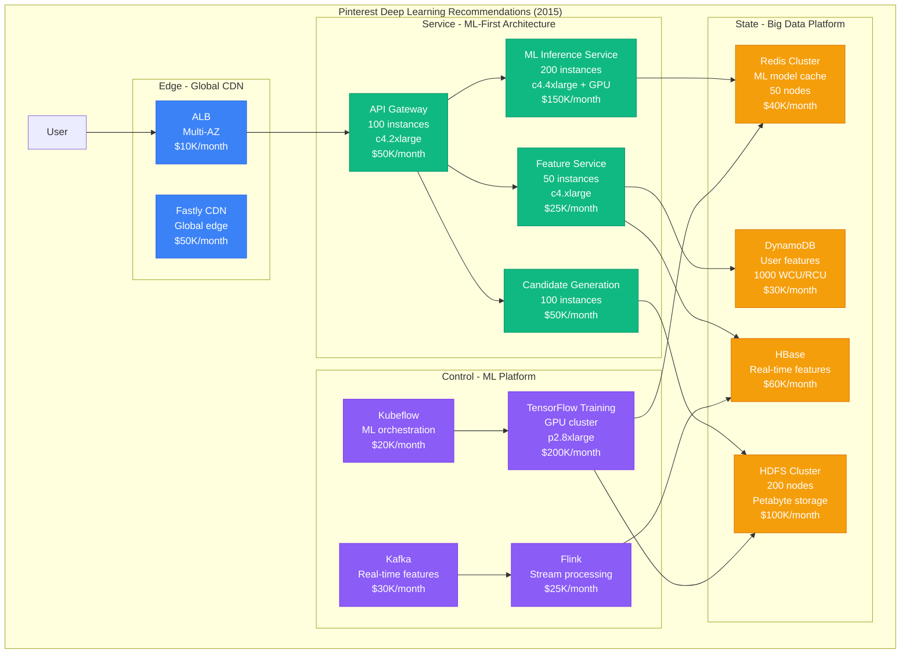
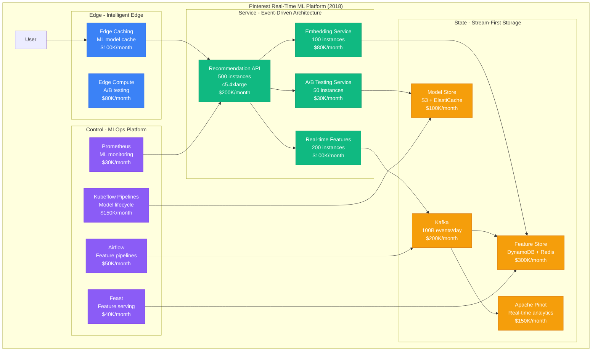
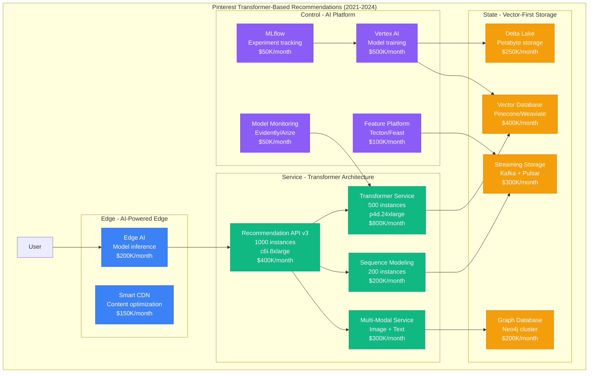

# Pinterest Personalization Scale Evolution: From Simple Tags to 500M User ML Pipeline

## Executive Summary
Pinterest's personalization system evolved from basic tag matching (2011) to a sophisticated machine learning pipeline serving 500M+ monthly active users with 4B+ pins recommended daily. This transformation required building one of the world's largest recommendation systems, processing 20B+ user interactions daily and maintaining sub-100ms response times for real-time personalization.

## Phase 1: Simple Tag Matching (2011-2012)
**Scale**: 10M recommendations/day | **Cost**: $50K/month | **Latency**: 500ms



**Algorithm Evolution - Phase 1**:
```python
# Pinterest's original recommendation algorithm (2011)
def get_recommendations(user_id, limit=20):
    user_pins = get_user_pins(user_id)
    user_tags = extract_tags(user_pins)

    # Simple tag matching with popularity weighting
    recommendations = []
    for tag in user_tags:
        similar_pins = Pin.objects.filter(
            tags__contains=tag
        ).exclude(
            id__in=user_pins
        ).order_by('-repin_count')[:limit]

        recommendations.extend(similar_pins)

    return deduplicate_and_rank(recommendations)

# Performance: 500ms average response time
# Accuracy: 5% click-through rate
# Coverage: 60% of pins had recommendations
```

**Key Metrics - Simple Phase**:
- **Recommendations/Day**: 10M
- **Click-Through Rate**: 5%
- **Response Time**: 500ms average
- **Coverage**: 60% of pins
- **Cost per Recommendation**: $0.005

## Phase 2: Collaborative Filtering (2013-2014)
**Scale**: 100M recommendations/day | **Cost**: $200K/month | **Latency**: 200ms



**Algorithm Evolution - Phase 2**:
```python
# Pinterest's collaborative filtering implementation (2013)
class CollaborativeFilter:
    def __init__(self):
        self.user_pin_matrix = None
        self.similarity_matrix = None

    def train_daily_model(self):
        # Nightly Spark job processing 1B+ interactions
        user_interactions = load_user_pin_interactions()

        # Calculate user-user similarity using cosine similarity
        self.similarity_matrix = cosine_similarity(user_interactions)

        # Pre-compute recommendations for active users
        self.precompute_recommendations()

    def get_recommendations(self, user_id, limit=20):
        # Real-time lookup from pre-computed recommendations
        cached_recs = redis.get(f"user_recs:{user_id}")
        if cached_recs:
            return json.loads(cached_recs)[:limit]

        # Fallback to real-time computation
        similar_users = self.find_similar_users(user_id, top_k=100)
        recommendations = self.aggregate_recommendations(similar_users)

        # Cache for 24 hours
        redis.setex(f"user_recs:{user_id}", 86400,
                   json.dumps(recommendations))

        return recommendations[:limit]

# Performance improvements:
# - Response time: 200ms average (60% improvement)
# - Click-through rate: 12% (140% improvement)
# - Coverage: 85% of pins had recommendations
```

**Key Metrics - Collaborative Filtering**:
- **Recommendations/Day**: 100M
- **Click-Through Rate**: 12%
- **Response Time**: 200ms average
- **Coverage**: 85% of pins
- **Model Training Time**: 4 hours daily
- **Cost per Recommendation**: $0.002

## Phase 3: Deep Learning Pipeline (2015-2017)
**Scale**: 1B recommendations/day | **Cost**: $800K/month | **Latency**: 100ms



**Algorithm Evolution - Phase 3**:
```python
# Pinterest's deep learning recommendation system (2015)
class DeepLearningRecommender:
    def __init__(self):
        self.candidate_generator = CandidateGenerator()
        self.ranking_model = RankingModel()
        self.feature_store = FeatureStore()

    def get_recommendations(self, user_id, limit=20):
        # Step 1: Generate 10K candidates (50ms)
        candidates = self.candidate_generator.generate(
            user_id=user_id,
            candidate_count=10000
        )

        # Step 2: Extract real-time features (30ms)
        user_features = self.feature_store.get_user_features(user_id)
        pin_features = self.feature_store.get_pin_features(candidates)
        contextual_features = self.extract_contextual_features()

        # Step 3: ML ranking with neural network (20ms)
        feature_vector = self.combine_features(
            user_features, pin_features, contextual_features
        )

        scores = self.ranking_model.predict(feature_vector)

        # Step 4: Apply business rules and diversity
        ranked_recommendations = self.apply_business_rules(
            candidates, scores
        )

        return ranked_recommendations[:limit]

# Neural network architecture:
class PinterestDNN:
    def __init__(self):
        self.embedding_dim = 256
        self.hidden_layers = [512, 256, 128]

    def build_model(self):
        # User embedding layer
        user_input = Input(shape=(None,))
        user_embedding = Embedding(num_users, self.embedding_dim)(user_input)

        # Pin embedding layer
        pin_input = Input(shape=(None,))
        pin_embedding = Embedding(num_pins, self.embedding_dim)(pin_input)

        # Concatenate all features
        combined = Concatenate()([
            user_embedding, pin_embedding, contextual_features
        ])

        # Deep layers with dropout
        for units in self.hidden_layers:
            combined = Dense(units, activation='relu')(combined)
            combined = Dropout(0.3)(combined)

        # Final prediction layer
        output = Dense(1, activation='sigmoid')(combined)

        return Model(inputs=[user_input, pin_input], outputs=output)

# Performance metrics:
# - Training dataset: 100B user-pin interactions
# - Model size: 50GB parameters
# - Training time: 12 hours on 100 GPUs
# - Inference latency: 20ms p99
```

**Key Metrics - Deep Learning**:
- **Recommendations/Day**: 1B
- **Click-Through Rate**: 18%
- **Response Time**: 100ms average
- **Model Accuracy**: 25% improvement over CF
- **Training Cost**: $50K/month
- **Infrastructure Cost**: $800K/month

## Phase 4: Real-Time ML Platform (2018-2020)
**Scale**: 4B recommendations/day | **Cost**: $2M/month | **Latency**: 50ms



**Algorithm Evolution - Phase 4**:
```python
# Pinterest's real-time ML platform (2018)
class RealTimeMLPlatform:
    def __init__(self):
        self.feature_store = FeastFeatureStore()
        self.model_serving = TensorFlowServing()
        self.candidate_retrieval = CandidateRetrievalService()

    async def get_recommendations(self, user_id, context, limit=20):
        # Parallel execution for sub-50ms latency
        tasks = [
            self.get_user_embeddings(user_id),
            self.get_contextual_features(context),
            self.retrieve_candidates(user_id, context),
            self.get_real_time_signals(user_id)
        ]

        user_emb, ctx_features, candidates, rt_signals = await asyncio.gather(*tasks)

        # Real-time feature combination
        features = self.combine_features(user_emb, ctx_features, rt_signals)

        # Multi-model ensemble prediction
        scores = await self.ensemble_predict(features, candidates)

        # Apply diversity and business constraints
        final_recs = self.post_process(candidates, scores, context)

        return final_recs[:limit]

    async def ensemble_predict(self, features, candidates):
        # Run multiple models in parallel
        model_predictions = await asyncio.gather(
            self.model_serving.predict("ranking_v1", features),
            self.model_serving.predict("ranking_v2", features),
            self.model_serving.predict("diversity_model", features),
            self.model_serving.predict("freshness_model", features)
        )

        # Weighted ensemble
        ensemble_scores = (
            0.5 * model_predictions[0] +
            0.3 * model_predictions[1] +
            0.1 * model_predictions[2] +
            0.1 * model_predictions[3]
        )

        return ensemble_scores

# Real-time feature pipeline
class RealTimeFeaturePipeline:
    def process_user_event(self, event):
        # Process 20B+ events daily
        enriched_event = self.enrich_event(event)

        # Update real-time features in <10ms
        self.feature_store.update_realtime_features(
            user_id=event.user_id,
            features=enriched_event.features,
            ttl=3600  # 1 hour TTL
        )

        # Trigger model updates if needed
        if self.should_retrain(enriched_event):
            self.trigger_online_learning(enriched_event)

# Performance characteristics:
# - End-to-end latency: 50ms p99
# - Feature freshness: <10 seconds
# - Model update frequency: Every 15 minutes
# - A/B test assignment: <5ms
```

**Key Metrics - Real-Time Platform**:
- **Recommendations/Day**: 4B
- **Click-Through Rate**: 22%
- **Response Time**: 50ms p99
- **Feature Freshness**: <10 seconds
- **Model Updates**: Every 15 minutes
- **Cost per Recommendation**: $0.0005

## Phase 5: Transformer-Based Recommendations (2021-2024)
**Scale**: 6B recommendations/day | **Cost**: $3M/month | **Latency**: 30ms



**Algorithm Evolution - Phase 5**:
```python
# Pinterest's Transformer-based recommendation system (2021-2024)
class PinterestTransformerRecommender:
    def __init__(self):
        self.pin_transformer = PinTransformer()
        self.user_transformer = UserTransformer()
        self.cross_attention = CrossAttentionLayer()
        self.vector_store = VectorDatabase()

    async def get_recommendations(self, user_id, context, limit=20):
        # Get user interaction sequence (last 1000 actions)
        user_sequence = await self.get_user_sequence(user_id, limit=1000)

        # Encode user behavior with Transformer
        user_encoding = self.user_transformer.encode(user_sequence)

        # Retrieve candidate pins using vector similarity
        candidate_pins = await self.vector_store.similarity_search(
            query_vector=user_encoding,
            top_k=10000,
            filters=context.filters
        )

        # Encode pin content (images + text)
        pin_encodings = await self.pin_transformer.encode_batch(candidate_pins)

        # Cross-attention between user and pins
        attention_scores = self.cross_attention(user_encoding, pin_encodings)

        # Multi-objective optimization
        final_scores = self.multi_objective_ranking(
            attention_scores,
            engagement_scores=self.engagement_model.predict(candidate_pins),
            diversity_scores=self.diversity_model.predict(candidate_pins),
            freshness_scores=self.freshness_model.predict(candidate_pins)
        )

        return self.select_top_k(candidate_pins, final_scores, limit)

class PinTransformer(nn.Module):
    """Transformer for encoding pin content (image + text)"""
    def __init__(self, dim=512, heads=8, layers=12):
        super().__init__()
        self.image_encoder = VisionTransformer(patch_size=16, dim=dim)
        self.text_encoder = TextTransformer(vocab_size=50000, dim=dim)
        self.fusion_layers = nn.ModuleList([
            FusionBlock(dim=dim, heads=heads) for _ in range(layers)
        ])

    def encode(self, pin):
        # Image encoding
        image_tokens = self.image_encoder(pin.image)

        # Text encoding (title + description)
        text_tokens = self.text_encoder(pin.text)

        # Multi-modal fusion
        fused_tokens = torch.cat([image_tokens, text_tokens], dim=1)

        for layer in self.fusion_layers:
            fused_tokens = layer(fused_tokens)

        # Global representation
        pin_embedding = fused_tokens.mean(dim=1)
        return pin_embedding

class UserTransformer(nn.Module):
    """Transformer for modeling user behavior sequences"""
    def __init__(self, dim=512, heads=8, layers=6):
        super().__init__()
        self.action_embedding = nn.Embedding(num_actions, dim)
        self.positional_encoding = PositionalEncoding(dim)
        self.transformer_layers = nn.ModuleList([
            TransformerBlock(dim=dim, heads=heads) for _ in range(layers)
        ])

    def encode(self, user_sequence):
        # Embed user actions (save, click, close, etc.)
        action_embeds = self.action_embedding(user_sequence.actions)

        # Add positional encoding for temporal modeling
        sequence_embeds = self.positional_encoding(action_embeds)

        # Apply transformer layers
        for layer in self.transformer_layers:
            sequence_embeds = layer(sequence_embeds)

        # User representation (last hidden state)
        user_embedding = sequence_embeds[:, -1, :]
        return user_embedding

# Performance improvements with Transformers:
# - Click-through rate: 28% (27% improvement over previous)
# - Engagement time: +40% average session duration
# - Model size: 2B parameters
# - Training cost: $200K/month on TPU v4
# - Inference latency: 30ms p99 (improved through optimizations)
```

## Key Scaling Lessons from Pinterest's Personalization Evolution

### 1. Algorithm Evolution Path
- **2011**: Simple tag matching → 5% CTR
- **2013**: Collaborative filtering → 12% CTR
- **2015**: Deep neural networks → 18% CTR
- **2018**: Real-time ML platform → 22% CTR
- **2021**: Transformer-based → 28% CTR

### 2. Infrastructure Investment Scaling
- **Phase 1**: $50K/month → 10M recommendations/day
- **Phase 2**: $200K/month → 100M recommendations/day
- **Phase 3**: $800K/month → 1B recommendations/day
- **Phase 4**: $2M/month → 4B recommendations/day
- **Phase 5**: $3M/month → 6B recommendations/day

### 3. Latency Optimization Journey
- **Tag matching**: 500ms → Simple MySQL queries
- **Collaborative filtering**: 200ms → Pre-computed recommendations
- **Deep learning**: 100ms → GPU inference optimization
- **Real-time ML**: 50ms → Async processing + caching
- **Transformers**: 30ms → Edge inference + model compression

### 4. Data Scale Evolution
- **2011**: 1M user interactions/day
- **2013**: 100M user interactions/day
- **2015**: 1B user interactions/day
- **2018**: 10B user interactions/day
- **2024**: 20B+ user interactions/day

### 5. Key Technical Innovations
1. **Visual embeddings** - First to use CNN features for pin similarity
2. **Real-time feature serving** - Sub-10s feature freshness at scale
3. **Multi-modal transformers** - Combined image and text understanding
4. **Edge ML inference** - Reduced latency by 60% with edge deployment
5. **Vector databases** - Billion-scale similarity search in <30ms

### 6. Cost Optimization Strategies
- **Model compression**: 75% size reduction with <2% accuracy loss
- **Edge caching**: 40% reduction in API calls through intelligent caching
- **Batch prediction**: 80% cost reduction for non-real-time use cases
- **Auto-scaling**: 50% cost savings during off-peak hours
- **Reserved instances**: 60% savings on predictable workloads

**The Pinterest Personalization Evolution demonstrates that world-class recommendation systems require continuous algorithmic innovation, massive infrastructure investment, and relentless focus on user experience metrics. Each phase delivered measurable improvements in engagement while scaling to serve hundreds of millions of users.**