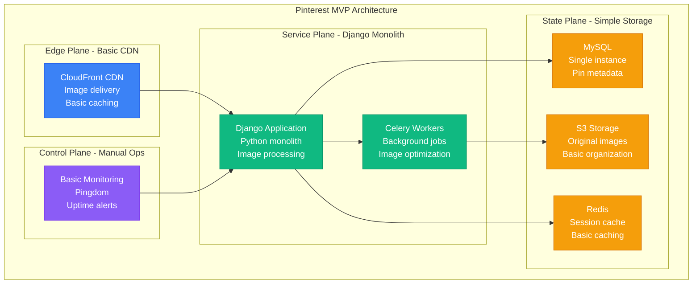
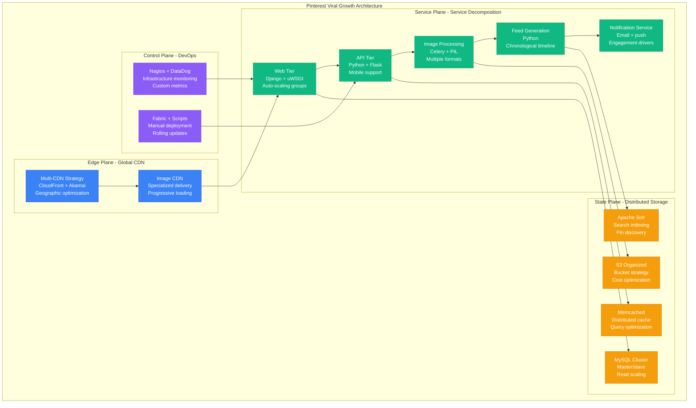
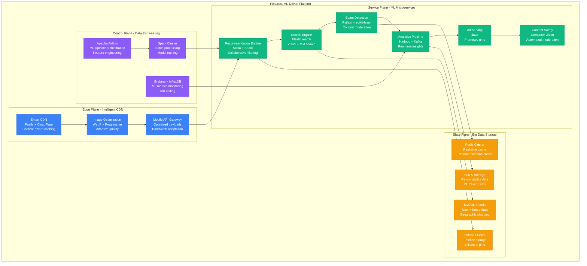
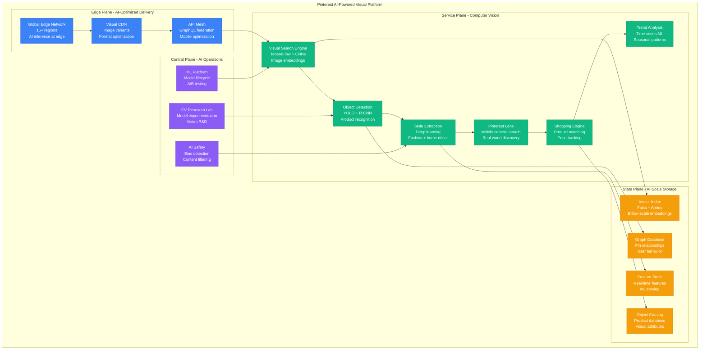
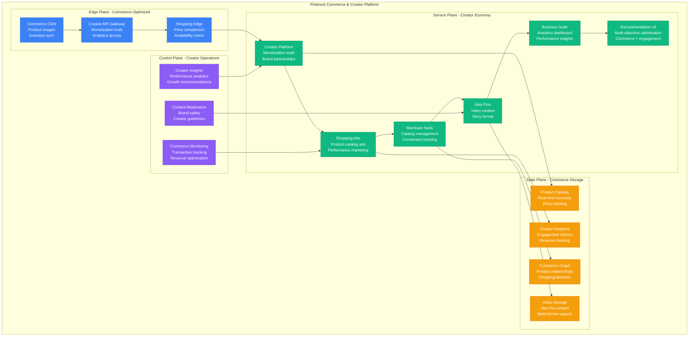

# Pinterest Scale Evolution: 0 to 450M Users - Visual Discovery at Scale

## Executive Summary

Pinterest scaled from a simple image bookmarking tool (2010) to the world's largest visual discovery platform serving 450+ million monthly active users. This journey showcases the extreme challenges of scaling image-heavy workloads, personalized recommendation systems, and viral traffic patterns while maintaining sub-second image loading and discovery experiences globally.

**Visual Discovery Scaling Achievements:**
- **Monthly users**: 1K → 450M+ (450,000x growth)
- **Pins created**: 5K → 300B+ pins
- **Images served**: 1K/day → 50B+ daily image views
- **Recommendations**: Manual → 5B+ daily personalized recommendations
- **Infrastructure**: Single server → Multi-cloud global platform

## Phase 1: Simple Image Bookmarking (2010-2011)
**Scale**: 1K-100K users, manual curation | **Cost**: $5K/month



**MVP Features**:
- **Pin creation**: Save images from any website
- **Board organization**: Categorize pins into themed boards
- **Social following**: Follow other users and their boards
- **Image optimization**: Multiple sizes for different contexts

**Early Viral Growth**:
- **Invitation-only beta**: Created exclusivity and word-of-mouth
- **Female-focused early adoption**: Wedding and recipe content
- **Browser bookmarklet**: Easy pin creation from any website

**What Broke**: MySQL performance with image metadata queries, S3 costs scaling linearly with image storage.

## Phase 2: Viral Growth and Infrastructure Scaling (2011-2013)
**Scale**: 100K-50M users, explosive growth | **Cost**: $500K/month



**Viral Growth Characteristics**:
- **Female demographic domination**: 80% female user base initially
- **Content categories**: Home décor, recipes, fashion, weddings
- **Sharing behavior**: High re-pin rates creating viral loops
- **Mobile adoption**: iPhone app driving 60% of engagement

**Production Metrics (2013)**:
- **50M+ monthly users**
- **5B+ monthly page views**
- **1B+ pins** created
- **99.5% uptime** during traffic spikes
- **<2 second** average page load time

**What Broke**: MySQL write scaling limits, image processing backlogs during viral spikes, memcached hotspots.

## Phase 3: Personalization and Machine Learning (2013-2016)
**Scale**: 50M-150M users, algorithmic feeds | **Cost**: $5M/month



**Machine Learning Innovations**:
- **Smart Feed**: Personalized pin recommendations
- **Visual search**: Search by uploading similar images
- **Related pins**: Content-based recommendations
- **Spam detection**: ML-powered content moderation
- **Promoted pins**: Algorithmic ad placement

**Production Metrics (2016)**:
- **150M+ monthly users**
- **100B+ pin impressions** monthly
- **2B+ searches** per month
- **99.9% uptime** for recommendation systems
- **<500ms p95** for personalized feed generation

**What Broke**: ML model serving latency, HBase hotspotting with viral content, real-time feature computation.

## Phase 4: Visual Search and Computer Vision (2016-2019)
**Scale**: 150M-300M users, AI-powered discovery | **Cost**: $50M/month



**Computer Vision Breakthroughs**:
- **Pinterest Lens**: Camera-based visual search
- **Shop the Look**: Buy products directly from pins
- **Object detection**: Automatic product tagging
- **Style matching**: Find similar aesthetic items
- **Trend prediction**: ML-powered seasonal forecasting

**Production Metrics (2019)**:
- **300M+ monthly users**
- **600M+ visual searches** monthly
- **2B+ objects** detected daily
- **99.95% uptime** for visual search
- **<200ms p95** for visual similarity queries

**What Broke**: GPU cluster scaling for visual inference, vector similarity search performance at billion-scale.

## Phase 5: Commerce and Creator Economy (2019-2024)
**Scale**: 300M-450M users, shopping platform | **Cost**: $200M/month



**Creator Economy Features**:
- **Creator rewards**: Revenue sharing for content creators
- **Shopping ads**: Products integrated into pins
- **Try-on features**: AR-powered product visualization
- **Idea Pins**: Video content with shopping integration
- **Business analytics**: ROI tracking for brands

**Current Production Metrics (2024)**:
- **450M+ monthly users** globally
- **300B+ pins** with shopping data
- **50B+ daily searches** with visual + text
- **$3B+ annual** shopping volume attributed
- **99.99% uptime** for commerce features
- **<100ms p95** for personalized recommendations

## Scale Evolution Summary

| Phase | Timeline | Users | Pins | Key Innovation | Monthly Cost |
|-------|----------|-------|------|----------------|--------------|
| **Image Bookmarking** | 2010-2011 | 1K-100K | 5K-1M | Pin creation | $5K |
| **Viral Growth** | 2011-2013 | 100K-50M | 1M-1B | Social sharing | $500K |
| **ML Personalization** | 2013-2016 | 50M-150M | 1B-50B | Smart Feed | $5M |
| **Visual AI** | 2016-2019 | 150M-300M | 50B-200B | Computer vision | $50M |
| **Commerce Platform** | 2019-2024 | 300M-450M | 200B-300B | Creator economy | $200M |

## Critical Scaling Lessons

### 1. Image-Heavy Infrastructure Costs
```
Image_Cost = Storage + CDN + Processing + Bandwidth
```
- **2024**: 300B+ pins = 100PB+ of image data
- **CDN costs**: $10M+ monthly for global image delivery
- **Storage optimization**: 90% cost reduction through format optimization

### 2. Visual Search Complexity
```
Search_Latency = Feature_Extraction + Vector_Search + Ranking
Target: <200ms for visual similarity
```
- **Feature extraction**: 50-100ms per image
- **Vector search**: Billion-scale similarity in 50ms
- **Ranking**: Personalization adds 30-50ms

### 3. Recommendation System Scale
```
Recommendations = Users × Interests × Content × Real_Time_Context
```
- **450M users** × **average 50 interests** = 22.5B personalization vectors
- **Real-time feature computation**: 100K+ features per user
- **Multi-objective optimization**: Engagement + commerce + creator success

### 4. Female-Focused Platform Dynamics
```
Engagement_Rate = Content_Quality × Visual_Appeal × Social_Proof
```
- **High curation standards**: Quality over quantity content
- **Visual-first design**: Image experience trumps text
- **Social discovery**: Following and sharing drive viral growth

## The 3 AM Lessons

### Incident: Black Friday 2018 Traffic Surge
**Problem**: 10x traffic spike caused image delivery failures
**Root Cause**: CDN cache miss storm during shopping peak
**Fix**: Predictive pre-warming + multi-CDN failover
**Prevention**: Shopping season capacity planning with 20x headroom

### Incident: Visual Search Model Deployment (2017)
**Problem**: New computer vision model caused 90% accuracy drop
**Root Cause**: Training data bias not caught in offline testing
**Fix**: Canary deployments + real-time accuracy monitoring
**Prevention**: Production traffic replay for model validation

### Incident: Spam Bot Attack (2015)
**Problem**: Coordinated spam pins overwhelmed content moderation
**Root Cause**: ML models couldn't detect sophisticated spam patterns
**Fix**: Human-in-the-loop moderation + behavior pattern detection
**Prevention**: Real-time anomaly detection on pin creation patterns

### Incident: Pinterest Lens Launch Overload (2017)
**Problem**: Mobile visual search feature crashed vision inference cluster
**Root Cause**: Underestimated mobile camera search adoption rate
**Fix**: Auto-scaling GPU clusters + request queuing
**Prevention**: Mobile-specific load testing with camera uploads

## Current Architecture Principles (2024)

1. **Visual-first design**: Every feature optimized for image discovery experience
2. **AI-powered curation**: Machine learning enhances content quality and relevance
3. **Creator-focused monetization**: Platform success tied to creator success
4. **Global image performance**: Sub-second image loading worldwide
5. **Shopping integration**: Commerce embedded naturally in discovery experience
6. **Privacy-preserving personalization**: User control over data and recommendations
7. **Multi-modal search**: Text, visual, and voice search capabilities
8. **Trend prediction**: Seasonal and cultural trend forecasting

## Technology Evolution Impact

### 2010-2013: Viral Visual Sharing
- **Innovation**: Pin-based image bookmarking with social sharing
- **Challenge**: Scaling image delivery and viral traffic patterns
- **Result**: Established visual discovery category

### 2014-2016: Machine Learning Personalization
- **Innovation**: Algorithmic feed and smart recommendations
- **Challenge**: Personalizing content for diverse user interests
- **Result**: Engagement improvements and user retention growth

### 2017-2019: Computer Vision Platform
- **Innovation**: Visual search and object recognition at scale
- **Challenge**: Billion-scale visual similarity computation
- **Result**: Unique visual search capabilities driving discovery

### 2020-2024: Commerce and Creator Economy
- **Innovation**: Shopping integration and creator monetization
- **Challenge**: Balancing commerce with organic discovery experience
- **Result**: Sustainable business model supporting creator ecosystem

Pinterest's evolution from an image bookmarking tool to a visual discovery commerce platform demonstrates that successful scaling of visual-heavy applications requires massive investment in computer vision infrastructure, sophisticated personalization systems, and careful balance between discovery and commerce experiences.

*"Building a visual platform means every pixel matters. Performance isn't just about speed - it's about inspiration striking at the moment of discovery."* - Pinterest Engineering Team