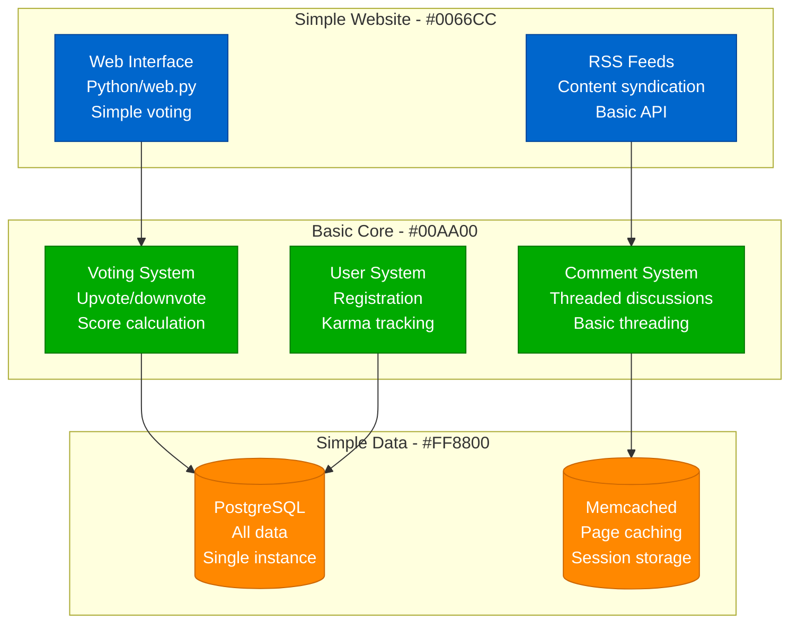
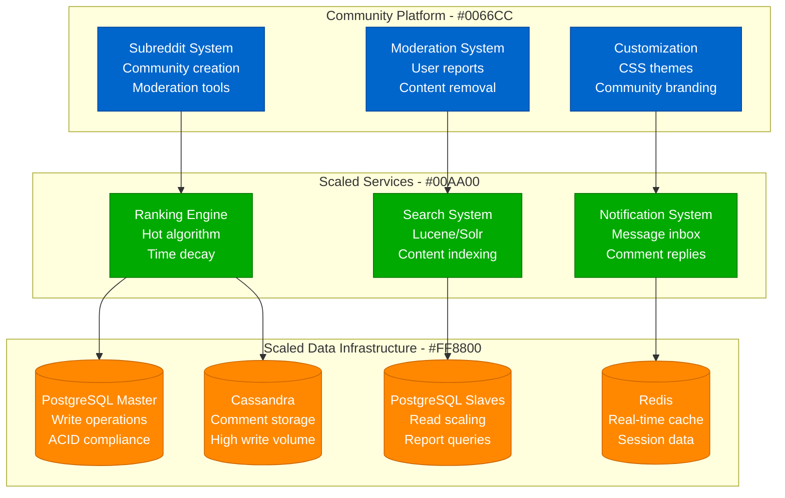
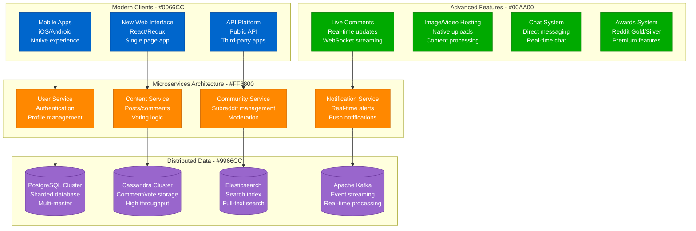

# Reddit Scale Evolution: 1K to 500M Users

## Executive Summary

Reddit's scaling journey from 1K users to 500M+ monthly active users represents one of the most successful community-driven platform scaling stories. The platform evolved from a simple link aggregator to a complex ecosystem of thousands of communities handling billions of interactions.

**Key Scaling Metrics:**
- **Users**: 1,000 → 500,000,000+ (500,000x growth)
- **Subreddits**: 1 → 3,000,000+ communities
- **Daily Posts**: 10 → 2,000,000+ posts/day
- **Daily Comments**: 100 → 20,000,000+ comments/day
- **Infrastructure cost**: $1K/month → $500M+/year

## Phase 1: Link Aggregator (2005-2008)
**Scale: 1K-100K users, simple voting system**

### Technology Stack
- **Backend**: Python with web.py framework
- **Database**: PostgreSQL for all data
- **Caching**: Memcached for page caching
- **Infrastructure**: Single server, basic hosting

### Key Features
- **Democratic voting** system for content ranking
- **Threaded comments** for discussion
- **User karma** system for reputation
- **RSS feeds** for content syndication

## Phase 2: Subreddit System (2008-2012)
**Scale: 100K-10M users, community platform**

### Subreddit Innovation
1. **Community creation** - User-generated communities
2. **Moderation tools** - Community self-governance
3. **Customization** - Unique community identity
4. **Specialized rules** - Community-specific guidelines

### Scaling Challenges
- **Database performance** with growing comments
- **Search functionality** across millions of posts
- **Moderation scaling** with community growth

## Phase 3: Mobile & Modern Platform (2012-2018)
**Scale: 10M-300M users, mobile revolution**

### Platform Modernization
1. **Mobile-first** native apps
2. **Real-time features** with WebSockets
3. **Native media hosting** for images/videos
4. **Monetization** through Reddit Gold
5. **API ecosystem** for third-party developers

### Technical Evolution
- **Microservices architecture** for independent scaling
- **Event-driven design** with Kafka
- **NoSQL adoption** for high-volume data
- **CDN integration** for global performance

## Phase 4: Modern Social Platform (2018-Present)
**Scale: 300M-500M+ users, comprehensive platform**

### Current Features
- **Reddit Premium** - Ad-free experience with perks
- **Reddit Coins** - Virtual currency for awards
- **Reddit Live** - Live streaming platform
- **Chat Rooms** - Community real-time chat
- **Polls** - Interactive community voting

### Advanced Infrastructure
- **Machine learning** for content recommendation
- **Advanced moderation** with AI assistance
- **Global CDN** with edge computing
- **Real-time analytics** for community insights

## Community Growth Evolution

### Subreddit Scale by Year

| Year | Active Subreddits | Daily Posts | Daily Comments | Moderator Actions |
|------|------------------|-------------|----------------|-------------------|
| 2008 | 100 | 100 | 1K | 10 |
| 2012 | 10K | 10K | 100K | 1K |
| 2016 | 100K | 100K | 1M | 10K |
| 2020 | 1M | 1M | 10M | 100K |
| 2024 | 3M+ | 2M+ | 20M+ | 1M+ |

## Cost Evolution

| Phase | Period | Monthly Cost | Cost per User | Primary Drivers |
|-------|--------|--------------|---------------|----------------|
| Aggregator | 2005-2008 | $1K-10K | $0.10 | Basic hosting |
| Communities | 2008-2012 | $10K-500K | $0.05 | Database scaling |
| Mobile | 2012-2018 | $500K-20M | $0.10 | Mobile infrastructure |
| Modern | 2018-Present | $20M-50M+ | $0.08 | AI and real-time features |

## Technology Stack Evolution

| Component | 2005 | 2010 | 2015 | 2020 | 2024 |
|-----------|------|------|------|------|------|
| Backend | Python/web.py | Python/Pylons | Python/Flask | Microservices | Cloud-native |
| Database | PostgreSQL | PG + Memcached | PG + Cassandra | Multi-database | Distributed |
| Frontend | Server-side | jQuery | Angular | React | Modern framework |
| Mobile | None | Mobile web | Native apps | Advanced native | AI-enhanced |
| Search | None | Lucene | Elasticsearch | Advanced search | AI-powered |

## Key Lessons Learned

### Technical Lessons
1. **Community-driven content scales differently** - User-generated content has unique patterns
2. **Comment threading is computationally expensive** - Nested discussions require optimization
3. **Voting systems create hotspots** - Popular content creates database contention
4. **Moderation tools must scale** - Community governance requires sophisticated tooling
5. **Real-time features transform engagement** - Live updates change user behavior

### Business Lessons
1. **Community self-governance works** - Users can effectively moderate themselves
2. **Platform neutrality drives growth** - Diverse communities need neutral infrastructure
3. **Premium features fund free platform** - Subscription model supports free users
4. **Developer ecosystem creates value** - Third-party apps enhance platform utility
5. **Content policy affects growth** - Moderation decisions have business implications

### Operational Lessons
1. **Content moderation never scales enough** - Always need more sophisticated tools
2. **Community crises affect entire platform** - Local issues can become global problems
3. **Free speech vs. safety is ongoing tension** - Balance affects user base
4. **Viral content creates traffic spikes** - Sudden popularity can overwhelm systems
5. **Cultural sensitivity requires human judgment** - AI moderation has limitations

## Current Scale Metrics (2024)

| Metric | Value | Source |
|--------|-------|--------|
| Monthly Active Users | 500M+ | Company reports |
| Daily Active Users | 70M+ | Platform analytics |
| Active Subreddits | 3M+ | Community metrics |
| Daily Posts | 2M+ | Content metrics |
| Daily Comments | 20M+ | Engagement metrics |
| Moderator Actions/Day | 1M+ | Moderation stats |
| Countries | 100+ | Global presence |
| Revenue | $800M+ annually | Estimated financials |

---

*Reddit's evolution from simple link aggregator to massive community platform demonstrates how user-generated content, community self-governance, and democratic voting systems can create platforms that scale to serve hundreds of millions of users while maintaining diverse, engaged communities.*