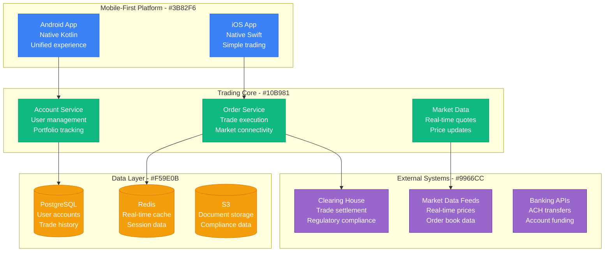
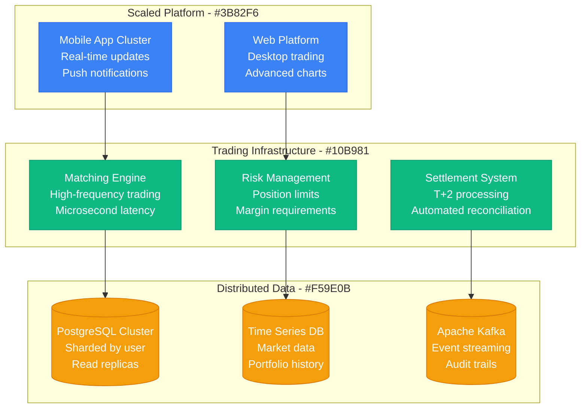

# Robinhood Scale Evolution: 10K to 23M Users

## Executive Summary

Robinhood's scaling journey from 10K beta users to 23M+ registered users represents the democratization of stock trading through mobile-first architecture. The platform evolved from a simple trading app to a comprehensive financial services platform handling billions in daily trading volume.

**Key Scaling Metrics:**
- **Users**: 10,000 → 23,000,000+ (2,300x growth)
- **Daily Trades**: 100 → 5,000,000+ (50,000x growth)
- **Assets Under Management**: $0 → $100B+
- **Daily Trading Volume**: $1M → $10B+
- **Infrastructure cost**: $50K/month → $500M+/year

## Phase 1: Beta Launch (2013-2014)
**Scale: 10K users, commission-free trading concept**

## Phase 2: Viral Growth (2014-2018)
**Scale: 100K-5M users, GameStop precursor**

### Features Added
1. **Options trading** for retail investors
2. **Cryptocurrency** trading support
3. **Margin trading** with Robinhood Gold
4. **Fractional shares** for expensive stocks

## Phase 3: GameStop Crisis (2021)
**Scale: 5M-20M users, meme stock volatility**

### Crisis Response Architecture
- **Circuit breakers** for volatile stocks
- **Emergency scaling** for 1000x traffic
- **Regulatory compliance** under scrutiny
- **Liquidity management** during margin calls

### What Broke
- **Order processing** overwhelmed by volume
- **Clearing house requirements** forced trading restrictions
- **Mobile app** crashed during peak volatility

## Phase 4: Financial Services Platform (2021-Present)
**Scale: 20M-23M+ users, comprehensive platform**

### Current Platform
- **Robinhood Markets** - Core trading platform
- **Robinhood Crypto** - Cryptocurrency exchange
- **Robinhood Cash Management** - Banking services
- **Robinhood Retirement** - IRA accounts

## Cost Evolution

| Phase | Period | Monthly Cost | Cost per User | Primary Drivers |
|-------|--------|--------------|---------------|----------------|
| Beta | 2013-2014 | $50K-200K | $20 | Basic infrastructure |
| Growth | 2014-2018 | $200K-10M | $5 | Trading infrastructure |
| Crisis | 2018-2021 | $10M-50M | $3 | Compliance systems |
| Platform | 2021-Present | $50M-100M+ | $4 | Financial services |

## Key Lessons Learned

### Technical Lessons
1. **Financial systems require different SLAs** - Trading stops cost money
2. **Regulatory compliance drives architecture** - Audit trails are mandatory
3. **Mobile-first transforms finance** - User experience drives adoption
4. **External dependencies create risks** - Clearing houses can restrict trading
5. **Crisis testing reveals weaknesses** - Normal load testing isn't enough

### Business Lessons
1. **Commission-free disrupts incumbents** - Business model innovation matters
2. **Social trading creates viral growth** - Community features drive engagement
3. **Regulatory relationships are critical** - Compliance is a competitive advantage
4. **Crisis management affects trust** - Operational decisions have lasting impact
5. **Platform expansion enables growth** - Multiple products increase lifetime value

## Current Scale Metrics (2024)

| Metric | Value | Source |
|--------|-------|--------|
| Registered Users | 23M+ | Company reports |
| Assets Under Management | $100B+ | Financial filings |
| Daily Trading Volume | $10B+ | Market data |
| Revenue | $2B+ annually | SEC filings |
| Countries Served | 1 (US only) | Regulatory restrictions |

---

*Robinhood's scaling demonstrates how mobile-first design and commission-free trading can democratize financial markets, while also showing the challenges of building financial infrastructure that must handle extreme volatility and regulatory scrutiny.*