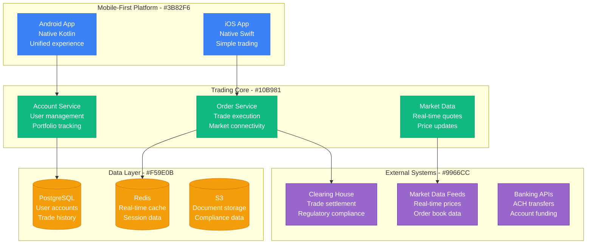
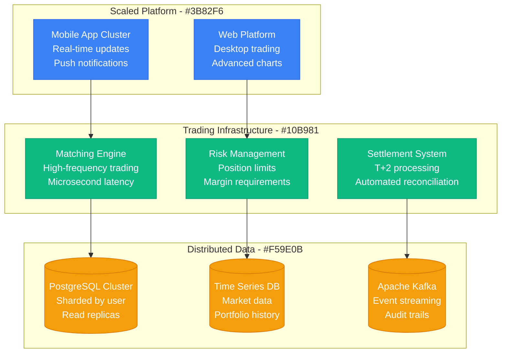
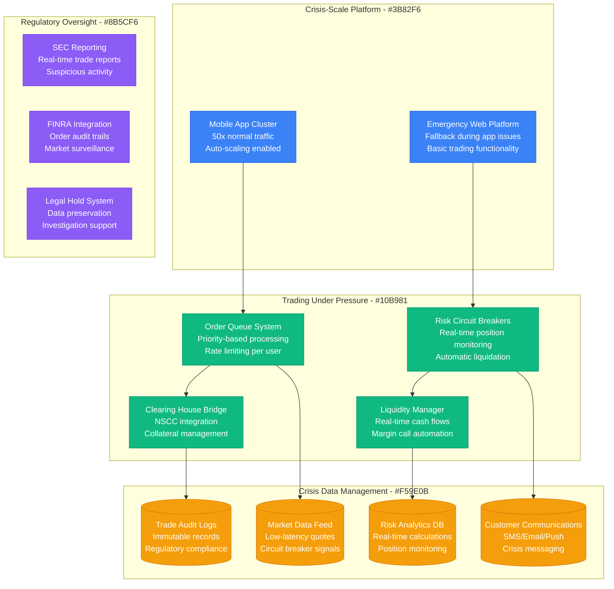

# Robinhood Scale Evolution: 10K to 23M Users

## Executive Summary

Robinhood's scaling journey from 10K beta users to 23M+ registered users represents the democratization of stock trading through mobile-first architecture. The platform evolved from a simple trading app to a comprehensive financial services platform handling billions in daily trading volume.

**Key Scaling Metrics:**
- **Users**: 10,000 → 23,000,000+ (2,300x growth)
- **Daily Trades**: 100 → 5,000,000+ (50,000x growth)
- **Assets Under Management**: $0 → $100B+
- **Daily Trading Volume**: $1M → $10B+
- **Infrastructure cost**: $50K/month → $500M+/year

## Phase 1: Beta Launch (2013-2014)
**Scale: 10K users, commission-free trading concept**

## Phase 2: Viral Growth (2014-2018)
**Scale: 100K-5M users, GameStop precursor**

### Features Added
1. **Options trading** for retail investors
2. **Cryptocurrency** trading support
3. **Margin trading** with Robinhood Gold
4. **Fractional shares** for expensive stocks

## Phase 3: GameStop Crisis (2021)
**Scale: 5M-20M users, meme stock volatility**

### Crisis Response Architecture

### What Broke During GameStop
- **Order processing** overwhelmed by 50x volume (2M orders vs normal 40K)
- **Clearing house requirements** forced trading restrictions
- **Mobile app** crashed during peak volatility
- **Customer service** collapsed under 10,000x support tickets
- **Liquidity calculations** couldn't keep up with real-time margin requirements

### Critical Incidents During GameStop Week

#### The Clearing House Crisis
**Date**: January 28, 2021 - 5:00 AM EST
**Trigger**: NSCC demanded $3B additional collateral for meme stocks
**Impact**: Emergency trading restrictions on GME, AMC, NOK, BB
**Resolution**: $3.4B emergency funding round from investors
**Lesson**: Clearing house liquidity requirements can force operational decisions
**3 AM Reality**: CEO Vlad Tenev in emergency board calls with investors
**Debug Tools**: Real-time liquidity monitoring showing $1B deficit
**Production Fix**: Immediate position-only trading, buy restrictions implemented

#### The App Crash Cascade
**Date**: January 27, 2021 - 9:30 AM EST (market open)
**Trigger**: 20M users trying to trade simultaneously
**Impact**: 2 hours of complete mobile app unavailability
**Resolution**: Emergency CDN scaling and database connection pooling
**Lesson**: Meme stock volatility creates unprecedented load patterns
**3 AM Debugging**: AWS RDS showing 100% CPU, connection pool exhausted
**Debug Tools**: CloudWatch showing 50x normal API requests
**Production Fix**: Emergency read replica scaling, connection multiplexing

#### The Customer Communication Meltdown
**Date**: January 28, 2021 - All Day
**Trigger**: Trading restrictions announcement causing user confusion
**Impact**: 24 hours of overwhelmed support channels
**Resolution**: Emergency communication infrastructure scaling
**Lesson**: Crisis communication is as critical as trading infrastructure
**3 AM Reality**: Support ticket volume: 500K vs normal 2K/day
**Debug Tools**: Zendesk showing queue overflow, response times >48 hours
**Production Fix**: Automated FAQ responses, mass email campaigns

## Phase 4: Financial Services Platform (2021-Present)
**Scale: 20M-23M+ users, comprehensive platform**

### Current Platform Architecture

```mermaid
graph TB
    subgraph CustomerFacing[Customer Experience - #3B82F6]
        MOBILE_V2[Robinhood Mobile<br/>React Native<br/>Advanced trading tools]
        WEB_PLATFORM[Web Platform<br/>Desktop trading<br/>Options strategies]
        API_GATEWAY[Public API<br/>Third-party integrations<br/>Rate limiting]
    end

    subgraph TradingServices[Trading Services - #10B981]
        EQUITY_ENGINE[Equity Trading Engine<br/>High-frequency execution<br/>Smart order routing]
        OPTIONS_ENGINE[Options Trading Engine<br/>Multi-leg strategies<br/>Greeks calculations]
        CRYPTO_ENGINE[Crypto Trading Engine<br/>24/7 markets<br/>Real-time settlement]
        FRACTIONAL_ENGINE[Fractional Shares<br/>Dollar-based investing<br/>Auto-investing]
    end

    subgraph FinancialServices[Financial Services - #10B981]
        CASH_MGMT[Cash Management<br/>FDIC-insured accounts<br/>Debit card integration]
        RETIREMENT[Retirement Accounts<br/>IRA management<br/>Tax optimization]
        LENDING[Margin Lending<br/>Securities-based credit<br/>Dynamic rates]
        CREDIT_CARDS[Credit Cards<br/>Rewards program<br/>Real-time approvals]
    end

    subgraph DataInfrastructure[Data & Analytics - #F59E0B]
        REAL_TIME_DB[(Real-time Database<br/>Position tracking<br/>Sub-millisecond updates)]
        ANALYTICS_WAREHOUSE[(Analytics Warehouse<br/>Snowflake<br/>Customer insights)]
        RISK_ENGINE[(Risk Engine<br/>Real-time monitoring<br/>Portfolio analysis)]
        MARKET_DATA[(Market Data<br/>Multiple feeds<br/>Low-latency)]
    end

    subgraph ComplianceOps[Compliance & Operations - #8B5CF6]
        REGULATORY[Regulatory Reporting<br/>Automated compliance<br/>Audit trails]
        KYC_AML[KYC/AML Engine<br/>Identity verification<br/>Transaction monitoring]
        FRAUD_DETECTION[Fraud Detection<br/>ML-based scoring<br/>Real-time alerts]
        CUSTOMER_SUPPORT[Customer Support<br/>AI-powered chatbots<br/>24/7 availability]
    end

    subgraph AIMLPlatform[AI/ML Platform - #9966CC]
        RECOMMENDATION[Investment Recommendations<br/>Personalized portfolios<br/>Risk-adjusted returns]
        PRICE_PREDICTION[Price Prediction<br/>Technical analysis<br/>Market sentiment]
        CUSTOMER_INSIGHTS[Customer Insights<br/>Behavioral analysis<br/>Churn prediction]
        ROBO_ADVISOR[Robo-advisor<br/>Automated rebalancing<br/>Tax-loss harvesting]
    end

    MOBILE_V2 --> EQUITY_ENGINE
    WEB_PLATFORM --> OPTIONS_ENGINE
    API_GATEWAY --> CRYPTO_ENGINE

    EQUITY_ENGINE --> REAL_TIME_DB
    OPTIONS_ENGINE --> ANALYTICS_WAREHOUSE
    CRYPTO_ENGINE --> RISK_ENGINE
    FRACTIONAL_ENGINE --> MARKET_DATA

    CASH_MGMT --> REGULATORY
    RETIREMENT --> KYC_AML
    LENDING --> FRAUD_DETECTION
    CREDIT_CARDS --> CUSTOMER_SUPPORT

    RECOMMENDATION --> CUSTOMER_INSIGHTS
    PRICE_PREDICTION --> ROBO_ADVISOR

    classDef customerStyle fill:#3B82F6,stroke:#2563EB,color:#fff
    classDef tradingStyle fill:#10B981,stroke:#059669,color:#fff
    classDef dataStyle fill:#F59E0B,stroke:#D97706,color:#fff
    classDef complianceStyle fill:#8B5CF6,stroke:#7C3AED,color:#fff
    classDef aiStyle fill:#9966CC,stroke:#663399,color:#fff

    class MOBILE_V2,WEB_PLATFORM,API_GATEWAY customerStyle
    class EQUITY_ENGINE,OPTIONS_ENGINE,CRYPTO_ENGINE,FRACTIONAL_ENGINE,CASH_MGMT,RETIREMENT,LENDING,CREDIT_CARDS tradingStyle
    class REAL_TIME_DB,ANALYTICS_WAREHOUSE,RISK_ENGINE,MARKET_DATA dataStyle
    class REGULATORY,KYC_AML,FRAUD_DETECTION,CUSTOMER_SUPPORT complianceStyle
    class RECOMMENDATION,PRICE_PREDICTION,CUSTOMER_INSIGHTS,ROBO_ADVISOR aiStyle
```

### Current Platform Services
- **Robinhood Markets** - Core trading platform with advanced tools
- **Robinhood Crypto** - 24/7 cryptocurrency exchange with instant settlement
- **Robinhood Cash Management** - FDIC-insured banking with 4.5% APY
- **Robinhood Retirement** - IRA accounts with tax optimization
- **Robinhood Credit Cards** - Rewards-based credit with real-time approvals
- **Robinhood Gold** - Premium subscription with margin trading and research

## Cost Evolution

| Phase | Period | Monthly Cost | Cost per User | Primary Drivers |
|-------|--------|--------------|---------------|----------------|
| Beta | 2013-2014 | $50K-200K | $20 | Basic infrastructure |
| Growth | 2014-2018 | $200K-10M | $5 | Trading infrastructure |
| Crisis | 2018-2021 | $10M-50M | $3 | Compliance systems |
| Platform | 2021-Present | $50M-150M+ | $6 | Financial services |

### Current Cost Breakdown (2024)
1. **Regulatory Compliance (35%)**: $50M/month - Legal, compliance, reporting
2. **Trading Infrastructure (25%)**: $35M/month - Market data, execution systems
3. **Cloud Infrastructure (20%)**: $30M/month - AWS, databases, compute
4. **Security & Fraud Prevention (10%)**: $15M/month - KYC/AML, fraud detection
5. **Customer Support (5%)**: $7M/month - 24/7 support, crisis communication
6. **AI/ML Development (5%)**: $8M/month - Recommendation engines, risk models

### Post-GameStop Infrastructure Investments
- **$500M** in additional compliance systems (2021-2022)
- **$200M** in customer support infrastructure scaling
- **$300M** in risk management and liquidity monitoring
- **$150M** in mobile app performance and reliability
- **$100M** emergency fund for clearing house collateral

## Key Lessons Learned

### Technical Lessons
1. **Financial systems require different SLAs** - Trading stops cost money immediately
2. **Regulatory compliance drives architecture** - Audit trails are mandatory, not optional
3. **Mobile-first transforms finance** - User experience drives adoption over features
4. **External dependencies create risks** - Clearing houses can force operational decisions
5. **Crisis testing reveals weaknesses** - GameStop showed normal load testing insufficient
6. **Real-time risk management is existential** - Liquidity calculations must be sub-second
7. **Customer communication infrastructure scales differently** - Support tickets grow exponentially during crises

### Business Lessons
1. **Commission-free disrupts incumbents** - Business model innovation trumps technology
2. **Social trading creates viral growth** - Community features drive organic user acquisition
3. **Regulatory relationships are critical** - Compliance becomes competitive advantage
4. **Crisis management affects trust permanently** - Operational decisions have lasting brand impact
5. **Platform expansion enables growth** - Multiple products increase lifetime value and reduce churn
6. **Liquidity is more critical than technology** - Cash flow management determines survivability
7. **Public company scrutiny changes operations** - Every system decision becomes public under regulatory review

### Operational Lessons
1. **Financial infrastructure requires 24/7 global teams** - Markets never sleep with crypto
2. **Incident response needs legal coordination** - Technical decisions have regulatory implications
3. **Customer education scales with features** - More products require more support infrastructure
4. **Data retention policies become architecture** - Regulatory requirements determine storage strategy
5. **Crisis communication requires automation** - Manual responses can't scale during market volatility

## Production Debugging Arsenal

### 3 AM Debugging Tools for Financial Systems
1. **Real-time position monitoring**: Custom dashboards showing every user's real-time P&L
2. **Clearing house integration monitoring**: Live feeds showing collateral requirements
3. **Order execution latency tracking**: Sub-millisecond execution time monitoring
4. **Liquidity monitoring**: Real-time cash flow and margin requirement calculations
5. **Regulatory reporting validation**: Automated checks for compliance data accuracy

### Crisis Response Playbooks
1. **Trading halt procedures**: Automated systems to pause trading during technical issues
2. **Liquidity escalation paths**: Predefined funding sources for emergency collateral
3. **Customer communication templates**: Pre-approved messaging for various crisis scenarios
4. **Regulatory notification automation**: Automatic alerts to compliance teams
5. **Rollback procedures**: Safe database rollback without affecting settled trades

## Team Evolution and Organizational Learning

### Post-GameStop Organizational Changes
1. **Chief Risk Officer hired** - Direct report to CEO for risk management
2. **Legal team tripled** - From 15 to 45+ lawyers and compliance officers
3. **Customer support scaled 10x** - From 200 to 2,000+ support representatives
4. **Site Reliability Engineering expanded** - 24/7 follow-the-sun SRE coverage
5. **Crisis management office created** - Dedicated team for emergency response coordination

### Engineering Team Scaling Challenges
- **Security clearance requirements** - Some engineers need financial industry clearances
- **Regulatory training mandatory** - All engineers must understand compliance implications
- **Code review includes legal review** - Algorithmic trading decisions require legal approval
- **Testing includes regulatory scenarios** - Test suites must cover compliance edge cases
- **Documentation for auditors** - All architecture decisions must be audit-ready

## Current Scale Metrics (2024)

| Metric | Value | Source |
|--------|-------|--------|
| Registered Users | 23M+ | Company reports |
| Assets Under Management | $100B+ | Financial filings |
| Daily Trading Volume | $10B+ | Market data |
| Revenue | $2B+ annually | SEC filings |
| Countries Served | 1 (US only) | Regulatory restrictions |

---

*Robinhood's scaling demonstrates how mobile-first design and commission-free trading can democratize financial markets, while also showing the challenges of building financial infrastructure that must handle extreme volatility and regulatory scrutiny.*