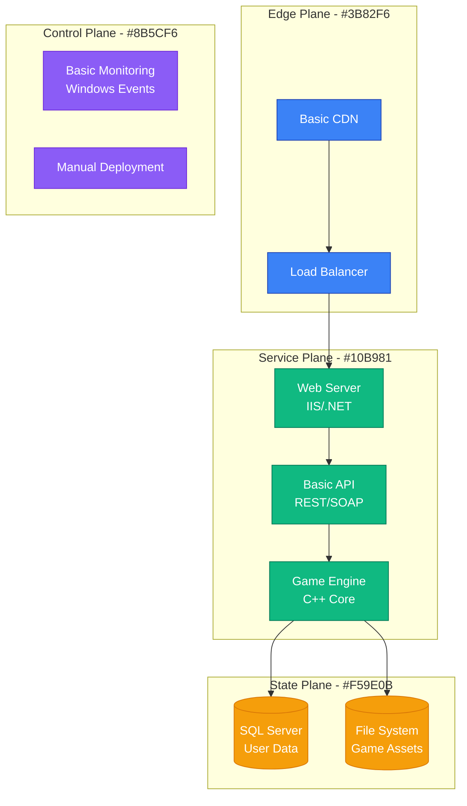
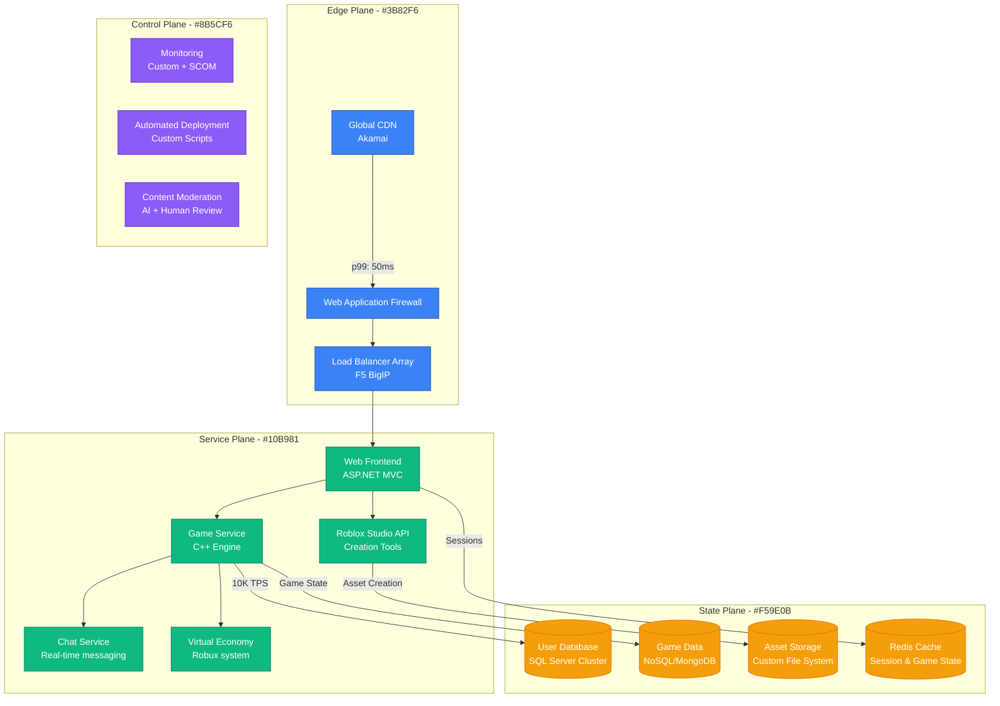
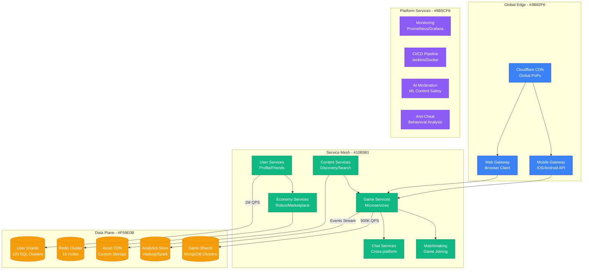
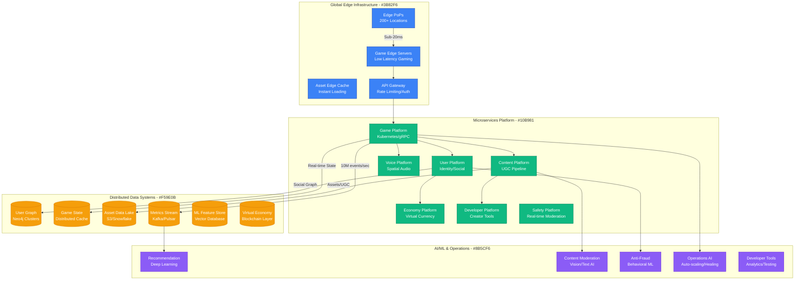
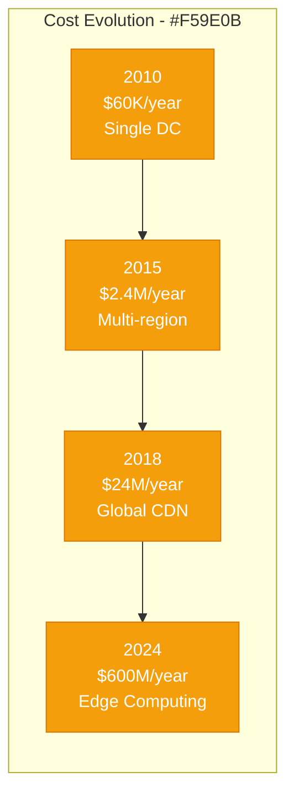

# Roblox: Gaming Platform to 200M Users

## Executive Summary

Roblox's scaling journey from a small gaming platform to hosting 200+ million monthly active users represents one of the most successful UGC (User-Generated Content) platform transformations. This case study examines their evolution from 2006 to 2024, focusing on the unique challenges of scaling a platform where users both consume and create content.

## Scale Milestones

| Milestone | Year | MAU | Key Challenge | Solution | Infrastructure Cost |
|-----------|------|-----|---------------|----------|-------------------|
| Concept | 2006 | 1K | Basic gameplay | Single monolith | $500/month |
| Community | 2010 | 100K | User content | Basic CDN | $5K/month |
| Viral Growth | 2015 | 10M | Content discovery | Recommendation engine | $200K/month |
| Mobile Boom | 2018 | 100M | Cross-platform sync | Global infrastructure | $2M/month |
| Metaverse | 2024 | 200M+ | Virtual economy | Edge computing | $50M/month |

## Architecture Evolution

### Phase 1: Simple Gaming Platform (2006-2010)
*Scale: 1K → 100K users*

**Key Metrics (2010)**:
- Concurrent Users: 5,000
- Game Worlds: 10,000
- Data Transfer: 1TB/month
- Infrastructure: Single data center

### Phase 2: User-Generated Content Platform (2010-2015)
*Scale: 100K → 10M users*

**Key Metrics (2015)**:
- Concurrent Users: 500,000
- User-Created Games: 1M+
- Asset Uploads: 100K/day
- Revenue: $50M/year

### Phase 3: Mobile-First Gaming (2015-2018)
*Scale: 10M → 100M users*

**Breakthrough Moment**: Mobile launch in 2012 drove 10x growth. Cross-platform play required complete rewrite of networking layer.

**Key Metrics (2018)**:
- Peak Concurrent: 2.5M users
- Mobile Users: 70% of total
- Games Created: 40M+
- Infrastructure: 5 global regions

### Phase 4: Metaverse Platform (2018-2024)
*Scale: 100M → 200M+ users*

**Current Metrics (2024)**:
- Peak Concurrent: 7M+ users
- Developer Payouts: $500M+/year
- Games Available: 40M+
- Global Infrastructure: 15 regions

## Critical Scale Events

### The Developer Economy Launch (2013)
**Challenge**: How to monetize user-generated content while keeping creators engaged.

**Solution**: Revolutionary DevEx (Developer Exchange) program allowing creators to cash out Robux for real money.

**Result**: Developer payouts grew from $0 to $500M+/year.

### Mobile Performance Crisis (2016)
**Challenge**: Mobile devices couldn't handle complex games, leading to crashes and poor performance.

**Innovation**:
- Dynamic quality scaling based on device capabilities
- Aggressive asset compression and streaming
- Cloud-based physics computation for complex games

### Content Moderation at Scale (2018)
**Challenge**: Moderating millions of user-created assets daily with child safety as priority.

**Solution**:
- AI-first moderation pipeline processing 100M+ assets/day
- Human review for edge cases
- Proactive content scanning using computer vision
- Real-time chat moderation with context awareness

### Real-Time Voice Implementation (2021)
**Challenge**: Adding spatial voice chat to games with millions of concurrent users.

**Breakthrough**: Edge-computed spatial audio with sub-50ms latency globally.

## Technology Evolution

### Programming Languages
- **2006-2010**: C++ game engine, C# web services
- **2010-2015**: Added Lua scripting for user games
- **2015-2020**: Go microservices, Python ML pipeline
- **2020-2024**: Rust for performance-critical systems

### Infrastructure Philosophy
- **Phase 1**: "Build everything custom"
- **Phase 2**: "Best-of-breed solutions"
- **Phase 3**: "Cloud-native hybrid"
- **Phase 4**: "Edge-first architecture"

### Data Strategy Evolution
- **2006-2012**: Relational everything
- **2012-2018**: Polyglot persistence
- **2018-2022**: Event-driven architecture
- **2022-2024**: Real-time data mesh

## Financial Impact

### Infrastructure Costs by Phase

### Revenue Growth
- **2013**: $12M (DevEx launch)
- **2018**: $325M (Mobile boom)
- **2021**: $1.9B (Pandemic growth)
- **2024**: $3.0B+ (Metaverse positioning)

## Lessons Learned

### What Worked
1. **User-Generated Content Flywheel**: The more creators, the more content, the more players
2. **Developer Economy**: Paying creators created sustainable ecosystem
3. **Cross-Platform from Day 1**: Mobile-first approach paid dividends
4. **Safety-First Culture**: Aggressive moderation built parent trust

### What Didn't Work
1. **Custom Everything**: Over-engineering led to technical debt
2. **Monolithic Game Engine**: Scaling bottlenecks required complete rewrite
3. **Single Points of Failure**: Several major outages during peak growth
4. **Underestimating Mobile**: Late mobile optimization cost market share

### Key Technical Decisions
1. **Lua Scripting**: Enabled user creativity while maintaining security
2. **Edge Computing**: Sub-50ms latency globally for real-time games
3. **AI-First Moderation**: Only way to scale content safety
4. **Microservices**: Essential for team scaling and deployment velocity

## Current Architecture (2024)

**Global Infrastructure**:
- 200+ edge locations worldwide
- 15 core data center regions
- 1PB+ of user-generated content
- 50M+ hours of gameplay daily

**Key Technologies**:
- Kubernetes for orchestration
- gRPC for service communication
- Kafka/Pulsar for event streaming
- Custom game engine (C++/Rust)
- AI/ML stack (PyTorch/TensorFlow)

**Operating Metrics**:
- 99.95% uptime SLA
- Sub-20ms game latency globally
- 10M+ events processed per second
- $50M+ monthly infrastructure spend

## Looking Forward: Next 5 Years

### Predicted Challenges
1. **AI-Generated Content**: Managing quality and authenticity
2. **VR/AR Integration**: Hardware performance limitations
3. **Regulatory Compliance**: Global child safety regulations
4. **Carbon Footprint**: Sustainable computing at scale

### Technical Roadmap
1. **Edge AI**: Moving ML inference to edge for sub-10ms responses
2. **Immersive Experiences**: Native VR/AR game support
3. **Blockchain Integration**: True digital ownership for virtual assets
4. **Quantum-Ready Security**: Preparing for post-quantum cryptography

**Summary**: Roblox's journey demonstrates that UGC platforms require fundamentally different scaling approaches compared to traditional applications. The key is building systems that scale both technically and economically while maintaining safety and quality standards.