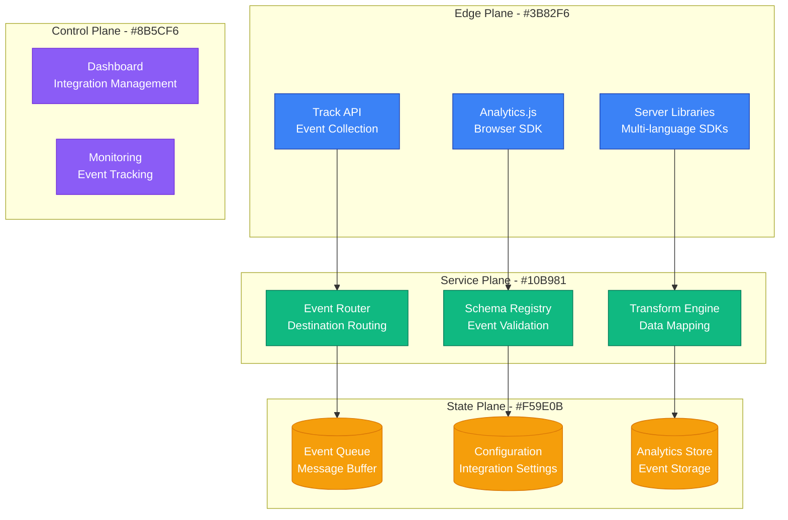
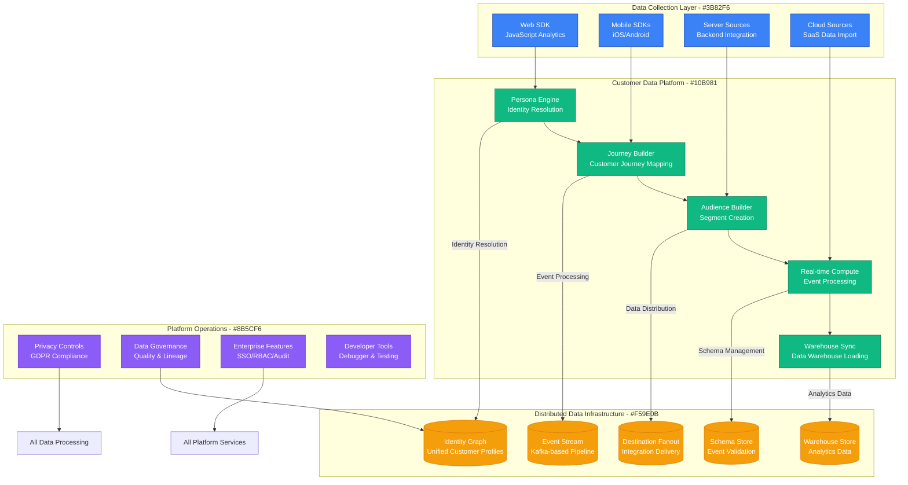
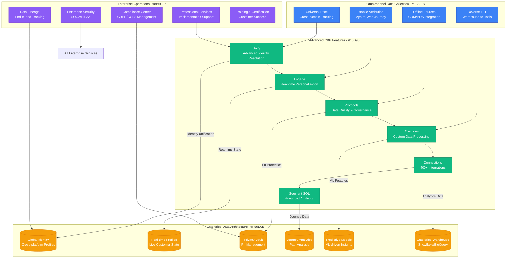
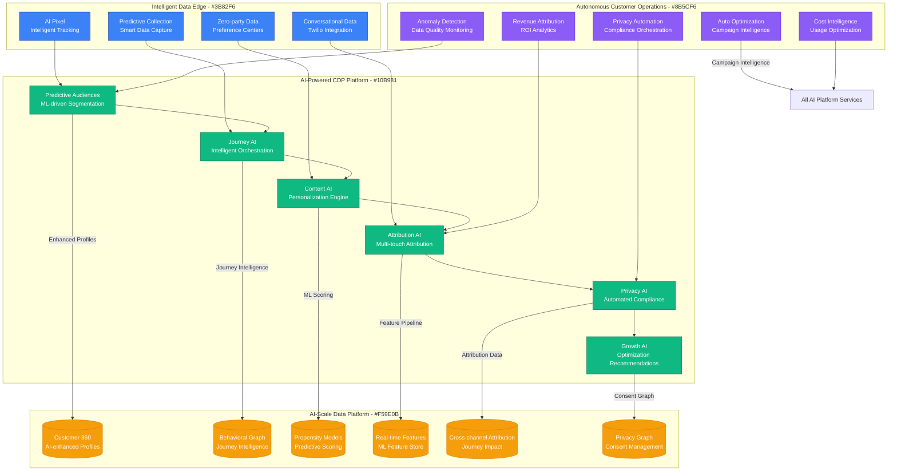
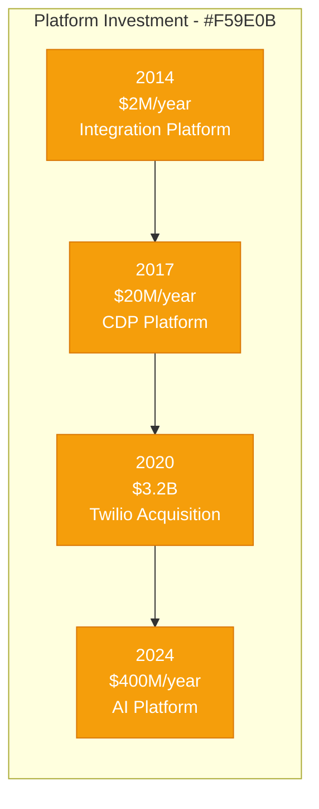

# Segment: Customer Data Platform Scale

## Executive Summary

Segment's scaling journey from a simple analytics API to a comprehensive customer data platform serving 25,000+ companies represents one of the most successful data infrastructure transformations in marketing technology. This case study examines their evolution from 2011 to 2024, focusing on the unique challenges of scaling a customer data platform that processes 1 trillion+ events monthly while maintaining real-time data delivery and supporting 400+ integrations across the entire marketing and analytics ecosystem.

## Scale Milestones

| Milestone | Year | Customers | Key Challenge | Solution | Events/Month |
|-----------|------|-----------|---------------|----------|--------------|
| Analytics API | 2011 | 100 | Developer adoption | Simple integration API | 10M |
| Multi-Tool Hub | 2014 | 5K | Integration complexity | Unified customer data | 1B |
| Enterprise CDP | 2017 | 15K | Enterprise features | Privacy & governance | 100B |
| Twilio Acquisition | 2020 | 20K | Platform scaling | Communications integration | 500B |
| AI-Enhanced CDP | 2024 | 25K+ | Real-time AI | Intelligent customer data | 1T+ |

## Architecture Evolution

### Phase 1: Analytics Integration API (2011-2014)
*Scale: 100 → 5K customers*

**Key Metrics (2014)**:
- Integrations: 50+
- Events/Month: 1B
- Customers: 5,000
- API Response Time: <100ms

### Phase 2: Customer Data Infrastructure (2014-2017)
*Scale: 5K → 15K customers*

**Breakthrough Moment**: Personas launch in 2016 enabled real-time identity resolution and unified customer profiles.

**Key Metrics (2017)**:
- Integrations: 200+
- Events/Month: 100B
- Customers: 15,000
- Identity Resolution: 95% accuracy

### Phase 3: Enterprise Customer Data Platform (2017-2020)
*Scale: 15K → 20K customers*

**Key Innovation**: Protocols product ensured data quality and governance at enterprise scale.

**Key Metrics (2020)**:
- Integrations: 400+
- Events/Month: 500B
- Enterprise Customers: 5,000+
- Real-time Processing: <100ms latency

### Phase 4: AI-Enhanced Customer Intelligence (2020-2024)
*Scale: 20K → 25K+ customers*

**Current Metrics (2024)**:
- Events/Month: 1T+
- Real-time Processing: <50ms
- ML Predictions: 10B+/day
- Revenue Attributed: $50B+ annually

## Critical Scale Events

### The Integration Explosion (2014)
**Challenge**: Every new analytics tool required custom integration development.

**Solution**: Unified API that sends data to 50+ destinations with single integration.

**Impact**: Became central hub for entire marketing technology stack.

### Identity Resolution Breakthrough (2016)
**Challenge**: Customers existed as fragmented identities across tools and touchpoints.

**Innovation**: Personas product that resolved identities across devices and platforms.

**Result**: Enabled unified customer view and real-time personalization.

### Enterprise Privacy Challenge (2018)
**Challenge**: GDPR and privacy regulations required sophisticated consent management.

**Solution**: Protocols product with automated privacy compliance and data governance.

### Twilio Acquisition (2020)
**Challenge**: Customer data platform needed communication activation layer.

**Solution**: $3.2B acquisition provided SMS, email, and voice activation channels.

### Real-Time AI Integration (2022)
**Challenge**: Customers needed real-time AI insights and predictions.

**Breakthrough**: Native ML capabilities with sub-50ms prediction serving.

## Technology Evolution

### Data Processing Architecture
- **2011-2014**: Simple API routing
- **2014-2017**: Real-time stream processing
- **2017-2020**: Enterprise data pipeline
- **2020-2024**: AI-enhanced data intelligence

### Identity Resolution
- **Phase 1**: Basic user identification
- **Phase 2**: Cross-device identity stitching
- **Phase 3**: Advanced probabilistic matching
- **Phase 4**: AI-powered identity intelligence

### Platform Strategy
- **Phase 1**: "Analytics integration hub"
- **Phase 2**: "Customer data infrastructure"
- **Phase 3**: "Enterprise customer data platform"
- **Phase 4**: "AI-powered customer intelligence"

## Financial Impact

### Infrastructure Investment by Phase

### Revenue Milestones
- **2014**: $5M ARR (integration platform)
- **2017**: $100M ARR (CDP breakthrough)
- **2020**: $200M ARR (pre-acquisition)
- **2024**: Part of $4B+ Twilio revenue

### Unit Economics (Pre-acquisition)
- **Gross Margin**: 75%+ (software platform)
- **Customer LTV**: $500K+ (enterprise)
- **Net Revenue Retention**: 130%+
- **CAC Payback**: 18 months

## Lessons Learned

### What Worked
1. **Single API Strategy**: Unified integration reduced complexity dramatically
2. **Developer Experience**: Excellent SDKs and documentation drove adoption
3. **Privacy-First Approach**: Early privacy compliance became competitive advantage
4. **Enterprise Focus**: Built enterprise features that enabled large deal expansion

### What Didn't Work
1. **Consumer Market**: Never successfully penetrated SMB/consumer segment
2. **Activation Features**: Late addition of activation capabilities vs data collection
3. **Pricing Complexity**: Volume-based pricing became expensive for high-traffic customers
4. **International Expansion**: Slower international growth due to privacy complexity

### Key Technical Decisions
1. **Event-Driven Architecture**: Enabled real-time processing and low latency
2. **Schema Registry**: Enforced data quality from day one
3. **Multi-tenant Infrastructure**: Supported massive customer scaling
4. **Privacy by Design**: Built compliance into core architecture

## Current Architecture (2024, Post-Twilio)

**Global Infrastructure**:
- 1T+ events processed monthly
- Sub-50ms real-time processing
- 400+ integrations maintained
- 99.9% uptime SLA

**Key Technologies**:
- Kafka (event streaming)
- Kubernetes (container orchestration)
- PostgreSQL (metadata storage)
- Redis (real-time caching)
- TensorFlow (ML/AI models)

**Operating Metrics**:
- 25,000+ customers
- 1T+ events monthly
- 10B+ ML predictions daily
- Part of $4B+ combined platform revenue

## Looking Forward: Next 5 Years (As Part of Twilio)

### Predicted Challenges
1. **Real-Time AI**: Sub-millisecond AI predictions at trillion-event scale
2. **Privacy Evolution**: Cookieless future and enhanced privacy regulations
3. **Cost Management**: Event processing costs scaling with data volume
4. **Competition**: Cloud providers building competing CDP services

### Technical Roadmap
1. **Conversational Commerce**: Voice and chat-based customer interactions
2. **Zero-Party Data Platform**: Direct customer preference and intent collection
3. **Autonomous Marketing**: AI-driven campaign optimization and execution
4. **Edge Customer Intelligence**: Real-time personalization at network edge

**Summary**: Segment's evolution from an analytics integration API to an AI-enhanced customer data platform demonstrates the power of solving infrastructure problems that enable entire ecosystems. Their success came from making customer data collection and activation dramatically simpler while building enterprise-grade privacy and governance capabilities. The Twilio acquisition provided the communication channels needed to close the loop from data insights to customer engagement, creating a comprehensive customer engagement platform.