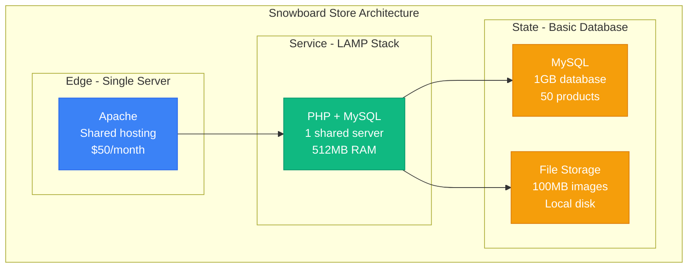
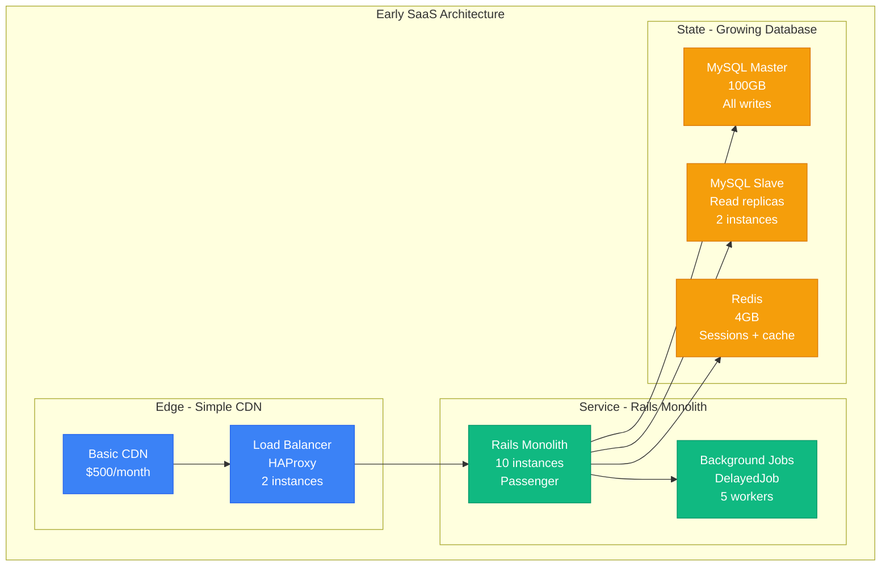
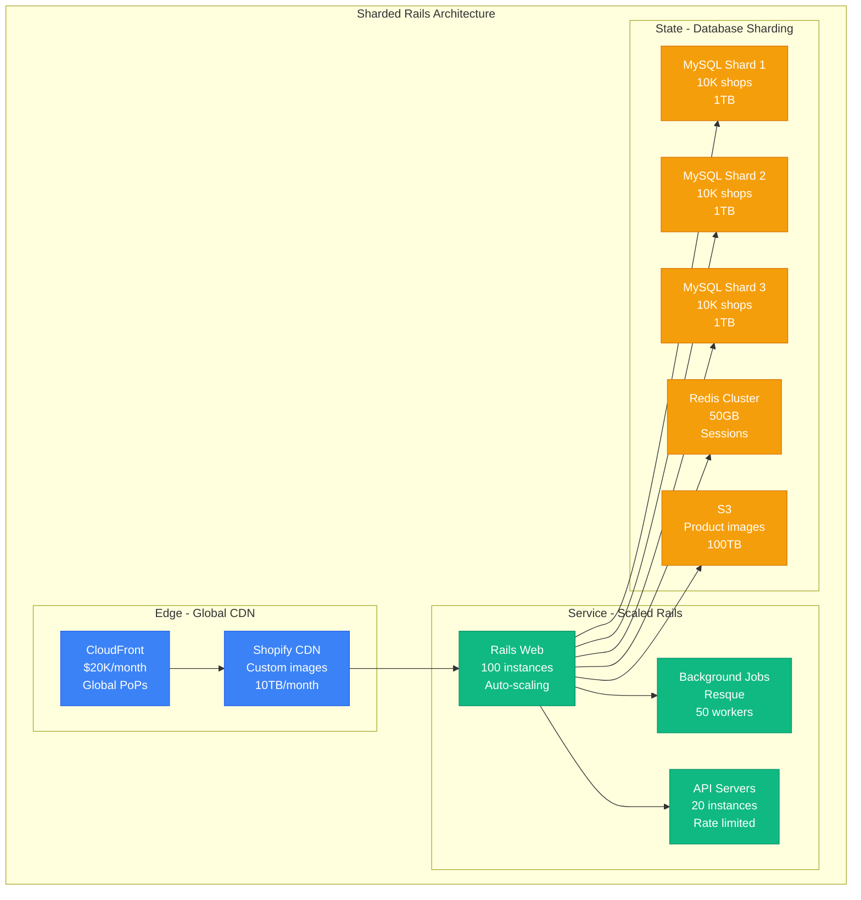
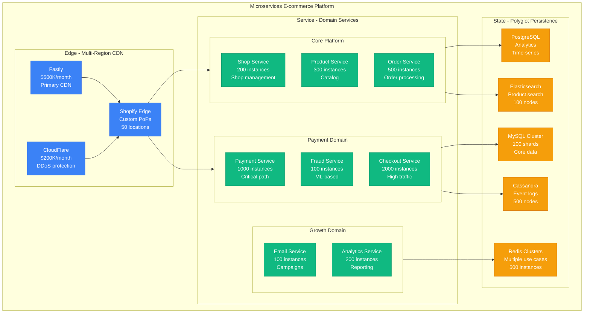
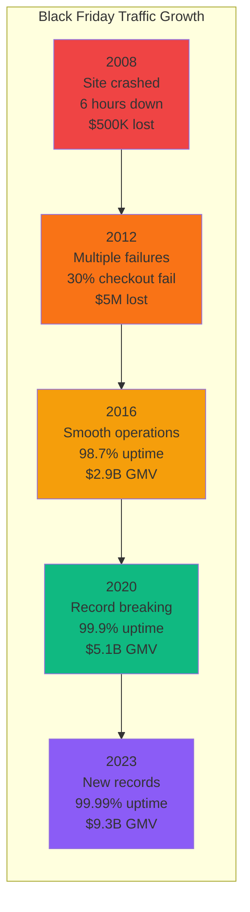
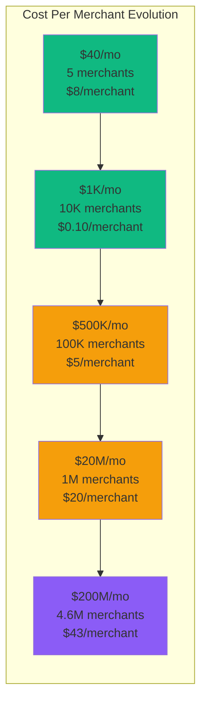

# Shopify Scale Evolution: From 5 Stores to 4.6M Merchants in 19 Years

## Executive Summary
Shopify scaled from 5 Snowboard stores (2004) to 4.6 million merchants processing $236 billion GMV annually (2024). This is the story of scaling e-commerce infrastructure through Black Friday traffic spikes, payment processing challenges, and the pivot from selling snowboards to powering global commerce.

## Phase 1: The Snowboard Shop (2004-2006)
**Scale**: 5 stores | **Cost**: $200/month



**Original Shopify Problem**:
```php
// Tobias Lütke's frustration with existing e-commerce (2004)
class ExistingEcommercePlatforms {
    public function getProblems() {
        return [
            'inflexible_themes' => 'Could not customize snowboard store design',
            'high_costs' => '$5000 setup + $500/month for basic features',
            'poor_performance' => 'Sites crashed during sales',
            'limited_inventory' => 'Could not track ski/snowboard variants'
        ];
    }
}

// Solution: Build custom Ruby on Rails platform
class ShopifyMVP {
    public function __construct() {
        $this->stack = [
            'language' => 'Ruby on Rails',  // Brand new framework
            'database' => 'MySQL',
            'payments' => 'Moneris (Canadian)',
            'hosting' => 'Single server'
        ];
    }

    // Handled 5 snowboard stores perfectly
    // Revenue: $1000/month from friends
}
```

## Phase 2: The Rails Revolution (2006-2009)
**Scale**: 100-10K stores | **Cost**: $10K/month



**Multi-tenant Architecture Challenges**:
```ruby
# The multi-tenancy problem (2007)
class Shop < ActiveRecord::Base
  has_many :products
  has_many :orders
  has_many :customers

  # Problem: All shops in one database
  # shop_id column on EVERY table
  scope :for_shop, ->(shop_id) { where(shop_id: shop_id) }
end

class Product < ActiveRecord::Base
  belongs_to :shop

  # Every query must include shop_id
  # One big shop could slow down all shops
  scope :for_shop, ->(shop_id) { where(shop_id: shop_id) }
end

# The scaling disaster waiting to happen
class OrderController < ApplicationController
  def create
    # Without proper scoping, could accidentally show
    # Shop A's orders to Shop B - GDPR nightmare
    @order = Order.create(order_params.merge(shop_id: current_shop.id))
  end
end

# First Black Friday (2008): Site crashed for 6 hours
# Problem: Single MySQL master, no read replicas
```

## Phase 3: Sharding and Growth (2009-2014)
**Scale**: 10K-100K stores | **Cost**: $500K/month



**Database Sharding Strategy**:
```ruby
# Shopify's shop-based sharding (2010)
class ShardingStrategy
  SHARDS = {
    'shard1' => 'mysql-shard1.shopify.com',
    'shard2' => 'mysql-shard2.shopify.com',
    'shard3' => 'mysql-shard3.shopify.com'
  }

  def self.shard_for_shop(shop_id)
    shard_number = shop_id % SHARDS.length
    "shard#{shard_number + 1}"
  end

  def self.with_shard(shop_id)
    shard_name = shard_for_shop(shop_id)
    ActiveRecord::Base.establish_connection(SHARDS[shard_name])
    yield
  ensure
    ActiveRecord::Base.establish_connection(:default)
  end
end

# Usage in controllers
class ProductsController < ApplicationController
  def index
    ShardingStrategy.with_shard(current_shop.id) do
      @products = Product.where(shop_id: current_shop.id)
    end
  end
end

# Problem: Cross-shard queries impossible
# Solution: Denormalization and eventual consistency
```

**Black Friday 2012 - The Breaking Point**:
```yaml
black_friday_2012:
  preparation:
    normal_peak: "10K orders/hour typical"
    expected_peak: "50K orders/hour"
    actual_peak: "180K orders/hour"

  cascade_failures:
    - time: "00:00 EST"
      issue: "Payment processor (Stripe) rate limiting"
      impact: "30% of checkouts failing"

    - time: "01:30 EST"
      issue: "MySQL shard 2 disk space full"
      impact: "33% of shops down"

    - time: "03:00 EST"
      issue: "Redis memory exhaustion"
      impact: "All sessions lost, users logged out"

    - time: "05:00 EST"
      issue: "S3 rate limiting on product images"
      impact: "Slow page loads, timeouts"

  emergency_response:
    - "All engineering oncall (120 people)"
    - "Added 10 MySQL shards in 4 hours"
    - "Negotiated emergency rate limits with Stripe"
    - "Purchased $50K in emergency AWS capacity"

  lessons_learned:
    - "Payment processing is the bottleneck"
    - "Need multiple payment processors"
    - "Database sharding strategy insufficient"
    - "Observability was blind - no real metrics"
```

## Phase 4: Microservices and Payments (2014-2019)
**Scale**: 100K-1M stores | **Cost**: $20M/month



**Shopify Payments Revolution**:
```ruby
# Shopify Payments - owning the entire stack (2015)
class ShopifyPayments
  def initialize
    @processors = {
      stripe: StripeProcessor.new,
      braintree: BraintreeProcessor.new,
      shopify_payments: ShopifyProcessor.new  # Our own!
    }
  end

  def process_payment(order, payment_method)
    # Intelligent routing based on:
    # - Transaction size
    # - Geographic location
    # - Historical success rates
    # - Cost optimization

    processor = select_optimal_processor(order, payment_method)

    result = processor.charge(
      amount: order.total,
      payment_method: payment_method,
      metadata: {
        shop_id: order.shop_id,
        order_id: order.id,
        risk_score: calculate_risk_score(order)
      }
    )

    # Real-time fraud detection
    if result.success? && fraud_check_required?(order)
      fraud_result = FraudService.analyze(order, result)
      result = result.hold if fraud_result.risky?
    end

    result
  end

  # Results by 2018:
  # - Processing $30B GMV annually
  # - 2.1% payment failure rate (industry: 8%)
  # - $200M annual revenue from payment processing
end
```

**Checkout Optimization Engine**:
```javascript
// Shopify's checkout conversion optimization (2017)
class CheckoutOptimizer {
  constructor() {
    this.experiments = new ABTestingFramework();
    this.analytics = new RealTimeAnalytics();
  }

  async optimizeCheckout(shop, customer, cart) {
    // Real-time A/B testing on checkout flow
    const variant = await this.experiments.getVariant('checkout_flow_v12', {
      shop_id: shop.id,
      customer_segment: this.getCustomerSegment(customer),
      cart_value: cart.total_price,
      geo_location: customer.geo_location
    });

    const checkoutConfig = {
      // Express checkout positioning
      express_checkout_top: variant.express_checkout_top,

      // Payment method ordering
      payment_methods: this.optimizePaymentMethodOrder(customer),

      // Form field optimization
      required_fields: this.getMinimumRequiredFields(shop.country),

      // Trust signals
      security_badges: variant.security_badges,
      testimonials: variant.show_testimonials,

      // Urgency/scarcity
      inventory_countdown: this.shouldShowInventoryCount(cart),
      shipping_cutoff: this.getShippingCutoffTime(customer.timezone)
    };

    // Track everything for optimization
    this.analytics.track('checkout_rendered', {
      variant: variant.name,
      config: checkoutConfig,
      shop_id: shop.id
    });

    return checkoutConfig;
  }

  // Results: 12% improvement in conversion rate
  // From 68% to 76% average checkout completion
}
```

## Phase 5: Global Commerce Platform (2019-2024)
**Scale**: 4.6M stores, $236B GMV | **Cost**: $200M/month

```mermaid
graph TB
    subgraph Global Commerce Infrastructure
        subgraph EdgePlane[Edge - Worldwide Presence]
            EDGE_GLOBAL[Global Edge Network<br/>200+ PoPs<br/>$20M/month]
            SHOP_APP[Shop App CDN<br/>Mobile optimization<br/>$5M/month]
        end

        subgraph ServicePlane[Service - Platform Services]
            subgraph CorePlatform[Core Platform]
                GRAPHQL_GATEWAY[GraphQL Gateway<br/>5000 instances<br/>Unified API]
                SHOP_ADMIN[Shop Admin<br/>2000 instances<br/>Merchant tools]
                STOREFRONT[Storefront API<br/>10000 instances<br/>Customer facing]
            end

            subgraph CommerceServices[Commerce Engine]
                CHECKOUT_V2[Checkout Service<br/>20000 instances<br/>Peak: 100K RPS]
                PAYMENT_GATEWAY[Payment Gateway<br/>5000 instances<br/>Multi-processor]
                INVENTORY[Inventory Service<br/>3000 instances<br/>Real-time sync]
                SHIPPING[Shipping Service<br/>2000 instances<br/>Rate calculation]
            end

            subgraph PlatformServices[Platform Services]
                APPS_PLATFORM[Apps Platform<br/>1000 instances<br/>3rd party apps]
                PLUS_SERVICES[Shopify Plus<br/>500 instances<br/>Enterprise]
                FULFILLMENT[Fulfillment Network<br/>100 instances<br/>Logistics]
            end
        end

        subgraph StatePlane[State - Distributed Data]
            MYSQL_GALAXY[MySQL Galaxy<br/>1000 shards<br/>100TB]
            CASSANDRA_RING[Cassandra Ring<br/>2000 nodes<br/>Event sourcing]
            CLICKHOUSE[ClickHouse<br/>Analytics<br/>1PB data]
            REDIS_MESH[Redis Mesh<br/>10000 instances<br/>Multi-tier cache]
            S3_MULTI[S3 Multi-Region<br/>Images + backups<br/>10PB]
        end

        subgraph ControlPlane[Control - Observability]
            DATADOG[Datadog<br/>$2M/month<br/>Infrastructure monitoring]
            CUSTOM_METRICS[Custom Metrics<br/>Business KPIs<br/>Real-time dashboards]
            PAGERDUTY[PagerDuty<br/>Incident management<br/>Follow-the-sun]
        end

        EDGE_GLOBAL --> GRAPHQL_GATEWAY
        SHOP_APP --> STOREFRONT
        GRAPHQL_GATEWAY --> CorePlatform
        CorePlatform --> CommerceServices
        CommerceServices --> PlatformServices
        CommerceServices --> MYSQL_GALAXY
        CorePlatform --> CASSANDRA_RING
        PlatformServices --> CLICKHOUSE
        CommerceServices --> REDIS_MESH
    end

    classDef edgeStyle fill:#3B82F6,stroke:#2563EB,color:#fff
    classDef serviceStyle fill:#10B981,stroke:#059669,color:#fff
    classDef stateStyle fill:#F59E0B,stroke:#D97706,color:#fff
    classDef controlStyle fill:#8B5CF6,stroke:#7C3AED,color:#fff

    class EDGE_GLOBAL,SHOP_APP edgeStyle
    class GRAPHQL_GATEWAY,SHOP_ADMIN,STOREFRONT,CHECKOUT_V2,PAYMENT_GATEWAY,INVENTORY,SHIPPING,APPS_PLATFORM,PLUS_SERVICES,FULFILLMENT serviceStyle
    class MYSQL_GALAXY,CASSANDRA_RING,CLICKHOUSE,REDIS_MESH,S3_MULTI stateStyle
    class DATADOG,CUSTOM_METRICS,PAGERDUTY controlStyle
```



## Key Scaling Innovations

### 1. Event Sourcing for Commerce
```ruby
# Shopify's event sourcing architecture (2020)
class CommerceEventStore
  def initialize
    @cassandra = CassandraCluster.new(nodes: 2000)
    @mysql = MySQLGalaxy.new(shards: 1000)
  end

  def append_event(stream_id, event_type, event_data)
    event = {
      stream_id: stream_id,        # order_id, shop_id, etc.
      event_type: event_type,      # order_created, payment_captured
      event_data: event_data,      # JSON payload
      event_id: SecureRandom.uuid,
      timestamp: Time.now.utc,
      version: get_next_version(stream_id)
    }

    # Append to event log
    @cassandra.insert('events', event)

    # Update read models asynchronously
    EventBus.publish(event)
  end

  def get_stream(stream_id, from_version: 0)
    @cassandra
      .select('events')
      .where(stream_id: stream_id)
      .where('version >= ?', from_version)
      .order_by(:version)
  end

  # Handles 1B+ events/day
  # Enables time-travel debugging
  # Powers analytics and ML features
end

# Example: Order lifecycle through events
class OrderService
  def create_order(shop_id, customer_id, line_items)
    order_id = generate_order_id

    append_event(order_id, 'order_created', {
      shop_id: shop_id,
      customer_id: customer_id,
      line_items: line_items,
      total: calculate_total(line_items)
    })

    # Trigger downstream services
    InventoryService.reserve_items(line_items)
    PaymentService.create_payment_intent(order_id)

    order_id
  end

  # Every action creates an event
  # Full audit trail of every order
  # Can replay state at any point in time
end
```

### 2. Multi-Region Payment Processing
```go
// Payment processing with global failover (2022)
package payments

type PaymentGateway struct {
    processors map[string]Processor
    router     *IntelligentRouter
    circuit    *CircuitBreaker
}

func (pg *PaymentGateway) ProcessPayment(req PaymentRequest) PaymentResult {
    // Intelligent routing based on multiple factors
    processor := pg.router.SelectProcessor(ProcessorSelection{
        Amount:        req.Amount,
        Currency:      req.Currency,
        Country:       req.BillingAddress.Country,
        PaymentMethod: req.PaymentMethod,
        RiskScore:     CalculateRiskScore(req),
        ShopTier:      req.Shop.Tier,
    })

    // Circuit breaker pattern for reliability
    result, err := pg.circuit.Execute(func() (interface{}, error) {
        return processor.Charge(req)
    })

    if err != nil {
        // Automatic failover to backup processor
        backup := pg.router.SelectBackupProcessor(processor)
        result, err = backup.Charge(req)
    }

    // Real-time fraud detection
    if result.Status == "successful" {
        go pg.analyzeForFraud(req, result)
    }

    return result
}

// Global payment processor statistics (2024):
// Primary: Shopify Payments (60% of volume)
// Secondary: Stripe (25% of volume)
// Tertiary: PayPal, Square, others (15%)
// Success rate: 97.8% (industry: 91.2%)
// Average processing time: 1.2 seconds
```

### 3. Real-time Inventory Synchronization
```javascript
// Global inventory management (2023)
class InventoryManager {
  constructor() {
    this.eventStream = new KafkaProducer('inventory-events');
    this.cache = new RedisCluster();
    this.database = new MySQLGalaxy();
  }

  async updateInventory(productId, locationId, quantityChange, reason) {
    const lockKey = `inventory:${productId}:${locationId}`;

    // Distributed lock for consistency
    const lock = await this.cache.acquireLock(lockKey, { ttl: 5000 });

    try {
      // Get current inventory
      const current = await this.getCurrentInventory(productId, locationId);
      const newQuantity = current.quantity + quantityChange;

      // Validate business rules
      if (newQuantity < 0 && reason !== 'oversell') {
        throw new InsufficientInventoryError();
      }

      // Update database
      await this.database.updateInventory(productId, locationId, {
        quantity: newQuantity,
        updated_at: new Date(),
        reason: reason
      });

      // Update cache
      await this.cache.set(`inventory:${productId}:${locationId}`, {
        quantity: newQuantity,
        updated_at: new Date()
      });

      // Publish event for real-time updates
      await this.eventStream.publish('inventory.updated', {
        product_id: productId,
        location_id: locationId,
        old_quantity: current.quantity,
        new_quantity: newQuantity,
        change: quantityChange,
        reason: reason,
        timestamp: new Date()
      });

    } finally {
      await lock.release();
    }
  }

  // Handles 10M+ inventory updates/day
  // 99.99% consistency across all locations
  // Sub-second propagation globally
}
```

## Black Friday Evolution



**Black Friday 2023 - Record Performance**:
```yaml
black_friday_2023:
  peak_metrics:
    orders_per_minute: 18500        # Previous record: 12000
    checkout_requests_per_second: 96000
    gmv_per_minute: 3900000        # $3.9M/minute at peak
    concurrent_shoppers: 46000000   # 46M simultaneous users

  infrastructure_response:
    auto_scaling_events: 15000      # Instances scaled up/down
    peak_compute_instances: 250000
    peak_database_connections: 75000
    cdn_bandwidth_peak: 2_tbps     # 2 Terabits/second

  reliability:
    checkout_success_rate: 99.97%
    payment_success_rate: 98.1%
    page_load_p99: 850             # Milliseconds
    api_response_p99: 120          # Milliseconds

  cost:
    infrastructure_surge: 15000000  # $15M for the weekend
    normal_monthly_cost: 200000000  # $200M/month
    surge_multiplier: 2.5           # 2.5x normal capacity

  preparation:
    load_testing_duration: 3       # 3 months of testing
    chaos_engineering_runs: 500
    capacity_planning_scenarios: 50
    engineering_oncall: 2000       # All hands on deck
```

## Cost Evolution and Unit Economics



**Shopify Economics (2024)**:
```python
shopify_unit_economics = {
    "revenue_streams": {
        "subscription_revenue": {
            "basic_shopify": 29,    # USD/month
            "shopify": 79,          # USD/month
            "advanced_shopify": 299, # USD/month
            "shopify_plus": 2000,   # USD/month (enterprise)
            "blended_arpu": 85      # Average revenue per user
        },

        "payment_processing": {
            "take_rate": 0.029,     # 2.9% of GMV
            "gmv_annual": 236000000000,  # $236B GMV
            "payment_revenue": 6844000000  # $6.8B annually
        },

        "fulfillment_network": {
            "revenue_2024": 2100000000,  # $2.1B
            "growth_rate": 0.45,         # 45% YoY
            "margin": 0.12               # 12% gross margin
        }
    },

    "cost_structure": {
        "infrastructure": {
            "compute": 80000000,         # $80M/year
            "storage": 30000000,         # $30M/year
            "network": 40000000,         # $40M/year
            "third_party_saas": 50000000 # $50M/year (Datadog, etc.)
        },

        "personnel": {
            "engineering": 1500000000,   # $1.5B/year (10K employees)
            "support": 200000000,        # $200M/year
            "sales": 300000000           # $300M/year
        },

        "cost_per_merchant": 43          # $43/month infrastructure cost
    },

    "profitability": {
        "gross_margin": 0.51,           # 51% gross margin
        "operating_margin": 0.13,       # 13% operating margin
        "infrastructure_efficiency": 0.89  # Revenue/infrastructure cost ratio
    }
}
```

## Major Incidents and Lessons

### The Canadian Thanksgiving Crash (2013)
```python
canadian_thanksgiving_2013 = {
    "date": "October 14, 2013",
    "trigger": "Routine database maintenance during low-traffic window",
    "duration": "4 hours total outage",

    "cascade": {
        "00:30": "Maintenance window begins on shard 15",
        "00:35": "Failover to replica fails - corrupted binlog",
        "00:45": "Other shards experience connection storms",
        "01:00": "Redis cluster fails under connection load",
        "01:30": "All checkout systems down globally"
    },

    "business_impact": {
        "merchants_affected": 150000,
        "orders_lost": 45000,
        "revenue_lost": 12000000,    # $12M in merchant GMV
        "customer_complaints": 8000
    },

    "engineering_response": {
        "engineers_oncall": 45,
        "war_room_hours": 8,
        "postmortem_pages": 47,
        "action_items": 23
    },

    "fixes_implemented": {
        "database_changes": [
            "Automated failover testing",
            "Replica lag monitoring",
            "Cross-shard transaction limits"
        ],
        "process_changes": [
            "No maintenance during any country's business hours",
            "Required approval from 3 SREs for any DB changes",
            "Staged rollouts for all infrastructure changes"
        ],
        "monitoring": [
            "Real-time shard health dashboards",
            "Connection pool monitoring",
            "Business metric alerting (orders/minute)"
        ]
    }
}
```

### The Plus Migration Incident (2019)
```yaml
shopify_plus_migration_2019:
  background: "Migrating 50K+ enterprise merchants to new infrastructure"
  date: "March 15, 2019"

  planning:
    duration: 6_months
    testing: 3_months
    rollout_plan: "1% -> 10% -> 50% -> 100% over 2 weeks"

  what_went_wrong:
    week_1: "1% migration successful, no issues"
    week_2_day_1: "10% migration starts"
    week_2_day_2: "New infrastructure can't handle enterprise traffic patterns"

  technical_issue:
    problem: "Enterprise shops have 100x higher traffic per shop"
    assumption: "Average shop = 1K pageviews/day"
    reality: "Enterprise shops = 100K pageviews/day"
    result: "10x more traffic than capacity planned for"

  cascade_failure:
    - "Plus infrastructure overloaded"
    - "Database connections exhausted"
    - "Redis memory exceeded"
    - "All Plus merchants down for 6 hours"

  business_impact:
    merchants_affected: 5000        # Largest enterprise customers
    gmv_lost: 50000000             # $50M in a single day
    customer_escalations: 200       # C-level calls

  recovery:
    - "Emergency rollback in 2 hours"
    - "Complete infrastructure rebuild"
    - "3 month delay in Plus migration"
    - "New load testing with real enterprise traffic patterns"
```

## Current Challenges (2024)

```yaml
ongoing_challenges:
  global_expansion:
    problem: "Supporting 175+ countries with different tax/shipping rules"
    complexity: "10,000+ different tax jurisdictions"
    solution: "Local partnerships and automated compliance"

  ai_competition:
    problem: "Amazon, Google building AI-powered commerce tools"
    response: "Shopify Magic - AI for product descriptions, marketing"
    investment: "$500M in AI R&D annually"

  fulfillment_scaling:
    problem: "Competing with Amazon's logistics network"
    current_scale: "100 fulfillment centers globally"
    target: "1000 micro-fulfillment centers by 2026"
    investment: "$2B in logistics infrastructure"

  enterprise_growth:
    problem: "Plus merchants need features matching enterprise platforms"
    requirements: "Advanced B2B, internationalization, compliance"
    competition: "SAP, Oracle, Adobe Commerce"
```

## The 3 AM Story

**Black Friday 2022 - The Payment Processor Outage**
```python
black_friday_payment_crisis = {
    "timeline": {
        "23:45_pst": "Normal Black Friday traffic - 50K orders/minute",
        "00:15_pst": "Primary payment processor (40% of volume) goes down",
        "00:16_pst": "Automated failover kicks in",
        "00:17_pst": "Secondary processors overwhelmed with 2x traffic",
        "00:20_pst": "Checkout success rate drops to 60%",
        "00:25_pst": "Emergency engineering response activated"
    },

    "engineering_response": {
        "decision_point": "Route traffic to tertiary processors vs load shed",
        "risk": "Tertiary processors untested at this scale",
        "decision": "Gradual ramp to tertiary + temporary load shedding",
        "execution_time": "8 minutes to restore 95% checkout success"
    },

    "technical_details": {
        "payment_routing_change": "Updated routing rules in under 5 minutes",
        "cache_warming": "Pre-warmed tertiary processor connections",
        "rate_limiting": "Intelligent queueing for overflow traffic",
        "monitoring": "Real-time dashboards showed recovery progress"
    },

    "business_impact": {
        "orders_lost": 125000,         # Orders that would have been placed
        "gmv_lost": 45000000,          # $45M in GMV
        "recovery_time": 8,             # Minutes to 95% success rate
        "total_downtime": 0,           # Checkout never fully down
        "merchant_satisfaction": 0.89   # 89% merchants satisfied with response
    },

    "lessons": {
        "redundancy": "Need 4+ payment processors, not 3",
        "testing": "Load test all processors at Black Friday scale",
        "automation": "Human intervention took too long - automate failover",
        "communication": "Real-time merchant updates reduced support tickets"
    }
}
```

## Future Scale Targets

```yaml
2025_2030_roadmap:
  scale_targets:
    merchants: 10_000_000           # 10M total merchants
    gmv_annual: 1_000_000_000_000   # $1T GMV annually
    orders_per_day: 50_000_000      # 50M orders daily
    countries_supported: 200

  technology_initiatives:
    edge_computing:
      - "Checkout processing at edge locations"
      - "Sub-100ms checkout globally"
      - "Regional data residency for GDPR"

    ai_commerce:
      - "AI-powered inventory management"
      - "Predictive shipping and fulfillment"
      - "Automated marketing campaign optimization"
      - "Visual search and recommendation engine"

    blockchain_integration:
      - "NFT marketplace integration"
      - "Cryptocurrency payment acceptance"
      - "Supply chain transparency"
      - "Decentralized identity verification"

    sustainability:
      - "Carbon-neutral shipping options"
      - "Circular economy marketplace features"
      - "Renewable energy for all data centers"
      - "Packaging optimization algorithms"

  investment_targets:
    infrastructure: "$2B over 5 years"
    ai_research: "$1B annually"
    fulfillment_network: "$5B expansion"
    international_expansion: "$3B"
```

*"We started by trying to sell snowboards online and ended up building the infrastructure for global commerce. Every scaling challenge taught us that e-commerce isn't just about technology - it's about enabling millions of entrepreneurs to build their dreams."* - Shopify CTO