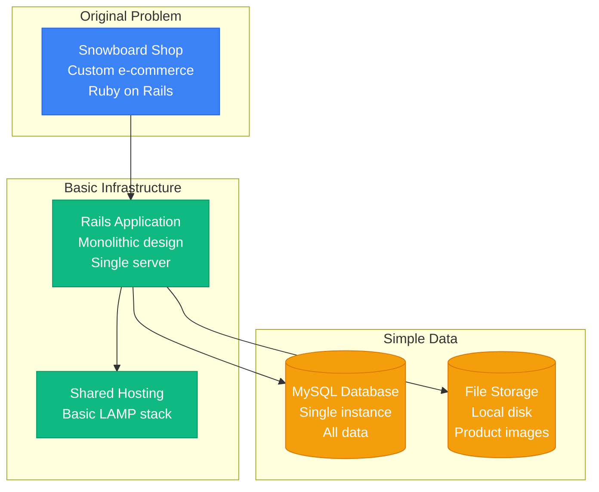
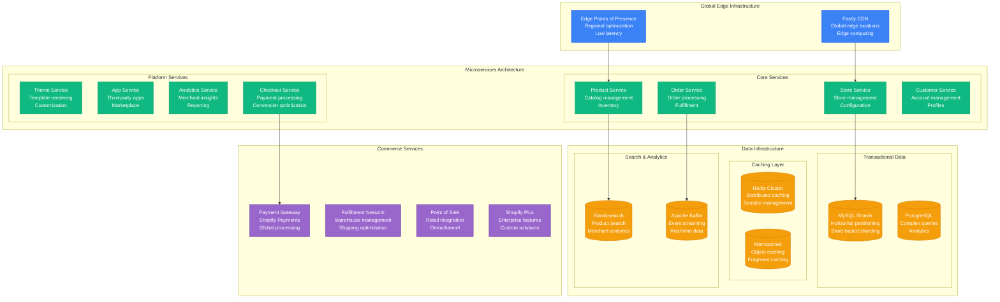
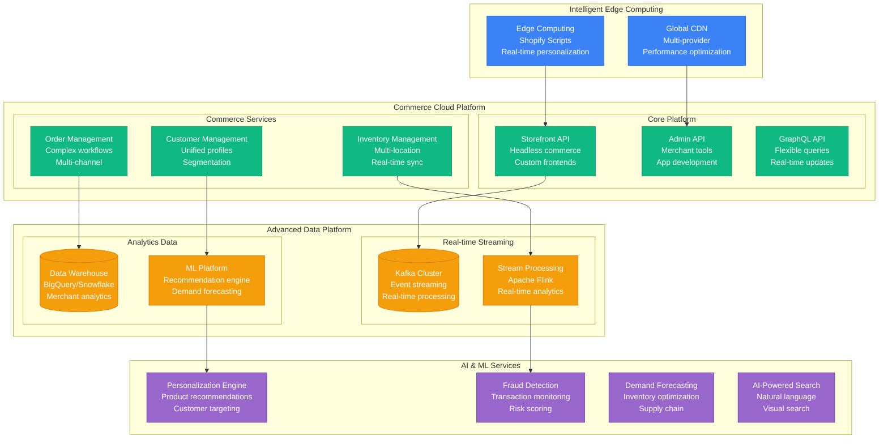

# Shopify Scale Evolution: 5 Stores to 4M Merchants

## Executive Summary

Shopify's scaling journey from hosting 5 stores to powering 4M+ merchants globally represents one of the most successful e-commerce platform scaling stories. The platform evolved from a simple Ruby on Rails application to a comprehensive commerce operating system handling Black Friday traffic spikes and billions in GMV.

**Key Scaling Metrics:**
- **Merchants**: 5 → 4,000,000+ (800,000x growth)
- **GMV**: $0 → $197B+ annually (Gross Merchandise Volume)
- **Stores**: 5 → 4,000,000+ active stores
- **Black Friday Peak**: 0 → 3.5M+ orders/hour
- **Infrastructure cost**: $500/month → $300M+/year
- **Engineering team**: 2 → 10,000+ employees

## Phase 1: Snowboard Shop (2006-2008)
**Scale: 5-100 stores, personal e-commerce**



### Key Insights
- **Multi-tenant from day one** - Single codebase, multiple stores
- **Theme system** - Customizable store designs
- **Simple admin interface** - Non-technical merchants

## Phase 2: SaaS Platform (2008-2012)
**Scale: 100-10K stores, merchant platform**

```mermaid
graph TB
    subgraph EdgeLayer["Edge Layer"]
        CDN[Content Delivery Network<br/>Static assets<br/>Global distribution]
        LB[Load Balancer<br/>Traffic distribution<br/>High availability]
    end

    subgraph ApplicationLayer["Application Layer"]
        WEB_CLUSTER[Web Application Cluster<br/>Rails instances<br/>Auto-scaling]
        ADMIN_CLUSTER[Admin Interface Cluster<br/>Merchant management<br/>Separate scaling]
        API_CLUSTER[API Cluster<br/>Third-party integrations<br/>Rate limiting]
    end

    subgraph DataLayer["Data Layer"]
        MYSQL_MASTER[(MySQL Master<br/>Write operations<br/>ACID compliance)]
        MYSQL_SLAVES[(MySQL Read Replicas<br/>Read scaling<br/>Reporting queries)]
        REDIS[(Redis Cache<br/>Session storage<br/>Fragment caching)]
        S3[(S3 Storage<br/>Media files<br/>Theme assets)]
    end

    subgraph ServiceLayer["Service Layer"]
        PAYMENT[Payment Processing<br/>Multiple gateways<br/>PCI compliance)]
        SHIPPING[Shipping Calculation<br/>Real-time rates<br/>Label printing)]
        EMAIL[Email Service<br/>Transactional emails<br/>Marketing campaigns)]
    end

    CDN --> LB
    LB --> WEB_CLUSTER
    LB --> ADMIN_CLUSTER
    LB --> API_CLUSTER

    WEB_CLUSTER --> MYSQL_MASTER
    ADMIN_CLUSTER --> MYSQL_SLAVES
    API_CLUSTER --> REDIS

    WEB_CLUSTER --> PAYMENT
    WEB_CLUSTER --> SHIPPING
    WEB_CLUSTER --> EMAIL

    MYSQL_MASTER --> MYSQL_SLAVES
    WEB_CLUSTER --> S3

    classDef edgeStyle fill:#3B82F6,stroke:#2563EB,color:#fff
    classDef appStyle fill:#10B981,stroke:#059669,color:#fff
    classDef dataStyle fill:#F59E0B,stroke:#D97706,color:#fff
    classDef serviceStyle fill:#9966CC,stroke:#663399,color:#fff

    class CDN,LB edgeStyle
    class WEB_CLUSTER,ADMIN_CLUSTER,API_CLUSTER appStyle
    class MYSQL_MASTER,MYSQL_SLAVES,REDIS,S3 dataStyle
    class PAYMENT,SHIPPING,EMAIL serviceStyle
```

### Key Features Added
1. **App Store** - Third-party integrations
2. **Payment gateways** - Multiple payment options
3. **Shipping integration** - Real-time shipping rates
4. **Theme marketplace** - Professional designs

### What Broke
- **Database performance** during traffic spikes
- **Shared hosting limitations** with growth
- **Monolithic deployment** complexity

## Phase 3: Global Commerce (2012-2016)
**Scale: 10K-100K stores, international expansion**



### Major Platform Evolution
1. **Shopify Plus** - Enterprise e-commerce platform
2. **Shopify Payments** - Integrated payment processing
3. **Shopify POS** - Retail point-of-sale system
4. **International expansion** - Multi-currency, localization

### Black Friday Challenges
- **Traffic spikes** of 100x normal volume
- **Database hotspots** during flash sales
- **Payment processing** bottlenecks

## Phase 4: Commerce Operating System (2016-2020)
**Scale: 100K-1M stores, omnichannel commerce**

### Advanced Platform Architecture


### Omnichannel Features
1. **Shopify Fulfillment Network** - Distributed warehousing
2. **Shop app** - Consumer shopping app
3. **Shopify Capital** - Merchant financing
4. **Shopify Balance** - Business banking

## Phase 5: Global Commerce Infrastructure (2020-Present)
**Scale: 1M-4M+ stores, global infrastructure**

### Current Platform Capabilities
- **4M+ active stores** globally
- **3.5M+ orders/hour** Black Friday peak
- **$197B+ GMV** annually
- **Global infrastructure** across 6 continents
- **AI-powered** commerce optimization

## Black Friday Scaling Evolution

### Traffic Handling by Year

| Year | Peak Orders/Hour | Peak GMV/Min | Infrastructure Response |
|------|------------------|---------------|------------------------|
| 2012 | 10K | $100K | Basic auto-scaling |
| 2014 | 50K | $500K | Database sharding |
| 2016 | 200K | $2M | Microservices architecture |
| 2018 | 1M | $10M | Edge computing deployment |
| 2020 | 2.5M | $25M | Global infrastructure |
| 2023 | 3.5M+ | $40M+ | AI-powered optimization |

## Cost Evolution

| Phase | Period | Monthly Cost | Cost per Store | Primary Drivers |
|-------|--------|--------------|----------------|----------------|
| Origin | 2006-2008 | $500-5K | $50 | Shared hosting |
| SaaS | 2008-2012 | $5K-100K | $10 | Dedicated infrastructure |
| Global | 2012-2016 | $100K-10M | $50 | Microservices overhead |
| OS | 2016-2020 | $10M-100M | $80 | AI/ML infrastructure |
| Infrastructure | 2020-Present | $100M-300M+ | $75 | Global edge computing |

## Team Evolution

### Engineering Team Growth

| Phase | Period | Total Team | Engineering | Infrastructure | Data/ML |
|-------|--------|------------|-------------|----------------|---------|
| Origin | 2006-2008 | 2-10 | 5 | 1 | 0 |
| SaaS | 2008-2012 | 10-100 | 50 | 10 | 5 |
| Global | 2012-2016 | 100-1000 | 400 | 80 | 50 |
| OS | 2016-2020 | 1000-5000 | 2000 | 400 | 300 |
| Infrastructure | 2020-Present | 5000-10000+ | 4000 | 800 | 800 |

## Key Lessons Learned

### Technical Lessons
1. **Multi-tenancy from day one** - Shared infrastructure scales better than dedicated
2. **Database sharding by tenant** - Natural partitioning boundary
3. **Edge computing transforms performance** - Global distribution essential
4. **Black Friday drives architecture** - Peak traffic shapes all decisions
5. **API-first enables ecosystem** - Third-party apps create platform value

### Business Lessons
1. **Platform business model scales exponentially** - Network effects compound
2. **Vertical integration creates value** - Payments, fulfillment, capital
3. **Enterprise customers subsidize platform** - Shopify Plus funds innovation
4. **Global expansion requires local adaptation** - Payments, shipping, compliance
5. **Developer ecosystem accelerates growth** - Apps solve merchant problems

### Operational Lessons
1. **Black Friday is the ultimate test** - Year-long preparation for one day
2. **Merchant success drives platform success** - Customer growth creates revenue
3. **Reliability is non-negotiable** - Downtime directly impacts merchant revenue
4. **Performance affects conversion** - Page speed correlates with sales
5. **Security threats target high-value transactions** - E-commerce requires vigilance

## Current Scale Metrics (2024)

| Metric | Value | Source |
|--------|-------|--------|
| Active Merchants | 4M+ | Company reports |
| Gross Merchandise Volume | $197B+ annually | Financial reports |
| Black Friday Peak | 3.5M+ orders/hour | Platform metrics |
| Countries Served | 175+ | Global presence |
| App Store Apps | 8,000+ | Ecosystem metrics |
| Shopify Plus Enterprise | 26,000+ | Enterprise metrics |
| Payment Volume | $200B+ annually | Shopify Payments |
| Employees | 10,000+ | Company reports |
| Revenue | $7B+ annually | Financial reports |

---

*Shopify's evolution from a snowboard shop's custom e-commerce solution to a global commerce operating system demonstrates how platform thinking, multi-tenancy, and obsessive focus on merchant success can create one of the world's most valuable commerce infrastructures.*