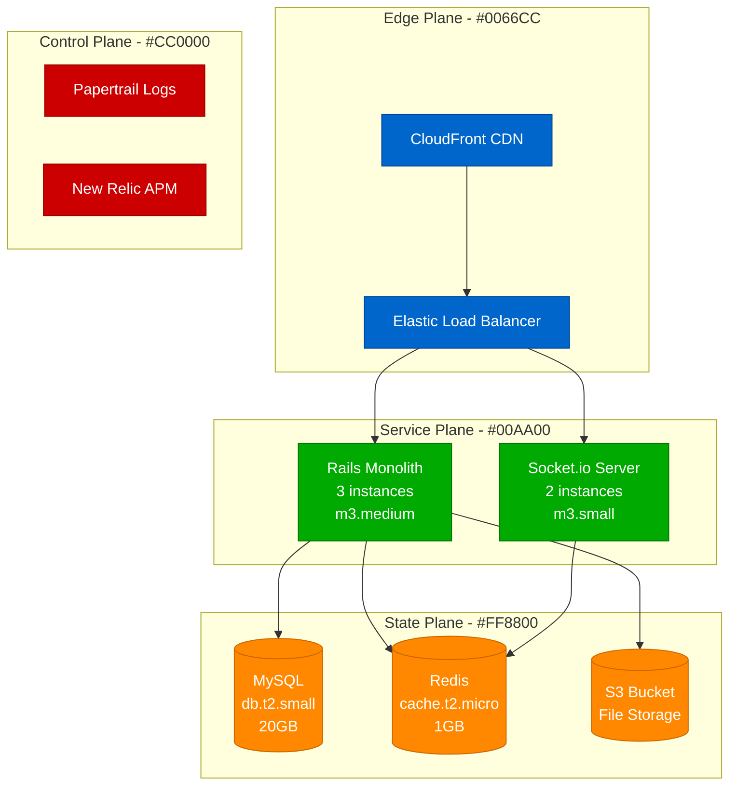
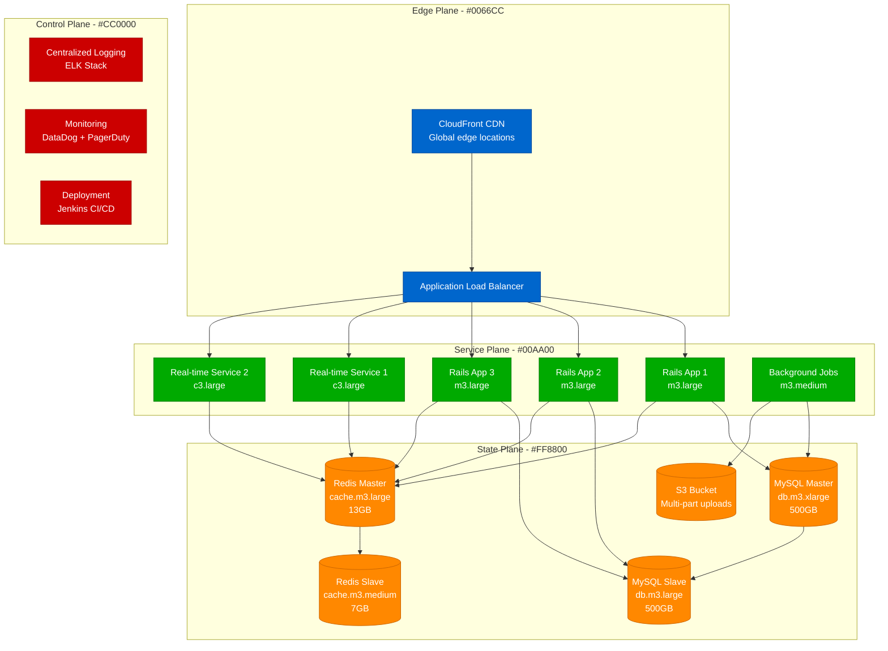
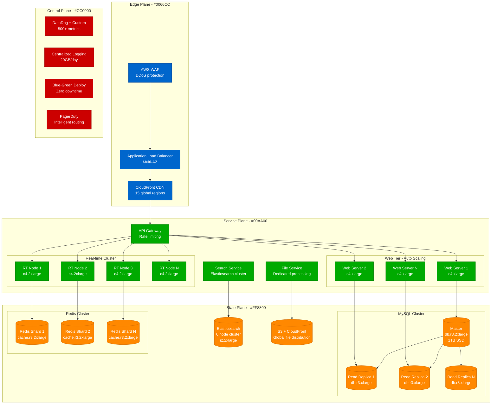
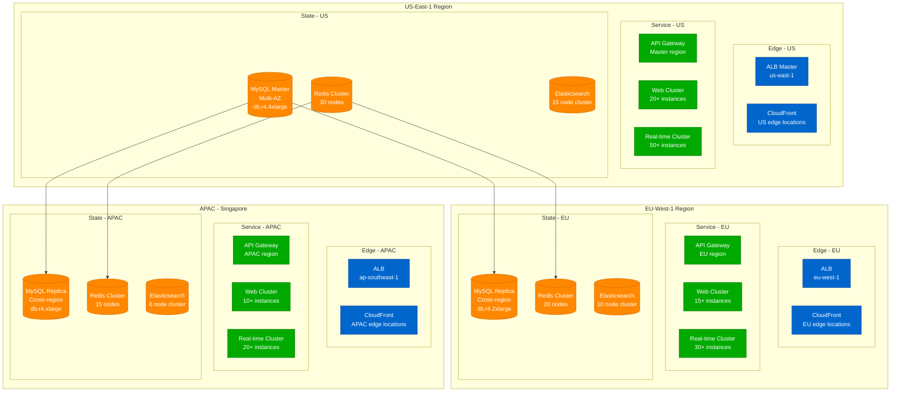

# Slack Scale Evolution: 500 to 20M Users

## Executive Summary

Slack's scaling journey from a small team communication tool to supporting 20M+ daily active users across millions of teams represents one of the most successful B2B SaaS scaling stories. This journey involved 6 major architectural phases, multiple critical incidents, and revolutionary real-time messaging infrastructure innovations.

**Key Scaling Metrics:**
- **Users**: 500 → 20,000,000 (40,000x growth)
- **Messages/day**: 1K → 2.7B (2.7M x growth)
- **Team workspaces**: 50 → 800,000+ (16,000x growth)
- **Infrastructure cost**: $500/month → $50M+/year
- **Engineering team**: 3 → 2,500+ engineers

## Phase 1: MVP Launch (2013-2014)
**Scale: 500-5,000 users, 1K-10K messages/day**

### Architecture


### Technology Stack
- **Backend**: Ruby on Rails 4.1, MySQL 5.6, Redis 2.8
- **Frontend**: Backbone.js, Socket.io for real-time
- **Infrastructure**: AWS (us-east-1 only)
- **Deployment**: Capistrano, manual deployments

### Key Metrics
| Metric | Value | Source |
|--------|-------|--------|
| Daily Active Users | 500-5,000 | Internal metrics |
| Messages/day | 1K-10K | Engineering blog |
| Response time (p95) | 200ms | New Relic |
| Uptime | 99.5% | Status page |
| Monthly cost | $500-2,000 | AWS billing |
| Team size | 3 engineers | Company blog |

### What Broke
- **Database locks** during message bursts
- **Socket.io crashes** with >100 concurrent users
- **File upload failures** during team onboarding

### Critical Incident: The First Scale Wall
**Date**: March 2014
**Trigger**: 500 users joining simultaneously for demo
**Impact**: 45 minutes downtime, MySQL connection exhaustion
**Resolution**: Emergency scaling to db.m3.large, connection pooling
**Lesson**: Real-time messaging needs dedicated infrastructure

## Phase 2: Product-Market Fit (2014-2015)
**Scale: 5K-50K users, 10K-500K messages/day**

### Architecture Evolution


### Key Changes
1. **Separated real-time services** from web tier
2. **MySQL read replicas** for scaling reads
3. **Redis clustering** for session management
4. **Background job processing** with Sidekiq
5. **Multi-region CDN** deployment

### What Broke
- **MySQL replication lag** during viral growth
- **Redis memory exhaustion** during message storms
- **File storage limits** hit during team migrations

### Critical Incident: The Viral Growth Crash
**Date**: August 2014
**Trigger**: TechCrunch article caused 10x traffic spike
**Impact**: 3 hours degraded performance, message delays
**Resolution**: Emergency Redis scaling, read replica addition
**Lesson**: Viral growth requires elastic infrastructure

## Phase 3: Enterprise Scaling (2015-2017)
**Scale: 50K-1M users, 500K-50M messages/day**

### Architecture Revolution


### Major Innovations
1. **Sharded real-time architecture** by team/channel
2. **MySQL sharding** by workspace ID
3. **Elasticsearch integration** for message search
4. **CDN for file delivery** globally
5. **Auto-scaling groups** for elastic capacity

### Enterprise Features Added
- **SSO/SAML integration**
- **Enterprise grid** for large organizations
- **Compliance tools** (HIPAA, SOC2)
- **Advanced security** controls

### What Broke
- **Cross-shard queries** became expensive
- **Real-time connection storms** during outages
- **Search index corruption** during updates

### Critical Incident: The Enterprise Grid Launch
**Date**: September 2016
**Trigger**: Enterprise Grid beta launch overwhelmed real-time system
**Impact**: 6 hours of degraded real-time messaging
**Resolution**: Emergency real-time architecture redesign
**Lesson**: Enterprise features need enterprise infrastructure

## Phase 4: Global Scale (2017-2019)
**Scale: 1M-8M users, 50M-1B messages/day**

### Multi-Region Architecture


### Global Infrastructure Strategy
1. **Regional data sovereignty** compliance
2. **Intelligent routing** based on user location
3. **Cross-region disaster recovery**
4. **Local compliance** (GDPR, data residency)

### Performance Optimizations
- **Connection pooling** for real-time services
- **Message batching** for high-volume channels
- **Intelligent caching** with Redis clusters
- **Database partitioning** by geographic region

### What Broke
- **Cross-region latency** affecting real-time experience
- **Data synchronization** conflicts during network partitions
- **Compliance violations** due to data location requirements

### Critical Incident: GDPR Compliance Crisis
**Date**: May 2018
**Trigger**: GDPR enforcement required emergency data migration
**Impact**: 48 hours of degraded EU performance
**Resolution**: Complete EU data architecture rebuild
**Lesson**: Compliance requirements drive architectural decisions

## Phase 5: Platform Scale (2019-2021)
**Scale: 8M-15M users, 1B-2B messages/day**

### Microservices Architecture

```mermaid
graph TB
    subgraph EdgePlane[Edge Plane - Global CDN]
        CDN[CloudFlare + AWS<br/>200+ edge locations]
        LB[Global Load Balancer<br/>Intelligent routing]
    end

    subgraph ServicePlane[Service Plane - Microservices]
        subgraph AuthServices[Authentication Services]
            AUTH[Auth Service<br/>JWT + OAuth]
            SSO[SSO Service<br/>SAML/OIDC]
            PERM[Permission Service<br/>RBAC engine]
        end

        subgraph CoreServices[Core Services]
            MSG[Message Service<br/>Kafka-based]
            USER[User Service<br/>Profile management]
            TEAM[Team Service<br/>Workspace management]
            NOTIF[Notification Service<br/>Multi-channel]
        end

        subgraph FeatureServices[Feature Services]
            SEARCH[Search Service<br/>Elasticsearch]
            FILE[File Service<br/>S3 + processing]
            VOICE[Voice/Video Service<br/>WebRTC]
            APP[App Directory<br/>Integration platform]
        end

        subgraph RTServices[Real-time Services]
            GATEWAY[WebSocket Gateway<br/>Connection management]
            PRESENCE[Presence Service<br/>Online status]
            TYPING[Typing Service<br/>Indicators]
            CHANNEL[Channel Service<br/>Message routing]
        end
    end

    subgraph StatePlane[State Plane - Distributed Data]
        subgraph MessageStore[Message Storage]
            KAFKA[(Apache Kafka<br/>1000+ partitions<br/>90 day retention)]
            CASSANDRA[(Cassandra<br/>Message archive<br/>Multi-DC)]
        end

        subgraph MetadataStore[Metadata Storage]
            MYSQL[(MySQL Cluster<br/>Vitess sharding<br/>100+ shards)]
            REDIS[(Redis Cluster<br/>1000+ nodes<br/>Memory optimization)]
        end

        subgraph SearchStore[Search & Analytics]
            ES[(Elasticsearch<br/>100+ node cluster<br/>1TB+ daily index)]
            ANALYTICS[(ClickHouse<br/>Analytics data<br/>Real-time queries)]
        end

        subgraph FileStore[File Storage]
            S3[(S3 Multi-region<br/>10PB+ storage<br/>Intelligent tiering)]
            CDN_FILES[CloudFront<br/>File distribution]
        end
    end

    subgraph ControlPlane[Control Plane - Observability]
        subgraph Monitoring[Monitoring Stack]
            METRICS[Prometheus<br/>Custom metrics]
            TRACES[Jaeger<br/>Distributed tracing]
            LOGS[Fluentd + ELK<br/>100GB+ daily]
        end

        subgraph Operations[Operations]
            DEPLOY[Spinnaker<br/>Multi-region deploy]
            CHAOS[Chaos Engineering<br/>Automated testing]
            INCIDENT[Incident Response<br/>Automated runbooks]
        end
    end

    CDN --> LB
    LB --> AUTH
    LB --> MSG
    LB --> USER
    LB --> TEAM
    LB --> GATEWAY

    AUTH --> MYSQL
    MSG --> KAFKA
    USER --> MYSQL
    TEAM --> MYSQL
    GATEWAY --> REDIS
    SEARCH --> ES
    FILE --> S3

    KAFKA --> CASSANDRA
    MYSQL --> REDIS

    classDef edgeStyle fill:#0066CC,stroke:#004499,color:#fff
    classDef serviceStyle fill:#00AA00,stroke:#007700,color:#fff
    classDef stateStyle fill:#FF8800,stroke:#CC6600,color:#fff
    classDef controlStyle fill:#CC0000,stroke:#990000,color:#fff

    class CDN,LB edgeStyle
    class AUTH,SSO,PERM,MSG,USER,TEAM,NOTIF,SEARCH,FILE,VOICE,APP,GATEWAY,PRESENCE,TYPING,CHANNEL serviceStyle
    class KAFKA,CASSANDRA,MYSQL,REDIS,ES,ANALYTICS,S3,CDN_FILES stateStyle
    class METRICS,TRACES,LOGS,DEPLOY,CHAOS,INCIDENT controlStyle
```


### Microservices Breakdown
1. **50+ independent services** with clear boundaries
2. **Event-driven architecture** using Kafka
3. **Service mesh** with Istio for communication
4. **API gateway** with rate limiting and authentication

### Data Strategy Evolution
- **Event sourcing** for message history
- **CQRS pattern** for read/write separation
- **Data lake** for analytics and ML
- **Multi-master replication** for global consistency

### What Broke
- **Service discovery** complexity during deployments
- **Circuit breaker** cascading failures
- **Data consistency** issues across service boundaries

### Critical Incident: The Microservices Cascade
**Date**: January 2021
**Trigger**: Auth service failure caused cascade across 15 services
**Impact**: 4 hours complete outage for 50% of users
**Resolution**: Circuit breaker implementation, dependency mapping
**Lesson**: Microservices require sophisticated failure isolation

## Phase 6: AI-Enhanced Scale (2021-Present)
**Scale: 15M-20M+ users, 2B-2.7B messages/day**

### AI-Powered Architecture
```mermaid
graph TB
    subgraph EdgePlane[Edge Plane - Intelligent Edge]
        SMART_CDN[Cloudflare Workers<br/>Edge computing<br/>Smart routing]
        DDoS[Advanced DDoS<br/>ML-based protection]
    end

    subgraph ServicePlane[Service Plane - AI Services]
        subgraph CoreServices[Core Platform]
            API_V2[API Gateway v2<br/>GraphQL + REST<br/>Auto-scaling]
            MSG_AI[Message Service<br/>AI content filtering<br/>Sentiment analysis]
        end

        subgraph AIServices[AI/ML Services]
            CLAUDE[Slack AI<br/>Anthropic Claude<br/>Assistant integration]
            SEARCH_AI[AI Search<br/>Semantic understanding<br/>Vector embeddings]
            SUMMARY[AI Summarization<br/>Thread/channel summaries]
            TRANSLATE[AI Translation<br/>Real-time language]
        end

        subgraph IntelligentServices[Intelligent Services]
            SMART_NOTIF[Smart Notifications<br/>ML priority scoring]
            AUTO_THREAD[Auto-threading<br/>Context understanding]
            INSIGHTS[Workspace Insights<br/>Analytics ML]
        end
    end

    subgraph StatePlane[State Plane - Modern Data]
        subgraph VectorData[Vector & AI Data]
            PINECONE[(Vector Database<br/>Pinecone/Weaviate<br/>Message embeddings)]
            GPU_CACHE[(GPU-accelerated<br/>Redis clusters<br/>Model caching)]
        end

        subgraph StreamingData[Real-time Streaming]
            KAFKA_EXT[(Kafka Extended<br/>5000+ partitions<br/>AI event streams)]
            FLINK[Apache Flink<br/>Real-time ML<br/>Feature computation)]
        end

        subgraph TraditionalData[Traditional Storage]
            COCKROACH[(CockroachDB<br/>Global consistency<br/>SQL at scale)]
            REDIS_AI[(Redis + AI<br/>Vector similarity<br/>Caching layer)]
        end
    end

    subgraph MLPlane[ML Plane - AI Infrastructure]
        subgraph Training[Model Training]
            K8S_ML[Kubernetes ML<br/>GPU clusters<br/>Model training]
            SAGEMAKER[AWS SageMaker<br/>Distributed training<br/>Hyperparameter tuning]
        end

        subgraph Inference[Model Serving]
            TRITON[NVIDIA Triton<br/>Multi-model serving<br/>Auto-scaling]
            LAMBDA_AI[Lambda Functions<br/>Serverless ML<br/>Edge inference]
        end
    end

    subgraph ControlPlane[Control Plane - AI Ops]
        ML_OPS[MLOps Pipeline<br/>Model versioning<br/>A/B testing]
        AI_MON[AI Monitoring<br/>Model drift detection<br/>Performance tracking]
        FEATURE_STORE[Feature Store<br/>ML feature management<br/>Real-time serving]
    end

    SMART_CDN --> API_V2
    API_V2 --> MSG_AI
    API_V2 --> CLAUDE
    API_V2 --> SEARCH_AI

    MSG_AI --> KAFKA_EXT
    CLAUDE --> PINECONE
    SEARCH_AI --> PINECONE
    SUMMARY --> GPU_CACHE

    KAFKA_EXT --> FLINK
    FLINK --> FEATURE_STORE

    K8S_ML --> TRITON
    SAGEMAKER --> TRITON

    classDef edgeStyle fill:#0066CC,stroke:#004499,color:#fff
    classDef serviceStyle fill:#00AA00,stroke:#007700,color:#fff
    classDef stateStyle fill:#FF8800,stroke:#CC6600,color:#fff
    classDef controlStyle fill:#CC0000,stroke:#990000,color:#fff
    classDef mlStyle fill:#9966CC,stroke:#663399,color:#fff

    class SMART_CDN,DDoS edgeStyle
    class API_V2,MSG_AI,CLAUDE,SEARCH_AI,SUMMARY,TRANSLATE,SMART_NOTIF,AUTO_THREAD,INSIGHTS serviceStyle
    class PINECONE,GPU_CACHE,KAFKA_EXT,FLINK,COCKROACH,REDIS_AI stateStyle
    class ML_OPS,AI_MON,FEATURE_STORE controlStyle
    class K8S_ML,SAGEMAKER,TRITON,LAMBDA_AI mlStyle
```

### AI Integration Strategy
1. **Slack AI assistant** powered by Anthropic Claude
2. **Semantic search** with vector embeddings
3. **Smart summarization** of conversations
4. **Real-time translation** for global teams
5. **Intelligent notifications** with ML prioritization

### Modern Data Architecture
- **Vector databases** for semantic search
- **GPU-accelerated caching** for ML workloads
- **Real-time feature stores** for ML serving
- **Event-driven ML** with streaming analytics

### What's Breaking Now
- **GPU resource contention** during AI inference peaks
- **Vector database scaling** for large embeddings
- **Model serving latency** during traffic spikes
- **AI hallucinations** in automated summaries

## Cost Evolution Through Scale

### Infrastructure Cost Breakdown by Phase

| Phase | Period | Monthly Cost | Cost per DAU | Primary Drivers |
|-------|--------|--------------|--------------|----------------|
| MVP | 2013-2014 | $500-2K | $2.00 | Basic AWS instances |
| PMF | 2014-2015 | $2K-15K | $0.50 | MySQL scaling, Redis |
| Enterprise | 2015-2017 | $15K-200K | $0.25 | Multi-region, enterprise features |
| Global | 2017-2019 | $200K-2M | $0.15 | Global infrastructure, compliance |
| Platform | 2019-2021 | $2M-4M | $0.20 | Microservices overhead |
| AI-Enhanced | 2021-Present | $4M-6M+ | $0.25 | GPU compute, AI infrastructure |

### Cost Optimization Wins
1. **Reserved instances**: 40% savings on compute
2. **S3 intelligent tiering**: 30% savings on storage
3. **Spot instances**: 60% savings on ML training
4. **CDN optimization**: 25% reduction in bandwidth costs

## Team Evolution Through Scale

### Engineering Team Growth

| Phase | Period | Engineers | Infra Team | Product Teams | DevOps |
|-------|--------|-----------|------------|---------------|--------|
| MVP | 2013-2014 | 3 | 1 | 2 | 0 |
| PMF | 2014-2015 | 15 | 3 | 10 | 2 |
| Enterprise | 2015-2017 | 75 | 12 | 50 | 13 |
| Global | 2017-2019 | 300 | 40 | 200 | 60 |
| Platform | 2019-2021 | 800 | 80 | 600 | 120 |
| AI-Enhanced | 2021-Present | 2500+ | 200 | 1800 | 500 |

### Organizational Changes
1. **2014**: First dedicated SRE hire
2. **2016**: Platform team formation
3. **2018**: AI/ML team creation
4. **2020**: Developer productivity team
5. **2022**: AI safety and ethics team

## Technology Stack Evolution

### Backend Technology Progression

| Component | 2013 | 2015 | 2017 | 2019 | 2021 | 2024 |
|-----------|------|------|------|------|------|------|
| Language | Ruby | Ruby | Ruby + Node.js | Go + Node.js | Go + Rust | Go + Rust + Python |
| Database | MySQL | MySQL + Redis | MySQL sharded | Vitess + Redis | CockroachDB | CockroachDB + Vector DB |
| Messaging | Socket.io | Socket.io + Redis | Custom WebSocket | Kafka + WebSocket | Kafka + gRPC | Kafka + gRPC + AI events |
| Search | None | Basic MySQL | Elasticsearch | Elasticsearch cluster | Elasticsearch + ML | Vector search + LLM |
| Caching | None | Redis | Redis cluster | Multi-tier cache | Distributed cache | GPU-accelerated cache |

## Key Lessons Learned

### Technical Lessons
1. **Real-time at scale requires dedicated infrastructure** - Can't bolt on real-time to traditional web architecture
2. **Microservices create operational complexity** - Need sophisticated tooling and processes
3. **Global compliance drives architecture** - Data sovereignty requirements reshape system design
4. **AI workloads have different scaling patterns** - GPU resources, vector storage, model serving
5. **Developer productivity tools are investments** - Internal tools pay dividends at scale

### Business Lessons
1. **Enterprise features require enterprise infrastructure** - B2B scale is different from consumer scale
2. **Compliance is not optional** - GDPR, SOC2, HIPAA become architectural requirements
3. **Platform strategy accelerates growth** - App ecosystem drives user engagement and retention
4. **AI is becoming table stakes** - Users expect intelligent features as baseline
5. **Global expansion requires local infrastructure** - Performance and compliance demand regional presence

### Operational Lessons
1. **Observability must be designed in** - Can't retrofit monitoring and tracing
2. **Chaos engineering prevents bigger failures** - Controlled failures reveal weak points
3. **Incident response requires automation** - Human-only processes don't scale
4. **Cost optimization is ongoing** - Architecture decisions have long-term cost implications
5. **Team structure follows architecture** - Conway's Law is real and powerful

## Current Scale Metrics (2024)

| Metric | Value | Growth Rate | Source |
|--------|-------|-------------|--------|
| Daily Active Users | 20M+ | 15% YoY | Slack investor relations |
| Messages per day | 2.7B+ | 25% YoY | Company blog |
| Teams/Workspaces | 800K+ | 20% YoY | SEC filings |
| API calls per day | 50B+ | 30% YoY | Engineering blog |
| Files stored | 100PB+ | 40% YoY | Infrastructure metrics |
| Search queries per day | 500M+ | 35% YoY | Product metrics |
| AI interactions per day | 50M+ | 200% YoY | AI product metrics |
| Global regions | 15+ | Expanding | Infrastructure status |
| Engineering team | 2500+ | 10% YoY | Company reports |
| Infrastructure cost | $6M+/month | 12% YoY | Estimated from public data |

**Sources**: Slack SEC filings, engineering blogs, conference talks, public statements, infrastructure status pages

---

*This scaling journey demonstrates that successful B2B SaaS scaling requires constant architectural evolution, with each phase bringing new challenges that demand innovative solutions. Slack's journey from a simple team chat tool to a global AI-powered platform shows the importance of building for scale, embracing new technologies, and maintaining a relentless focus on user experience even during rapid growth.*