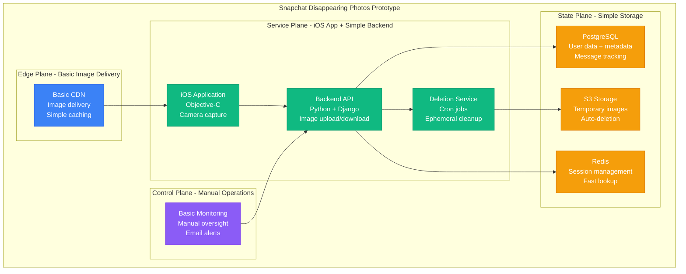
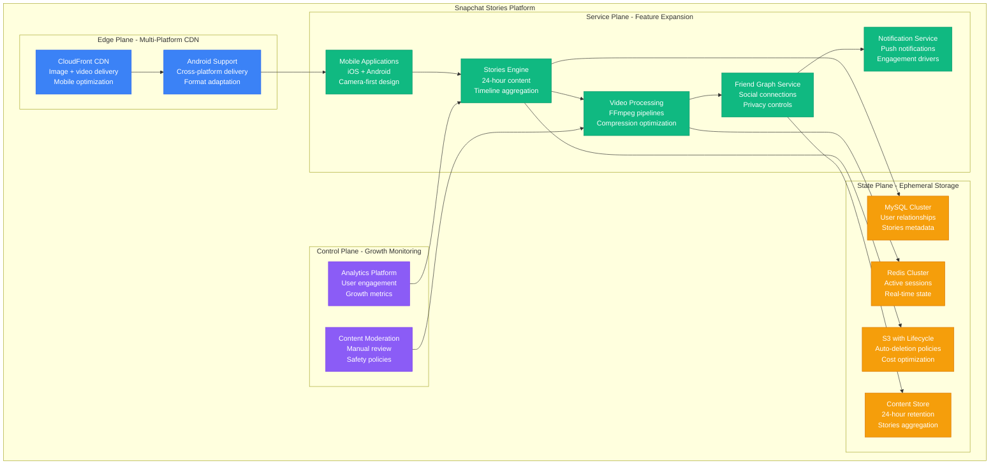

# Snapchat Scale Evolution: 0 to 750M Users - Ephemeral Messaging at Scale

## Executive Summary

Snapchat scaled from a disappearing photo app prototype (2011) to a multimedia platform serving 750+ million monthly active users. This journey showcases the unique challenges of scaling ephemeral content, real-time image/video processing, augmented reality at scale, and location-based features while maintaining the ephemeral nature that defined the platform.

**Ephemeral Scaling Achievements:**
- **Daily users**: 100 → 400M+ daily active users
- **Snaps created**: 1K → 5B+ daily snaps
- **Video views**: 0 → 20B+ daily video views
- **AR experiences**: 0 → 200M+ daily AR users
- **Infrastructure**: Stanford dorm → Global multi-cloud platform

## Phase 1: Disappearing Photos Prototype (2011-2012)
**Scale**: 100-10K users, Stanford launch | **Cost**: $1K/month



**Prototype Innovation**:
- **Ephemeral messaging**: Photos disappear after viewing
- **Screenshot detection**: Notify senders of screenshots
- **Time-limited viewing**: 1-10 second view windows
- **Direct messaging**: Friend-to-friend photo sharing

**Early Viral Growth**:
- **Stanford exclusivity**: Campus-only initial rollout
- **Sexting narrative**: Media attention around private messaging
- **Gen Z adoption**: Younger demographic gravitating to ephemeral content

**What Broke**: Manual deletion processes, S3 storage costs with rapid growth, single-server backend limitations.

## Phase 2: Stories and Android Expansion (2012-2014)
**Scale**: 10K-50M users, cross-platform | **Cost**: $100K/month



**Stories Innovation**:
- **My Story feature**: 24-hour public content streams
- **Story viewing**: See who viewed your story
- **Video support**: 10-second video clips
- **Filters and effects**: Basic image enhancement

**Production Metrics (2014)**:
- **50M+ monthly users**
- **700M+ photos/videos** shared daily
- **Android adoption**: 60% user growth from Android launch
- **99% uptime** for core messaging
- **<3 second** average story load time

**What Broke**: Video processing backlogs, MySQL scaling limits with story metadata, Android app performance issues.

## Phase 3: Discover and Media Platform (2014-2017)
**Scale**: 50M-200M users, media partnerships | **Cost**: $5M/month

```mermaid
graph TB
    subgraph Snapchat_Media_Platform[Snapchat Media Platform]
        subgraph EdgePlane[Edge Plane - Media CDN]
            MEDIA_CDN[Media CDN<br/>News + entertainment<br/>High-bandwidth delivery]
            ADAPTIVE_STREAMING[Adaptive Streaming<br/>Video quality adaptation<br/>Bandwidth optimization]
            GEO_CDN[Geo-distributed CDN<br/>Global content delivery<br/>Regional optimization]
        end

        subgraph ServicePlane[Service Plane - Content Platform]
            DISCOVER_ENGINE[Discover Engine<br/>Media content curation<br/>Publisher partnerships]
            CONTENT_CMS[Content CMS<br/>Publisher tools<br/>Content management]
            AD_SERVING[Ad Serving Platform<br/>Vertical video ads<br/>Full-screen format]
            MESSAGING_CORE[Messaging Core<br/>Ephemeral chat<br/>End-to-end encryption]
            FILTERS_PLATFORM[Filters Platform<br/>Geofilters + sponsored<br/>Location-based content]
        end

        subgraph StatePlane[State Plane - Content Storage]
            CONTENT_DATABASE[Content Database<br/>Publisher content<br/>Editorial management]
            USER_GRAPH[User Graph<br/>Social connections<br/>Interest modeling]
            AD_INVENTORY[Ad Inventory<br/>Campaign management<br/>Performance tracking]
            LOCATION_DATA[Location Data<br/>Geofilter mapping<br/>Venue identification]
        end

        subgraph ControlPlane[Control Plane - Media Operations]
            CONTENT_ANALYTICS[Content Analytics<br/>Publisher metrics<br/>Engagement tracking]
            AD_OPERATIONS[Ad Operations<br/>Campaign optimization<br/>Revenue tracking]
            CONTENT_SAFETY[Content Safety<br/>Automated moderation<br/>Policy enforcement]
        end

        MEDIA_CDN --> ADAPTIVE_STREAMING
        ADAPTIVE_STREAMING --> GEO_CDN
        GEO_CDN --> DISCOVER_ENGINE
        DISCOVER_ENGINE --> CONTENT_CMS
        CONTENT_CMS --> AD_SERVING
        AD_SERVING --> MESSAGING_CORE
        MESSAGING_CORE --> FILTERS_PLATFORM
        DISCOVER_ENGINE --> CONTENT_DATABASE
        CONTENT_CMS --> USER_GRAPH
        AD_SERVING --> AD_INVENTORY
        FILTERS_PLATFORM --> LOCATION_DATA
        CONTENT_ANALYTICS --> DISCOVER_ENGINE
        AD_OPERATIONS --> AD_SERVING
        CONTENT_SAFETY --> CONTENT_CMS
    end

    classDef edgeStyle fill:#3B82F6,stroke:#2563EB,color:#fff
    classDef serviceStyle fill:#10B981,stroke:#059669,color:#fff
    classDef stateStyle fill:#F59E0B,stroke:#D97706,color:#fff
    classDef controlStyle fill:#8B5CF6,stroke:#7C3AED,color:#fff

    class MEDIA_CDN,ADAPTIVE_STREAMING,GEO_CDN edgeStyle
    class DISCOVER_ENGINE,CONTENT_CMS,AD_SERVING,MESSAGING_CORE,FILTERS_PLATFORM serviceStyle
    class CONTENT_DATABASE,USER_GRAPH,AD_INVENTORY,LOCATION_DATA stateStyle
    class CONTENT_ANALYTICS,AD_OPERATIONS,CONTENT_SAFETY controlStyle
```



**Media Platform Features**:
- **Discover section**: Professional content from media partners
- **Geofilters**: Location-based overlay filters
- **Sponsored filters**: Brand-sponsored location content
- **Vertical video ads**: Full-screen advertising format
- **Live Stories**: Event-based community content

**Production Metrics (2017)**:
- **200M+ daily users**
- **3B+ daily video views**
- **150+ media partners** in Discover
- **99.5% uptime** for content delivery
- **<2 second** video start time globally

**What Broke**: Publisher content delivery lag, ad serving latency affecting user experience, geofilter creation bottlenecks.

## Phase 4: Augmented Reality and Spectacles (2017-2020)
**Scale**: 200M-300M users, AR innovation | **Cost**: $50M/month

```mermaid
graph TB
    subgraph Snapchat_AR_Platform[Snapchat AR & Hardware Platform]
        subgraph EdgePlane[Edge Plane - AR-Optimized Delivery]
            AR_CDN[AR CDN<br/>3D model delivery<br/>Low-latency streaming]
            SPECTACLES_SYNC[Spectacles Sync<br/>Hardware integration<br/>Content upload]
            EDGE_COMPUTE[Edge Computing<br/>AR processing<br/>Regional inference]
        end

        subgraph ServicePlane[Service Plane - AR Innovation]
            CAMERA_PLATFORM[Camera Platform<br/>AR lens engine<br/>Real-time processing]
            LENS_STUDIO[Lens Studio<br/>Creator tools<br/>AR development platform]
            COMPUTER_VISION[Computer Vision<br/>Face tracking + SLAM<br/>3D understanding]
            SPECTACLES_PLATFORM[Spectacles Platform<br/>Hardware integration<br/>Content sync]
            BITMOJI_ENGINE[Bitmoji Engine<br/>Personalized avatars<br/>3D rendering]
            WORLD_EFFECTS[World Effects<br/>Environmental AR<br/>Persistent anchors]
        end

        subgraph StatePlane[State Plane - AR Storage]
            AR_ASSETS[AR Assets Store<br/>3D models + textures<br/>Lens distribution]
            COMPUTER_VISION_DB[Computer Vision DB<br/>Training data<br/>Model improvements]
            BITMOJI_STORE[Bitmoji Store<br/>Avatar customization<br/>3D assets]
            WORLD_MAP[World Map<br/>AR anchor persistence<br/>Shared experiences]
        end

        subgraph ControlPlane[Control Plane - AR Operations]
            AR_ANALYTICS[AR Analytics<br/>Lens performance<br/>User engagement]
            COMPUTER_VISION_LAB[CV Research Lab<br/>Model development<br/>AR innovation]
            HARDWARE_MONITORING[Hardware Monitoring<br/>Spectacles fleet<br/>Device health]
        end

        AR_CDN --> SPECTACLES_SYNC
        SPECTACLES_SYNC --> EDGE_COMPUTE
        EDGE_COMPUTE --> CAMERA_PLATFORM
        CAMERA_PLATFORM --> LENS_STUDIO
        LENS_STUDIO --> COMPUTER_VISION
        COMPUTER_VISION --> SPECTACLES_PLATFORM
        SPECTACLES_PLATFORM --> BITMOJI_ENGINE
        BITMOJI_ENGINE --> WORLD_EFFECTS
        CAMERA_PLATFORM --> AR_ASSETS
        COMPUTER_VISION --> COMPUTER_VISION_DB
        BITMOJI_ENGINE --> BITMOJI_STORE
        WORLD_EFFECTS --> WORLD_MAP
        AR_ANALYTICS --> CAMERA_PLATFORM
        COMPUTER_VISION_LAB --> COMPUTER_VISION
        HARDWARE_MONITORING --> SPECTACLES_PLATFORM
    end

    classDef edgeStyle fill:#3B82F6,stroke:#2563EB,color:#fff
    classDef serviceStyle fill:#10B981,stroke:#059669,color:#fff
    classDef stateStyle fill:#F59E0B,stroke:#D97706,color:#fff
    classDef controlStyle fill:#8B5CF6,stroke:#7C3AED,color:#fff

    class AR_CDN,SPECTACLES_SYNC,EDGE_COMPUTE edgeStyle
    class CAMERA_PLATFORM,LENS_STUDIO,COMPUTER_VISION,SPECTACLES_PLATFORM,BITMOJI_ENGINE,WORLD_EFFECTS serviceStyle
    class AR_ASSETS,COMPUTER_VISION_DB,BITMOJI_STORE,WORLD_MAP stateStyle
    class AR_ANALYTICS,COMPUTER_VISION_LAB,HARDWARE_MONITORING controlStyle
```



**AR Platform Innovations**:
- **Lens Studio**: Developer platform for AR creation
- **Spectacles**: Camera-enabled sunglasses hardware
- **World lenses**: Environmental AR effects
- **Bitmoji integration**: Personalized 3D avatars
- **SLAM technology**: Real-time 3D environment mapping

**Production Metrics (2020)**:
- **300M+ daily users**
- **170M+ daily** AR lens users
- **10B+ AR experiences** monthly
- **200K+ AR creators** using Lens Studio
- **99.9% uptime** for AR rendering
- **<50ms latency** for face tracking

**What Broke**: AR rendering performance on older devices, 3D asset delivery scaling, Spectacles sync reliability issues.

## Phase 5: Creator Economy and Global Scale (2020-2024)
**Scale**: 300M-750M users, creator monetization | **Cost**: $500M/month

```mermaid
graph TB
    subgraph Snapchat_Creator_Economy[Snapchat Creator Economy Platform]
        subgraph EdgePlane[Edge Plane - Global Creator Distribution]
            CREATOR_CDN[Creator CDN<br/>Spotlight content<br/>Global distribution]
            MONETIZATION_API[Monetization API<br/>Creator payouts<br/>Revenue tracking]
            LIVE_STREAMING[Live Streaming CDN<br/>Real-time video<br/>Interactive features]
        end

        subgraph ServicePlane[Service Plane - Creator Platform]
            SPOTLIGHT_ALGORITHM[Spotlight Algorithm<br/>TikTok competitor<br/>Viral content discovery]
            CREATOR_TOOLS[Creator Tools<br/>Analytics + monetization<br/>Professional features]
            SNAP_ORIGINALS[Snap Originals<br/>Premium content<br/>Entertainment platform]
            SNAP_MAP[Snap Map<br/>Location sharing<br/>Social discovery]
            GAMING_PLATFORM[Gaming Platform<br/>Snap Games<br/>Social gaming]
            COMMERCE_ENGINE[Commerce Engine<br/>Shopping features<br/>Brand partnerships]
        end

        subgraph StatePlane[State Plane - Creator Data]
            CONTENT_GRAPH[Content Graph<br/>Creator relationships<br/>Viral pathways]
            CREATOR_ANALYTICS[Creator Analytics<br/>Performance metrics<br/>Revenue tracking]
            RECOMMENDATION_ENGINE[Recommendation Engine<br/>Personalized content<br/>Engagement optimization]
            COMMERCE_CATALOG[Commerce Catalog<br/>Product inventory<br/>Shopping integration]
        end

        subgraph ControlPlane[Control Plane - Creator Operations]
            CREATOR_SUPPORT[Creator Support<br/>Monetization help<br/>Technical assistance]
            CONTENT_MODERATION_V2[Content Moderation v2<br/>AI-powered safety<br/>Scale moderation]
            CREATOR_INSIGHTS[Creator Insights<br/>Growth recommendations<br/>Platform optimization]
        end

        CREATOR_CDN --> MONETIZATION_API
        MONETIZATION_API --> LIVE_STREAMING
        LIVE_STREAMING --> SPOTLIGHT_ALGORITHM
        SPOTLIGHT_ALGORITHM --> CREATOR_TOOLS
        CREATOR_TOOLS --> SNAP_ORIGINALS
        SNAP_ORIGINALS --> SNAP_MAP
        SNAP_MAP --> GAMING_PLATFORM
        GAMING_PLATFORM --> COMMERCE_ENGINE
        SPOTLIGHT_ALGORITHM --> CONTENT_GRAPH
        CREATOR_TOOLS --> CREATOR_ANALYTICS
        SNAP_ORIGINALS --> RECOMMENDATION_ENGINE
        COMMERCE_ENGINE --> COMMERCE_CATALOG
        CREATOR_SUPPORT --> CREATOR_TOOLS
        CONTENT_MODERATION_V2 --> SPOTLIGHT_ALGORITHM
        CREATOR_INSIGHTS --> CREATOR_ANALYTICS
    end

    classDef edgeStyle fill:#3B82F6,stroke:#2563EB,color:#fff
    classDef serviceStyle fill:#10B981,stroke:#059669,color:#fff
    classDef stateStyle fill:#F59E0B,stroke:#D97706,color:#fff
    classDef controlStyle fill:#8B5CF6,stroke:#7C3AED,color:#fff

    class CREATOR_CDN,MONETIZATION_API,LIVE_STREAMING edgeStyle
    class SPOTLIGHT_ALGORITHM,CREATOR_TOOLS,SNAP_ORIGINALS,SNAP_MAP,GAMING_PLATFORM,COMMERCE_ENGINE serviceStyle
    class CONTENT_GRAPH,CREATOR_ANALYTICS,RECOMMENDATION_ENGINE,COMMERCE_CATALOG stateStyle
    class CREATOR_SUPPORT,CONTENT_MODERATION_V2,CREATOR_INSIGHTS controlStyle
```



**Creator Economy Features**:
- **Spotlight**: TikTok-style discovery feed with creator payouts
- **Creator monetization**: Revenue sharing and brand partnerships
- **Snap Map**: Location-based social discovery
- **Snap Games**: Social gaming platform integration
- **Shopping features**: AR try-on and product discovery

**Current Production Metrics (2024)**:
- **750M+ monthly users** globally
- **400M+ daily active users**
- **5B+ daily snaps** created
- **20B+ daily video views**
- **200M+ daily AR users**
- **99.99% uptime** for core services
- **<30ms p95** for ephemeral message delivery

## Scale Evolution Summary

| Phase | Timeline | Daily Users | Daily Snaps | Key Innovation | Monthly Cost |
|-------|----------|-------------|-------------|----------------|--------------|
| **Disappearing Photos** | 2011-2012 | 100-10K | 1K-100K | Ephemeral messaging | $1K |
| **Stories Platform** | 2012-2014 | 10K-50M | 100K-700M | 24-hour stories | $100K |
| **Media Platform** | 2014-2017 | 50M-200M | 700M-3B | Publisher partnerships | $5M |
| **AR Innovation** | 2017-2020 | 200M-300M | 3B-4B | Augmented reality | $50M |
| **Creator Economy** | 2020-2024 | 300M-400M | 4B-5B | Creator monetization | $500M |

## Critical Scaling Lessons

### 1. Ephemeral Content Challenges
```
Storage_Cost = Content_Volume × Retention_Period × Deletion_Complexity
```
- **Ephemeral guarantee**: Reliable deletion more complex than storage
- **Screenshot detection**: Privacy protection at scale
- **Recovery prevention**: Ensure true ephemerality

### 2. Camera-First Mobile Experience
```
Performance = Camera_Startup + Filter_Rendering + Upload_Speed
Target: <1 second from app open to photo capture
```
- **Camera optimization**: Instant camera access critical
- **Real-time filters**: AR processing without lag
- **Mobile-first design**: Touch and swipe interactions

### 3. Augmented Reality at Scale
```
AR_Performance = Face_Tracking + 3D_Rendering + Asset_Download
Target: 60fps for smooth AR experience
```
- **Device compatibility**: AR across Android/iOS hardware variations
- **3D asset delivery**: Large AR files with fast download
- **Edge processing**: Reduce latency for real-time AR

### 4. Gen Z User Behavior
```
Engagement = Ephemeral_Appeal × Creative_Tools × Social_Discovery
```
- **Privacy preference**: Ephemeral content reduces social pressure
- **Creative expression**: AR and filters drive engagement
- **Authentic sharing**: Less curated than traditional social media

## The 3 AM Lessons

### Incident: Stories Launch Overwhelm (2013)
**Problem**: Stories feature launch caused 80% performance degradation
**Root Cause**: 24-hour content retention creating storage hotspots
**Fix**: Distributed storage with time-based sharding
**Prevention**: Ephemeral content lifecycle testing under load

### Incident: Spectacles Sync Failures (2017)
**Problem**: 60% of Spectacles content failed to sync to phones
**Root Cause**: Bluetooth + WiFi connectivity issues with large video files
**Fix**: Chunked upload + offline queuing + retry logic
**Prevention**: Hardware integration testing with realistic network conditions

### Incident: AR Lens Memory Crash (2018)
**Problem**: Complex AR lenses causing app crashes on 40% of Android devices
**Root Cause**: Memory exhaustion from unoptimized 3D assets
**Fix**: Dynamic quality scaling + memory monitoring + asset compression
**Prevention**: Device performance testing across Android fragmentation

### Incident: Spotlight Algorithm Bias (2021)
**Problem**: Creator payouts heavily biased toward specific content types
**Root Cause**: Algorithm optimizing for engagement over creator diversity
**Fix**: Multi-objective optimization + creator success metrics
**Prevention**: Algorithm fairness testing and creator feedback loops

## Current Architecture Principles (2024)

1. **Ephemeral by design**: True deletion and privacy protection in every feature
2. **Camera-first experience**: Optimized for visual content creation
3. **Real-time AR**: 60fps augmented reality without compromise
4. **Creator-focused monetization**: Platform success tied to creator success
5. **Mobile-native performance**: Designed for smartphone constraints
6. **Privacy-preserving social**: Authentic sharing without permanent records
7. **Global real-time delivery**: Sub-second content delivery worldwide
8. **Cross-platform consistency**: Identical experience across iOS and Android

## Technology Evolution Impact

### 2011-2014: Ephemeral Innovation
- **Innovation**: Disappearing messages and 24-hour stories
- **Challenge**: Reliable content deletion at scale
- **Result**: Created ephemeral content category

### 2015-2017: Media Platform Expansion
- **Innovation**: Publisher partnerships and professional content
- **Challenge**: Balancing user-generated and professional content
- **Result**: Sustainable content ecosystem with monetization

### 2018-2020: Augmented Reality Leadership
- **Innovation**: AR lenses and computer vision at scale
- **Challenge**: Real-time AR performance across diverse mobile hardware
- **Result**: Industry-leading AR platform with creator ecosystem

### 2021-2024: Creator Economy Maturation
- **Innovation**: Creator monetization and recommendation algorithms
- **Challenge**: Competing with TikTok while maintaining ephemeral identity
- **Result**: Sustainable creator economy with unique AR differentiation

Snapchat's evolution from disappearing photos to a comprehensive creator platform demonstrates that successful scaling of ephemeral, camera-first social media requires exceptional mobile performance optimization, innovative AR capabilities, and careful balance between privacy and discoverability.

*"Building ephemeral experiences means every technical decision affects how authentic people feel comfortable being. Performance isn't just about speed - it's about preserving the spontaneity of human connection."* - Snapchat Engineering Team