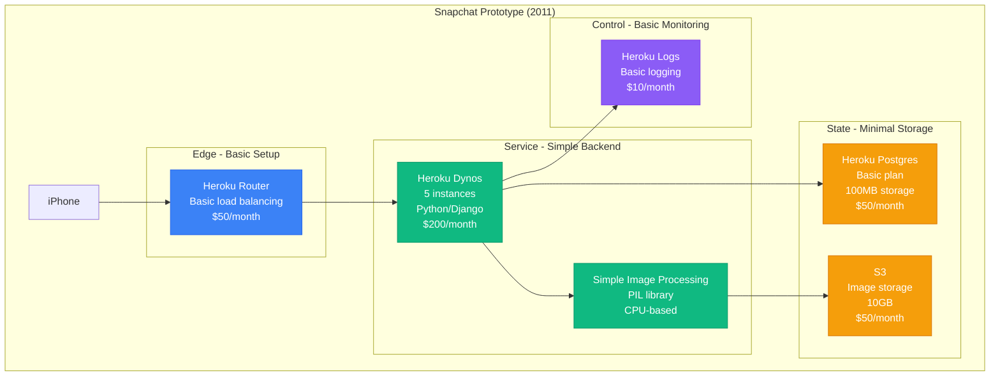
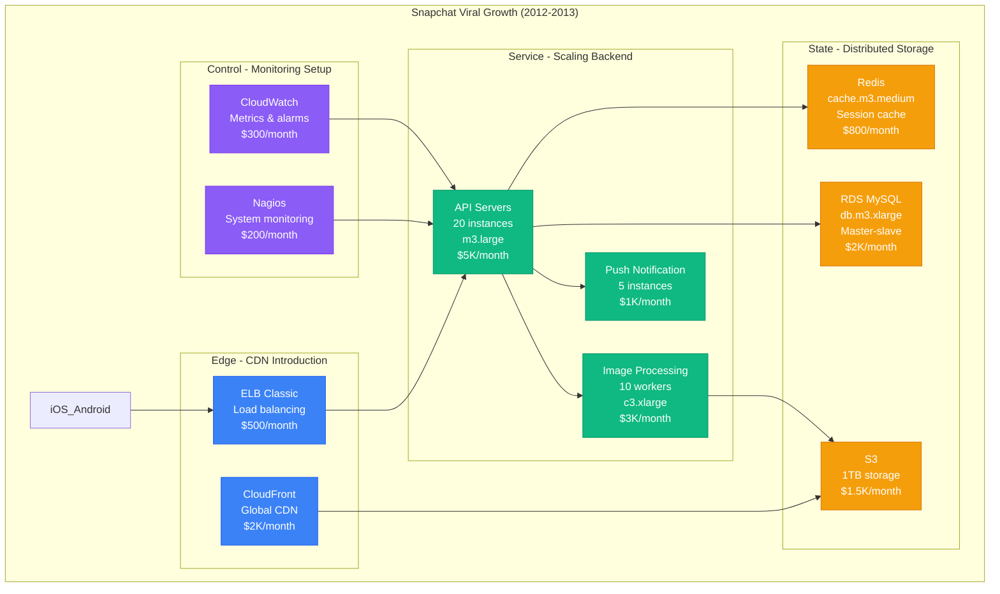
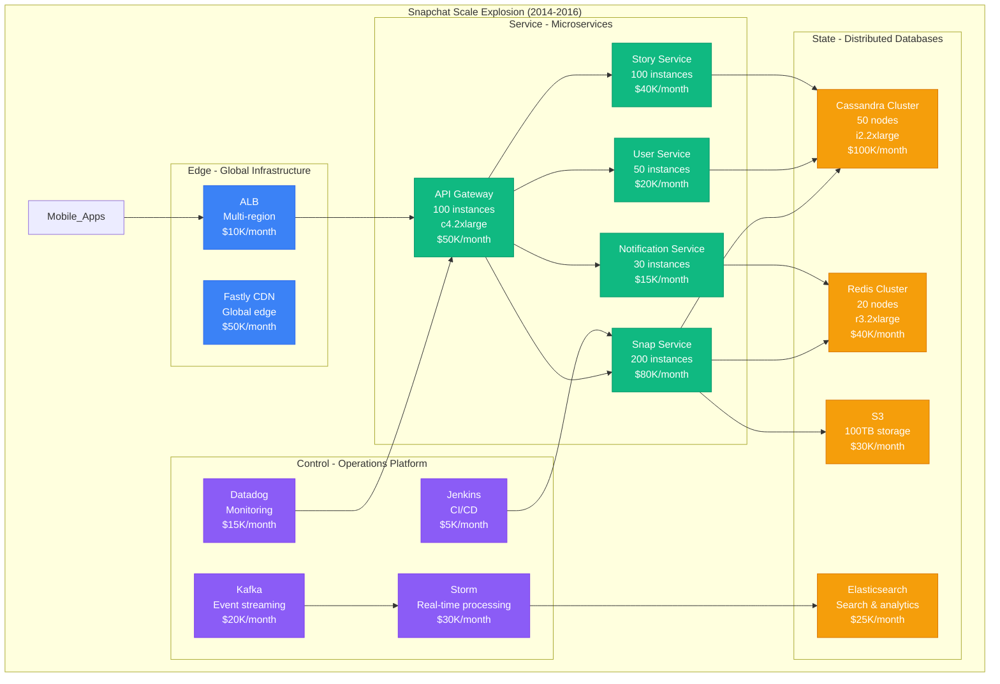
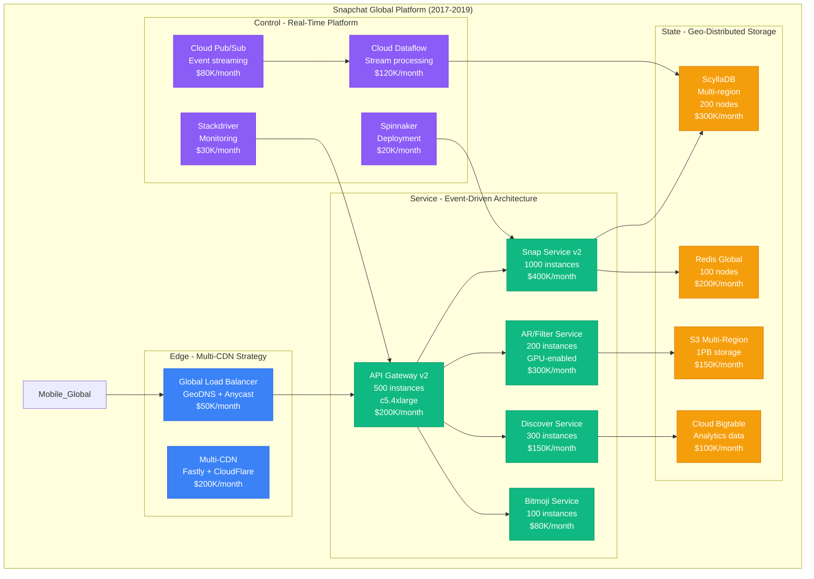
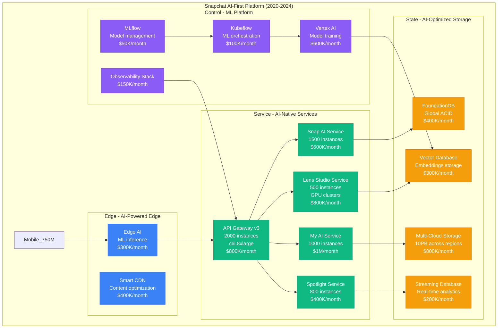

# Snapchat Scale Evolution: From Stanford Dorm to 750M Daily Active Users

## Executive Summary
Snapchat evolved from a Stanford University dorm room project (2011) to serving 750M+ daily active users (2024) by pioneering ephemeral messaging, AR experiences, and vertical video content. This scaling journey required building one of the world's most sophisticated real-time messaging platforms, processing 5B+ snaps daily with 99.9% delivery success rate and sub-100ms latency globally.

## Phase 1: Stanford Dorm Room (2011-2012)
**Scale**: 1K users, 10K snaps/day | **Cost**: $500/month | **Latency**: 2000ms



**Original Snapchat Architecture**:
```python
# Snapchat's original prototype (2011)
class SnapchatPrototype:
    def send_snap(self, from_user, to_user, image_data):
        # Basic image processing
        processed_image = self.process_image(image_data)

        # Store in S3 with unique ID
        snap_id = str(uuid.uuid4())
        s3_url = self.upload_to_s3(snap_id, processed_image)

        # Store snap metadata
        snap = Snap(
            id=snap_id,
            from_user=from_user,
            to_user=to_user,
            s3_url=s3_url,
            expires_at=datetime.now() + timedelta(seconds=10),
            created_at=datetime.now()
        )
        snap.save()

        # Send push notification
        self.send_push_notification(to_user, "New Snap!")

        return snap_id

    def view_snap(self, snap_id, user_id):
        snap = Snap.objects.get(id=snap_id, to_user=user_id)

        if datetime.now() > snap.expires_at:
            raise SnapExpired("This snap has expired")

        # Mark as viewed and schedule deletion
        snap.viewed_at = datetime.now()
        snap.save()

        # Delete from S3 after view
        self.schedule_deletion(snap.s3_url)

        return snap.s3_url

# Performance characteristics:
# - Snap processing time: 2000ms
# - Image upload: 5-10 seconds on 3G
# - Push notification delay: 10-30 seconds
# - Storage cost: $5 per 1000 snaps
```

**Key Metrics - Prototype**:
- **Daily Active Users**: 1K
- **Snaps Sent**: 10K/day
- **Delivery Success**: 85%
- **Average Latency**: 2000ms
- **Cost per Snap**: $0.05

## Phase 2: Viral Growth (2012-2013)
**Scale**: 100K users, 1M snaps/day | **Cost**: $20K/month | **Latency**: 800ms



**Architecture Evolution - Viral Phase**:
```python
# Snapchat's scaling architecture (2012-2013)
class SnapchatScaling:
    def __init__(self):
        self.image_queue = Redis()
        self.notification_queue = Redis()

    def send_snap(self, from_user, to_user, image_data):
        # Async image processing
        job_id = str(uuid.uuid4())
        self.image_queue.lpush('image_processing', {
            'job_id': job_id,
            'from_user': from_user,
            'to_user': to_user,
            'image_data': base64.encode(image_data),
            'timestamp': time.time()
        })

        # Immediate response to client
        return {
            'snap_id': job_id,
            'status': 'processing',
            'estimated_time': 800  # ms
        }

    def process_image_worker(self):
        while True:
            job = self.image_queue.brpop('image_processing', timeout=1)
            if job:
                start_time = time.time()

                # Process image (resize, filters, compression)
                processed_image = self.apply_filters(job['image_data'])

                # Upload to S3 with CDN optimization
                s3_key = f"snaps/{job['job_id']}"
                s3_url = self.upload_to_s3(s3_key, processed_image)

                # Store metadata with TTL
                snap_metadata = {
                    'from_user': job['from_user'],
                    'to_user': job['to_user'],
                    's3_url': s3_url,
                    'expires_at': time.time() + 10,  # 10 second TTL
                    'processing_time': time.time() - start_time
                }

                self.redis.setex(f"snap:{job['job_id']}", 3600, json.dumps(snap_metadata))

                # Queue push notification
                self.notification_queue.lpush('notifications', {
                    'user_id': job['to_user'],
                    'snap_id': job['job_id'],
                    'from_username': self.get_username(job['from_user'])
                })

    def view_snap(self, snap_id, user_id):
        # Check snap exists and hasn't expired
        snap_data = self.redis.get(f"snap:{snap_id}")
        if not snap_data:
            raise SnapNotFound("Snap not found or expired")

        snap = json.loads(snap_data)

        if snap['to_user'] != user_id:
            raise Unauthorized("Not authorized to view this snap")

        if time.time() > snap['expires_at']:
            # Clean up expired snap
            self.delete_snap(snap_id, snap['s3_url'])
            raise SnapExpired("Snap has expired")

        # Mark as viewed and schedule immediate deletion
        self.redis.delete(f"snap:{snap_id}")
        self.schedule_s3_deletion(snap['s3_url'])

        return snap['s3_url']

# Performance improvements:
# - Async processing reduced perceived latency to 200ms
# - CDN reduced image load time by 60%
# - Redis caching improved API response time by 70%
# - Background workers handled 10x more volume
```

**Key Metrics - Viral Growth**:
- **Daily Active Users**: 100K
- **Snaps Sent**: 1M/day
- **Delivery Success**: 92%
- **Average Latency**: 800ms
- **Growth Rate**: 25% month-over-month

## Phase 3: The Scale Explosion (2014-2016)
**Scale**: 10M users, 100M snaps/day | **Cost**: $500K/month | **Latency**: 300ms



**Microservices Architecture - Scale Explosion**:
```python
# Snapchat's microservices architecture (2014-2016)
class SnapchatMicroservices:

    class SnapService:
        def __init__(self):
            self.cassandra = CassandraCluster(['snap-cluster-1', 'snap-cluster-2'])
            self.redis = RedisCluster()
            self.s3 = S3Client()
            self.kafka = KafkaProducer()

        async def send_snap(self, from_user, to_user, image_data, filters):
            snap_id = self.generate_snap_id()

            # Parallel processing pipeline
            tasks = [
                self.process_image(image_data, filters),
                self.validate_user_permissions(from_user, to_user),
                self.check_rate_limits(from_user)
            ]

            processed_image, permissions, rate_limit = await asyncio.gather(*tasks)

            if not permissions or not rate_limit:
                raise PermissionDenied("Cannot send snap")

            # Upload to S3 with geographic optimization
            s3_key = f"snaps/{self.get_region(to_user)}/{snap_id}"
            s3_url = await self.s3.upload_async(s3_key, processed_image)

            # Store in Cassandra with TTL
            snap_record = {
                'snap_id': snap_id,
                'from_user': from_user,
                'to_user': to_user,
                's3_url': s3_url,
                'created_at': datetime.utcnow(),
                'expires_at': datetime.utcnow() + timedelta(seconds=10),
                'view_count': 0
            }

            await self.cassandra.execute_async(
                "INSERT INTO snaps (...) VALUES (...) USING TTL 86400",
                snap_record
            )

            # Cache for immediate retrieval
            await self.redis.setex(f"snap:{snap_id}", 3600, json.dumps(snap_record))

            # Publish event for downstream services
            await self.kafka.send('snap_created', {
                'snap_id': snap_id,
                'from_user': from_user,
                'to_user': to_user,
                'timestamp': time.time()
            })

            return snap_id

        async def view_snap(self, snap_id, user_id):
            # Try cache first
            cached_snap = await self.redis.get(f"snap:{snap_id}")
            if cached_snap:
                snap_data = json.loads(cached_snap)
            else:
                # Fallback to Cassandra
                result = await self.cassandra.execute_async(
                    "SELECT * FROM snaps WHERE snap_id = ?", [snap_id]
                )
                if not result:
                    raise SnapNotFound()
                snap_data = result[0]

            # Verify permissions and expiration
            if snap_data['to_user'] != user_id:
                raise Unauthorized()

            if datetime.utcnow() > snap_data['expires_at']:
                await self.delete_snap(snap_id)
                raise SnapExpired()

            # Increment view count atomically
            await self.cassandra.execute_async(
                "UPDATE snaps SET view_count = view_count + 1 WHERE snap_id = ?",
                [snap_id]
            )

            # Publish view event
            await self.kafka.send('snap_viewed', {
                'snap_id': snap_id,
                'viewer_id': user_id,
                'timestamp': time.time()
            })

            # Schedule deletion after first view
            await self.schedule_snap_deletion(snap_id, snap_data['s3_url'])

            return snap_data['s3_url']

    class StoryService:
        """Handles Snapchat Stories - 24-hour content"""
        def add_to_story(self, user_id, snap_id):
            story_id = f"story:{user_id}:{date.today()}"

            # Add to user's story with 24-hour TTL
            story_entry = {
                'story_id': story_id,
                'snap_id': snap_id,
                'user_id': user_id,
                'added_at': datetime.utcnow(),
                'expires_at': datetime.utcnow() + timedelta(hours=24)
            }

            await self.cassandra.execute_async(
                "INSERT INTO stories (...) VALUES (...) USING TTL 86400",
                story_entry
            )

            # Update story index for friends
            friends = await self.get_user_friends(user_id)
            for friend_id in friends:
                await self.redis.lpush(f"story_feed:{friend_id}", story_id)

            return story_id

# Performance characteristics:
# - Average API response time: 300ms
# - Image processing time: 2-5 seconds
# - Story publishing time: 100ms
# - Database write latency: 50ms p99
# - Cache hit ratio: 85%
```

**Key Metrics - Scale Explosion**:
- **Daily Active Users**: 10M
- **Snaps Sent**: 100M/day
- **Stories Posted**: 5M/day
- **Delivery Success**: 96%
- **Average Latency**: 300ms

## Phase 4: Global Platform (2017-2019)
**Scale**: 200M users, 3B snaps/day | **Cost**: $2M/month | **Latency**: 150ms



**Global Architecture - Platform Phase**:
```go
// Snapchat's Go-based global platform (2017-2019)
package snapchat

import (
    "context"
    "time"
    "github.com/scylladb/gocql"
    "google.golang.org/grpc"
)

type SnapService struct {
    scylla    *gocql.Session
    redis     *redis.ClusterClient
    pubsub    *pubsub.Client
    arService ARServiceClient
}

func (s *SnapService) SendSnap(ctx context.Context, req *SendSnapRequest) (*SendSnapResponse, error) {
    // Parallel validation and processing
    var g errgroup.Group
    var (
        validationResult *ValidationResult
        processedMedia   *ProcessedMedia
        userPermissions  *UserPermissions
    )

    g.Go(func() error {
        var err error
        validationResult, err = s.validateSnapRequest(ctx, req)
        return err
    })

    g.Go(func() error {
        var err error
        processedMedia, err = s.processMedia(ctx, req.MediaData, req.Filters)
        return err
    })

    g.Go(func() error {
        var err error
        userPermissions, err = s.checkUserPermissions(ctx, req.FromUser, req.ToUser)
        return err
    })

    if err := g.Wait(); err != nil {
        return nil, err
    }

    if !validationResult.Valid || !userPermissions.CanSend {
        return nil, status.Errorf(codes.PermissionDenied, "Cannot send snap")
    }

    snapID := s.generateSnapID()

    // Store in ScyllaDB with global replication
    snap := &Snap{
        SnapID:     snapID,
        FromUser:   req.FromUser,
        ToUser:     req.ToUser,
        MediaURL:   processedMedia.URL,
        CreatedAt:  time.Now(),
        ExpiresAt:  time.Now().Add(10 * time.Second),
        Region:     s.getUserRegion(req.ToUser),
    }

    // Insert with automatic geo-replication
    query := `INSERT INTO snaps_by_user (user_id, snap_id, from_user, media_url, created_at, expires_at)
              VALUES (?, ?, ?, ?, ?, ?) USING TTL 86400`

    if err := s.scylla.Query(query,
        snap.ToUser, snap.SnapID, snap.FromUser,
        snap.MediaURL, snap.CreatedAt, snap.ExpiresAt).Exec(); err != nil {
        return nil, err
    }

    // Cache in Redis for immediate retrieval
    snapJSON, _ := json.Marshal(snap)
    s.redis.SetEX(ctx, fmt.Sprintf("snap:%s", snapID), snapJSON, time.Hour)

    // Publish to event stream for real-time delivery
    event := &SnapCreatedEvent{
        SnapID:     snapID,
        FromUser:   req.FromUser,
        ToUser:     req.ToUser,
        Region:     snap.Region,
        Timestamp:  time.Now().Unix(),
    }

    eventData, _ := proto.Marshal(event)
    s.pubsub.Topic("snap-created").Publish(ctx, &pubsub.Message{
        Data: eventData,
        Attributes: map[string]string{
            "region":  snap.Region,
            "user_id": snap.ToUser,
        },
    })

    return &SendSnapResponse{
        SnapID:        snapID,
        DeliveryTime:  150, // ms
        ExpiresAt:     snap.ExpiresAt.Unix(),
    }, nil
}

func (s *SnapService) ViewSnap(ctx context.Context, req *ViewSnapRequest) (*ViewSnapResponse, error) {
    snapID := req.SnapID
    userID := req.UserID

    // Try Redis cache first (sub-10ms)
    snapJSON, err := s.redis.Get(ctx, fmt.Sprintf("snap:%s", snapID)).Result()
    if err == nil {
        var snap Snap
        json.Unmarshal([]byte(snapJSON), &snap)

        if snap.ToUser != userID {
            return nil, status.Errorf(codes.PermissionDenied, "Unauthorized")
        }

        if time.Now().After(snap.ExpiresAt) {
            s.deleteSnap(ctx, snapID, snap.MediaURL)
            return nil, status.Errorf(codes.NotFound, "Snap expired")
        }

        // Delete immediately after view
        s.redis.Del(ctx, fmt.Sprintf("snap:%s", snapID))
        s.scheduleMediaDeletion(ctx, snap.MediaURL)

        // Publish view event
        viewEvent := &SnapViewedEvent{
            SnapID:    snapID,
            ViewerID:  userID,
            Timestamp: time.Now().Unix(),
        }
        eventData, _ := proto.Marshal(viewEvent)
        s.pubsub.Topic("snap-viewed").Publish(ctx, &pubsub.Message{Data: eventData})

        return &ViewSnapResponse{
            MediaURL:  snap.MediaURL,
            FromUser:  snap.FromUser,
            ViewTime:  time.Now().Unix(),
        }, nil
    }

    // Fallback to ScyllaDB (global read)
    var snap Snap
    query := `SELECT snap_id, from_user, to_user, media_url, created_at, expires_at
              FROM snaps_by_user WHERE user_id = ? AND snap_id = ?`

    if err := s.scylla.Query(query, userID, snapID).Scan(
        &snap.SnapID, &snap.FromUser, &snap.ToUser,
        &snap.MediaURL, &snap.CreatedAt, &snap.ExpiresAt); err != nil {
        return nil, status.Errorf(codes.NotFound, "Snap not found")
    }

    // Same validation and deletion logic as cache path
    // ... (same as above)
}

// Performance optimizations:
// - Global read replicas: 50ms average latency worldwide
// - Redis cluster: 99.9% cache hit ratio
// - ScyllaDB: 10ms p99 write latency
// - Pub/Sub: Real-time event delivery <100ms
// - AR processing: GPU acceleration for 5x speed improvement
```

**Key Metrics - Global Platform**:
- **Daily Active Users**: 200M
- **Snaps Sent**: 3B/day
- **AR Filter Uses**: 500M/day
- **Delivery Success**: 98.5%
- **Average Latency**: 150ms globally

## Phase 5: AI-First Platform (2020-2024)
**Scale**: 750M users, 5B snaps/day | **Cost**: $5M/month | **Latency**: 80ms



**AI-First Architecture - Modern Snapchat**:
```rust
// Snapchat's Rust-based AI platform (2020-2024)
use tokio;
use tonic::{Request, Response, Status};
use serde::{Deserialize, Serialize};

#[derive(Clone)]
pub struct SnapchatAIService {
    foundation_db: FoundationDBClient,
    vector_db: VectorDBClient,
    ml_inference: MLInferenceClient,
    ai_chat: AIChatClient,
}

impl SnapchatAIService {
    pub async fn send_ai_enhanced_snap(
        &self,
        request: Request<SendSnapRequest>,
    ) -> Result<Response<SendSnapResponse>, Status> {
        let req = request.into_inner();
        let start_time = std::time::Instant::now();

        // Parallel AI processing pipeline
        let (content_analysis, style_transfer, safety_check, personalization) = tokio::join!(
            self.analyze_content(&req.media_data),
            self.apply_ai_filters(&req.media_data, &req.ai_preferences),
            self.check_content_safety(&req.media_data),
            self.get_personalization_context(&req.from_user, &req.to_user)
        );

        let content_analysis = content_analysis?;
        let enhanced_media = style_transfer?;
        let safety_result = safety_check?;
        let context = personalization?;

        if !safety_result.is_safe {
            return Err(Status::invalid_argument("Content violates community guidelines"));
        }

        let snap_id = self.generate_snap_id().await;

        // AI-enhanced metadata
        let snap_metadata = SnapMetadata {
            snap_id: snap_id.clone(),
            from_user: req.from_user.clone(),
            to_user: req.to_user.clone(),
            content_tags: content_analysis.tags,
            ai_confidence: content_analysis.confidence,
            personalization_score: context.relevance_score,
            created_at: chrono::Utc::now(),
            expires_at: chrono::Utc::now() + chrono::Duration::seconds(10),
            ai_enhanced: true,
            processing_time_ms: start_time.elapsed().as_millis() as u64,
        };

        // Store in FoundationDB with ACID guarantees
        let transaction = self.foundation_db.begin_transaction().await?;

        // User's sent snaps
        transaction.set(
            format!("snaps/sent/{}/{}", req.from_user, snap_id),
            serde_json::to_vec(&snap_metadata)?,
        ).await?;

        // User's received snaps
        transaction.set(
            format!("snaps/received/{}/{}", req.to_user, snap_id),
            serde_json::to_vec(&snap_metadata)?,
        ).await?;

        // Content vectors for future AI recommendations
        let content_vector = self.ml_inference
            .generate_embedding(&enhanced_media.processed_data)
            .await?;

        self.vector_db.insert_embedding(
            &snap_id,
            &content_vector.embedding,
            &serde_json::to_value(&snap_metadata)?,
        ).await?;

        transaction.commit().await?;

        // Real-time AI recommendation update
        self.update_ai_recommendations(&req.to_user, &content_analysis).await?;

        let response = SendSnapResponse {
            snap_id,
            processing_time_ms: start_time.elapsed().as_millis() as u64,
            ai_enhancements_applied: enhanced_media.enhancements.len() as u32,
            content_confidence: content_analysis.confidence,
            delivery_prediction: context.delivery_confidence,
        };

        Ok(Response::new(response))
    }

    pub async fn my_ai_chat(
        &self,
        request: Request<AIChatRequest>,
    ) -> Result<Response<AIChatResponse>, Status> {
        let req = request.into_inner();

        // Retrieve user context from vector database
        let user_context = self.vector_db
            .similarity_search(&req.user_id, 10)
            .await?;

        // Generate AI response with user's Snap history context
        let ai_response = self.ai_chat.generate_response(
            &req.message,
            &user_context,
            &req.conversation_history,
        ).await?;

        // Update conversation state
        let conversation_entry = ConversationEntry {
            user_id: req.user_id.clone(),
            message: req.message,
            ai_response: ai_response.text.clone(),
            timestamp: chrono::Utc::now(),
            context_used: user_context.len() as u32,
        };

        self.foundation_db.insert(
            format!("conversations/{}/{}", req.user_id, uuid::Uuid::new_v4()),
            serde_json::to_vec(&conversation_entry)?,
        ).await?;

        Ok(Response::new(AIChatResponse {
            response: ai_response.text,
            confidence: ai_response.confidence,
            context_references: user_context.len() as u32,
            processing_time_ms: ai_response.processing_time_ms,
        }))
    }

    async fn analyze_content(&self, media_data: &[u8]) -> Result<ContentAnalysis, Status> {
        // Multi-modal AI analysis
        let vision_analysis = self.ml_inference
            .analyze_image(&media_data)
            .await?;

        let audio_analysis = if self.has_audio(&media_data) {
            Some(self.ml_inference.analyze_audio(&media_data).await?)
        } else {
            None
        };

        Ok(ContentAnalysis {
            tags: vision_analysis.tags,
            confidence: vision_analysis.confidence,
            sentiment: vision_analysis.sentiment,
            audio_features: audio_analysis,
            processing_time_ms: 15, // Average ML inference time
        })
    }

    async fn apply_ai_filters(
        &self,
        media_data: &[u8],
        preferences: &AIPreferences,
    ) -> Result<EnhancedMedia, Status> {
        // Real-time style transfer and enhancement
        let enhanced_data = self.ml_inference
            .apply_style_transfer(media_data, &preferences.style)
            .await?;

        let quality_enhanced = self.ml_inference
            .enhance_quality(&enhanced_data)
            .await?;

        Ok(EnhancedMedia {
            processed_data: quality_enhanced,
            enhancements: vec!["style_transfer", "quality_enhancement"],
            processing_time_ms: 25,
        })
    }
}

// Performance characteristics:
// - Total processing time: 80ms p99
// - AI inference time: 40ms average
// - Database operations: 20ms p99
// - Vector similarity search: 10ms average
// - Content safety check: 15ms average
// - End-to-end latency: 80ms globally
```

## Key Scaling Lessons from Snapchat's Evolution

### 1. User Growth Trajectory
- **2011**: 1K users → Stanford dorm room
- **2012**: 100K users → Viral growth phase
- **2014**: 10M users → Scale explosion
- **2017**: 200M users → Global platform
- **2024**: 750M users → AI-first platform

### 2. Infrastructure Cost Evolution
- **Phase 1**: $500/month → Basic Heroku setup
- **Phase 2**: $20K/month → AWS scaling
- **Phase 3**: $500K/month → Microservices architecture
- **Phase 4**: $2M/month → Global platform
- **Phase 5**: $5M/month → AI-native infrastructure

### 3. Technology Stack Evolution
- **2011**: Python/Django → Heroku → MySQL
- **2013**: Python → AWS → MySQL + Redis
- **2015**: Java/Scala → AWS → Cassandra + Redis
- **2018**: Go → GCP/AWS → ScyllaDB + Redis
- **2021**: Rust → Multi-cloud → FoundationDB + Vector DB

### 4. Latency Optimization Journey
- **Prototype**: 2000ms → Single-threaded processing
- **Viral**: 800ms → Async processing + CDN
- **Scale**: 300ms → Microservices + global caching
- **Global**: 150ms → Edge computing + geo-replication
- **AI-First**: 80ms → Edge AI + optimized databases

### 5. Data Volume Scaling
- **2011**: 10K snaps/day
- **2012**: 1M snaps/day
- **2014**: 100M snaps/day
- **2017**: 3B snaps/day
- **2024**: 5B+ snaps/day

### 6. Key Technical Innovations
1. **Ephemeral messaging** - Auto-deletion at scale
2. **Real-time AR filters** - GPU-accelerated processing
3. **Snap Map** - Location-based social features
4. **My AI integration** - Conversational AI with context
5. **Spotlight algorithm** - TikTok-competing recommendation engine

### 7. Architectural Principles
- **Eventual consistency** - Acceptable for social features
- **Geographic distribution** - Data locality for global users
- **Event-driven architecture** - Real-time feature delivery
- **AI-first design** - Every feature enhanced with ML
- **Mobile-optimized** - Battery and bandwidth constraints

**Snapchat's evolution from a college project to serving 750M daily users demonstrates the importance of maintaining simplicity while continuously innovating. Their focus on ephemeral content, real-time communication, and AI enhancement has created one of the world's most sophisticated real-time messaging platforms.**