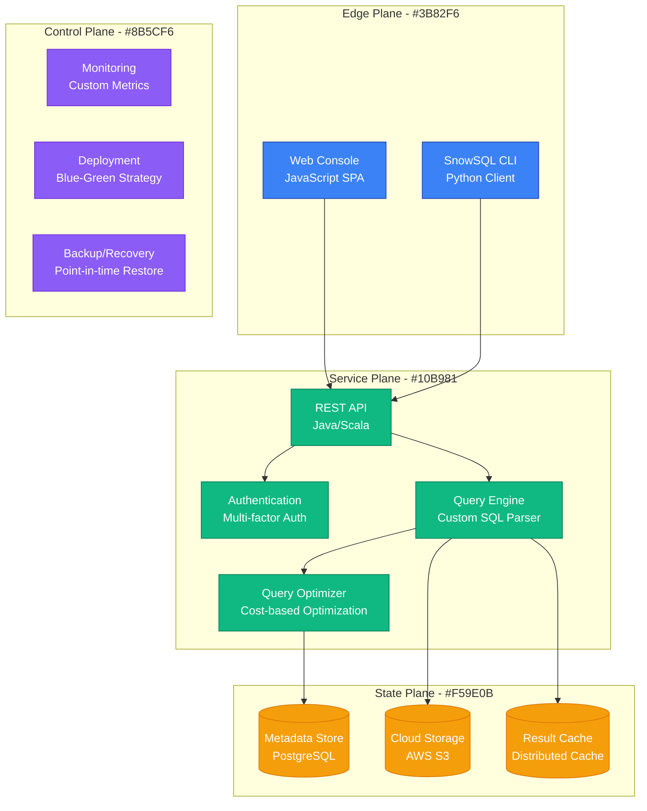
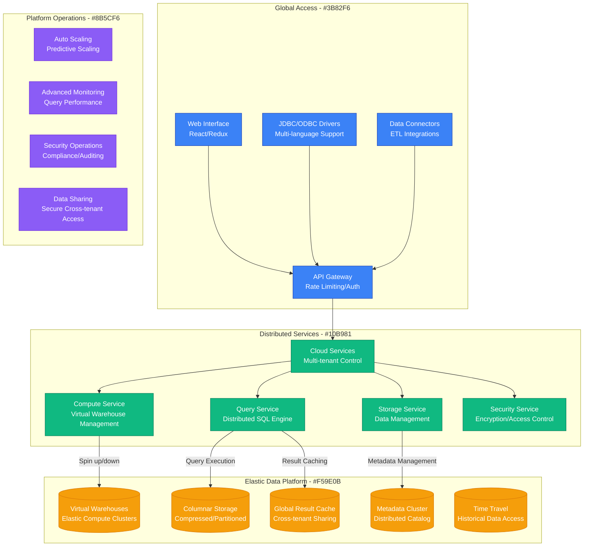
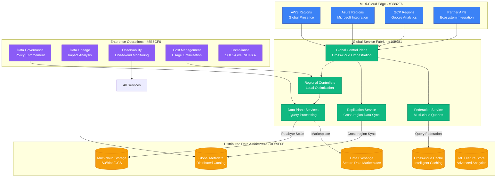
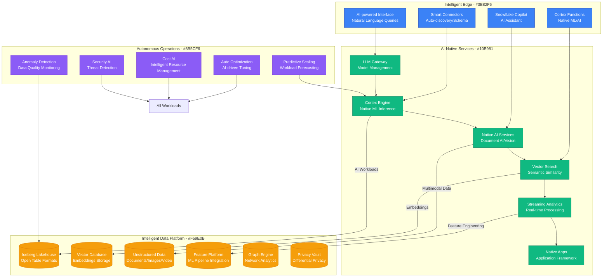
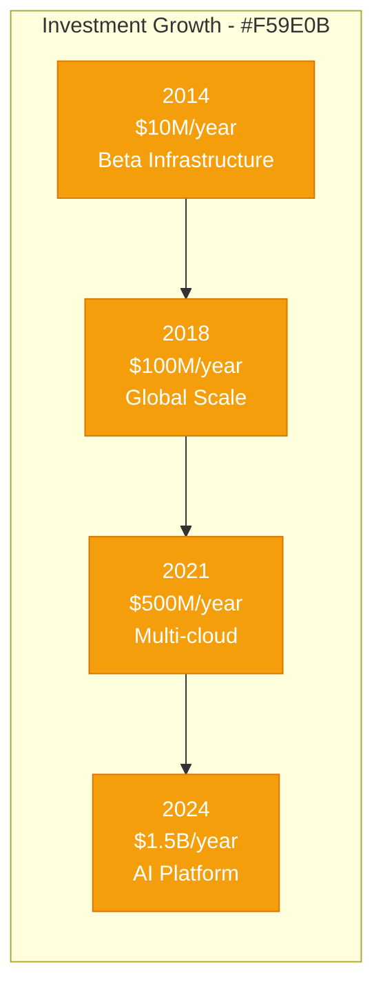

# Snowflake: Data Warehouse Explosive Growth

## Executive Summary

Snowflake's scaling journey from a startup idea to a $70B+ cloud data platform serving 10,000+ enterprise customers represents one of the most successful data infrastructure transformations in history. This case study examines their evolution from 2012 to 2024, focusing on the unique challenges of scaling a multi-tenant data warehouse that processes exabytes of data daily across millions of concurrent queries.

## Scale Milestones

| Milestone | Year | Customers | Key Challenge | Solution | Data Processed |
|-----------|------|-----------|---------------|----------|----------------|
| Stealth | 2012 | 0 | Concept validation | Cloud-native architecture | 0 |
| Beta | 2014 | 10 | Multi-tenancy | Shared-nothing architecture | 1TB/day |
| Launch | 2015 | 100 | Performance | Columnar storage + vectorization | 100TB/day |
| Growth | 2018 | 1,000 | Global scale | Multi-cloud architecture | 10PB/day |
| Dominance | 2024 | 10,000+ | AI workloads | Native ML/AI integration | 1EB/day |

## Architecture Evolution

### Phase 1: Cloud-Native Foundation (2012-2014)
*Scale: 0 → 10 customers*

**Key Innovation**: Separation of compute and storage, enabling independent scaling.

**Key Metrics (2014)**:
- Concurrent Queries: 100
- Data Stored: 1TB
- Query Response: 10-30 seconds
- Customers: 10 beta users

### Phase 2: Multi-Tenant Scale (2014-2018)
*Scale: 10 → 1,000 customers*

**Breakthrough Moment**: Virtual warehouses launch in 2016 enabled instant scaling without resource contention.

**Key Metrics (2018)**:
- Concurrent Queries: 100,000+
- Data Stored: 10PB+
- Customers: 1,000+
- Query Performance: Sub-second for most queries

### Phase 3: Multi-Cloud Global Platform (2018-2021)
*Scale: 1,000 → 5,000 customers*

**Key Innovation**: True multi-cloud architecture allowing customers to run workloads across AWS, Azure, and GCP.

**Key Metrics (2021)**:
- Data Processed: 1EB+ daily
- Concurrent Users: 1M+
- Query Volume: 1B+ queries/day
- Global Regions: 25+

### Phase 4: AI-Native Data Cloud (2021-2024)
*Scale: 5,000 → 10,000+ customers*

**Current Metrics (2024)**:
- Data Processed: 2EB+ daily
- AI Workloads: 50% of compute
- Natural Language Queries: 10M+ daily
- Revenue Run Rate: $3B+

## Critical Scale Events

### The Elastic Scaling Breakthrough (2016)
**Challenge**: Traditional data warehouses couldn't scale compute independently from storage.

**Solution**: Virtual warehouses that could scale from zero to thousands of nodes in seconds.

**Impact**:
- Query performance improved 10x
- Infrastructure costs reduced 50%
- Customer satisfaction increased dramatically

### Multi-Cloud Architecture (2019)
**Challenge**: Enterprise customers wanted vendor choice and avoided cloud lock-in.

**Innovation**: True multi-cloud architecture allowing workloads to run natively on AWS, Azure, and GCP.

**Result**: Market expansion and enterprise adoption accelerated.

### Data Sharing Revolution (2020)
**Challenge**: Secure data sharing between organizations without copying data.

**Breakthrough**: Zero-copy data sharing with fine-grained access controls.

**Impact**: Created data marketplace ecosystem with $100M+ in transactions.

### AI-Native Integration (2022)
**Challenge**: AI/ML workloads required specialized infrastructure and expertise.

**Solution**: Native AI functions (Cortex) allowing SQL users to perform ML tasks directly.

### The Lakehouse Convergence (2023)
**Challenge**: Customers wanted unified platform for data warehouse and data lake workloads.

**Innovation**: Iceberg table format support enabling open lakehouse architecture.

## Technology Evolution

### Storage Architecture
- **2012-2015**: Custom columnar format
- **2015-2018**: Micro-partitioning and pruning
- **2018-2021**: Cross-cloud replication
- **2021-2024**: Open table formats (Iceberg)

### Query Engine Evolution
- **2012-2016**: Single-node vectorized execution
- **2016-2019**: Distributed MPP architecture
- **2019-2022**: Adaptive query optimization
- **2022-2024**: AI-assisted query planning

### Scaling Philosophy
- **Phase 1**: "Separate compute and storage"
- **Phase 2**: "Elastic everything"
- **Phase 3**: "Multi-cloud by design"
- **Phase 4**: "AI-native from the ground up"

## Financial Impact

### Infrastructure Investment by Phase

### Revenue Milestones
- **2015**: $1M ARR (initial launch)
- **2018**: $100M ARR (enterprise adoption)
- **2021**: $1B ARR (IPO year)
- **2024**: $3B+ ARR (AI transformation)

### Unit Economics
- **Gross Margin**: 75%+ (industry leading)
- **Customer LTV**: $10M+ (Fortune 500)
- **Payback Period**: 18 months average
- **Net Revenue Retention**: 165%+ consistently

## Lessons Learned

### What Worked
1. **Cloud-Native Architecture**: Built for cloud from day one, not migrated
2. **Separation of Concerns**: Compute/storage separation enabled elastic scaling
3. **Zero-Copy Sharing**: Created network effects and data marketplace
4. **Developer Experience**: SQL familiarity reduced adoption friction

### What Didn't Work
1. **Early Pricing Model**: Initially underpriced, had to adjust significantly
2. **Real-Time Analytics**: Late to streaming, had to build catch-up features
3. **Open Source Strategy**: Missed early Spark/Hadoop ecosystem integration
4. **Mobile Strategy**: Never developed strong mobile analytics capabilities

### Key Technical Decisions
1. **Vectorized Execution**: 10x performance improvement over row-based processing
2. **Metadata Service**: Centralized catalog enabled global query optimization
3. **Multi-Cloud Strategy**: Avoided vendor lock-in and expanded addressable market
4. **Native AI Integration**: Democratized machine learning for SQL users

## Current Architecture (2024)

**Global Infrastructure**:
- 30+ cloud regions across AWS, Azure, GCP
- 100,000+ virtual warehouses running concurrently
- 2EB+ data processed daily
- Sub-second query response times

**Key Technologies**:
- Custom vectorized query engine (C++)
- Distributed metadata service (Java/Scala)
- Multi-cloud storage abstraction
- Native AI/ML functions (Python/TensorFlow)
- Iceberg lakehouse integration

**Operating Metrics**:
- 99.99% service availability
- 2M+ concurrent queries peak
- 10,000+ enterprise customers
- 165%+ net revenue retention

## Looking Forward: Next 5 Years

### Predicted Challenges
1. **AI Compute Costs**: GPU costs for AI workloads scaling faster than revenue
2. **Data Governance**: Regulatory compliance across global jurisdictions
3. **Competition**: Cloud providers building competing native services
4. **Energy Efficiency**: Sustainability concerns around massive data processing

### Technical Roadmap
1. **Autonomous Database**: Fully self-managing and self-optimizing
2. **Natural Language Interface**: SQL-free data interaction for business users
3. **Real-Time Everything**: Stream processing as first-class citizen
4. **Quantum-Safe Security**: Preparing for post-quantum cryptography

**Summary**: Snowflake's evolution from a cloud data warehouse to an AI-native data cloud demonstrates the power of architectural decisions made early. Their separation of compute and storage, combined with a cloud-native approach, enabled unprecedented scaling and created a new category of data platform that competitors are still trying to match.