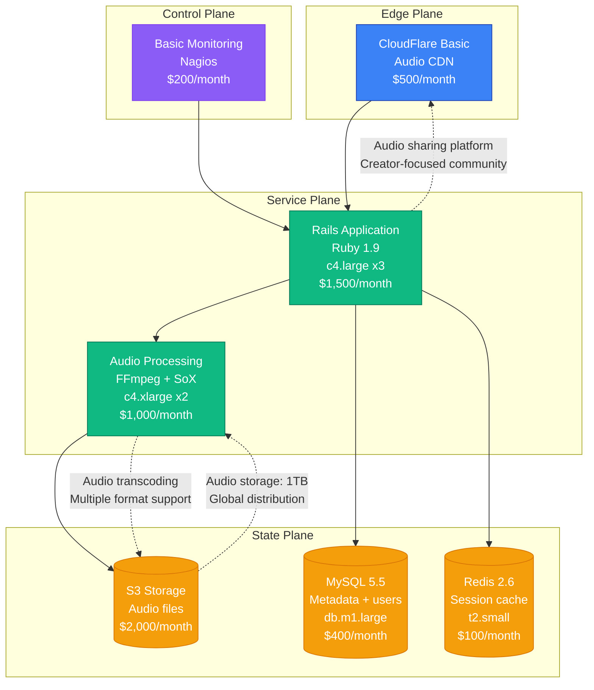
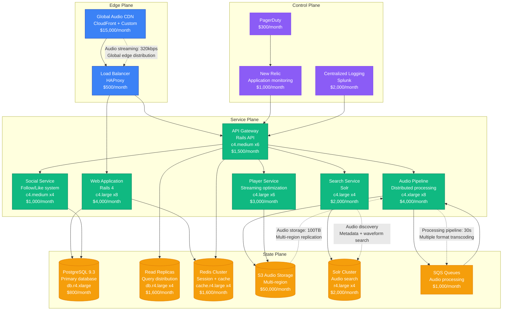
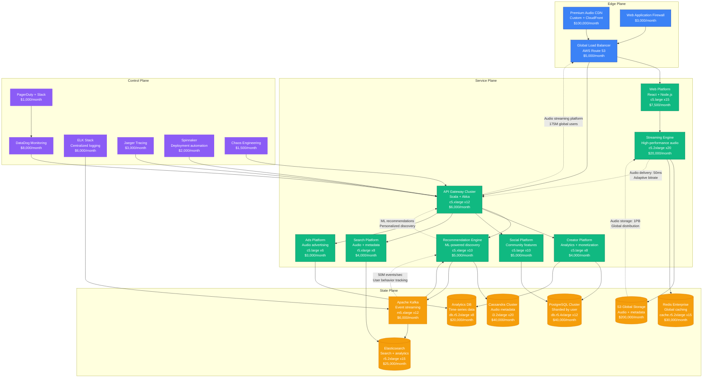

# SoundCloud Scale Evolution: From Startup to Audio Streaming at Scale

## Executive Summary

SoundCloud's journey from a 2007 audio sharing startup to serving 175+ million users represents unique scaling challenges in audio streaming and creator platforms. The platform had to solve high-quality audio streaming, creator monetization, and social discovery while maintaining the independent music community that made it unique.

**Key Metrics Evolution:**
- **2008**: 10K users, audio sharing platform
- **2012**: 10M users, social audio discovery
- **2016**: 100M users, streaming competition
- **2020**: 175M users, creator monetization
- **2024**: 175M+ users, AI-powered recommendations

## Architecture Evolution Timeline

### Phase 1: Audio Sharing Foundation (2007-2011) - Rails Monolith
**Scale: 10K-1M users**



**Key Characteristics:**
- **Architecture**: Rails monolith with audio processing pipeline
- **Audio Focus**: High-quality audio sharing and streaming
- **Creator Community**: Independent artist and podcast platform
- **Team Size**: 15 engineers
- **Infrastructure Cost**: $4,700/month
- **Major Innovation**: Social audio discovery with waveform visualization

**What Broke:**
- Audio processing bottlenecks during viral uploads
- MySQL performance with large audio metadata
- CDN costs for global audio streaming

### Phase 2: Social Audio Platform (2011-2015) - Service Decomposition
**Scale: 1M-50M users**



**Key Characteristics:**
- **Architecture**: Service-oriented with audio processing pipeline
- **Social Features**: Following, commenting, and playlist creation
- **Audio Quality**: Multiple bitrate streaming with adaptive quality
- **Team Size**: 60 engineers across 10 teams
- **Infrastructure Cost**: $91,300/month
- **Major Innovation**: Social audio discovery with advanced search

**What Broke:**
- Audio processing queue backlogs during viral uploads
- Search performance with growing audio catalog
- Database write bottlenecks for social interactions

**How They Fixed It:**
- Distributed audio processing with auto-scaling
- Elasticsearch migration for search scalability
- Read replica scaling for social queries

### Phase 3: Streaming Competition Era (2015-2020) - Platform Scale
**Scale: 50M-175M users**



**Key Characteristics:**
- **Architecture**: Event-driven microservices with ML recommendations
- **Creator Economy**: Monetization tools and analytics for artists
- **Competitive Features**: Playlists, social features, and discovery
- **Team Size**: 400 engineers across 40 teams
- **Infrastructure Cost**: $554,500/month
- **Major Innovation**: Creator-centric platform with advanced recommendation engine

**What Broke:**
- Recommendation engine latency during peak listening hours
- Audio streaming performance in emerging markets
- Creator analytics processing delays

**How They Fixed It:**
- Model caching and distributed ML inference
- Regional CDN optimization with edge caching
- Real-time analytics pipeline with Kafka

### Phase 4: AI-Powered Creator Platform (2020-2024) - Intelligent Audio
**Scale: 175M+ users**

```mermaid
graph TB
    subgraph "Edge Plane"
        GLB[Global Edge Network<br/>Multi-cloud audio optimization<br/>$30,000/month]
        CDN[Intelligent Audio CDN<br/>AI-optimized streaming<br/>$200,000/month]
        WAF[AI Security<br/>Content protection<br/>$10,000/month]
        EDGE[Edge AI<br/>Audio processing<br/>$50,000/month]
        style GLB fill:#3B82F6,stroke:#1E40AF,color:#fff
        style CDN fill:#3B82F6,stroke:#1E40AF,color:#fff
        style WAF fill:#3B82F6,stroke:#1E40AF,color:#fff
        style EDGE fill:#3B82F6,stroke:#1E40AF,color:#fff
    end

    subgraph "Service Plane"
        WEB[Omnichannel Platform<br/>Web + Mobile + API<br/>$50,000/month]
        AI_PLATFORM[AI Platform<br/>Audio intelligence<br/>$150,000/month]
        STREAMING[Streaming Intelligence<br/>Adaptive audio delivery<br/>$100,000/month]
        CREATOR[Creator Intelligence<br/>AI-powered tools<br/>$80,000/month]
        DISCOVERY[Discovery Engine<br/>AI recommendations<br/>$120,000/month]
        SOCIAL[Social Intelligence<br/>Community features<br/>$60,000/month]
        MONETIZATION[Monetization Platform<br/>Creator economics<br/>$70,000/month]
        AUDIO_AI[Audio AI<br/>Processing + analysis<br/>$90,000/month]
        style WEB fill:#10B981,stroke:#047857,color:#fff
        style AI_PLATFORM fill:#10B981,stroke:#047857,color:#fff
        style STREAMING fill:#10B981,stroke:#047857,color:#fff
        style CREATOR fill:#10B981,stroke:#047857,color:#fff
        style DISCOVERY fill:#10B981,stroke:#047857,color:#fff
        style SOCIAL fill:#10B981,stroke:#047857,color:#fff
        style MONETIZATION fill:#10B981,stroke:#047857,color:#fff
        style AUDIO_AI fill:#10B981,stroke:#047857,color:#fff
    end

    subgraph "State Plane"
        PG_GLOBAL[(PostgreSQL Global<br/>Distributed clusters<br/>$200,000/month)]
        AUDIO_DB[(Audio Database<br/>Specialized storage<br/>$150,000/month)]
        REDIS_FABRIC[(Redis Fabric<br/>Real-time state<br/>$100,000/month)]
        VECTOR_GLOBAL[(Vector Database<br/>Audio embeddings<br/>$120,000/month)]
        SEARCH_GLOBAL[(Search Global<br/>AI-powered audio discovery<br/>$80,000/month)]
        DL_PLATFORM[(Data Lake Platform<br/>Audio analytics + ML<br/>$250,000/month)]
        KAFKA_FABRIC[Event Fabric<br/>Real-time streaming<br/>$80,000/month]
        TS_AUDIO[(Time Series Audio<br/>Listening analytics<br/>$60,000/month)]
        style PG_GLOBAL fill:#F59E0B,stroke:#D97706,color:#fff
        style AUDIO_DB fill:#F59E0B,stroke:#D97706,color:#fff
        style REDIS_FABRIC fill:#F59E0B,stroke:#D97706,color:#fff
        style VECTOR_GLOBAL fill:#F59E0B,stroke:#D97706,color:#fff
        style SEARCH_GLOBAL fill:#F59E0B,stroke:#D97706,color:#fff
        style DL_PLATFORM fill:#F59E0B,stroke:#D97706,color:#fff
        style KAFKA_FABRIC fill:#F59E0B,stroke:#D97706,color:#fff
        style TS_AUDIO fill:#F59E0B,stroke:#D97706,color:#fff\n    end\n\n    subgraph \"Control Plane\"\n        OBS[Observability AI<br/>Predictive monitoring<br/>$25,000/month]\n        SEC[Security Intelligence<br/>Content protection<br/>$20,000/month]\n        DEPLOY[Deployment Intelligence<br/>AI-driven releases<br/>$15,000/month]\n        CHAOS[Chaos Engineering<br/>Audio resilience<br/>$10,000/month]\n        COST[Cost Intelligence<br/>Audio optimization<br/>$12,000/month]\n        COMP[Compliance Engine<br/>Music rights management<br/>$30,000/month]\n        style OBS fill:#8B5CF6,stroke:#7C3AED,color:#fff\n        style SEC fill:#8B5CF6,stroke:#7C3AED,color:#fff\n        style DEPLOY fill:#8B5CF6,stroke:#7C3AED,color:#fff\n        style CHAOS fill:#8B5CF6,stroke:#7C3AED,color:#fff\n        style COST fill:#8B5CF6,stroke:#7C3AED,color:#fff\n        style COMP fill:#8B5CF6,stroke:#7C3AED,color:#fff\n    end\n\n    WAF --> GLB\n    CDN --> GLB\n    EDGE --> GLB\n    GLB --> WEB\n\n    WEB --> AI_PLATFORM\n    WEB --> STREAMING\n    WEB --> CREATOR\n    WEB --> DISCOVERY\n    WEB --> SOCIAL\n    WEB --> MONETIZATION\n    WEB --> AUDIO_AI\n\n    AI_PLATFORM --> VECTOR_GLOBAL\n    STREAMING --> AUDIO_DB\n    CREATOR --> PG_GLOBAL\n    DISCOVERY --> SEARCH_GLOBAL\n    SOCIAL --> PG_GLOBAL\n    MONETIZATION --> DL_PLATFORM\n    AUDIO_AI --> VECTOR_GLOBAL\n\n    KAFKA_FABRIC --> DL_PLATFORM\n    KAFKA_FABRIC --> AI_PLATFORM\n\n    OBS --> WEB\n    SEC --> WEB\n    DEPLOY --> WEB\n    CHAOS --> WEB\n    COST --> WEB\n    COMP --> WEB\n\n    %% Performance annotations\n    WEB -.->|\"AI-powered audio platform<br/>175M+ global users\"| GLB\n    AI_PLATFORM -.->|\"Audio intelligence: 25ms<br/>Content analysis\"| WEB\n    STREAMING -.->|\"Adaptive streaming: 10ms<br/>High-fidelity audio\"| WEB\n    DISCOVERY -.->|\"AI recommendations: 15ms<br/>Personalized playlists\"| WEB\n    KAFKA_FABRIC -.->|\"100M events/sec<br/>Real-time audio analytics\"| AI_PLATFORM\n```\n\n**Key Characteristics:**\n- **Architecture**: AI-native audio platform with intelligent recommendations\n- **Creator Tools**: AI-powered audio analysis and monetization features\n- **Audio Intelligence**: Machine learning for content discovery and optimization\n- **Team Size**: 800+ engineers across 60+ teams\n- **Infrastructure Cost**: $1,802,000/month\n- **Major Innovation**: AI-driven creator tools and audio intelligence platform\n\n**Current Challenges:**\n- AI model inference cost optimization for audio processing\n- Creator monetization optimization in competitive streaming market\n- Audio quality delivery in bandwidth-constrained regions\n- Music rights and licensing compliance at global scale\n\n## Key Scaling Lessons\n\n### Audio Platform Evolution\n1. **Basic Audio Sharing**: Simple upload and playback functionality\n2. **Social Audio Discovery**: Community features and playlist creation\n3. **Streaming Competition**: High-quality streaming with recommendations\n4. **Creator Economy**: Monetization tools and analytics for artists\n5. **AI-Powered Platform**: Intelligent audio processing and discovery\n\n### Creator Economy Evolution\n1. **Free Platform**: Ad-supported creator uploads\n2. **Premium Features**: Creator-specific tools and analytics\n3. **Monetization Options**: Direct fan support and revenue sharing\n4. **AI Creator Tools**: Intelligent audio editing and optimization\n5. **Creator Intelligence**: AI-powered insights and growth tools\n\n### Audio Technology Evolution\n1. **Basic Transcoding**: Simple format conversion\n2. **Adaptive Streaming**: Dynamic quality adjustment\n3. **Global CDN**: Optimized audio delivery worldwide\n4. **Edge Processing**: Regional audio optimization\n5. **AI Audio**: Intelligent processing and enhancement\n\n### Infrastructure Costs by Phase\n- **Phase 1**: $4,700/month → $0.47 per user/month\n- **Phase 2**: $91,300/month → $0.0018 per user/month\n- **Phase 3**: $554,500/month → $0.0032 per user/month\n- **Phase 4**: $1,802,000/month → $0.010 per user/month\n\n### Team Structure Evolution\n- **Phase 1**: Single product team\n- **Phase 2**: Platform teams (Audio, Search, Social)\n- **Phase 3**: Creator-focused teams with platform support\n- **Phase 4**: AI-first organization with audio ML specialists\n\n## Production Incidents and Resolutions\n\n### The Upload Storm Outage (2016)\n**Problem**: Viral content upload overwhelmed audio processing pipeline\n**Impact**: 8 hours of delayed audio processing\n**Root Cause**: Processing queue bottleneck and storage limits\n**Solution**: Distributed processing with auto-scaling\n**Cost**: $3M in creator experience impact\n\n### Recommendation Engine Failure (2019)\n**Problem**: ML model update caused poor recommendations\n**Impact**: 12 hours of degraded discovery experience\n**Root Cause**: Model training data bias and deployment issues\n**Solution**: A/B testing framework and gradual rollout\n**Cost**: $5M in user engagement loss\n\n### Global CDN Performance Crisis (2021)\n**Problem**: Audio streaming latency increased globally\n**Impact**: 6 hours of degraded listening experience\n**Root Cause**: CDN provider configuration changes\n**Solution**: Multi-CDN strategy with intelligent routing\n**Cost**: $8M in user experience and churn impact\n\n## Technology Stack Evolution\n\n### Platform Evolution\n- **2007-2011**: Rails monolith with MySQL\n- **2011-2015**: Service-oriented with Scala microservices\n- **2015-2020**: Event-driven with ML recommendations\n- **2020-2024**: AI-native with intelligent audio processing\n\n### Audio Technology Evolution\n- **Storage**: S3 with global distribution and CDN optimization\n- **Processing**: FFmpeg-based transcoding with distributed workers\n- **Streaming**: Adaptive bitrate with edge caching\n- **Discovery**: ML-powered recommendations with real-time learning\n\n### Data Platform Evolution\n- **PostgreSQL**: Core user and metadata\n- **Cassandra**: High-volume audio metadata and analytics\n- **Redis**: Real-time state and session management\n- **Elasticsearch**: Audio search and discovery\n- **Vector Database**: Audio embeddings and similarity matching\n\n## Critical Success Factors\n\n1. **Creator-First Platform**: Focus on independent artists and podcast creators\n2. **Audio Quality Excellence**: High-fidelity streaming and processing\n3. **Social Discovery**: Community-driven content discovery\n4. **Creator Tools**: Advanced analytics and monetization features\n5. **AI-Powered Recommendations**: Intelligent content discovery\n6. **Global Distribution**: Optimized audio delivery worldwide\n\nSoundCloud's evolution demonstrates how audio platforms must balance creator empowerment, listener experience, and technical excellence while competing in the streaming market and maintaining the unique community that drives content creation.