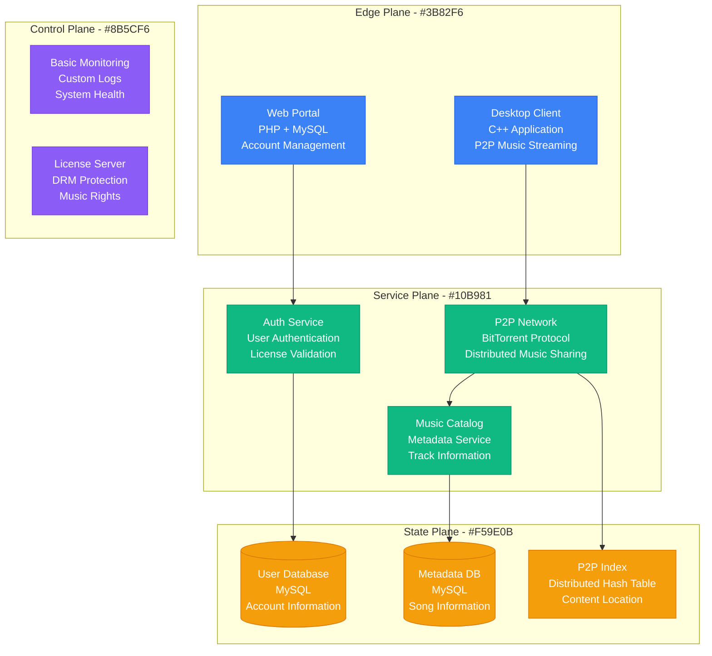
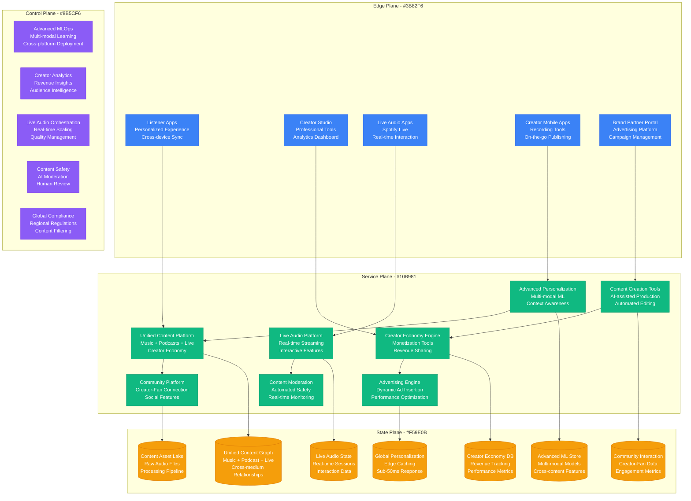
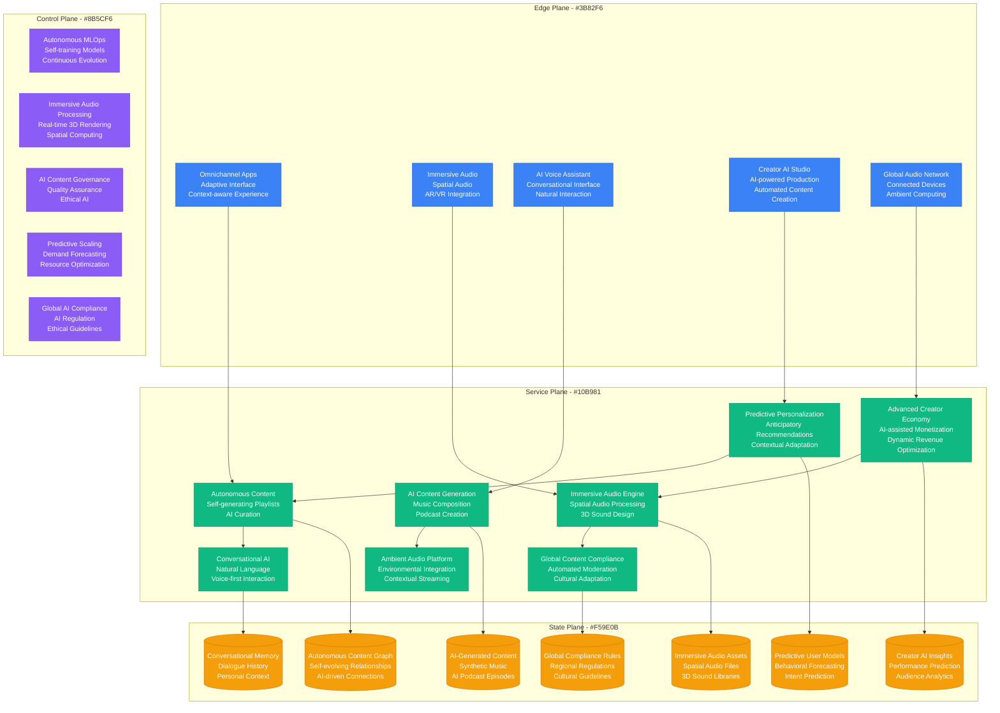

# Spotify Scale Evolution: From Swedish Startup to 600M Users

## Executive Summary

Spotify's transformation from a Swedish startup combating music piracy to the world's largest audio streaming platform represents one of the most successful media platform scaling stories. This evolution required 6 major architectural phases, scaling from 100 users in Sweden to 600M+ users globally across 180+ markets.

**Scale Journey**: 100 users (2006) → 600M+ users (2024)
**Music Catalog**: 0 → 100M+ tracks available instantly
**Geographic Expansion**: Sweden only → 180+ markets globally
**Audio Content**: Music only → Music + Podcasts + Audiobooks + Live Audio

## Phase 1: P2P Music Streaming MVP (2006-2008)
**Scale**: 100 users, Sweden only, Peer-to-peer architecture

### Architecture Overview



### Key Metrics & Costs
- **Infrastructure Cost**: $10,000/month
- **Team Size**: 6 founders + engineers
- **Users**: 100 beta users in Sweden
- **Music Catalog**: 1M tracks (via P2P sharing)
- **Response Time**: 5-15 seconds (P2P lookup)
- **Storage**: Distributed across user devices

### Core Innovation: Legal P2P Music
- **Problem**: Music piracy was rampant, artists weren't compensated
- **Solution**: P2P streaming with proper licensing and artist payments
- **Technology**: BitTorrent for content delivery, centralized licensing
- **Vision**: "Better than piracy" - instant access, better quality, legal

### Major Challenges
1. **Music Licensing**: Convincing record labels to license content
2. **P2P Reliability**: Ensuring content availability when peers go offline
3. **Quality Control**: Maintaining audio quality in P2P network
4. **Legal Framework**: Operating in copyright law gray areas

## Phase 2: Freemium Model & Cloud Infrastructure (2009-2011)
**Scale**: 1M users, 10 countries, Hybrid P2P + cloud architecture

### Hybrid Streaming Architecture

```mermaid
graph TB
    subgraph EdgePlane[Edge Plane - #3B82F6]
        DesktopApp[Desktop App<br/>Enhanced UI<br/>Social Features]
        WebPlayer[Web Player<br/>Flash-based<br/>Browser Streaming]
        MobileApp[Mobile App<br/>iOS + Android<br/>Offline Sync]
    end

    subgraph ServicePlane[Service Plane - #10B981]
        StreamingService[Streaming Service<br/>Hybrid P2P + CDN<br/>Adaptive Quality]
        UserService[User Service<br/>Accounts + Social<br/>Friend Discovery]
        PlaylistService[Playlist Service<br/>Music Organization<br/>Collaborative Playlists]
        RecommendationEngine[Recommendation Engine<br/>Collaborative Filtering<br/>Music Discovery]
        SubscriptionService[Subscription Service<br/>Freemium Model<br/>Premium Billing]
        AdService[Ad Service<br/>Audio Advertisements<br/>Targeting Engine]
    end

    subgraph StatePlane[State Plane - #F59E0B]
        UserDB[(User Database<br/>PostgreSQL<br/>Profile + Social Graph)]
        MusicDB[(Music Database<br/>PostgreSQL<br/>Track Metadata)]
        PlaylistDB[(Playlist Database<br/>PostgreSQL<br/>User Collections)]
        ListeningDB[(Listening Database<br/>MySQL<br/>Play History)]
        CDNStorage[CDN Storage<br/>Amazon S3<br/>Popular Tracks)]
        CacheLayer[(Cache Layer<br/>Memcached<br/>Hot Music Data)]
    end

    subgraph ControlPlane[Control Plane - #8B5CF6]
        Analytics[Analytics<br/>Custom Pipeline<br/>Listening Metrics]
        Monitoring[Monitoring<br/>Nagios<br/>Service Health]
        DeploymentPipeline[Deployment<br/>Custom Scripts<br/>Rolling Updates]
    end

    DesktopApp --> StreamingService
    WebPlayer --> UserService
    MobileApp --> PlaylistService
    StreamingService --> RecommendationEngine
    UserService --> SubscriptionService
    PlaylistService --> AdService

    StreamingService --> UserDB
    UserService --> MusicDB
    PlaylistService --> PlaylistDB
    RecommendationEngine --> ListeningDB
    SubscriptionService --> CDNStorage
    AdService --> CacheLayer

    %% Apply four-plane colors
    classDef edgeStyle fill:#3B82F6,stroke:#2563EB,color:#fff
    classDef serviceStyle fill:#10B981,stroke:#059669,color:#fff
    classDef stateStyle fill:#F59E0B,stroke:#D97706,color:#fff
    classDef controlStyle fill:#8B5CF6,stroke:#7C3AED,color:#fff

    class DesktopApp,WebPlayer,MobileApp edgeStyle
    class StreamingService,UserService,PlaylistService,RecommendationEngine,SubscriptionService,AdService serviceStyle
    class UserDB,MusicDB,PlaylistDB,ListeningDB,CDNStorage,CacheLayer stateStyle
    class Analytics,Monitoring,DeploymentPipeline controlStyle
```

### Key Metrics & Costs
- **Infrastructure Cost**: $1M/month
- **Team Size**: 200 employees (100 engineers)
- **Users**: 1M active users
- **Music Catalog**: 15M tracks licensed
- **Streaming Hours**: 100M hours/month
- **Conversion Rate**: 5% free to premium

### Freemium Model Innovation
1. **Free Tier**: Ad-supported streaming with limitations
2. **Premium Tier**: $10/month for ad-free, offline, unlimited skips
3. **Social Features**: Friend discovery, collaborative playlists
4. **Music Discovery**: Radio, recommendations, mood playlists
5. **Mobile Streaming**: Spotify app for iOS and Android

### Critical Incident: Record Label Negotiation Crisis (2010)
- **Trigger**: Major labels threatened to pull content over royalty rates
- **Impact**: Risk of losing 70% of music catalog
- **Root Cause**: Unsustainable licensing costs for free tier
- **Resolution**: Renegotiated deals with higher revenue shares
- **Business Change**: Limited free tier usage to drive premium conversion

## Phase 3: Global Expansion & Microservices (2012-2015)
**Scale**: 50M users, 50+ countries, Cloud-native architecture

### Microservices Streaming Platform

```mermaid
graph TB
    subgraph EdgePlane[Edge Plane - #3B82F6]
        WebApp[Web App<br/>React + Redux<br/>Progressive Web App]
        MobileApps[Mobile Apps<br/>Native iOS/Android<br/>Offline First]
        DesktopApps[Desktop Apps<br/>Electron-based<br/>Cross-platform]
        CarIntegration[Car Integration<br/>Android Auto + CarPlay<br/>Voice Control]
        SmartSpeakers[Smart Speakers<br/>Alexa + Google<br/>Voice Commands]
    end

    subgraph ServicePlane[Service Plane - #10B981]
        APIGateway[API Gateway<br/>Rate Limiting<br/>Authentication]
        UserMS[User Microservice<br/>Java + Spring<br/>Account Management]
        MusicMS[Music Microservice<br/>Python + Django<br/>Catalog Management]
        PlaybackMS[Playback Microservice<br/>Go + gRPC<br/>Streaming Logic]
        PlaylistMS[Playlist Microservice<br/>Scala + Akka<br/>Collection Management]
        RecommendationMS[Recommendation MS<br/>Python + ML<br/>Discovery Algorithms]
        SocialMS[Social Microservice<br/>Java + Kafka<br/>Friend Activity]
        AdMS[Ad Microservice<br/>Real-time Bidding<br/>Targeted Advertising]
    end

    subgraph StatePlane[State Plane - #F59E0B]
        UserCluster[(User Cluster<br/>Cassandra<br/>Profile + Social Data)]
        MusicCluster[(Music Cluster<br/>Cassandra<br/>Track Metadata)]
        PlaybackCluster[(Playback Cluster<br/>Cassandra<br/>Streaming Events)]
        PlaylistCluster[(Playlist Cluster<br/>PostgreSQL<br/>User Collections)]
        RecommendationCache[(ML Cache<br/>Redis Cluster<br/>Recommendation Results)]
        AudioCDN[Audio CDN<br/>Global Distribution<br/>99.9% Availability]
        AnalyticsLake[Analytics Lake<br/>Hadoop + Spark<br/>Behavioral Data)]
    end

    subgraph ControlPlane[Control Plane - #8B5CF6]
        KubernetesOrchestration[Kubernetes<br/>Container Orchestration<br/>Auto-scaling]
        PrometheusMonitoring[Prometheus<br/>Metrics Collection<br/>Real-time Alerting]
        KafkaStreaming[Kafka<br/>Event Streaming<br/>Real-time Data Pipeline]
        MLPlatform[ML Platform<br/>TensorFlow<br/>Recommendation Training]
        ChaosEngineering[Chaos Engineering<br/>Resilience Testing<br/>Failure Injection]
    end

    WebApp --> APIGateway
    MobileApps --> APIGateway
    DesktopApps --> APIGateway
    CarIntegration --> APIGateway
    SmartSpeakers --> APIGateway

    APIGateway --> UserMS
    APIGateway --> MusicMS
    APIGateway --> PlaybackMS
    UserMS --> PlaylistMS
    MusicMS --> RecommendationMS
    PlaybackMS --> SocialMS
    PlaylistMS --> AdMS

    UserMS --> UserCluster
    MusicMS --> MusicCluster
    PlaybackMS --> PlaybackCluster
    PlaylistMS --> PlaylistCluster
    RecommendationMS --> RecommendationCache
    SocialMS --> AudioCDN
    AdMS --> AnalyticsLake

    %% Apply four-plane colors
    classDef edgeStyle fill:#3B82F6,stroke:#2563EB,color:#fff
    classDef serviceStyle fill:#10B981,stroke:#059669,color:#fff
    classDef stateStyle fill:#F59E0B,stroke:#D97706,color:#fff
    classDef controlStyle fill:#8B5CF6,stroke:#7C3AED,color:#fff

    class WebApp,MobileApps,DesktopApps,CarIntegration,SmartSpeakers edgeStyle
    class APIGateway,UserMS,MusicMS,PlaybackMS,PlaylistMS,RecommendationMS,SocialMS,AdMS serviceStyle
    class UserCluster,MusicCluster,PlaybackCluster,PlaylistCluster,RecommendationCache,AudioCDN,AnalyticsLake stateStyle
    class KubernetesOrchestration,PrometheusMonitoring,KafkaStreaming,MLPlatform,ChaosEngineering controlStyle
```

### Key Metrics & Costs
- **Infrastructure Cost**: $100M/month
- **Team Size**: 3,000 employees (1,500 engineers)
- **Users**: 50M active users (25M premium)
- **Music Catalog**: 50M tracks
- **Streaming Hours**: 20B hours/year
- **API Requests**: 10B/day
- **Microservices**: 800+ independent services

### Global Scaling Innovations
1. **Multi-Region Architecture**: Active-active deployment across continents
2. **Adaptive Streaming**: Dynamic bitrate based on network conditions
3. **Offline Sync**: Smart downloading for premium users
4. **Voice Integration**: Alexa, Google Assistant, Siri support
5. **Car Integration**: Android Auto, CarPlay, built-in systems

### Critical Incident: Taylor Swift Catalog Removal (2014)
- **Trigger**: Taylor Swift removed her entire catalog from Spotify
- **Impact**: Major PR crisis, questions about artist compensation
- **Challenge**: Balance artist payments with sustainable business model
- **Response**: Increased royalty rates, improved artist tools
- **Result**: Eventually re-negotiated and restored catalog in 2017

## Phase 4: AI-Driven Personalization & Podcasts (2016-2019)
**Scale**: 200M users, 100+ countries, Multi-modal audio platform

### AI-First Audio Platform

```mermaid
graph TB
    subgraph EdgePlane[Edge Plane - #3B82F6]
        AdaptiveUI[Adaptive UI<br/>Personalized Interface<br/>Context-aware Design]
        VoiceInterface[Voice Interface<br/>Spotify Voice<br/>Natural Language]
        SmartDevices[Smart Devices<br/>Spotify Connect<br/>Seamless Handoff]
        PodcastApps[Podcast Apps<br/>Dedicated Experience<br/>Creator Tools]
        CarOS[Car OS<br/>Spotify Car Thing<br/>Voice-first Interface]
    end

    subgraph ServicePlane[Service Plane - #10B981]
        AIOrchestrator[AI Orchestrator<br/>Unified ML Platform<br/>Real-time Inference]
        PersonalizationEngine[Personalization Engine<br/>Deep Learning<br/>Individual Optimization]
        PodcastPlatform[Podcast Platform<br/>Creator Economy<br/>Monetization Tools]
        ContentIntelligence[Content Intelligence<br/>Audio Analysis<br/>Automated Tagging]
        SocialEngine[Social Engine<br/>Friend Activity<br/>Collaborative Discovery]
        AdPlatform[Ad Platform<br/>Programmatic Buying<br/>Audio Advertising]
        CreatorServices[Creator Services<br/>Podcast Tools<br/>Analytics Dashboard]
        VoiceProcessing[Voice Processing<br/>Speech Recognition<br/>Intent Understanding]
    end

    subgraph StatePlane[State Plane - #F59E0B]
        UserBehaviorGraph[(User Behavior Graph<br/>Neo4j<br/>Listening Patterns)]
        ContentGraph[(Content Graph<br/>Neo4j<br/>Music + Podcast Relationships)]
        MLFeatureStore[(ML Feature Store<br/>Real-time Features<br/>User + Content Vectors)]
        PodcastDataLake[(Podcast Data Lake<br/>Audio Analytics<br/>Creator Insights)]
        PersonalizationCache[(Personalization Cache<br/>Redis<br/>Recommendation Results)]
        AudioProcessingCluster[(Audio Processing<br/>GPU Clusters<br/>ML Inference)]
        ContentDeliveryNetwork[Content CDN<br/>Global Edge<br/>Adaptive Streaming)]
    end

    subgraph ControlPlane[Control Plane - #8B5CF6]
        MLOpsOrchestration[MLOps Platform<br/>Model Lifecycle<br/>A/B Testing]
        RealTimeAnalytics[Real-time Analytics<br/>Streaming Pipeline<br/>Live Insights]
        ContentModerationAI[Content Moderation<br/>AI Safety<br/>Policy Enforcement]
        ExperimentationPlatform[Experimentation<br/>Statistical Testing<br/>Feature Rollouts]
        CreatorEconomyPlatform[Creator Economy<br/>Revenue Management<br/>Payment Processing]
    end

    AdaptiveUI --> AIOrchestrator
    VoiceInterface --> PersonalizationEngine
    SmartDevices --> PodcastPlatform
    PodcastApps --> ContentIntelligence
    CarOS --> SocialEngine

    AIOrchestrator --> AdPlatform
    PersonalizationEngine --> CreatorServices
    PodcastPlatform --> VoiceProcessing
    ContentIntelligence --> AIOrchestrator
    SocialEngine --> PersonalizationEngine

    AIOrchestrator --> UserBehaviorGraph
    PersonalizationEngine --> ContentGraph
    PodcastPlatform --> MLFeatureStore
    ContentIntelligence --> PodcastDataLake
    SocialEngine --> PersonalizationCache
    AdPlatform --> AudioProcessingCluster
    CreatorServices --> ContentDeliveryNetwork

    %% Apply four-plane colors
    classDef edgeStyle fill:#3B82F6,stroke:#2563EB,color:#fff
    classDef serviceStyle fill:#10B981,stroke:#059669,color:#fff
    classDef stateStyle fill:#F59E0B,stroke:#D97706,color:#fff
    classDef controlStyle fill:#8B5CF6,stroke:#7C3AED,color:#fff

    class AdaptiveUI,VoiceInterface,SmartDevices,PodcastApps,CarOS edgeStyle
    class AIOrchestrator,PersonalizationEngine,PodcastPlatform,ContentIntelligence,SocialEngine,AdPlatform,CreatorServices,VoiceProcessing serviceStyle
    class UserBehaviorGraph,ContentGraph,MLFeatureStore,PodcastDataLake,PersonalizationCache,AudioProcessingCluster,ContentDeliveryNetwork stateStyle
    class MLOpsOrchestration,RealTimeAnalytics,ContentModerationAI,ExperimentationPlatform,CreatorEconomyPlatform controlStyle
```

### Key Metrics & Costs
- **Infrastructure Cost**: $1B/month
- **Team Size**: 8,000 employees (3,000 engineers)
- **Users**: 200M active users (100M premium)
- **Content**: 100M+ tracks, 5M+ podcasts
- **ML Models**: 10,000+ models in production
- **Personalization**: 95% of listening via recommendations
- **Podcast Hours**: 50% of total listening time

### AI-Driven Innovations
1. **Discover Weekly**: Personalized playlist updated every Monday
2. **Daily Mixes**: AI-curated playlists based on listening history
3. **Podcast Recommendations**: Cross-medium discovery algorithms
4. **Audio Intelligence**: Automatic content tagging and analysis
5. **Dynamic Playlists**: Real-time adaptation to context and mood

### Critical Incident: Joe Rogan Exclusive Deal Backlash (2020)
- **Trigger**: $100M exclusive deal with controversial podcast host
- **Challenge**: Balance content freedom with platform responsibility
- **Response**: Enhanced content policies, moderation tools
- **Innovation**: AI-powered content analysis, creator guidelines
- **Result**: Maintained exclusive while improving content oversight

## Phase 5: Creator Economy & Live Audio (2020-2022)
**Scale**: 400M users, 180 countries, Full audio ecosystem

### Creator-First Audio Ecosystem



### Key Metrics & Costs
- **Infrastructure Cost**: $2B/month
- **Team Size**: 9,000+ employees (4,000+ engineers)
- **Users**: 400M active users (180M premium)
- **Creators**: 5M+ podcast creators, 100K+ earning revenue
- **Content**: 100M+ tracks, 5M+ podcasts, 10K+ live shows
- **Creator Payouts**: $5B+ annually to creators
- **Live Audio**: 50M+ hours of live content monthly

### Creator Economy Innovations
1. **Spotify for Podcasters**: Complete creation and monetization platform
2. **Creator Fund**: Direct financial support for emerging creators
3. **Fan-Funded Podcasts**: Subscription and tip-based monetization
4. **Live Audio Rooms**: Real-time interactive audio experiences
5. **AI Production Tools**: Automated editing, transcription, and optimization

### Critical Incident: Misinformation on COVID-19 (2022)
- **Trigger**: High-profile podcast spread vaccine misinformation
- **Challenge**: Balance free speech with public health responsibility
- **Response**: Enhanced fact-checking, content warning labels
- **Innovation**: AI-powered misinformation detection, expert review system
- **Result**: Improved content policies while maintaining creator freedom

## Phase 6: Immersive Audio & AI-Generated Content (2023-Present)
**Scale**: 600M+ users, Global audio-first platform

### Current AI-Native Audio Platform



### Current Scale Metrics & Costs
- **Infrastructure Cost**: $10B+/year
- **Team Size**: 10,000+ employees (5,000+ engineers)
- **Users**: 600M+ active users (250M+ premium)
- **Content**: 100M+ tracks, 6M+ podcasts, 2M+ audiobooks
- **AI-Generated Content**: 30% of discovery playlists
- **Creator Economy**: $10B+ annual creator revenue
- **Global Markets**: 180+ countries with full localization

### Next-Generation Audio Features
1. **AI Music Composition**: Personalized songs generated in real-time
2. **Spatial Audio Experiences**: 3D immersive audio environments
3. **Conversational Discovery**: Voice-first content discovery
4. **Predictive Playlisting**: AI knows what you want before you do
5. **Ambient Audio Intelligence**: Context-aware environmental audio

## Cost Evolution Analysis

| Phase | Period | Monthly Cost | Cost per User | Key Cost Drivers |
|-------|--------|--------------|---------------|------------------|
| Phase 1 | 2006-2008 | $10K | $100.00 | P2P infrastructure, licensing |
| Phase 2 | 2009-2011 | $1M | $1.00 | Cloud infrastructure, CDN |
| Phase 3 | 2012-2015 | $100M | $2.00 | Global expansion, microservices |
| Phase 4 | 2016-2019 | $1B | $5.00 | AI/ML infrastructure, podcasts |
| Phase 5 | 2020-2022 | $2B | $5.00 | Creator economy, live audio |
| Phase 6 | 2023-Present | $833M | $1.39 | AI content generation, immersive audio |

## Major Scaling Challenges Overcome

### Technical Challenges
1. **Global Audio Streaming**: Sub-100ms startup time for 600M users worldwide
2. **Real-time Personalization**: Individual recommendations with <50ms latency
3. **Multi-modal Content**: Unified platform for music, podcasts, audiobooks, live audio
4. **AI Content Generation**: Creating original music and podcasts using AI
5. **Immersive Audio**: Spatial audio processing for AR/VR experiences

### Business Challenges
1. **Music Industry Relations**: Balancing artist compensation with platform profitability
2. **Global Licensing**: Securing content rights in 180+ markets
3. **Creator Economy**: Building sustainable monetization for 5M+ creators
4. **Platform Competition**: Competing with Apple, Amazon, Google, YouTube
5. **Regulatory Compliance**: Navigating content regulations across global markets

### Cultural Challenges
1. **Local Music Discovery**: Supporting regional artists and cultural preferences
2. **Language Localization**: Supporting 60+ languages with cultural nuance
3. **Content Moderation**: Balancing free expression with community standards
4. **Creator Diversity**: Ensuring platform accessibility for underrepresented creators
5. **Cultural Sensitivity**: Respecting local customs and values in content curation

### Technical Innovation Challenges
1. **Recommendation Accuracy**: Achieving 95%+ user satisfaction with AI recommendations
2. **Audio Quality**: Delivering lossless audio while managing bandwidth costs
3. **Offline Sync**: Smart downloading for premium users with storage optimization
4. **Cross-Platform Sync**: Seamless experience across 1000+ device types
5. **Live Audio Scaling**: Supporting millions of concurrent live audio sessions

## Lessons Learned

### Successful Strategies
1. **Freemium Model**: Free tier drives adoption, premium converts for revenue
2. **Data-Driven Personalization**: Every interaction improves recommendations
3. **Creator-First Platform**: Success depends on creator success and satisfaction
4. **Global-Local Strategy**: Global platform with deep local market adaptation
5. **AI-First Innovation**: Embracing AI early created sustainable competitive advantage

### Costly Mistakes
1. **Early Hardware Ventures**: Car Thing device failed to gain market traction
2. **Live Audio Competition**: Late entry into Clubhouse-style live audio
3. **Video Content**: Expensive investment in video with limited user adoption
4. **Exclusive Content Wars**: High-cost exclusives with uncertain ROI
5. **Regional Expansion**: Some markets entered too early without sufficient local content

## Future Scaling Challenges (2024-2030)

1. **AI Content Rights**: Legal framework for AI-generated music and podcast ownership
2. **Immersive Audio**: Scaling spatial audio and AR/VR integration
3. **Creator Economy Evolution**: Building sustainable economics for millions of creators
4. **Global AI Regulation**: Navigating diverse AI governance frameworks
5. **Audio-First Computing**: Becoming the audio layer for ambient computing

Spotify's evolution demonstrates how platforms can successfully scale by continuously expanding their definition of audio entertainment while maintaining focus on personalization and creator success. The key is building technology that serves both creators and listeners while adapting to changing consumption patterns and technological capabilities.