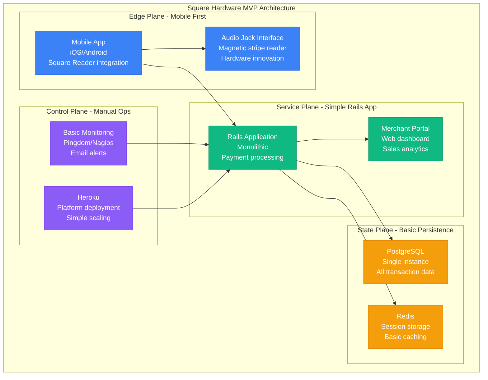
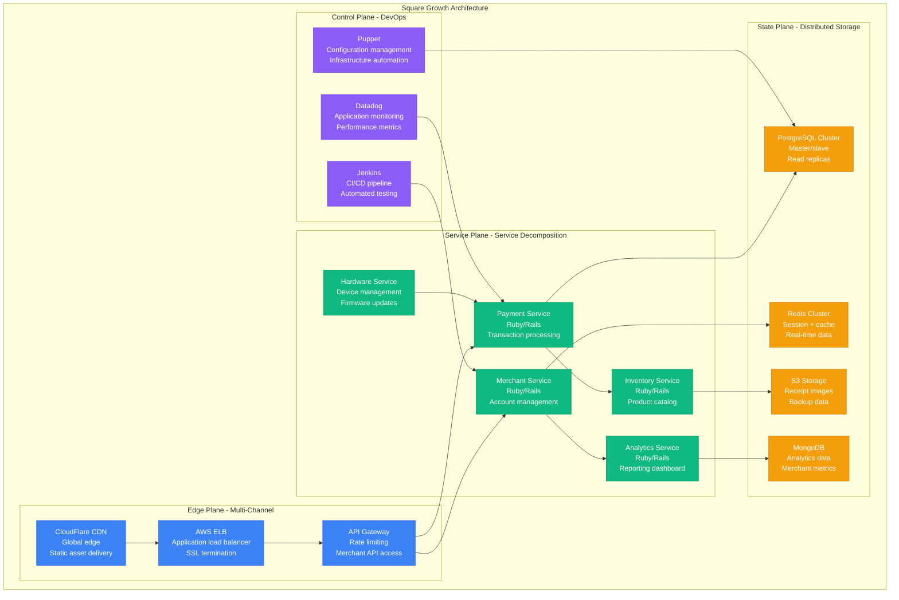
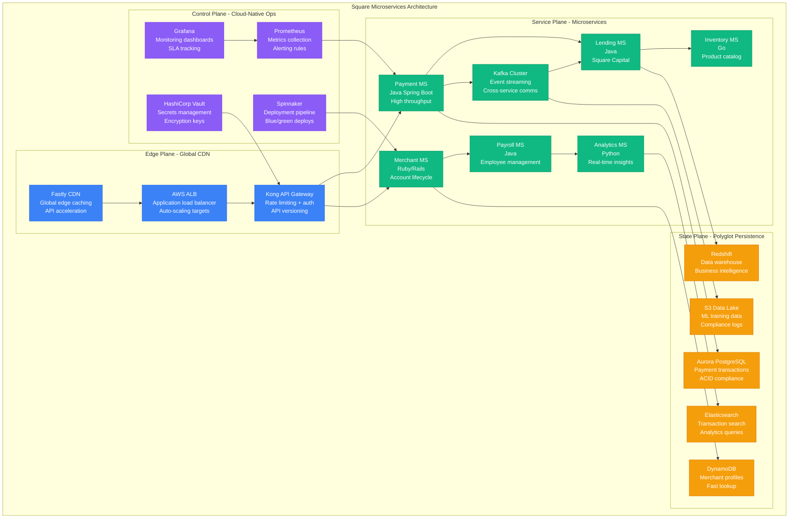
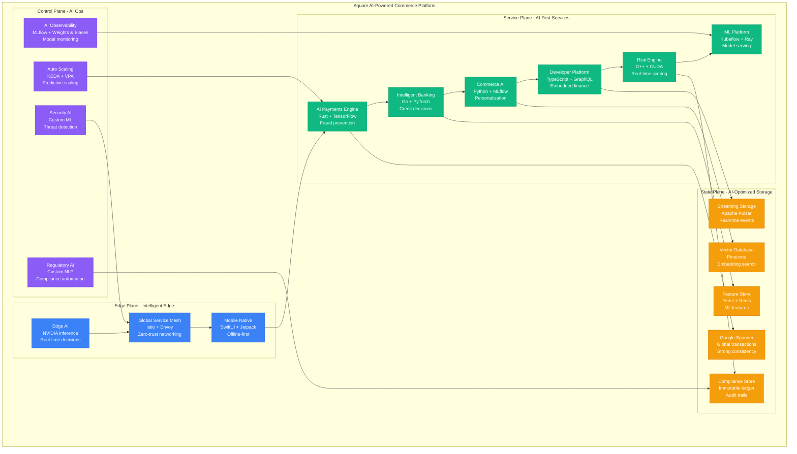

# Square Scale Evolution: Hardware to Cloud Platform - 4M Merchants, $200B GPV

## Executive Summary

Square scaled from a simple credit card reader prototype in 2009 to a comprehensive financial services platform processing $200+ billion annually for 4+ million merchants. This journey showcases the evolution from hardware innovation to cloud-native financial infrastructure, demonstrating how to scale payment processing while maintaining simplicity for small businesses.

**Key Scaling Achievements:**
- **Merchants**: 10 coffee shops → 4,000,000+ businesses (400,000x growth)
- **Annual GPV**: $1K → $200B+ Gross Payment Volume
- **Transactions**: 100/day → 3B+/year (30,000x growth)
- **Revenue**: $0 → $5.2B annually
- **Infrastructure**: Single server → Multi-cloud global platform

## Phase 1: Hardware Innovation MVP (2009-2011)
**Scale**: 10-1K merchants, $1M GPV | **Cost**: $10K/month



**The Hardware Innovation**:
- **Audio jack interface**: Leveraged existing smartphone hardware
- **Magnetic stripe reader**: $10 manufacturing cost vs $300 traditional terminals
- **Mobile SDK**: Native iOS/Android payment integration
- **Real-time processing**: Card authorization in <3 seconds

**What Broke**: Single PostgreSQL instance, Heroku scaling limits, manual hardware fulfillment.

## Phase 2: Rapid Growth and Infrastructure Scale (2011-2014)
**Scale**: 1K-100K merchants, $2B GPV | **Cost**: $500K/month



**Key Innovations**:
- **Chip card reader**: EMV compliance ahead of industry
- **Register ecosystem**: Beyond payments to full POS
- **Real-time analytics**: Merchant dashboard with live sales data
- **Hardware at scale**: Manufacturing and logistics infrastructure

**Production Metrics (2014)**:
- **100,000 merchants** actively processing
- **$2B annual GPV** (Gross Payment Volume)
- **99.9% uptime** for payment processing
- **<2 second** average transaction time

**What Broke**: Monolithic Rails apps causing deployment bottlenecks, database write scaling limits.

## Phase 3: Microservices and Financial Products (2014-2018)
**Scale**: 100K-1M merchants, $50B GPV | **Cost**: $5M/month



**Financial Products Innovation**:
- **Square Capital**: $1B+ in business loans originated
- **Square Payroll**: Integrated payroll processing
- **Square Cash**: P2P payment app (later Cash App)
- **Square Register**: Complete POS ecosystem

**Production Metrics (2018)**:
- **1M+ merchants** processing payments
- **$50B annual GPV**
- **99.95% uptime** across all services
- **<100ms p99 latency** for payment authorization
- **10,000 TPS** peak transaction volume

**What Broke**: Cross-service transaction complexity, data consistency challenges across microservices.

## Phase 4: Fintech Platform and Banking (2018-2022)
**Scale**: 1M-3M merchants, $150B GPV | **Cost**: $50M/month

```mermaid
graph TB
    subgraph Square_Fintech_Platform[Square Fintech Platform Architecture]
        subgraph EdgePlane[Edge Plane - Multi-Cloud CDN]
            GLOBAL_CDN[Global CDN<br/>AWS CloudFront + Fastly<br/>Edge computing]
            API_MESH[API Mesh<br/>GraphQL Federation<br/>Cross-platform APIs]
            MOBILE_EDGE[Mobile Edge<br/>React Native + Flutter<br/>Offline capability]
        end

        subgraph ServicePlane[Service Plane - Domain Services]
            PAYMENTS_DOMAIN[Payments Domain<br/>Kotlin + Spring<br/>Core processing]
            BANKING_DOMAIN[Banking Domain<br/>Java + Kafka<br/>Square Banking]
            CAPITAL_DOMAIN[Capital Domain<br/>Python + TensorFlow<br/>ML-driven lending]
            COMMERCE_DOMAIN[Commerce Domain<br/>Go + gRPC<br/>E-commerce tools]
            CASH_APP_DOMAIN[Cash App Domain<br/>Swift + Kotlin<br/>Consumer payments]
            EVENT_MESH[Event Mesh<br/>Kafka + Pulsar<br/>Event-driven architecture]
        end

        subgraph StatePlane[State Plane - Financial-Grade Storage]
            AURORA_GLOBAL[Aurora Global<br/>Multi-region<br/>Financial transactions]
            COCKROACHDB[CockroachDB<br/>Distributed SQL<br/>Global consistency]
            CASSANDRA_CLUSTER[Cassandra Cluster<br/>Time-series data<br/>Transaction history]
            SNOWFLAKE_DW[Snowflake<br/>Data warehouse<br/>ML feature store]
            VAULT_ENCRYPTION[Vault Encryption<br/>PCI compliance<br/>Key management]
        end

        subgraph ControlPlane[Control Plane - Financial Ops]
            OBSERVABILITY_STACK[Observability Stack<br/>Jaeger + Prometheus<br/>Distributed tracing]
            COMPLIANCE_ENGINE[Compliance Engine<br/>Custom platform<br/>Regulatory automation]
            CHAOS_ENGINEERING[Chaos Engineering<br/>Litmus + custom<br/>Financial resilience]
            SECURITY_CENTER[Security Center<br/>Custom SIEM<br/>Fraud detection]
        end

        GLOBAL_CDN --> API_MESH
        API_MESH --> MOBILE_EDGE
        MOBILE_EDGE --> PAYMENTS_DOMAIN
        PAYMENTS_DOMAIN --> BANKING_DOMAIN
        BANKING_DOMAIN --> CAPITAL_DOMAIN
        CAPITAL_DOMAIN --> COMMERCE_DOMAIN
        COMMERCE_DOMAIN --> CASH_APP_DOMAIN
        PAYMENTS_DOMAIN --> EVENT_MESH
        EVENT_MESH --> BANKING_DOMAIN
        PAYMENTS_DOMAIN --> AURORA_GLOBAL
        BANKING_DOMAIN --> COCKROACHDB
        CAPITAL_DOMAIN --> CASSANDRA_CLUSTER
        COMMERCE_DOMAIN --> SNOWFLAKE_DW
        CASH_APP_DOMAIN --> VAULT_ENCRYPTION
        OBSERVABILITY_STACK --> PAYMENTS_DOMAIN
        COMPLIANCE_ENGINE --> BANKING_DOMAIN
        CHAOS_ENGINEERING --> CAPITAL_DOMAIN
        SECURITY_CENTER --> EVENT_MESH
    end

    classDef edgeStyle fill:#3B82F6,stroke:#2563EB,color:#fff
    classDef serviceStyle fill:#10B981,stroke:#059669,color:#fff
    classDef stateStyle fill:#F59E0B,stroke:#D97706,color:#fff
    classDef controlStyle fill:#8B5CF6,stroke:#7C3AED,color:#fff

    class GLOBAL_CDN,API_MESH,MOBILE_EDGE edgeStyle
    class PAYMENTS_DOMAIN,BANKING_DOMAIN,CAPITAL_DOMAIN,COMMERCE_DOMAIN,CASH_APP_DOMAIN,EVENT_MESH serviceStyle
    class AURORA_GLOBAL,COCKROACHDB,CASSANDRA_CLUSTER,SNOWFLAKE_DW,VAULT_ENCRYPTION stateStyle
    class OBSERVABILITY_STACK,COMPLIANCE_ENGINE,CHAOS_ENGINEERING,SECURITY_CENTER controlStyle
```



**Banking Platform Launch**:
- **Square Banking**: FDIC-insured business banking
- **Instant deposits**: Real-time settlement for merchants
- **Cash App Card**: Debit card with instant transfers
- **Square Loans**: $5B+ in small business lending

**Production Metrics (2022)**:
- **3M+ merchants** across 5 countries
- **$150B annual GPV**
- **99.99% uptime** for payment processing
- **<50ms p99 latency** for authorization
- **50,000 TPS** sustained throughput

**What Broke**: Regulatory compliance across multiple countries, real-time banking integration complexity.

## Phase 5: AI-Powered Commerce Platform (2022-2024)
**Scale**: 3M-4M merchants, $200B GPV | **Cost**: $200M/month



**Current AI Innovations (2024)**:
- **Predictive cash flow**: AI-powered business insights
- **Dynamic pricing**: Real-time price optimization
- **Intelligent fraud prevention**: 99.95% accuracy
- **Embedded finance APIs**: White-label financial services

**Current Production Metrics**:
- **4M+ merchants** globally
- **$200B+ annual GPV**
- **99.995% uptime** (26 minutes downtime/year)
- **<30ms p99 latency** for payments
- **100,000 TPS** peak capacity
- **$5.2B annual revenue**

## Scale Evolution Summary

| Phase | Timeline | Merchants | GPV | Architecture | Key Innovation |
|-------|----------|-----------|-----|--------------|----------------|
| **Hardware MVP** | 2009-2011 | 10 → 1K | $1K → $1M | Hardware + Rails | Audio jack reader |
| **Growth Scale** | 2011-2014 | 1K → 100K | $1M → $2B | SOA + AWS | Chip card compliance |
| **Microservices** | 2014-2018 | 100K → 1M | $2B → $50B | Microservices + Kafka | Financial products |
| **Fintech Platform** | 2018-2022 | 1M → 3M | $50B → $150B | Domain services + Banking | Square Banking |
| **AI Commerce** | 2022-2024 | 3M → 4M | $150B → $200B | AI-first + Global | Embedded finance |

## Critical Scaling Lessons

### 1. Hardware-Software Integration Advantage
```
Network Effect = Hardware Adoption × Software Usage × Ecosystem Value
```
- **Hardware lock-in**: Proprietary readers create switching costs
- **Software value**: Rich analytics justify higher transaction fees
- **Ecosystem expansion**: Multiple products increase merchant retention

### 2. Payment Processing Economics
```
Unit Economics = (Transaction Fee - Processing Cost - Fraud Loss) × Volume
```
- **Scale advantages**: Better interchange rates at higher volumes
- **Fraud prevention ROI**: Every 0.01% fraud reduction = $2M annual savings
- **Float income**: $50M+ annual revenue from payment timing

### 3. Financial Services Complexity
```
Compliance Overhead = Regulations² × Countries × Product Lines
```
- **Single product**: $1M/year compliance cost
- **Banking + payments**: $50M/year compliance cost
- **Multi-country fintech**: $200M/year compliance cost

### 4. Technology Evolution Impact
- **2010**: Hardware innovation advantage (2-year lead)
- **2015**: Software platform moat (ecosystem lock-in)
- **2020**: Financial services expansion (10x revenue per merchant)
- **2024**: AI-powered insights (competitive differentiation)

## The 3 AM Lessons

### Incident: Black Friday 2019 Payment Outage
**Problem**: 40% payment failure rate during peak traffic
**Root Cause**: Database connection pool exhaustion in payment service
**Fix**: Circuit breakers + database read replicas + async processing
**Prevention**: Chaos engineering during peak season preparation

### Incident: Banking Launch Compliance Failure (2021)
**Problem**: Regulatory audit found data retention violations
**Root Cause**: Legacy systems couldn't implement banking data requirements
**Fix**: Complete data architecture overhaul + compliance automation
**Prevention**: Compliance-by-design in all new services

### Incident: AI Model Bias in Lending (2023)
**Problem**: Loan approval model showed demographic bias
**Root Cause**: Training data contained historical lending bias
**Fix**: Bias detection pipelines + fairness constraints in models
**Prevention**: Mandatory bias testing for all ML models

## Current Architecture Principles (2024)

1. **Hardware-software synergy**: Every hardware innovation drives software value
2. **Financial-grade reliability**: 99.995+ uptime for all payment flows
3. **AI-first decision making**: ML models in every critical business process
4. **Compliance automation**: Regulatory requirements built into system design
5. **Global-local optimization**: Global platform with local market customization
6. **Developer-first APIs**: Enable ecosystem growth through embedded finance
7. **Real-time everything**: No batch processing for customer-facing features
8. **Security by design**: Zero-trust architecture with continuous verification

Square's evolution from a simple card reader to an AI-powered commerce platform demonstrates that successful scaling requires continuous hardware-software innovation, massive investment in financial infrastructure, and building regulatory compliance into every system component.

*"In fintech, every millisecond of latency and every basis point of fraud matters. Scale isn't just about handling more transactions - it's about doing it more reliably and profitably than anyone else."* - Square Engineering Team