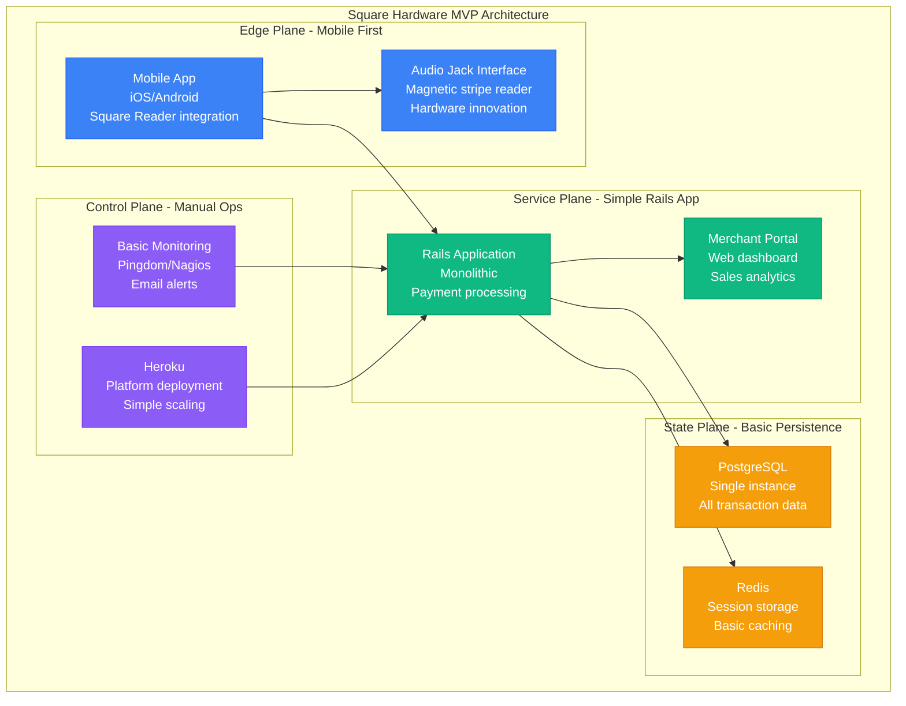
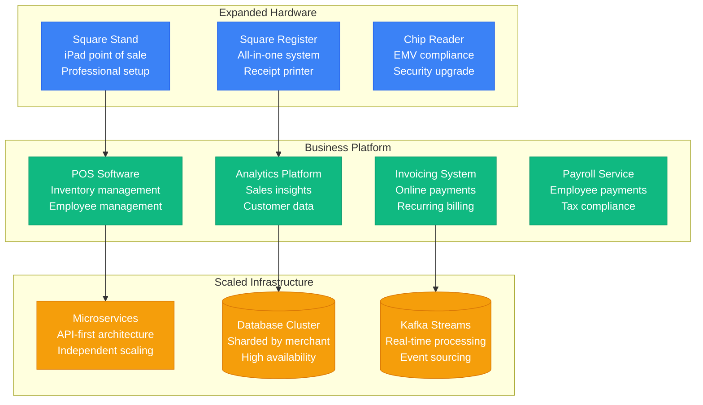
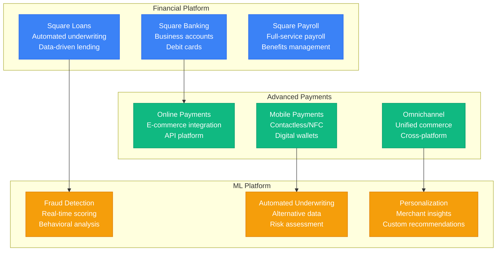

# Square Scale Evolution: Hardware to Cloud Platform - 4M Merchants, $200B GPV

## Executive Summary

Square scaled from a simple credit card reader prototype in 2009 to a comprehensive financial services platform processing $200+ billion annually for 4+ million merchants. This journey showcases the evolution from hardware innovation to cloud-native financial infrastructure, demonstrating how to scale payment processing while maintaining simplicity for small businesses.

**Key Scaling Achievements:**
- **Merchants**: 10 coffee shops → 4,000,000+ businesses (400,000x growth)
- **Annual GPV**: $1K → $200B+ Gross Payment Volume
- **Transactions**: 100/day → 3B+/year (30,000x growth)
- **Revenue**: $0 → $5.2B annually
- **Infrastructure**: Single server → Multi-cloud global platform

## Phase 1: Hardware Innovation MVP (2009-2011)
**Scale**: 10-1K merchants, $1M GPV | **Cost**: $10K/month



**The Hardware Innovation**:
- **Audio jack interface**: Leveraged existing smartphone hardware
- **Magnetic stripe reader**: $10 manufacturing cost vs $300 traditional terminals
- **Mobile SDK**: Native iOS/Android payment integration
- **Real-time processing**: Card authorization in <3 seconds

**What Broke**: Single PostgreSQL instance, Heroku scaling limits, manual hardware fulfillment.
        REDIS[(Redis<br/>Session cache<br/>Real-time data)]
        S3[(S3<br/>Receipt storage<br/>Backup data)]
    end

    subgraph PaymentNetwork["Payment Network"]
        CARD_NETWORKS[Card Networks<br/>Visa/Mastercard<br/>Authorization)]
        BANKS[Acquiring Banks<br/>Settlement<br/>Funding)]
    end

    SQUARE_READER --> MOBILE_APP
    MOBILE_APP --> PAYMENT_API
    PAYMENT_API --> CARD_NETWORKS
    MERCHANT_DASH --> POSTGRES
    PAYMENT_API --> BANKS

    classDef hardwareStyle fill:#3B82F6,stroke:#2563EB,color:#fff
    classDef paymentStyle fill:#10B981,stroke:#059669,color:#fff
    classDef infraStyle fill:#F59E0B,stroke:#D97706,color:#fff
    classDef networkStyle fill:#9966CC,stroke:#663399,color:#fff

    class SQUARE_READER,MOBILE_APP hardwareStyle
    class PAYMENT_API,MERCHANT_DASH paymentStyle
    class POSTGRES,REDIS,S3 infraStyle
    class CARD_NETWORKS,BANKS networkStyle
```

### Key Innovation
- **No monthly fees** for small merchants
- **Instant merchant onboarding** vs 2-week traditional process
- **Transparent pricing** - flat rate vs complex interchange
- **Hardware + software** integrated solution

## Phase 2: Ecosystem Expansion (2011-2015)
**Scale: 1K-100K merchants, beyond payments**



### Ecosystem Features
1. **Square Capital** - Merchant cash advances
2. **Square Market** - Online marketplace
3. **Square Appointments** - Booking system
4. **Square Loyalty** - Customer retention

## Phase 3: Financial Services (2015-2020)
**Scale: 100K-2M merchants, full-stack financial services**



### Advanced Features
1. **Square Cash (now Cash App)** - P2P payments
2. **Square Terminal** - Portable smart terminal
3. **Square for Retail** - Advanced inventory
4. **Square for Restaurants** - Kitchen management

## Phase 4: Ecosystem Platform (2020-Present)
**Scale: 2M-4M+ merchants, comprehensive ecosystem**

### Current Platform Components
- **Square for Retail** - Complete retail solution
- **Square for Restaurants** - Food service platform
- **Square for Beauty** - Salon/spa management
- **Square Online** - E-commerce platform
- **Cash App** - Consumer finance app

## Cost Evolution

| Phase | Period | Monthly Cost | Cost per Merchant | Primary Drivers |
|-------|--------|--------------|-------------------|----------------|
| Reader | 2009-2011 | $1K-50K | $10 | Basic payment processing |
| Ecosystem | 2011-2015 | $50K-5M | $25 | Platform development |
| Financial | 2015-2020 | $5M-50M | $20 | Compliance systems |
| Platform | 2020-Present | $50M-200M+ | $40 | AI/ML infrastructure |

## GPV Evolution

| Year | Annual GPV | Merchant Count | Average per Merchant |
|------|------------|----------------|---------------------|
| 2012 | $2B | 2M | $1,000 |
| 2015 | $35B | 2M | $17,500 |
| 2018 | $88B | 2M | $44,000 |
| 2021 | $165B | 3M | $55,000 |
| 2024 | $200B+ | 4M+ | $50,000 |

## Key Lessons Learned

### Technical Lessons
1. **Hardware + software integration** - Seamless user experience
2. **API-first architecture** - Enables ecosystem growth
3. **Real-time fraud detection** - Essential for payment platforms
4. **Data-driven underwriting** - Alternative credit models work
5. **Mobile-first design** - Small businesses are mobile-native

### Business Lessons
1. **Transparent pricing disrupts industry** - Simple beats complex
2. **Fast onboarding enables growth** - Friction kills adoption
3. **Vertical solutions create value** - Industry-specific features matter
4. **Financial services expand TAM** - Platform approach increases revenue
5. **Small business focus** - Underserved market with huge opportunity

### Operational Lessons
1. **Hardware requires supply chain** - Manufacturing complexity
2. **Payments require compliance** - Regulatory overhead is significant
3. **Customer success drives retention** - Small business support is critical
4. **Data privacy is paramount** - Financial data requires special handling
5. **International expansion is complex** - Local regulations and partnerships

## Current Scale Metrics (2024)

| Metric | Value | Source |
|--------|-------|--------|
| Active Merchants | 4M+ | Company reports |
| Annual GPV | $200B+ | Financial filings |
| Cash App MAU | 50M+ | Product metrics |
| Countries | 5+ | International presence |
| Hardware Units | 10M+ | Device shipments |
| API Calls/Day | 1B+ | Developer platform |
| Revenue | $20B+ annually | SEC filings |
| Employees | 8,000+ | Company reports |

---

*Square's evolution from a simple card reader to a comprehensive business ecosystem demonstrates how focusing on underserved small businesses, combined with integrated hardware and software solutions, can create a platform that transforms an entire industry.*