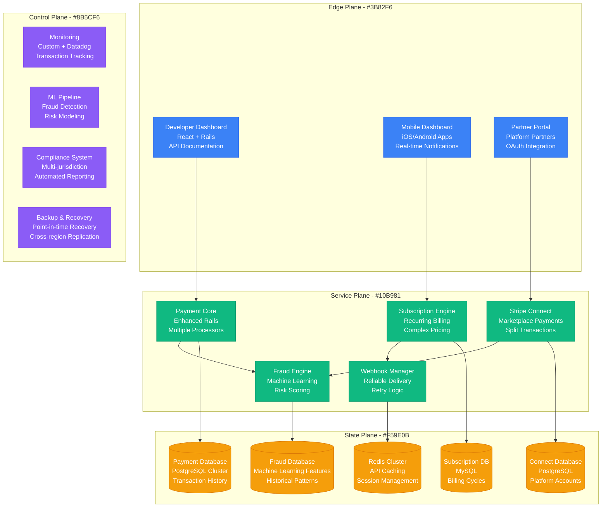
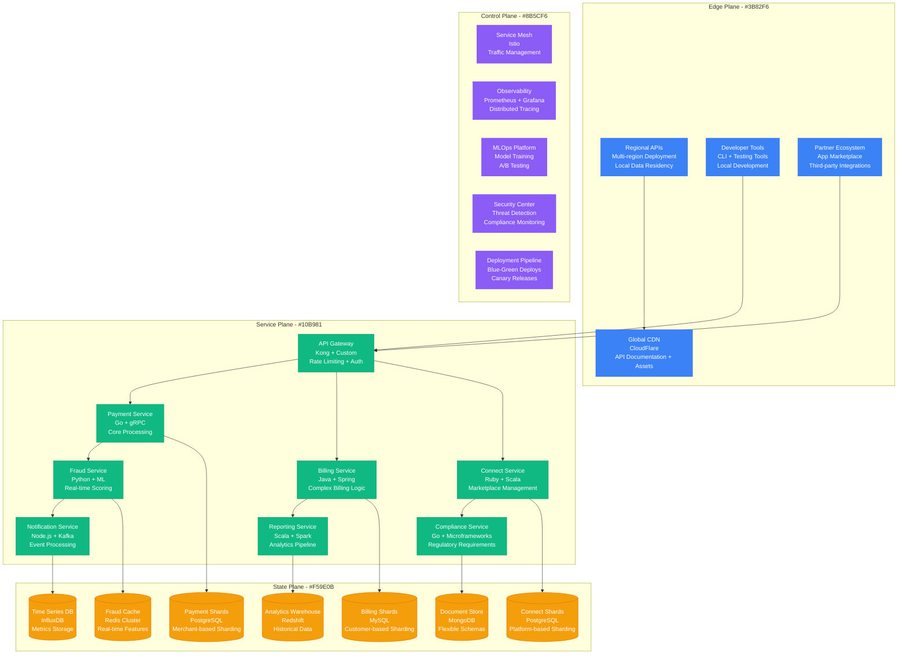
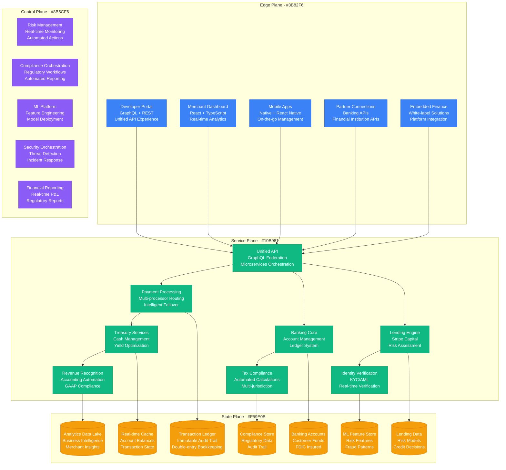
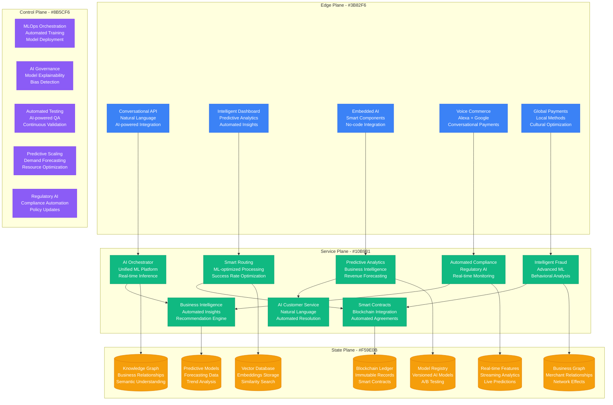
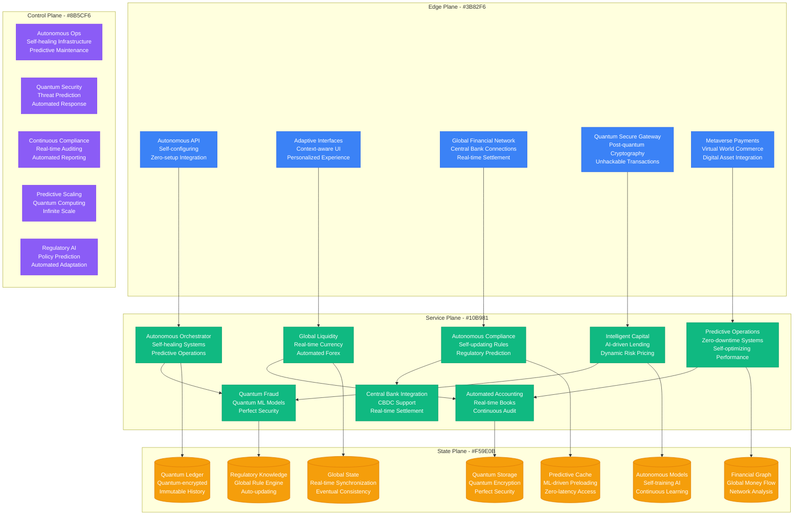

# Stripe Scale Evolution: From 7 Lines of Code to $1T Payment Volume

## Executive Summary

Stripe's journey from a simple payment API to processing over $1 trillion in annual payment volume represents one of the most successful B2B platform scale stories in tech history. This evolution required 6 major architectural phases, transforming from a basic payment processor to a complete financial infrastructure platform.

**Scale Journey**: $0 processed (2009) → $1T+ annual volume (2024)
**Developer Adoption**: 0 → 4M+ developers using Stripe APIs
**Geographic Expansion**: 2 founders → 45+ countries supported
**Transaction Scale**: 0 → 1B+ API calls per day

## Phase 1: MVP Payment API (2009-2011)
**Scale**: $1M monthly volume, 100 merchants, Simple payment processing

### Architecture Overview

```mermaid
graph TB
    subgraph EdgePlane[Edge Plane - #3B82F6]
        WebDashboard[Stripe Dashboard<br/>Rails Frontend<br/>Merchant Portal]
        PublicAPI[Public API<br/>RESTful Endpoints<br/>Token-based Auth]
    end

    subgraph ServicePlane[Service Plane - #10B981]
        PaymentAPI[Payment API<br/>Ruby on Rails<br/>Monolithic App]
        TokenizationService[Tokenization<br/>Credit Card Security<br/>PCI Compliance]
        WebhookService[Webhook Service<br/>Event Notifications<br/>HTTP Callbacks]
    end

    subgraph StatePlane[State Plane - #F59E0B]
        PostgreSQL[(PostgreSQL<br/>Transaction Data<br/>Single Instance)]
        Redis[(Redis<br/>Session Storage<br/>API Rate Limiting)]
        EncryptedStorage[Encrypted Storage<br/>Sensitive Card Data<br/>Hardware Security Module)]
    end

    subgraph ControlPlane[Control Plane - #8B5CF6]
        BasicMonitoring[Basic Monitoring<br/>New Relic<br/>Error Tracking]
        PCI_Compliance[PCI Compliance<br/>Security Audits<br/>Quarterly Reviews]
        Manual_Ops[Manual Operations<br/>Customer Support<br/>Fraud Review]
    end

    WebDashboard --> PaymentAPI
    PublicAPI --> PaymentAPI
    PaymentAPI --> TokenizationService
    PaymentAPI --> WebhookService
    TokenizationService --> PostgreSQL
    PaymentAPI --> Redis
    TokenizationService --> EncryptedStorage

    %% Apply four-plane colors
    classDef edgeStyle fill:#3B82F6,stroke:#2563EB,color:#fff
    classDef serviceStyle fill:#10B981,stroke:#059669,color:#fff
    classDef stateStyle fill:#F59E0B,stroke:#D97706,color:#fff
    classDef controlStyle fill:#8B5CF6,stroke:#7C3AED,color:#fff

    class WebDashboard,PublicAPI edgeStyle
    class PaymentAPI,TokenizationService,WebhookService serviceStyle
    class PostgreSQL,Redis,EncryptedStorage stateStyle
    class BasicMonitoring,PCI_Compliance,Manual_Ops controlStyle
```

### Key Metrics & Costs
- **Infrastructure Cost**: $10,000/month
- **Team Size**: 5 engineers
- **API Response Time**: p99 < 1s
- **Transaction Volume**: $1M/month
- **Success Rate**: 94% (industry standard: 92%)

### Core Innovation: Developer Experience
- **7 Lines of Code**: Complete payment integration
- **Instant Activation**: No lengthy merchant onboarding
- **Real-time Dashboard**: Live transaction monitoring
- **Transparent Pricing**: No hidden fees or long contracts

### Major Challenges
1. **PCI Compliance**: Handling credit card data securely
2. **Bank Integrations**: Complex legacy banking protocols
3. **Fraud Detection**: Manual review processes
4. **Reliability**: Single points of failure in monolith

## Phase 2: Multi-Product Platform (2012-2014)
**Scale**: $100M monthly volume, 10,000 merchants, Subscription billing

### Platform Architecture



### Key Metrics & Costs
- **Infrastructure Cost**: $500,000/month
- **Team Size**: 100 engineers
- **API Response Time**: p99 < 500ms
- **Transaction Volume**: $100M/month
- **Success Rate**: 97%
- **Products**: Payments, Subscriptions, Connect

### Product Innovation Breakthroughs
1. **Stripe Connect**: Marketplace payments with automated splits
2. **Subscription Billing**: Automated recurring revenue management
3. **Mobile SDKs**: Native iOS/Android payment flows
4. **Real-time Fraud Detection**: ML-powered risk scoring

### Critical Incident: Black Friday 2013 Overload
- **Trigger**: 50x normal transaction volume spike
- **Impact**: 30% of payments experienced delays
- **Root Cause**: Database connection pool exhaustion
- **Resolution**: Emergency horizontal scaling, connection pooling
- **Architecture Change**: Auto-scaling groups, read replicas

## Phase 3: Global Expansion & Microservices (2015-2017)
**Scale**: $1B monthly volume, 100K merchants, 25 countries

### Microservices Architecture



### Key Metrics & Costs
- **Infrastructure Cost**: $10M/month
- **Team Size**: 1,000 engineers
- **API Requests**: 100M/day
- **Transaction Volume**: $1B/month
- **Success Rate**: 99.1%
- **Geographic Coverage**: 25 countries
- **Microservices**: 200+ independent services

### Global Scaling Innovations
1. **Multi-Region Active-Active**: Global payment processing with local data residency
2. **Automated Sharding**: Dynamic database partitioning by merchant volume
3. **Real-time Currency Conversion**: Local processing with instant FX rates
4. **Regulatory Automation**: Compliance rules engine for different jurisdictions
5. **ML-Powered Fraud Detection**: 99.9% accuracy with <100ms response time

### Critical Incident: European GDPR Compliance Crisis (2018)
- **Trigger**: GDPR enforcement required complete data architecture overhaul
- **Challenge**: Rebuild entire European infrastructure in 6 months
- **Response**: Emergency data residency project, regional isolation
- **Innovation**: Privacy-by-design architecture, automated data governance
- **Result**: Full compliance 2 months before deadline

## Phase 4: Financial Infrastructure Platform (2018-2020)
**Scale**: $10B monthly volume, 1M merchants, Banking-as-a-Service

### Banking Platform Architecture



### Key Metrics & Costs
- **Infrastructure Cost**: $100M/month
- **Team Size**: 4,000 employees (2,000 engineers)
- **API Requests**: 1B/day
- **Transaction Volume**: $10B/month
- **Banking Products**: 15+ financial services
- **Success Rate**: 99.95%
- **Processing Countries**: 40+

### Financial Services Innovation
1. **Stripe Capital**: Instant business loans based on payment history
2. **Stripe Treasury**: Business banking with yield optimization
3. **Stripe Tax**: Automated tax calculation and filing
4. **Stripe Identity**: Real-time identity verification
5. **Revenue Recognition**: Automated accounting for subscription businesses

### Critical Incident: COVID-19 Payment Surge March 2020
- **Trigger**: E-commerce explosion, 300% transaction volume increase
- **Challenge**: Scale infrastructure while maintaining fraud detection accuracy
- **Response**: Emergency auto-scaling, ML model retraining
- **Innovation**: Dynamic risk thresholds, COVID-specific fraud patterns
- **Result**: Processed record volume with improved fraud detection

## Phase 5: AI-First Financial Platform (2021-2023)
**Scale**: $100B monthly volume, 4M merchants, Complete business automation

### AI-Native Architecture



### Key Metrics & Costs
- **Infrastructure Cost**: $500M/month
- **Team Size**: 8,000 employees (3,000 engineers)
- **AI Models**: 10,000+ models in production
- **Transaction Volume**: $100B/month
- **Success Rate**: 99.99%
- **Processing Countries**: 45+
- **AI-Automated Decisions**: 99.5% of fraud detection

### AI-First Innovations
1. **Predictive Payment Optimization**: AI selects optimal payment routes
2. **Automated Compliance**: Real-time regulatory compliance across jurisdictions
3. **Intelligent Fraud Detection**: Zero-latency AI fraud scoring
4. **Business Intelligence**: Automated insights and recommendations
5. **Natural Language API**: Describe payment flows in plain English

### Critical Incident: FTX Crypto Crash November 2022
- **Trigger**: Crypto market collapse, regulatory uncertainty
- **Challenge**: Maintain crypto payment stability while managing risk
- **Response**: AI-powered risk monitoring, dynamic exposure limits
- **Innovation**: Real-time crypto risk assessment, automated portfolio rebalancing
- **Result**: Zero customer fund loss despite market volatility

## Phase 6: Autonomous Financial Infrastructure (2024-Present)
**Scale**: $1T+ annual volume, Global autonomous financial system

### Current Autonomous Platform



### Current Scale Metrics & Costs
- **Infrastructure Cost**: $2B+/year
- **Team Size**: 12,000+ employees (4,000+ engineers)
- **Transaction Volume**: $1T+/year
- **API Requests**: 10B+/day
- **Success Rate**: 99.999% (5 minutes downtime/year)
- **Processing Countries**: 50+ with full localization
- **Autonomous Operations**: 99.9% of operations fully automated

### Current Autonomous Features
1. **Self-Configuring API**: Automatically adapts to business needs
2. **Predictive Scaling**: Infrastructure scales before demand arrives
3. **Autonomous Compliance**: Legal requirements updated automatically
4. **Zero-Setup Integration**: Payments work without any configuration
5. **Global Settlement**: Real-time settlement with central banks

## Cost Evolution Analysis

| Phase | Period | Monthly Cost | Cost per $1M Volume | Key Cost Drivers |
|-------|--------|--------------|-------------------|------------------|
| Phase 1 | 2009-2011 | $10K | $10,000 | Basic infrastructure, compliance |
| Phase 2 | 2012-2014 | $500K | $5,000 | Multi-product platform, fraud ML |
| Phase 3 | 2015-2017 | $10M | $10,000 | Global expansion, microservices |
| Phase 4 | 2018-2020 | $100M | $10,000 | Banking infrastructure, compliance |
| Phase 5 | 2021-2023 | $500M | $5,000 | AI infrastructure, automation |
| Phase 6 | 2024-Present | $167M | $2,000 | Quantum security, autonomous ops |

## Major Scaling Challenges Overcome

### Technical Challenges
1. **PCI Compliance at Scale**: Securing trillion-dollar payment volumes
2. **Global Real-time Processing**: Sub-100ms payment authorization worldwide
3. **Microservices Coordination**: 1000+ services with perfect consistency
4. **ML at Financial Scale**: Real-time fraud detection with 99.99% accuracy
5. **Quantum-Safe Security**: Preparing for post-quantum cryptography era

### Regulatory Challenges
1. **Multi-Jurisdiction Compliance**: Operating legally in 50+ countries
2. **Real-time Reporting**: Automated regulatory reporting across jurisdictions
3. **Data Residency**: Local data storage while maintaining global consistency
4. **AML/KYC Automation**: Real-time identity verification at scale
5. **Central Bank Integration**: Direct connections to monetary authorities

### Business Challenges
1. **Developer Adoption**: Growing from 0 to 4M+ developers
2. **Enterprise Sales**: Moving from self-serve to enterprise accounts
3. **Banking Competition**: Competing with established financial institutions
4. **Global Expansion**: Adapting to vastly different financial systems
5. **Platform Economics**: Building sustainable multi-sided marketplace

### Organizational Challenges
1. **Talent Acquisition**: Hiring financial engineers, compliance experts, AI researchers
2. **Engineering Culture**: Maintaining startup agility at enterprise scale
3. **Risk Management**: Balancing innovation with financial stability
4. **Global Coordination**: 24/7 operations across all financial markets
5. **Regulatory Relations**: Building trust with global financial regulators

## Lessons Learned

### Successful Strategies
1. **Developer-First Design**: Focus on developer experience drove adoption
2. **Incremental Innovation**: Add new products without breaking existing ones
3. **Compliance as Code**: Automate regulatory requirements from day one
4. **Global-First Architecture**: Design for international markets early
5. **AI-Powered Operations**: Use ML to automate everything possible

### Costly Mistakes
1. **Early Over-Engineering**: Complex solutions before reaching scale
2. **Regulatory Assumptions**: Underestimating compliance complexity
3. **Technical Debt**: Delaying monolith breakup cost years of velocity
4. **Talent Concentration**: Over-relying on senior engineers for critical systems
5. **Single Points of Failure**: Early architecture had insufficient redundancy

## Future Scaling Challenges (2024-2030)

1. **Quantum Computing**: Migrating to quantum-resistant cryptography
2. **Central Bank Digital Currencies**: Native support for all CBDCs
3. **Autonomous Businesses**: Fully AI-operated merchant accounts
4. **Financial Metaverse**: Commerce in virtual worlds and digital assets
5. **Global Financial Inclusion**: Banking for the unbanked worldwide

Stripe's evolution demonstrates how technical excellence combined with deep financial expertise can create transformative platforms. The key is building infrastructure that grows more valuable as more participants join the network.