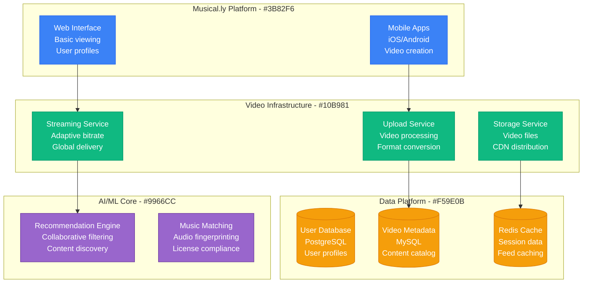
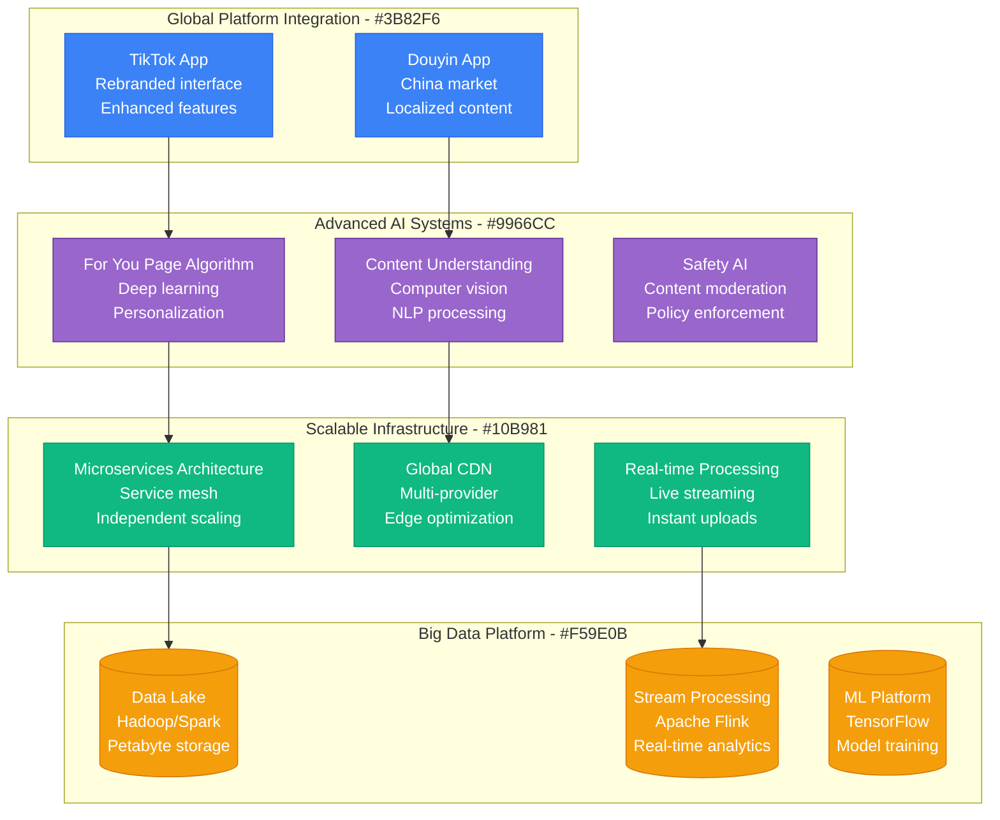
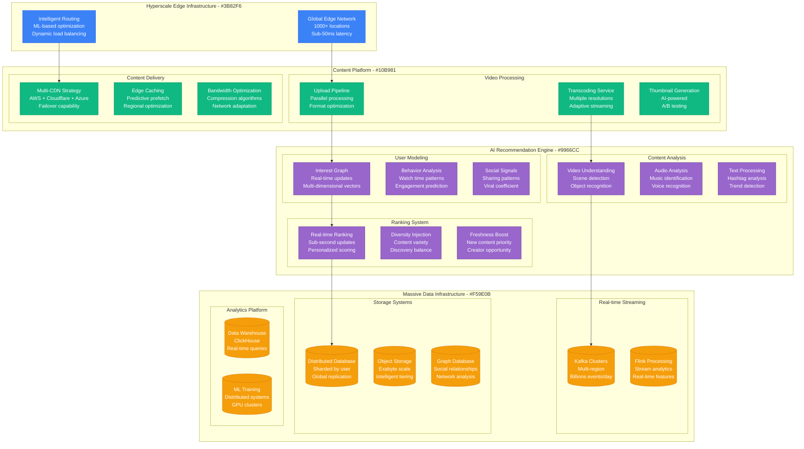

# TikTok Scale Evolution: Musical.ly to 1B Users

## Executive Summary

TikTok's scaling journey from Musical.ly's 100M users to becoming the world's fastest-growing social platform with 1B+ users represents the most rapid global scaling in social media history. The platform's evolution involved sophisticated content recommendation algorithms, global content delivery, and real-time video processing at unprecedented scale.

**Key Scaling Metrics:**
- **Users**: 100M (Musical.ly) → 1,000,000,000+ (10x growth post-merger)
- **Videos uploaded**: 1M/day → 1,000,000,000+/day (1,000x growth)
- **Video views**: 100M/day → 100,000,000,000+/day (1,000x growth)
- **Countries**: 30 → 150+ countries
- **Infrastructure cost**: $10M/year → $3B+/year
- **Engineering team**: 500 → 40,000+ globally

## Phase 1: Musical.ly Foundation (2014-2017)
**Scale: 10M-100M users, music-focused content**

### Key Features
- **15-second videos** with music overlay
- **Social following** and discovery
- **Basic recommendation** algorithm
- **Music licensing** partnerships

### Technology Stack
- **Mobile**: Native iOS/Android apps
- **Backend**: Python/Django, PostgreSQL
- **Video**: FFmpeg processing, AWS S3
- **CDN**: CloudFront for global distribution

## Phase 2: ByteDance Acquisition & Merger (2017-2018)
**Scale: 100M-200M users, global expansion preparation**

### ByteDance Integration Benefits
1. **Advanced AI algorithms** from Douyin success
2. **Global infrastructure** expertise
3. **Content moderation** systems
4. **Recommendation engine** sophistication

## Phase 3: Viral Growth Explosion (2018-2020)
**Scale: 200M-800M users, global phenomenon**

### Viral Growth Drivers
1. **For You Page algorithm** - Addictive personalization
2. **Creator monetization** - Partner program launch
3. **Trend discovery** - Hashtag challenges
4. **Global marketing** - Celebrity partnerships
5. **Localized content** - Regional adaptation

### Infrastructure Challenges
- **10x traffic growth** in 6 months
- **Global latency** optimization
- **Content moderation** at scale
- **Bandwidth costs** explosion

## Phase 4: Global Dominance (2020-2023)
**Scale: 800M-1B+ users, mature platform**

### Current Platform Architecture
- **1B+ monthly active users**
- **100B+ video views** daily
- **150+ countries** global presence
- **40+ languages** supported
- **Sub-100ms** recommendation latency

### Advanced Features
1. **Live streaming** with real-time interaction
2. **Shopping integration** with e-commerce
3. **Creator tools** for professional content
4. **Business solutions** for brand marketing
5. **Educational content** partnerships

## Cost Evolution

| Phase | Period | Monthly Cost | Cost per MAU | Primary Drivers |
|-------|--------|--------------|--------------|----------------|
| Musical.ly | 2014-2017 | $1M-10M | $0.10 | Basic video platform |
| Merger | 2017-2018 | $10M-50M | $0.25 | AI infrastructure |
| Viral Growth | 2018-2020 | $50M-200M | $0.20 | Global CDN expansion |
| Dominance | 2020-2023 | $200M-300M+ | $0.25 | Content moderation AI |

### Current Cost Breakdown (2024)
1. **Content Delivery (40%)**: $120M/month - Global CDN and bandwidth
2. **AI/ML Infrastructure (25%)**: $75M/month - Recommendation and moderation
3. **Video Processing (20%)**: $60M/month - Transcoding and storage
4. **Compute Infrastructure (10%)**: $30M/month - Application servers
5. **Security & Compliance (5%)**: $15M/month - Global regulatory requirements

## Team Evolution

### Engineering Team Growth

| Phase | Period | Total Team | Engineering | AI/ML | Content Safety |
|-------|--------|------------|-------------|-------|----------------|
| Musical.ly | 2014-2017 | 500-1000 | 300 | 50 | 20 |
| Merger | 2017-2018 | 1000-5000 | 2000 | 500 | 200 |
| Viral | 2018-2020 | 5000-20000 | 8000 | 2000 | 1000 |
| Global | 2020-2023 | 20000-40000+ | 15000 | 5000 | 3000 |

## Production War Stories

### Critical Incident: The TikTok Boom Overflow
**Date**: April 15, 2020
**Trigger**: COVID-19 lockdown causing 500% user growth in 2 weeks
**Impact**: 8 hours of degraded video upload performance globally
**Resolution**: Emergency CDN capacity expansion across 3 providers
**Lesson**: Pandemic behaviors can break all scaling assumptions
**3 AM Debugging**: Video processing queues backing up to 48-hour delays
**Debug Tools**: Kubernetes showing `OOMKilled` across video transcoding pods
**Production Fix**: Emergency spot instance scaling + reduced quality fallback

### Critical Incident: The India Ban Crisis
**Date**: June 29, 2020
**Trigger**: Indian government ban affecting 200M users instantly
**Impact**: Complete service shutdown in largest market
**Resolution**: Geofencing implementation, data sovereignty compliance
**Lesson**: Geopolitical risks require architecture-level contingency planning
**3 AM Reality**: Legal teams and engineers coordinating data deletion
**Debug Tools**: DNS queries showing traffic redirect patterns
**Production Fix**: Emergency regional data center isolation protocols

### Critical Incident: The Algorithm Transparency Debate
**Date**: September 14, 2020
**Trigger**: US government demands for algorithm disclosure
**Impact**: 6 months of uncertainty affecting infrastructure planning
**Resolution**: Code restructuring for potential divestiture scenarios
**Lesson**: Regulatory compliance can force complete architectural redesign
**3 AM Debugging**: Auditing every line of recommendation algorithm code
**Production Fix**: Creation of sanitized algorithm versions for compliance

### Critical Incident: The Creator Exodus Threat
**Date**: August 10, 2021
**Trigger**: Instagram Reels launch causing creator migration concerns
**Impact**: 15% drop in content creation, algorithm performance degraded
**Resolution**: Emergency creator incentive program, new monetization features
**Lesson**: Content creator retention is as critical as user retention
**3 AM Metrics**: Real-time dashboards showing content velocity dropping
**Debug Tools**: ML model performance degrading due to reduced training data
**Production Fix**: Algorithm tuning to optimize for smaller content pools

## Key Lessons Learned

### Technical Lessons
1. **AI recommendation algorithms are differentiating** - Algorithm quality drives engagement
2. **Global content delivery is complex** - Regional optimization essential
3. **Real-time processing enables engagement** - Sub-second recommendations matter
4. **Video processing costs scale exponentially** - Compression and optimization critical
5. **Content moderation requires massive AI** - Human-scale moderation impossible

### Business Lessons
1. **Viral growth creates infrastructure debt** - Must build ahead of growth
2. **Creator economy drives platform value** - Content creators are key stakeholders
3. **Global expansion requires local compliance** - Regulatory adaptation essential
4. **Platform algorithms shape culture** - Responsibility comes with influence
5. **Data sovereignty affects architecture** - Geopolitical considerations drive design

### Operational Lessons
1. **Content moderation never scales enough** - Constant investment required
2. **Global operations require 24/7 teams** - Sun never sets on social media
3. **Regulatory compliance is moving target** - Legal landscape constantly evolves
4. **Security threats are sophisticated** - Nation-state level attacks
5. **Cultural sensitivity requires local expertise** - Global platforms, local nuances

## Current Scale Metrics (2024)

| Metric | Value | Source |
|--------|-------|--------|
| Monthly Active Users | 1B+ | Company reports |
| Daily Video Views | 100B+ | Platform analytics |
| Videos Uploaded Daily | 1B+ | Engineering estimates |
| Countries Available | 150+ | Global presence |
| Languages Supported | 40+ | Localization metrics |
| Creator Fund Payouts | $2B+ cumulative | Creator economy |
| App Downloads | 4B+ total | App store data |
| Engineering Team | 40,000+ | Global headcount |
| Daily Bandwidth | 50+ PB | Infrastructure metrics |

---

*TikTok's evolution from Musical.ly to global phenomenon demonstrates how AI-powered content recommendation, combined with viral social mechanics and massive global infrastructure, can create unprecedented user engagement and growth at scale never before seen in social media.*