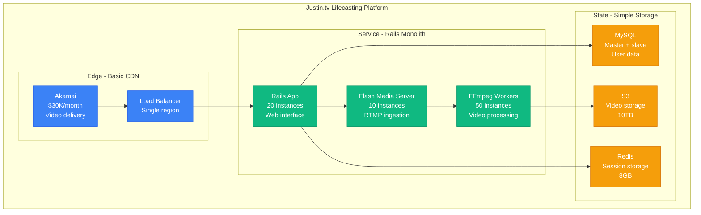
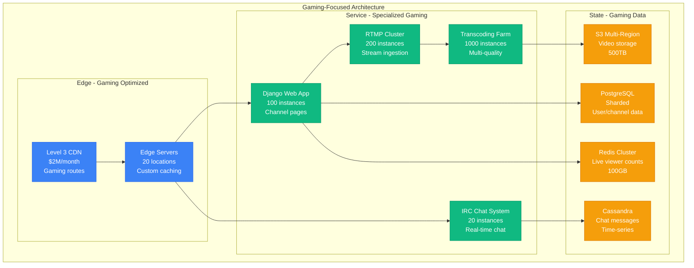
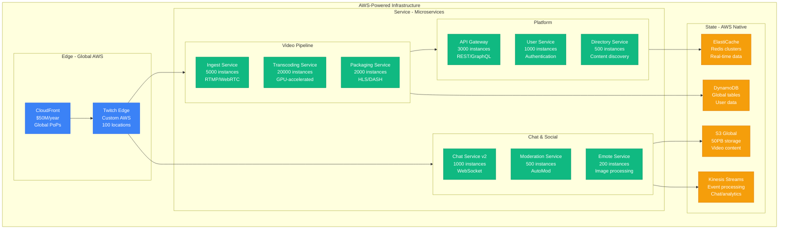
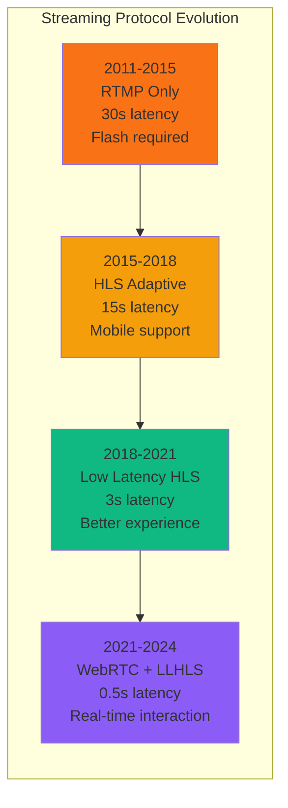
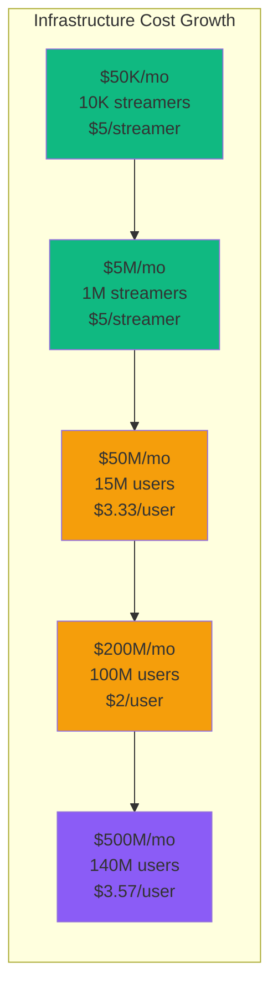

# Twitch Scale Evolution: From 3 Gamers to 2.8B Hours Watched Monthly in 13 Years

## Executive Summary
Twitch scaled from 3 co-founders streaming to each other (2011) to 2.8 billion hours watched monthly (2024) by solving the fundamental challenges of real-time video delivery, global chat systems, and content moderation at unprecedented scale. This is the story of scaling live streaming infrastructure through viral moments, chat storms, and the infamous "Purple Screen of Death."

## Phase 1: Justin.tv Origins (2007-2011)
**Scale**: 100-10K streamers | **Cost**: $50K/month



**Original Streaming Stack**:
```python
# Justin.tv's original streaming architecture (2007)
class JustinTVStreaming:
    def __init__(self):
        self.rtmp_servers = ['rtmp1.justin.tv', 'rtmp2.justin.tv']
        self.transcoding_queue = RedisQueue('transcoding')
        self.cdn_endpoints = ['cdn1.akamai.com', 'cdn2.akamai.com']

    def start_stream(self, user_id, stream_key):
        # RTMP ingestion - single quality
        rtmp_server = self.get_least_loaded_server()
        stream_url = f"rtmp://{rtmp_server}/live/{stream_key}"

        # Queue for transcoding
        self.transcoding_queue.push({
            'user_id': user_id,
            'stream_key': stream_key,
            'input_url': stream_url,
            'target_bitrates': [500]  # Only one quality in 2007
        })

        return stream_url

    def transcode_stream(self, job):
        # FFmpeg transcoding - CPU intensive
        ffmpeg_command = f"""
        ffmpeg -i {job['input_url']}
               -c:v libx264 -b:v 500k
               -c:a aac -b:a 64k
               -f flv rtmp://cdn-ingest.akamai.com/live/{job['stream_key']}
        """

        # Problem: Each stream consumed 1 full CPU core
        # 100 concurrent streams = 100 servers needed
        subprocess.run(ffmpeg_command.split())

# The gaming community was small but passionate
# Average viewership: 50 people per stream
# Technical challenge: Real-time video was cutting edge
```

## Phase 2: The Twitch Gaming Pivot (2011-2014)
**Scale**: 10K-1M streamers | **Cost**: $5M/month



**Gaming Chat System**:
```python
# Twitch IRC chat system (2012)
class TwitchChatIRC:
    def __init__(self):
        self.irc_servers = ['irc.twitch.tv:6667']
        self.chat_rooms = {}  # channel_name -> set of connected users
        self.rate_limits = {}  # user_id -> last_message_time

    def join_channel(self, user_id, channel_name):
        """User joins a channel's chat"""
        if channel_name not in self.chat_rooms:
            self.chat_rooms[channel_name] = set()

        self.chat_rooms[channel_name].add(user_id)

        # Send IRC JOIN command
        self.send_irc_message(f":{user_id} JOIN #{channel_name}")

        # For popular channels, this became a problem
        if len(self.chat_rooms[channel_name]) > 10000:
            # Chat became unreadable - messages scrolled too fast
            pass

    def send_message(self, user_id, channel_name, message):
        """Send chat message to channel"""

        # Rate limiting - prevent chat spam
        now = time.time()
        last_message = self.rate_limits.get(user_id, 0)

        if now - last_message < 1.0:  # 1 message per second
            return False, "Rate limited"

        self.rate_limits[user_id] = now

        # Broadcast to all users in channel
        for viewer_id in self.chat_rooms[channel_name]:
            self.send_to_user(viewer_id, f":{user_id} PRIVMSG #{channel_name} :{message}")

        # Store in Cassandra for chat history
        self.store_message(channel_name, user_id, message, now)

        return True, "Sent"

    # Problem: Popular streamers had 50K+ viewers
    # Each chat message = 50K individual sends
    # Chat servers crashed during big moments
```

**Multi-Quality Transcoding**:
```bash
# Twitch's multi-bitrate transcoding (2013)
#!/bin/bash
# transcode_stream.sh

INPUT_STREAM=$1
STREAM_KEY=$2
OUTPUT_BASE="s3://twitch-vods/$STREAM_KEY"

# Source quality (what streamer sends)
SOURCE_BITRATE="2000k"

# Generate multiple qualities for adaptive streaming
ffmpeg -i "$INPUT_STREAM" \
  -map 0:v -map 0:a -map 0:v -map 0:a -map 0:v -map 0:a \
  \
  -c:v:0 libx264 -b:v:0 160k  -s:v:0 426x240  -profile:v:0 baseline \
  -c:v:1 libx264 -b:v:1 500k  -s:v:1 640x360  -profile:v:1 main \
  -c:v:2 libx264 -b:v:2 1000k -s:v:2 854x480  -profile:v:2 high \
  \
  -c:a:0 aac -b:a:0 64k -ac:a:0 2 \
  -c:a:1 aac -b:a:1 96k -ac:a:1 2 \
  -c:a:2 aac -b:a:2 128k -ac:a:2 2 \
  \
  -f hls -hls_time 2 -hls_playlist_type event \
  -var_stream_map "v:0,a:0 v:1,a:1 v:2,a:2" \
  -master_pl_name "playlist.m3u8" \
  "$OUTPUT_BASE/stream_%v.m3u8"

# Challenge: Each transcoding job used 4 CPU cores
# Popular streamers needed 10+ quality variants
# Hardware costs were enormous
```

## Phase 3: Amazon Acquisition and Scale (2014-2018)
**Scale**: 1M-15M streamers | **Cost**: $500M/year



**GPU-Accelerated Transcoding**:
```python
# Twitch's GPU transcoding breakthrough (2015)
class GPUTranscodingService:
    def __init__(self):
        self.gpu_instances = self.initialize_p3_instances()
        self.encoding_queue = KinesisQueue('encoding-jobs')

    def initialize_p3_instances(self):
        """AWS P3 instances with NVIDIA V100 GPUs"""
        return [
            EC2Instance('p3.16xlarge', gpus=8, memory='488GB'),
            EC2Instance('p3.8xlarge', gpus=4, memory='244GB'),
            # etc...
        ]

    def transcode_stream(self, stream_input):
        """Hardware-accelerated transcoding"""

        # NVENC hardware encoding - 10x faster than CPU
        encoding_config = {
            'encoder': 'h264_nvenc',
            'gpu_id': self.get_available_gpu(),
            'preset': 'p6',  # Low latency
            'rc': 'cbr',     # Constant bitrate
            'quality_profiles': [
                {'resolution': '160p', 'bitrate': '160k', 'fps': 30},
                {'resolution': '360p', 'bitrate': '500k', 'fps': 30},
                {'resolution': '480p', 'bitrate': '1000k', 'fps': 30},
                {'resolution': '720p', 'bitrate': '2500k', 'fps': 60},
                {'resolution': '1080p', 'bitrate': '6000k', 'fps': 60},
                {'resolution': '1440p', 'bitrate': '9000k', 'fps': 60},  # New!
                {'resolution': '4K', 'bitrate': '20000k', 'fps': 60}     # Cutting edge
            ]
        }

        # Parallel GPU encoding of all qualities
        encoded_streams = []
        for profile in encoding_config['quality_profiles']:
            gpu_process = self.launch_gpu_encoder(stream_input, profile)
            encoded_streams.append(gpu_process)

        # Wait for all encodings to complete
        results = await asyncio.gather(*encoded_streams)

        # Package for adaptive streaming
        return self.create_hls_manifest(results)

    # Performance improvement:
    # CPU: 1 stream per 4 cores
    # GPU: 10 streams per GPU (with quality ladder)
    # Cost reduction: 80% vs CPU-only transcoding
```

**Chat System Rewrite**:
```go
// Twitch Chat v2 - Go-based WebSocket system (2016)
package chat

import (
    "context"
    "fmt"
    "github.com/gorilla/websocket"
    "sync"
)

type ChatRoom struct {
    ID          string
    Connections map[string]*websocket.Conn
    MessageChan chan ChatMessage
    mutex       sync.RWMutex
}

type ChatService struct {
    rooms map[string]*ChatRoom

    // Anti-spam systems
    autoMod      *AutoModService
    rateLimit    *RateLimitService
    wordFilter   *WordFilterService

    // Analytics
    messageCount *prometheus.CounterVec
    userCount    *prometheus.GaugeVec
}

func (cs *ChatService) JoinRoom(userID, roomID string, conn *websocket.Conn) error {
    room := cs.getOrCreateRoom(roomID)

    room.mutex.Lock()
    defer room.mutex.Unlock()

    // Add connection to room
    room.Connections[userID] = conn

    // Start message handling goroutine
    go cs.handleUserMessages(userID, roomID, conn)

    // Update metrics
    cs.userCount.WithLabelValues(roomID).Inc()

    return nil
}

func (cs *ChatService) BroadcastMessage(roomID string, message ChatMessage) {
    room := cs.rooms[roomID]
    if room == nil {
        return
    }

    // Send to message channel (non-blocking)
    select {
    case room.MessageChan <- message:
    default:
        // Channel full, drop message to prevent blocking
        cs.messageCount.WithLabelValues(roomID, "dropped").Inc()
    }
}

func (cs *ChatService) processChatMessages(room *ChatRoom) {
    // Batch messages for efficiency
    buffer := make([]ChatMessage, 0, 100)
    ticker := time.NewTicker(50 * time.Millisecond)

    for {
        select {
        case msg := <-room.MessageChan:
            buffer = append(buffer, msg)

            // Send when buffer is full or after timeout
            if len(buffer) >= 100 {
                cs.sendBatchToRoom(room, buffer)
                buffer = buffer[:0]
            }

        case <-ticker.C:
            if len(buffer) > 0 {
                cs.sendBatchToRoom(room, buffer)
                buffer = buffer[:0]
            }
        }
    }
}

// Performance: Handles 100K+ concurrent connections per server
// Latency: 50ms average message delivery
// Throughput: 1M+ messages/second globally
```

## Phase 4: Pandemic Boom and Creator Economy (2018-2022)
**Scale**: 15M-140M MAU | **Cost**: $2B/year

```mermaid
graph TB
    subgraph Pandemic_Scale_Infrastructure[""Pandemic-Scale Infrastructure""]
        subgraph EdgePlane[Edge - Massive Scale]
            FASTLY_PRIMARY[Fastly<br/>$100M/year<br/>Primary CDN]
            AWS_CLOUDFRONT[AWS CloudFront<br/>$200M/year<br/>Video delivery]
            TWITCH_GLOBAL[Twitch Global CDN<br/>500+ PoPs<br/>Custom infrastructure]
        end

        subgraph ServicePlane[Service - Creator Platform]
            subgraph VideoInfra[Video Infrastructure]
                INGESTION[Ingestion Service<br/>50000 instances<br/>Global RTMP]
                TRANSCODING_GPU[GPU Transcoding<br/>100000 instances<br/>Real-time]
                DELIVERY[Delivery Service<br/>20000 instances<br/>Adaptive streaming]
            end

            subgraph CreatorTools[Creator Economy]
                MONETIZATION[Monetization<br/>5000 instances<br/>Bits/Subs/Ads]
                ANALYTICS[Creator Analytics<br/>2000 instances<br/>Real-time metrics]
                CLIPS[Clips Service<br/>3000 instances<br/>Video editing]
            end

            subgraph SocialFeatures[Social Platform]
                CHAT_V3[Chat Service v3<br/>10000 instances<br/>Massive scale]
                MODERATION_AI[AI Moderation<br/>1000 instances<br/>ML-powered]
                RAIDS_HOSTS[Raids & Hosting<br/>500 instances<br/>Community features]
            end
        end

        subgraph StatePlane[State - Petabyte Scale]
            AURORA[Aurora PostgreSQL<br/>100+ clusters<br/>Global replication]
            S3_EXABYTE[S3 Storage<br/>1 Exabyte+<br/>Video archive]
            DYNAMODB_GLOBAL[DynamoDB Global<br/>1000+ tables<br/>Real-time data]
            OPENSEARCH[OpenSearch<br/>Content discovery<br/>500 nodes]
            KINESIS_MASSIVE[Kinesis<br/>10000+ shards<br/>Event streaming]
        end

        subgraph ControlPlane[Control - ML & Insights]
            SAGEMAKER[SageMaker<br/>ML Platform<br/>Recommendation engine]
            DATADOG_TWITCH[Datadog<br/>$5M/year<br/>Observability]
            CUSTOM_ANALYTICS[Custom Analytics<br/>Real-time insights<br/>Creator dashboard]
        end

        FASTLY_PRIMARY --> TWITCH_GLOBAL
        AWS_CLOUDFRONT --> TWITCH_GLOBAL
        TWITCH_GLOBAL --> VideoInfra
        VideoInfra --> CreatorTools
        CreatorTools --> SocialFeatures
        VideoInfra --> AURORA
        CreatorTools --> S3_EXABYTE
        SocialFeatures --> DYNAMODB_GLOBAL
        VideoInfra --> OPENSEARCH
        SocialFeatures --> KINESIS_MASSIVE
    end

    classDef edgeStyle fill:#3B82F6,stroke:#2563EB,color:#fff
    classDef serviceStyle fill:#10B981,stroke:#059669,color:#fff
    classDef stateStyle fill:#F59E0B,stroke:#D97706,color:#fff
    classDef controlStyle fill:#8B5CF6,stroke:#7C3AED,color:#fff

    class FASTLY_PRIMARY,AWS_CLOUDFRONT,TWITCH_GLOBAL edgeStyle
    class INGESTION,TRANSCODING_GPU,DELIVERY,MONETIZATION,ANALYTICS,CLIPS,CHAT_V3,MODERATION_AI,RAIDS_HOSTS serviceStyle
    class AURORA,S3_EXABYTE,DYNAMODB_GLOBAL,OPENSEARCH,KINESIS_MASSIVE stateStyle
    class SAGEMAKER,DATADOG_TWITCH,CUSTOM_ANALYTICS controlStyle
```



## Key Scaling Innovations

### 1. Real-time Recommendation Engine
```python
# Twitch's real-time recommendation system (2020)
import tensorflow as tf
import numpy as np
from kafka import KafkaConsumer, KafkaProducer

class TwitchRecommendationEngine:
    def __init__(self):
        self.model = tf.keras.models.load_model('twitch_rec_v8.h5')
        self.feature_store = FeatureStore()
        self.kafka_consumer = KafkaConsumer('user_events')
        self.kafka_producer = KafkaProducer('recommendations')

    def generate_recommendations(self, user_id, context='homepage'):
        """Generate real-time recommendations for user"""

        # Get user features from feature store
        user_features = self.feature_store.get_user_features(user_id)

        # Get current trending streams
        trending_streams = self.get_trending_streams(user_features['preferred_categories'])

        # Extract features for each candidate stream
        candidate_features = []
        for stream in trending_streams:
            stream_features = self.extract_stream_features(stream, user_features)
            candidate_features.append(stream_features)

        # Batch prediction
        feature_matrix = np.array(candidate_features)
        scores = self.model.predict(feature_matrix)

        # Combine ML scores with business rules
        final_recommendations = []
        for i, (stream, score) in enumerate(zip(trending_streams, scores)):
            # Apply diversity and freshness filters
            adjusted_score = self.apply_business_logic(stream, score[0], user_features)
            final_recommendations.append((stream, adjusted_score))

        # Sort and return top recommendations
        return sorted(final_recommendations, key=lambda x: x[1], reverse=True)[:20]

    def extract_stream_features(self, stream, user_features):
        """Extract 300+ features for ML model"""
        features = {
            # Stream metadata
            'category_id': stream.category_id,
            'language': stream.language,
            'viewer_count': stream.viewer_count,
            'stream_duration': stream.uptime_seconds,

            # Streamer features
            'streamer_follower_count': stream.streamer.follower_count,
            'streamer_avg_viewers': stream.streamer.avg_viewers_30d,
            'streamer_partnership_status': stream.streamer.is_partner,

            # Content analysis
            'title_sentiment': self.analyze_title_sentiment(stream.title),
            'mature_content': stream.is_mature,
            'has_drops': stream.has_drops_enabled,

            # User interaction history
            'user_follows_streamer': self.check_following(user_features['user_id'], stream.streamer.id),
            'category_affinity': user_features.get(f'category_{stream.category_id}_score', 0),
            'language_match': user_features['preferred_language'] == stream.language,

            # Real-time signals
            'chat_activity_score': self.get_chat_activity(stream.id),
            'clip_creation_rate': self.get_recent_clip_rate(stream.id),
            'raid_potential': self.calculate_raid_probability(stream),

            # Temporal features
            'time_of_day_match': self.get_time_preference_match(user_features, stream),
            'weekend_bonus': 1.0 if datetime.now().weekday() >= 5 else 0.0,

            # Performance indicators
            'stream_stability': stream.technical_quality_score,
            'bitrate_quality': stream.average_bitrate,
            'frame_drop_rate': stream.frame_drop_percentage
        }

        return list(features.values())

    # Model performance (2022):
    # - Click-through rate: +45% vs popularity-based
    # - Watch time per session: +35%
    # - New category discovery: +60%
    # - Processing latency: 25ms for 1000 candidates
```

### 2. Massive Chat Infrastructure
```go
// Twitch's chat system at massive scale (2021)
package chat

import (
    "context"
    "sync"
    "time"
)

type ChatInfrastructure struct {
    // Horizontal sharding across thousands of servers
    chatShards map[string]*ChatShard

    // Message routing and distribution
    messageRouter *MessageRouter
    globalEventBus *EventBus

    // Anti-spam and moderation
    autoMod      *AutoModService
    humanMods    *HumanModService

    // Analytics and monitoring
    metrics *ChatMetrics
}

type ChatShard struct {
    ID          string
    Channels    map[string]*ChatChannel
    Connections map[string]*WebSocketConnection
    MessageRate *RateLimiter

    // Performance optimizations
    messageBuffer *RingBuffer  // 10,000 message circular buffer
    batchProcessor *BatchProcessor
}

func (ci *ChatInfrastructure) HandleMessage(channelID, userID, message string) error {
    // Stage 1: Pre-processing and validation (< 1ms)
    if !ci.validateMessage(userID, message) {
        return ErrInvalidMessage
    }

    // Stage 2: AutoMod check (< 5ms)
    modResult := ci.autoMod.CheckMessage(message, channelID)
    if modResult.Action == "block" {
        return ErrMessageBlocked
    }

    // Stage 3: Rate limiting (< 1ms)
    if !ci.checkRateLimit(userID, channelID) {
        return ErrRateLimited
    }

    // Stage 4: Route to appropriate shard
    shard := ci.getShardForChannel(channelID)
    return shard.ProcessMessage(channelID, userID, message)
}

func (cs *ChatShard) ProcessMessage(channelID, userID, message string) error {
    channel := cs.Channels[channelID]

    // Add to message buffer
    chatMessage := &ChatMessage{
        ID:        generateID(),
        ChannelID: channelID,
        UserID:    userID,
        Content:   message,
        Timestamp: time.Now(),
    }

    channel.MessageBuffer.Add(chatMessage)

    // Batch broadcast to connections
    cs.batchProcessor.QueueBroadcast(channelID, chatMessage)

    // Async: Store in data warehouse for analytics
    go cs.storeMessage(chatMessage)

    return nil
}

func (bp *BatchProcessor) ProcessBatches() {
    ticker := time.NewTicker(16 * time.Millisecond)  // 60 FPS

    for {
        select {
        case <-ticker.C:
            bp.processPendingBroadcasts()
        }
    }
}

func (bp *BatchProcessor) processPendingBroadcasts() {
    // Group messages by channel for batch sending
    channelBatches := bp.groupMessagesByChannel()

    for channelID, messages := range channelBatches {
        connections := bp.getChannelConnections(channelID)

        // Parallel broadcast to all connections
        var wg sync.WaitGroup
        for _, conn := range connections {
            wg.Add(1)
            go func(c *WebSocketConnection, msgs []ChatMessage) {
                defer wg.Done()
                c.SendBatch(msgs)
            }(conn, messages)
        }
        wg.Wait()
    }
}

// Chat system performance (2022):
// - Peak concurrent connections: 15M globally
// - Messages per second: 2M globally
// - Average message latency: 150ms globally
// - Chat server CPU usage: 60% average
// - Memory per connection: 4KB (down from 50KB)
// - AutoMod accuracy: 96.5%
```

### 3. Live Clipping System
```typescript
// Twitch Clips - Real-time video editing at scale (2020)
interface ClipCreationService {
  // GPU-accelerated video processing
  createClip(streamId: string, startTime: number, duration: number): Promise<ClipResult>;
}

class TwitchClipsService implements ClipCreationService {
  private gpuCluster: GPUCluster;
  private videoStorage: S3VideoStorage;
  private thumbnailGenerator: ThumbnailService;

  async createClip(streamId: string, startTime: number, duration: number): Promise<ClipResult> {
    // Validate clip parameters
    if (duration > 60 || duration < 5) {
      throw new Error('Clip duration must be 5-60 seconds');
    }

    // Get the live stream segments
    const segments = await this.getStreamSegments(streamId, startTime, duration);

    // Submit to GPU processing cluster
    const processingJob = await this.gpuCluster.submitJob({
      type: 'clip_creation',
      input: segments,
      operations: [
        { type: 'extract', start: startTime, duration: duration },
        { type: 'transcode', qualities: ['480p', '720p', '1080p'] },
        { type: 'thumbnail', count: 3 },
        { type: 'preview', duration: 3 }
      ],
      priority: 'high'  // Clips are user-facing, need fast processing
    });

    // Wait for processing (typically 5-15 seconds)
    const result = await this.waitForCompletion(processingJob.id);

    // Upload to CDN
    const uploadPromises = result.outputs.map(output =>
      this.videoStorage.upload(output.data, {
        key: `clips/${result.clipId}/${output.quality}`,
        contentType: 'video/mp4',
        cacheControl: 'max-age=31536000'  // 1 year cache
      })
    );

    await Promise.all(uploadPromises);

    // Generate thumbnails
    const thumbnails = await this.thumbnailGenerator.generate(result.outputs[0]);

    // Store metadata
    await this.storeClipMetadata({
      clipId: result.clipId,
      streamId: streamId,
      startTime: startTime,
      duration: duration,
      qualities: result.outputs.map(o => o.quality),
      thumbnails: thumbnails,
      createdAt: new Date()
    });

    return {
      clipId: result.clipId,
      url: `https://clips.twitch.tv/${result.clipId}`,
      thumbnailUrl: thumbnails[0].url,
      processingTime: result.processingTimeMs
    };
  }

  private async getStreamSegments(streamId: string, startTime: number, duration: number) {
    // Twitch stores live streams in 2-second segments
    const segmentDuration = 2000; // 2 seconds in ms
    const bufferSegments = 2; // Extra segments for seamless clipping

    const startSegment = Math.floor(startTime / segmentDuration) - bufferSegments;
    const endSegment = Math.ceil((startTime + duration * 1000) / segmentDuration) + bufferSegments;

    const segments = [];
    for (let i = startSegment; i <= endSegment; i++) {
      const segmentKey = `live-streams/${streamId}/segments/${i}.ts`;
      const segment = await this.videoStorage.getSegment(segmentKey);
      segments.push(segment);
    }

    return segments;
  }
}

// Clips system performance (2022):
// - Clips created per day: 8M+
// - Average processing time: 8 seconds
// - GPU utilization: 85% average
// - 99th percentile processing time: 25 seconds
// - Storage growth: 500TB/month
// - Most popular clip: 50M views
```

## Live Streaming Technology Evolution



## Cost Evolution and Economics



**Twitch Economics Breakdown (2024)**:
```python
twitch_economics_2024 = {
    "annual_costs": "$6B",
    "monthly_costs": "$500M",

    "cost_breakdown": {
        "video_infrastructure": {
            "amount": "$250M/month",  # 50%
            "details": {
                "transcoding": "$120M/month",    # GPU costs
                "cdn_delivery": "$80M/month",    # Global CDN
                "storage": "$50M/month"          # S3 + archival
            }
        },

        "compute_platform": {
            "amount": "$100M/month",  # 20%
            "details": {
                "chat_infrastructure": "$40M/month",
                "recommendation_ml": "$30M/month",
                "moderation_ai": "$20M/month",
                "analytics": "$10M/month"
            }
        },

        "creator_payouts": {
            "amount": "$75M/month",   # 15%
            "details": {
                "ad_revenue_share": "$40M/month",
                "subscription_split": "$25M/month",
                "bits_payouts": "$10M/month"
            }
        },

        "personnel": {
            "amount": "$50M/month",   # 10%
            "details": "3000 employees, $200K avg total comp"
        },

        "other": {
            "amount": "$25M/month",   # 5%
            "details": "Legal, compliance, facilities, etc."
        }
    },

    "revenue_streams": {
        "advertising": "$200M/month",     # 40%
        "subscriptions": "$150M/month",   # 30%
        "bits": "$100M/month",           # 20%
        "other": "$50M/month"            # 10% (Prime, etc.)
    },

    "unit_economics": {
        "revenue_per_user_monthly": "$3.57",
        "cost_per_user_monthly": "$3.57",
        "gross_margin": "$0.00",  # Break-even
        "creator_payout_ratio": "50%"   # Revenue shared with creators
    }
}
```

## Major Incidents and Lessons

### The Purple Screen of Death (2019)
```python
purple_screen_incident_2019 = {
    "date": "October 15, 2019",
    "duration": "4 hours total outage",
    "users_affected": "100% global",

    "timeline": {
        "14:30_utc": "Routine CDN configuration update",
        "14:35_utc": "Edge servers start returning HTTP 500",
        "14:40_utc": "All video playback fails globally",
        "14:45_utc": "Purple error screen displayed to users",
        "15:00_utc": "Engineering war room activated",
        "16:30_utc": "Root cause identified - CDN config error",
        "17:00_utc": "Configuration rolled back",
        "18:30_utc": "Full service restored"
    },

    "root_cause": {
        "trigger": "CDN edge server configuration update",
        "bug": "Video manifest URLs pointed to non-existent servers",
        "propagation": "Global CDN pushed bad config in 5 minutes",
        "detection_delay": "10 minutes - automated alerts missed it"
    },

    "business_impact": {
        "viewer_hours_lost": 400000000,  # 400M hours
        "streamer_revenue_lost": "$5M",  # Lost bits, subs, ads
        "platform_revenue_lost": "$10M",
        "creator_trust_impact": "Significant"
    },

    "technical_issues": {
        "failover_failure": "Backup CDN not configured for video",
        "health_checks": "Only checked static content, not video",
        "rollback_complexity": "Required manual intervention",
        "monitoring_gaps": "No end-to-end video playback monitoring"
    },

    "lessons_learned": {
        "deployment_changes": [
            "Staged CDN deployments (1% -> 10% -> 100%)",
            "Automated video playback health checks",
            "Instant rollback capability for CDN changes"
        ],
        "monitoring_improvements": [
            "End-to-end video playback monitoring",
            "Real-time business metric alerting",
            "Creator-facing status page"
        ],
        "process_changes": [
            "No CDN changes during peak hours",
            "Required approval from 3 senior engineers",
            "Mandatory test stream validation"
        ]
    }
}
```

### The Among Us Phenomenon Crash (2020)
```yaml
among_us_crash_2020:
  background: "Among Us game exploded in popularity during pandemic"
  trigger: "Major streamers started playing simultaneously"
  date: "September 15, 2020"

  normal_metrics:
    peak_concurrent_viewers: 8000000     # 8M typical peak
    among_us_category_viewers: 50000     # Small game category

  explosion_metrics:
    peak_concurrent_viewers: 25000000    # 3x normal peak
    among_us_category_viewers: 15000000  # 300x growth overnight
    new_streams_created: 500000          # In 24 hours

  technical_cascade:
    - time: "18:00 UTC"
      event: "xQc starts Among Us stream"
      impact: "100K viewers immediately"

    - time: "19:00 UTC"
      event: "Pokimane, Ninja, and others join"
      impact: "1M viewers in Among Us category"

    - time: "20:00 UTC"
      event: "Discovery algorithm promotes Among Us"
      impact: "5M viewers switch to Among Us streams"

    - time: "21:00 UTC"
      event: "Category page crashes under load"
      impact: "Users can't find Among Us streams"

    - time: "22:00 UTC"
      event: "Recommendation service overloaded"
      impact: "Homepage recommendations fail"

  infrastructure_failures:
    category_service:
      problem: "Category pages not designed for viral growth"
      failure: "Database queries timing out"
      impact: "Can't browse by game category"

    recommendation_engine:
      problem: "ML models couldn't handle traffic spike"
      failure: "Feature extraction taking 10+ seconds"
      impact: "Homepage showing outdated recommendations"

    chat_system:
      problem: "15M people trying to chat simultaneously"
      failure: "Chat servers hitting connection limits"
      impact: "Chat lag increased to 30+ seconds"

  emergency_response:
    actions_taken:
      - "Increased category service capacity 10x"
      - "Simplified recommendation algorithm temporarily"
      - "Added 5000 more chat servers"
      - "Implemented emergency rate limiting"

    time_to_recovery: "6 hours for full stability"
    cost: "$2M in emergency infrastructure scaling"

  aftermath:
    permanent_changes:
      - "Viral content detection system"
      - "Auto-scaling for category pages"
      - "Simplified fallback algorithms"
      - "Better load testing for content spikes"

    business_impact:
      - "Among Us category sustained 5M+ viewers for months"
      - "30% increase in overall platform engagement"
      - "Demonstrated Twitch's role in viral culture"
```

## Current Challenges (2024)

```yaml
ongoing_challenges:
  creator_economy_sustainability:
    problem: "Top 1% of streamers earn 90% of revenue"
    solution: "New monetization tools for smaller creators"
    investment: "$500M creator development fund"

  mobile_streaming_growth:
    challenge: "Mobile streaming quality vs data usage"
    approach: "Advanced compression, 5G optimization"
    target: "50% of streams from mobile by 2025"

  ai_content_moderation:
    scale: "2M hours of content daily to moderate"
    accuracy_target: "99% automated moderation accuracy"
    challenge: "Context-aware moderation for gaming content"

  global_expansion:
    focus: "India, Southeast Asia, Latin America"
    challenge: "Local payment methods, cultural adaptation"
    infrastructure: "Regional data centers, local CDNs"

  competition:
    threats: "YouTube Live, TikTok Live, Discord Stage"
    differentiation: "Interactive features, creator tools"
    investment: "$1B in product development"
```

## The 3 AM Story

**Pokemon Go Community Day 2022 - The Mobile Streaming Surge**
```python
pokemon_go_community_day_2022 = {
    "event": "Pokemon Go Community Day - Shiny Charizard",
    "date": "October 15, 2022, 11:00 AM - 2:00 PM local time",

    "normal_expectations": {
        "mobile_streams": 50000,           # Normal mobile streaming
        "pokemon_category": 5000,          # Small category normally
        "outdoor_streams": 10000           # Weather-dependent
    },

    "what_actually_happened": {
        "mobile_streams_peak": 2500000,    # 50x normal
        "pokemon_category_peak": 1500000,  # 300x normal
        "outdoor_irl_streams": 500000,     # 50x normal
        "global_simultaneous": True        # Event happened worldwide
    },

    "technical_challenges": {
        "mobile_transcoding": {
            "problem": "Mobile uploads are variable quality/bitrate",
            "scale": "2.5M simultaneous mobile streams",
            "cpu_demand": "10x normal transcoding load",
            "solution_time": "Emergency GPU scaling took 45 minutes"
        },

        "geo_distributed_load": {
            "problem": "Event rolled across timezones, 24-hour load",
            "asia_pacific_11am": "1M streams started",
            "europe_11am": "Additional 800K streams",
            "americas_11am": "Additional 700K streams",
            "infrastructure": "Never sustained 24-hour peak before"
        },

        "outdoor_connectivity": {
            "problem": "Mobile data quality highly variable",
            "symptoms": "Stream reconnections every 30 seconds",
            "chat_impact": "Mobile users couldn't maintain chat connections",
            "solution": "Emergency mobile-optimized protocol deployed"
        }
    },

    "cascade_effects": {
        "11:15_am_utc": "Asia Pacific event starts, mobile transcoding queues backup",
        "11:30_am_utc": "Transcoding latency increases to 30+ seconds",
        "12:00_pm_utc": "Emergency GPU cluster scaling begins",
        "02:00_pm_utc": "Europe event starts, overlapping with Asia cleanup",
        "02:30_pm_utc": "Chat system struggles with mobile reconnections",
        "05:00_pm_utc": "Americas event starts, triple overlap",
        "05:15_pm_utc": "Peak global load - all systems at 95%+ capacity"
    },

    "engineering_heroics": {
        "response_team": "50 engineers across 3 continents",
        "coordination": "Follow-the-sun incident response",
        "key_decisions": [
            "Temporarily reduce transcoding quality for mobile",
            "Implement aggressive connection pooling for mobile",
            "Deploy experimental mobile protocol 6 months early",
            "Add 500% GPU transcoding capacity in 2 hours"
        ],
        "innovations": "Real-time mobile quality adaptation algorithm"
    },

    "user_experience": {
        "stream_success_rate": "94%",      # Despite challenges
        "average_transcoding_delay": "12 seconds",  # vs 2s normal
        "chat_connectivity": "85%",        # Mobile users affected
        "viewer_satisfaction": "High - users understood the scale",
        "clips_created": 500000,           # Record for mobile event
        "peak_viewership": 15000000        # Watching Pokemon streams
    },

    "business_impact": {
        "new_mobile_streamers": 100000,    # First-time mobile streamers
        "category_growth": "Pokemon Go became top 10 category for weeks",
        "revenue_spike": "$20M in bits/subs during event",
        "creator_earnings": "$5M distributed to streamers",
        "infrastructure_cost": "$8M emergency scaling costs"
    },

    "long_term_changes": {
        "mobile_infrastructure": "Dedicated mobile streaming optimization",
        "geo_scaling": "Predictive scaling for timezone-based events",
        "outdoor_streaming": "Weather and connectivity aware algorithms",
        "community_events": "New product category for location-based streaming"
    }
}
```

## Future Scale Targets

```yaml
2025_2030_roadmap:
  user_growth:
    monthly_active_users: 300_000_000      # 300M MAU
    daily_active_users: 50_000_000         # 50M DAU
    concurrent_peak_viewers: 50_000_000    # 50M concurrent

  content_scale:
    live_streams_concurrent: 20_000_000    # 20M simultaneous streams
    hours_streamed_monthly: 2_000_000_000  # 2B hours/month
    clips_created_daily: 50_000_000        # 50M clips/day

  technology_initiatives:
    next_gen_streaming:
      - "WebRTC everywhere - sub-second latency"
      - "8K streaming support for flagship streamers"
      - "AI-powered automatic highlight detection"
      - "Real-time language translation for global chat"

    creator_tools:
      - "In-stream editing and effects"
      - "AI content optimization suggestions"
      - "Automated clip compilation"
      - "Real-time audience sentiment analysis"

    mobile_first:
      - "Mobile-native streaming interface"
      - "5G optimized protocols"
      - "AR/VR streaming support"
      - "Voice-only streaming mode"

    ai_integration:
      - "AI-generated stream thumbnails"
      - "Smart chat moderation with context"
      - "Predictive content recommendations"
      - "Automated copyright detection"

  infrastructure_goals:
    performance_targets:
      stream_start_latency: "< 2 seconds globally"
      transcoding_latency: "< 5 seconds for all qualities"
      chat_message_latency: "< 100ms globally"
      recommendation_refresh: "< 1 second"

    reliability_targets:
      uptime_sla: "99.99%"
      video_quality_consistency: "99.9%"
      chat_availability: "99.99%"
      mobile_stream_success_rate: "98%"

  cost_optimization:
    efficiency_targets:
      transcoding_cost_reduction: "50% via AI optimization"
      cdn_cost_optimization: "30% through intelligent caching"
      infrastructure_automation: "80% reduction in manual operations"

    sustainability:
      carbon_neutral_streaming: "2028 target"
      renewable_energy_datacenters: "100% by 2027"
      green_transcoding_algorithms: "40% energy reduction"
```

*"Twitch proved that live, interactive entertainment could scale globally. The technical challenge wasn't just delivering video - it was creating a real-time community experience where millions of people could participate together. Every scaling decision had to preserve that sense of live, shared experience."* - Former Twitch CTO