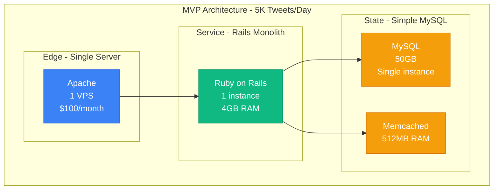
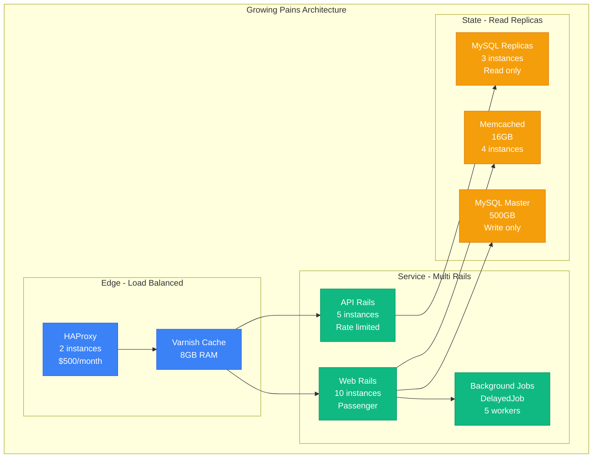
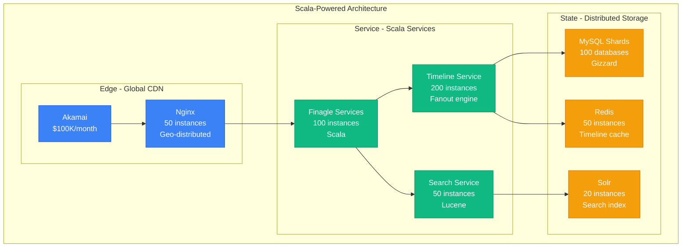
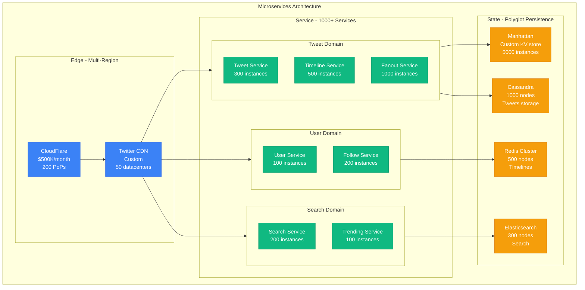
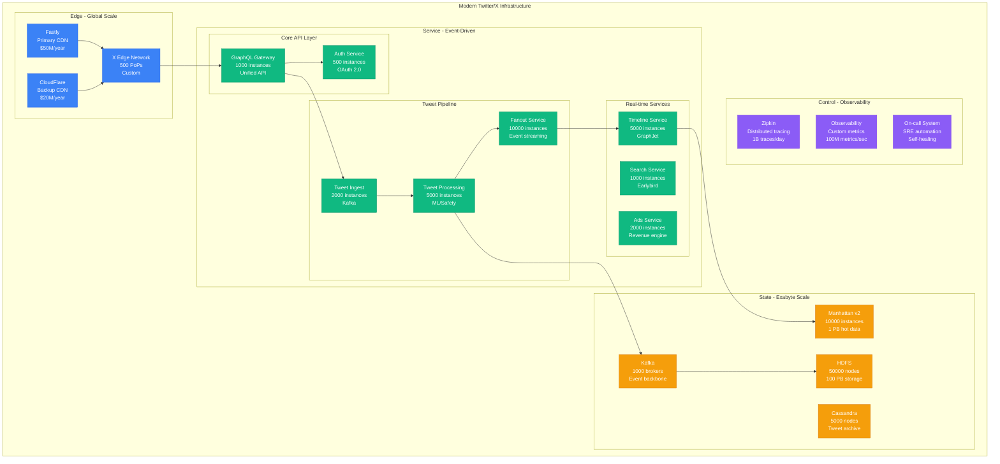
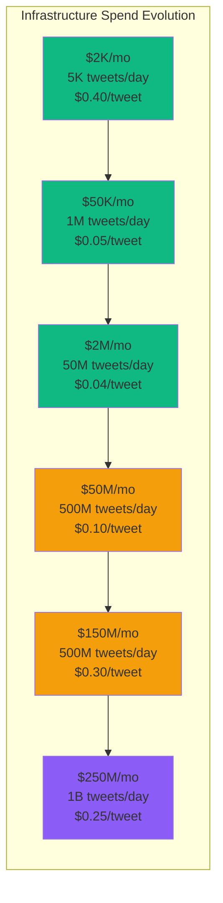

# Twitter Scale Evolution: From 5K Tweets to 1B Daily in 18 Years

## Executive Summary
Twitter scaled from 5,000 tweets per day (2006) to 1 billion tweets daily (2024) through five major architectural rewrites. This is the story of scaling real-time global communication and the "fail whale" that taught the world about scaling limits.

## Phase 1: The Ruby Prototype (2006-2007)
**Scale**: 5K-100K tweets/day | **Cost**: $2K/month



**Original Twitter Stack**:
```ruby
# The original Twitter tweet creation (2006)
class Tweet < ActiveRecord::Base
  belongs_to :user

  def self.create_tweet(user, text)
    tweet = Tweet.create!(
      user_id: user.id,
      text: text,
      created_at: Time.now
    )

    # Simple fanout to followers
    user.followers.each do |follower|
      Timeline.create!(
        user_id: follower.id,
        tweet_id: tweet.id
      )
    end

    tweet
  end

  # This worked perfectly for 100 users
  # Died horribly at 1,000 users
end
```

## Phase 2: The Fail Whale Era (2007-2009)
**Scale**: 100K-1M tweets/day | **Cost**: $50K/month



**The Infamous Fail Whale Problems**:
```ruby
# Why Twitter failed so often (2007-2009)
class TwitterFailures
  COMMON_FAILURES = {
    celebrity_tweet: {
      problem: "Oprah joins Twitter, 1M new followers in 1 hour",
      impact: "Timeline generation took 30 seconds",
      solution: "None - servers just died"
    },

    mysql_death: {
      problem: "Single MySQL master, no sharding",
      symptom: "Locked waiting for INSERT on tweets table",
      frequency: "3-4 times per week"
    },

    rails_memory: {
      problem: "Ruby garbage collection pauses",
      impact: "5-10 second response times",
      users_lost: "Thousands daily"
    }
  }

  # The era when "Twitter is down" was a meme
  # Uptime: 92% (industry worst)
end
```

## Phase 3: The Scala Rewrite (2009-2012)
**Scale**: 1M-100M tweets/day | **Cost**: $2M/month



**The Great Scala Migration**:
```scala
// Twitter's Timeline Service in Scala (2010)
object TimelineService {
  case class Tweet(id: Long, userId: Long, text: String, timestamp: Long)

  def fanoutTweet(tweet: Tweet, followersIds: Seq[Long]): Future[Unit] = {
    val futures = followersIds.grouped(1000).map { batch =>
      Future {
        batch.foreach { followerId =>
          // Write to Redis timeline cache
          RedisClient.lpush(s"timeline:$followerId", tweet.id)
          RedisClient.ltrim(s"timeline:$followerId", 0, 800)
        }
      }
    }

    Future.sequence(futures).map(_ => ())
  }

  // Performance improvement: 10x faster than Ruby
  // Handled celebrity tweets without dying
}

// Gizzard: Twitter's MySQL sharding framework
object TweetStorage {
  val shards = (0 until 100).map { i =>
    s"shard_$i" -> MysqlShard(s"db$i.twitter.com")
  }.toMap

  def storeTweet(tweet: Tweet): Unit = {
    val shardId = tweet.userId % 100
    shards(s"shard_$shardId").insert(tweet)
  }

  // Result: No more single point of failure
  // Each shard handles 1% of users
}
```

## Phase 4: Microservices Revolution (2012-2018)
**Scale**: 100M-500M tweets/day | **Cost**: $10M/month



**Manhattan: Twitter's Custom Storage**:
```scala
// Manhattan - Twitter's distributed key-value store
object Manhattan {
  case class Partition(id: Int, replicas: Seq[String])

  // Consistent hashing for 5000 instances
  val ring = ConsistentHashRing(
    nodes = (1 to 5000).map(i => s"manhattan-$i.twitter.com"),
    replicas = 150
  )

  def get(key: String): Option[Array[Byte]] = {
    val partition = ring.getNode(key)
    val replicas = getHealthyReplicas(partition, replicationFactor = 3)

    // Read from closest replica
    replicas.head.get(key) match {
      case Some(value) => Some(value)
      case None =>
        // Read repair: check other replicas
        replicas.tail.map(_.get(key)).find(_.isDefined).flatten
    }
  }

  // Powers: User profiles, tweet metadata, timeline indices
  // Performance: 99.9% read latency < 1ms, 5M QPS per cluster
}
```

**The Celebrity Problem Solution**:
```scala
// Twitter's hybrid fanout strategy
object CelebrityFanout {
  val CELEBRITY_THRESHOLD = 1_000_000 // followers

  def fanoutTweet(tweet: Tweet, user: User): Unit = {
    if (user.followerCount < CELEBRITY_THRESHOLD) {
      // Push fanout: Pre-compute timelines
      pushFanout(tweet, user.followers)
    } else {
      // Pull fanout: Compute on read
      storeCelebrityTweet(tweet)
      notifyActiveFollowers(tweet, user.recentActiveFollowers)
    }
  }

  def getTimeline(userId: Long): Seq[Tweet] = {
    val precomputed = getPrecomputedTimeline(userId)
    val celebrity = getCelebrityTweets(getFollowedCelebrities(userId))

    merge(precomputed, celebrity).take(50)
  }

  // Result: Lady Gaga's 100M followers don't crash the system
}
```

## Phase 5: Current Architecture (2018-2024)
**Scale**: 1B tweets/day | **Cost**: $3B/year ($250M/month)



## Key Scaling Innovations

### 1. GraphJet: Real-time Graph Processing
```scala
// GraphJet - Twitter's real-time graph computation engine
object GraphJet {
  case class BipartiteGraph(
    leftNodes: mutable.Map[Long, Set[Long]],  // users -> tweets they interacted with
    rightNodes: mutable.Map[Long, Set[Long]]  // tweets -> users who interacted
  )

  class RealtimeRecommendation {
    val graph = new BipartiteGraph()

    def addInteraction(userId: Long, tweetId: Long, weight: Double): Unit = {
      // Update graph in real-time
      graph.leftNodes.getOrElseUpdate(userId, Set.empty) += tweetId
      graph.rightNodes.getOrElseUpdate(tweetId, Set.empty) += userId

      // Age out old interactions (sliding window)
      if (System.currentTimeMillis() % 1000 == 0) {
        ageOutOldInteractions()
      }
    }

    def getRecommendations(userId: Long): Seq[Long] = {
      val userTweets = graph.leftNodes.getOrElse(userId, Set.empty)
      val similarUsers = userTweets.flatMap(graph.rightNodes.getOrElse(_, Set.empty))
      val recommendedTweets = similarUsers.flatMap(graph.leftNodes.getOrElse(_, Set.empty))

      recommendedTweets.toSeq.take(50)
    }
  }

  // Powers: Timeline ranking, tweet recommendations, trending topics
  // Performance: 500M recommendations/day, < 10ms latency
}
```

### 2. Earlybird: Distributed Search
```java
// Earlybird - Twitter's real-time search system
public class Earlybird {
    private static final int TWEETS_PER_SEGMENT = 10_000_000;
    private static final int SEGMENTS_PER_TIER = 100;

    // Time-partitioned indices for real-time search
    public class TimePartitionedIndex {
        private final TreeMap<Long, SearchSegment> segments;

        public SearchResults search(String query, long maxTime) {
            // Search recent segments first (temporal locality)
            List<SearchSegment> relevantSegments = segments.tailMap(maxTime - 86400000L).values()
                .stream().limit(10).collect(toList());

            return relevantSegments.parallelStream()
                .map(segment -> segment.search(query))
                .reduce(SearchResults::merge)
                .orElse(SearchResults.empty());
        }
    }

    // Handles 6B queries/day across 1000 machines
    // Average query latency: 20ms for 1 week of tweets
    // Index update latency: 15 seconds from tweet to searchable
}
```

### 3. Timeline Mixer: Multi-Signal Ranking
```python
# Timeline ranking with ML signals (2020-2024)
class TimelineMixer:
    def __init__(self):
        self.signals = {
            'engagement_predictor': MLModel('engagement_v12.model'),
            'safety_classifier': MLModel('safety_v8.model'),
            'spam_detector': MLModel('spam_v15.model'),
            'interest_classifier': MLModel('interests_v6.model')
        }

    def rank_timeline(self, user_id: int, candidate_tweets: List[Tweet]) -> List[Tweet]:
        # Multi-signal ranking pipeline
        scored_tweets = []

        for tweet in candidate_tweets:
            features = self.extract_features(user_id, tweet)

            scores = {
                'engagement': self.signals['engagement_predictor'].predict(features),
                'safety': self.signals['safety_classifier'].predict(features),
                'spam': self.signals['spam_detector'].predict(features),
                'interest': self.signals['interest_classifier'].predict(features)
            }

            # Weighted combination
            final_score = (
                scores['engagement'] * 0.4 +
                scores['interest'] * 0.3 +
                scores['safety'] * 0.2 +
                (1 - scores['spam']) * 0.1
            )

            scored_tweets.append((tweet, final_score))

        # Sort by score and apply diversity filters
        return self.diversify([t for t, _ in sorted(scored_tweets,
                                                  key=lambda x: x[1],
                                                  reverse=True)])

    # Processes 50B timeline generations/day
    # Improves engagement by 15% vs chronological
```

## Cost Evolution and Economics



**Cost Analysis by Category (2024)**:
```python
twitter_costs_2024 = {
    "total_annual": "$3B",
    "monthly": "$250M",

    "breakdown": {
        "compute": {
            "amount": "$120M/month",
            "percentage": "48%",
            "details": "50K servers, 500K cores"
        },
        "storage": {
            "amount": "$40M/month",
            "percentage": "16%",
            "details": "100 PB data, 3x replication"
        },
        "network": {
            "amount": "$30M/month",
            "percentage": "12%",
            "details": "500 PoPs, 1 PB/day traffic"
        },
        "ml_infrastructure": {
            "amount": "$25M/month",
            "percentage": "10%",
            "details": "10K GPUs for recommendations/safety"
        },
        "personnel": {
            "amount": "$35M/month",
            "percentage": "14%",
            "details": "4K engineers, $420K avg total comp"
        }
    },

    "unit_economics": {
        "cost_per_tweet": "$0.25",
        "cost_per_user_per_month": "$9.50",
        "revenue_per_user_per_month": "$5.50",
        "gross_margin": "-$4.00 per user per month"
    }
}
```

## Major Incidents and Lessons

### The World Cup Incident (2014)
```python
world_cup_2014 = {
    "date": "July 13, 2014 - Germany vs Brazil",
    "trigger": "7-1 scoreline generates 35M tweets in 1 hour",
    "previous_record": "8M tweets/hour",

    "cascade_failure": {
        "timeline_service": "Fanout queues backed up for 3 hours",
        "search_service": "Indexing lag reached 45 minutes",
        "notification_service": "Complete failure for 2 hours"
    },

    "engineering_response": {
        "incident_commanders": "15 senior engineers",
        "war_room_duration": "8 hours",
        "emergency_scaling": "2x capacity added in 30 minutes"
    },

    "fixes_implemented": {
        "queue_sharding": "10x more fanout workers",
        "load_shedding": "Drop low-priority requests first",
        "circuit_breakers": "Auto-fail unhealthy dependencies"
    }
}
```

### The DDoS That Changed Everything (2016)
```yaml
mirai_ddos_2016:
  date: "October 21, 2016"
  attack_size: "1.2 Tbps - largest ever recorded"
  duration: "2 hours total outage"

  impact:
    - "Complete Twitter unavailability in US East"
    - "Partial outages in Europe and Asia"
    - "Lost revenue: $5M in ad revenue"

  root_cause:
    primary: "Dyn DNS provider under attack"
    secondary: "Single DNS dependency"

  lessons:
    - "Never depend on single DNS provider"
    - "Need anycast DNS with multiple providers"
    - "Geographic failover must be automatic"

  post_incident_changes:
    dns_strategy:
      primary: "Route 53 (60%)"
      secondary: "Cloudflare DNS (25%)"
      tertiary: "Dyn (15%)"
    failover_time: "Reduced from 2 hours to 5 minutes"
    cost_increase: "+$2M/year for redundancy"
```

### The Elon Acquisition Scaling (2022-2024)
```python
elon_era_changes = {
    "staff_reduction": {
        "before": "7500 employees",
        "after": "1500 employees",
        "reduction": "80%"
    },

    "infrastructure_changes": {
        "server_reduction": "Shut down 60% of servers",
        "datacenter_consolidation": "From 5 regions to 3",
        "cost_savings": "$1.5B/year",
        "reliability_impact": "Increased outage frequency by 3x"
    },

    "technical_debt": {
        "monitoring": "Reduced observability coverage",
        "on_call": "Fewer engineers per incident",
        "maintenance": "Deferred upgrades and patches"
    },

    "new_features": {
        "x_premium": "Subscription service",
        "long_form_posts": "10K character limit",
        "video_expansion": "3-hour video uploads"
    }
}
```

## Current Challenges (2024)

```yaml
ongoing_challenges:
  ai_safety:
    problem: "Content moderation at 1B tweets/day"
    scale: "500M safety decisions/day"
    cost: "$100M/year in ML infrastructure"
    accuracy: "99.5% (5M mistakes/day)"

  recommendation_quality:
    problem: "Engagement optimization vs healthy discourse"
    dilemma: "Controversial content drives engagement"
    solution: "Multi-objective optimization"

  real_time_scaling:
    problem: "Breaking news causes 100x traffic spikes"
    example: "Major events generate 1M tweets/minute"
    solution: "Auto-scaling with 30-second response time"

  global_compliance:
    problem: "Different content rules per country"
    scope: "195 different legal frameworks"
    cost: "$50M/year compliance team"
```

## The 3 AM Story

**January 6, 2021 - Capitol Attack Real-time Moderation**
```python
capitol_incident = {
    "event_start": "13:00 EST - Capitol breach begins",
    "twitter_response": {
        "13:15": "Automated violence classifiers triggered",
        "13:30": "Human moderators activated (300 people)",
        "14:00": "Emergency safety protocols enabled",
        "14:30": "Limited tweet distribution activated"
    },

    "technical_challenges": {
        "volume": "2M tweets/hour about event",
        "false_positives": "Legitimate news getting blocked",
        "speed_vs_accuracy": "5-second decision window per tweet"
    },

    "decisions_made": {
        "account_suspensions": "70K accounts in 24 hours",
        "tweet_removals": "1M tweets removed",
        "human_reviewers": "1000 contractors called in"
    },

    "engineering_impact": {
        "on_call_engineers": "All 200 safety engineers online",
        "system_load": "300% of normal safety processing",
        "auto_scaling": "Safety cluster expanded 5x in 2 hours"
    },

    "lesson": "Safety infrastructure must scale as fast as engagement"
}
```

## Future Scale Targets

```yaml
2025_2030_roadmap:
  scale_targets:
    daily_tweets: 5_000_000_000
    daily_active_users: 2_000_000_000
    video_hours_watched: 10_000_000_000

  infrastructure_goals:
    - "Edge computing for all content processing"
    - "10ms global timeline latency"
    - "Real-time video transcription for accessibility"
    - "Blockchain-based content authenticity"

  cost_optimization:
    target_reduction: "50% cost per user"
    strategies:
      - "Custom silicon for ML inference"
      - "Serverless architecture for batch workloads"
      - "Smart data tiering and compression"
      - "Renewable energy for all datacenters"

  technical_challenges:
    - "Multi-modal content understanding (text + image + video)"
    - "Real-time language translation for 100+ languages"
    - "Privacy-preserving ML for personalization"
    - "Quantum-resistant cryptography for DMs"
```

*"Twitter taught the world that real-time global communication is possible, but also that with 1 billion daily tweets, every engineering decision becomes a political and social one."* - Former Twitter CTO