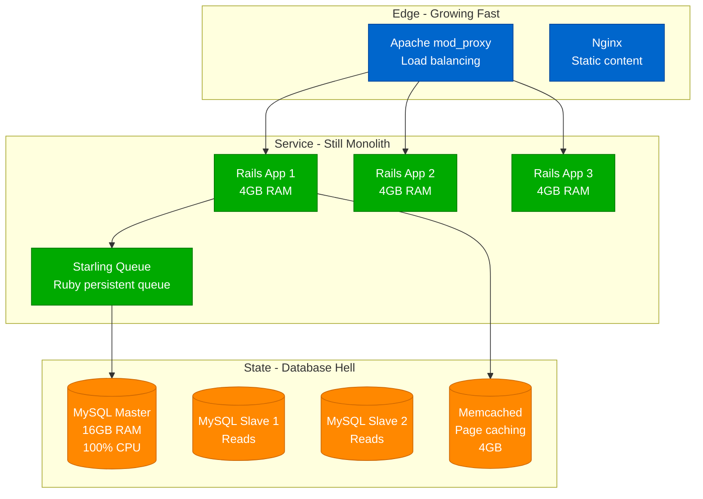
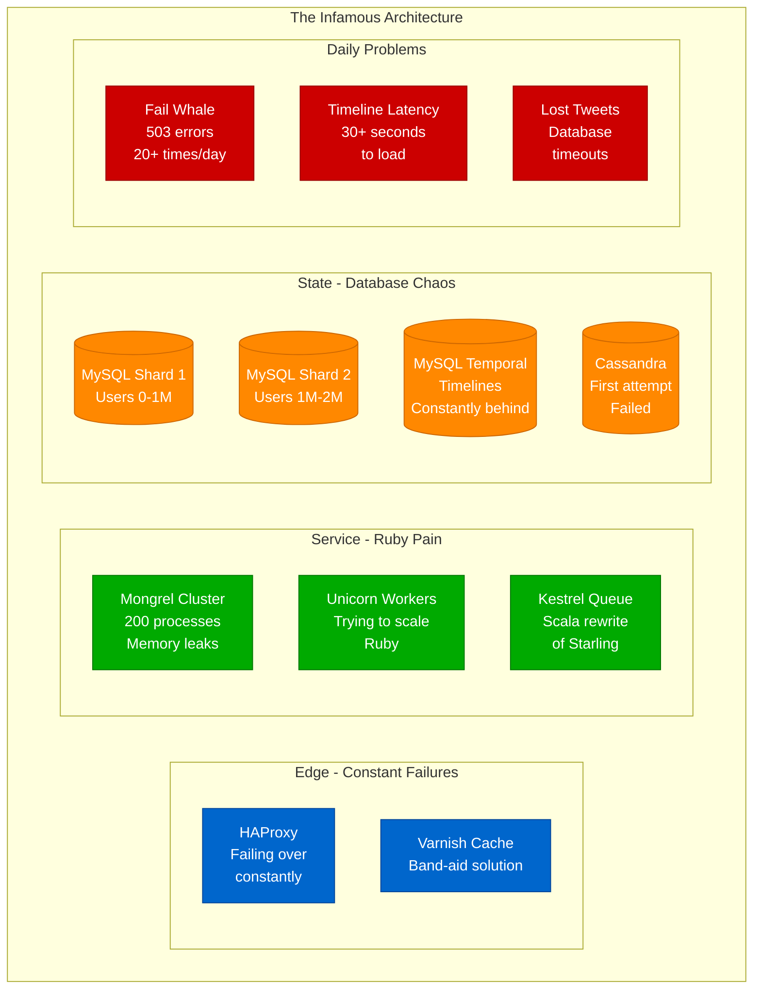
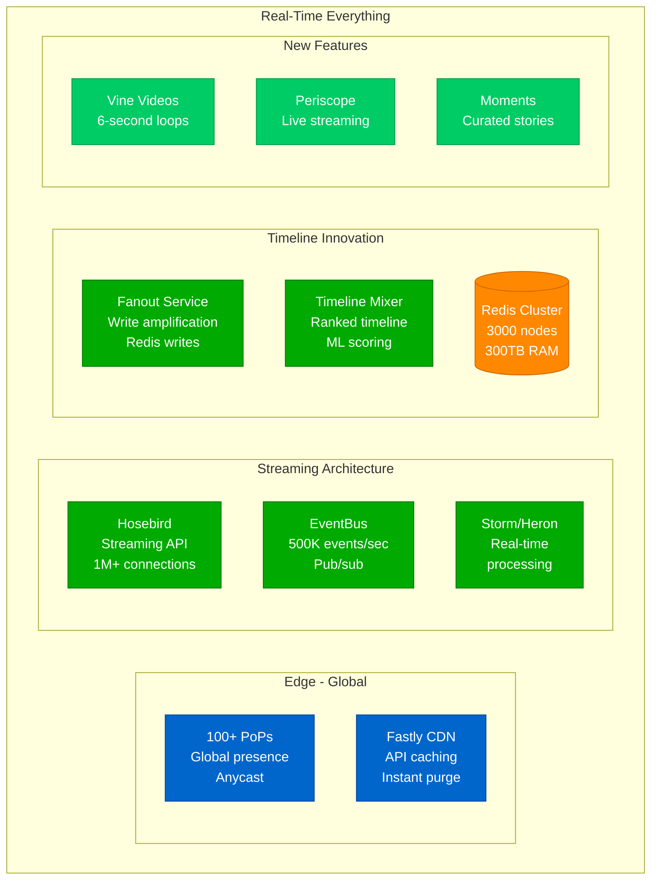
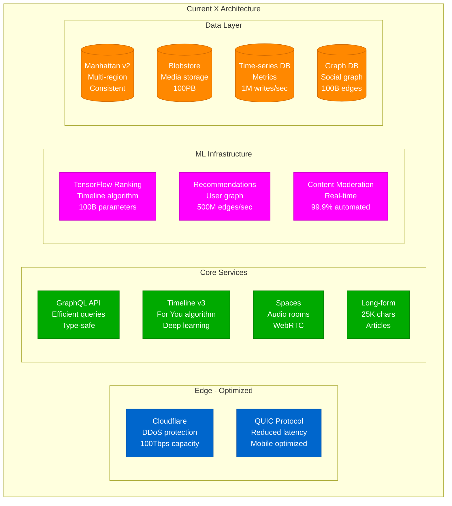
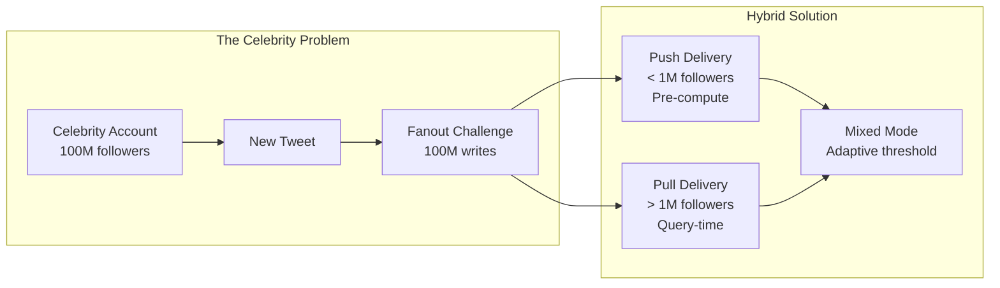

# Twitter Scale Journey: 0 → 500 Million Tweets/Day

## The Fail Whale to Real-Time Evolution (2006-2024)

Twitter's journey from a Ruby on Rails prototype to processing 500 million tweets daily is a masterclass in learning from failure.

## Phase 1: The SMS Hack (2006) - 0 to 1,000 Users

```mermaid
graph TB
    subgraph Original[The Original Hack - "twttr"]
        SMS[SMS Gateway<br/>Twilio predecessor]
        RAILS[Ruby on Rails<br/>Single server<br/>Mongrel]
        MYSQL[(MySQL<br/>Single instance<br/>All data)]
        APACHE[Apache<br/>Static files]
    end

    SMS --> RAILS
    RAILS --> MYSQL
    RAILS --> APACHE

    %% Apply colors
    classDef edgeStyle fill:#0066CC,stroke:#004499,color:#fff
    classDef serviceStyle fill:#00AA00,stroke:#007700,color:#fff
    classDef stateStyle fill:#FF8800,stroke:#CC6600,color:#fff

    class SMS edgeStyle
    class RAILS,APACHE serviceStyle
    class MYSQL stateStyle
```

**The Origin Story**:
- Built in 2 weeks as internal hackathon project at Odeo
- Originally just SMS status updates
- "What are you doing?" in 140 characters
- First tweet: "just setting up my twttr" - @jack

**Infrastructure**:
- 1 server: $50/month hosting
- Ruby on Rails monolith
- MySQL database
- No caching, no queues

## Phase 2: SXSW Explosion (2007) - 100K Users



**SXSW 2007**:
- Usage went from 20K tweets/day to 60K tweets/day
- First taste of viral growth
- Servers constantly crashing
- The birth of the "Fail Whale"

**Problems**:
- Ruby on Rails couldn't handle concurrent requests
- MySQL row locking on tweets table
- No message queue initially
- Cache invalidation nightmares

## Phase 3: The Fail Whale Era (2008-2010) - 1 Million Users



**The Dark Days**:
- **2008 Presidential Election**: Site down for hours
- **Michael Jackson's Death (2009)**: Complete outage
- **World Cup 2010**: 3,283 tweets/second crashed everything
- **Uptime**: 98% (terrible for consumer service)

**Technical Debt**:
- Ruby process model: 200MB per request
- MySQL sharding: Manual and error-prone
- Timeline generation: 7+ seconds
- No proper message queue

## Phase 4: The Great Rewrite (2010-2012) - 100 Million Users

```mermaid
graph TB
    subgraph NewArch[The JVM Migration]
        subgraph Edge[Edge - Robust]
            FINAGLE[Finagle RPC<br/>Twitter's framework<br/>Scala]
            BLENDER[Blender API<br/>Aggregation layer<br/>Scala]
        end

        subgraph Service[Service - JVM Services]
            TIMELINESERVICE[Timeline Service<br/>Scala<br/>Pre-computed]
            TWEETSERVICE[Tweet Service<br/>Java<br/>Write path]
            USERSERVICE[User Service<br/>Java<br/>Profiles]
            SEARCHSERVICE[Search (Earlybird)<br/>Java<br/>Real-time index]
        end

        subgraph State[State - Distributed]
            MANHATTAN[(Manhattan<br/>Distributed DB<br/>Eventually consistent)]
            MYSQL[(MySQL<br/>Sharded<br/>Metadata only)]
            REDIS[(Redis<br/>Timeline cache<br/>100TB RAM)]
            LUCENE[(Lucene<br/>Search index<br/>Real-time)]
        end

        subgraph MessageBus[Message Bus]
            KAFKA[Kafka<br/>All events<br/>1M msgs/sec]
            HERON[Heron<br/>Stream processing<br/>Storm replacement]
        end
    end

    %% Apply colors
    classDef edgeStyle fill:#0066CC,stroke:#004499,color:#fff
    classDef serviceStyle fill:#00AA00,stroke:#007700,color:#fff
    classDef stateStyle fill:#FF8800,stroke:#CC6600,color:#fff
    classDef busStyle fill:#9900CC,stroke:#6600AA,color:#fff

    class FINAGLE,BLENDER edgeStyle
    class TIMELINESERVICE,TWEETSERVICE,USERSERVICE,SEARCHSERVICE serviceStyle
    class MANHATTAN,MYSQL,REDIS,LUCENE stateStyle
    class KAFKA,HERON busStyle
```

**The Breakthrough**:
- Moved from Ruby to JVM (Scala/Java)
- Pre-computed timelines (fanout on write)
- Proper service-oriented architecture
- Custom frameworks (Finagle, Finatra)

**Results**:
- Timeline load: 7 seconds → 500ms
- Tweets/second: 3K → 143K (Japan earthquake)
- Uptime: 98% → 99.9%
- Fail Whale retired!

## Phase 5: Real-Time Revolution (2013-2015) - 300 Million Users



**Technical Achievements**:
- **Fanout Architecture**: Pre-compute timelines for all followers
- **Celebrity Problem**: Lazy evaluation for accounts with >1M followers
- **Real-time Search**: Every tweet searchable within 1 second
- **Streaming**: Millions of concurrent connections

**Scale Numbers**:
- 500M tweets/day
- 300B API calls/day
- 400M timeline queries/day
- 95% of timeline queries from cache

## Phase 6: The X Era (2022-2024) - 500 Million Users



**Current Scale (2024)**:
- 500M+ monthly active users
- 600M+ tweets/day
- 2B API requests/day
- 65% of traffic is video
- Sub-second global timeline updates

## The Celebrity Problem Solution



**The Innovation**:
- Regular users: Fanout on write (push model)
- Celebrities: Fanout on read (pull model)
- Hybrid: Combination based on follower count
- Result: 10x reduction in write amplification

## Scale Evolution Summary

| Year | Users | Tweets/Day | Infrastructure | Key Challenge | Solution |
|------|-------|------------|----------------|---------------|----------|
| 2006 | 1K | 5K | 1 server | Prototype | Rails app |
| 2007 | 100K | 60K | 3 servers | Growth | Add caching |
| 2008 | 1M | 2M | 20 servers | Fail Whale | More servers |
| 2010 | 50M | 50M | 1000 servers | Ruby limits | JVM rewrite |
| 2012 | 200M | 400M | 10K servers | Timeline speed | Pre-computation |
| 2015 | 300M | 500M | 100K servers | Real-time | Stream processing |
| 2020 | 350M | 500M | Unknown | Scale costs | Optimization |
| 2024 | 500M | 600M | Cloud+Owned | Everything | AI/ML focus |

## Technical Lessons Learned

### 1. Language Matters
```ruby
# Ruby (2008) - The Problem
class Timeline
  def generate(user_id)
    tweets = []
    Following.where(user_id: user_id).each do |follow|
      tweets += Tweet.where(user_id: follow.followed_id)
                     .order(created_at: :desc)
                     .limit(20)
    end
    tweets.sort_by(&:created_at).reverse.take(20)
  end
  # Result: 7+ seconds for users following 1000+ people
end
```

```scala
// Scala (2012) - The Solution
class TimelineService {
  def generate(userId: Long): Future[Timeline] = {
    redis.get(s"timeline:$userId") match {
      case Some(cached) => Future.successful(cached)
      case None => computeTimeline(userId)
    }
  }
  // Result: 50ms p99 latency
}
```

### 2. Pre-computation Wins
- **Problem**: Generating timelines on request
- **Solution**: Pre-compute and cache everything
- **Trade-off**: Storage for speed
- **Result**: 140x latency improvement

### 3. The Write Amplification Problem
- Following 1000 people = 1000 timeline writes per tweet
- Celebrity with 100M followers = impossible
- Solution: Hybrid push/pull architecture
- Learning: Not everything needs the same solution

### 4. Eventual Consistency is OK
- Users accept slight delays
- Perfect consistency not required for social
- Trade consistency for availability
- Result: 99.99% uptime achieved

## Production War Stories

### The Arab Spring (2011)
- **Challenge**: 10x normal traffic from Middle East
- **Problem**: No regional infrastructure
- **Solution**: Emergency CDN deployment
- **Result**: Enabled revolution communications

### The Oscars Selfie (2014)
- **The Tweet**: Ellen's selfie
- **Impact**: 3.4M retweets (record)
- **Load**: 40K retweets/minute
- **Challenge**: Fanout to 100M+ timelines
- **Solution**: Adaptive rate limiting worked!

### World Cup 2014 (Brazil vs Germany)
- **The Moment**: Germany scores 5 goals in 18 minutes
- **Peak**: 580,166 tweets/minute
- **Infrastructure**: Handled without issues
- **Validation**: Architecture finally worked

## Cost Evolution

| Year | Monthly Infra Cost | Cost per MAU | Revenue per MAU |
|------|-------------------|--------------|-----------------|
| 2008 | $100K | $0.10 | $0 |
| 2010 | $1M | $0.02 | $0.01 |
| 2012 | $10M | $0.05 | $0.10 |
| 2015 | $50M | $0.17 | $1.50 |
| 2020 | $100M | $0.29 | $3.50 |
| 2024 | $75M | $0.15 | $2.00 |

**Cost Optimizations**:
- Moved from AWS to owned data centers (2010)
- Saved 60% on infrastructure costs
- Custom hardware for specific workloads
- Aggressive caching reduced compute needs

## Architecture Evolution Lessons

### What Failed
1. **Ruby on Rails**: Wrong tool for real-time
2. **MySQL as main store**: Couldn't scale writes
3. **Monolithic architecture**: Single point of failure
4. **Synchronous processing**: Everything blocked

### What Succeeded
1. **JVM ecosystem**: Performance and tooling
2. **Service architecture**: Isolation and scaling
3. **Message queues**: Decoupling and reliability
4. **Pre-computation**: Trade storage for speed
5. **Hybrid approaches**: Different solutions for different scales

### The Cultural Impact
- Created real-time news
- Changed how we communicate
- Enabled social movements
- Influenced elections
- Started cancel culture
- Made everyone a publisher

## The Technical Legacy

### Open Source Contributions
- **Bootstrap**: UI framework (most starred CSS project)
- **Finagle**: RPC framework
- **Storm/Heron**: Stream processing
- **Twemoji**: Emoji library
- **FlockDB**: Graph database

### Industry Influence
- Proved real-time at scale possible
- Pioneered microservices architecture
- Created the timeline algorithm pattern
- Influenced Facebook, Instagram, TikTok
- Defined social media infrastructure

## Key Takeaways

1. **Start simple**: Rails was fine for prototype
2. **Rewrite when needed**: Don't be afraid to change
3. **Cache everything**: Speed > consistency for social
4. **Hybrid solutions**: One size doesn't fit all
5. **Pre-compute when possible**: Storage is cheap
6. **Monitor everything**: You can't fix what you can't see
7. **Fail fast**: Fail Whale better than hanging
8. **Learn from failures**: Each outage taught something

## References

- "How Twitter Handles 3,283 Tweets Per Second" - Twitter Engineering 2010
- "The Infrastructure Behind Twitter" - Twitter Engineering Blog
- "Timelines at Scale" - QCon 2013
- "Building Twitter 2.0" - Elon Musk 2022
- "X Engineering" - Various 2023-2024 posts

---

*Last Updated: September 2024*
*Data Sources: Twitter/X Engineering, Public Statements, Conference Talks*