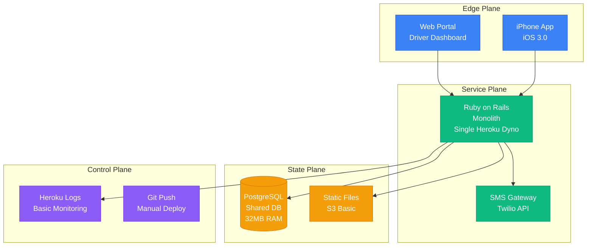
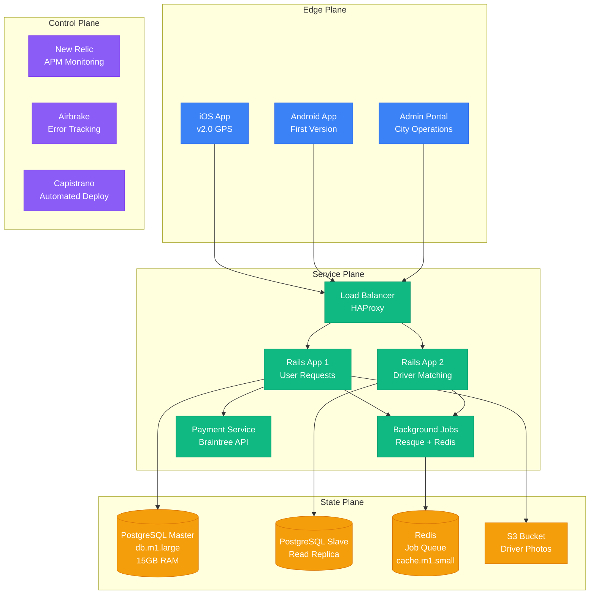
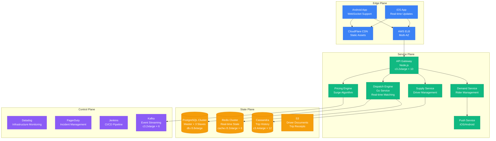
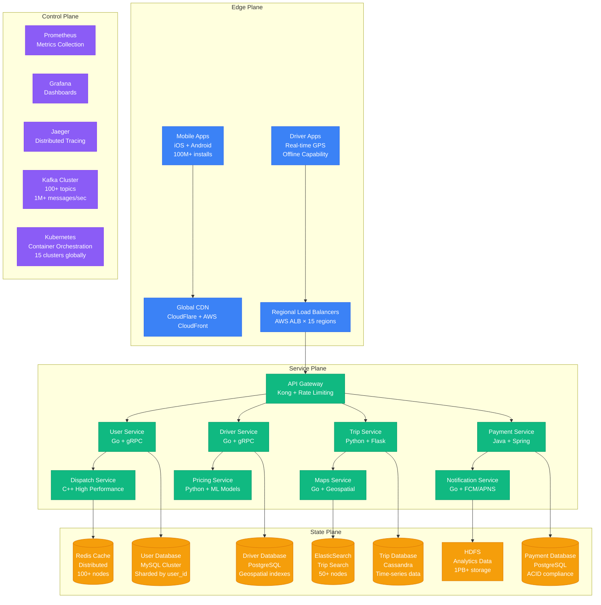
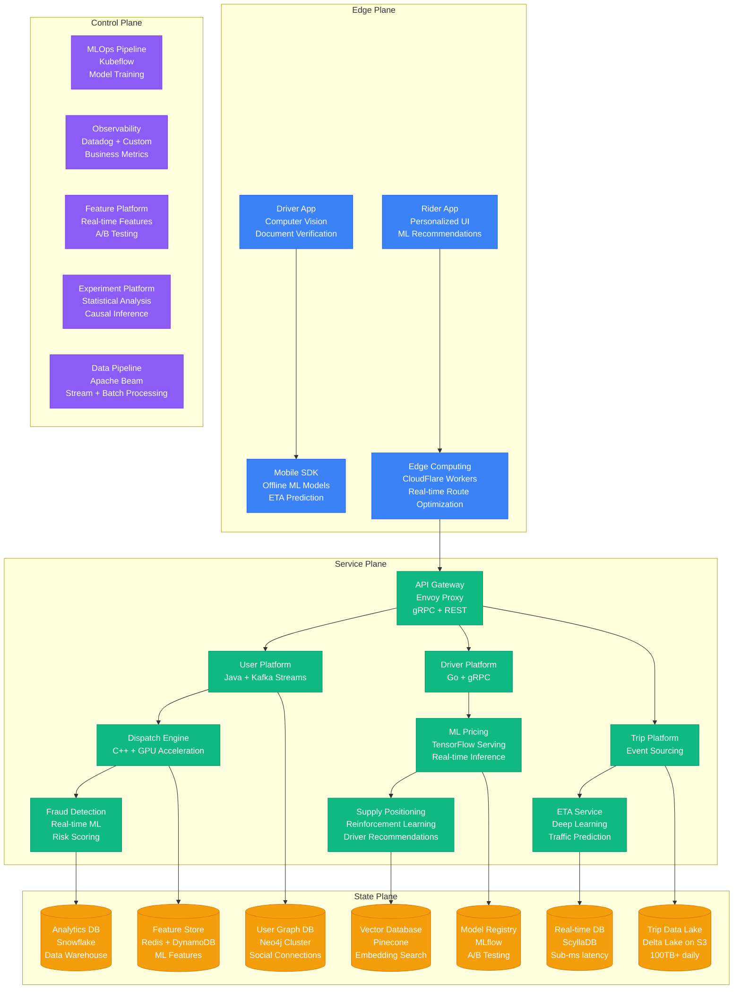
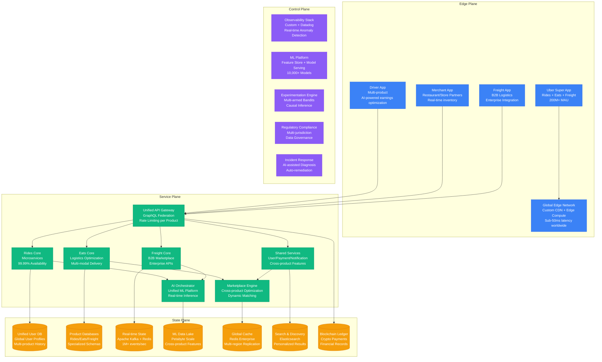

# Uber Scale Evolution: From 10 Drivers to 5M Drivers Globally

## Executive Summary

Uber's scaling journey from a simple black car service in San Francisco to a global platform serving 130M+ users with 5M+ drivers represents one of the most dramatic scale transformations in tech history. This evolution required 6 major architectural phases, each triggered by specific scale barriers and operational challenges.

**Scale Journey**: 10 drivers (2010) → 5M+ drivers (2024)
**Platform Growth**: 1 city → 10,000+ cities in 70+ countries
**Annual Rides**: 0 → 7.6 billion rides per year
**Peak Requests/Second**: 1 → 100,000+ during surge events

## Phase 1: MVP - Single City Launch (2010)
**Scale**: 10 drivers, 100 rides/day, 1 city (San Francisco)

### Architecture Overview

### Key Metrics & Costs
- **Infrastructure Cost**: $200/month (Heroku + S3)
- **Team Size**: 3 engineers
- **Response Time**: 2-5 seconds average
- **Deployment**: Manual, 2-3 times per week
- **Database Size**: <100MB

### Major Challenges
1. **Manual Dispatch**: Human operators matched riders to drivers via phone
2. **No Real-time Tracking**: Estimated arrival times only
3. **Cash Payments**: No integrated payment system
4. **Single Point of Failure**: Entire service down if Rails crashes

## Phase 2: Multi-City Expansion (2011-2012)
**Scale**: 1,000 drivers, 5,000 rides/day, 5 cities

### Architecture Evolution

### Key Metrics & Costs
- **Infrastructure Cost**: $15,000/month
- **Team Size**: 15 engineers
- **Peak Requests/Second**: 10 RPS
- **Database Size**: 5GB
- **API Response Time**: p99 < 1s

### Major Challenges & Solutions
1. **Challenge**: Manual city launches taking 6+ months
   - **Solution**: Standardized launch playbook, city templates

2. **Challenge**: Driver-rider matching inefficiency
   - **Solution**: Basic geospatial matching algorithm

3. **Challenge**: Payment failures causing ride abandonment
   - **Solution**: Integrated Braintree, stored payment methods

### Critical Incident: The Thanksgiving 2011 Outage
- **Trigger**: Traffic surge 10x normal volume
- **Impact**: 4-hour complete service outage
- **Root Cause**: Single PostgreSQL instance hit connection limit
- **Fix**: Added read replicas, connection pooling
- **Architecture Change**: Forced move to master-slave database setup

## Phase 3: National Scale & Real-Time Engine (2013-2014)
**Scale**: 50,000 drivers, 100,000 rides/day, 100+ cities

### Architecture Revolution

### Key Metrics & Costs
- **Infrastructure Cost**: $500,000/month
- **Team Size**: 200 engineers (50 backend)
- **Peak Requests/Second**: 1,000 RPS
- **Database Size**: 2TB (PostgreSQL), 500GB (Cassandra)
- **API Response Time**: p99 < 500ms

### Breakthrough Innovations
1. **Real-Time Dispatch Engine**: Sub-second driver matching
2. **Surge Pricing Algorithm**: Dynamic pricing based on supply/demand
3. **ETA Prediction**: Machine learning for accurate arrival times
4. **Event-Driven Architecture**: Kafka for real-time updates

### Critical Incident: New Year's Eve 2013 Surge
- **Trigger**: 100x normal demand spike globally
- **Impact**: Slow response times, some timeouts
- **Root Cause**: Redis cluster hitting memory limits
- **Resolution**: Emergency Redis cluster scaling
- **Architecture Change**: Auto-scaling groups for Redis

## Phase 4: Global Expansion & Microservices (2015-2017)
**Scale**: 1M drivers, 5M rides/day, 500+ cities globally

### Microservices Architecture

### Key Metrics & Costs
- **Infrastructure Cost**: $50M/year ($4.2M/month)
- **Team Size**: 2,000 engineers (500 backend)
- **Peak Requests/Second**: 10,000 RPS
- **Database Size**: 50TB total across all services
- **API Response Time**: p99 < 200ms
- **Service Count**: 1,000+ microservices

### Major Architecture Decisions
1. **Service Mesh**: Istio for service-to-service communication
2. **Database Sharding**: User-based sharding across 200+ shards
3. **Multi-Region Active-Active**: 15 AWS regions for low latency
4. **Event Sourcing**: Kafka for reliable event processing

### Critical Incident: AWS US-East-1 Outage February 2017
- **Trigger**: AWS S3 outage in US-East-1
- **Impact**: 60% of North American trips affected for 4 hours
- **Root Cause**: Over-dependence on single AWS region
- **Resolution**: Emergency traffic failover to US-West-2
- **Architecture Change**: Multi-region active-active deployment

## Phase 5: AI-Driven Platform (2018-2021)
**Scale**: 3M drivers, 15M rides/day, 10,000+ cities

### ML-First Architecture

### Key Metrics & Costs
- **Infrastructure Cost**: $500M/year ($42M/month)
- **Team Size**: 8,000 engineers (2,000 ML/Data)
- **Peak Requests/Second**: 50,000 RPS
- **ML Models in Production**: 2,000+
- **Data Processing**: 100TB/day
- **API Response Time**: p99 < 100ms

### AI/ML Breakthroughs
1. **Dynamic Pricing**: Real-time supply-demand optimization
2. **Route Optimization**: Traffic-aware pathfinding with 15% time savings
3. **Driver Positioning**: Proactive driver placement reducing wait times 25%
4. **Fraud Detection**: Real-time transaction scoring preventing $100M+ losses
5. **Demand Forecasting**: City-level demand prediction for supply planning

### Critical Incident: COVID-19 Demand Crash March 2020
- **Trigger**: Global lockdowns, 80% demand drop overnight
- **Impact**: Platform over-provisioned by 10x, massive cost spike
- **Response**: Emergency auto-scaling algorithms, cost optimization
- **Architecture Change**: Elastic infrastructure, demand-based scaling

## Phase 6: Multi-Product Platform (2022-Present)
**Scale**: 5M+ drivers, 25M rides/day, 10,000+ cities, Multiple product lines

### Current Unified Platform

### Current Scale Metrics & Costs
- **Infrastructure Cost**: $2B+/year ($167M/month)
- **Team Size**: 25,000+ employees (8,000+ engineers)
- **Peak Requests/Second**: 100,000+ RPS
- **Active ML Models**: 10,000+
- **Data Processing**: 1PB+/day
- **API Response Time**: p99 < 50ms globally
- **Availability**: 99.99% (52 minutes downtime/year)

### Current Architecture Highlights
1. **Multi-Product Platform**: Rides, Eats, Freight unified infrastructure
2. **AI-First**: Every product decision powered by ML
3. **Global Edge**: Sub-50ms response times worldwide
4. **Regulatory Compliance**: Operating in 70+ countries with different laws
5. **Financial Services**: Crypto payments, driver financial products

## Cost Evolution Analysis

| Phase | Period | Monthly Cost | Cost per Ride | Key Cost Drivers |
|-------|--------|--------------|---------------|------------------|
| Phase 1 | 2010 | $200 | $0.07 | Heroku hosting, basic S3 |
| Phase 2 | 2011-2012 | $15K | $0.10 | AWS infrastructure, payment processing |
| Phase 3 | 2013-2014 | $500K | $0.15 | Multi-region deployment, real-time systems |
| Phase 4 | 2015-2017 | $4.2M | $0.28 | Global microservices, ML infrastructure |
| Phase 5 | 2018-2021 | $42M | $0.09 | Economies of scale, AI optimization |
| Phase 6 | 2022-Present | $167M | $0.22 | Multi-product platform, regulatory compliance |

## Major Scaling Challenges Overcome

### Technical Challenges
1. **Real-Time Matching at Scale**: From 10 driver-rider pairs to millions simultaneously
2. **Global Latency**: Sub-100ms response times across 70+ countries
3. **Multi-Product Complexity**: Unified platform serving rides, food, freight
4. **Data Volume**: Processing petabytes of location/trip data daily
5. **ML at Scale**: 10,000+ models serving real-time predictions

### Business Challenges
1. **Regulatory Complexity**: Operating legally in 10,000+ cities with different laws
2. **Cultural Adaptation**: Localizing for vastly different markets (India, Middle East, etc.)
3. **Multi-Modal Transportation**: Integrating cars, bikes, scooters, public transit
4. **Financial Services**: Becoming a fintech platform for driver payments/loans
5. **Competitive Pressure**: Maintaining leadership against Lyft, local competitors

### Organizational Challenges
1. **Engineering Culture**: Scaling from 3 to 8,000+ engineers
2. **Technical Debt**: Continuous refactoring while maintaining 99.99% uptime
3. **Global Coordination**: 24/7 operations across all time zones
4. **Innovation Speed**: Launching new products while maintaining existing ones
5. **Talent Acquisition**: Hiring top ML/systems engineers in competitive market

## Lessons Learned

### Successful Strategies
1. **Invest in Observability Early**: Comprehensive monitoring saved countless incidents
2. **Embrace Failure**: Chaos engineering and failure injection improved resilience
3. **Data-Driven Decisions**: Every feature backed by A/B testing and metrics
4. **Platform Thinking**: Building reusable components accelerated product development
5. **Global-First Architecture**: Designing for international scale from the beginning

### Costly Mistakes
1. **Over-Engineering Early**: Complex solutions before reaching scale
2. **Vendor Lock-in**: Early AWS dependence caused painful multi-cloud migration
3. **Technical Debt**: Delaying refactoring led to exponential future costs
4. **Regulatory Assumptions**: Assuming uniform global regulations caused market exits
5. **Cultural Insensitivity**: Not adapting to local markets caused competitive losses

## Future Scaling Challenges (2024-2030)

1. **Autonomous Vehicles**: Integrating self-driving cars into the platform
2. **Sustainability**: Carbon-neutral operations and electric vehicle transition
3. **Financial Services**: Becoming a full-stack fintech platform
4. **Urban Planning**: Partnering with cities for traffic optimization
5. **Space Transportation**: Eventual expansion to aerial and space transport

Uber's scaling journey demonstrates that successful platforms must continuously reinvent their architecture while maintaining operational excellence. The key is building systems that can evolve with changing requirements while preserving the core user experience that drives growth.