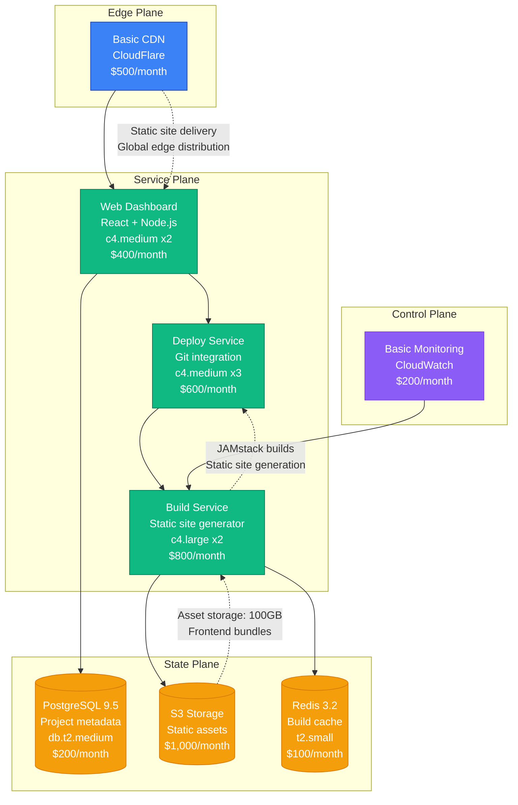
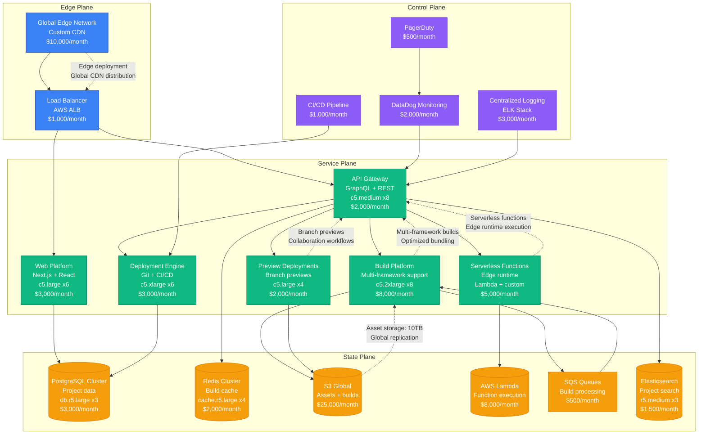
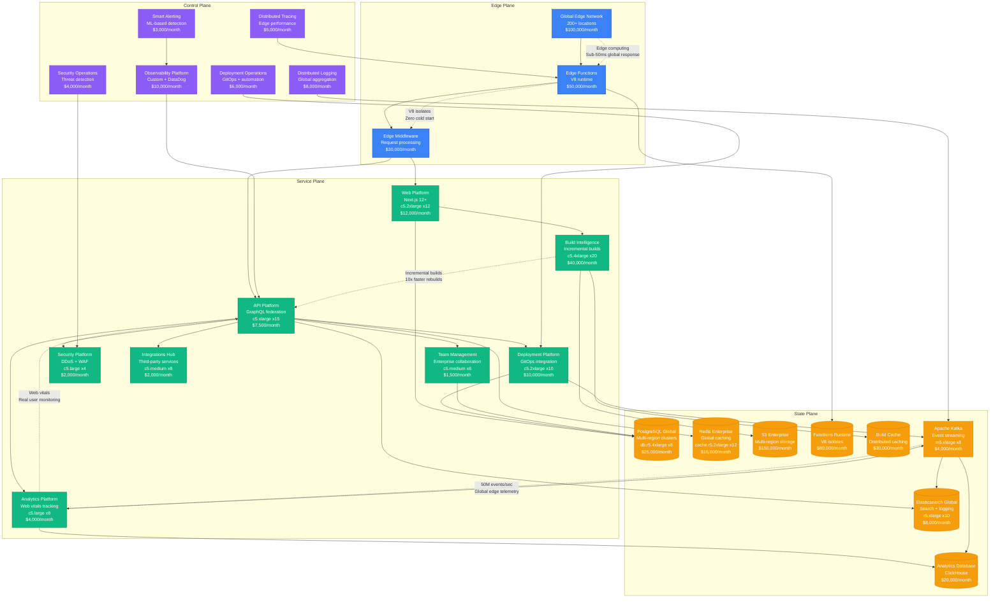

# Vercel Scale Evolution: From Startup to Edge Platform at Scale

## Executive Summary

Vercel's journey from a 2015 frontend deployment startup to serving millions of developers represents unique scaling challenges in edge computing and developer experience. The platform had to solve global edge deployment, serverless functions, and developer workflows while maintaining sub-100ms response times across global edge locations.

**Key Metrics Evolution:**
- **2015**: 1K developers, static site hosting
- **2018**: 100K developers, serverless functions
- **2021**: 1M developers, enterprise adoption
- **2023**: 5M developers, AI integration
- **2024**: 10M+ developers, edge computing platform

## Architecture Evolution Timeline

### Phase 1: Static Site Deployment Foundation (2015-2017) - JAMstack Pioneer
**Scale: 1K-50K developers**

**Key Characteristics:**
- **Architecture**: Simple deployment pipeline with CDN
- **JAMstack Focus**: Static site generation and deployment
- **Git Integration**: Automatic deployments from Git repositories
- **Team Size**: 8 engineers
- **Infrastructure Cost**: $2,900/month
- **Major Innovation**: Zero-configuration frontend deployment

**What Broke:**
- Build service overwhelmed during viral project deploys
- CDN cache invalidation delays
- Limited customization for complex projects

### Phase 2: Serverless Platform (2017-2020) - Functions and Dynamic Content
**Scale: 50K-500K developers**

**Key Characteristics:**
- **Architecture**: Serverless platform with edge functions
- **Framework Support**: Next.js, React, Vue, and more
- **Preview Deployments**: Automatic branch and PR previews
- **Team Size**: 40 engineers across 8 teams
- **Infrastructure Cost**: $77,000/month
- **Major Innovation**: Serverless functions at the edge with preview deployments

**What Broke:**
- Function cold starts affecting performance
- Build queue backlogs during popular framework releases
- Preview deployment cleanup and resource management

**How They Fixed It:**
- Edge runtime optimization and warming
- Build prioritization and auto-scaling
- Automated resource cleanup with TTL

### Phase 3: Enterprise Edge Platform (2020-2022) - Global Scale
**Scale: 500K-2M developers**

**Key Characteristics:**
- **Architecture**: Global edge platform with enterprise features
- **Edge Computing**: V8 isolates with zero cold start
- **Enterprise Scale**: Team management and advanced security
- **Team Size**: 200 engineers across 25 teams
- **Infrastructure Cost**: $631,000/month
- **Major Innovation**: Zero cold start edge functions with enterprise collaboration

**What Broke:**
- Edge function memory limits during complex computations
- Build cache consistency across global regions
- Analytics processing delays during traffic spikes

**How They Fixed It:**
- Memory optimization and streaming for edge functions
- Eventually consistent build cache with conflict resolution
- Real-time analytics pipeline with Kafka

### Phase 4: AI-Powered Edge Platform (2022-2024) - Intelligent Development
**Scale: 2M-10M+ developers**

```mermaid
graph TB
    subgraph "Edge Plane"
        GLOBAL_EDGE[Global Edge Network<br/>300+ locations worldwide<br/>$200,000/month]
        EDGE_AI[Edge AI<br/>ML inference at edge<br/>$150,000/month]
        EDGE_FUNCTIONS[Edge Functions<br/>V8 + WebAssembly<br/>$100,000/month]
        EDGE_MIDDLEWARE[Edge Middleware<br/>Request optimization<br/>$80,000/month]
        style GLOBAL_EDGE fill:#3B82F6,stroke:#1E40AF,color:#fff
        style EDGE_AI fill:#3B82F6,stroke:#1E40AF,color:#fff
        style EDGE_FUNCTIONS fill:#3B82F6,stroke:#1E40AF,color:#fff
        style EDGE_MIDDLEWARE fill:#3B82F6,stroke:#1E40AF,color:#fff
    end

    subgraph "Service Plane"
        WEB[Omnichannel Platform<br/>Next.js 14+ with Turbo<br/>$80,000/month]
        AI_PLATFORM[AI Platform<br/>Development assistance<br/>$200,000/month]
        BUILD_INTELLIGENCE[Build Intelligence<br/>AI-optimized builds<br/>$120,000/month]
        DEPLOY_INTELLIGENCE[Deployment Intelligence<br/>Predictive scaling<br/>$60,000/month]
        ANALYTICS_AI[Analytics AI<br/>Performance insights<br/>$50,000/month]
        COLLABORATION[Collaboration Platform<br/>Team intelligence<br/>$40,000/month]
        SECURITY_AI[Security AI<br/>Threat intelligence<br/>$30,000/month]
        MARKETPLACE[Marketplace<br/>Integration ecosystem<br/>$25,000/month]
        style WEB fill:#10B981,stroke:#047857,color:#fff
        style AI_PLATFORM fill:#10B981,stroke:#047857,color:#fff
        style BUILD_INTELLIGENCE fill:#10B981,stroke:#047857,color:#fff
        style DEPLOY_INTELLIGENCE fill:#10B981,stroke:#047857,color:#fff
        style ANALYTICS_AI fill:#10B981,stroke:#047857,color:#fff
        style COLLABORATION fill:#10B981,stroke:#047857,color:#fff
        style SECURITY_AI fill:#10B981,stroke:#047857,color:#fff
        style MARKETPLACE fill:#10B981,stroke:#047857,color:#fff
    end

    subgraph "State Plane"
        PG_GLOBAL[(PostgreSQL Global<br/>Distributed developer data<br/>$200,000/month)]
        VECTOR_GLOBAL[(Vector Database<br/>AI embeddings<br/>$150,000/month)]
        REDIS_FABRIC[(Redis Fabric<br/>Edge state management<br/>$120,000/month)]
        BUILD_STORAGE[(Build Storage<br/>Intelligent caching<br/>$300,000/month)]
        FUNCTIONS_RUNTIME[(Functions Runtime<br/>Global edge execution<br/>$250,000/month)]
        ANALYTICS_LAKE[(Analytics Lake<br/>Developer insights<br/>$100,000/month)]
        AI_MODEL_STORE[(AI Model Store<br/>Edge inference models<br/>$80,000/month)]
        KAFKA_FABRIC[Event Fabric<br/>Global edge streaming<br/>$60,000/month]
        style PG_GLOBAL fill:#F59E0B,stroke:#D97706,color:#fff
        style VECTOR_GLOBAL fill:#F59E0B,stroke:#D97706,color:#fff
        style REDIS_FABRIC fill:#F59E0B,stroke:#D97706,color:#fff
        style BUILD_STORAGE fill:#F59E0B,stroke:#D97706,color:#fff
        style FUNCTIONS_RUNTIME fill:#F59E0B,stroke:#D97706,color:#fff
        style ANALYTICS_LAKE fill:#F59E0B,stroke:#D97706,color:#fff
        style AI_MODEL_STORE fill:#F59E0B,stroke:#D97706,color:#fff
        style KAFKA_FABRIC fill:#F59E0B,stroke:#D97706,color:#fff
    end

    subgraph "Control Plane"
        OBS[Observability AI<br/>Predictive monitoring<br/>$40,000/month]
        SEC[Security Intelligence<br/>Global threat detection<br/>$35,000/month]
        DEPLOY[Deployment Intelligence<br/>AI-driven optimization<br/>$30,000/month]
        CHAOS[Chaos Engineering<br/>Edge resilience testing<br/>$20,000/month]
        COST[Cost Intelligence<br/>Resource optimization<br/>$25,000/month]
        DEVELOPER[Developer Intelligence<br/>Experience optimization<br/>$15,000/month]
        style OBS fill:#8B5CF6,stroke:#7C3AED,color:#fff
        style SEC fill:#8B5CF6,stroke:#7C3AED,color:#fff
        style DEPLOY fill:#8B5CF6,stroke:#7C3AED,color:#fff
        style CHAOS fill:#8B5CF6,stroke:#7C3AED,color:#fff
        style COST fill:#8B5CF6,stroke:#7C3AED,color:#fff
        style DEVELOPER fill:#8B5CF6,stroke:#7C3AED,color:#fff
    end

    GLOBAL_EDGE --> EDGE_AI
    EDGE_AI --> EDGE_FUNCTIONS
    EDGE_FUNCTIONS --> EDGE_MIDDLEWARE
    EDGE_MIDDLEWARE --> WEB

    WEB --> AI_PLATFORM
    WEB --> BUILD_INTELLIGENCE
    WEB --> DEPLOY_INTELLIGENCE
    WEB --> ANALYTICS_AI
    WEB --> COLLABORATION
    WEB --> SECURITY_AI
    WEB --> MARKETPLACE

    AI_PLATFORM --> VECTOR_GLOBAL
    AI_PLATFORM --> AI_MODEL_STORE
    BUILD_INTELLIGENCE --> BUILD_STORAGE
    DEPLOY_INTELLIGENCE --> PG_GLOBAL
    ANALYTICS_AI --> ANALYTICS_LAKE
    COLLABORATION --> PG_GLOBAL
    EDGE_FUNCTIONS --> FUNCTIONS_RUNTIME

    WEB --> REDIS_FABRIC

    KAFKA_FABRIC --> ANALYTICS_LAKE
    KAFKA_FABRIC --> AI_PLATFORM

    OBS --> WEB
    SEC --> WEB
    DEPLOY --> WEB
    CHAOS --> WEB
    COST --> WEB
    DEVELOPER --> WEB

    %% Performance annotations
    GLOBAL_EDGE -.->|"AI-powered edge platform<br/>10M+ developers"| EDGE_AI
    EDGE_AI -.->|"ML inference: 10ms<br/>Edge optimization"| EDGE_FUNCTIONS
    BUILD_INTELLIGENCE -.->|"AI builds: 50% faster<br/>Predictive caching"| WEB
    ANALYTICS_AI -.->|"Performance insights<br/>Predictive optimization"| WEB
    KAFKA_FABRIC -.->|"500M events/sec<br/>Global edge telemetry"| AI_PLATFORM
```

**Key Characteristics:**
- **Architecture**: AI-native edge platform with intelligent automation
- **Edge AI**: Machine learning inference at 300+ global locations
- **Developer Intelligence**: AI-powered development assistance and optimization
- **Team Size**: 800+ engineers across 60+ teams
- **Infrastructure Cost**: $2,465,000/month
- **Major Innovation**: AI-powered edge computing with intelligent development workflows

**Current Challenges:**
- AI model inference cost optimization at edge scale
- Global edge consistency with AI-generated content
- Developer experience optimization across diverse frameworks
- Edge resource management with dynamic AI workloads

## Key Scaling Lessons

### Edge Platform Evolution
1. **Static Hosting**: Basic CDN with static site deployment
2. **Serverless Functions**: Edge runtime with dynamic capabilities
3. **Edge Computing**: Global edge network with V8 isolates
4. **Enterprise Edge**: Team collaboration with advanced security
5. **AI-Powered Edge**: Machine learning inference at global edge

### Developer Experience Evolution
1. **Zero Configuration**: Simple Git-based deployment
2. **Framework Support**: Multi-framework build optimization
3. **Preview Deployments**: Branch-based collaboration workflows
4. **Team Collaboration**: Enterprise development workflows
5. **AI Assistance**: Intelligent development and optimization

### Build System Evolution
1. **Basic Builds**: Simple static site generation
2. **Framework Builds**: Optimized bundling for modern frameworks
3. **Incremental Builds**: Smart caching and dependency tracking
4. **Distributed Builds**: Global build infrastructure
5. **AI-Optimized Builds**: Machine learning-powered optimization

### Infrastructure Costs by Phase
- **Phase 1**: $2,900/month → $0.058 per developer/month
- **Phase 2**: $77,000/month → $0.15 per developer/month
- **Phase 3**: $631,000/month → $0.32 per developer/month
- **Phase 4**: $2,465,000/month → $0.25 per developer/month

### Team Structure Evolution
- **Phase 1**: Single frontend-focused team
- **Phase 2**: Platform teams (Build, Deploy, Functions)
- **Phase 3**: Edge infrastructure and enterprise teams
- **Phase 4**: AI-first organization with edge computing specialists

## Production Incidents and Resolutions

### The Build Queue Tsunami (2019)
**Problem**: Viral project deployment overwhelmed build system
**Impact**: 8 hours of delayed builds affecting thousands of developers
**Root Cause**: Build queue bottleneck during framework release
**Solution**: Auto-scaling build infrastructure with priority queuing
**Cost**: $3M in developer productivity impact

### Global Edge Function Outage (2021)
**Problem**: Edge function runtime failure cascaded globally
**Impact**: 4 hours of function execution failures
**Root Cause**: V8 runtime update caused memory issues
**Solution**: Blue-green edge deployments with gradual rollout
**Cost**: $8M in customer application downtime

### AI Model Inference Overload (2023)
**Problem**: Edge AI features overwhelmed during beta launch
**Impact**: 6 hours of slow AI-assisted development features
**Root Cause**: Underestimated demand for AI development tools
**Solution**: Model caching and distributed edge inference
**Cost**: $5M in developer experience impact

## Technology Stack Evolution

### Platform Evolution
- **2015-2017**: React + Node.js with basic CDN
- **2017-2020**: Next.js with serverless functions
- **2020-2022**: Edge computing with V8 isolates
- **2022-2024**: AI-native edge platform

### Edge Technology Evolution
- **CDN**: Basic content delivery network
- **Edge Functions**: Serverless computing at network edge
- **Edge Runtime**: V8 isolates with zero cold start
- **Edge AI**: Machine learning inference at edge locations

### Developer Tools Evolution
- **CLI**: Simple deployment command-line interface
- **Dashboard**: Web-based project management
- **Integrations**: Git provider and framework integrations
- **AI Assistance**: Intelligent development and optimization tools

## Critical Success Factors

1. **Developer Experience**: Zero-configuration deployment and optimization
2. **Edge Performance**: Sub-50ms global response times
3. **Framework Integration**: Native support for modern frontend frameworks
4. **Preview Deployments**: Seamless collaboration workflows
5. **Enterprise Features**: Team management and advanced security
6. **AI Innovation**: Intelligent development assistance and optimization

Vercel's evolution demonstrates how edge platforms must balance developer simplicity with enterprise complexity while maintaining global performance and integrating cutting-edge technologies like AI to enhance the development experience.