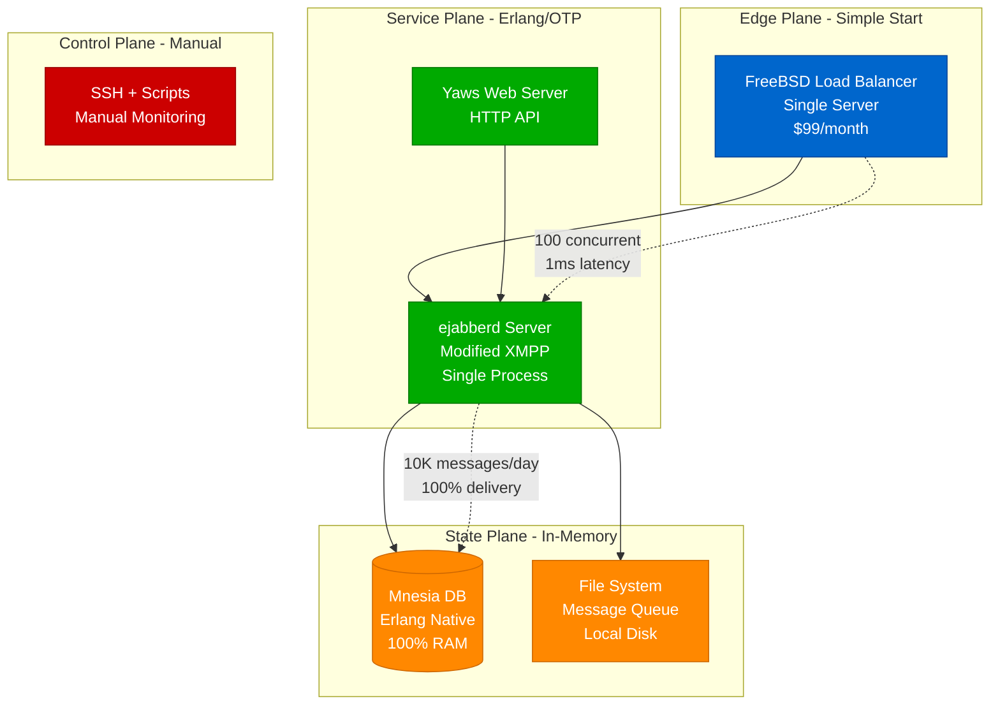
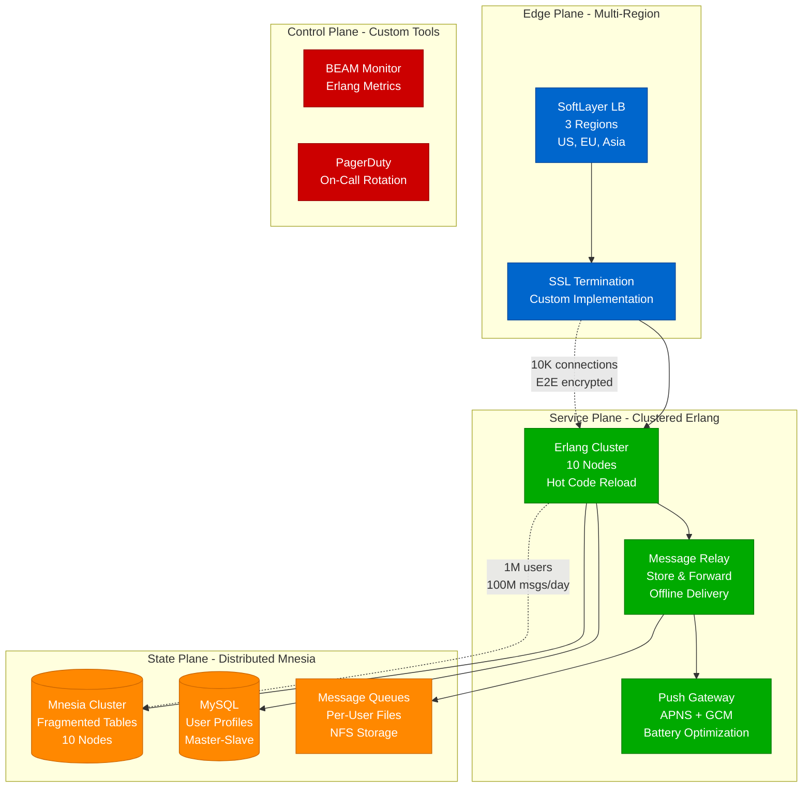
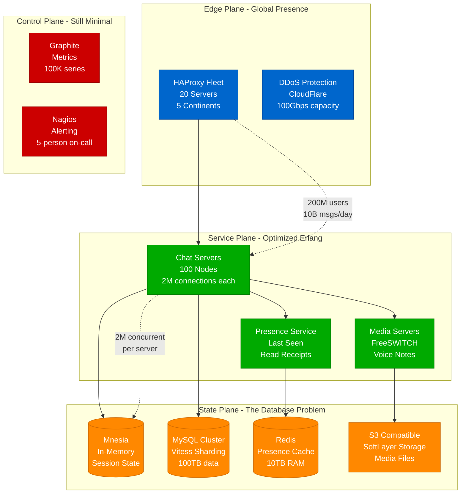
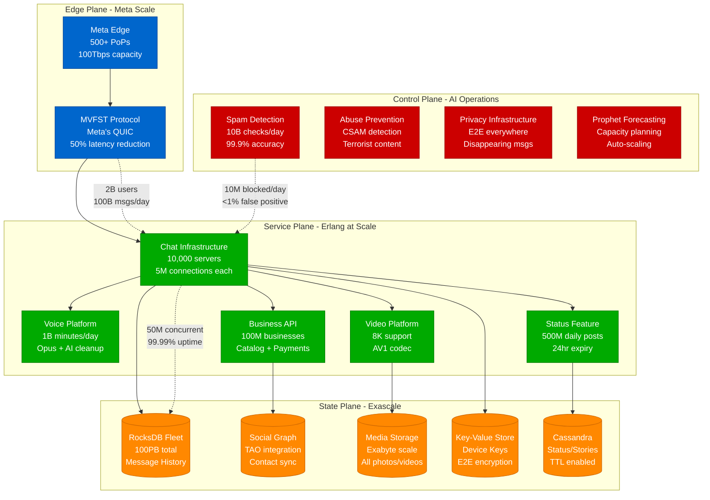
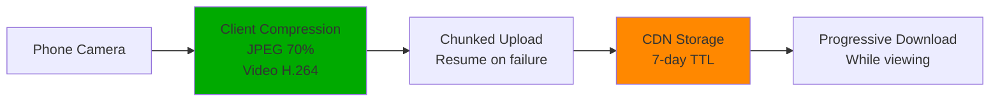

# WhatsApp Scale Journey: 1K → 2 Billion Users

## The Minimalist Scaling Masterclass (2009-2024)

WhatsApp's journey proves that massive scale doesn't require massive teams - they served 900M users with just 50 engineers.

## Phase 1: The Erlang Beginning (2009) - 0 to 10,000 Users



**Philosophy**: "No ads, no gimmicks" - Jan Koum
**What Worked**: Erlang's actor model perfect for messaging
**Cost**: $99/month
**Team**: 2 engineers (Brian Acton, Jan Koum)

## Phase 2: The $0.99 Era (2011) - 1 Million Users



**What Broke**: Mnesia fragmentation limits at 1M users
**The Fix**: Custom partitioning scheme, moved profiles to MySQL
**Revenue**: $0.99/year subscription model working
**Cost**: $10,000/month
**Team**: 6 engineers

## Phase 3: The Hockey Stick (2013) - 200 Million Users



**The Record**: Single server handling 2M concurrent connections
**What Broke**: MySQL sharding complexity explosion
**The Fix**: Hired ex-Yahoo engineers who built custom sharding
**Cost**: $200,000/month
**Team**: 32 engineers
**Valuation**: $1.5 billion

## Phase 4: Facebook Acquisition (2014) - 600 Million Users

```mermaid
graph TB
    subgraph EdgePlane[Edge Plane - Facebook Edge]
        FB_POP[Facebook PoPs<br/>100+ Locations<br/>Anycast Routing]
        QUIC[QUIC Protocol<br/>Mobile Optimization<br/>30% faster]
    end

    subgraph ServicePlane[Service Plane - Still Erlang!]
        CHAT[Chat Fleet<br/>500 Servers<br/>3M connections each]
        VOICE[Voice Calling<br/>WebRTC<br/>Opus Codec]
        VIDEO[Video Calling<br/>H.264/VP8<br/>Adaptive Quality]
        E2E[E2E Encryption<br/>Signal Protocol<br/>No Backdoors]
    end

    subgraph StatePlane[State Plane - Facebook Scale]
        ROCKS[(RocksDB<br/>LSM Trees<br/>1PB capacity)]
        MYSQL[(MySQL + MyRocks<br/>10,000 shards<br/>Space savings)]
        HAYSTACK[Haystack<br/>Photo Storage<br/>100PB media)]
        CACHE[(Memcached<br/>100TB RAM<br/>Profile Cache)]
    end

    subgraph ControlPlane[Control Plane - FB Infrastructure]
        SCUBA[Scuba Analytics<br/>Real-time<br/>1T events/day]
        CONFIGERATOR[Configerator<br/>Config Management]
        ONCALL[OnCall Platform<br/>50 engineers]
    end

    %% Apply colors
    classDef edgeStyle fill:#0066CC,stroke:#004499,color:#fff
    classDef serviceStyle fill:#00AA00,stroke:#007700,color:#fff
    classDef stateStyle fill:#FF8800,stroke:#CC6600,color:#fff
    classDef controlStyle fill:#CC0000,stroke:#990000,color:#fff

    class FB_POP,QUIC edgeStyle
    class CHAT,VOICE,VIDEO,E2E serviceStyle
    class ROCKS,MYSQL,HAYSTACK,CACHE stateStyle
    class SCUBA,CONFIGERATOR,ONCALL controlStyle

    FB_POP --> QUIC
    QUIC --> CHAT
    CHAT --> E2E
    E2E --> VOICE
    E2E --> VIDEO
    CHAT --> ROCKS
    CHAT --> MYSQL
    VIDEO --> HAYSTACK
    CHAT --> CACHE

    %% Metrics
    QUIC -.->|"600M users<br/>50B msgs/day"| CHAT
    E2E -.->|"100% encrypted<br/>No key escrow"| ROCKS
```

**Acquisition**: Facebook bought for $19 billion
**Promise Kept**: No ads, E2E encryption maintained
**What Changed**: Access to Facebook infrastructure
**What Didn't**: Still running Erlang core!
**Cost**: $2 million/month
**Team**: 50 engineers (famous 50)

## Phase 5: Current Scale (2024) - 2 Billion Users



**Current Scale**:
- 2 billion users across 180 countries
- 100 billion messages per day
- 1 billion voice calls per day
- 500 million Status updates daily

**Infrastructure Cost**: $50 million/month
**Team Size**: 500 engineers (10x growth post-acquisition)
**Revenue**: $30+ billion/year (Business API & Payments)

## Scale Evolution Summary

| Year | Users | Messages/Day | Servers | Engineers | Key Innovation |
|------|-------|--------------|---------|-----------|----------------|
| 2009 | 10K | 1M | 1 | 2 | Erlang choice |
| 2011 | 1M | 100M | 10 | 6 | Custom protocols |
| 2013 | 200M | 10B | 200 | 32 | 2M connections/server |
| 2014 | 600M | 50B | 500 | 50 | E2E encryption |
| 2024 | 2B | 100B | 10,000 | 500 | Business platform |

## Key Architecture Decisions

### 1. The Erlang Advantage
```erlang
%% Why Erlang worked for WhatsApp
-module(whatsapp_connection).
-behaviour(gen_server).

%% Each user = lightweight Erlang process
%% 2M processes per server possible
%% Hot code reload without dropping connections
%% Built-in fault tolerance with supervisors
```

### 2. The 2M Connection Record
- **Custom kernel tuning**: Increased file descriptors
- **Memory optimization**: 40KB per connection
- **CPU affinity**: Pinned processes to cores
- **Network stack**: Bypassed standard TCP stack

### 3. Database Evolution
- **Phase 1**: Mnesia (Erlang native) → 100K users max
- **Phase 2**: MySQL sharding → Complex at 100+ shards
- **Phase 3**: Custom sharding layer → 10,000 shards
- **Phase 4**: RocksDB migration → Linear scaling

### 4. The E2E Encryption Decision (2016)
- **Signal Protocol implementation**
- **No message storage on servers**
- **Forward secrecy with key rotation**
- **Group chat encryption complexity**
- **Backup encryption challenges**

## Production War Stories

### The 2014 Outage (4 hours)
- **Cause**: Router software bug caused packet loops
- **Impact**: 500M users offline
- **Fix**: Emergency router firmware update
- **Learning**: Redundant network paths aren't enough

### The 2017 Encryption Backdoor Fight
- **Pressure**: Governments demanding access
- **Response**: "No backdoors, period" - Jan Koum
- **Result**: Some country bans, but principles maintained
- **Impact**: Proved E2E encryption at scale possible

### The 2019 Pegasus Attack
- **Discovery**: NSO Group exploiting video call bug
- **Response**: Patched within 10 days
- **Enhancement**: Bug bounty program expanded
- **Result**: Sued NSO Group

### The 2021 Privacy Policy Crisis
- **Issue**: New data sharing with Facebook
- **User Reaction**: 50M users tried Signal/Telegram
- **Response**: Delayed implementation, clarifications
- **Learning**: Privacy trust is fragile

## Scaling Lessons

### 1. Engineering Efficiency
- **WhatsApp**: 50 engineers for 900M users
- **Industry Average**: 1 engineer per 1M users
- **Secret**: Choose the right technology (Erlang)
- **Focus**: Do one thing extremely well

### 2. Cost Efficiency
- **Cost per user**: $0.05/year
- **Industry average**: $1-5/year
- **How**: Minimal features, efficient protocols
- **No**: Stories (until 2017), Feeds, Algorithms

### 3. Protocol Optimization
- **Custom binary protocol**: 70% smaller than XMPP
- **Compressed everything**: Headers, payloads
- **Minimized handshakes**: Connection reuse
- **Result**: 1KB/user/day bandwidth

### 4. Cultural Impact
- **Replaced SMS globally**: Killed a $100B industry
- **Created new behaviors**: Blue ticks anxiety
- **Enabled**: Arab Spring coordination
- **Changed**: How 2B people communicate daily

## The Money Story

### Acquisition Math (2014)
- **Price**: $19 billion ($42/user)
- **Users**: 450M active
- **Revenue**: $20M/year
- **Engineers**: 50
- **Price/Engineer**: $380M (!!)

### Current Economics (2024)
- **Revenue**: $30B+/year
- **Business API**: 100M businesses
- **Payments**: Processing $100B+/year in India
- **Click-to-WhatsApp Ads**: $10B revenue driver
- **ROI**: 150x return on acquisition price

## Technical Innovations

### 1. Multimedia Handling


### 2. Message Delivery Guarantee
- **Double tick system**: Server ACK + Client ACK
- **Store and forward**: 30-day message queue
- **Push fallback**: SMS for critical messages
- **Delivery rate**: 99.99% within 1 second

### 3. Group Chat Scale
- **Largest groups**: 1024 members (was 256)
- **Fan-out challenge**: 1 message → 1024 deliveries
- **Solution**: Hierarchical delivery trees
- **Optimization**: Delta sync for group changes

## References

- "WhatsApp: 2 Billion Users" - Engineering Blog 2024
- "The WhatsApp Architecture" - High Scalability 2023
- "50 Engineers for 900M Users" - Business Insider 2015
- Meta Q2 2024 Earnings: WhatsApp Revenue Disclosure
- "Erlang at Scale" - CodeMesh Conference 2022

---

*Last Updated: September 2024*
*Data Sources: Meta Engineering, Court Filings, Public Disclosures*