# WhatsApp Scale Journey: 1K Users → 2 Billion Users (2009-2024)

WhatsApp's scaling journey represents the most efficient growth story in tech history: serving 2 billion users with just 50 engineers and minimal infrastructure costs. Their approach of "do one thing extremely well" led to architectural decisions that prioritized simplicity, reliability, and cost efficiency over feature complexity.

## Scale Evolution: From Startup to Global Communication Platform

```mermaid
graph TB
    subgraph "2009: Startup - 1K Users"
        subgraph Edge1[Edge Plane - #0066CC]
            LB1[FreeBSD Load Balancer<br/>$200/month VPS<br/>Single server]
        end
        subgraph Service1[Service Plane - #00AA00]
            ERLANG1[Erlang/OTP Server<br/>Single node<br/>$300/month<br/>Team: 2 engineers]
        end
        subgraph State1[State Plane - #FF8800]
            MNESIA1[(Mnesia Database<br/>In-memory, replicated<br/>10MB user data)]
        end
        subgraph Control1[Control Plane - #CC0000]
            LOGS1[Basic syslog<br/>$0 - built into FreeBSD]
        end
    end

    subgraph "2010: 1M Users - First Success"
        subgraph Edge2[Edge Plane - #0066CC]
            LB2[Load Balancers x2<br/>FreeBSD - $600/month<br/>99.9% uptime SLA]
        end
        subgraph Service2[Service Plane - #00AA00]
            ERLANG2[Erlang Cluster x4<br/>$2,400/month servers<br/>Team: 5 engineers<br/>2M+ concurrent connections]
        end
        subgraph State2[State Plane - #FF8800]
            MNESIA2[(Mnesia Cluster x4<br/>Distributed across nodes<br/>500MB user data)]
        end
        subgraph Control2[Control Plane - #CC0000]
            MON2[Custom Erlang Monitoring<br/>$100/month tooling]
        end
    end

    subgraph "2012: 200M Users - Efficiency Focus"
        subgraph Edge3[Edge Plane - #0066CC]
            LB3[Custom Load Balancers x8<br/>$4,800/month<br/>Global distribution<br/>99.95% uptime]
        end
        subgraph Service3[Service Plane - #00AA00]
            ERLANG3[Erlang Clusters x20<br/>$24,000/month<br/>Team: 32 engineers<br/>10B messages/day]
            MEDIA3[Media Servers x12<br/>$8,000/month<br/>Photo/video handling]
        end
        subgraph State3[State Plane - #FF8800]
            MNESIA3[(Mnesia Clusters x20<br/>Geographic distribution)]
            S3_3[Media Storage<br/>Amazon S3<br/>$2,000/month - 50TB]
        end
        subgraph Control3[Control Plane - #CC0000]
            MON3[Enhanced Monitoring<br/>$500/month custom tools]
        end
    end

    subgraph "2014: 600M Users - Facebook Acquisition"
        subgraph Edge4[Edge Plane - #0066CC]
            FB_EDGE4[Facebook Edge Network<br/>Integration starting<br/>$50,000/month transition]
        end
        subgraph Service4[Service Plane - #00AA00]
            ERLANG4[Erlang Clusters x80<br/>$96,000/month<br/>Team: 50 engineers<br/>30B messages/day]
            MEDIA4[Media Service Integration<br/>Facebook CDN adoption]
        end
        subgraph State4[State Plane - #FF8800]
            MNESIA4[(Mnesia + MySQL hybrid<br/>User data migration)]
            FB_STORAGE4[Facebook Storage<br/>Media migration to FB infra]
        end
        subgraph Control4[Control Plane - #CC0000]
            FB_MON4[Facebook + WhatsApp<br/>Dual monitoring systems]
        end
    end

    subgraph "2024: 2B+ Users - Global Messaging Leader"
        subgraph Edge5[Edge Plane - #0066CC]
            EDGE5[Facebook Global Edge<br/>1000+ edge locations<br/>Multi-million $/month]
        end
        subgraph Service5[Service Plane - #00AA00]
            ERLANG5[Erlang Clusters x500+<br/>Multi-region deployment<br/>Team: 200+ engineers<br/>100B+ messages/day]
            E2E5[End-to-End Encryption<br/>Signal Protocol<br/>Custom crypto service]
        end
        subgraph State5[State Plane - #FF8800]
            MYSQL5[(MySQL Shards x1000+<br/>Facebook infrastructure)]
            STORAGE5[Facebook Storage<br/>Multi-exabyte media<br/>Advanced compression]
        end
        subgraph Control5[Control Plane - #CC0000]
            FB_OBS5[Facebook Observability<br/>Billions of events/sec<br/>Real-time monitoring]
        end
    end

    %% Apply mandatory 4-plane colors
    classDef edgeStyle fill:#0066CC,stroke:#004499,color:#fff
    classDef serviceStyle fill:#00AA00,stroke:#007700,color:#fff
    classDef stateStyle fill:#FF8800,stroke:#CC6600,color:#fff
    classDef controlStyle fill:#CC0000,stroke:#990000,color:#fff

    class LB1,LB2,LB3,FB_EDGE4,EDGE5 edgeStyle
    class ERLANG1,ERLANG2,ERLANG3,ERLANG4,ERLANG5,MEDIA3,MEDIA4,E2E5 serviceStyle
    class MNESIA1,MNESIA2,MNESIA3,MNESIA4,MYSQL5,S3_3,FB_STORAGE4,STORAGE5 stateStyle
    class LOGS1,MON2,MON3,FB_MON4,FB_OBS5 controlStyle
```



## Critical Breaking Points & Engineering Solutions

### 1. The Million Concurrent Connections Challenge (2010)
**What Broke:** Traditional web servers couldn't handle massive concurrent connections
- **Problem:** Apache/nginx hit C10K problem (10,000 concurrent connection limit)
- **WhatsApp Insight:** Most connections are idle (users not actively messaging)
- **Technical Challenge:** Need to maintain persistent connections for instant message delivery

**WhatsApp's Revolutionary Solution:**
- **Erlang/OTP Choice:** Built for telecom systems with millions of concurrent processes
- **Architecture:** Each user connection = lightweight Erlang process (2KB memory)
- **Result:** Single server handling 2 million concurrent connections
- **Cost Efficiency:** $600/month handling what required $50K+ in traditional architecture

### 2. The Global Message Routing Problem (2011)
**What Broke:** Message delivery becoming unreliable as users spread globally
- **Issue:** Single-datacenter architecture causing high latencies
- **Business Impact:** Messages taking 5+ seconds in international markets
- **Reliability Problem:** Network partitions causing message loss

**Solution Implemented:**
- **Custom Erlang clustering:** Multi-datacenter Erlang node distribution
- **Message queuing:** Persistent storage for offline users
- **Retry logic:** Exponential backoff with eventual consistency
- **Cost Impact:** Infrastructure costs increased to $15K/month but supported 10M users

### 3. The Media Sharing Scale Challenge (2012)
**What Broke:** Photo/video sharing exploded from 5% to 70% of traffic
- **Storage Crisis:** Mnesia wasn't designed for large binary data
- **Bandwidth Costs:** Media files consuming 90% of bandwidth budget
- **Performance:** Photo upload/download taking 30+ seconds

**Innovative Solution:**
- **Hybrid architecture:** Keep messaging in Erlang/Mnesia, offload media to S3
- **Compression strategy:** Aggressive image compression (90% size reduction)
- **CDN integration:** Amazon CloudFront for global media distribution
- **Protocol optimization:** Custom binary protocol for media transfer
- **Result:** Photo sharing time reduced from 30s to 3s, costs contained to $35K/month

### 4. The Facebook Integration Challenge (2014-2016)
**What Broke:** Need to integrate with Facebook's infrastructure while maintaining WhatsApp's simplicity
- **Cultural Resistance:** WhatsApp's minimalist approach vs Facebook's feature-rich platform
- **Technical Challenge:** Migrating 600M users without service disruption
- **Privacy Concerns:** Maintaining WhatsApp's privacy promise post-acquisition

**Careful Migration Strategy:**
- **Gradual integration:** 2-year timeline for full infrastructure migration
- **Parallel systems:** WhatsApp infrastructure + Facebook backup systems
- **Data isolation:** User data kept separate from Facebook's social graph
- **Erlang preservation:** Facebook adopted Erlang for WhatsApp rather than forcing migration
- **Zero downtime:** Complex dual-write patterns during database migrations

### 5. The End-to-End Encryption Scale Challenge (2016)
**What Broke:** Adding encryption to 1B+ user base without performance degradation
- **Crypto Performance:** Encryption/decryption CPU overhead
- **Key Management:** Distributing and rotating keys for 1B users
- **Backward Compatibility:** Supporting both encrypted and unencrypted clients

**Signal Protocol Implementation:**
- **Custom crypto service:** Dedicated Erlang processes for encryption operations
- **Key distribution:** Facebook's infrastructure for secure key exchange
- **Performance optimization:** Hardware crypto acceleration
- **Gradual rollout:** 6-month deployment with extensive A/B testing
- **Result:** 100% encryption with <5ms latency impact

## WhatsApp's Unique Technology Choices

### The Erlang/OTP Decision (2009)
```erlang
%% WhatsApp's core message routing process
handle_message(From, To, Message, State) ->
    case user_online(To) of
        true ->
            deliver_immediately(To, Message),
            {noreply, State};
        false ->
            queue_for_delivery(To, Message),
            {noreply, State}
    end.

%% This simple pattern scaled to billions of messages
%% Each user connection = separate Erlang process
%% 2 million concurrent connections per server
```

### The FreeBSD Infrastructure Choice
- **Why FreeBSD over Linux:** Better network stack performance for high-concurrency workloads
- **Kernel tuning:** Custom TCP stack optimizations for persistent connections
- **Memory efficiency:** Superior virtual memory management for Erlang processes
- **Cost benefit:** 50% fewer servers needed compared to Linux deployment

### The Mnesia Database Strategy
- **In-memory storage:** All active user data cached in RAM
- **Distributed replication:** Automatic failover across Erlang nodes
- **ACID compliance:** Strong consistency for critical operations
- **Limitation recognition:** Moved to MySQL for long-term storage post-Facebook

## Real Production Metrics & Costs

### Engineering Efficiency Metrics
- **2012:** 32 engineers serving 200M users = 6.25M users per engineer
- **2014:** 50 engineers serving 600M users = 12M users per engineer
- **2024:** 200+ engineers serving 2B users = 10M users per engineer
- **Industry comparison:** Facebook ratio is ~2M users per engineer

### Infrastructure Cost Evolution
- **2009:** $500/month serving 1K users
- **2010:** $3K/month serving 1M users ($0.003 per user/month)
- **2012:** $35K/month serving 200M users ($0.000175 per user/month)
- **2014:** Pre-acquisition: ~$2M/month serving 600M users
- **2024:** Estimated Facebook allocation: $200M+/month for infrastructure

### Message Volume Scaling
- **2010:** 1M messages/day
- **2012:** 10B messages/day
- **2014:** 30B messages/day
- **2016:** 50B messages/day
- **2024:** 100B+ messages/day
- **Peak capacity:** 500M messages/minute during New Year's Eve

### Reliability Achievements
- **2010:** 99.5% uptime (early startup challenges)
- **2012:** 99.9% uptime (mature Erlang architecture)
- **2014:** 99.95% uptime (Facebook infrastructure benefits)
- **2024:** 99.99% uptime (global redundancy)

## Architectural Philosophy: "Do One Thing Extremely Well"

### The Anti-Feature Approach
- **No Stories:** Focused on core messaging (until 2017 Status update)
- **No Games:** Resisted social gaming integration
- **No Ads:** Maintained ad-free experience (until 2020)
- **No Social Graph:** Avoided friend discovery features
- **Result:** Simplest possible user experience with maximum reliability

### Performance-First Engineering Culture
```bash
# WhatsApp's server performance metrics (2014)
# Single FreeBSD server capabilities:
- 2 million concurrent connections
- 500,000 messages/minute processing
- 8GB RAM usage for 2M connections
- 95% CPU idle during normal operation

# Compare to industry standard:
# Traditional LAMP stack: 10K connections maximum
# Node.js: 100K connections with performance degradation
# Java: 50K connections with high memory usage
```

### The Minimalist Technology Stack
- **Languages:** Erlang (99%), C (kernel modules), Objective-C/Java (mobile)
- **Operating System:** FreeBSD (chosen for network performance)
- **Database:** Mnesia → MySQL (only after Facebook acquisition)
- **Load Balancing:** Custom C-based load balancers
- **Monitoring:** Custom Erlang-based tools
- **Philosophy:** Avoid unnecessary complexity, optimize for the 80% use case

## Lessons for Modern Engineers

### 1. Technology Choice Matters More Than Features
- **WhatsApp's bet on Erlang:** Enabled massive concurrency with minimal servers
- **FreeBSD choice:** 2x performance improvement over Linux for their use case
- **Lesson:** Choose technology for your specific scaling constraints, not industry trends

### 2. Engineering Efficiency Through Constraints
- **Feature constraint:** Saying no to features enabled focus on reliability
- **Team constraint:** Small team forced architectural simplicity
- **Cost constraint:** Efficient architecture from day one (unlike many VC-funded startups)

### 3. Gradual Migration Strategy
- **Facebook integration:** 2+ years to fully migrate infrastructure
- **Dual-write patterns:** Ensure zero data loss during migration
- **Cultural preservation:** Maintained engineering culture despite acquisition

### 4. Reliability Through Simplicity
- **Single-purpose design:** Each service does one thing extremely well
- **Minimal dependencies:** Fewer moving parts = fewer failure modes
- **Erlang's "let it crash" philosophy:** Isolated failures don't cascade

## Critical Architectural Decisions Timeline

### 2009: Erlang/OTP Foundation
- **Decision:** Use Erlang instead of popular web frameworks
- **Reasoning:** Telecom-grade concurrency and fault tolerance
- **Trade-off:** Smaller developer talent pool vs. superior performance
- **Outcome:** Enabled 2M concurrent connections per server

### 2011: FreeBSD Over Linux
- **Decision:** Deploy on FreeBSD instead of Linux
- **Reasoning:** Superior network stack for high-concurrency workloads
- **Trade-off:** Less community support vs. better performance
- **Outcome:** 50% reduction in required servers

### 2012: Hybrid Storage Strategy
- **Decision:** Keep Mnesia for hot data, add S3 for media
- **Reasoning:** Erlang-native database performance vs. media storage scalability
- **Trade-off:** Architectural complexity vs. cost efficiency
- **Outcome:** Contained media storage costs while maintaining messaging performance

### 2016: End-to-End Encryption
- **Decision:** Implement Signal Protocol for all messages
- **Reasoning:** Privacy-first approach differentiation
- **Trade-off:** Performance overhead vs. user trust
- **Outcome:** <5ms latency impact, significant competitive advantage

The WhatsApp scaling journey demonstrates that architectural simplicity, technology choices optimized for specific use cases, and engineering discipline can achieve extraordinary efficiency. Their approach of "do one thing extremely well" enabled them to serve more users per engineer than any other major tech platform, proving that constraints often drive innovation more effectively than unlimited resources.