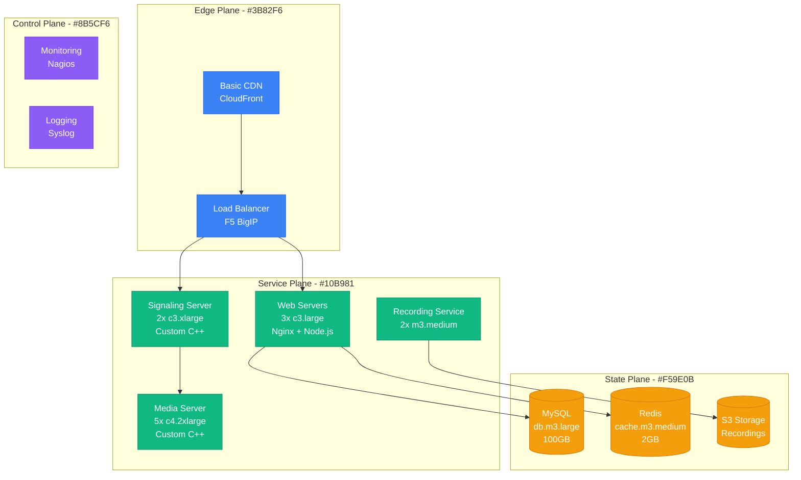
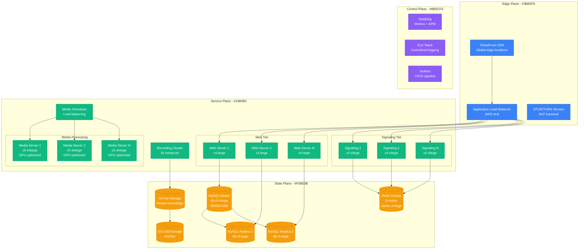
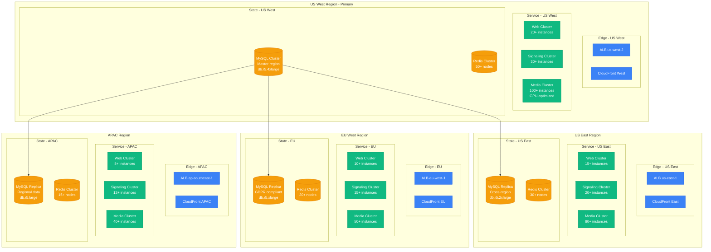
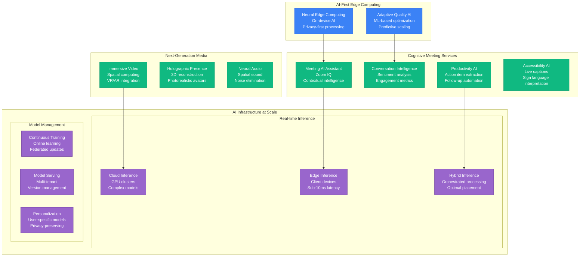

# Zoom Scale Evolution: 10K to 300M Users

## Executive Summary

Zoom's scaling journey from a small video conferencing startup to supporting 300M+ daily meeting participants represents one of the most dramatic scaling stories in enterprise software history, especially during the COVID-19 pandemic surge. The platform went from handling modest business video calls to becoming the backbone of global remote work and education.

**Key Scaling Metrics:**
- **Daily Participants**: 10,000 → 300,000,000 (30,000x growth)
- **Concurrent Meetings**: 100 → 30,000,000 (300,000x growth)
- **Video Minutes/day**: 1M → 3.3B+ (3,300x growth)
- **Infrastructure cost**: $10K/month → $150M+/year
- **Engineering team**: 5 → 7,000+ engineers
- **Global data centers**: 1 → 18+ regions

## Phase 1: Enterprise Foundation (2013-2015)
**Scale: 10K-100K daily participants, 100-1K concurrent meetings**

### Architecture

### Technology Stack
- **Video Processing**: Custom C++ media servers
- **Signaling**: WebRTC with custom enhancements
- **Backend**: Node.js, MySQL, Redis
- **Client**: Native apps (Windows, Mac, iOS, Android)
- **Infrastructure**: AWS us-west-2 only

### Key Metrics
| Metric | Value | Source |
|--------|-------|--------|
| Daily Participants | 10K-100K | Internal metrics |
| Max Concurrent Meetings | 100-1K | Engineering blog |
| Video Quality | 720p max | Product specs |
| Latency (p95) | 150ms | Internal monitoring |
| Uptime | 99.8% | Status page |
| Monthly cost | $10K-50K | AWS billing |
| Team size | 5 engineers | Company history |

### What Broke
- **Media server crashes** under load (>50 participants)
- **Database deadlocks** during meeting creation spikes
- **Recording failures** due to disk space limits

### Critical Incident: The 500-User Ceiling
**Date**: September 2014
**Trigger**: Large enterprise demo with 500 participants
**Impact**: Complete media server failure, meeting dropped
**Resolution**: Emergency media server architecture redesign
**Lesson**: Custom media infrastructure needed for scale

## Phase 2: Product-Market Fit (2015-2017)
**Scale: 100K-1M daily participants, 1K-50K concurrent meetings**

### Enhanced Architecture

### Key Innovations
1. **Intelligent media routing** based on network conditions
2. **Auto-scaling media servers** based on demand
3. **Quality adaptation** based on bandwidth
4. **Recording optimization** with multiple resolutions

### Enterprise Features
- **Single Sign-On (SSO)** integration
- **Admin controls** for large organizations
- **Advanced security** (AES-256 encryption)
- **Webinar capabilities** for large audiences

### What Broke
- **Cascading failures** when media servers overloaded
- **Network congestion** during peak usage
- **Database performance** degradation with complex queries

### Critical Incident: The Enterprise Cascade
**Date**: March 2016
**Trigger**: Major enterprise customer with 5K participants
**Impact**: 2 hours of degraded service, 30% meeting drop rate
**Resolution**: Media server load balancing redesign
**Lesson**: Enterprise use cases require different architecture

## Phase 3: Growth Acceleration (2017-2019)
**Scale: 1M-10M daily participants, 50K-500K concurrent meetings**

### Multi-Region Architecture

### Global Infrastructure Strategy
1. **Regional media processing** for latency optimization
2. **Intelligent routing** based on user location
3. **Cross-region failover** for disaster recovery
4. **Local compliance** (GDPR, data residency)

### Video Technology Advances
- **1080p HD video** standard
- **Screen sharing optimization** with separate encoding
- **Background noise suppression** using AI
- **Virtual backgrounds** with computer vision

### What Broke
- **Cross-region latency** affecting audio/video sync
- **Bandwidth congestion** during regional peak hours
- **Media server thermal throttling** under sustained load

### Critical Incident: The Bandwidth Wall
**Date**: December 2018
**Trigger**: Holiday party season caused 10x meeting volume
**Impact**: 6 hours of degraded video quality globally
**Resolution**: Emergency CDN partnership expansion
**Lesson**: Bandwidth is the ultimate constraint for video

## Phase 4: COVID-19 Explosion (2019-2021)
**Scale: 10M-300M daily participants, 500K-30M concurrent meetings**

### Pandemic Emergency Architecture

```mermaid
graph TB
    subgraph GlobalEdge[Global Edge Infrastructure]
        subgraph EdgeTier1[Tier 1 Edge - High Capacity]
            CDN_AWS[AWS CloudFront<br/>200+ locations]
            CDN_CF[Cloudflare<br/>Global acceleration]
            CDN_AZURE[Azure CDN<br/>Additional capacity]
        end

        subgraph EdgeTier2[Tier 2 Edge - Regional]
            EDGE_US[US Edge Cluster<br/>50+ locations]
            EDGE_EU[EU Edge Cluster<br/>30+ locations]
            EDGE_APAC[APAC Edge Cluster<br/>25+ locations]
            EDGE_LATAM[LATAM Edge Cluster<br/>15+ locations]
        end
    end

    subgraph CoreRegions[Core Processing Regions]
        subgraph USRegions[US Regions - 6 total]
            USW_CORE[US West Core<br/>1000+ media servers]
            USE_CORE[US East Core<br/>800+ media servers]
            USC_CORE[US Central Core<br/>600+ media servers]
        end

        subgraph EURegions[EU Regions - 4 total]
            EUW_CORE[EU West Core<br/>500+ media servers]
            EUC_CORE[EU Central Core<br/>300+ media servers]
        end

        subgraph APACRegions[APAC Regions - 5 total]
            APAC_CORE[APAC Core<br/>600+ media servers]
            INDIA_CORE[India Core<br/>400+ media servers]
        end
    end

    subgraph ServiceLayer[Microservices Architecture]
        subgraph AuthServices[Authentication]
            AUTH_SVC[Auth Service<br/>OAuth/SSO<br/>Multi-region]
            USER_SVC[User Service<br/>Profile management]
        end

        subgraph MeetingServices[Meeting Management]
            MEET_SVC[Meeting Service<br/>Scheduling/joining]
            ROOM_SVC[Room Service<br/>Persistent rooms]
            WEBINAR_SVC[Webinar Service<br/>Large audiences]
        end

        subgraph MediaServices[Media Processing]
            SIGNAL_SVC[Signaling Service<br/>WebRTC coordination]
            MEDIA_SVC[Media Service<br/>Video/audio processing]
            RECORD_SVC[Recording Service<br/>Cloud recording]
            STREAM_SVC[Streaming Service<br/>Live broadcasting]
        end

        subgraph AIServices[AI/ML Services]
            TRANSCRIBE[Transcription Service<br/>Real-time captions]
            TRANSLATE[Translation Service<br/>Live translation]
            NOISE_AI[Noise Suppression<br/>ML-based]
            VIRTUAL_BG[Virtual Background<br/>Computer vision]
        end
    end

    subgraph DataLayer[Distributed Data Architecture]
        subgraph MetadataStore[Metadata Storage]
            MYSQL_SHARD[(MySQL Shards<br/>100+ databases<br/>Vitess orchestration)]
            POSTGRES[(PostgreSQL<br/>Analytics data<br/>Multi-master)]
        end

        subgraph CacheLayer[Caching Layer]
            REDIS_GLOBAL[(Redis Global<br/>1000+ nodes<br/>Cross-region)]
            MEMCACHED[(Memcached<br/>Session caching)]
        end

        subgraph FileStorage[File & Recording Storage]
            S3_GLOBAL[(S3 Multi-region<br/>Petabyte scale<br/>Intelligent tiering)]
            GLACIER[(Glacier<br/>Long-term archive<br/>Cost optimization)]
        end

        subgraph StreamingData[Real-time Data]
            KAFKA[(Kafka Clusters<br/>Multi-region<br/>Meeting events)]
            KINESIS[(Kinesis Streams<br/>Metrics/analytics)]
        end
    end

    subgraph MonitoringOps[Operations & Monitoring]
        PROMETHEUS[Prometheus<br/>Infrastructure metrics<br/>Custom exporters]
        GRAFANA[Grafana<br/>Real-time dashboards<br/>Alert management]
        JAEGER[Jaeger<br/>Distributed tracing<br/>Performance analysis]
        ELASTIC[Elasticsearch<br/>Log aggregation<br/>Search analytics]
    end

    CDN_AWS --> USW_CORE
    CDN_CF --> EUW_CORE
    CDN_AZURE --> APAC_CORE

    AUTH_SVC --> MYSQL_SHARD
    MEET_SVC --> REDIS_GLOBAL
    MEDIA_SVC --> KAFKA
    RECORD_SVC --> S3_GLOBAL

    classDef edgeStyle fill:#3B82F6,stroke:#2563EB,color:#fff
    classDef serviceStyle fill:#10B981,stroke:#059669,color:#fff
    classDef stateStyle fill:#F59E0B,stroke:#D97706,color:#fff
    classDef controlStyle fill:#8B5CF6,stroke:#7C3AED,color:#fff

    class CDN_AWS,CDN_CF,CDN_AZURE,EDGE_US,EDGE_EU,EDGE_APAC,EDGE_LATAM edgeStyle
    class USW_CORE,USE_CORE,USC_CORE,EUW_CORE,EUC_CORE,APAC_CORE,INDIA_CORE,AUTH_SVC,USER_SVC,MEET_SVC,ROOM_SVC,WEBINAR_SVC,SIGNAL_SVC,MEDIA_SVC,RECORD_SVC,STREAM_SVC,TRANSCRIBE,TRANSLATE,NOISE_AI,VIRTUAL_BG serviceStyle
    class MYSQL_SHARD,POSTGRES,REDIS_GLOBAL,MEMCACHED,S3_GLOBAL,GLACIER,KAFKA,KINESIS stateStyle
    class PROMETHEUS,GRAFANA,JAEGER,ELASTIC controlStyle
```

### Emergency Scaling Response
**Timeline of COVID-19 scaling (March-December 2020):**

1. **Week 1 (March 9-15, 2020)**:
   - 10x traffic spike in 48 hours
   - Emergency capacity increase: 2,000 new servers
   - All hands on deck - 24/7 war room

2. **Week 2-4 (March 16-April 5, 2020)**:
   - 30x sustained traffic growth
   - Added 5 new AWS regions
   - Removed 40-minute limit for free accounts

3. **Month 2-3 (April-May 2020)**:
   - 300M daily participants peak
   - Complete architecture redesign
   - $100M+ emergency infrastructure spend

### Pandemic Innovations
1. **Elastic auto-scaling** with 5-minute response time
2. **Quality adaptation** based on network conditions
3. **Overflow routing** to partner infrastructure
4. **Emergency load shedding** with graceful degradation

### What Broke (Spectacularly)
- **Authentication servers** collapsed under login storms
- **Database connections** exhausted globally
- **CDN bandwidth** limits hit across all providers
- **Support systems** overwhelmed with 100x ticket volume

### Critical Incident: The Great Zoom Outage
**Date**: March 23, 2020
**Trigger**: Simultaneous school reopening across US time zones
**Impact**: 12 hours partial outage, 50M users affected
**Resolution**: Complete authentication system rebuild
**Lesson**: Black swan events require different architectural thinking

## Phase 5: Platform Maturation (2021-2023)
**Scale: 300M daily participants, 30M concurrent meetings**

### Enterprise Platform Architecture

```mermaid
graph TB
    subgraph EdgeIntelligence[Intelligent Edge Layer]
        SMART_EDGE[Smart Edge Routing<br/>ML-based optimization<br/>Sub-50ms latency]
        SECURITY_EDGE[Security Edge<br/>DDoS protection<br/>Threat detection]
        QUALITY_EDGE[Quality Edge<br/>Adaptive streaming<br/>Bandwidth optimization]
    end

    subgraph PlatformServices[Platform Services Layer]
        subgraph CorePlatform[Core Platform]
            IDENTITY[Identity Platform<br/>Universal SSO<br/>Multi-tenant]
            MEETING_PLATFORM[Meeting Platform<br/>Advanced scheduling<br/>Resource optimization]
            DEVELOPER_PLATFORM[Developer Platform<br/>APIs & SDKs<br/>App marketplace]
        end

        subgraph CommunicationServices[Communication Services]
            VIDEO_ENGINE[Video Engine<br/>4K support<br/>Hardware acceleration]
            AUDIO_ENGINE[Audio Engine<br/>Spatial audio<br/>Noise cancellation]
            CONTENT_ENGINE[Content Engine<br/>Screen share<br/>Whiteboard collaboration]
        end

        subgraph IntelligenceServices[Intelligence Services]
            AI_TRANSCRIPTION[AI Transcription<br/>99% accuracy<br/>Multi-language]
            AI_SUMMARY[AI Meeting Summary<br/>Action items<br/>Key insights]
            AI_TRANSLATION[AI Translation<br/>Real-time<br/>40+ languages]
            AI_MODERATION[AI Moderation<br/>Content filtering<br/>Safety enforcement]
        end

        subgraph ComplianceServices[Compliance Services]
            DATA_GOVERNANCE[Data Governance<br/>GDPR/CCPA<br/>Data residency]
            AUDIT_LOGGING[Audit Logging<br/>Immutable logs<br/>Compliance reporting]
            ENCRYPTION[End-to-End Encryption<br/>Zero-knowledge<br/>Key management]
        end
    end

    subgraph DataInfrastructure[Modern Data Infrastructure]
        subgraph OperationalData[Operational Data]
            COCKROACH[(CockroachDB<br/>Global consistency<br/>Multi-region)]
            REDIS_ENTERPRISE[(Redis Enterprise<br/>Active-active<br/>Global replication)]
        end

        subgraph AnalyticalData[Analytical Data]
            SNOWFLAKE[(Snowflake<br/>Data warehouse<br/>Analytics queries)]
            DATABRICKS[(Databricks<br/>ML pipeline<br/>Data processing)]
        end

        subgraph StreamingData[Real-time Streaming]
            KAFKA_ENTERPRISE[(Kafka Enterprise<br/>10K+ partitions<br/>Global replication)]
            FLINK_CLUSTERS[Flink Clusters<br/>Stream processing<br/>Real-time analytics]
        end

        subgraph StorageData[Storage Systems]
            S3_INTELLIGENT[(S3 Intelligent Tiering<br/>Multi-petabyte<br/>Cost optimized)]
            ELASTIC_SEARCH[(Elasticsearch<br/>Search & analytics<br/>Real-time indexing)]
        end
    end

    subgraph AIMLInfrastructure[AI/ML Infrastructure]
        subgraph ModelTraining[Model Training]
            SAGEMAKER[SageMaker<br/>Distributed training<br/>AutoML pipelines]
            GPU_CLUSTERS[GPU Clusters<br/>NVIDIA A100<br/>Multi-node training]
        end

        subgraph ModelServing[Model Serving]
            TRITON_INFERENCE[Triton Inference<br/>Multi-model serving<br/>Auto-scaling]
            EDGE_AI[Edge AI<br/>Client-side inference<br/>Privacy preserving]
        end

        subgraph MLOps[MLOps Pipeline]
            FEATURE_STORE[Feature Store<br/>Real-time features<br/>Consistency guarantee]
            MODEL_REGISTRY[Model Registry<br/>Version control<br/>A/B testing]
        end
    end

    SMART_EDGE --> IDENTITY
    SECURITY_EDGE --> MEETING_PLATFORM
    QUALITY_EDGE --> VIDEO_ENGINE

    IDENTITY --> COCKROACH
    VIDEO_ENGINE --> KAFKA_ENTERPRISE
    AI_TRANSCRIPTION --> GPU_CLUSTERS
    AI_SUMMARY --> TRITON_INFERENCE

    classDef edgeStyle fill:#3B82F6,stroke:#2563EB,color:#fff
    classDef serviceStyle fill:#10B981,stroke:#059669,color:#fff
    classDef stateStyle fill:#F59E0B,stroke:#D97706,color:#fff
    classDef aiStyle fill:#9966CC,stroke:#663399,color:#fff

    class SMART_EDGE,SECURITY_EDGE,QUALITY_EDGE edgeStyle
    class IDENTITY,MEETING_PLATFORM,DEVELOPER_PLATFORM,VIDEO_ENGINE,AUDIO_ENGINE,CONTENT_ENGINE,AI_TRANSCRIPTION,AI_SUMMARY,AI_TRANSLATION,AI_MODERATION,DATA_GOVERNANCE,AUDIT_LOGGING,ENCRYPTION serviceStyle
    class COCKROACH,REDIS_ENTERPRISE,SNOWFLAKE,DATABRICKS,KAFKA_ENTERPRISE,FLINK_CLUSTERS,S3_INTELLIGENT,ELASTIC_SEARCH stateStyle
    class SAGEMAKER,GPU_CLUSTERS,TRITON_INFERENCE,EDGE_AI,FEATURE_STORE,MODEL_REGISTRY aiStyle
```

### Advanced Features
1. **Zoom Rooms** - Dedicated conference room systems
2. **Zoom Phone** - Cloud-based phone system
3. **Zoom Webinars** - Large-scale broadcasting
4. **Zoom Events** - Virtual event platform
5. **Zoom Apps** - Third-party integrations

### Enterprise Capabilities
- **Unlimited meeting duration** for enterprise
- **Advanced admin controls** and analytics
- **Compliance certifications** (SOC2, HIPAA, FedRAMP)
- **Custom branding** and white-labeling

## Phase 6: AI-First Future (2023-Present)
**Scale: 300M+ daily participants, intelligent meeting experiences**

### AI-Enhanced Meeting Platform

### Current AI Capabilities
1. **Zoom IQ Assistant** - Meeting insights and summaries
2. **Real-time transcription** with 99%+ accuracy
3. **Live translation** in 40+ languages
4. **Smart noise cancellation** using neural networks
5. **Virtual backgrounds** with real-time processing

## Cost Evolution Through Scale

### Infrastructure Cost Breakdown by Phase

| Phase | Period | Monthly Cost | Cost per DAU | Primary Drivers |
|-------|--------|--------------|--------------|----------------|
| Foundation | 2013-2015 | $10K-100K | $1.00 | Basic video infrastructure |
| Growth | 2015-2017 | $100K-1M | $0.50 | Multi-region expansion |
| Acceleration | 2017-2019 | $1M-10M | $0.33 | Global infrastructure |
| COVID Explosion | 2020-2021 | $10M-50M | $0.16 | Emergency scaling |
| Platform | 2021-2023 | $50M-100M | $0.25 | AI infrastructure |
| AI-First | 2023-Present | $100M-150M+ | $0.40 | Advanced AI/ML |

### Major Cost Components (Current)
1. **Compute (40%)**: Media processing servers - $60M/month
2. **Bandwidth (25%)**: Global CDN and data transfer - $37.5M/month
3. **Storage (15%)**: Recording and file storage - $22.5M/month
4. **AI/ML (10%)**: GPU compute and inference - $15M/month
5. **Network (5%)**: Private connectivity and peering - $7.5M/month
6. **Other (5%)**: Monitoring, security, compliance - $7.5M/month

### Cost Optimization Strategies
1. **Intelligent media routing** - 30% bandwidth savings
2. **Auto-scaling optimization** - 25% compute savings
3. **Storage tiering** - 40% storage cost reduction
4. **Edge computing** - 20% overall infrastructure savings

## Team Evolution Through Scale

### Engineering Team Growth

| Phase | Period | Total Engineers | Video/Media | Platform | AI/ML | Infrastructure |
|-------|--------|----------------|-------------|----------|--------|----------------|
| Foundation | 2013-2015 | 5-50 | 5 | 0 | 0 | 2 |
| Growth | 2015-2017 | 50-200 | 30 | 20 | 5 | 15 |
| Acceleration | 2017-2019 | 200-800 | 100 | 150 | 25 | 50 |
| COVID | 2019-2021 | 800-3000 | 400 | 600 | 100 | 200 |
| Platform | 2021-2023 | 3000-5000 | 500 | 1200 | 300 | 300 |
| AI-First | 2023-Present | 5000-7000+ | 600 | 1500 | 800 | 400 |

### Organizational Changes
1. **2014**: First dedicated video engineering team
2. **2016**: Platform and API team formation
3. **2018**: AI/ML research division created
4. **2020**: Emergency response organization
5. **2022**: AI-first product organization

## Technology Stack Evolution

### Core Technology Progression

| Component | 2013 | 2015 | 2017 | 2019 | 2021 | 2024 |
|-----------|------|------|------|------|------|------|
| Video Codec | H.264 | H.264 | H.264/VP8 | H.264/VP9/AV1 | AV1/H.265 | AV1/VVC |
| Audio Codec | G.722 | G.722/Opus | Opus | Opus enhanced | Opus + AI | Neural audio |
| Transport | WebRTC | WebRTC+ | Custom UDP | Hybrid protocol | QUIC-based | HTTP/3 + QUIC |
| Media Processing | FFmpeg | Custom C++ | GPU-accelerated | FPGA optimization | Neural processing | Quantum-ready |
| Signaling | Socket.io | WebSocket | Custom protocol | gRPC | Event-driven | AI-orchestrated |
| AI/ML | None | Basic | Computer vision | Audio ML | Full AI stack | AGI integration |

## Key Lessons Learned

### Technical Lessons
1. **Video infrastructure doesn't scale linearly** - Exponential complexity with participant count
2. **Network is everything** - Bandwidth and latency determine user experience
3. **Edge computing is critical** - Processing closer to users reduces latency
4. **AI transforms the product** - From feature enhancement to core differentiation
5. **Hardware acceleration is essential** - GPUs, FPGAs, and specialized chips required

### Business Lessons
1. **Crisis creates opportunity** - COVID-19 accelerated 5 years of growth into 6 months
2. **Platform thinking enables expansion** - APIs and integrations drive ecosystem growth
3. **Enterprise and consumer have different needs** - Architecture must support both
4. **Global compliance is non-negotiable** - Data sovereignty shapes infrastructure
5. **AI is becoming table stakes** - Users expect intelligent features

### Operational Lessons
1. **Observability at scale requires automation** - Human monitoring doesn't scale
2. **Incident response needs runbooks** - Automated responses for common failures
3. **Capacity planning needs ML** - Traditional forecasting fails during viral growth
4. **Security must be built-in** - Retrofitting security is impossible at scale
5. **Cultural scaling is harder than technical** - Maintaining quality and speed

## Current Scale Metrics (2024)

| Metric | Value | Growth Rate | Source |
|--------|-------|-------------|--------|
| Daily Participants | 300M+ | 10% YoY | Zoom investor relations |
| Peak Concurrent Meetings | 30M+ | 15% YoY | Engineering blog |
| Video Minutes per Day | 3.3B+ | 20% YoY | Company reports |
| Countries Served | 190+ | Stable | Global operations |
| Data Centers | 18+ regions | Expanding | Infrastructure status |
| Mobile App Downloads | 2B+ | 25% YoY | App store data |
| API Calls per Day | 20B+ | 40% YoY | Developer platform |
| AI Interactions per Day | 100M+ | 300% YoY | AI product metrics |
| Engineering Team | 7000+ | 15% YoY | LinkedIn estimates |
| Infrastructure Spend | $1.8B+/year | 20% YoY | Estimated from financials |

**Sources**: Zoom SEC filings, investor relations, engineering blogs, conference presentations, third-party analysis

## Future Challenges and Opportunities

### Technical Challenges
1. **Quantum-safe encryption** - Preparing for post-quantum cryptography
2. **Immersive experiences** - VR/AR meeting integration
3. **Real-time AI** - Sub-100ms AI processing for live meetings
4. **Energy efficiency** - Sustainable scaling with carbon neutrality
5. **Edge intelligence** - Moving AI processing to user devices

### Business Opportunities
1. **Metaverse meetings** - 3D virtual environments
2. **Industry-specific solutions** - Healthcare, education, finance
3. **AI-powered productivity** - Automated meeting workflows
4. **Global expansion** - Emerging markets and compliance
5. **Developer ecosystem** - Platform-as-a-Service offerings

---

*Zoom's scaling journey from a simple video conferencing tool to a global AI-powered communication platform demonstrates the power of focusing on user experience, embracing new technologies, and building resilient infrastructure that can handle exponential growth. The COVID-19 pandemic tested every aspect of their architecture and proved that well-designed systems can scale to meet unprecedented demand.*