# Airbnb - Complete Architecture

## Global Marketplace Platform: 7M+ Listings, 1B+ Guest Arrivals

Airbnb operates the world's largest online marketplace for accommodations, connecting travelers with unique stays across 220+ countries and regions with $10B+ annual revenue.

```mermaid
graph TB
    subgraph EdgePlane[Edge Plane - Global Content Delivery]
        CloudFlare[CloudFlare CDN<br/>200+ PoPs worldwide<br/>Image optimization<br/>DDoS protection<br/>WAF rules: 1000+]

        AWS_CloudFront[AWS CloudFront<br/>Static asset delivery<br/>API acceleration<br/>Global edge locations<br/>SSL termination]

        Fastly[Fastly CDN<br/>Dynamic content<br/>Edge computing<br/>Real-time purging<br/>API caching]
    end

    subgraph ServicePlane[Service Plane - SOA Architecture]
        APIGateway[API Gateway<br/>Kong Enterprise<br/>Rate limiting: 1K req/min<br/>Authentication<br/>Request routing]

        subgraph CoreServices[Core Marketplace Services]
            SearchSvc[Search Service<br/>Elasticsearch 7.x<br/>100M+ searches/day<br/>ML-powered ranking<br/>p99: 300ms]

            BookingSvc[Booking Service<br/>Java 17, Spring Boot<br/>Complex state machine<br/>12-step booking flow<br/>p99: 500ms]

            PaymentSvc[Payment Service<br/>Scala, Akka<br/>Multi-currency support<br/>$50B+ annual GMV<br/>PCI DSS compliant]

            MessageSvc[Messaging Service<br/>Go, gRPC<br/>Host-guest communication<br/>Real-time notifications<br/>100M+ messages/day]
        end

        subgraph HostServices[Host & Listing Services]
            ListingSvc[Listing Service<br/>Python, Django<br/>7M+ active listings<br/>Multi-media management<br/>Real-time availability]

            PricingSvc[Pricing Service<br/>ML-driven dynamic pricing<br/>Revenue optimization<br/>Market analysis<br/>Smart Pricing algorithm]

            CalendarSvc[Calendar Service<br/>Availability management<br/>Booking conflicts<br/>Seasonal pricing<br/>Instant Book logic]

            ReviewSvc[Review Service<br/>Trust & safety<br/>Reputation system<br/>ML fraud detection<br/>Community standards]
        end

        subgraph GuestServices[Guest Experience Services]
            UserSvc[User Service<br/>Identity management<br/>Profile & preferences<br/>Authentication<br/>200M+ users]

            RecommendationSvc[Recommendation Engine<br/>TensorFlow, Python<br/>Personalized suggestions<br/>ML ranking models<br/>Real-time updates]

            TripSvc[Trip Service<br/>Itinerary management<br/>Travel coordination<br/>Experience booking<br/>Mobile-first design]
        end
    end

    subgraph StatePlane[State Plane - Data Storage]
        subgraph PrimaryDatabases[Primary Databases]
            MySQL_Primary[(MySQL Primary<br/>Core business data<br/>Listings, users, bookings<br/>100TB+ storage<br/>ACID compliance)]

            MySQL_Replicas[(MySQL Read Replicas<br/>5x read replicas<br/>Geographic distribution<br/>Read scaling<br/>Analytics queries)]
        end

        subgraph SpecializedStorage[Specialized Storage]
            HBase[(HBase Cluster<br/>Time-series data<br/>User events, metrics<br/>100B+ records<br/>Real-time analytics)]

            Elasticsearch[(Elasticsearch<br/>Search index<br/>Listing search<br/>7M+ documents<br/>Faceted search)]

            Redis[(Redis Cluster<br/>Session management<br/>Cache layer<br/>100M+ sessions<br/>Sub-ms latency)]
        end

        subgraph ContentStorage[Content & Media]
            S3_Images[S3 - Images<br/>10B+ photos<br/>Multiple resolutions<br/>CDN integration<br/>ML image analysis]

            S3_Documents[S3 - Documents<br/>Legal documents<br/>ID verification<br/>Contract storage<br/>Compliance data]

            CloudinaryManagement[Cloudinary<br/>Image optimization<br/>Dynamic resizing<br/>Format conversion<br/>Mobile optimization]
        end

        subgraph AnalyticsPlatform[Analytics Platform]
            Druid[(Apache Druid<br/>Real-time analytics<br/>Business metrics<br/>Host earnings<br/>Market insights)]

            Hadoop_HDFS[Hadoop HDFS<br/>Data lake storage<br/>Historical data<br/>ML training sets<br/>100PB+ capacity]

            Kafka[Apache Kafka<br/>Event streaming<br/>500M+ events/day<br/>Real-time pipelines<br/>Change data capture]
        end
    end

    subgraph ControlPlane[Control Plane - Operations]
        DataDog[DataDog<br/>Infrastructure monitoring<br/>Application performance<br/>100K+ metrics<br/>Custom dashboards]

        Spinnaker[Spinnaker<br/>Continuous delivery<br/>Multi-cloud deployment<br/>Canary releases<br/>Blue-green deployment]

        Sentry[Sentry<br/>Error tracking<br/>Performance monitoring<br/>Release health<br/>1M+ errors/day]

        Airflow[Apache Airflow<br/>Workflow orchestration<br/>ETL pipelines<br/>ML training jobs<br/>10K+ daily tasks]
    end

    %% User Flow
    Users[200M+ Users<br/>Global travelers<br/>Mobile: 60%<br/>Web: 40%] --> CloudFlare
    CloudFlare --> AWS_CloudFront
    AWS_CloudFront --> Fastly
    Fastly --> APIGateway

    %% Service Connections
    APIGateway --> SearchSvc
    APIGateway --> BookingSvc
    APIGateway --> PaymentSvc
    APIGateway --> MessageSvc

    SearchSvc --> ListingSvc
    BookingSvc --> PricingSvc
    BookingSvc --> CalendarSvc
    MessageSvc --> ReviewSvc

    UserSvc --> RecommendationSvc
    SearchSvc --> RecommendationSvc
    BookingSvc --> TripSvc

    %% Data Connections
    BookingSvc --> MySQL_Primary
    ListingSvc --> MySQL_Replicas
    UserSvc --> Redis
    SearchSvc --> Elasticsearch

    RecommendationSvc --> HBase
    PricingSvc --> Druid
    MessageSvc --> Kafka

    %% Content Management
    ListingSvc --> S3_Images
    UserSvc --> S3_Documents
    S3_Images --> CloudinaryManagement

    %% Analytics Pipeline
    BookingSvc --> Kafka
    SearchSvc --> Kafka
    Kafka --> Druid
    Kafka --> Hadoop_HDFS

    %% Operations
    APIGateway --> DataDog
    BookingSvc --> Spinnaker
    SearchSvc --> Sentry
    Kafka --> Airflow

    %% Apply four-plane colors
    classDef edgeStyle fill:#3B82F6,stroke:#2563EB,color:#fff
    classDef serviceStyle fill:#10B981,stroke:#059669,color:#fff
    classDef stateStyle fill:#F59E0B,stroke:#D97706,color:#fff
    classDef controlStyle fill:#8B5CF6,stroke:#7C3AED,color:#fff

    class CloudFlare,AWS_CloudFront,Fastly edgeStyle
    class APIGateway,SearchSvc,BookingSvc,PaymentSvc,MessageSvc,ListingSvc,PricingSvc,CalendarSvc,ReviewSvc,UserSvc,RecommendationSvc,TripSvc serviceStyle
    class MySQL_Primary,MySQL_Replicas,HBase,Elasticsearch,Redis,S3_Images,S3_Documents,CloudinaryManagement,Druid,Hadoop_HDFS,Kafka stateStyle
    class DataDog,Spinnaker,Sentry,Airflow controlStyle
```

## Key Architecture Metrics

### Scale & Performance
- **200M+ Registered Users** across 220+ countries
- **7M+ Active Listings** in unique destinations
- **1B+ Guest Arrivals** since founding (cumulative)
- **$50B+ Annual GMV** (Gross Merchandise Value)
- **p99 Search Response**: <300ms globally
- **Peak Booking Rate**: 3 bookings/second during travel seasons

### Infrastructure Specifications

#### Service-Oriented Architecture
- **150+ Microservices** (Java, Python, Scala, Go, Ruby)
- **3000+ Service Instances** across multiple regions
- **Container Orchestration**: Kubernetes on AWS
- **Service Mesh**: Envoy proxy with custom control plane
- **API Gateway**: Kong with custom plugins for marketplace logic

#### Storage Systems
- **MySQL**: 100TB+ transactional data, master-slave replication
- **HBase**: 100B+ records, real-time analytics and metrics
- **Elasticsearch**: 7M+ listings indexed, complex search queries
- **Redis**: 100M+ user sessions, sub-millisecond response times
- **S3**: 10B+ photos, multiple image resolutions and formats

#### Content Delivery & Media
- **CloudFlare CDN**: Global image delivery and optimization
- **Cloudinary**: Dynamic image processing and optimization
- **Multi-format Support**: WebP, AVIF for modern browsers
- **Image Analysis**: ML-powered quality scoring and categorization

### Financial Metrics
- **Annual Revenue**: $10B+ (2023)
- **Infrastructure Costs**: ~$400M annually
- **AWS Spend**: 70% of infrastructure costs ($280M)
- **Content Delivery**: 25% of infrastructure budget
- **Cost per Booking**: ~$1.20 infrastructure cost

## Critical Production Requirements

### High Availability & Reliability
- **99.9% Uptime SLA** for core booking functionality
- **Multi-AZ Deployment** across 3+ availability zones
- **Cross-Region Failover** for disaster recovery
- **Circuit Breakers** on all external service dependencies

### Marketplace Integrity
- **Real-time Fraud Detection** using ML models
- **Trust & Safety Systems** for user verification
- **Dynamic Pricing Models** for revenue optimization
- **Instant Book Automation** for qualified listings

### Regulatory Compliance
- **GDPR Compliance** for European users and hosts
- **PCI DSS Level 1** certification for payment processing
- **Local Tax Compliance** in 100+ jurisdictions
- **Data Residency** requirements in regulated markets

### Mobile-First Experience
- **60% Mobile Traffic** from iOS and Android apps
- **Progressive Web App** for emerging markets
- **Offline Capabilities** for trip management
- **Push Notifications** for booking updates and messaging

## Marketplace Complexity Factors

### Multi-sided Platform Challenges
- **Dual Customer Base**: Optimizing for both guests and hosts
- **Supply-Demand Balancing**: Dynamic pricing and availability
- **Quality Control**: Maintaining listing standards and reviews
- **Global Localization**: 62 languages and local regulations

### Search & Discovery Innovation
- **ML-Powered Ranking**: Personalized search results
- **Image Recognition**: Visual search capabilities
- **Natural Language Processing**: Query understanding
- **Real-time Inventory**: Live availability and pricing

### Trust & Safety at Scale
- **Identity Verification**: Government ID and selfie matching
- **Background Checks**: Criminal and sex offender registries
- **ML Fraud Detection**: Suspicious activity patterns
- **Community Standards**: Automated content moderation

This architecture enables Airbnb to operate as the world's largest accommodation marketplace, processing millions of searches daily while maintaining trust and safety for both guests and hosts across 220+ countries.