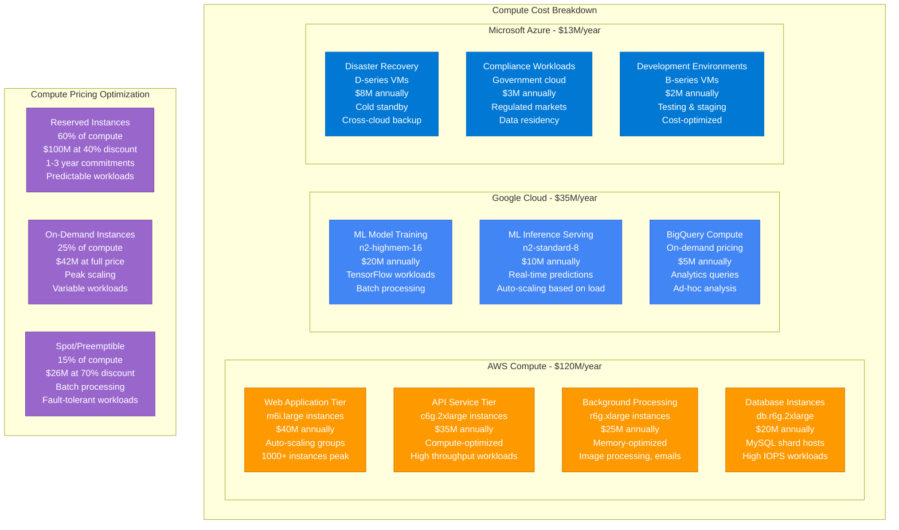
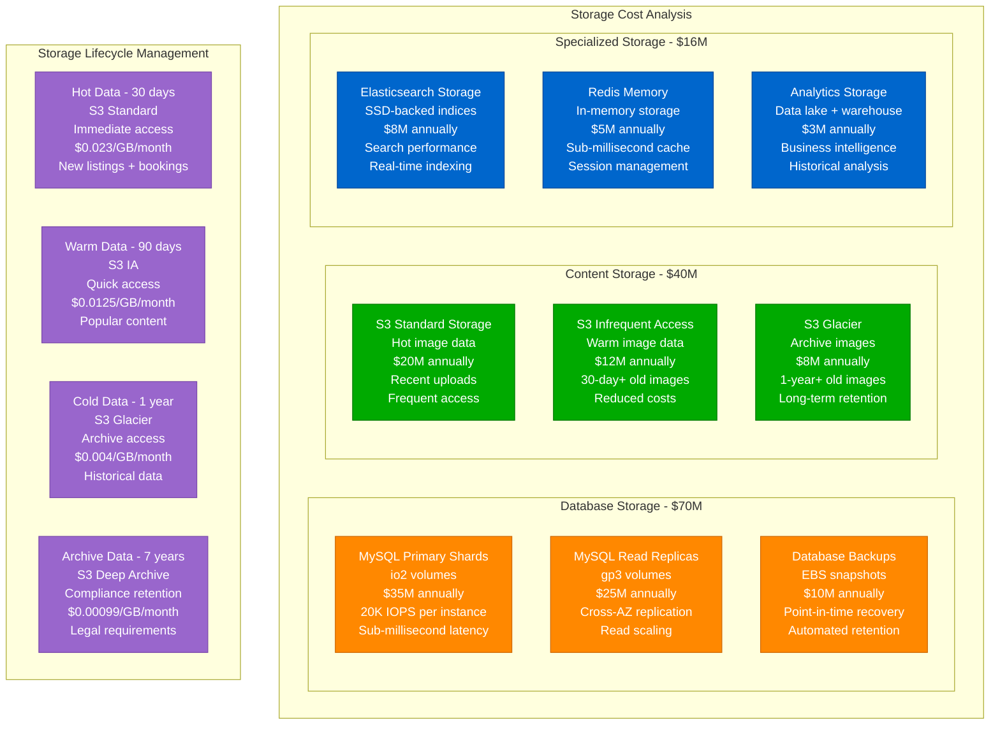
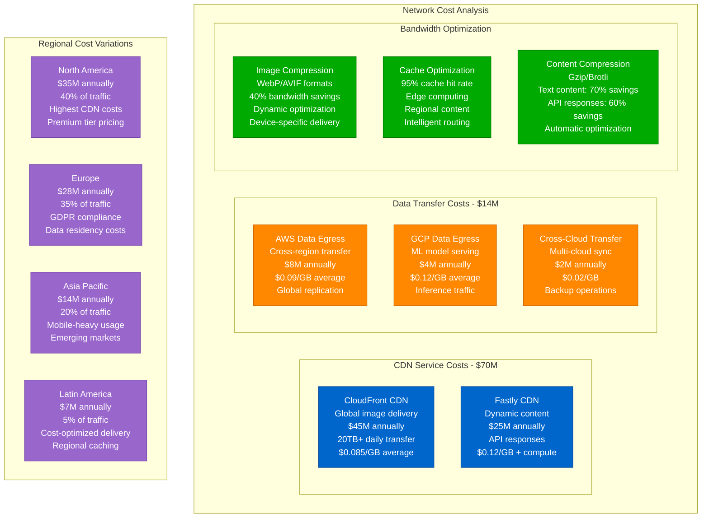
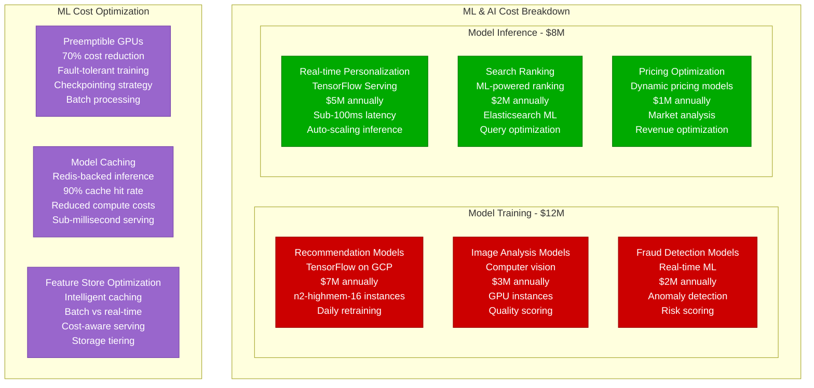

# Airbnb - Cost Breakdown Analysis

## Infrastructure Economics: $420M+ Annual Spend Supporting Global Marketplace

Airbnb's infrastructure costs represent one of the largest marketplace technology investments, with detailed optimization across compute, storage, networking, and specialized services.

```mermaid
graph TB
    subgraph TotalCosts[Annual Infrastructure Costs - $420M+]
        subgraph ComputeCosts[Compute Infrastructure - $168M (40%)]
            AWSCompute[AWS Compute<br/>EC2 + EKS clusters<br/>$120M annually<br/>m6i.large → c6g.8xlarge<br/>70% of compute workload]

            GCPCompute[GCP Compute<br/>ML/AI workloads<br/>$35M annually<br/>n2-standard-8 instances<br/>20% of compute workload]

            AzureCompute[Azure Compute<br/>Backup & DR<br/>$13M annually<br/>D-series VMs<br/>10% of compute workload]
        end

        subgraph StorageCosts[Storage Systems - $126M (30%)]
            DatabaseStorage[Database Storage<br/>MySQL shards + replicas<br/>$70M annually<br/>io2 + gp3 volumes<br/>1000+ database instances]

            ImageStorage[Image Storage<br/>S3 + CloudFront<br/>$40M annually<br/>10B+ photos<br/>Multi-resolution pipeline]

            ArchiveStorage[Archive & Backup<br/>Cross-region replication<br/>$16M annually<br/>Glacier + compliance<br/>7-year retention]
        end

        subgraph NetworkCosts[Network & CDN - $84M (20%)]
            CloudFrontCDN[CloudFront CDN<br/>Global image delivery<br/>$45M annually<br/>200+ edge locations<br/>20TB+ daily transfer]

            FastlyCDN[Fastly CDN<br/>Dynamic content<br/>$25M annually<br/>API acceleration<br/>Real-time purging]

            DataTransfer[Data Transfer<br/>Cross-region traffic<br/>$14M annually<br/>Multi-cloud egress<br/>International users]
        end

        subgraph SpecializedServices[Specialized Services - $42M (10%)]
            MLServices[ML/AI Services<br/>TensorFlow serving<br/>$20M annually<br/>Model training + inference<br/>Computer vision pipeline]

            SecurityCompliance[Security & Compliance<br/>Identity, encryption<br/>$12M annually<br/>SOC2, GDPR tools<br/>Fraud detection systems]

            MonitoringTools[Monitoring & Tools<br/>DataDog, Splunk<br/>$10M annually<br/>Observability stack<br/>Developer productivity]
        end
    end

    %% Cost Per Metric Analysis
    subgraph CostPerMetrics[Cost Per Business Metric]
        UserMetrics[Cost per User<br/>$2.10 annually<br/>200M registered users<br/>$0.175 monthly average]

        BookingMetrics[Cost per Booking<br/>$1.20 per booking<br/>350M annual bookings<br/>Decreasing with scale]

        ListingMetrics[Cost per Listing<br/>$60 annually<br/>7M active listings<br/>Host value proposition]

        GVMMetrics[Infrastructure as % of GMV<br/>0.84% of $50B GMV<br/>Efficient marketplace<br/>Strong unit economics]
    end

    %% Apply cost category colors
    classDef computeStyle fill:#00AA00,stroke:#007700,color:#fff
    classDef storageStyle fill:#FF8800,stroke:#CC6600,color:#fff
    classDef networkStyle fill:#0066CC,stroke:#004499,color:#fff
    classDef specializedStyle fill:#CC0000,stroke:#990000,color:#fff

    class AWSCompute,GCPCompute,AzureCompute computeStyle
    class DatabaseStorage,ImageStorage,ArchiveStorage storageStyle
    class CloudFrontCDN,FastlyCDN,DataTransfer networkStyle
    class MLServices,SecurityCompliance,MonitoringTools specializedStyle
```

## Detailed Cost Analysis by Component

### Compute Infrastructure - $168M (40% of total)



**Compute Optimization Strategies:**
- **Auto-scaling**: Dynamic capacity based on booking patterns
- **Right-sizing**: Quarterly instance optimization reviews
- **Reserved Capacity**: 60% reserved instances for predictable workloads
- **Spot Instances**: 15% of workload on interruptible instances

### Storage Infrastructure - $126M (30% of total)



### Network & CDN Infrastructure - $84M (20% of total)



**Network Cost Optimization:**
- **Multi-CDN Strategy**: Primary/secondary CDN for cost optimization
- **Edge Computing**: Process images at edge to reduce origin traffic
- **Regional Caching**: Smart content placement reduces egress costs
- **Compression**: Multiple algorithms save 40-70% bandwidth

### Machine Learning & AI Services - $20M



## Unit Economics Analysis

### Cost Per Business Metric

```mermaid
graph TB
    subgraph UnitEconomics[Unit Economics Breakdown]
        subgraph UserCosts[Cost per User - $2.10/year]
            RegisteredUsers[200M Registered Users<br/>Infrastructure: $420M<br/>Cost per user: $2.10<br/>Monthly: $0.175]

            ActiveUsers[100M Monthly Active<br/>Higher infrastructure usage<br/>Cost per MAU: $4.20<br/>Monthly: $0.35]

            PowerUsers[20M Frequent Users<br/>Heaviest infrastructure load<br/>Cost per power user: $21<br/>Monthly: $1.75]
        end

        subgraph TransactionCosts[Cost per Transaction]
            BookingCost[Cost per Booking<br/>$1.20 infrastructure<br/>350M annual bookings<br/>Decreasing with scale]

            SearchCost[Cost per Search<br/>$0.004 infrastructure<br/>100M daily searches<br/>ML optimization focus]

            MessageCost[Cost per Message<br/>$0.001 infrastructure<br/>1B+ annual messages<br/>Real-time delivery]
        end

        subgraph RevenueRatio[Infrastructure vs Revenue]
            GMVRatio[Infrastructure as % of GMV<br/>0.84% of $50B GMV<br/>Highly efficient marketplace<br/>Strong unit economics]

            RevenueRatio[Infrastructure as % of Revenue<br/>4.2% of $10B revenue<br/>Sustainable cost structure<br/>Scalable platform]

            MarginImpact[Impact on Gross Margin<br/>Infrastructure: 4.2%<br/>Payment processing: 3.1%<br/>Other costs: 2.7%<br/>Gross margin: 90%]
        end
    end

    classDef userStyle fill:#0066CC,stroke:#004499,color:#fff
    classDef transactionStyle fill:#00AA00,stroke:#007700,color:#fff
    classDef revenueStyle fill:#FF8800,stroke:#CC6600,color:#fff

    class RegisteredUsers,ActiveUsers,PowerUsers userStyle
    class BookingCost,SearchCost,MessageCost transactionStyle
    class GMVRatio,RevenueRatio,MarginImpact revenueStyle
```

## Cost Optimization Strategies

### Annual Savings Initiatives
- **Reserved Instance Strategy**: $67M annual savings (40% discount)
- **Storage Lifecycle Management**: $25M annual savings (30% storage reduction)
- **CDN Optimization**: $15M annual savings (cache hit rate improvements)
- **Right-sizing Programs**: $12M annual savings (quarterly optimization)
- **Spot Instance Usage**: $8M annual savings (15% of compute workload)

### Future Cost Projections (2025-2027)
- **Edge Computing Expansion**: +$20M investment in edge infrastructure
- **AI/ML Platform Growth**: +$15M for advanced personalization
- **Multi-Cloud Strategy**: +$10M for vendor independence
- **Sustainability Initiatives**: +$8M for carbon-neutral infrastructure
- **Emerging Markets**: +$5M for localized infrastructure

## Regional Cost Variations

### Infrastructure Cost by Region
- **North America**: $168M (40%) - Mature market, high infrastructure costs
- **Europe**: $126M (30%) - GDPR compliance, data residency requirements
- **Asia-Pacific**: $84M (20%) - Growing market, mobile-first optimization
- **Latin America**: $21M (5%) - Emerging markets, cost-optimized infrastructure
- **Rest of World**: $21M (5%) - Early markets, basic infrastructure

### Cost Per User by Region
- **US/Canada**: $3.20 per user (high infrastructure quality)
- **Western Europe**: $2.80 per user (compliance overhead)
- **Eastern Europe**: $1.90 per user (cost-optimized delivery)
- **Asia-Pacific**: $1.40 per user (mobile-optimized infrastructure)
- **Latin America**: $0.90 per user (emerging market efficiency)

This comprehensive cost analysis demonstrates how Airbnb maintains efficient unit economics while scaling to serve 200M+ users globally, with infrastructure costs representing just 0.84% of GMV and 4.2% of revenue.