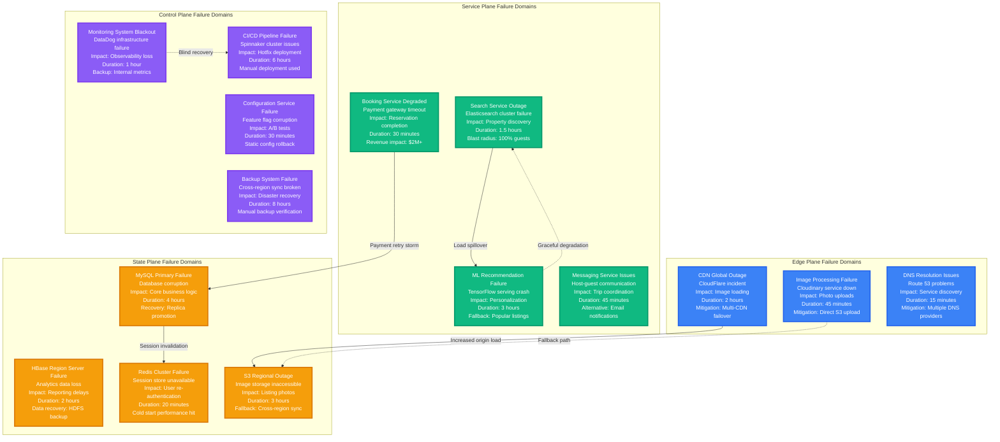
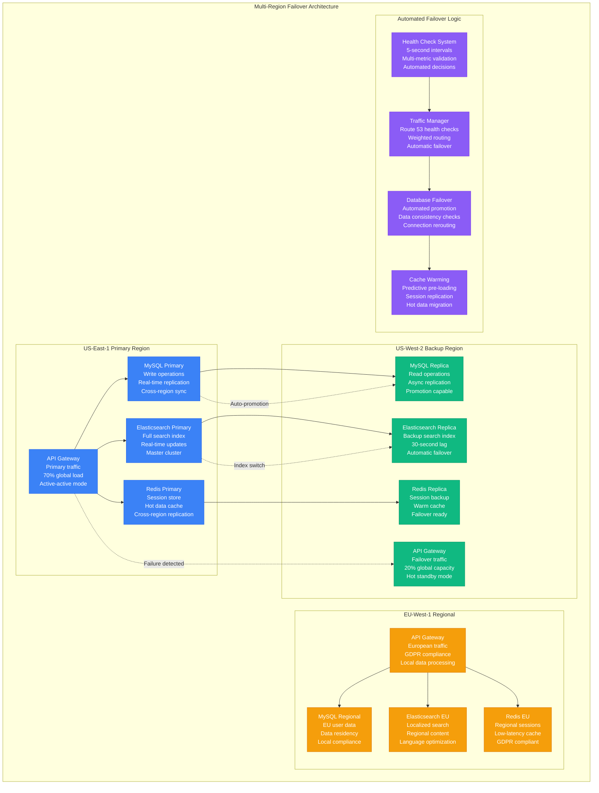
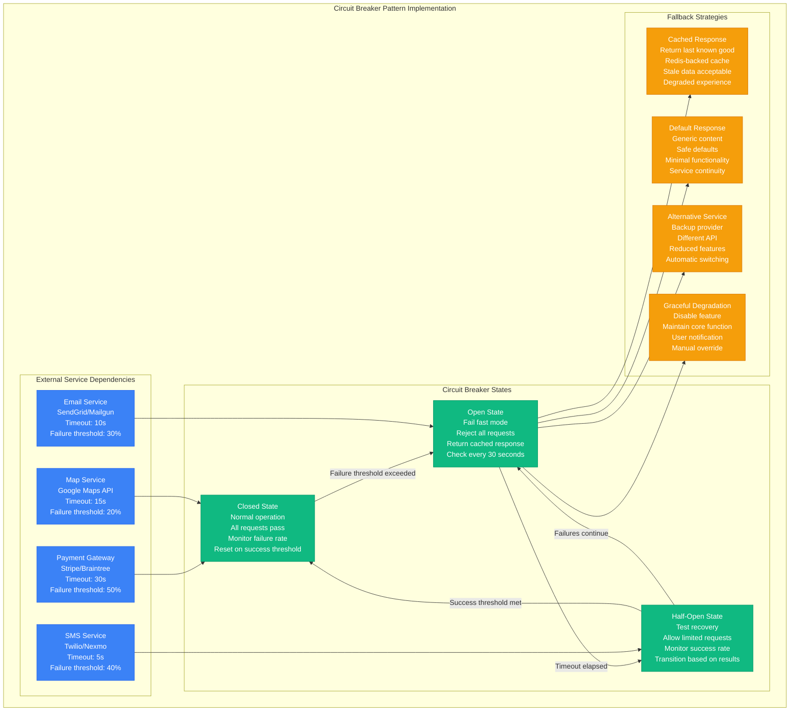

# Airbnb - Failure Domains & Incident Response

## Production Resilience: Managing Global Marketplace Reliability

Airbnb's failure domain architecture is designed around real marketplace scenarios where any service degradation directly impacts millions of travelers and hosts worldwide.



## Major Incident Case Study: June 2019 Search Outage

### Timeline: Complete Search Service Failure

**14:23 PST**: Elasticsearch cluster upgrade begins (planned maintenance)
**14:35 PST**: Primary search index becomes corrupted during rolling upgrade
**14:37 PST**: Search queries return zero results globally
**14:39 PST**: Incident declared - complete search functionality loss
**14:45 PST**: Traffic spike as users retry searches, cascading to recommendation service
**15:10 PST**: Emergency rollback initiated to previous Elasticsearch version
**15:45 PST**: Index rebuild begins from MySQL master data
**16:30 PST**: Partial search functionality restored (50% of listings)
**17:15 PST**: Full search functionality restored globally

```mermaid
timeline
    title June 2019 Search Outage - $8M Revenue Impact

    14:23 : Planned Upgrade
          : Elasticsearch 6.8 → 7.0
          : Rolling upgrade strategy
          : Expected 15-minute window

    14:35 : Index Corruption
          : Mapping incompatibility
          : Shard allocation failure
          : Zero search results

    14:39 : Incident Declaration
          : P0 incident declared
          : War room activated
          : Engineering teams mobilized

    14:45 : Cascade Failure
          : Recommendation service overload
          : User retry storm
          : API gateway throttling

    15:10 : Emergency Rollback
          : Elasticsearch downgrade
          : Data consistency checks
          : Service restart sequence

    15:45 : Index Rebuild
          : MySQL data export
          : Parallel index creation
          : Gradual traffic restoration

    17:15 : Full Recovery
          : All services operational
          : Performance normalized
          : Post-incident review scheduled
```

**Impact Analysis:**
- **Revenue Loss**: $8M in bookings during 4-hour outage
- **User Impact**: 100% of guests unable to search properties
- **Geographic Scope**: Global outage affecting all markets
- **Recovery Strategy**: Complete rollback + index rebuild (52 minutes)

## Failure Domain Mitigation Architecture

### Multi-Region Resilience Strategy



### Circuit Breaker Implementation



## Incident Response Procedures

### Severity Classification & Response

```mermaid
graph TB
    subgraph IncidentSeverity[Incident Severity Classification]
        subgraph P0Incidents[P0 - Critical Service Down]
            P0Criteria[P0 Criteria<br/>Booking flow broken<br/>Payment processing down<br/>Global search failure<br/>Data corruption detected]

            P0Response[P0 Response<br/>Immediate escalation<br/>War room activation<br/>Executive notification<br/>All hands on deck]

            P0SLA[P0 SLA<br/>Response: 5 minutes<br/>Update: Every 15 minutes<br/>Resolution: 2 hours<br/>Post-mortem: 48 hours]
        end

        subgraph P1Incidents[P1 - Major Degradation]
            P1Criteria[P1 Criteria<br/>High error rates<br/>Performance degradation<br/>Regional outages<br/>Feature unavailable]

            P1Response[P1 Response<br/>Primary team activation<br/>On-call escalation<br/>Manager notification<br/>Focused response]

            P1SLA[P1 SLA<br/>Response: 15 minutes<br/>Update: Every 30 minutes<br/>Resolution: 4 hours<br/>Post-mortem: 72 hours]
        end

        subgraph P2Incidents[P2 - Minor Issues]
            P2Criteria[P2 Criteria<br/>Isolated failures<br/>Non-critical features<br/>Performance slowdown<br/>Monitoring alerts]

            P2Response[P2 Response<br/>Standard on-call<br/>Business hours priority<br/>Team lead notification<br/>Normal procedures]

            P2SLA[P2 SLA<br/>Response: 1 hour<br/>Update: Daily<br/>Resolution: 24 hours<br/>Post-mortem: Optional]
        end
    end

    subgraph EscalationPaths[Escalation Paths]
        OnCallEngineer[On-Call Engineer<br/>First responder<br/>Initial assessment<br/>Immediate actions<br/>Status updates]

        TeamLead[Team Lead<br/>Technical guidance<br/>Resource coordination<br/>Escalation decisions<br/>Communication hub]

        IncidentCommander[Incident Commander<br/>Overall coordination<br/>External communication<br/>Resource allocation<br/>Decision authority]

        ExecutiveTeam[Executive Team<br/>Business impact<br/>PR coordination<br/>Customer communication<br/>Strategic decisions]
    end

    P0Criteria --> P0Response
    P0Response --> P0SLA
    P1Criteria --> P1Response
    P1Response --> P1SLA
    P2Criteria --> P2Response
    P2Response --> P2SLA

    %% Escalation flow
    OnCallEngineer --> TeamLead
    TeamLead --> IncidentCommander
    IncidentCommander --> ExecutiveTeam

    %% Cross-severity escalation
    P2Response -.->|Escalation needed| P1Response
    P1Response -.->|Major impact| P0Response

    classDef p0Style fill:#8B5CF6,stroke:#7C3AED,color:#fff
    classDef p1Style fill:#F59E0B,stroke:#D97706,color:#fff
    classDef p2Style fill:#10B981,stroke:#059669,color:#fff
    classDef escalationStyle fill:#3B82F6,stroke:#2563EB,color:#fff

    class P0Criteria,P0Response,P0SLA p0Style
    class P1Criteria,P1Response,P1SLA p1Style
    class P2Criteria,P2Response,P2SLA p2Style
    class OnCallEngineer,TeamLead,IncidentCommander,ExecutiveTeam escalationStyle
```



## Business Impact Analysis

### Revenue Impact by Failure Type

**Critical Service Failures (P0)**:
- **Search Service Down**: $2M/hour (zero new bookings)
- **Payment Processing Failure**: $1.5M/hour (existing bookings lost)
- **Database Corruption**: $3M/hour + recovery costs
- **Global CDN Outage**: $500K/hour (user experience degradation)

**Regional Service Degradation (P1)**:
- **Single Region Down**: $400K/hour (20% traffic impact)
- **Mobile App Issues**: $600K/hour (60% mobile traffic)
- **Messaging Service Down**: $200K/hour (trip coordination issues)
- **Recommendation Engine Failure**: $100K/hour (conversion reduction)

### Customer Experience Impact

**Trust & Safety Implications**:
- **Identity Verification Down**: New host onboarding blocked
- **Review System Failure**: Trust signals unavailable
- **Fraud Detection Offline**: Increased risk exposure
- **Background Checks Failed**: Safety compliance issues

**Host Business Impact**:
- **Calendar Sync Issues**: Double booking risks
- **Pricing Tool Failure**: Revenue optimization lost
- **Payout Delays**: Cash flow problems for hosts
- **Analytics Unavailable**: Business decision delays

This comprehensive failure domain architecture enables Airbnb to maintain marketplace reliability while minimizing the business impact of inevitable infrastructure failures across the global platform.